# 子奇老師奇門遁甲授課講義｜完整知識庫

> **📋 全書摘要**
> **摘要**：本檔為子奇老師（幸福能量風水事務所／東方數術聯盟）「道家陰盤奇門遁甲」系列授課講義的逐頁謄寫，依序收錄初級班（奇門簡介、易學基礎、認識盤中符號、12 步排盤法）、中級班（奇門四害、伏反吟、翻宮法、應期、內外盤；八卦／十天干／九星／八門／八神的完整類象表與總表）、高級班（五種取用神法；婚姻感情、事業、考試、求財分類占卜）與大師研究班 v1.5（秘傳取用神、象法心要、占法總訣與斷局二十法訣、化解增運的行為風水／環境風水／奇門擇吉），並附 56 則實戰案例排盤。所有排盤皆轉為九宮表格（八神／天盤干 星／地盤干 門，另記引干、空亡、馬星）。
> **關鍵字**：陰盤奇門, 子奇老師, 排盤佈星, 符號類象, 取用神, 分類占卜, 斷局二十法訣, 奇門佈局

> **⚠️ 使用說明與原檔狀況**
> - 原 PDF 為掃描檔，文字層只有轉售者浮水印；本檔所有文字皆由逐頁看圖謄寫。轉售浮水印出現處以「〔轉售浮水印，略〕」標示。
> - 原檔缺頁：高級班講義第 117 頁（學業考試一、二）未包含；高級班在「求財買賣」後中斷，未見健康疾病、陽宅風水；大師研究班目錄所列「尋時借運」「大氣造運術」未出現。
> - 講義本身的筆誤或前後不一（如陽六局／陽三局、時支辰／未、值符五行甲木／土等）皆照原文錄入並加註，未擅改。
> - 被遮蔽、塗白、過淡或無法辨識之處標為「圖中未能辨識」；前手使用者的手寫圈記另行註明。
> - 漫畫、動畫與網頁引文僅以摘要記錄。

## 📚 各章摘要（依頁碼）

> **📋 第一章 奇門遁甲簡介（第 1–16 頁，投影片 1–30）**
> **摘要**：介紹奇門遁甲的緣起（三式之首、帝王之學、《煙波釣叟歌》源流）、道家陰盤奇門與陽盤奇門的差別及三大應用（占卜預測、移星換斗風水調理、擇時辦方），再以天球與分層盤說明「宇宙時空模型」、以量子纏繞與霍金斯肌肉測試類比「萬物相干論」，最後釋義三奇六儀、六十甲子旬首與「甲遁於六儀」。含多張實例排盤。
> **關鍵字**：奇門遁甲緣起, 道家陰盤奇門, 移星換斗, 宇宙時空模型, 萬物相干論, 三奇六儀, 六十甲子旬首, 甲遁六儀

> **📋 第二章 奇門遁甲的基礎知識（第 17–22 頁，投影片 31–42）**
> **摘要**：整理排盤與斷盤所需的易學基礎：河圖洛書口訣與紫白九星、先後天八卦與後天九宮數、五行生剋、十天干的陰陽／五行／方位／相合，十二地支的陰陽、五行、方位、四季、月份、時辰、六合、六沖、三合、三刑與生肖，以及天干十二長生總表。
> **關鍵字**：河圖洛書, 先後天八卦, 九宮, 五行生剋, 天干相合, 地支六合六沖, 三合三刑, 十二長生

> **📋 第三章 認識奇門符號（第 23–54 頁，投影片 43–105）**
> **摘要**：依地盤八卦九宮、三奇六儀、天盤九星、人盤八門、神盤八神的順序認識盤中符號。地盤九宮代表「地利」，以日干落宮定位問測者並列出八卦落宮狀態；三奇六儀代表「實質的這個人」，附十天干意象、最常用意涵表與符號角色關係圖（八神＝觀念、九星＝性質、八門＝狀態、宮位＝客觀環境、天地盤干＝遭遇情境）；天盤九星代表「天時」；人盤八門代表「人和」（三吉門、三凶門、平門）；神盤八神代表「神助」，以四神獸引入，逐一列出值符、螣蛇、太陰、六合、白虎、玄武、九地、九天的五行、吉凶、特徵、人物與個性。
> **關鍵字**：地盤八卦九宮, 八卦類象, 十天干意涵, 符號角色關係, 天盤九星, 人盤八門, 神盤八神, 四神獸

> **📋 第四章 排盤佈星（第 54–64 頁，投影片 106–126）**
> **摘要**：完整的 12 步排盤法：排四柱、定局（陽遁陰遁；局數＝年支序＋農曆月＋農曆日＋時支序除 9 取餘）、畫九宮格、佈地盤三奇六儀（陽順陰逆、戊落局數宮）、找旬首（符頭）、定值符值使、佈天盤三奇六儀與九星（旬首／值符隨時干轉）、佈神盤八神、佈人盤八門（值使依飛宮數至用時、再順時針填門）、排引干、標空亡與馬星。以 2015/2/3 14:30 陽六局為貫穿範例，最後附一張 2015/2/5 17 時陽二局的 8 步流程總工作表。原講義範例盤頭有「陽六局／陽三局」前後不一與「時支辰／未」筆誤，已照錄並加註。
> **關鍵字**：排盤佈星, 排四柱, 定局公式, 旬首符頭, 值符值使, 旬首隨時干轉, 引干, 空亡馬星

> **📋 空白練習表與第 II 冊封面（第 65–66 頁）**
> **摘要**：第 65 頁為兩份空白排盤練習工作表（格式同第 64 頁流程表）；第 66 頁起為講義第 II 冊「子奇老师奇门遁甲课程 初中高阶讲义Ⅱ」（主辦方：東方數術聯盟），內容轉入中級班。
> **關鍵字**：排盤練習表, 講義第二冊, 東方數術聯盟, 中級班

> **📋 中級班 一、奇門遁甲斷事訣竅（第 67–75 頁，中級班投影片 1–18）**
> **摘要**：奇門四害——入墓（力量剩 20%，附天干入墓表）、擊刑（六儀擊刑位置，力量減半）、門迫（門剋宮，力量減半）、空亡（信息轉移 80%，須轉宮；近空斷看本宮先天卦、遠空斷看本卦先天位置）；伏吟（停滯、主慢）與返吟（反覆、主快）及星／門／干之分；奇門翻宮法（用神天地盤互翻，往前往後各查三步看前因後果）；斷應期（值、沖、合、生剋用神宮之時）；內外盤（陽遁一八三四為內、近、快，九二七六為外、遠、慢）。
> **關鍵字**：奇門四害, 入墓, 擊刑, 門迫, 空亡轉宮, 伏吟返吟, 翻宮法, 斷應期, 內外盤

> **📋 中級班 二、奇門符號象意精解（第 76–105 頁）**
> **摘要**：以詳細類象表逐一精解盤中符號。八卦九宮代表地利（八卦類象表＋八卦人體內臟總表）；三奇六儀代表人的狀態（甲至癸十天干類象表＋十天干象意總表，含形音義、專有用神、格局專有名稱與天干臟腑圖）；九星代表天時（八星類象表含吉凶與疾病特性＋九星總表與專有用神）；八門代表人和（八門類象表含疾病狀態＋八門總表與專有用神，如生門財運、開門文職工作、杜門武職工作、景門考試合同）；八神代表神助（值符、騰蛇、太陰、六合、白虎、玄武、九地、九天類象表，含疾病特性如白虎病入膏肓、玄武治療不對症、九天陽症九地陰症）。本段可補足初級班被遮蔽的戊、天蓬類象表。
> **關鍵字**：八卦類象表, 十天干總表, 九星總表, 八門總表, 八神類象表, 專有用神, 格局專有名稱, 疾病特性

> **📋 中級班收尾與空白頁（第 105–108 頁）**
> **摘要**：第 105 頁為八神象意總表（含專有用神，如值符金榜題名、玄武被盜被騙、九地落榜、九天考高分）；第 106–108 頁為只有印章與浮水印的空白頁。
> **關鍵字**：八神總表, 專有用神, 空白頁

> **📋 高級班 一、奇門遁甲取用神（第 109–112 頁，高級班投影片 1–8）**
> **摘要**：五種取用神法——四柱取用神（年干父母、月干兄弟朋友、日干自己、時干子女，以陰陽同異分同性異性）、六親十神取用神（六親與十神生剋圖）、年命取用神（西元出生年尾數減 3 得天干序數）、方位取用神（預測師坐中宮面離背坎）、報數或編號取用神（小於 9 直取宮數，大於 9 除九取餘）。
> **關鍵字**：取用神, 四柱六親, 十神生剋, 年命速求法, 方位取用神, 報數取用神

> **📋 高級班 二、奇門遁甲分類占卜（第 113–121 頁）**
> **摘要**：分類占卜六大類（婚姻感情、事業策劃、學業考試、求財買賣、健康疾病、陽宅風水）。完成婚姻感情（配偶系統、情人系統、婚戀符號、不利與有利格局、宮位生剋加符號相連判讀）、事業策劃（人事取法、判斷法則、犯小人、升遷調動）、學業考試判斷法則（值符金榜題名、九天高分、九地落榜、玄武與四害考不好）、求財買賣用神開頭。注意：此掃描檔缺原講義第 117 頁（學業考試一、二），高級班講義在求財買賣用神之後中斷，未見健康疾病與陽宅風水內容。
> **關鍵字**：分類占卜, 婚姻感情, 配偶系統, 情人系統, 事業策劃, 犯小人, 學業考試, 求財買賣

> **📋 大師研究班（第 122–206 頁）**
> **摘要**：「【子奇老師】奇門遁甲授課講義（大師研究班 v1.5）」。首頁技法心法總整理。I 秘傳取用神技法：取用神點竅、身命定位、時干第二用神、專用神、六親爻義。II 秘傳象法心要：象意五法、六大類象、天干格局表、干宮通象、象意定位心法（起心動念、無極生太極；單象不論事至四象為一元；疊象連象）、象意組合、重覆取象；實戰案例 1–18（每案附排盤與解題提示：感情走向、挽回婚姻、老公離職合夥、婆媳不合、套房投資、朋友失聯、小三、催子局、工廠經營、升官、闖紅燈、錢不見、客戶談判、出差印度、工作升官、項目合作）。III 秘傳占斷法訣：占法總訣（動靜是因、生剋沖合是象、吉凶是果；定位→定象→入局→縱觀70%→橫比30%；日干、時干與用神之間的生剋較兇：生助、比扶、剋制、脫盜各主何象）；占法總訣實戰解析（案例 19–23：轉行做命理風水、問工作、調薪、投資、玄學教學事業，示範 Case A 用神落動處坐實、Case B 用神未落動處改以生門／時干／日干落宮為太極點做縱觀與橫比，及由外往內連續相生的「遞生格」）；斷局二十法訣（動、靜、旺、衰、損、益、進、退、沖、合、連、屬、刑、空、墓、破、夾、照、伏、反）逐條說明：動（四綱、日干時干、旺動、馬星動、空亡動、沖動、對宮、方動）、靜；旺衰（九宮旺衰訣以時令論旺相休囚死；天干旺衰訣分得地〔十二長生各狀態象意：長生、沐浴、冠帶、臨官、帝旺、衰、病、死、墓〔入庫與入墓之別〕、絕、胎、養〕與得時〔月令〕；九星、八門、八神旺衰訣；空間為主、時間為輔），並附旺衰案例 24–26（美容產品投資、換工作時機、升遷機會）；損益（洩我耗我制我／生我旺我，附「宮位之間五行生剋」對待關係表——我去生你＝喜歡、追求、付出、被洩氣，我去剋你＝排斥、管束、壓制、被耗氣，比合＝合住、合絆、拖拉，及快慢排序的過程關係表）；進退（進退符號歸類與格局表）；沖合（沖則散、合則合住，求財感情喜合怕沖、疾病官司喜沖怕合；沖合符號歸類表），附案例 27–36（多為以新法訣重看前面的盤）；連、屬（同屬＝通氣、心裡想著）、刑、空、墓、迫、夾（鄰宮）、照（對宮：答案往往在對宮）、伏（停滯冷戰）、反（反覆猶豫），附夾照案例 37–38。IV 奇門運籌：化解增運秘法——奇門改運造運術（打造官運財運婚姻美滿的「奇門新生活」：一年一次家居風水、每日吉時出行沐氣、年內吉月旅遊改運；遇問題以行為風水、環境風水、奇門擇吉化解）、時盤應用總整理（陰盤預測盤找癥結化解、陽盤用時盤找有利時空）、行為風水（人和）原理與十天干行為風水對照表、環境風水（地利）：以《一人之下》「風后奇門」引入，拆、添、換（天干格局／換門／移神換位）、沖、合五法；佈局案例 39–56（考試文昌局、催桃花、店面轉讓、投資、工作運、催子、挽回婚姻、開刀、升主管、遠距戀愛、劈腿復合、鼠患、追求對象、客戶流失）；奇門擇吉（天時）：擇方（三吉門與三奇相會最佳、吉門比三奇重要、八門各自宜忌）、擇日（問事局以天干落宮為主、擇日重天干擇時重地支、各類事務選門：開業開門、工廠生門、酒店景門、談判傷門、結婚六合等）、通關運用（扶勝於制、找通關宮的人或方位、考慮旺衰時機）。講義至此結束，目錄所列「尋時借運」「大氣造運術」未出現在本掃描檔。
> **關鍵字**：大師研究班, 取用神點竅, 象意定位, 疊象連象, 案例練習, 占法總訣, 縱觀橫比, 日時干用神較兇, 遞生格, 斷局二十法訣, 旺衰訣, 十二長生象意, 損益對待關係, 進退沖合, 夾照伏反, 奇門運籌, 行為風水, 環境風水五法, 奇門擇吉, 通關運用

---

# 📊 逐頁謄寫與圖像解讀（依頁碼）

## 圖 01 — 第 1 頁（1200x1561）｜🖼 圖片（開圖判斷：圖表細看／裝飾照簡述）

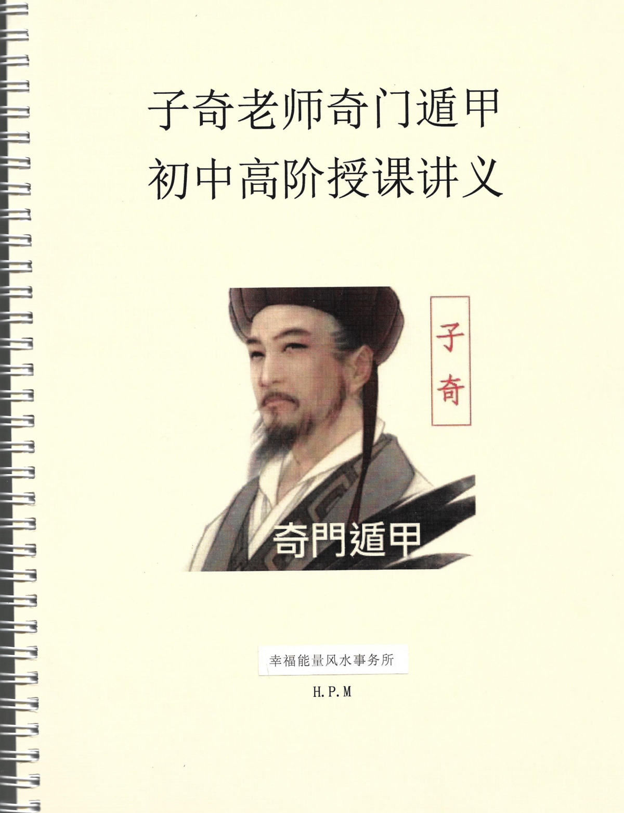

> **🖼 圖像解讀**　｜　檢視狀態：✅ 已檢視
> - **類型**：封面（照片＋文字）
> - **內容**：講義封面：標題「子奇老师奇门遁甲 初中高阶授课讲义」，中央為古裝人物畫像，旁有紅色「子奇」印章，下方標示出版單位「幸福能量风水事务所 H.P.M」。
> - **原文出處（逐字）**：子奇老师奇门遁甲 初中高阶授课讲义／幸福能量风水事务所 H.P.M
> - **可檢索關鍵字**：子奇老師, 奇門遁甲, 授課講義, 初中高階, 幸福能量風水事務所, HPM

**📝 逐字謄寫（第 1 頁）**

# 子奇老师奇门遁甲 初中高阶授课讲义

（封面人物畫像，印章：子奇；圖上文字：奇門遁甲）

幸福能量风水事务所
H.P.M

## 圖 02 — 第 2 頁（1200x1561）｜🖼 圖片（開圖判斷：圖表細看／裝飾照簡述）

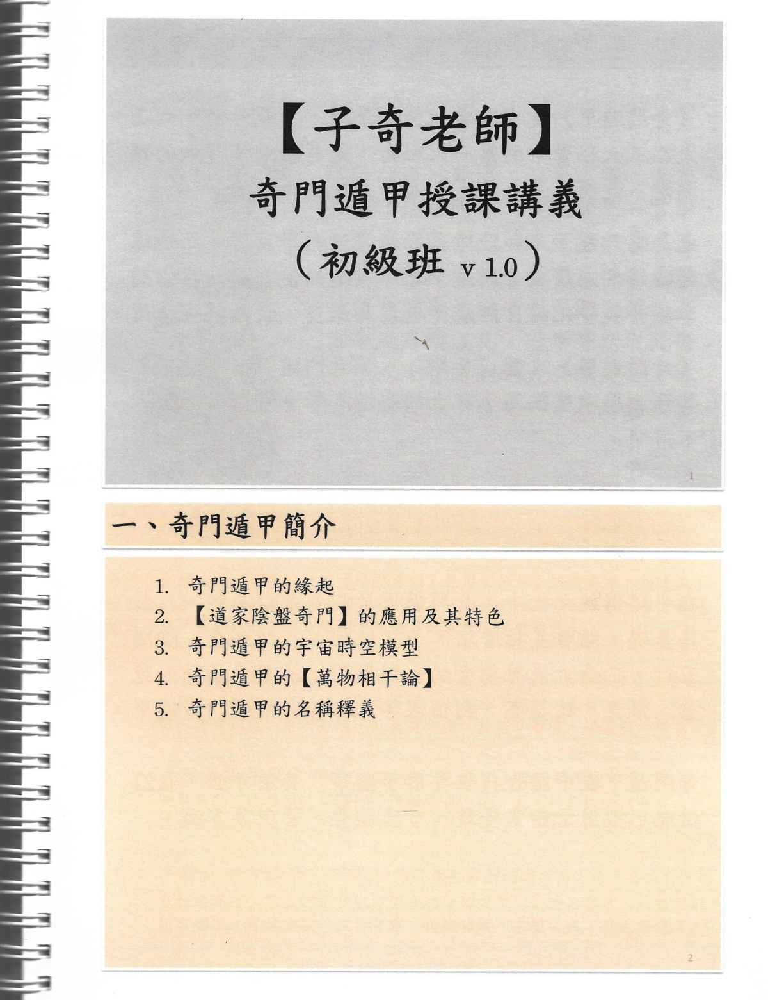

> **🖼 圖像解讀**　｜　檢視狀態：✅ 已檢視
> - **類型**：文字頁（投影片 1–2）
> - **內容**：初級班講義標題頁與第一章「奇門遁甲簡介」目錄，列出五個小節：緣起、道家陰盤奇門的應用及特色、宇宙時空模型、萬物相干論、名稱釋義。
> - **原文出處（逐字）**：【子奇老師】奇門遁甲授課講義（初級班 v1.0）
> - **可檢索關鍵字**：初級班, 奇門遁甲簡介, 道家陰盤奇門, 宇宙時空模型, 萬物相干論, 名稱釋義

**📝 逐字謄寫（第 2 頁）**

### 【子奇老師】奇門遁甲授課講義（初級班 v1.0）

### 一、奇門遁甲簡介

1. 奇門遁甲的緣起
2. 【道家陰盤奇門】的應用及其特色
3. 奇門遁甲的宇宙時空模型
4. 奇門遁甲的【萬物相干論】
5. 奇門遁甲的名稱釋義

## 圖 03 — 第 3 頁（1200x1561）｜🖼 圖片（開圖判斷：圖表細看／裝飾照簡述）

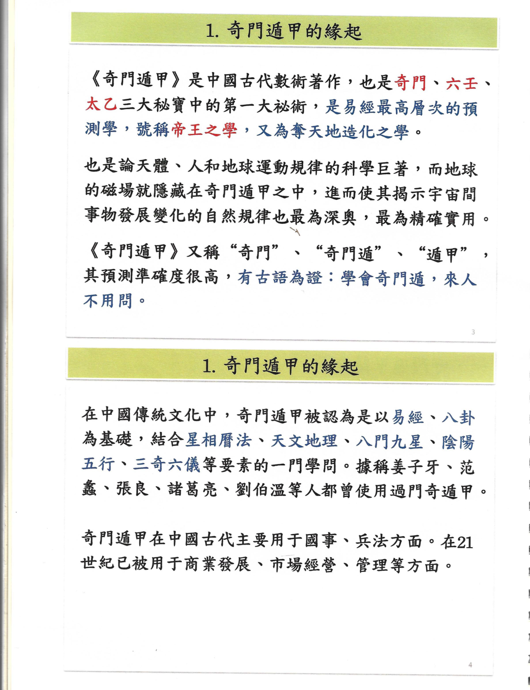

> **🖼 圖像解讀**　｜　檢視狀態：✅ 已檢視
> - **類型**：文字頁（投影片 3–4）
> - **內容**：說明奇門遁甲的緣起：與六壬、太乙並稱三大秘術、號稱帝王之學；以易經八卦為基礎，結合星相曆法、八門九星、陰陽五行、三奇六儀；古代用於國事兵法，現代用於商業與管理。
> - **原文出處（逐字）**：1. 奇門遁甲的緣起
> - **可檢索關鍵字**：奇門遁甲緣起, 三式, 六壬, 太乙, 帝王之學, 三奇六儀, 八門九星, 商業應用

**📝 逐字謄寫（第 3 頁）**

### 1. 奇門遁甲的緣起

《奇門遁甲》是中國古代數術著作，也是奇門、六壬、太乙三大秘寶中的第一大祕術，是易經最高層次的預測學，號稱帝王之學，又為奪天地造化之學。

也是論天體、人和地球運動規律的科學巨著，而地球的磁場就隱藏在奇門遁甲之中，進而使其揭示宇宙間事物發展變化的自然規律也最為深奧，最為精確實用。

《奇門遁甲》又稱“奇門”、“奇門遁”、“遁甲”，其預測準確度很高，有古語為證：學會奇門遁，來人不用問。

### 1. 奇門遁甲的緣起

在中國傳統文化中，奇門遁甲被認為是以易經、八卦為基礎，結合星相曆法、天文地理、八門九星、陰陽五行、三奇六儀等要素的一門學問。據稱姜子牙、范蠡、張良、諸葛亮、劉伯溫等人都曾使用過門奇遁甲。

奇門遁甲在中國古代主要用于國事、兵法方面。在21世紀已被用于商業發展、市場經營、管理等方面。

## 圖 04 — 第 4 頁（1200x1561）｜🖼 圖片（開圖判斷：圖表細看／裝飾照簡述）

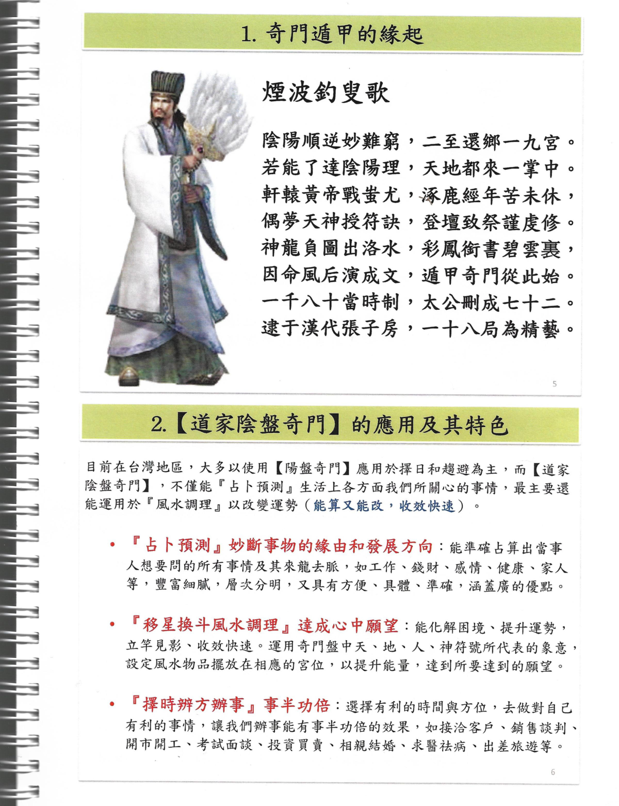

> **🖼 圖像解讀**　｜　檢視狀態：✅ 已檢視
> - **類型**：文字頁＋人物插圖（投影片 5–6）
> - **內容**：投影片 5 收錄古訣《煙波釣叟歌》開頭八句（奇門源自黃帝戰蚩尤、風后演文、太公刪成七十二局、張子房精為十八局）；投影片 6 說明道家陰盤奇門與台灣常見陽盤奇門的差別，及三大應用：占卜預測、移星換斗風水調理、擇時辦方辦事。
> - **原文出處（逐字）**：1. 奇門遁甲的緣起／煙波釣叟歌；2.【道家陰盤奇門】的應用及其特色
> - **可檢索關鍵字**：煙波釣叟歌, 陰盤奇門, 陽盤奇門, 占卜預測, 移星換斗, 風水調理, 擇時辦方, 十八局

**📝 逐字謄寫（第 4 頁）**

### 1. 奇門遁甲的緣起

（左側為古代軍師人物插圖）

**煙波釣叟歌**

陰陽順逆妙難窮，二至還鄉一九宮。
若能了達陰陽理，天地都來一掌中。
軒轅黃帝戰蚩尤，涿鹿經年苦未休，
偶夢天神授符訣，登壇致祭謹虔修。
神龍負圖出洛水，彩鳳銜書碧雲裏，
因命風后演成文，遁甲奇門從此始。
一千八十當時制，太公刪成七十二。
逮于漢代張子房，一十八局為精藝。

### 2.【道家陰盤奇門】的應用及其特色

目前在台灣地區，大多以使用【陽盤奇門】應用於擇日和趨避為主，而【道家陰盤奇門】，不僅能『占卜預測』生活上各方面我們所關心的事情，最主要還能運用於『風水調理』以改變運勢（能算又能改，收效快速）。

- **『占卜預測』妙斷事物的緣由和發展方向**：能準確占算出當事人想要問的所有事情及其來龍去脈，如工作、錢財、感情、健康、家人等，豐富細膩，層次分明，又具有方便、具體、準確，涵蓋廣的優點。
- **『移星換斗風水調理』達成心中願望**：能化解困境、提升運勢，立竿見影、收效快速。運用奇門盤中天、地、人、神符號所代表的象意，設定風水物品擺放在相應的宮位，以提升能量，達到所要達到的願望。
- **『擇時辦方辦事』事半功倍**：選擇有利的時間與方位，去做對自己有利的事情，讓我們辦事能有事半功倍的效果，如接洽客戶、銷售談判、開市開工、考試面談、投資買賣、相親結婚、求醫祛病、出差旅遊等。

## 圖 05 — 第 5 頁（1200x1561）｜🖼 圖片（開圖判斷：圖表細看／裝飾照簡述）

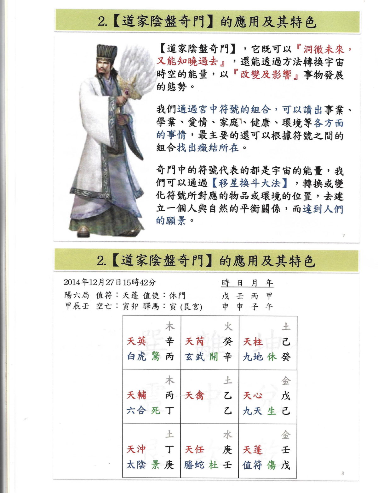

> **🖼 圖像解讀**　｜　檢視狀態：✅ 已檢視
> - **類型**：文字頁＋奇門盤圖表（投影片 7–8）
> - **內容**：投影片 7 說明陰盤奇門可知過去未來、以宮中符號組合讀出各方面事情並找出癥結，並以【移星換斗大法】調整環境；投影片 8 為一張實例奇門盤：2014年12月27日15時42分，陽六局，值符天蓬、值使休門，甲辰壬，空亡寅卯，驛馬寅（艮宮），四柱甲午年丙子月壬申日戊申時。
> - **原文出處（逐字）**：2.【道家陰盤奇門】的應用及其特色；盤頭「2014年12月27日15時42分 陽六局 值符：天蓬 值使：休門 甲辰壬 空亡：寅卯 驛馬：寅(艮宮)」
> - **可檢索關鍵字**：陰盤奇門, 移星換斗大法, 奇門盤範例, 陽六局, 值符天蓬, 值使休門, 九宮排盤, 四柱

**📝 逐字謄寫（第 5 頁）**

### 2.【道家陰盤奇門】的應用及其特色

（左側為古代軍師人物插圖）

【道家陰盤奇門】，它既可以『洞徹未來，又能知曉過去』，還能透過方法轉換宇宙時空的能量，以『改變及影響』事物發展的態勢。

我們通過宮中符號的組合，可以讀出事業、學業、愛情、家庭、健康、環境等各方面的事情，最主要的還可以根據符號之間的組合找出癥結所在。

奇門中的符號代表的都是宇宙的能量，我們可以通過【移星換斗大法】，轉換或變化符號所對應的物品或環境的位置，去建立一個人與自然的平衡關係，而達到人們的願景。

### 2.【道家陰盤奇門】的應用及其特色（排盤範例）

2014年12月27日15時42分
陽六局　值符：天蓬　值使：休門
甲辰壬　空亡：寅卯　驛馬：寅(艮宮)

| 時 | 日 | 月 | 年 |
|---|---|---|---|
| 戊申 | 壬申 | 丙子 | 甲午 |

九宮盤（每格：五行／九星 天盤干／八神 八門 地盤干；背景淡字為宮名）：

| 巽（木） | 離（火） | 坤（土） |
|---|---|---|
| 天英 辛 白虎 驚 丙 | 天芮 癸 玄武 開 辛 | 天柱 己 九地 休 癸 |
| **震（木）** | **中（土）** | **兌（金）** |
| 天輔 丙 六合 死 丁 | 天禽 乙 乙 | 天心 戊 九天 生 己 |
| **艮（土）** | **坎（水）** | **乾（金）** |
| 天沖 丁 太陰 景 庚 | 天任 庚 螣蛇 杜 壬 | 天蓬 壬 值符 傷 戊 |

## 圖 06 — 第 6 頁（1200x1561）｜🖼 圖片（開圖判斷：圖表細看／裝飾照簡述）

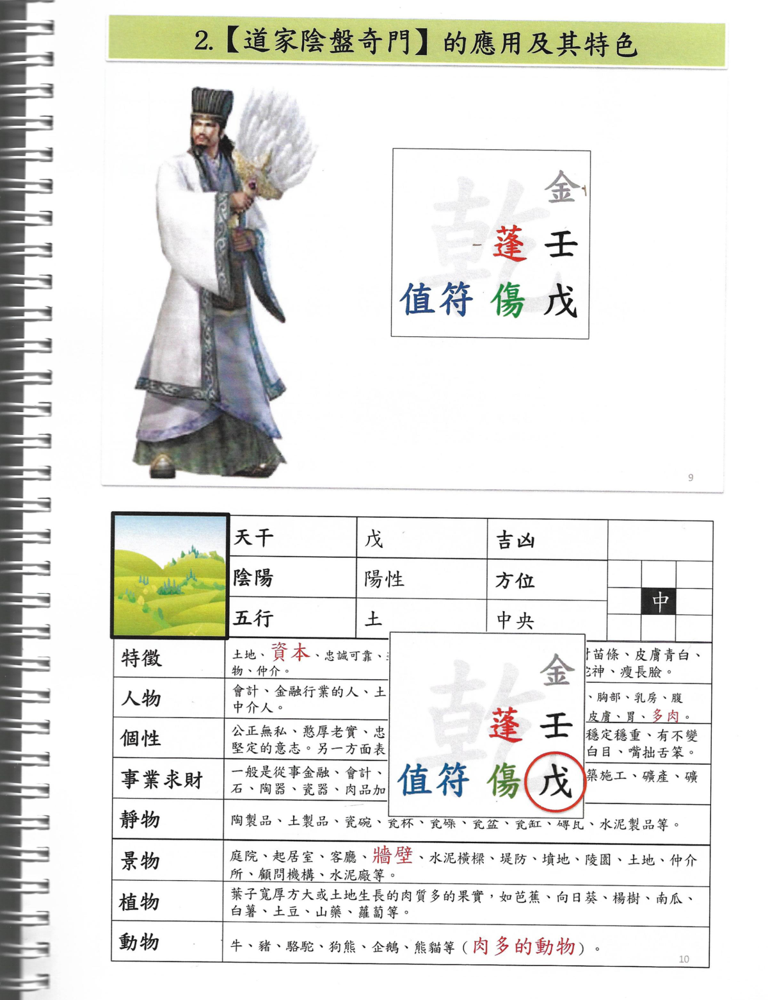

> **🖼 圖像解讀**　｜　檢視狀態：✅ 已檢視
> - **類型**：人物插圖＋類象表格（投影片 9–10）
> - **內容**：投影片 9 以乾宮「金／蓬 壬／值符 傷 戊」一格示範如何逐一解讀宮中符號；投影片 10 為天干「戊」的類象表（陽性、五行土、方位中央），列特徵、人物、個性、事業求財、靜物、景物、植物、動物；表格右側部分被疊放的乾宮小圖遮住。
> - **原文出處（逐字）**：2.【道家陰盤奇門】的應用及其特色；表頭「天干 戊／陰陽 陽性／五行 土／方位 中央」
> - **可檢索關鍵字**：乾宮, 天蓬, 值符, 傷門, 天干戊, 戊土類象, 資本, 牆壁

**📝 逐字謄寫（第 6 頁）**

### 2.【道家陰盤奇門】的應用及其特色

（左側古代軍師插圖；右側為乾宮單宮示意）

乾宮：金｜蓬 壬｜值符 傷 戊

### 天干「戊」類象表（投影片 10）

| 項目 | 內容 |
|---|---|
| 天干 | 戊 |
| 陰陽 | 陽性 |
| 五行 | 土 |
| 吉凶 | （空白） |
| 方位 | 中央 |
| 特徵 | 土地、資本、忠誠可靠、……物、仲介。〔中段被圖遮住，圖中未能辨識〕……苗條、皮膚青白、……神、瘦長臉。 |
| 人物 | 會計、金融行業的人、土……中介人。〔中段遮蔽〕……、胸部、乳房、腹……皮膚、胃、多肉。 |
| 個性 | 公正無私、憨厚老實、忠……堅定的意志。另一方面表……〔中段遮蔽〕……穩定穩重、有不變……白目、嘴拙舌笨。 |
| 事業求財 | 一般是從事金融、會計、……石、陶器、瓷器、肉品加……〔中段遮蔽〕……築施工、礦產、礦 |
| 靜物 | 陶製品、土製品、瓷碗、瓷杯、瓷碟、瓷盆、瓷缸、磚瓦、水泥製品等。 |
| 景物 | 庭院、起居室、客廳、牆壁、水泥橫樑、堤防、墳地、陵園、土地、仲介所、顧問機構、水泥廠等。 |
| 植物 | 葉子寬厚方大或土地生長的肉質多的果實，如芭蕉、向日葵、楊樹、南瓜、白薯、土豆、山藥、蘿蔔等。 |
| 動物 | 牛、豬、駱駝、狗熊、企鵝、熊貓等（肉多的動物）。 |

（投影片上疊放乾宮小圖，「戊」字被圈起，表示本表對應該宮地盤干戊。）

## 圖 07 — 第 7 頁（1200x1561）｜🖼 圖片（開圖判斷：圖表細看／裝飾照簡述）

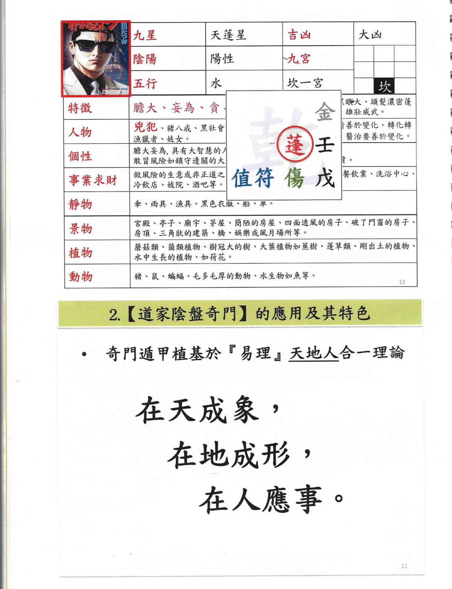

> **🖼 圖像解讀**　｜　檢視狀態：✅ 已檢視
> - **類型**：類象表格＋文字頁（投影片 11–12）
> - **內容**：投影片 11 為九星「天蓬星」類象表（陽性、五行水、坎一宮、大凶），列特徵、人物、個性、事業求財、靜物、景物、植物、動物，部分欄位被乾宮小圖遮住；投影片 12 點出奇門遁甲植基於易理天地人合一：在天成象、在地成形、在人應事。
> - **原文出處（逐字）**：九星 天蓬星／吉凶 大凶／五行 水／九宮 坎一宮；2.【道家陰盤奇門】的應用及其特色
> - **可檢索關鍵字**：天蓬星, 坎一宮, 大凶, 九星類象, 天地人合一, 在天成象, 在地成形, 在人應事

**📝 逐字謄寫（第 7 頁）**

### 九星「天蓬星」類象表（投影片 11）

（左上為一張戴墨鏡男子漫畫封面插圖）

| 項目 | 內容 |
|---|---|
| 九星 | 天蓬星 |
| 陰陽 | 陽性 |
| 五行 | 水 |
| 吉凶 | 大凶 |
| 九宮 | 坎一宮 |
| 特徵 | 膽大、妄為、貪、……〔中段被圖遮住〕……眼大、頭髮濃密蓬……雄壯威武。 |
| 人物 | 兇犯、豬八戒、黑社會……漁獵者、妓女。〔中段遮蔽〕……善於變化、轉化轉……醫治要善於變化。 |
| 個性 | 膽大妄為，具有大智慧的人……敢冒風險如鎮守邊關的大……〔中段遮蔽〕 |
| 事業求財 | 做風險的生意或非正道之……冷飲店、妓院、酒吧等。〔中段遮蔽〕……餐飲業、洗浴中心、 |
| 靜物 | 傘、雨具、漁具、黑色衣服、船、車。（末字掃描模糊，依第 88 頁同表清晰版校正為「車」） |
| 景物 | 宮殿、亭子、廟宇、茅屋、簡陋的房屋、四面透風的房子、破了門窗的房子、房頂、三角狀的建築、橋、娛樂或風月場所等。 |
| 植物 | 蘑菇類、菌類植物、樹冠大的樹、大葉植物如蕉樹、蓬草類、剛出土的植物、水中生長的植物、如荷花。 |
| 動物 | 豬、鼠、蝙蝠、毛多毛厚的動物、水生物如魚等。 |

（疊放乾宮小圖，「蓬」字被圈起。）

### 2.【道家陰盤奇門】的應用及其特色

- 奇門遁甲植基於『易理』天地人合一理論

**在天成象，
在地成形，
在人應事。**

## 圖 08 — 第 8 頁（1200x1561）｜🖼 圖片（開圖判斷：圖表細看／裝飾照簡述）

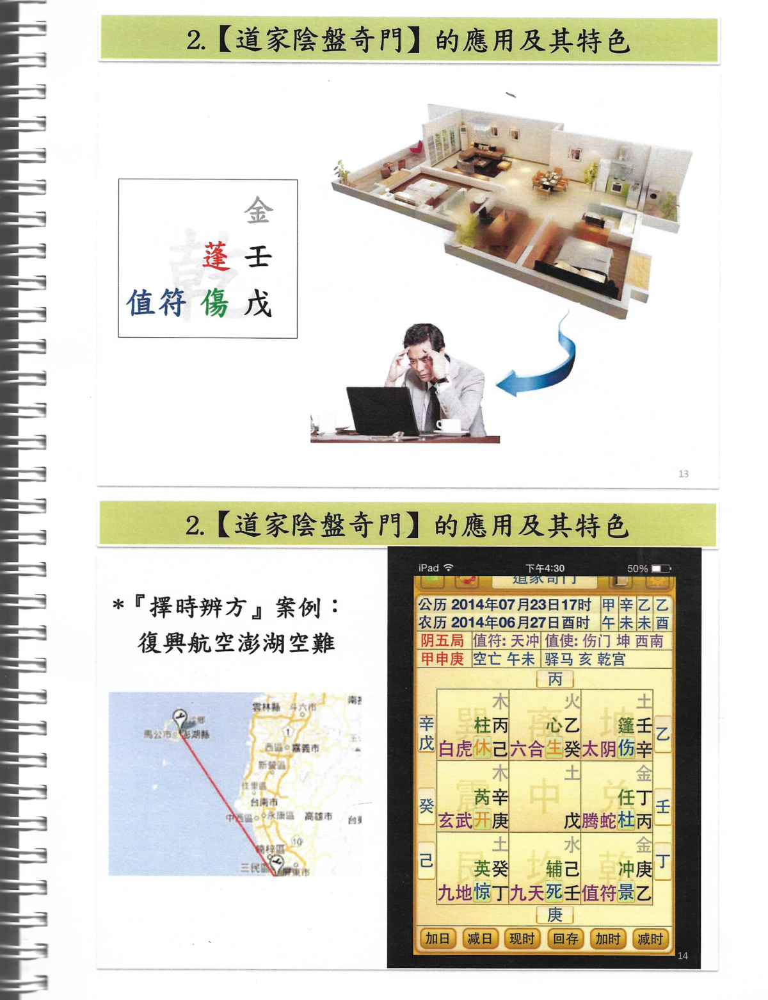

> **🖼 圖像解讀**　｜　檢視狀態：✅ 已檢視
> - **類型**：插圖＋實例奇門盤截圖（投影片 13–14）
> - **內容**：投影片 13 以乾宮「蓬 壬／值符 傷 戊」對應到住宅平面圖及一位苦惱的上班族，示意宮中符號可對應居家環境與人事；投影片 14 為『擇時辦方』案例「復興航空澎湖空難」，附高雄往澎湖航線地圖與 iPad「道家奇門」App 排盤截圖（公曆2014年07月23日17時，陰五局，值符天沖、值使傷門）。
> - **原文出處（逐字）**：2.【道家陰盤奇門】的應用及其特色；＊『擇時辦方』案例：復興航空澎湖空難；App 盤頭「公历 2014年07月23日17时 甲午 辛未 乙未 乙酉／农历 2014年06月27日酉时／阴五局 值符: 天冲 值使: 伤门 坤 西南／甲申庚 空亡 午未 驿马 亥 乾宫」
> - **可檢索關鍵字**：擇時辦方, 復興航空, 澎湖空難, 陰五局, 值符天沖, 值使傷門, 道家奇門App, 居家風水

**📝 逐字謄寫（第 8 頁）**

### 2.【道家陰盤奇門】的應用及其特色（投影片 13）

乾宮：金｜蓬 壬｜值符 傷 戊
（圖：立體住宅平面圖，箭頭指向一位在筆電前抱頭苦惱的上班族）

### 2.【道家陰盤奇門】的應用及其特色（投影片 14）

＊『擇時辦方』案例：
復興航空澎湖空難

（左下地圖：台灣西南部至澎湖馬公的航線紅線）

右側 iPad「道家奇门」App 截圖（簡體原文照錄）：

公历 2014年07月23日17时　甲午 辛未 乙未 乙酉（年月日時）
农历 2014年06月27日酉时
阴五局　值符: 天冲　值使: 伤门　坤 西南
甲申庚　空亡 午未　驿马 亥 乾宫

| 巽（木） | 離（火） | 坤（土） |
|---|---|---|
| 杜 丙 白虎 休 己 | 心 乙 六合 生 癸 | 蓬 壬 太阴 伤 辛 |
| **震（木）** | **中（土）** | **兌（金）** |
| 芮 辛 玄武 开 庚 | 戊 | 任 丁 腾蛇 杜 丙 |
| **艮（土）** | **坎（水）** | **乾（金）** |
| 英 癸 九地 惊 丁 | 辅 己 九天 死 壬 | 冲 庚 值符 景 乙 |

盤外標示：上方「丙」、下方「庚」；左側由上而下「辛戊」「癸」「己」；右側由上而下「乙」「壬」「丁」。
App 底部按鈕：加日｜减日｜现时｜回存｜加时｜减时

## 圖 09 — 第 9 頁（1200x1561）｜🖼 圖片（開圖判斷：圖表細看／裝飾照簡述）

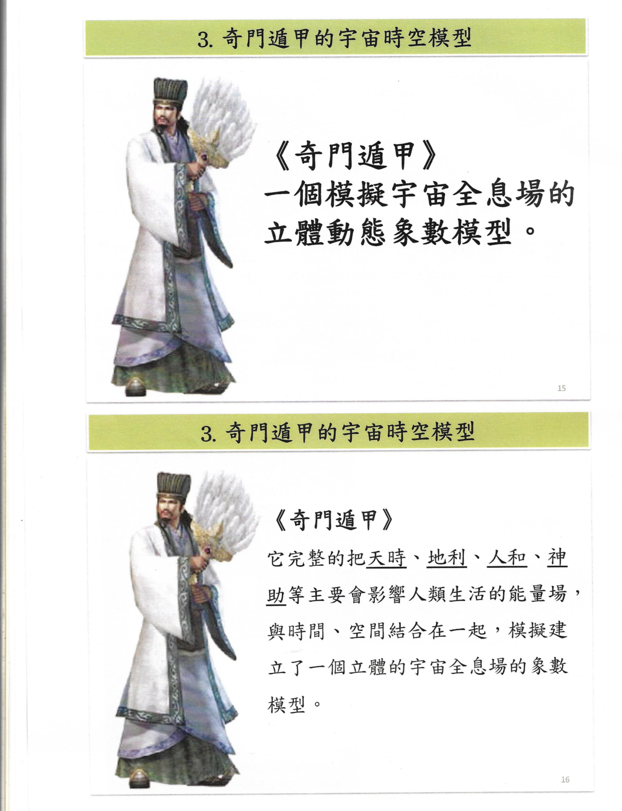

> **🖼 圖像解讀**　｜　檢視狀態：✅ 已檢視
> - **類型**：文字頁＋人物插圖（投影片 15–16）
> - **內容**：第三節「奇門遁甲的宇宙時空模型」：奇門遁甲是模擬宇宙全息場的立體動態象數模型，把天時、地利、人和、神助等能量場與時間空間結合在一起。
> - **原文出處（逐字）**：3. 奇門遁甲的宇宙時空模型
> - **可檢索關鍵字**：宇宙時空模型, 全息場, 象數模型, 天時地利人和神助, 能量場, 立體動態

**📝 逐字謄寫（第 9 頁）**

### 3. 奇門遁甲的宇宙時空模型

**《奇門遁甲》
一個模擬宇宙全息場的
立體動態象數模型。**

### 3. 奇門遁甲的宇宙時空模型

《奇門遁甲》
它完整的把天時、地利、人和、神助等主要會影響人類生活的能量場，與時間、空間結合在一起，模擬建立了一個立體的宇宙全息場的象數模型。

## 圖 10 — 第 10 頁（1200x1561）｜🖼 圖片（開圖判斷：圖表細看／裝飾照簡述）

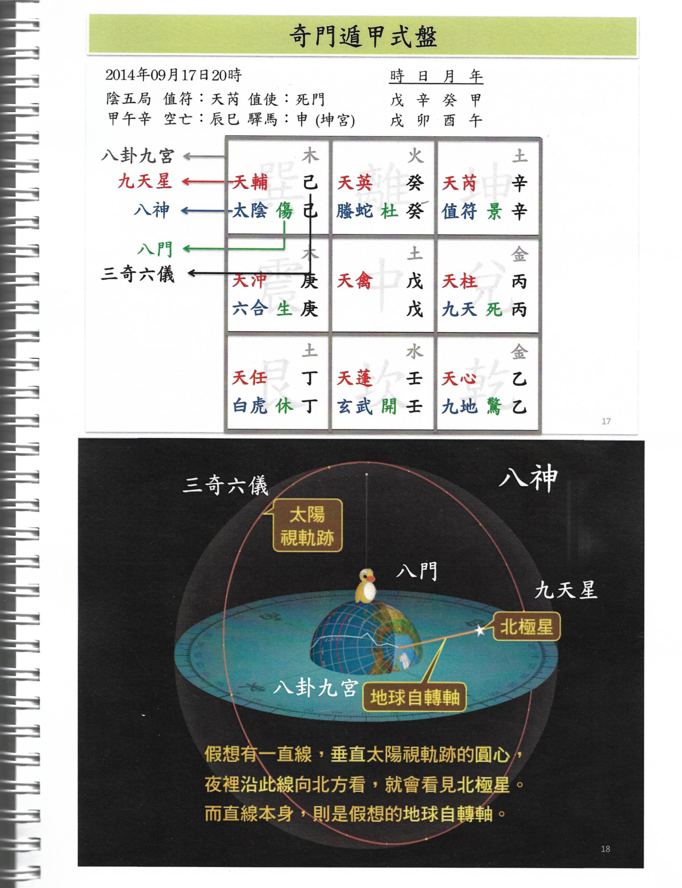

> **🖼 圖像解讀**　｜　檢視狀態：✅ 已檢視
> - **類型**：奇門盤結構圖＋天文示意圖（投影片 17–18）
> - **內容**：投影片 17「奇門遁甲式盤」以 2014年09月17日20時陰五局為例，用箭頭標出盤中各層：八卦九宮、九天星、八神、八門、三奇六儀；投影片 18 為天球示意圖，把三奇六儀對應太陽視軌跡、八門、九天星對應北極星、八卦九宮對應地球自轉軸，說明垂直太陽視軌跡圓心的直線即假想地球自轉軸、指向北極星。
> - **原文出處（逐字）**：奇門遁甲式盤；盤頭「2014年09月17日20時 陰五局 值符：天芮 值使：死門 甲午辛 空亡：辰巳 驛馬：申(坤宮)」；投影片 18 圖說
> - **可檢索關鍵字**：奇門遁甲式盤, 八卦九宮, 九天星, 八神, 八門, 三奇六儀, 太陽視軌跡, 北極星

**📝 逐字謄寫（第 10 頁）**

### 奇門遁甲式盤（投影片 17）

2014年09月17日20時
陰五局　值符：天芮　值使：死門
甲午辛　空亡：辰巳　驛馬：申(坤宮)

| 時 | 日 | 月 | 年 |
|---|---|---|---|
| 戊戌 | 辛卯 | 癸酉 | 甲午 |

圖左側箭頭標註盤中各層（以巽宮為例）：
- 八卦九宮 → 宮位（右上角五行字，背景淡字宮名）
- 九天星 → 天輔
- 八神 → 太陰
- 八門 → 傷
- 三奇六儀 → 己（天盤）／己（地盤）

| 巽（木） | 離（火） | 坤（土） |
|---|---|---|
| 天輔 己 太陰 傷 己 | 天英 癸 螣蛇 杜 癸 | 天芮 辛 值符 景 辛 |
| **震（木）** | **中（土）** | **兌（金）** |
| 天沖 庚 六合 生 庚 | 天禽 戊 戊 | 天柱 丙 九天 死 丙 |
| **艮（土）** | **坎（水）** | **乾（金）** |
| 天任 丁 白虎 休 丁 | 天蓬 壬 玄武 開 壬 | 天心 乙 九地 驚 乙 |

### 天球示意圖（投影片 18）

圖中標註：三奇六儀（太陽視軌跡）、八神、八門、九天星（北極星）、八卦九宮（地球自轉軸）。

假想有一直線，垂直太陽視軌跡的圓心，
夜裡沿此線向北方看，就會看見北極星。
而直線本身，則是假想的地球自轉軸。

## 圖 11 — 第 11 頁（1200x1561）｜🖼 圖片（開圖判斷：圖表細看／裝飾照簡述）

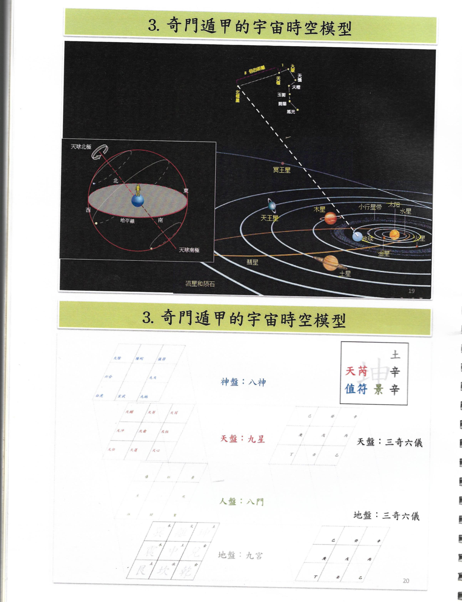

> **🖼 圖像解讀**　｜　檢視狀態：✅ 已檢視
> - **類型**：天文示意圖＋分層結構圖（投影片 19–20）
> - **內容**：投影片 19 為太陽系與天球示意圖（北斗七星經北極星延伸線指向地球、內嵌天球北極／南極與地平線示意）；投影片 20 以立體分層圖說明奇門盤四層：神盤八神、天盤九星、人盤八門、地盤九宮，並另列天盤三奇六儀與地盤三奇六儀，右上以坤宮「天芮 辛／值符 景 辛」為例。
> - **原文出處（逐字）**：3. 奇門遁甲的宇宙時空模型；圖中標註「神盤：八神」「天盤：九星」「人盤：八門」「地盤：九宮」「天盤：三奇六儀」「地盤：三奇六儀」
> - **可檢索關鍵字**：天球, 北斗七星, 北極星, 太陽系, 神盤八神, 天盤九星, 人盤八門, 地盤九宮

**📝 逐字謄寫（第 11 頁）**

### 3. 奇門遁甲的宇宙時空模型（投影片 19）

（太陽系示意圖：太陽、水星、金星、地球、火星、小行星帶、木星、土星、天王星、冥王星、彗星、流星和隕石；北斗七星〔天樞、天璇、天璣、天權、玉衡、開陽、搖光〕以虛線經北極星延伸至地球。左下內嵌天球圖：天球北極、天球南極、東西南北、地平線。）

〔北斗附近細小標字部分模糊，圖中未能完全辨識〕

### 3. 奇門遁甲的宇宙時空模型（投影片 20）

奇門盤的立體分層（由上而下）：
- 神盤：八神（太陰、螣蛇、值符、六合、九天、白虎、玄武、九地）
- 天盤：九星（天輔、天英、天芮、天沖、天禽、天柱、天任、天蓬、天心）
- 人盤：八門
- 地盤：九宮（巽、離、坤／震、中、兌／艮、坎、乾）

另列：天盤：三奇六儀；地盤：三奇六儀

右上範例（坤宮）：土｜天芮 辛｜值符 景 辛

〔分層圖內小字極細，僅能辨識上述宮名與星神名；其餘圖中未能辨識〕

## 圖 12 — 第 12 頁（1200x1561）｜🖼 圖片（開圖判斷：圖表細看／裝飾照簡述）

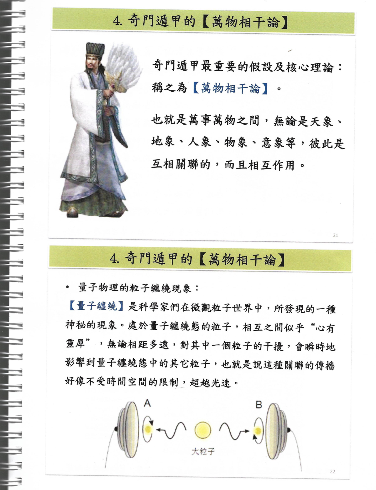

> **🖼 圖像解讀**　｜　檢視狀態：✅ 已檢視
> - **類型**：文字頁＋示意圖（投影片 21–22）
> - **內容**：第四節「萬物相干論」：奇門遁甲的核心假設是萬事萬物（天象、地象、人象、物象、意象）互相關聯、相互作用；並以量子物理的「量子纏繞」現象（粒子不受時空限制的瞬時關聯）作類比，附大粒子分裂為 A、B 兩粒子的示意圖。
> - **原文出處（逐字）**：4. 奇門遁甲的【萬物相干論】
> - **可檢索關鍵字**：萬物相干論, 核心理論, 天象地象人象, 量子纏繞, 量子糾纏, 粒子關聯

**📝 逐字謄寫（第 12 頁）**

### 4. 奇門遁甲的【萬物相干論】

奇門遁甲最重要的假設及核心理論：稱之為【萬物相干論】。

也就是萬事萬物之間，無論是天象、地象、人象、物象、意象等，彼此是互相關聯的，而且相互作用。

### 4. 奇門遁甲的【萬物相干論】

- 量子物理的粒子纏繞現象：

【量子纏繞】是科學家們在微觀粒子世界中，所發現的一種神秘的現象。處於量子纏繞態的粒子，相互之間似乎“心有靈犀”，無論相距多遠，對其中一個粒子的干擾，會瞬時地影響到量子纏繞態中的其它粒子，也就是說這種關聯的傳播好像不受時間空間的限制，超越光速。

（示意圖：中央「大粒子」分出兩個粒子，分別飛向 A、B 兩側）

## 圖 13 — 第 13 頁（1200x1561）｜🖼 圖片（開圖判斷：圖表細看／裝飾照簡述）

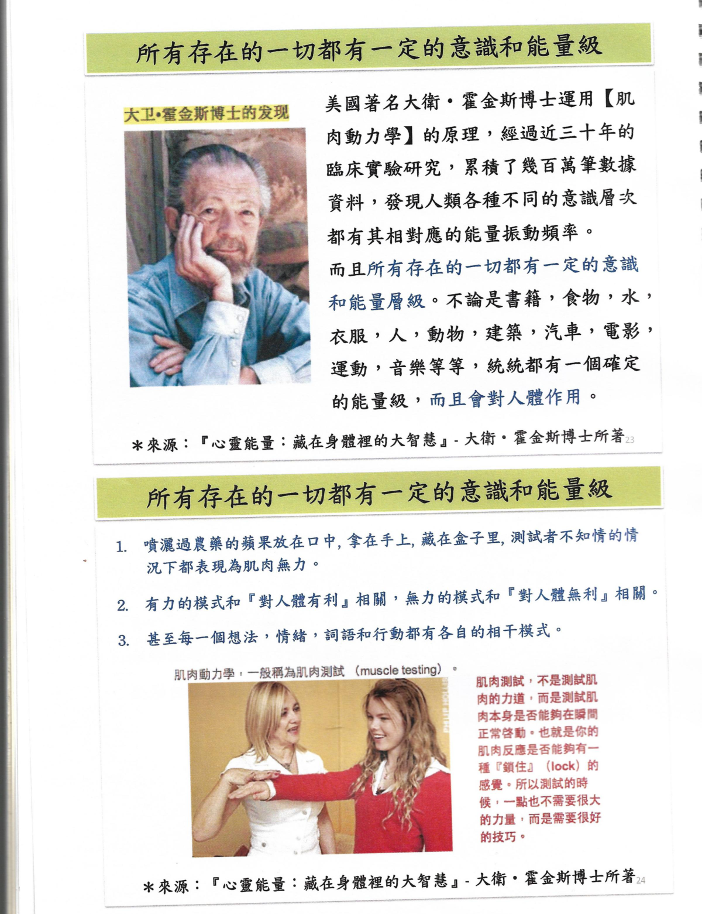

> **🖼 圖像解讀**　｜　檢視狀態：✅ 已檢視
> - **類型**：文字頁＋照片（投影片 23–24）
> - **內容**：引用大衛・霍金斯博士《心靈能量：藏在身體裡的大智慧》，說明其以肌肉動力學（肌肉測試）累積數據、主張所有存在的一切都有對應的意識與能量層級並會對人體作用；投影片 24 列出三項觀察（噴過農藥的蘋果使受試者肌肉無力、有力模式對人體有利、每個想法情緒詞語行動都有相干模式）並附肌肉測試照片與說明。
> - **原文出處（逐字）**：所有存在的一切都有一定的意識和能量級；＊來源：『心靈能量：藏在身體裡的大智慧』- 大衛・霍金斯博士所著
> - **可檢索關鍵字**：大衛霍金斯, 心靈能量, 肌肉動力學, 肌肉測試, muscle testing, 意識層級, 能量振動頻率

**📝 逐字謄寫（第 13 頁）**

### 所有存在的一切都有一定的意識和能量級（投影片 23）

（左圖：人物照片，標題「大卫•霍金斯博士的发现」）

美國著名大衛・霍金斯博士運用【肌肉動力學】的原理，經過近三十年的臨床實驗研究，累積了幾百萬筆數據資料，發現人類各種不同的意識層次都有其相對應的能量振動頻率。

而且所有存在的一切都有一定的意識和能量層級。不論是書籍，食物，水，衣服，人，動物，建築，汽車，電影，運動，音樂等等，統統都有一個確定的能量級，而且會對人體作用。

＊來源：『心靈能量：藏在身體裡的大智慧』- 大衛・霍金斯博士所著

### 所有存在的一切都有一定的意識和能量級（投影片 24）

1. 噴灑過農藥的蘋果放在口中，拿在手上，藏在盒子里，測試者不知情的情況下都表現為肌肉無力。
2. 有力的模式和『對人體有利』相關，無力的模式和『對人體無利』相關。
3. 甚至每一個想法，情緒，詞語和行動都有各自的相干模式。

（照片：兩人示範手臂肌肉測試；圖上標題「肌肉動力學，一般稱為肌肉測試（muscle testing）。」）

照片旁說明：肌肉測試，不是測試肌肉的力道，而是測試肌肉本身是否能夠在瞬間正常啓動。也就是你的肌肉反應是否能夠有一種『鎖住』（lock）的感覺。所以測試的時候，一點也不需要很大的力量，而是需要很好的技巧。

＊來源：『心靈能量：藏在身體裡的大智慧』- 大衛・霍金斯博士所著

## 圖 14 — 第 14 頁（1200x1561）｜🖼 圖片（開圖判斷：圖表細看／裝飾照簡述）

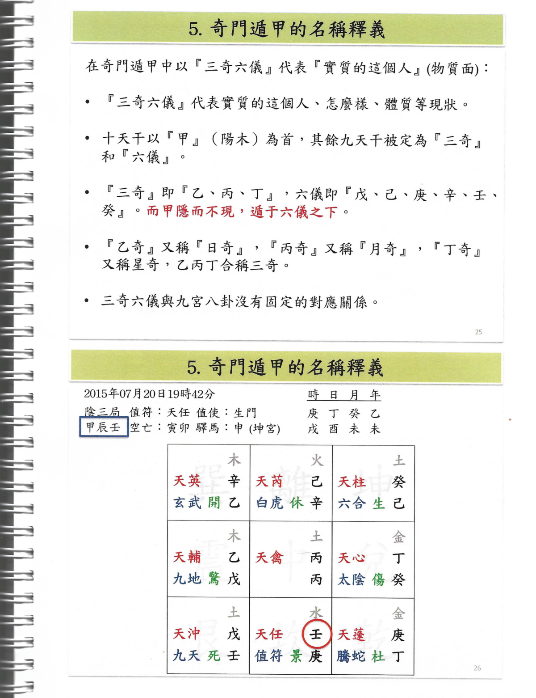

> **🖼 圖像解讀**　｜　檢視狀態：✅ 已檢視
> - **類型**：文字頁＋奇門盤圖表（投影片 25–26）
> - **內容**：第五節「奇門遁甲的名稱釋義」：三奇六儀代表實質的這個人（物質面）；十天干以甲為首，乙丙丁為三奇（日奇、月奇、星奇），戊己庚辛壬癸為六儀，甲隱而不現、遁於六儀之下；投影片 26 以 2015年07月20日19時42分陰三局盤為例，框出旬首「甲辰壬」並圈出坎宮天盤「壬」，示範甲遁於壬。
> - **原文出處（逐字）**：5. 奇門遁甲的名稱釋義；盤頭「2015年07月20日19時42分 陰三局 值符：天任 值使：生門 甲辰壬 空亡：寅卯 驛馬：申(坤宮)」
> - **可檢索關鍵字**：名稱釋義, 三奇六儀, 遁甲, 甲隱六儀, 日奇月奇星奇, 旬首, 陰三局, 甲辰壬

**📝 逐字謄寫（第 14 頁）**

### 5. 奇門遁甲的名稱釋義（投影片 25）

在奇門遁甲中以『三奇六儀』代表『實質的這個人』(物質面)：

- 『三奇六儀』代表實質的這個人、怎麼樣、體質等現狀。
- 十天干以『甲』（陽木）為首，其餘九天干被定為『三奇』和『六儀』。
- 『三奇』即『乙、丙、丁』，六儀即『戊、己、庚、辛、壬、癸』。**而甲隱而不現，遁于六儀之下。**
- 『乙奇』又稱『日奇』，『丙奇』又稱『月奇』，『丁奇』又稱星奇，乙丙丁合稱三奇。
- 三奇六儀與九宮八卦沒有固定的對應關係。

### 5. 奇門遁甲的名稱釋義（投影片 26）

2015年07月20日19時42分
陰三局　值符：天任　值使：生門
［甲辰壬］（藍框標示）　空亡：寅卯　驛馬：申(坤宮)

| 時 | 日 | 月 | 年 |
|---|---|---|---|
| 庚戌 | 丁酉 | 癸未 | 乙未 |

| 巽（木） | 離（火） | 坤（土） |
|---|---|---|
| 天英 辛 玄武 開 乙 | 天芮 己 白虎 休 辛 | 天柱 癸 六合 生 己 |
| **震（木）** | **中（土）** | **兌（金）** |
| 天輔 乙 九地 驚 戊 | 天禽 丙 丙 | 天心 丁 太陰 傷 癸 |
| **艮（土）** | **坎（水）** | **乾（金）** |
| 天沖 戊 九天 死 壬 | 天任 ⭕壬 值符 景 庚 | 天蓬 庚 螣蛇 杜 丁 |

（坎宮天盤「壬」以紅圈標示，對應旬首甲辰壬。）

## 圖 15 — 第 15 頁（1200x1561）｜🖼 圖片（開圖判斷：圖表細看／裝飾照簡述）

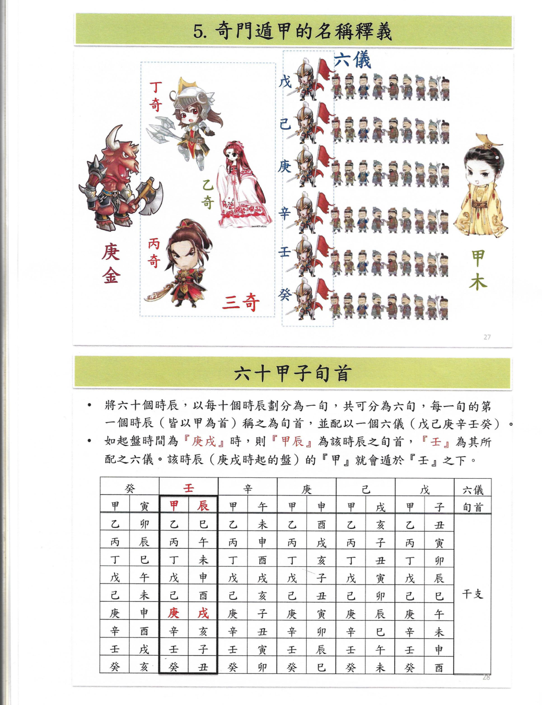

> **🖼 圖像解讀**　｜　檢視狀態：✅ 已檢視
> - **類型**：卡通插圖＋干支表格（投影片 27–28）
> - **內容**：投影片 27 以卡通人物比喻：甲木為君王（隱藏），六儀戊己庚辛壬癸為帶兵將領，乙丙丁三奇為護衛，庚金為敵對猛將；投影片 28「六十甲子旬首」說明六十時辰分六旬、每旬首甲配一六儀，舉例庚戌時旬首為甲辰、配六儀壬，甲遁於壬下，並附六旬干支完整表（甲辰壬一欄以粗框、庚戌以紅字標示）。
> - **原文出處（逐字）**：5. 奇門遁甲的名稱釋義；六十甲子旬首
> - **可檢索關鍵字**：三奇六儀比喻, 甲木, 庚金, 六十甲子, 旬首, 六儀, 甲辰壬, 遁甲

**📝 逐字謄寫（第 15 頁）**

### 5. 奇門遁甲的名稱釋義（投影片 27）

（卡通插圖）
- 甲木：身著黃袍的君主（右側）
- 六儀：戊、己、庚、辛、壬、癸，各為一名持旗將領，身後各率一排士兵
- 三奇：丁奇（持戟女將）、乙奇（紅衣女子）、丙奇（持刀武將）
- 庚金：左側紅色牛頭斧兵

### 六十甲子旬首（投影片 28）

- 將六十個時辰，以每十個時辰劃分為一旬，共可分為六旬，每一旬的第一個時辰（皆以甲為首）稱之為旬首，並配以一個六儀（戊己庚辛壬癸）。
- 如起盤時間為『庚戌』時，則『甲辰』為該時辰之旬首，『壬』為其所配之六儀。該時辰（庚戌時起的盤）的『甲』就會遁於『壬』之下。

| 六儀 | 癸 | 壬 | 辛 | 庚 | 己 | 戊 |
|---|---|---|---|---|---|---|
| 旬首 | 甲寅 | **甲辰** | 甲午 | 甲申 | 甲戌 | 甲子 |
| 干支 | 乙卯 | 乙巳 | 乙未 | 乙酉 | 乙亥 | 乙丑 |
| | 丙辰 | 丙午 | 丙申 | 丙戌 | 丙子 | 丙寅 |
| | 丁巳 | 丁未 | 丁酉 | 丁亥 | 丁丑 | 丁卯 |
| | 戊午 | 戊申 | 戊戌 | 戊子 | 戊寅 | 戊辰 |
| | 己未 | 己酉 | 己亥 | 己丑 | 己卯 | 己巳 |
| | 庚申 | **庚戌** | 庚子 | 庚寅 | 庚辰 | 庚午 |
| | 辛酉 | 辛亥 | 辛丑 | 辛卯 | 辛巳 | 辛未 |
| | 壬戌 | 壬子 | 壬寅 | 壬辰 | 壬午 | 壬申 |
| | 癸亥 | 癸丑 | 癸卯 | 癸巳 | 癸未 | 癸酉 |

（原表「壬／甲辰」欄以粗框標示，「甲辰」「庚戌」為紅字。）

## 圖 16 — 第 16 頁（1200x1561）｜🖼 圖片（開圖判斷：圖表細看／裝飾照簡述）

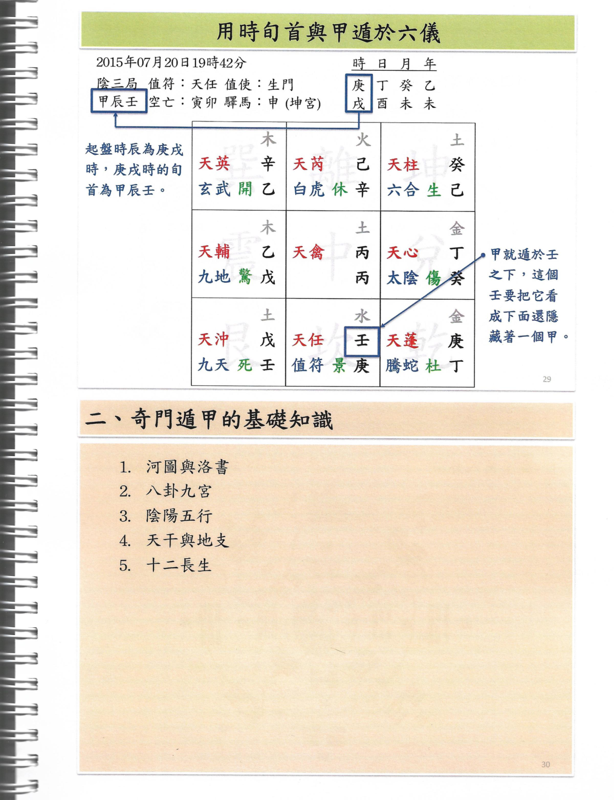

> **🖼 圖像解讀**　｜　檢視狀態：✅ 已檢視
> - **類型**：奇門盤圖表＋目錄頁（投影片 29–30）
> - **內容**：投影片 29「用時旬首與甲遁於六儀」沿用 2015年07月20日19時42分陰三局盤，以框線與箭頭說明：起盤時辰庚戌時的旬首為甲辰壬，因此坎宮天盤的壬之下隱藏著甲；投影片 30 為第二章「奇門遁甲的基礎知識」目錄：河圖與洛書、八卦九宮、陰陽五行、天干與地支、十二長生。
> - **原文出處（逐字）**：用時旬首與甲遁於六儀；二、奇門遁甲的基礎知識
> - **可檢索關鍵字**：用時旬首, 甲遁六儀, 庚戌時, 甲辰壬, 基礎知識, 河圖洛書, 八卦九宮, 十二長生

**📝 逐字謄寫（第 16 頁）**

### 用時旬首與甲遁於六儀（投影片 29）

2015年07月20日19時42分
陰三局　值符：天任　值使：生門
［甲辰壬］　空亡：寅卯　驛馬：申(坤宮)
四柱：時 庚戌｜日 丁酉｜月 癸未｜年 乙未（「庚戌」時柱以框標示，箭頭連到「甲辰壬」）

左側註解：起盤時辰為庚戌時，庚戌時的旬首為甲辰壬。

（九宮盤同第 14 頁投影片 26）

右側註解（箭頭指向坎宮天盤「壬」）：甲就遁於壬之下，這個壬要把它看成下面還隱藏著一個甲。

### 二、奇門遁甲的基礎知識（投影片 30）

1. 河圖與洛書
2. 八卦九宮
3. 陰陽五行
4. 天干與地支
5. 十二長生

## 圖 17 — 第 17 頁（1200x1561）｜🖼 圖片（開圖判斷：圖表細看／裝飾照簡述）

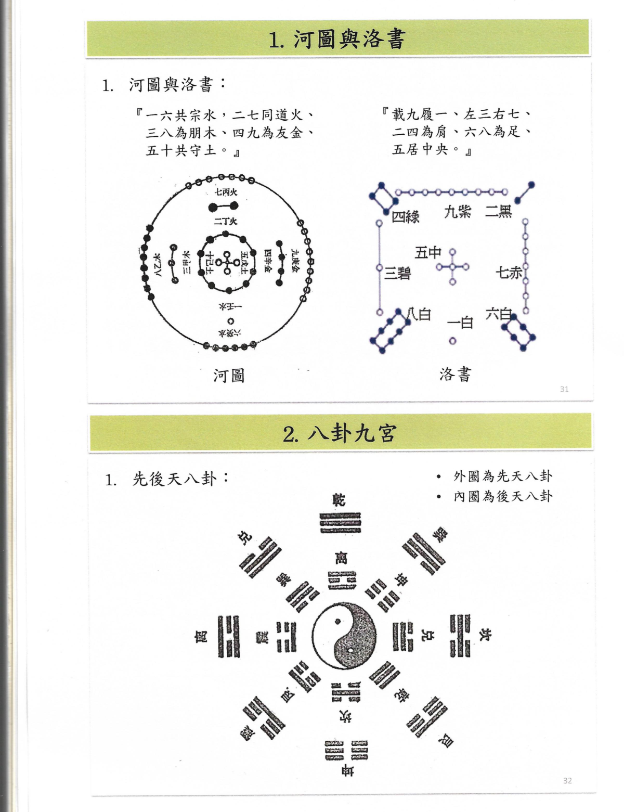

> **🖼 圖像解讀**　｜　檢視狀態：✅ 已檢視
> - **類型**：圖解（河圖洛書、先後天八卦圖）（投影片 31–32）
> - **內容**：第二章開始。投影片 31 並列河圖與洛書圖，附口訣：河圖「一六共宗水，二七同道火，三八為朋木，四九為友金，五十共守土」；洛書「戴九履一、左三右七、二四為肩、六八為足、五居中央」，洛書圖並標九星紫白（一白、二黑、三碧、四綠、五中、六白、七赤、八白、九紫）。投影片 32 為先後天八卦同心圖：外圈為先天八卦、內圈為後天八卦，中央太極。
> - **原文出處（逐字）**：1. 河圖與洛書；2. 八卦九宮／1. 先後天八卦
> - **可檢索關鍵字**：河圖, 洛書, 戴九履一, 紫白九星, 先天八卦, 後天八卦, 太極, 五行生數成數

**📝 逐字謄寫（第 17 頁）**

### 1. 河圖與洛書（投影片 31）

1. 河圖與洛書：

| 河圖 | 洛書 |
|---|---|
| 『一六共宗水，二七同道火、三八為朋木、四九為友金、五十共守土。』 | 『載九履一、左三右七、二四為肩、六八為足、五居中央。』 |

- **河圖**（黑白點圓形圖）：圖內標示「一壬水、六癸水」（下）、「二丁火、七丙火」（上）、「三甲木、八乙木」（左）、「四辛金、九庚金」（右）、「五戊土、十己土」（中）。〔圖中小字為旋轉排列，部分依圖形位置辨識〕
- **洛書**（黑白點方形圖）：
  - 上排：四綠｜九紫｜二黑
  - 中排：三碧｜五中｜七赤
  - 下排：八白｜一白｜六白

### 2. 八卦九宮（投影片 32）

1. 先後天八卦：
- 外圈為先天八卦
- 內圈為後天八卦

（同心八卦圖，中央太極圖。外圈先天：上乾、下坤、左離、右坎，四隅兌、巽、震、艮；內圈後天：上離、下坎、左震、右兌，四隅巽、坤、艮、乾。〔圖中卦名為旋轉印刷，依卦位辨識〕）

## 圖 18 — 第 18 頁（1200x1561）｜🖼 圖片（開圖判斷：圖表細看／裝飾照簡述）

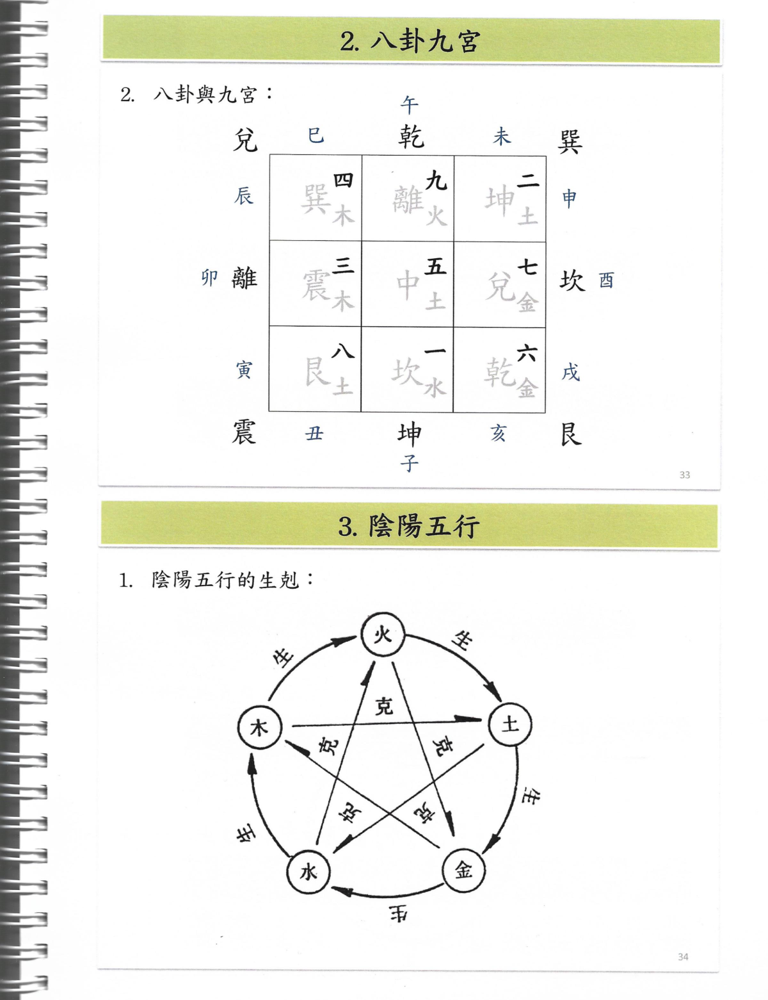

> **🖼 圖像解讀**　｜　檢視狀態：✅ 已檢視
> - **類型**：九宮圖表＋五行生剋圖（投影片 33–34）
> - **內容**：投影片 33「八卦與九宮」：後天九宮格（巽四木、離九火、坤二土／震三木、中五土、兌七金／艮八土、坎一水、乾六金），外圍標示先天八卦位置與十二地支方位；投影片 34「陰陽五行的生剋」五行圖：外圈相生（木→火→土→金→水→木），內部五角星相剋（木剋土、土剋水、水剋火、火剋金、金剋木）。
> - **原文出處（逐字）**：2. 八卦九宮／2. 八卦與九宮；3. 陰陽五行／1. 陰陽五行的生剋
> - **可檢索關鍵字**：八卦九宮, 後天九宮, 洛書數, 十二地支方位, 五行相生, 五行相剋, 陰陽五行

**📝 逐字謄寫（第 18 頁）**

### 2. 八卦九宮（投影片 33）

2. 八卦與九宮：

| 宮位（數・五行） | | |
|---|---|---|
| 巽 四 木 | 離 九 火 | 坤 二 土 |
| 震 三 木 | 中 五 土 | 兌 七 金 |
| 艮 八 土 | 坎 一 水 | 乾 六 金 |

外圍標示（先天八卦位置＋地支方位）：
- 上方：兌（左上角）｜巳｜乾（午）｜未｜巽（右上角）
- 左側：辰｜離（卯）｜寅
- 右側：申｜坎（酉）｜戌
- 下方：震（左下角）｜丑｜坤（子）｜亥｜艮（右下角）

### 3. 陰陽五行（投影片 34）

1. 陰陽五行的生剋：

（五行圖）
- 外圈「生」：木 → 火 → 土 → 金 → 水 → 木
- 內部五角星「克」：木克土、土克水、水克火、火克金、金克木

## 圖 19 — 第 19 頁（1200x1561）｜🖼 圖片（開圖判斷：圖表細看／裝飾照簡述）

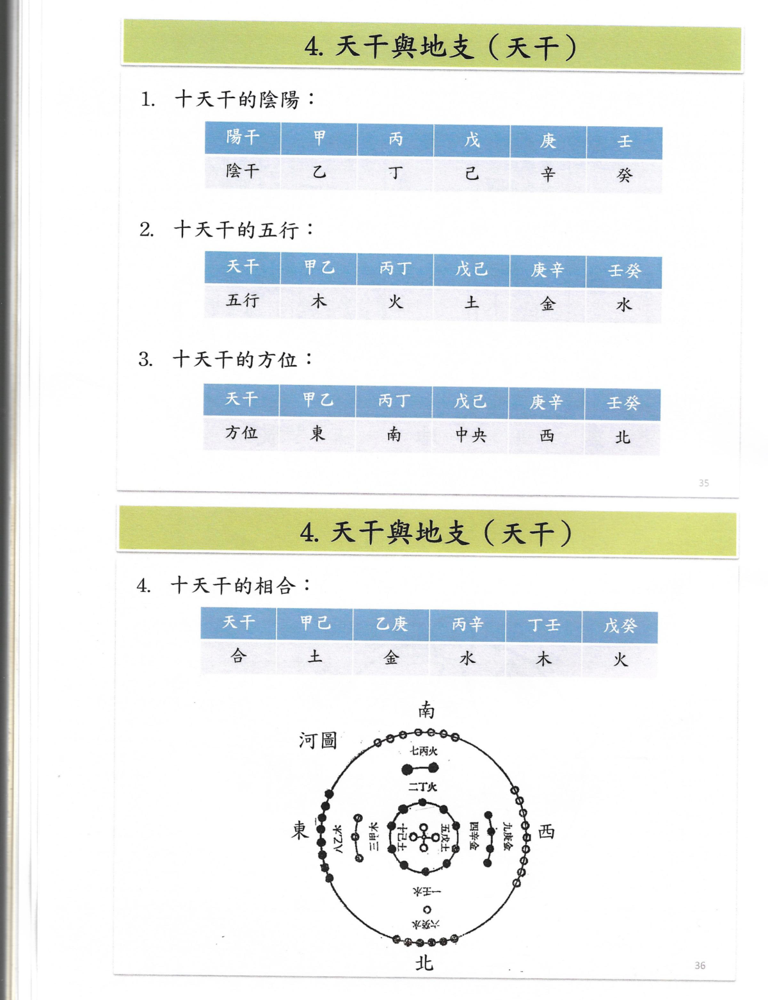

> **🖼 圖像解讀**　｜　檢視狀態：✅ 已檢視
> - **類型**：表格＋河圖（投影片 35–36）
> - **內容**：「天干與地支（天干）」：十天干的陰陽（甲丙戊庚壬為陽，乙丁己辛癸為陰）、五行（甲乙木、丙丁火、戊己土、庚辛金、壬癸水）、方位（東、南、中央、西、北）；投影片 36 列十天干相合（甲己合土、乙庚合金、丙辛合水、丁壬合木、戊癸合火），並附標有東南西北方位的河圖。
> - **原文出處（逐字）**：4. 天干與地支（天干）
> - **可檢索關鍵字**：十天干, 天干陰陽, 天干五行, 天干方位, 天干相合, 甲己合土, 戊癸合火, 河圖方位

**📝 逐字謄寫（第 19 頁）**

### 4. 天干與地支（天干）（投影片 35）

1. 十天干的陰陽：

| 陽干 | 甲 | 丙 | 戊 | 庚 | 壬 |
|---|---|---|---|---|---|
| 陰干 | 乙 | 丁 | 己 | 辛 | 癸 |

2. 十天干的五行：

| 天干 | 甲乙 | 丙丁 | 戊己 | 庚辛 | 壬癸 |
|---|---|---|---|---|---|
| 五行 | 木 | 火 | 土 | 金 | 水 |

3. 十天干的方位：

| 天干 | 甲乙 | 丙丁 | 戊己 | 庚辛 | 壬癸 |
|---|---|---|---|---|---|
| 方位 | 東 | 南 | 中央 | 西 | 北 |

### 4. 天干與地支（天干）（投影片 36）

4. 十天干的相合：

| 天干 | 甲己 | 乙庚 | 丙辛 | 丁壬 | 戊癸 |
|---|---|---|---|---|---|
| 合 | 土 | 金 | 水 | 木 | 火 |

（河圖，標示方位：上南、下北、左東、右西；圖內文字同第 17 頁河圖：七丙火、二丁火、三甲木、八乙木、四辛金、九庚金、五戊土、十己土、一壬水、六癸水。）

## 圖 20 — 第 20 頁（1200x1561）｜🖼 圖片（開圖判斷：圖表細看／裝飾照簡述）

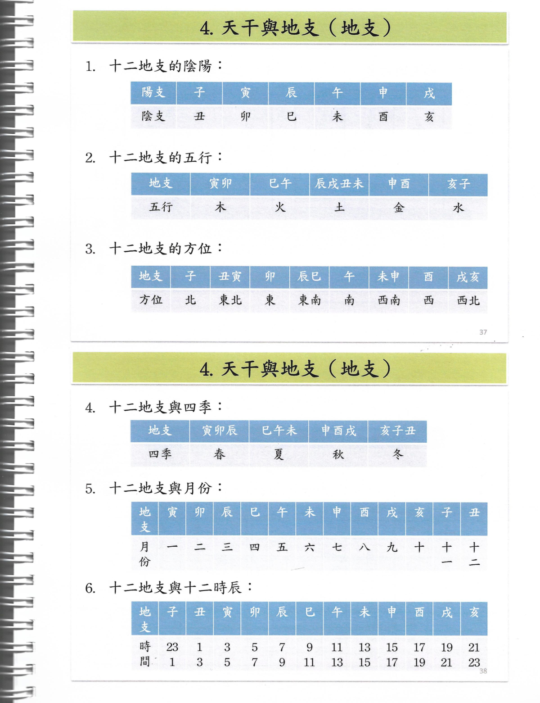

> **🖼 圖像解讀**　｜　檢視狀態：✅ 已檢視
> - **類型**：表格頁（投影片 37–38）
> - **內容**：「天干與地支（地支）」六張對照表：十二地支陰陽、五行（寅卯木、巳午火、辰戌丑未土、申酉金、亥子水）、方位、四季、月份（寅為一月至丑為十二月）、十二時辰對應鐘點（子時23–1點，每時辰兩小時）。
> - **原文出處（逐字）**：4. 天干與地支（地支）
> - **可檢索關鍵字**：十二地支, 地支陰陽, 地支五行, 地支方位, 地支四季, 地支月份, 十二時辰

**📝 逐字謄寫（第 20 頁）**

### 4. 天干與地支（地支）（投影片 37）

1. 十二地支的陰陽：

| 陽支 | 子 | 寅 | 辰 | 午 | 申 | 戌 |
|---|---|---|---|---|---|---|
| 陰支 | 丑 | 卯 | 巳 | 未 | 酉 | 亥 |

2. 十二地支的五行：

| 地支 | 寅卯 | 巳午 | 辰戌丑未 | 申酉 | 亥子 |
|---|---|---|---|---|---|
| 五行 | 木 | 火 | 土 | 金 | 水 |

3. 十二地支的方位：

| 地支 | 子 | 丑寅 | 卯 | 辰巳 | 午 | 未申 | 酉 | 戌亥 |
|---|---|---|---|---|---|---|---|---|
| 方位 | 北 | 東北 | 東 | 東南 | 南 | 西南 | 西 | 西北 |

### 4. 天干與地支（地支）（投影片 38）

4. 十二地支與四季：

| 地支 | 寅卯辰 | 巳午未 | 申酉戌 | 亥子丑 |
|---|---|---|---|---|
| 四季 | 春 | 夏 | 秋 | 冬 |

5. 十二地支與月份：

| 地支 | 寅 | 卯 | 辰 | 巳 | 午 | 未 | 申 | 酉 | 戌 | 亥 | 子 | 丑 |
|---|---|---|---|---|---|---|---|---|---|---|---|---|
| 月份 | 一 | 二 | 三 | 四 | 五 | 六 | 七 | 八 | 九 | 十 | 十一 | 十二 |

6. 十二地支與十二時辰：

| 地支 | 子 | 丑 | 寅 | 卯 | 辰 | 巳 | 午 | 未 | 申 | 酉 | 戌 | 亥 |
|---|---|---|---|---|---|---|---|---|---|---|---|---|
| 時間 | 23–1 | 1–3 | 3–5 | 5–7 | 7–9 | 9–11 | 11–13 | 13–15 | 15–17 | 17–19 | 19–21 | 21–23 |

## 圖 21 — 第 21 頁（1200x1561）｜🖼 圖片（開圖判斷：圖表細看／裝飾照簡述）

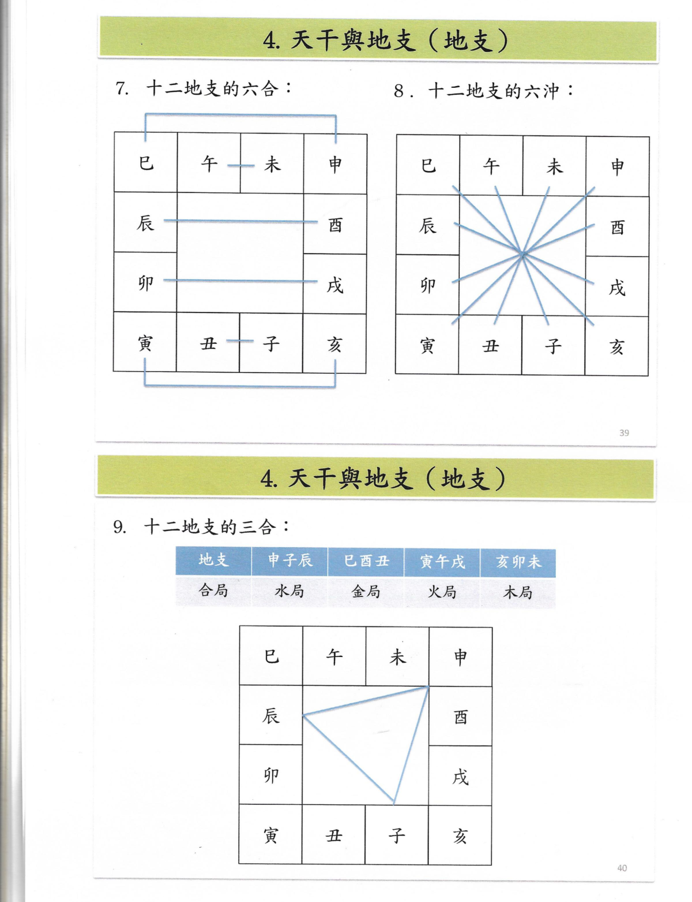

> **🖼 圖像解讀**　｜　檢視狀態：✅ 已檢視
> - **類型**：地支關係圖（投影片 39–40）
> - **內容**：以十二地支方盤（巳午未申／辰酉／卯戌／寅丑子亥）連線示意：六合（子丑、寅亥、卯戌、辰酉、巳申、午未）、六沖（對角連線，子午、丑未、寅申、卯酉、辰戌、巳亥）；投影片 40 三合表（申子辰水局、巳酉丑金局、寅午戌火局、亥卯未木局），並以三角連線示範申子辰。
> - **原文出處（逐字）**：4. 天干與地支（地支）／7. 十二地支的六合、8. 十二地支的六沖、9. 十二地支的三合
> - **可檢索關鍵字**：地支六合, 地支六沖, 地支三合, 申子辰水局, 寅午戌火局, 巳酉丑金局, 亥卯未木局

**📝 逐字謄寫（第 21 頁）**

### 4. 天干與地支（地支）（投影片 39）

地支方盤排列：

| 巳 | 午 | 未 | 申 |
|---|---|---|---|
| 辰 | | | 酉 |
| 卯 | | | 戌 |
| 寅 | 丑 | 子 | 亥 |

7. 十二地支的六合：（圖中連線）巳—申、午—未、辰—酉、卯—戌、寅—亥、丑—子。

8. 十二地支的六沖：（圖中各支穿過中心連向對沖之支）子—午、丑—未、寅—申、卯—酉、辰—戌、巳—亥。

### 4. 天干與地支（地支）（投影片 40）

9. 十二地支的三合：

| 地支 | 申子辰 | 巳酉丑 | 寅午戌 | 亥卯未 |
|---|---|---|---|---|
| 合局 | 水局 | 金局 | 火局 | 木局 |

（方盤示意圖：以三角形連接申、辰、子，示範申子辰三合水局。）

## 圖 22 — 第 22 頁（1200x1561）｜🖼 圖片（開圖判斷：圖表細看／裝飾照簡述）

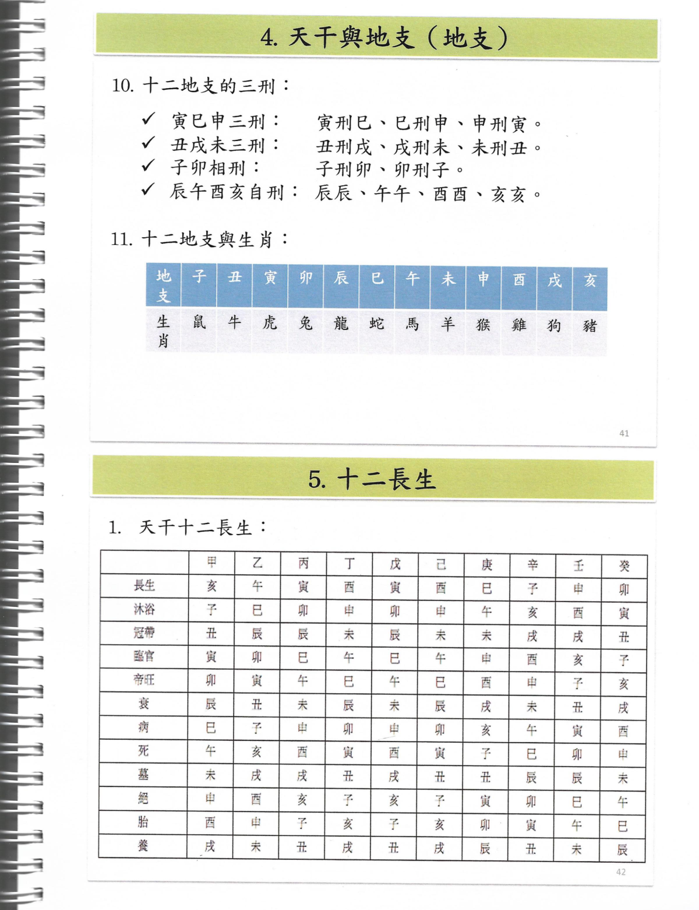

> **🖼 圖像解讀**　｜　檢視狀態：✅ 已檢視
> - **類型**：文字＋表格頁（投影片 41–42）
> - **內容**：投影片 41 十二地支三刑（寅巳申三刑、丑戌未三刑、子卯相刑、辰午酉亥自刑）及十二地支生肖對照；投影片 42 第五節「十二長生」之天干十二長生總表，列甲至癸各天干在長生、沐浴、冠帶、臨官、帝旺、衰、病、死、墓、絕、胎、養各階段所落的地支（陽干順行、陰干逆行）。
> - **原文出處（逐字）**：4. 天干與地支（地支）／10. 十二地支的三刑、11. 十二地支與生肖；5. 十二長生／1. 天干十二長生
> - **可檢索關鍵字**：地支三刑, 寅巳申, 丑戌未, 子卯相刑, 自刑, 生肖, 十二長生, 天干長生表

**📝 逐字謄寫（第 22 頁）**

### 4. 天干與地支（地支）（投影片 41）

10. 十二地支的三刑：
- ✓ 寅巳申三刑：寅刑巳、巳刑申、申刑寅。
- ✓ 丑戌未三刑：丑刑戌、戌刑未、未刑丑。
- ✓ 子卯相刑：子刑卯、卯刑子。
- ✓ 辰午酉亥自刑：辰辰、午午、酉酉、亥亥。

11. 十二地支與生肖：

| 地支 | 子 | 丑 | 寅 | 卯 | 辰 | 巳 | 午 | 未 | 申 | 酉 | 戌 | 亥 |
|---|---|---|---|---|---|---|---|---|---|---|---|---|
| 生肖 | 鼠 | 牛 | 虎 | 兔 | 龍 | 蛇 | 馬 | 羊 | 猴 | 雞 | 狗 | 豬 |

### 5. 十二長生（投影片 42）

1. 天干十二長生：

| | 甲 | 乙 | 丙 | 丁 | 戊 | 己 | 庚 | 辛 | 壬 | 癸 |
|---|---|---|---|---|---|---|---|---|---|---|
| 長生 | 亥 | 午 | 寅 | 酉 | 寅 | 酉 | 巳 | 子 | 申 | 卯 |
| 沐浴 | 子 | 巳 | 卯 | 申 | 卯 | 申 | 午 | 亥 | 酉 | 寅 |
| 冠帶 | 丑 | 辰 | 辰 | 未 | 辰 | 未 | 未 | 戌 | 戌 | 丑 |
| 臨官 | 寅 | 卯 | 巳 | 午 | 巳 | 午 | 申 | 酉 | 亥 | 子 |
| 帝旺 | 卯 | 寅 | 午 | 巳 | 午 | 巳 | 酉 | 申 | 子 | 亥 |
| 衰 | 辰 | 丑 | 未 | 辰 | 未 | 辰 | 戌 | 未 | 丑 | 戌 |
| 病 | 巳 | 子 | 申 | 卯 | 申 | 卯 | 亥 | 午 | 寅 | 酉 |
| 死 | 午 | 亥 | 酉 | 寅 | 酉 | 寅 | 子 | 巳 | 卯 | 申 |
| 墓 | 未 | 戌 | 戌 | 丑 | 戌 | 丑 | 丑 | 辰 | 辰 | 未 |
| 絕 | 申 | 酉 | 亥 | 子 | 亥 | 子 | 寅 | 卯 | 巳 | 午 |
| 胎 | 酉 | 申 | 子 | 亥 | 子 | 亥 | 卯 | 寅 | 午 | 巳 |
| 養 | 戌 | 未 | 丑 | 戌 | 丑 | 戌 | 辰 | 丑 | 未 | 辰 |

## 圖 23 — 第 23 頁（1204x1567）｜🖼 圖片（開圖判斷：圖表細看／裝飾照簡述）

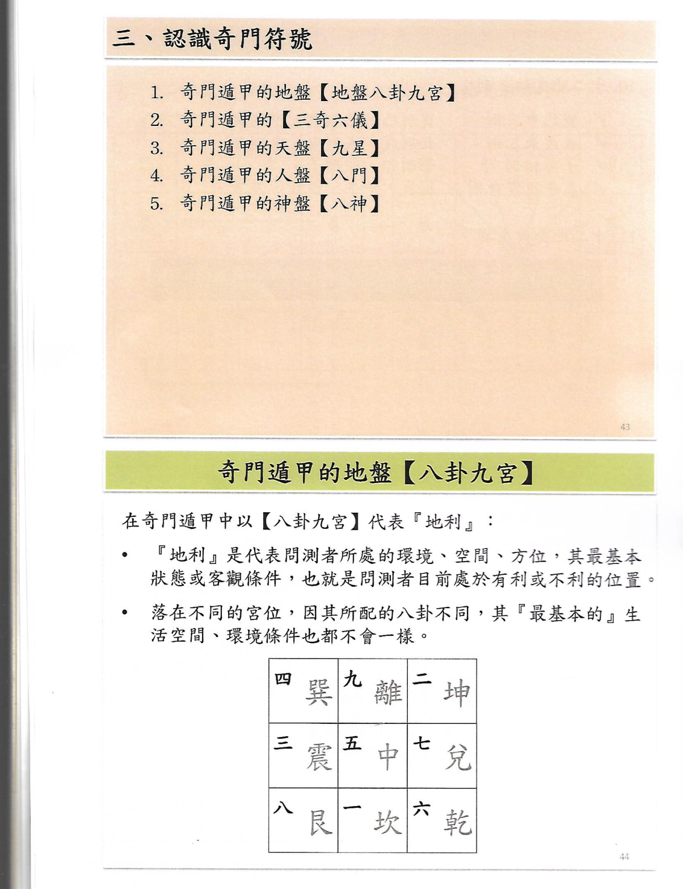

> **🖼 圖像解讀**　｜　檢視狀態：✅ 已檢視
> - **類型**：目錄頁＋九宮圖（投影片 43–44）
> - **內容**：第三章「認識奇門符號」目錄：地盤八卦九宮、三奇六儀、天盤九星、人盤八門、神盤八神；投影片 44 說明地盤八卦九宮代表『地利』，即問測者所處環境、空間、方位與目前處於有利或不利位置的基本狀態，並附洛書數九宮圖。
> - **原文出處（逐字）**：三、認識奇門符號；奇門遁甲的地盤【八卦九宮】
> - **可檢索關鍵字**：認識奇門符號, 地盤, 八卦九宮, 地利, 環境空間方位, 天盤九星, 人盤八門, 神盤八神

**📝 逐字謄寫（第 23 頁）**

### 三、認識奇門符號（投影片 43）

1. 奇門遁甲的地盤【地盤八卦九宮】
2. 奇門遁甲的【三奇六儀】
3. 奇門遁甲的天盤【九星】
4. 奇門遁甲的人盤【八門】
5. 奇門遁甲的神盤【八神】

### 奇門遁甲的地盤【八卦九宮】（投影片 44）

在奇門遁甲中以【八卦九宮】代表『地利』：

- 『地利』是代表問測者所處的環境、空間、方位，其最基本狀態或客觀條件，也就是問測者目前處於有利或不利的位置。
- 落在不同的宮位，因其所配的八卦不同，其『最基本的』生活空間、環境條件也都不會一樣。

| 四 巽 | 九 離 | 二 坤 |
|---|---|---|
| 三 震 | 五 中 | 七 兌 |
| 八 艮 | 一 坎 | 六 乾 |

## 圖 24 — 第 24 頁（1200x1561）｜🖼 圖片（開圖判斷：圖表細看／裝飾照簡述）

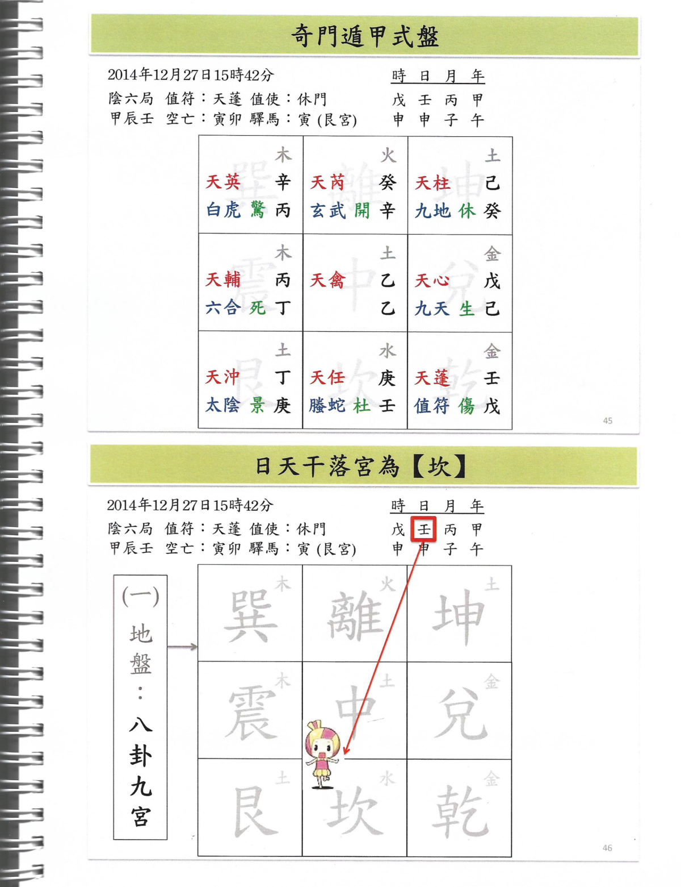

> **🖼 圖像解讀**　｜　檢視狀態：✅ 已檢視
> - **類型**：奇門盤圖表＋教學示意（投影片 45–46）
> - **內容**：投影片 45 再次列出 2014年12月27日15時42分的完整式盤（盤頭此處印為「陰六局」，第 5 頁同一盤印為「陽六局」，照原文分別記錄）；投影片 46「日天干落宮為【坎】」以紅框圈出日干「壬」，箭頭指向地盤坎宮，並以卡通小人標示問測者所在，說明第一層（一）地盤：八卦九宮。
> - **原文出處（逐字）**：奇門遁甲式盤；日天干落宮為【坎】；盤頭「2014年12月27日15時42分 陰六局 值符：天蓬 值使：休門 甲辰壬 空亡：寅卯 驛馬：寅(艮宮)」
> - **可檢索關鍵字**：奇門遁甲式盤, 日干落宮, 日干壬, 坎宮, 地盤八卦九宮, 問測者定位, 陰六局

**📝 逐字謄寫（第 24 頁）**

### 奇門遁甲式盤（投影片 45）

2014年12月27日15時42分
陰六局　值符：天蓬　值使：休門
甲辰壬　空亡：寅卯　驛馬：寅(艮宮)

| 時 | 日 | 月 | 年 |
|---|---|---|---|
| 戊申 | 壬申 | 丙子 | 甲午 |

| 巽（木） | 離（火） | 坤（土） |
|---|---|---|
| 天英 辛 白虎 驚 丙 | 天芮 癸 玄武 開 辛 | 天柱 己 九地 休 癸 |
| **震（木）** | **中（土）** | **兌（金）** |
| 天輔 丙 六合 死 丁 | 天禽 乙 乙 | 天心 戊 九天 生 己 |
| **艮（土）** | **坎（水）** | **乾（金）** |
| 天沖 丁 太陰 景 庚 | 天任 庚 螣蛇 杜 壬 | 天蓬 壬 值符 傷 戊 |

（註：本頁盤頭印「陰六局」，第 5 頁同一時間盤印「陽六局」，原文如此。）

### 日天干落宮為【坎】（投影片 46）

2014年12月27日15時42分
陰六局　值符：天蓬　值使：休門
甲辰壬　空亡：寅卯　驛馬：寅(艮宮)
四柱：時 戊申｜日 ［壬］申｜月 丙子｜年 甲午（日干「壬」以紅框標示）

左側標籤：（一）地盤：八卦九宮

（空白九宮格，只標宮名與五行：巽木、離火、坤土／震木、中土、兌金／艮土、坎水、乾金。紅色箭頭由日干「壬」指向坎宮，坎宮上方有一個卡通小人代表問測者。）

## 圖 25 — 第 25 頁（1200x1561）｜🖼 圖片（開圖判斷：圖表細看／裝飾照簡述）

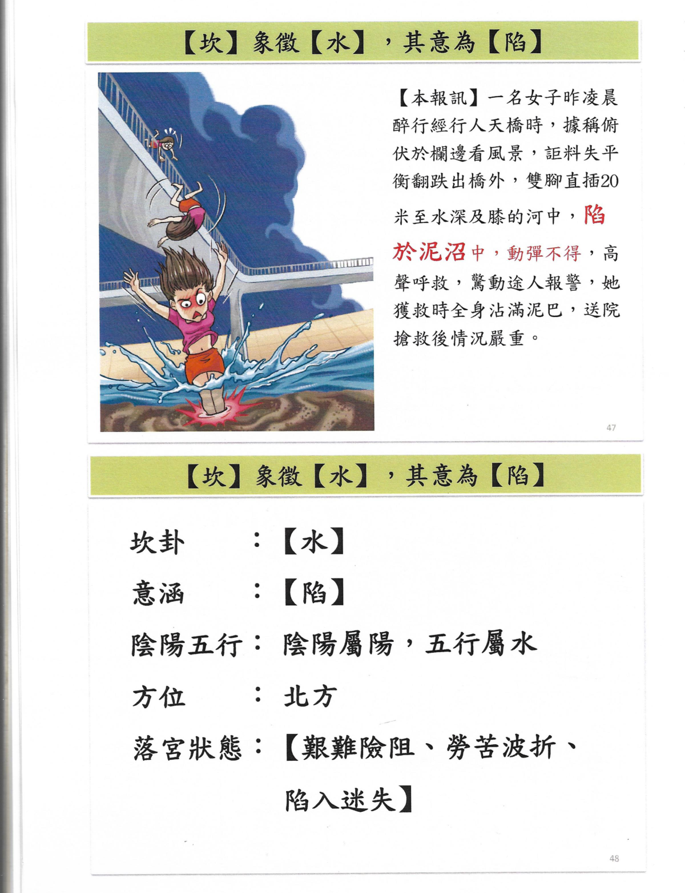

> **🖼 圖像解讀**　｜　檢視狀態：✅ 已檢視
> - **類型**：漫畫插圖＋文字頁（投影片 47–48）
> - **內容**：以一則「醉女翻出人行天橋、雙腳陷入河中泥沼」的新聞漫畫比喻坎卦之「陷」；投影片 48 列坎卦類象：象徵水、意涵陷、陰陽屬陽五行屬水、方位北方，落宮狀態為艱難險阻、勞苦波折、陷入迷失。
> - **原文出處（逐字）**：【坎】象徵【水】，其意為【陷】
> - **可檢索關鍵字**：坎卦, 坎宮, 水, 陷, 北方, 艱難險阻, 勞苦波折, 陷入迷失

**📝 逐字謄寫（第 25 頁）**

### 【坎】象徵【水】，其意為【陷】（投影片 47）

（漫畫：女子從天橋翻落，雙腳插入河底泥中）

【本報訊】一名女子昨凌晨醉行經行人天橋時，據稱俯伏於欄邊看風景，詎料失平衡翻跌出橋外，雙腳直插20米至水深及膝的河中，**陷於泥沼中**，動彈不得，高聲呼救，驚動途人報警，她獲救時全身沾滿泥巴，送院搶救後情況嚴重。

### 【坎】象徵【水】，其意為【陷】（投影片 48）

- 坎卦：【水】
- 意涵：【陷】
- 陰陽五行：陰陽屬陽，五行屬水
- 方位：北方
- 落宮狀態：【艱難險阻、勞苦波折、陷入迷失】

## 圖 26 — 第 26 頁（1200x1561）｜🖼 圖片（開圖判斷：圖表細看／裝飾照簡述）

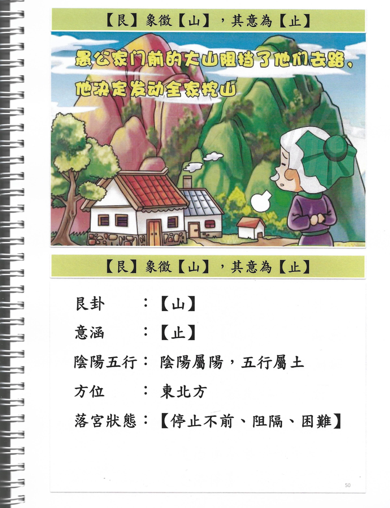

> **🖼 圖像解讀**　｜　檢視狀態：✅ 已檢視
> - **類型**：漫畫插圖＋文字頁（投影片 49–50）
> - **內容**：以「愚公移山」漫畫比喻艮卦之「止」（大山擋路）；投影片 50 列艮卦類象：象徵山、意涵止、陰陽屬陽五行屬土、方位東北方，落宮狀態為停止不前、阻隔、困難。
> - **原文出處（逐字）**：【艮】象徵【山】，其意為【止】
> - **可檢索關鍵字**：艮卦, 艮宮, 山, 止, 東北方, 停止不前, 阻隔, 愚公移山

**📝 逐字謄寫（第 26 頁）**

### 【艮】象徵【山】，其意為【止】（投影片 49）

（漫畫：愚公站在家門前望著大山；圖上文字〔簡體〕：「愚公家门前的大山阻挡了他们去路，他决定发动全家挖山」）

### 【艮】象徵【山】，其意為【止】（投影片 50）

- 艮卦：【山】
- 意涵：【止】
- 陰陽五行：陰陽屬陽，五行屬土
- 方位：東北方
- 落宮狀態：【停止不前、阻隔、困難】

## 圖 27 — 第 27 頁（1200x1561）｜🖼 圖片（開圖判斷：圖表細看／裝飾照簡述）

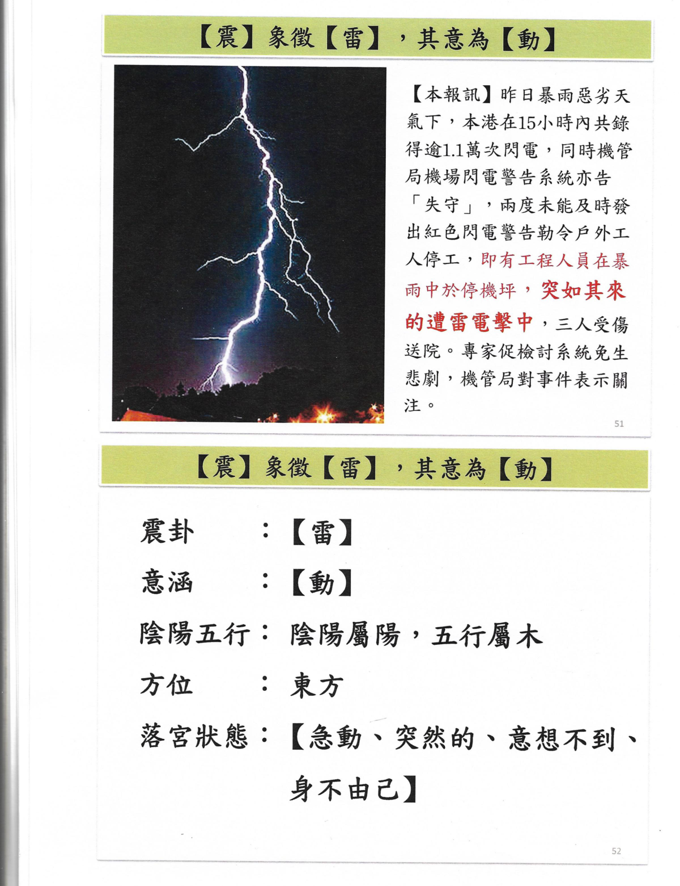

> **🖼 圖像解讀**　｜　檢視狀態：✅ 已檢視
> - **類型**：照片＋文字頁（投影片 51–52）
> - **內容**：以「暴雨中停機坪工程人員突遭雷擊」新聞配閃電照片，比喻震卦之「動」；投影片 52 列震卦類象：象徵雷、意涵動、陰陽屬陽五行屬木、方位東方，落宮狀態為急動、突然的、意想不到、身不由己。
> - **原文出處（逐字）**：【震】象徵【雷】，其意為【動】
> - **可檢索關鍵字**：震卦, 震宮, 雷, 動, 東方, 急動, 意想不到, 身不由己

**📝 逐字謄寫（第 27 頁）**

### 【震】象徵【雷】，其意為【動】（投影片 51）

（照片：夜空閃電劈落）

【本報訊】昨日暴雨惡劣天氣下，本港在15小時內共錄得逾1.1萬次閃電，同時機管局機場閃電警告系統亦告「失守」，兩度未能及時發出紅色閃電警告勒令戶外工人停工，**即有工程人員在暴雨中於停機坪，突如其來的遭雷電擊中**，三人受傷送院。專家促檢討系統免生悲劇，機管局對事件表示關注。

### 【震】象徵【雷】，其意為【動】（投影片 52）

- 震卦：【雷】
- 意涵：【動】
- 陰陽五行：陰陽屬陽，五行屬木
- 方位：東方
- 落宮狀態：【急動、突然的、意想不到、身不由己】

## 圖 28 — 第 28 頁（1200x1561）｜🖼 圖片（開圖判斷：圖表細看／裝飾照簡述）

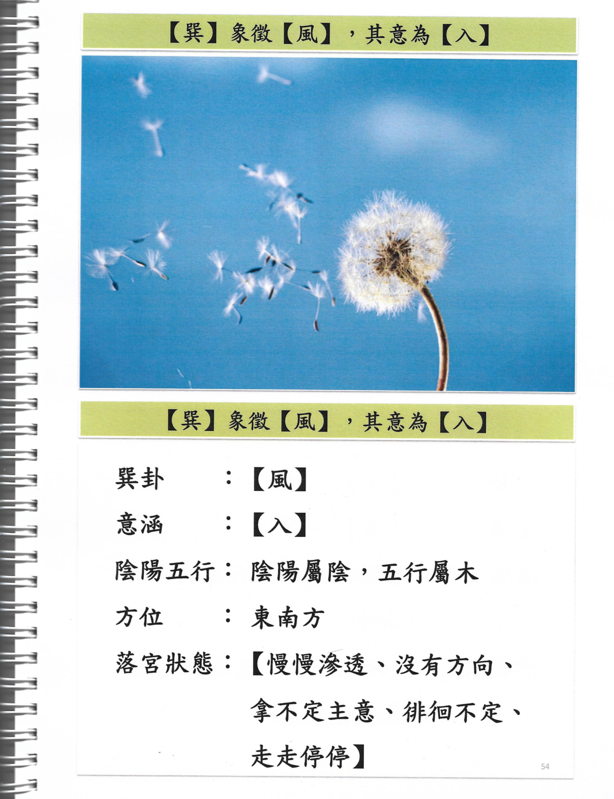

> **🖼 圖像解讀**　｜　檢視狀態：✅ 已檢視
> - **類型**：照片＋文字頁（投影片 53–54）
> - **內容**：以蒲公英種子隨風飄散照片比喻巽卦之「入」；投影片 54 列巽卦類象：象徵風、意涵入、陰陽屬陰五行屬木、方位東南方，落宮狀態為慢慢滲透、沒有方向、拿不定主意、徘徊不定、走走停停。
> - **原文出處（逐字）**：【巽】象徵【風】，其意為【入】
> - **可檢索關鍵字**：巽卦, 巽宮, 風, 入, 東南方, 慢慢滲透, 拿不定主意, 徘徊不定

**📝 逐字謄寫（第 28 頁）**

### 【巽】象徵【風】，其意為【入】（投影片 53）

（照片：藍天下蒲公英種子隨風飄散）

### 【巽】象徵【風】，其意為【入】（投影片 54）

- 巽卦：【風】
- 意涵：【入】
- 陰陽五行：陰陽屬陰，五行屬木
- 方位：東南方
- 落宮狀態：【慢慢滲透、沒有方向、拿不定主意、徘徊不定、走走停停】

## 圖 29 — 第 29 頁（1200x1561）｜🖼 圖片（開圖判斷：圖表細看／裝飾照簡述）

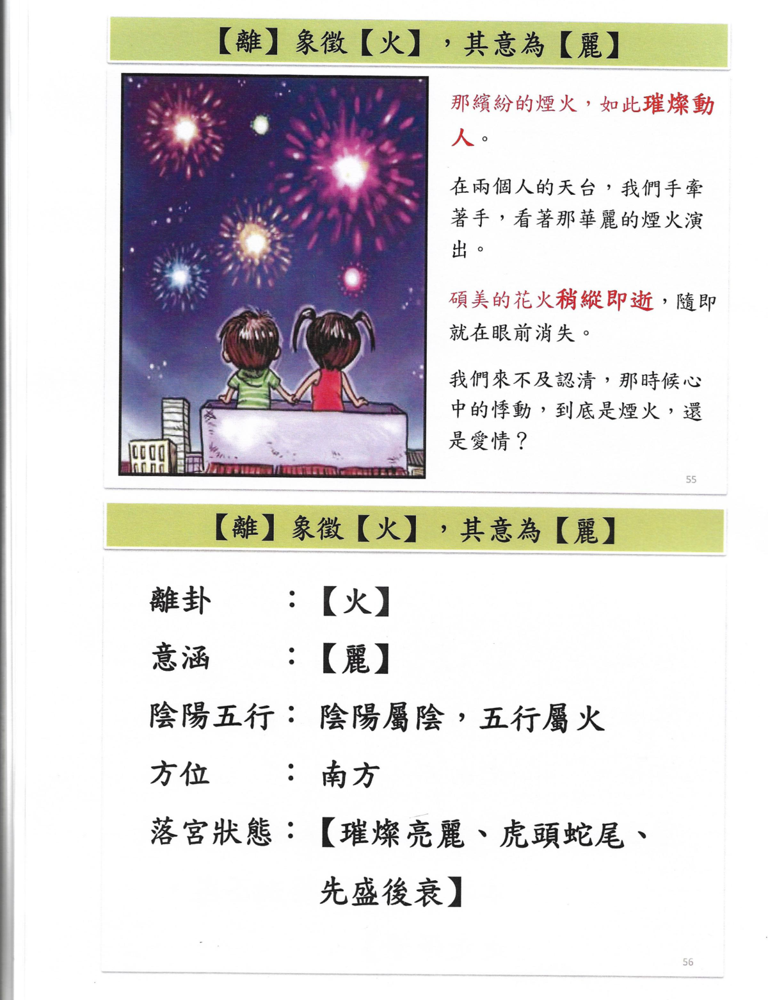

> **🖼 圖像解讀**　｜　檢視狀態：✅ 已檢視
> - **類型**：漫畫插圖＋文字頁（投影片 55–56）
> - **內容**：以一對小情侶在天台看煙火的漫畫比喻離卦之「麗」（璀璨動人但稍縱即逝）；投影片 56 列離卦類象：象徵火、意涵麗、陰陽屬陰五行屬火、方位南方，落宮狀態為璀燦亮麗、虎頭蛇尾、先盛後衰。
> - **原文出處（逐字）**：【離】象徵【火】，其意為【麗】
> - **可檢索關鍵字**：離卦, 離宮, 火, 麗, 南方, 璀燦亮麗, 虎頭蛇尾, 先盛後衰

**📝 逐字謄寫（第 29 頁）**

### 【離】象徵【火】，其意為【麗】（投影片 55）

（漫畫：兩個孩子手牽手坐在天台看煙火）

那繽紛的煙火，如此**璀燦動人**。

在兩個人的天台，我們手牽著手，看著那華麗的煙火演出。

碩美的花火**稍縱即逝**，隨即就在眼前消失。

我們來不及認清，那時候心中的悸動，到底是煙火，還是愛情？

### 【離】象徵【火】，其意為【麗】（投影片 56）

- 離卦：【火】
- 意涵：【麗】
- 陰陽五行：陰陽屬陰，五行屬火
- 方位：南方
- 落宮狀態：【璀燦亮麗、虎頭蛇尾、先盛後衰】

## 圖 30 — 第 30 頁（1200x1561）｜🖼 圖片（開圖判斷：圖表細看／裝飾照簡述）

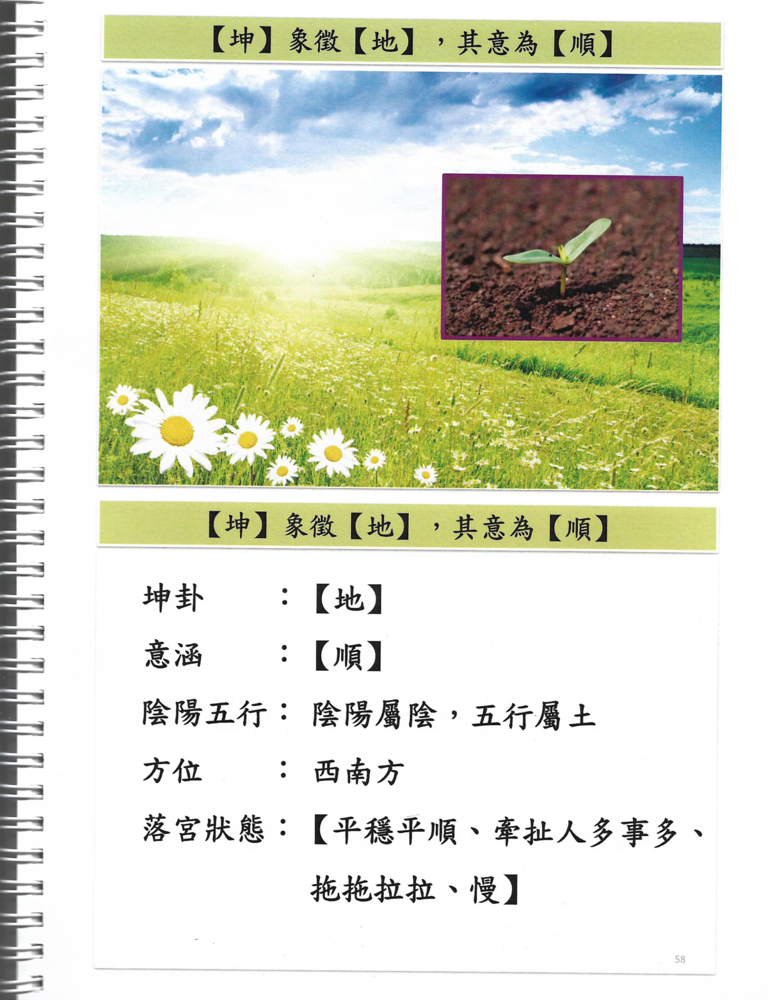

> **🖼 圖像解讀**　｜　檢視狀態：✅ 已檢視
> - **類型**：照片＋文字頁（投影片 57–58）
> - **內容**：以陽光草原與土中新芽照片比喻坤卦之「順」；投影片 58 列坤卦類象：象徵地、意涵順、陰陽屬陰五行屬土、方位西南方，落宮狀態為平穩平順、牽扯人多事多、拖拖拉拉、慢。
> - **原文出處（逐字）**：【坤】象徵【地】，其意為【順】
> - **可檢索關鍵字**：坤卦, 坤宮, 地, 順, 西南方, 平穩平順, 人多事多, 拖拖拉拉

**📝 逐字謄寫（第 30 頁）**

### 【坤】象徵【地】，其意為【順】（投影片 57）

（照片：陽光下的雛菊草原，內嵌土壤中冒出的新芽）

### 【坤】象徵【地】，其意為【順】（投影片 58）

- 坤卦：【地】
- 意涵：【順】
- 陰陽五行：陰陽屬陰，五行屬土
- 方位：西南方
- 落宮狀態：【平穩平順、牽扯人多事多、拖拖拉拉、慢】

## 圖 31 — 第 31 頁（1200x1561）｜🖼 圖片（開圖判斷：圖表細看／裝飾照簡述）

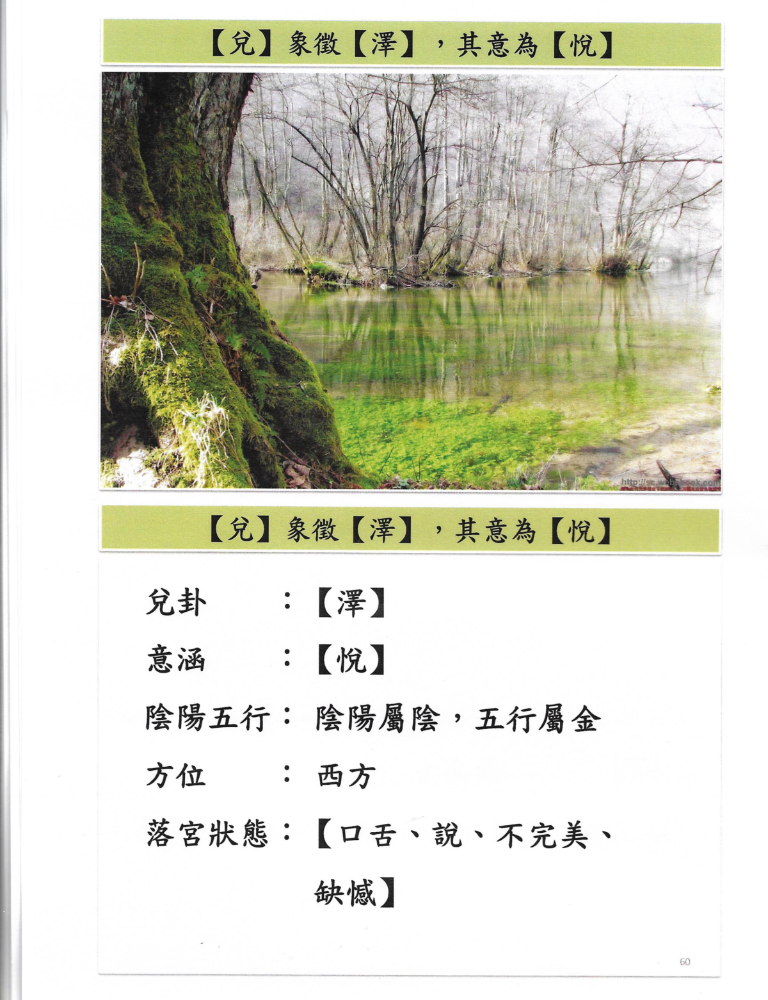

> **🖼 圖像解讀**　｜　檢視狀態：✅ 已檢視
> - **類型**：照片＋文字頁（投影片 59–60）
> - **內容**：以青苔古樹與清澈沼澤照片比喻兌卦之「悅」；投影片 60 列兌卦類象：象徵澤、意涵悅、陰陽屬陰五行屬金、方位西方，落宮狀態為口舌、說、不完美、缺憾。
> - **原文出處（逐字）**：【兌】象徵【澤】，其意為【悅】
> - **可檢索關鍵字**：兌卦, 兌宮, 澤, 悅, 西方, 口舌, 不完美, 缺憾

**📝 逐字謄寫（第 31 頁）**

### 【兌】象徵【澤】，其意為【悅】（投影片 59）

（照片：長滿青苔的樹幹旁一片清澈沼澤，遠處枯樹林；右下角有網址浮水印，圖中未能完整辨識）

### 【兌】象徵【澤】，其意為【悅】（投影片 60）

- 兌卦：【澤】
- 意涵：【悅】
- 陰陽五行：陰陽屬陰，五行屬金
- 方位：西方
- 落宮狀態：【口舌、說、不完美、缺憾】

## 圖 32 — 第 32 頁（1200x1561）｜🖼 圖片（開圖判斷：圖表細看／裝飾照簡述）

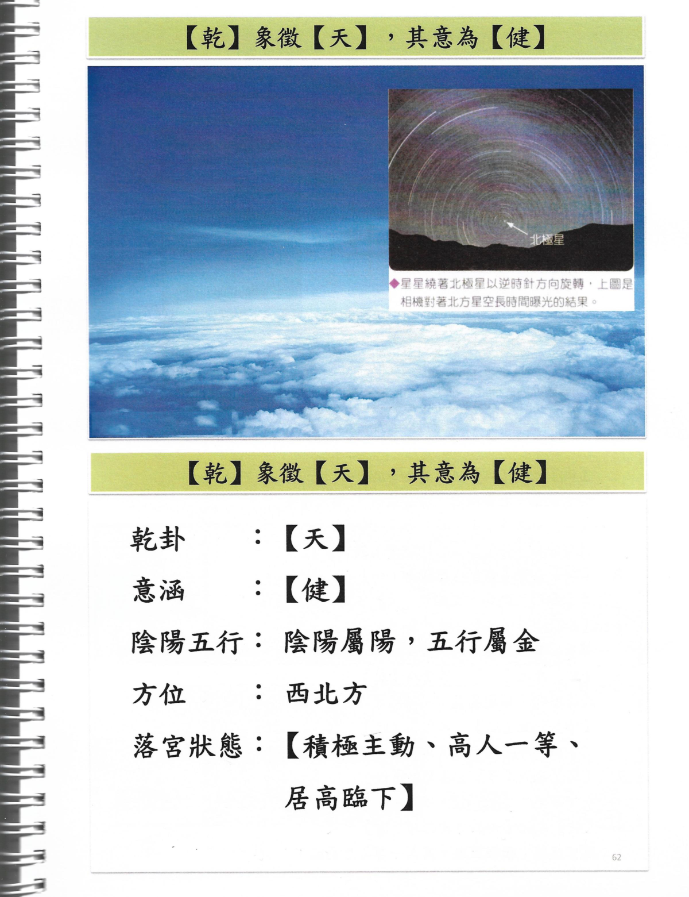

> **🖼 圖像解讀**　｜　檢視狀態：✅ 已檢視
> - **類型**：照片＋文字頁（投影片 61–62）
> - **內容**：以雲海天空與北極星星軌照片比喻乾卦之「健」（星星繞北極星逆時針旋轉）；投影片 62 列乾卦類象：象徵天、意涵健、陰陽屬陽五行屬金、方位西北方，落宮狀態為積極主動、高人一等、居高臨下。
> - **原文出處（逐字）**：【乾】象徵【天】，其意為【健】；內嵌圖說
> - **可檢索關鍵字**：乾卦, 乾宮, 天, 健, 西北方, 積極主動, 高人一等, 居高臨下

**📝 逐字謄寫（第 32 頁）**

### 【乾】象徵【天】，其意為【健】（投影片 61）

（照片：雲海上方的藍天；內嵌星軌照片，箭頭標示「北極星」）

內嵌圖說：◆星星繞著北極星以逆時針方向旋轉，上圖是相機對著北方星空長時間曝光的結果。

### 【乾】象徵【天】，其意為【健】（投影片 62）

- 乾卦：【天】
- 意涵：【健】
- 陰陽五行：陰陽屬陽，五行屬金
- 方位：西北方
- 落宮狀態：【積極主動、高人一等、居高臨下】

## 圖 33 — 第 33 頁（1200x1561）｜🖼 圖片（開圖判斷：圖表細看／裝飾照簡述）

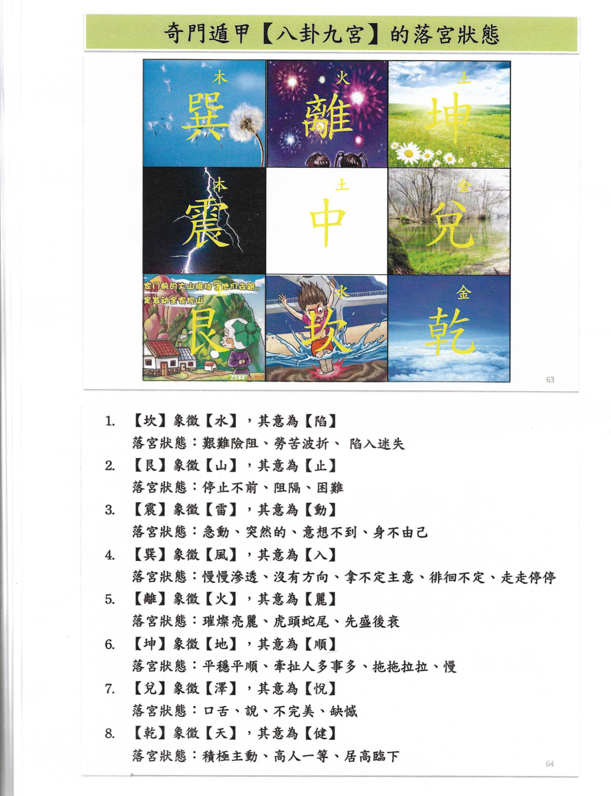

> **🖼 圖像解讀**　｜　檢視狀態：✅ 已檢視
> - **類型**：圖片拼貼九宮＋文字總整理（投影片 63–64）
> - **內容**：投影片 63 將前述八卦配圖依後天九宮排列（巽木、離火、坤土／震木、中土、兌金／艮土、坎水、乾金）；投影片 64 總整理八卦的象徵、意涵與落宮狀態。
> - **原文出處（逐字）**：奇門遁甲【八卦九宮】的落宮狀態
> - **可檢索關鍵字**：八卦九宮, 落宮狀態, 八卦總整理, 坎陷, 艮止, 震動, 巽入, 乾健

**📝 逐字謄寫（第 33 頁）**

### 奇門遁甲【八卦九宮】的落宮狀態（投影片 63）

（九宮拼貼圖，每宮配前面介紹過的照片或漫畫並標宮名、五行）

| 巽（木）蒲公英 | 離（火）煙火 | 坤（土）草原 |
|---|---|---|
| **震（木）**閃電 | **中（土）** | **兌（金）**沼澤 |
| **艮（土）**愚公移山 | **坎（水）**落水女子 | **乾（金）**雲海 |

### （投影片 64）

1. 【坎】象徵【水】，其意為【陷】
   落宮狀態：艱難險阻、勞苦波折、陷入迷失
2. 【艮】象徵【山】，其意為【止】
   落宮狀態：停止不前、阻隔、困難
3. 【震】象徵【雷】，其意為【動】
   落宮狀態：急動、突然的、意想不到、身不由己
4. 【巽】象徵【風】，其意為【入】
   落宮狀態：慢慢滲透、沒有方向、拿不定主意、徘徊不定、走走停停
5. 【離】象徵【火】，其意為【麗】
   落宮狀態：璀燦亮麗、虎頭蛇尾、先盛後衰
6. 【坤】象徵【地】，其意為【順】
   落宮狀態：平穩平順、牽扯人多事多、拖拖拉拉、慢
7. 【兌】象徵【澤】，其意為【悅】
   落宮狀態：口舌、說、不完美、缺憾
8. 【乾】象徵【天】，其意為【健】
   落宮狀態：積極主動、高人一等、居高臨下

## 圖 34 — 第 34 頁（1200x1561）｜🖼 圖片（開圖判斷：圖表細看／裝飾照簡述）

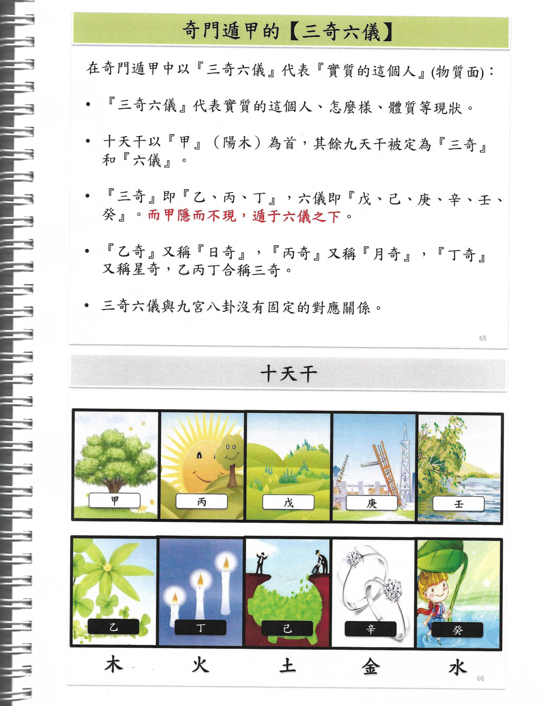

> **🖼 圖像解讀**　｜　檢視狀態：✅ 已檢視
> - **類型**：文字頁＋十天干圖卡（投影片 65–66）
> - **內容**：投影片 65 重申三奇六儀代表「實質的這個人」（物質面）：甲隱於六儀、乙丙丁為日月星三奇、三奇六儀與九宮八卦無固定對應；投影片 66「十天干」以圖卡呈現十天干意象，上排陽干、下排陰干，並按五行分欄：甲大樹／乙花草（木）、丙太陽／丁燭火（火）、戊山野大地／己田園（土）、庚鋼鐵建物／辛珠寶戒指（金）、壬江河／癸雨露（水）。
> - **原文出處（逐字）**：奇門遁甲的【三奇六儀】；十天干
> - **可檢索關鍵字**：三奇六儀, 實質的這個人, 十天干意象, 甲木大樹, 丙火太陽, 庚金, 辛金珠寶, 癸水雨露

**📝 逐字謄寫（第 34 頁）**

### 奇門遁甲的【三奇六儀】（投影片 65）

在奇門遁甲中以『三奇六儀』代表『實質的這個人』(物質面)：

- 『三奇六儀』代表實質的這個人、怎麼樣、體質等現狀。
- 十天干以『甲』（陽木）為首，其餘九天干被定為『三奇』和『六儀』。
- 『三奇』即『乙、丙、丁』，六儀即『戊、己、庚、辛、壬、癸』。**而甲隱而不現，遁于六儀之下。**
- 『乙奇』又稱『日奇』，『丙奇』又稱『月奇』，『丁奇』又稱星奇，乙丙丁合稱三奇。
- 三奇六儀與九宮八卦沒有固定的對應關係。

### 十天干（投影片 66）

| 五行 | 木 | 火 | 土 | 金 | 水 |
|---|---|---|---|---|---|
| 陽干（上排圖卡） | 甲：大樹 | 丙：笑臉太陽 | 戊：山丘大地 | 庚：鐵塔、閘門等鋼鐵建物 | 壬：江河湖水 |
| 陰干（下排圖卡） | 乙：花草葉片 | 丁：燭火 | 己：田園耕地（兩人在田邊） | 辛：鑽石戒指 | 癸：雨中撐葉子的孩子（雨露） |

（圖卡內容為圖像描述，原投影片僅標天干名與五行。）

## 圖 35 — 第 35 頁（1200x1561）｜🖼 圖片（開圖判斷：圖表細看／裝飾照簡述）

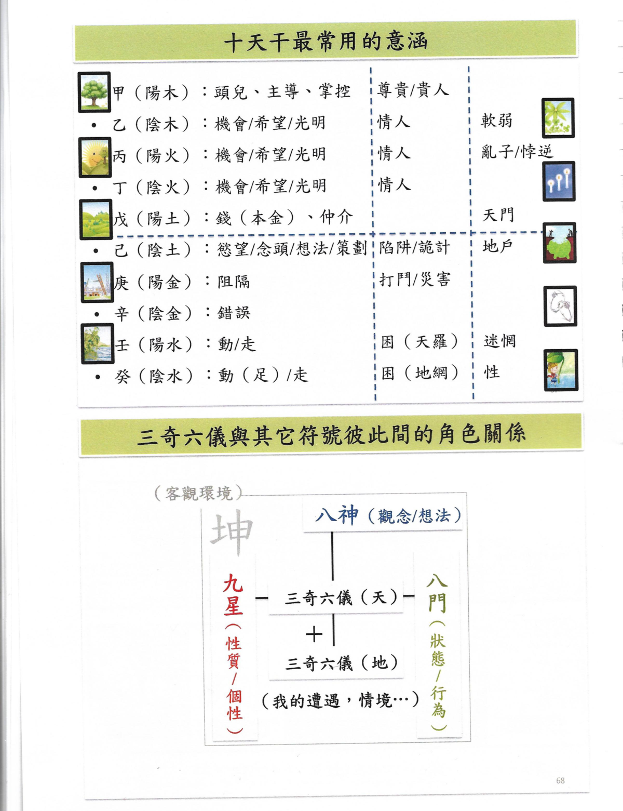

> **🖼 圖像解讀**　｜　檢視狀態：✅ 已檢視
> - **類型**：意涵對照表＋關係結構圖（投影片 67–68）
> - **內容**：投影片 67「十天干最常用的意涵」逐一列出甲至癸的主要意涵及延伸意涵（如甲為頭兒掌控/貴人、乙丙丁為機會希望光明/情人、戊為錢本金仲介/天門、己為慾望念頭策劃/陷阱詭計/地戶、庚為阻隔/打鬥災害、辛為錯誤、壬癸為動走/天羅地網之困）；投影片 68 以坤宮為例說明各符號角色：八卦宮位＝客觀環境、八神＝觀念/想法、九星＝性質/個性、八門＝狀態/行為、天盤＋地盤三奇六儀＝我的遭遇與情境。
> - **原文出處（逐字）**：十天干最常用的意涵；三奇六儀與其它符號彼此間的角色關係
> - **可檢索關鍵字**：十天干意涵, 甲為頭兒, 戊為錢, 己為陷阱, 庚為阻隔, 天羅地網, 符號角色關係, 八神觀念九星性質八門狀態

**📝 逐字謄寫（第 35 頁）**

### 十天干最常用的意涵（投影片 67）

（每個天干旁配上一頁的天干意象小圖）

| 天干 | 主要意涵 | 延伸意涵一 | 延伸意涵二 |
|---|---|---|---|
| 甲（陽木） | 頭兒、主導、掌控 | 尊貴/貴人 | |
| 乙（陰木） | 機會/希望/光明 | 情人 | 軟弱 |
| 丙（陽火） | 機會/希望/光明 | 情人 | 亂子/悖逆 |
| 丁（陰火） | 機會/希望/光明 | 情人 | |
| 戊（陽土） | 錢（本金）、仲介 | | 天門 |
| 己（陰土） | 慾望/念頭/想法/策劃 | 陷阱/詭計 | 地戶 |
| 庚（陽金） | 阻隔 | 打鬥/災害 | |
| 辛（陰金） | 錯誤 | | |
| 壬（陽水） | 動/走 | 困（天羅） | 迷惘 |
| 癸（陰水） | 動（足）/走 | 困（地網） | 性 |

（原表在戊、己之間有一條虛線分隔；欄位之間以虛線區隔，欄名原文未標。）

### 三奇六儀與其它符號彼此間的角色關係（投影片 68）

結構圖（以坤宮為框）：
- 宮位（坤）：（客觀環境）
- 八神：（觀念/想法）— 位於上方
- 九星：（性質/個性）— 位於左側
- 八門：（狀態/行為）— 位於右側
- 中央：三奇六儀（天）＋ 三奇六儀（地）＝（我的遭遇，情境…）

## 圖 36 — 第 36 頁（1200x1561）｜🖼 圖片（開圖判斷：圖表細看／裝飾照簡述）

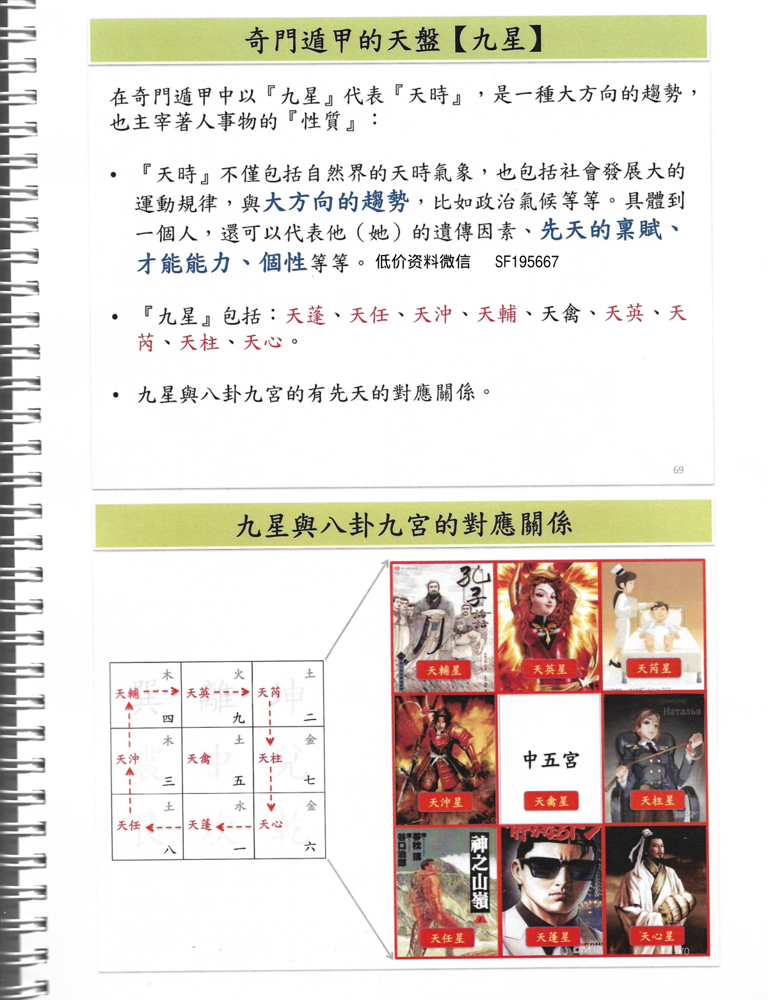

> **🖼 圖像解讀**　｜　檢視狀態：✅ 已檢視
> - **類型**：文字頁＋九宮圖與人物圖卡（投影片 69–70）
> - **內容**：投影片 69 說明天盤九星代表『天時』：大方向趨勢、社會發展規律，落到個人即遺傳因素、先天稟賦、才能能力與個性；九星為天蓬、天任、天沖、天輔、天禽、天英、天芮、天柱、天心，與八卦九宮有先天對應。投影片 70 以九宮圖標出九星原宮（輔四、英九、芮二、沖三、禽五、柱七、任八、蓬一、心六）及順時針轉動箭頭，右側以人物圖卡代表各星（天輔孔子、天英火焰女郎、天芮病人護士、天沖武士、天柱女軍官、天任登山者、天蓬墨鏡男、天心羽扇軍師）。
> - **原文出處（逐字）**：奇門遁甲的天盤【九星】；九星與八卦九宮的對應關係
> - **可檢索關鍵字**：天盤九星, 天時, 先天稟賦, 個性, 九星原宮, 天蓬坎一, 天心乾六, 九星人物

**📝 逐字謄寫（第 36 頁）**

### 奇門遁甲的天盤【九星】（投影片 69）

在奇門遁甲中以『九星』代表『天時』，是一種大方向的趨勢，也主宰著人事物的『性質』：

- 『天時』不僅包括自然界的天時氣象，也包括社會發展大的運動規律，與**大方向的趨勢**，比如政治氣候等等。具體到一個人，還可以代表他（她）的遺傳因素、**先天的稟賦、才能能力、個性**等等。〔此處夾有轉售浮水印，略〕
- 『九星』包括：天蓬、天任、天沖、天輔、天禽、天英、天芮、天柱、天心。
- 九星與八卦九宮的有先天的對應關係。

### 九星與八卦九宮的對應關係（投影片 70）

左圖：九星原宮（箭頭沿外圈順時針：天輔→天英→天芮→天柱→天心→天蓬→天任→天沖→天輔）

| 巽 四 木：天輔 | 離 九 火：天英 | 坤 二 土：天芮 |
|---|---|---|
| **震 三 木：天沖** | **中 五 土：天禽** | **兌 七 金：天柱** |
| **艮 八 土：天任** | **坎 一 水：天蓬** | **乾 六 金：天心** |

右圖：九星人物圖卡（同九宮排列）

| 天輔星（孔子漫畫封面） | 天英星（火焰紅髮女性） | 天芮星（護士照顧臥床病童） |
|---|---|---|
| 天沖星（持刀武士） | 中五宮：天禽星 | 天柱星（女軍官） |
| 天任星（《神之山嶺》登山者封面） | 天蓬星（戴墨鏡男子漫畫封面） | 天心星（羽扇古代軍師） |

## 圖 37 — 第 37 頁（1200x1561）｜🖼 圖片（開圖判斷：圖表細看／裝飾照簡述）

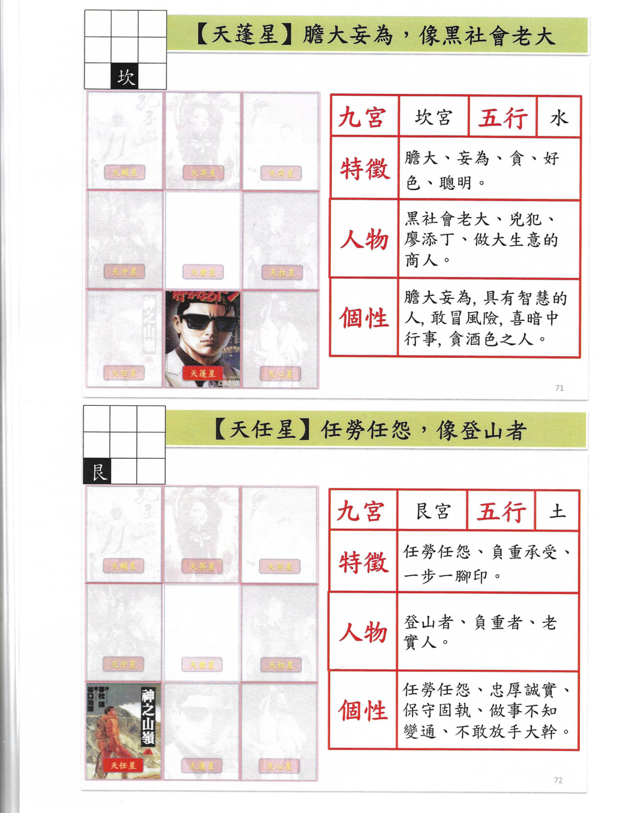

> **🖼 圖像解讀**　｜　檢視狀態：✅ 已檢視
> - **類型**：九星類象卡（投影片 71–72）
> - **內容**：九星逐一介紹：天蓬星（坎宮・水）膽大妄為，像黑社會老大；天任星（艮宮・土）任勞任怨，像登山者。各列九宮、五行、特徵、人物、個性，左側為九星人物九宮圖、僅高亮該星。
> - **原文出處（逐字）**：【天蓬星】膽大妄為，像黑社會老大；【天任星】任勞任怨，像登山者
> - **可檢索關鍵字**：天蓬星, 坎宮, 膽大妄為, 黑社會老大, 天任星, 艮宮, 任勞任怨, 登山者

**📝 逐字謄寫（第 37 頁）**

### 【天蓬星】膽大妄為，像黑社會老大（投影片 71）

（左上小九宮標示「坎」；左圖九星人物九宮，僅天蓬星高亮）

| 九宮 | 坎宮 | 五行 | 水 |
|---|---|---|---|
| 特徵 | 膽大、妄為、貪、好色、聰明。 | | |
| 人物 | 黑社會老大、兇犯、廖添丁、做大生意的商人。 | | |
| 個性 | 膽大妄為, 具有智慧的人, 敢冒風險, 喜暗中行事, 貪酒色之人。 | | |

### 【天任星】任勞任怨，像登山者（投影片 72）

（左上小九宮標示「艮」；僅天任星高亮）

| 九宮 | 艮宮 | 五行 | 土 |
|---|---|---|---|
| 特徵 | 任勞任怨、負重承受、一步一腳印。 | | |
| 人物 | 登山者、負重者、老實人。 | | |
| 個性 | 任勞任怨、忠厚誠實、保守固執、做事不知變通、不敢放手大幹。 | | |

## 圖 38 — 第 38 頁（1200x1561）｜🖼 圖片（開圖判斷：圖表細看／裝飾照簡述）

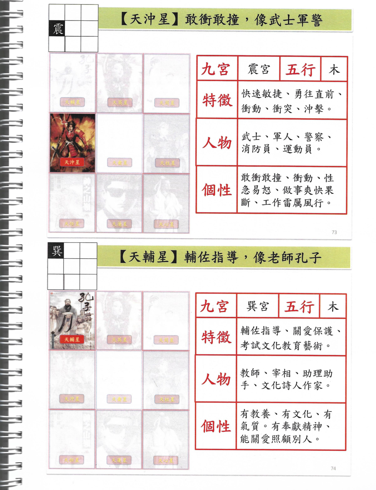

> **🖼 圖像解讀**　｜　檢視狀態：✅ 已檢視
> - **類型**：九星類象卡（投影片 73–74）
> - **內容**：天沖星（震宮・木）敢衝敢撞，像武士軍警；天輔星（巽宮・木）輔佐指導，像老師孔子。各列九宮、五行、特徵、人物、個性。
> - **原文出處（逐字）**：【天沖星】敢衝敢撞，像武士軍警；【天輔星】輔佐指導，像老師孔子
> - **可檢索關鍵字**：天沖星, 震宮, 敢衝敢撞, 武士軍警, 天輔星, 巽宮, 輔佐指導, 老師孔子

**📝 逐字謄寫（第 38 頁）**

### 【天沖星】敢衝敢撞，像武士軍警（投影片 73）

（左上小九宮標示「震」；僅天沖星高亮）

| 九宮 | 震宮 | 五行 | 木 |
|---|---|---|---|
| 特徵 | 快速敏捷、勇往直前、衝動、衝突、沖擊。 | | |
| 人物 | 武士、軍人、警察、消防員、運動員。 | | |
| 個性 | 敢衝敢撞、衝動、性急易怒、做事爽快果斷、工作雷厲風行。 | | |

### 【天輔星】輔佐指導，像老師孔子（投影片 74）

（左上小九宮標示「巽」；僅天輔星高亮）

| 九宮 | 巽宮 | 五行 | 木 |
|---|---|---|---|
| 特徵 | 輔佐指導、關愛保護、考試文化教育藝術。 | | |
| 人物 | 教師、宰相、助理助手、文化詩人作家。 | | |
| 個性 | 有教養、有文化、有氣質。有奉獻精神、能關愛照顧別人。 | | |

## 圖 39 — 第 39 頁（1200x1561）｜🖼 圖片（開圖判斷：圖表細看／裝飾照簡述）

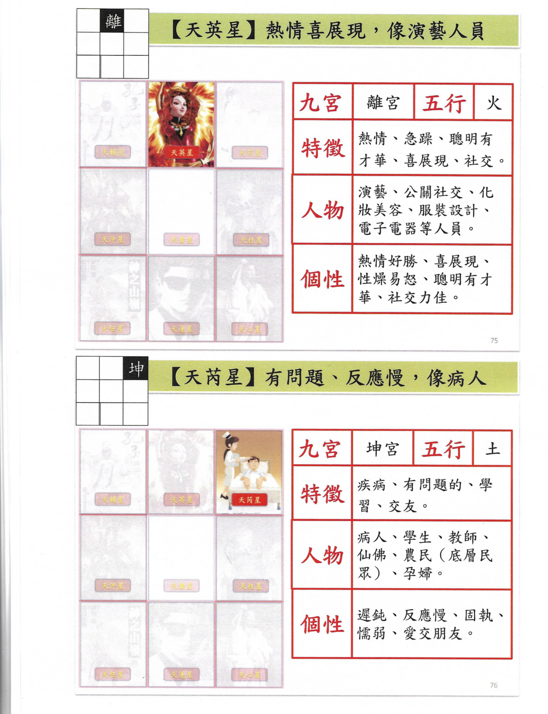

> **🖼 圖像解讀**　｜　檢視狀態：✅ 已檢視
> - **類型**：九星類象卡（投影片 75–76）
> - **內容**：天英星（離宮・火）熱情喜展現，像演藝人員；天芮星（坤宮・土）有問題、反應慢，像病人。各列九宮、五行、特徵、人物、個性。
> - **原文出處（逐字）**：【天英星】熱情喜展現，像演藝人員；【天芮星】有問題、反應慢，像病人
> - **可檢索關鍵字**：天英星, 離宮, 熱情喜展現, 演藝人員, 天芮星, 坤宮, 疾病, 病人學生

**📝 逐字謄寫（第 39 頁）**

### 【天英星】熱情喜展現，像演藝人員（投影片 75）

（左上小九宮標示「離」；僅天英星高亮）

| 項目 | 內容 |
|---|---|
| 九宮／五行 | 離宮／火 |
| 特徵 | 熱情、急躁、聰明有才華、喜展現、社交。 |
| 人物 | 演藝、公關社交、化妝美容、服裝設計、電子電器等人員。 |
| 個性 | 熱情好勝、喜展現、性燥易怒、聰明有才華、社交力佳。 |

### 【天芮星】有問題、反應慢，像病人（投影片 76）

（左上小九宮標示「坤」；僅天芮星高亮）

| 項目 | 內容 |
|---|---|
| 九宮／五行 | 坤宮／土 |
| 特徵 | 疾病、有問題的、學習、交友。 |
| 人物 | 病人、學生、教師、仙佛、農民（底層民眾）、孕婦。 |
| 個性 | 遲鈍、反應慢、固執、懦弱、愛交朋友。 |

## 圖 40 — 第 40 頁（1200x1561）｜🖼 圖片（開圖判斷：圖表細看／裝飾照簡述）

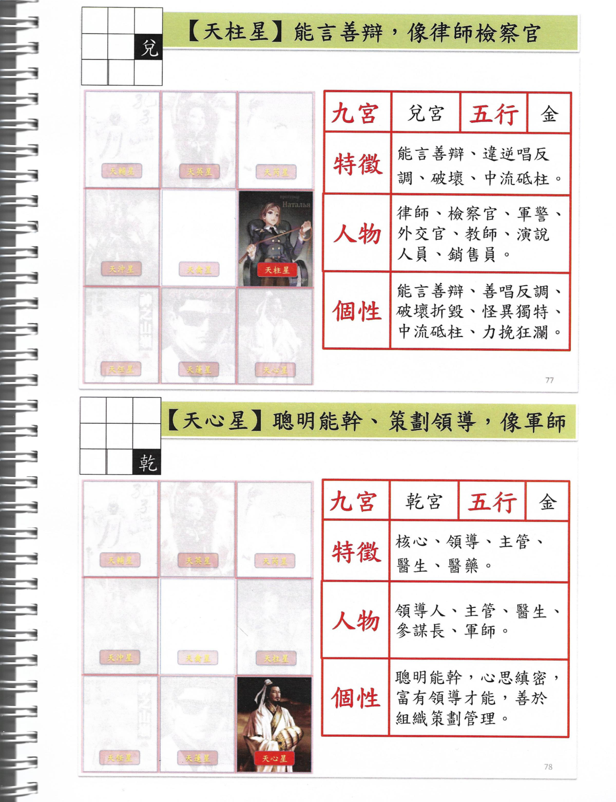

> **🖼 圖像解讀**　｜　檢視狀態：✅ 已檢視
> - **類型**：九星類象卡（投影片 77–78）
> - **內容**：天柱星（兌宮・金）能言善辯，像律師檢察官；天心星（乾宮・金）聰明能幹、策劃領導，像軍師。各列九宮、五行、特徵、人物、個性。
> - **原文出處（逐字）**：【天柱星】能言善辯，像律師檢察官；【天心星】聰明能幹、策劃領導，像軍師
> - **可檢索關鍵字**：天柱星, 兌宮, 能言善辯, 律師檢察官, 天心星, 乾宮, 策劃領導, 軍師醫生

**📝 逐字謄寫（第 40 頁）**

### 【天柱星】能言善辯，像律師檢察官（投影片 77）

（左上小九宮標示「兌」；僅天柱星高亮）

| 項目 | 內容 |
|---|---|
| 九宮／五行 | 兌宮／金 |
| 特徵 | 能言善辯、違逆唱反調、破壞、中流砥柱。 |
| 人物 | 律師、檢察官、軍警、外交官、教師、演說人員、銷售員。 |
| 個性 | 能言善辯、善唱反調、破壞折毀、怪異獨特、中流砥柱、力挽狂瀾。 |

### 【天心星】聰明能幹、策劃領導，像軍師（投影片 78）

（左上小九宮標示「乾」；僅天心星高亮）

| 項目 | 內容 |
|---|---|
| 九宮／五行 | 乾宮／金 |
| 特徵 | 核心、領導、主管、醫生、醫藥。 |
| 人物 | 領導人、主管、醫生、參謀長、軍師。 |
| 個性 | 聰明能幹，心思縝密，富有領導才能，善於組織策劃管理。 |

## 圖 41 — 第 41 頁（1200x1561）｜🖼 圖片（開圖判斷：圖表細看／裝飾照簡述）

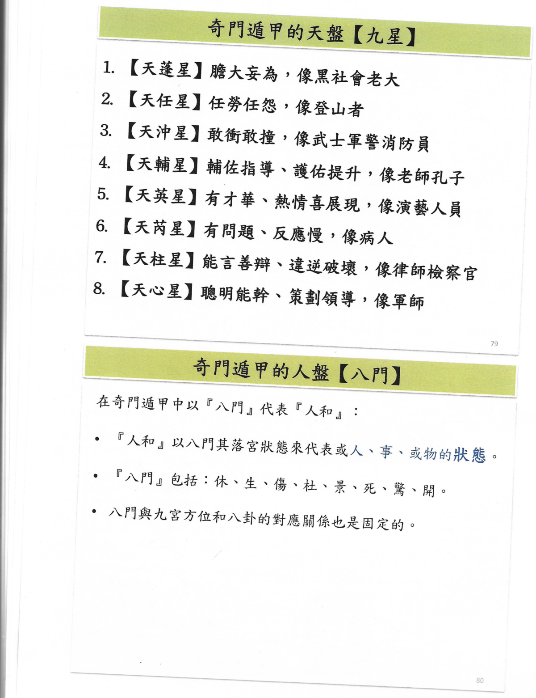

> **🖼 圖像解讀**　｜　檢視狀態：✅ 已檢視
> - **類型**：文字頁（投影片 79–80）
> - **內容**：投影片 79 為天盤九星總整理（蓬、任、沖、輔、英、芮、柱、心各一句類象）；投影片 80 說明人盤八門代表『人和』，以八門落宮狀態代表人、事、物的狀態；八門為休、生、傷、杜、景、死、驚、開，與九宮方位、八卦的對應是固定的。
> - **原文出處（逐字）**：奇門遁甲的天盤【九星】；奇門遁甲的人盤【八門】
> - **可檢索關鍵字**：九星總整理, 人盤八門, 人和, 人事物狀態, 休生傷杜景死驚開, 八門原宮

**📝 逐字謄寫（第 41 頁）**

### 奇門遁甲的天盤【九星】（投影片 79）

1. 【天蓬星】膽大妄為，像黑社會老大
2. 【天任星】任勞任怨，像登山者
3. 【天沖星】敢衝敢撞，像武士軍警消防員
4. 【天輔星】輔佐指導、護佑提升，像老師孔子
5. 【天英星】有才華、熱情喜展現，像演藝人員
6. 【天芮星】有問題、反應慢，像病人
7. 【天柱星】能言善辯、違逆破壞，像律師檢察官
8. 【天心星】聰明能幹、策劃領導，像軍師

### 奇門遁甲的人盤【八門】（投影片 80）

在奇門遁甲中以『八門』代表『人和』：

- 『人和』以八門其落宮狀態來代表或人、事、或物的**狀態**。
- 『八門』包括：休、生、傷、杜、景、死、驚、開。
- 八門與九宮方位和八卦的對應關係也是固定的。

## 圖 42 — 第 42 頁（1200x1561）｜🖼 圖片（開圖判斷：圖表細看／裝飾照簡述）

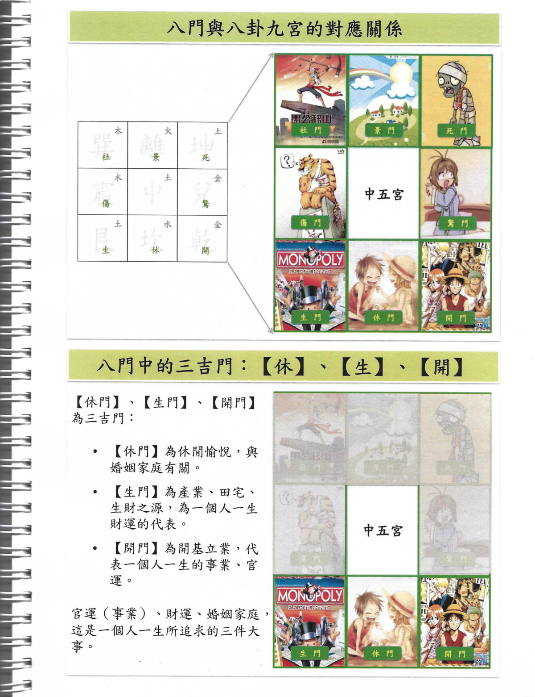

> **🖼 圖像解讀**　｜　檢視狀態：✅ 已檢視
> - **類型**：九宮圖＋圖卡（投影片 81–82）
> - **內容**：投影片 81「八門與八卦九宮的對應關係」：杜門巽、景門離、死門坤、傷門震、驚門兌、生門艮、休門坎、開門乾，並以漫畫／遊戲圖卡代表各門；投影片 82 說明三吉門：休門（休閒愉悅、婚姻家庭）、生門（產業田宅、一生財運）、開門（開基立業、一生事業官運），官運、財運、婚姻家庭是人一生追求的三件大事。
> - **原文出處（逐字）**：八門與八卦九宮的對應關係；八門中的三吉門：【休】、【生】、【開】
> - **可檢索關鍵字**：八門原宮, 三吉門, 休門婚姻家庭, 生門財運, 開門事業官運, 杜門, 死門, 驚門

**📝 逐字謄寫（第 42 頁）**

### 八門與八卦九宮的對應關係（投影片 81）

| 巽（木）：杜門 | 離（火）：景門 | 坤（土）：死門 |
|---|---|---|
| **震（木）：傷門** | **中（土）：中五宮** | **兌（金）：驚門** |
| **艮（土）：生門** | **坎（水）：休門** | **乾（金）：開門** |

右側圖卡（同九宮排列）：
- 杜門：愚公移山漫畫封面
- 景門：彩虹藍天、陽光下的小鎮
- 死門：纏繃帶的卡通殭屍
- 傷門：纏繃帶、頭上冒問號的受傷老虎
- 驚門：受驚嚇的卡通女孩
- 生門：大富翁（Monopoly）遊戲盒
- 休門：兩個卡通人物親密相處
- 開門：一群海賊動漫角色（冒險出航）

### 八門中的三吉門：【休】、【生】、【開】（投影片 82）

【休門】、【生門】、【開門】為三吉門：

- 【休門】為休閒愉悅，與婚姻家庭有關。
- 【生門】為產業、田宅、生財之源，為一個人一生財運的代表。
- 【開門】為開基立業，代表一個人一生的事業、官運。

官運（事業）、財運、婚姻家庭，這是一個人一生所追求的三件大事。

（右側八門圖卡中僅生門、休門、開門高亮）

## 圖 43 — 第 43 頁（1200x1561）｜🖼 圖片（開圖判斷：圖表細看／裝飾照簡述）

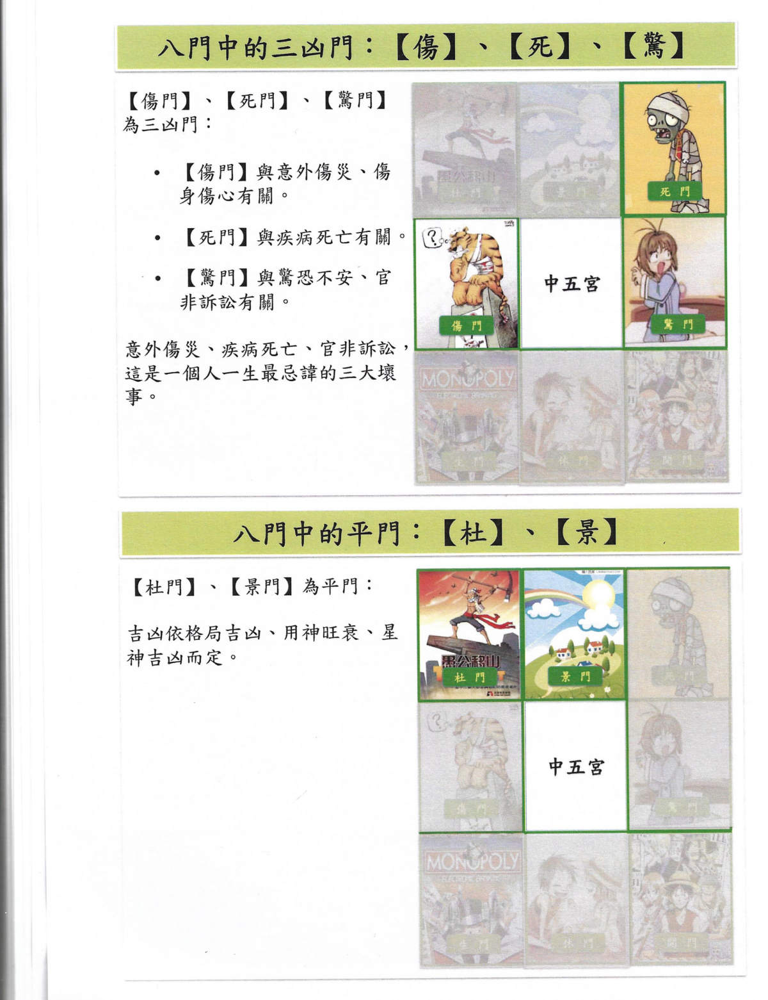

> **🖼 圖像解讀**　｜　檢視狀態：✅ 已檢視
> - **類型**：文字＋圖卡（投影片 83–84）
> - **內容**：投影片 83 說明三凶門：傷門（意外傷災、傷身傷心）、死門（疾病死亡）、驚門（驚恐不安、官非訴訟），意外傷災、疾病死亡、官非訴訟是一生最忌諱的三大壞事；投影片 84 說明平門杜門、景門，其吉凶依格局吉凶、用神旺衰、星神吉凶而定。
> - **原文出處（逐字）**：八門中的三凶門：【傷】、【死】、【驚】；八門中的平門：【杜】、【景】
> - **可檢索關鍵字**：三凶門, 傷門意外傷災, 死門疾病, 驚門官非訴訟, 平門, 杜門, 景門, 格局吉凶

**📝 逐字謄寫（第 43 頁）**

### 八門中的三凶門：【傷】、【死】、【驚】（投影片 83）

【傷門】、【死門】、【驚門】為三凶門：

- 【傷門】與意外傷災、傷身傷心有關。
- 【死門】與疾病死亡有關。
- 【驚門】與驚恐不安、官非訴訟有關。

意外傷災、疾病死亡、官非訴訟，這是一個人一生最忌諱的三大壞事。

（右側八門圖卡中僅死門、傷門、驚門高亮）

### 八門中的平門：【杜】、【景】（投影片 84）

【杜門】、【景門】為平門：

吉凶依格局吉凶、用神旺衰、星神吉凶而定。

（右側八門圖卡中僅杜門、景門高亮）

## 圖 44 — 第 44 頁（1200x1561）｜🖼 圖片（開圖判斷：圖表細看／裝飾照簡述）

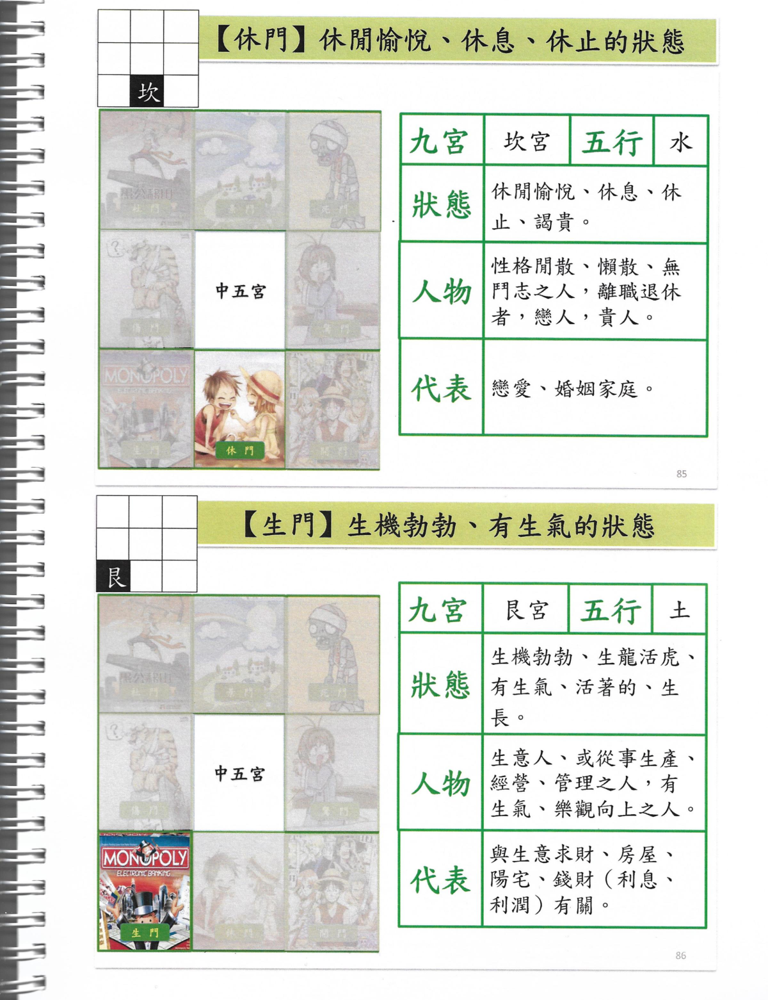

> **🖼 圖像解讀**　｜　檢視狀態：✅ 已檢視
> - **類型**：八門類象卡（投影片 85–86）
> - **內容**：休門（坎宮・水）休閒愉悅、休息、休止的狀態，代表戀愛、婚姻家庭；生門（艮宮・土）生機勃勃、有生氣的狀態，代表生意求財、房屋陽宅、錢財利息利潤。各列九宮、五行、狀態、人物、代表。
> - **原文出處（逐字）**：【休門】休閒愉悅、休息、休止的狀態；【生門】生機勃勃、有生氣的狀態
> - **可檢索關鍵字**：休門, 坎宮, 休閒愉悅, 婚姻家庭, 生門, 艮宮, 生意求財, 陽宅錢財

**📝 逐字謄寫（第 44 頁）**

### 【休門】休閒愉悅、休息、休止的狀態（投影片 85）

（左上小九宮標示「坎」；八門圖卡中僅休門高亮）

| 項目 | 內容 |
|---|---|
| 九宮／五行 | 坎宮／水 |
| 狀態 | 休閒愉悅、休息、休止、謁貴。 |
| 人物 | 性格閒散、懶散、無鬥志之人，離職退休者，戀人，貴人。 |
| 代表 | 戀愛、婚姻家庭。 |

### 【生門】生機勃勃、有生氣的狀態（投影片 86）

（左上小九宮標示「艮」；僅生門高亮）

| 項目 | 內容 |
|---|---|
| 九宮／五行 | 艮宮／土 |
| 狀態 | 生機勃勃、生龍活虎、有生氣、活著的、生長。 |
| 人物 | 生意人、或從事生產、經營、管理之人，有生氣、樂觀向上之人。 |
| 代表 | 與生意求財、房屋、陽宅、錢財（利息、利潤）有關。 |

## 圖 45 — 第 45 頁（1200x1561）｜🖼 圖片（開圖判斷：圖表細看／裝飾照簡述）

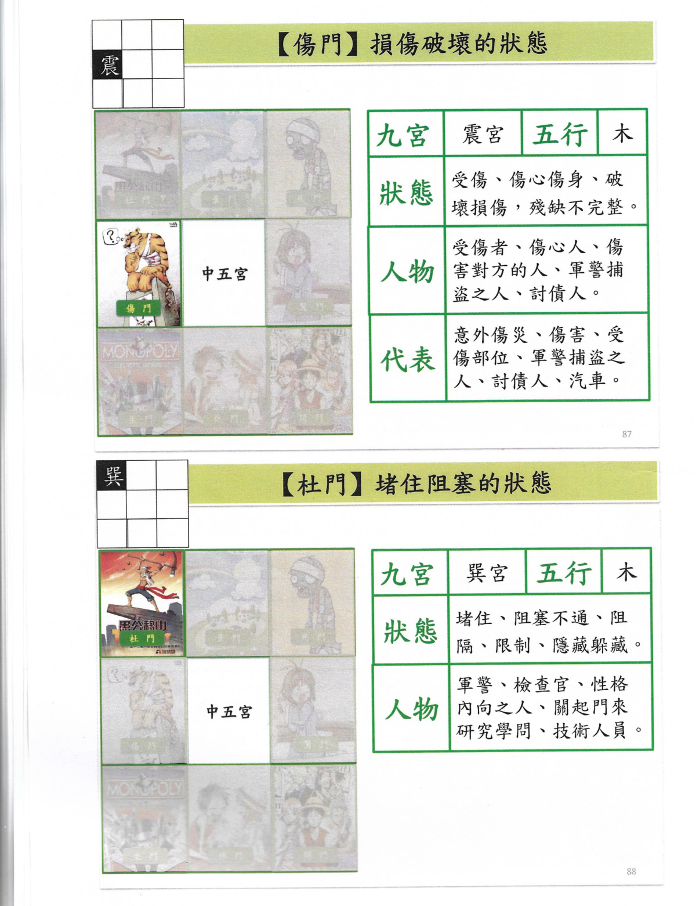

> **🖼 圖像解讀**　｜　檢視狀態：✅ 已檢視
> - **類型**：八門類象卡（投影片 87–88）
> - **內容**：傷門（震宮・木）損傷破壞的狀態，代表意外傷災、受傷部位、軍警捕盜、討債人、汽車；杜門（巽宮・木）堵住阻塞的狀態，人物為軍警、檢查官、內向者、閉門研究的技術人員。
> - **原文出處（逐字）**：【傷門】損傷破壞的狀態；【杜門】堵住阻塞的狀態
> - **可檢索關鍵字**：傷門, 震宮, 損傷破壞, 意外傷災, 討債人, 杜門, 巽宮, 阻塞隱藏

**📝 逐字謄寫（第 45 頁）**

### 【傷門】損傷破壞的狀態（投影片 87）

（左上小九宮標示「震」；八門圖卡中僅傷門高亮）

| 項目 | 內容 |
|---|---|
| 九宮／五行 | 震宮／木 |
| 狀態 | 受傷、傷心傷身、破壞損傷，殘缺不完整。 |
| 人物 | 受傷者、傷心人、傷害對方的人、軍警捕盜之人、討債人。 |
| 代表 | 意外傷災、傷害、受傷部位、軍警捕盜之人、討債人、汽車。 |

### 【杜門】堵住阻塞的狀態（投影片 88）

（左上小九宮標示「巽」；僅杜門高亮）

| 項目 | 內容 |
|---|---|
| 九宮／五行 | 巽宮／木 |
| 狀態 | 堵住、阻塞不通、阻隔、限制、隱藏躲藏。 |
| 人物 | 軍警、檢查官、性格內向之人、關起門來研究學問、技術人員。 |

## 圖 46 — 第 46 頁（1200x1561）｜🖼 圖片（開圖判斷：圖表細看／裝飾照簡述）

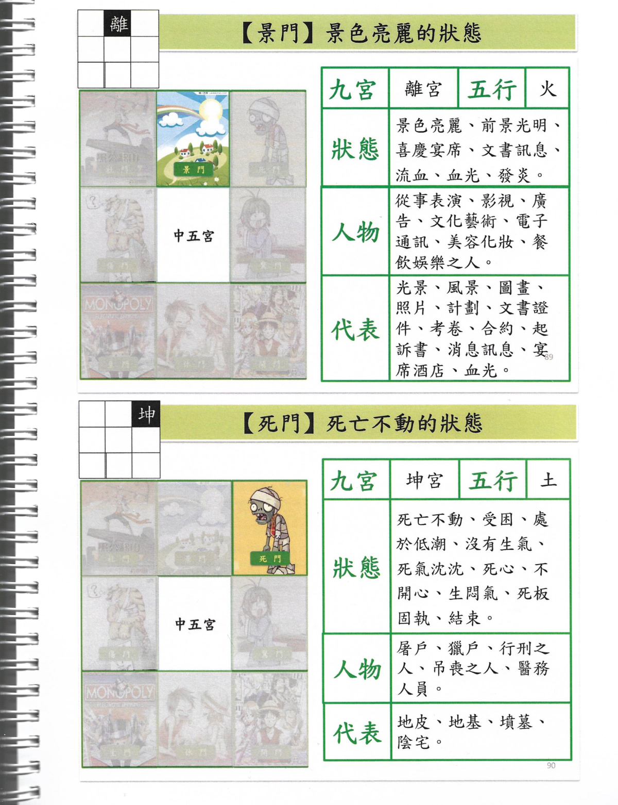

> **🖼 圖像解讀**　｜　檢視狀態：✅ 已檢視
> - **類型**：八門類象卡（投影片 89–90）
> - **內容**：景門（離宮・火）景色亮麗的狀態，也主文書訊息與血光，代表光景、圖畫照片、計劃、文書證件、考卷合約起訴書、宴席酒店；死門（坤宮・土）死亡不動的狀態，人物為屠戶、獵戶、行刑者、吊喪者、醫務人員，代表地皮、地基、墳墓、陰宅。
> - **原文出處（逐字）**：【景門】景色亮麗的狀態；【死門】死亡不動的狀態
> - **可檢索關鍵字**：景門, 離宮, 文書訊息, 血光, 死門, 坤宮, 死亡不動, 地皮陰宅

**📝 逐字謄寫（第 46 頁）**

### 【景門】景色亮麗的狀態（投影片 89）

（左上小九宮標示「離」；僅景門高亮）

| 項目 | 內容 |
|---|---|
| 九宮／五行 | 離宮／火 |
| 狀態 | 景色亮麗、前景光明、喜慶宴席、文書訊息、流血、血光、發炎。 |
| 人物 | 從事表演、影視、廣告、文化藝術、電子通訊、美容化妝、餐飲娛樂之人。 |
| 代表 | 光景、風景、圖畫、照片、計劃、文書證件、考卷、合約、起訴書、消息訊息、宴席酒店、血光。 |

### 【死門】死亡不動的狀態（投影片 90）

（左上小九宮標示「坤」；僅死門高亮）

| 項目 | 內容 |
|---|---|
| 九宮／五行 | 坤宮／土 |
| 狀態 | 死亡不動、受困、處於低潮、沒有生氣、死氣沈沈、死心、不開心、生悶氣、死板固執、結束。 |
| 人物 | 屠戶、獵戶、行刑之人、吊喪之人、醫務人員。 |
| 代表 | 地皮、地基、墳墓、陰宅。 |

## 圖 47 — 第 47 頁（1200x1561）｜🖼 圖片（開圖判斷：圖表細看／裝飾照簡述）

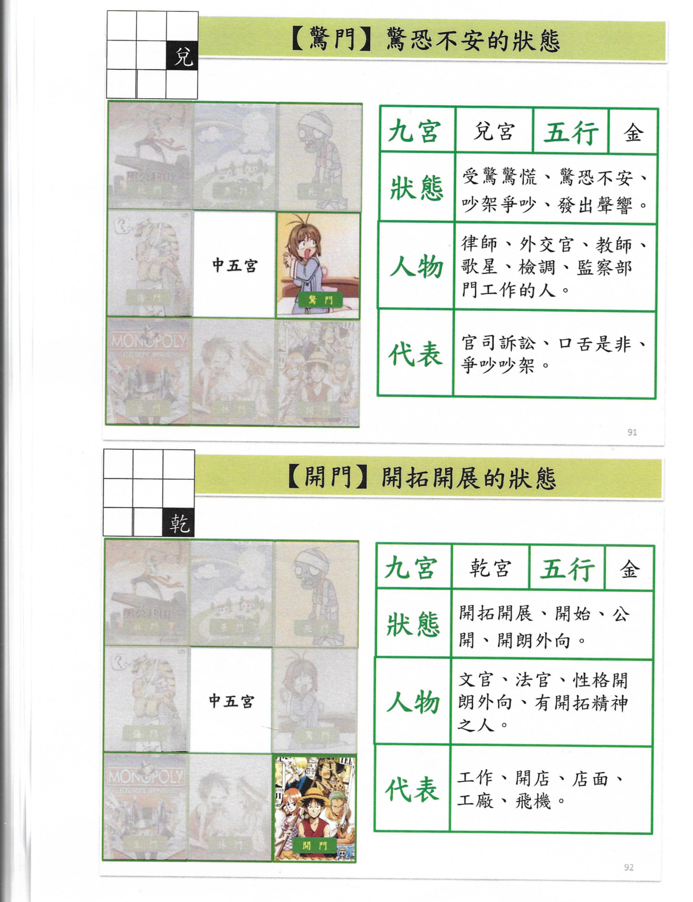

> **🖼 圖像解讀**　｜　檢視狀態：✅ 已檢視
> - **類型**：八門類象卡（投影片 91–92）
> - **內容**：驚門（兌宮・金）驚恐不安的狀態，人物為律師、外交官、教師、歌星、檢調監察人員，代表官司訴訟、口舌是非、爭吵；開門（乾宮・金）開拓開展的狀態，人物為文官、法官、開朗外向有開拓精神者，代表工作、開店、店面、工廠、飛機。
> - **原文出處（逐字）**：【驚門】驚恐不安的狀態；【開門】開拓開展的狀態
> - **可檢索關鍵字**：驚門, 兌宮, 驚恐不安, 官司訴訟, 開門, 乾宮, 開拓開展, 工作開店

**📝 逐字謄寫（第 47 頁）**

### 【驚門】驚恐不安的狀態（投影片 91）

（左上小九宮標示「兌」；僅驚門高亮）

| 項目 | 內容 |
|---|---|
| 九宮／五行 | 兌宮／金 |
| 狀態 | 受驚驚慌、驚恐不安、吵架爭吵、發出聲響。 |
| 人物 | 律師、外交官、教師、歌星、檢調、監察部門工作的人。 |
| 代表 | 官司訴訟、口舌是非、爭吵吵架。 |

### 【開門】開拓開展的狀態（投影片 92）

（左上小九宮標示「乾」；僅開門高亮）

| 項目 | 內容 |
|---|---|
| 九宮／五行 | 乾宮／金 |
| 狀態 | 開拓開展、開始、公開、開朗外向。 |
| 人物 | 文官、法官、性格開朗外向、有開拓精神之人。 |
| 代表 | 工作、開店、店面、工廠、飛機。 |

## 圖 48 — 第 48 頁（1200x1561）｜🖼 圖片（開圖判斷：圖表細看／裝飾照簡述）

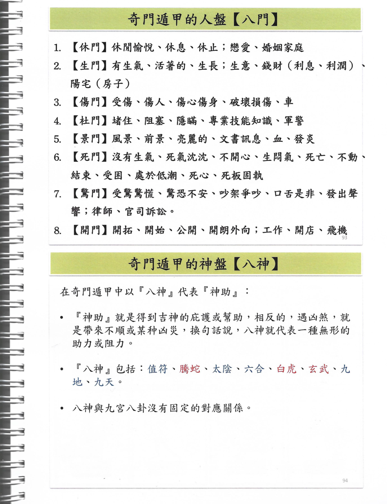

> **🖼 圖像解讀**　｜　檢視狀態：✅ 已檢視
> - **類型**：文字頁（投影片 93–94）
> - **內容**：投影片 93 為人盤八門總整理（休、生、傷、杜、景、死、驚、開各自的狀態與代表事物）；投影片 94 說明神盤八神代表『神助』，即得吉神庇護幫助或遇凶煞帶來不順凶災的無形助力或阻力；八神為值符、螣蛇、太陰、六合、白虎、玄武、九地、九天，與九宮八卦沒有固定對應。
> - **原文出處（逐字）**：奇門遁甲的人盤【八門】；奇門遁甲的神盤【八神】
> - **可檢索關鍵字**：八門總整理, 神盤八神, 神助, 無形助力阻力, 值符, 螣蛇, 白虎, 玄武

**📝 逐字謄寫（第 48 頁）**

### 奇門遁甲的人盤【八門】（投影片 93）

1. 【休門】休閒愉悅、休息、休止；戀愛、婚姻家庭
2. 【生門】有生氣、活著的、生長；生意、錢財（利息、利潤）、陽宅（房子）
3. 【傷門】受傷、傷人、傷心傷身、破壞損傷、車
4. 【杜門】堵住、阻塞、隱瞞、專業技能知識、軍警
5. 【景門】風景、前景、亮麗的、文書訊息、血、發炎
6. 【死門】沒有生氣、死氣沈沈、不開心、生悶氣、死亡、不動、結束、受困、處於低潮、死心、死板固執
7. 【驚門】受驚驚慌、驚恐不安、吵架爭吵、口舌是非、發出聲響；律師、官司訴訟。
8. 【開門】開拓、開始、公開、開朗外向；工作、開店、飛機

### 奇門遁甲的神盤【八神】（投影片 94）

在奇門遁甲中以『八神』代表『神助』：

- 『神助』就是得到吉神的庇護或幫助，相反的，遇凶煞，就是帶來不順或某种凶災，換句話說，八神就代表一種無形的助力或阻力。
- 『八神』包括：值符、螣蛇、太陰、六合、白虎、玄武、九地、九天。
- 八神與九宮八卦沒有固定的對應關係。

## 圖 49 — 第 49 頁（1200x1561）｜🖼 圖片（開圖判斷：圖表細看／裝飾照簡述）

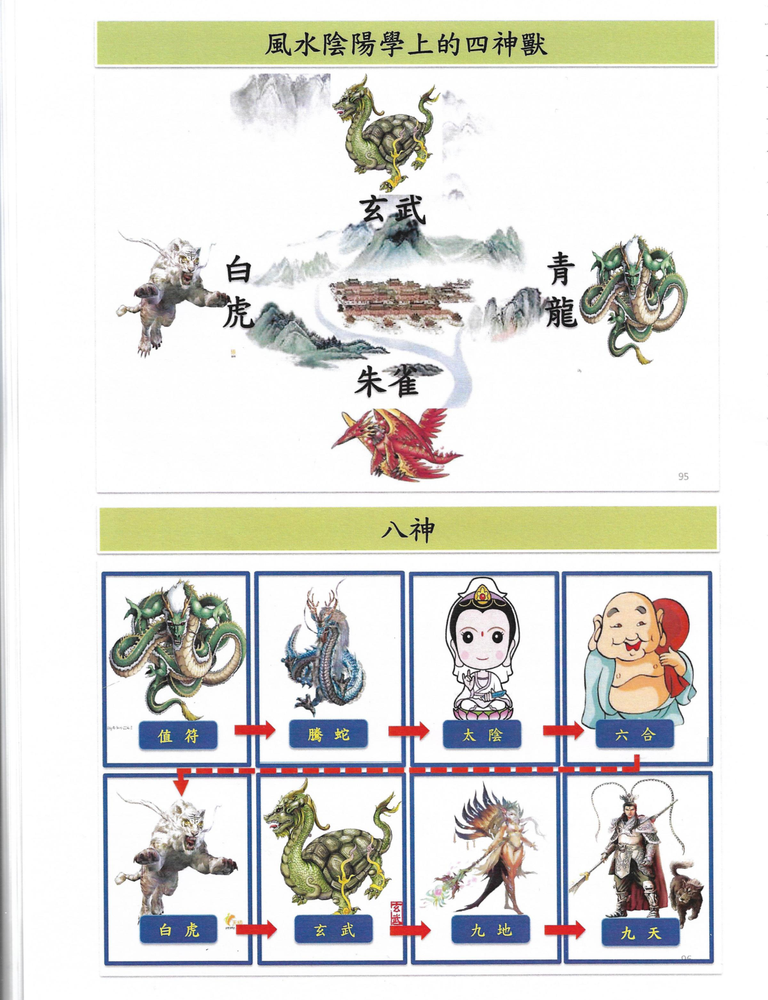

> **🖼 圖像解讀**　｜　檢視狀態：✅ 已檢視
> - **類型**：插圖（投影片 95–96）
> - **內容**：投影片 95「風水陰陽學上的四神獸」：玄武（後／上）、朱雀（前／下）、青龍（左側圖右）、白虎（右側圖左）環繞中央城池的山水圖；投影片 96「八神」以圖卡依序排列：值符（龍）→螣蛇→太陰（觀音）→六合（彌勒）→白虎→玄武（龜蛇）→九地→九天（持戟天將），箭頭表示排列順序。
> - **原文出處（逐字）**：風水陰陽學上的四神獸；八神
> - **可檢索關鍵字**：四神獸, 青龍, 白虎, 朱雀, 玄武, 八神排列順序, 值符螣蛇太陰六合, 白虎玄武九地九天

**📝 逐字謄寫（第 49 頁）**

### 風水陰陽學上的四神獸（投影片 95）

（山水圖中央為城池）
- 上方：玄武（龜蛇合體）
- 下方：朱雀（紅色神鳥）
- 圖左：白虎
- 圖右：青龍

### 八神（投影片 96）

八神圖卡依箭頭順序排列：

值符（青龍）→ 螣蛇（藍色蛇龍）→ 太陰（卡通觀音）→ 六合（卡通彌勒佛）→ 白虎（白虎）→ 玄武（龜蛇）→ 九地（持杖女神形象）→ 九天（持戟武將）

## 圖 50 — 第 50 頁（1200x1561）｜🖼 圖片（開圖判斷：圖表細看／裝飾照簡述）

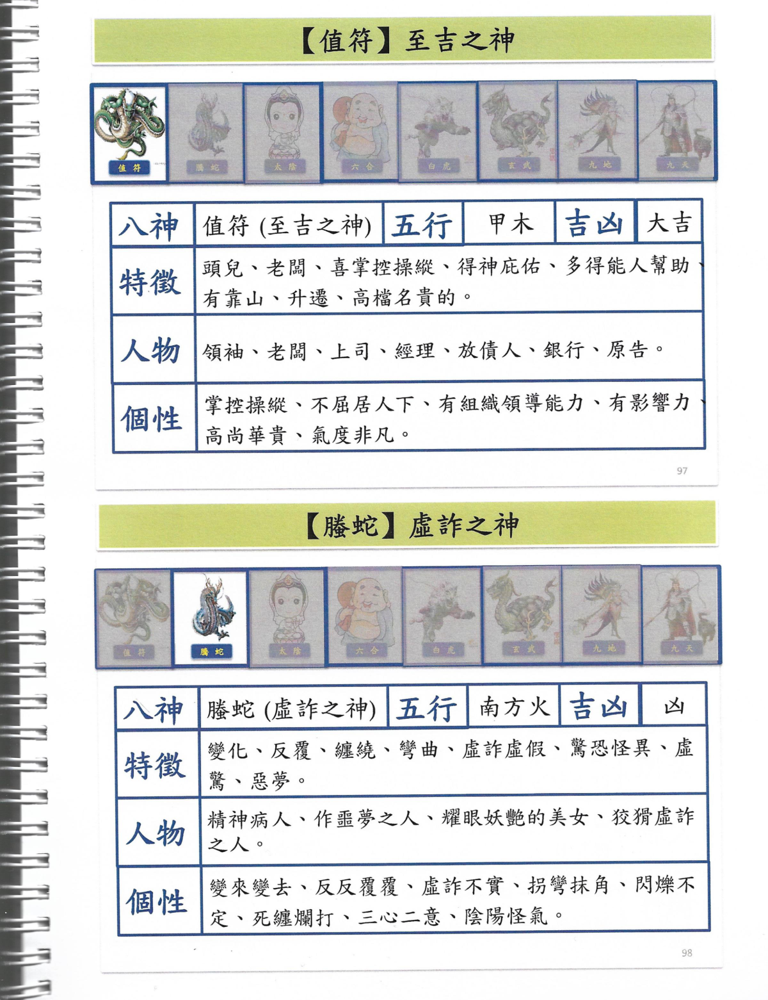

> **🖼 圖像解讀**　｜　檢視狀態：✅ 已檢視
> - **類型**：八神類象卡（投影片 97–98）
> - **內容**：值符為至吉之神（甲木、大吉），特徵是頭兒老闆、掌控操縱、得神庇佑、有靠山、升遷、高檔名貴；螣蛇為虛詐之神（南方火、凶），特徵是變化反覆、纏繞彎曲、虛詐虛假、驚恐怪異、虛驚惡夢。各列八神、五行、吉凶、特徵、人物、個性。
> - **原文出處（逐字）**：【值符】至吉之神；【螣蛇】虛詐之神
> - **可檢索關鍵字**：值符, 至吉之神, 甲木, 老闆靠山, 螣蛇, 虛詐之神, 反覆纏繞, 惡夢

**📝 逐字謄寫（第 50 頁）**

### 【值符】至吉之神（投影片 97）

（上方八神圖卡中僅值符高亮）

| 項目 | 內容 |
|---|---|
| 八神 | 值符（至吉之神） |
| 五行 | 甲木 |
| 吉凶 | 大吉 |
| 特徵 | 頭兒、老闆、喜掌控操縱、得神庇佑、多得能人幫助、有靠山、升遷、高檔名貴的。 |
| 人物 | 領袖、老闆、上司、經理、放債人、銀行、原告。 |
| 個性 | 掌控操縱、不屈居人下、有組織領導能力、有影響力、高尚華貴、氣度非凡。 |

### 【螣蛇】虛詐之神（投影片 98）

（僅螣蛇高亮）

| 項目 | 內容 |
|---|---|
| 八神 | 螣蛇（虛詐之神） |
| 五行 | 南方火 |
| 吉凶 | 凶 |
| 特徵 | 變化、反覆、纏繞、彎曲、虛詐虛假、驚恐怪異、虛驚、惡夢。 |
| 人物 | 精神病人、作噩夢之人、耀眼妖艷的美女、狡猾虛詐之人。 |
| 個性 | 變來變去、反反覆覆、虛詐不實、拐彎抹角、閃爍不定、死纏爛打、三心二意、陰陽怪氣。 |

## 圖 51 — 第 51 頁（1200x1561）｜🖼 圖片（開圖判斷：圖表細看／裝飾照簡述）

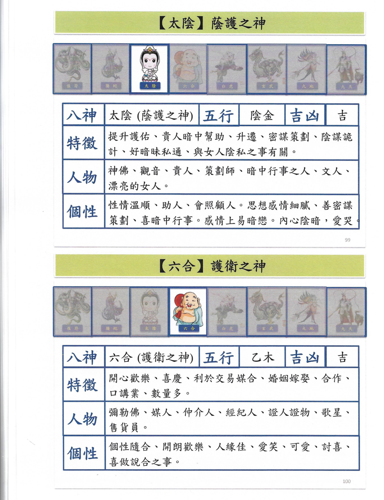

> **🖼 圖像解讀**　｜　檢視狀態：✅ 已檢視
> - **類型**：八神類象卡（投影片 99–100）
> - **內容**：太陰為蔭護之神（陰金、吉），主提升護佑、貴人暗中幫助、密謀策劃、陰私之事，人物如神佛觀音、貴人、策劃師；六合為護衛之神（乙木、吉），主開心歡樂、喜慶、交易媒合、婚姻嫁娶、合作，人物如彌勒佛、媒人、仲介、經紀人。
> - **原文出處（逐字）**：【太陰】蔭護之神；【六合】護衛之神
> - **可檢索關鍵字**：太陰, 蔭護之神, 貴人暗助, 密謀策劃, 六合, 護衛之神, 媒合交易, 婚姻嫁娶

**📝 逐字謄寫（第 51 頁）**

### 【太陰】蔭護之神（投影片 99）

（上方八神圖卡中僅太陰高亮）

| 項目 | 內容 |
|---|---|
| 八神 | 太陰（蔭護之神） |
| 五行 | 陰金 |
| 吉凶 | 吉 |
| 特徵 | 提升護佑、貴人暗中幫助、升遷、密謀策劃、陰謀詭計、好暗昧私通、與女人陰私之事有關。 |
| 人物 | 神佛、觀音、貴人、策劃師、暗中行事之人、文人、漂亮的女人。 |
| 個性 | 性情溫順、助人、會照顧人。思想感情細膩、善密謀策劃、喜暗中行事。感情上易暗戀。內心陰暗，愛哭。 |

### 【六合】護衛之神（投影片 100）

（僅六合高亮）

| 項目 | 內容 |
|---|---|
| 八神 | 六合（護衛之神） |
| 五行 | 乙木 |
| 吉凶 | 吉 |
| 特徵 | 開心歡樂、喜慶、利於交易媒合、婚姻嫁娶、合作、口講業、數量多。 |
| 人物 | 彌勒佛、媒人、仲介人、經紀人、證人證物、歌星、售貨員。 |
| 個性 | 個性隨合、開朗歡樂、人緣佳、愛笑、可愛、討喜、喜做說合之事。 |

## 圖 52 — 第 52 頁（1200x1561）｜🖼 圖片（開圖判斷：圖表細看／裝飾照簡述）

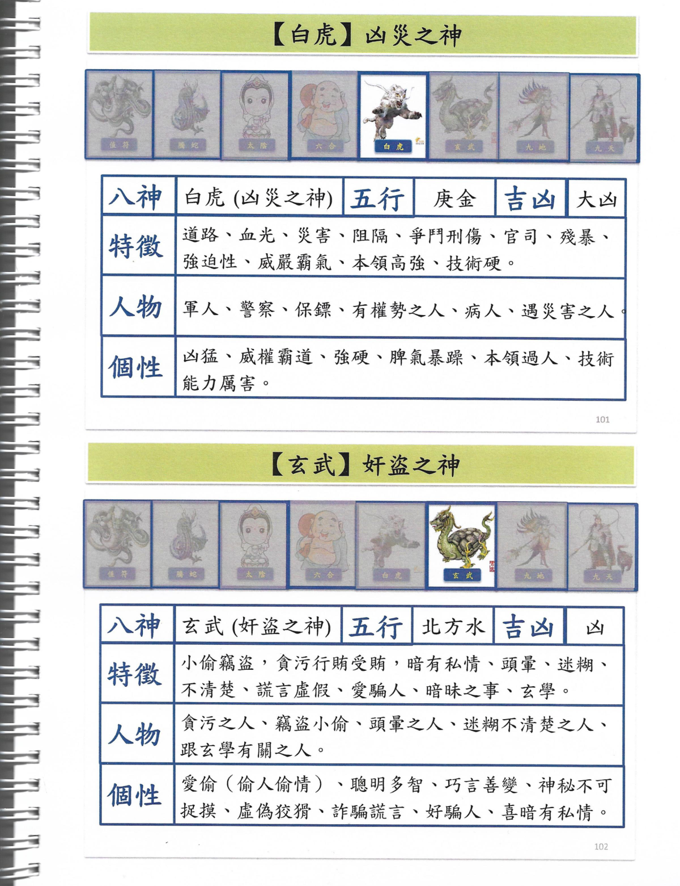

> **🖼 圖像解讀**　｜　檢視狀態：✅ 已檢視
> - **類型**：八神類象卡（投影片 101–102）
> - **內容**：白虎為凶災之神（庚金、大凶），主道路、血光、災害、阻隔、爭鬥刑傷、官司、威嚴霸氣、本領高強，人物如軍警、保鏢、有權勢者、病人；玄武為奸盜之神（北方水、凶），主小偷竊盜、貪污賄賂、暗有私情、頭暈迷糊、謊言、玄學，人物如貪污者、竊賊、玄學相關之人。
> - **原文出處（逐字）**：【白虎】凶災之神；【玄武】奸盜之神
> - **可檢索關鍵字**：白虎, 凶災之神, 血光官司, 威嚴霸氣, 玄武, 奸盜之神, 貪污竊盜, 暗有私情

**📝 逐字謄寫（第 52 頁）**

### 【白虎】凶災之神（投影片 101）

（僅白虎高亮）

| 項目 | 內容 |
|---|---|
| 八神 | 白虎（凶災之神） |
| 五行 | 庚金 |
| 吉凶 | 大凶 |
| 特徵 | 道路、血光、災害、阻隔、爭鬥刑傷、官司、殘暴、強迫性、威嚴霸氣、本領高強、技術硬。 |
| 人物 | 軍人、警察、保鏢、有權勢之人、病人、遇災害之人。 |
| 個性 | 凶猛、威權霸道、強硬、脾氣暴躁、本領過人、技術能力厲害。 |

### 【玄武】奸盜之神（投影片 102）

（僅玄武高亮）

| 項目 | 內容 |
|---|---|
| 八神 | 玄武（奸盜之神） |
| 五行 | 北方水 |
| 吉凶 | 凶 |
| 特徵 | 小偷竊盜，貪污行賄受賄，暗有私情、頭暈、迷糊、不清楚、謊言虛假、愛騙人、暗昧之事、玄學。 |
| 人物 | 貪污之人、竊盜小偷、頭暈之人、迷糊不清楚之人、跟玄學有關之人。 |
| 個性 | 愛偷（偷人偷情）、聰明多智、巧言善變、神秘不可捉摸、虛偽狡猾、詐騙謊言、好騙人、喜暗有私情。 |

## 圖 53 — 第 53 頁（1200x1561）｜🖼 圖片（開圖判斷：圖表細看／裝飾照簡述）

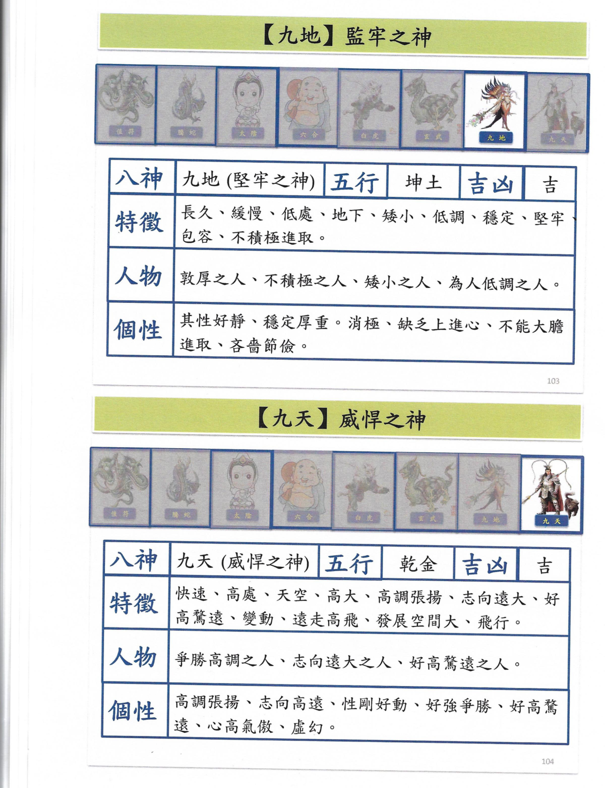

> **🖼 圖像解讀**　｜　檢視狀態：✅ 已檢視
> - **類型**：八神類象卡（投影片 103–104）
> - **內容**：九地（坤土、吉；標題作「監牢之神」、表內作「堅牢之神」）主長久、緩慢、低處地下、穩定堅牢、包容、不積極進取；九天為威悍之神（乾金、吉），主快速、高處天空、高調張揚、志向遠大、好高騖遠、變動遠走高飛、飛行。
> - **原文出處（逐字）**：【九地】監牢之神（表內：九地(堅牢之神)）；【九天】威悍之神
> - **可檢索關鍵字**：九地, 堅牢之神, 緩慢穩定, 低調保守, 九天, 威悍之神, 高調張揚, 好高騖遠

**📝 逐字謄寫（第 53 頁）**

### 【九地】監牢之神（投影片 103）

（僅九地高亮；註：投影片標題印「監牢之神」，表內印「堅牢之神」，原文如此）

| 項目 | 內容 |
|---|---|
| 八神 | 九地（堅牢之神） |
| 五行 | 坤土 |
| 吉凶 | 吉 |
| 特徵 | 長久、緩慢、低處、地下、矮小、低調、穩定、堅牢、包容、不積極進取。 |
| 人物 | 敦厚之人、不積極之人、矮小之人、為人低調之人。 |
| 個性 | 其性好靜、穩定厚重。消極、缺乏上進心、不能大膽進取、吝嗇節儉。 |

### 【九天】威悍之神（投影片 104）

（僅九天高亮）

| 項目 | 內容 |
|---|---|
| 八神 | 九天（威悍之神） |
| 五行 | 乾金 |
| 吉凶 | 吉 |
| 特徵 | 快速、高處、天空、高大、高調張揚、志向遠大、好高騖遠、變動、遠走高飛、發展空間大、飛行。 |
| 人物 | 爭勝高調之人、志向遠大之人、好高騖遠之人。 |
| 個性 | 高調張揚、志向高遠、性剛好動、好強爭勝、好高騖遠、心高氣傲、虛幻。 |

## 圖 54 — 第 54 頁（1200x1561）｜🖼 圖片（開圖判斷：圖表細看／裝飾照簡述）

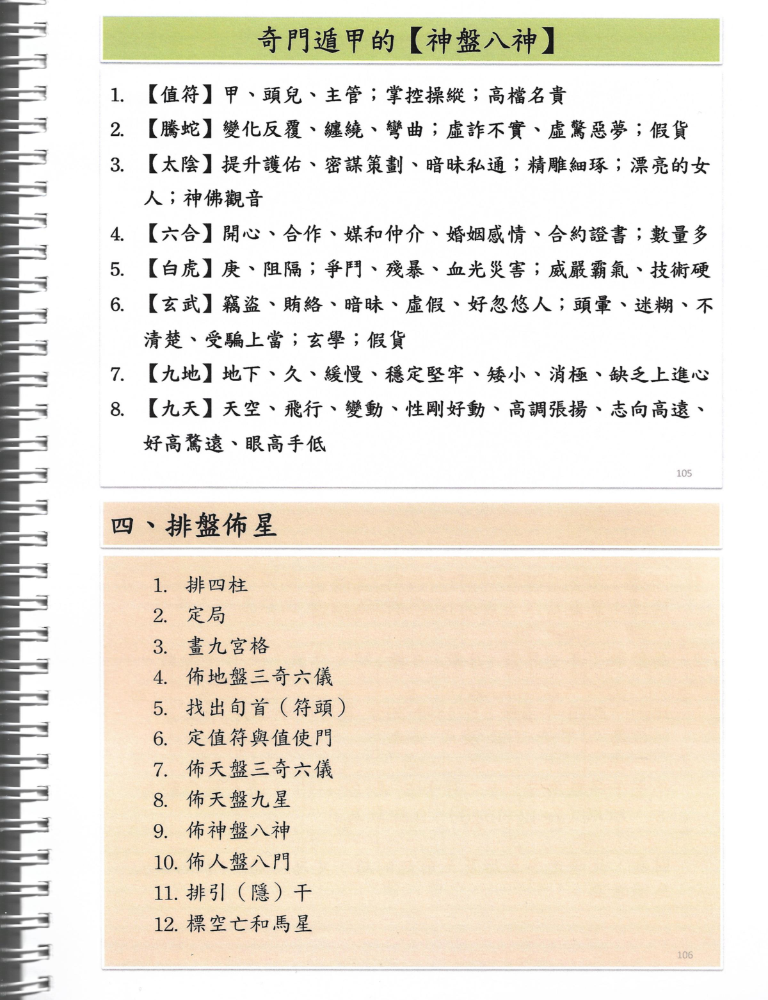

> **🖼 圖像解讀**　｜　檢視狀態：✅ 已檢視
> - **類型**：文字頁／目錄（投影片 105–106）
> - **內容**：投影片 105 為神盤八神總整理（值符、螣蛇、太陰、六合、白虎、玄武、九地、九天之核心類象）；投影片 106 為第四章「排盤佈星」目錄，列出 12 個排盤步驟：排四柱、定局、畫九宮格、佈地盤三奇六儀、找旬首（符頭）、定值符與值使門、佈天盤三奇六儀、佈天盤九星、佈神盤八神、佈人盤八門、排引（隱）干、標空亡和馬星。
> - **原文出處（逐字）**：奇門遁甲的【神盤八神】；四、排盤佈星
> - **可檢索關鍵字**：八神總整理, 排盤佈星, 排四柱, 定局, 旬首符頭, 值符值使, 引干隱干, 空亡馬星

**📝 逐字謄寫（第 54 頁）**

### 奇門遁甲的【神盤八神】（投影片 105）

1. 【值符】甲、頭兒、主管；掌控操縱；高檔名貴
2. 【螣蛇】變化反覆、纏繞、彎曲；虛詐不實、虛驚惡夢；假貨
3. 【太陰】提升護佑、密謀策劃、暗昧私通；精雕細琢；漂亮的女人；神佛觀音
4. 【六合】開心、合作、媒和仲介、婚姻感情、合約證書；數量多
5. 【白虎】庚、阻隔；爭鬥、殘暴、血光災害；威嚴霸氣、技術硬
6. 【玄武】竊盜、賄絡、暗昧、虛假、好忽悠人；頭暈、迷糊、不清楚、受騙上當；玄學；假貨
7. 【九地】地下、久、緩慢、穩定堅牢、矮小、消極、缺乏上進心
8. 【九天】天空、飛行、變動、性剛好動、高調張揚、志向高遠、好高騖遠、眼高手低

### 四、排盤佈星（投影片 106）

1. 排四柱
2. 定局
3. 畫九宮格
4. 佈地盤三奇六儀
5. 找出旬首（符頭）
6. 定值符與值使門
7. 佈天盤三奇六儀
8. 佈天盤九星
9. 佈神盤八神
10. 佈人盤八門
11. 排引（隱）干
12. 標空亡和馬星

## 圖 55 — 第 55 頁（1200x1561）｜🖼 圖片（開圖判斷：圖表細看／裝飾照簡述）

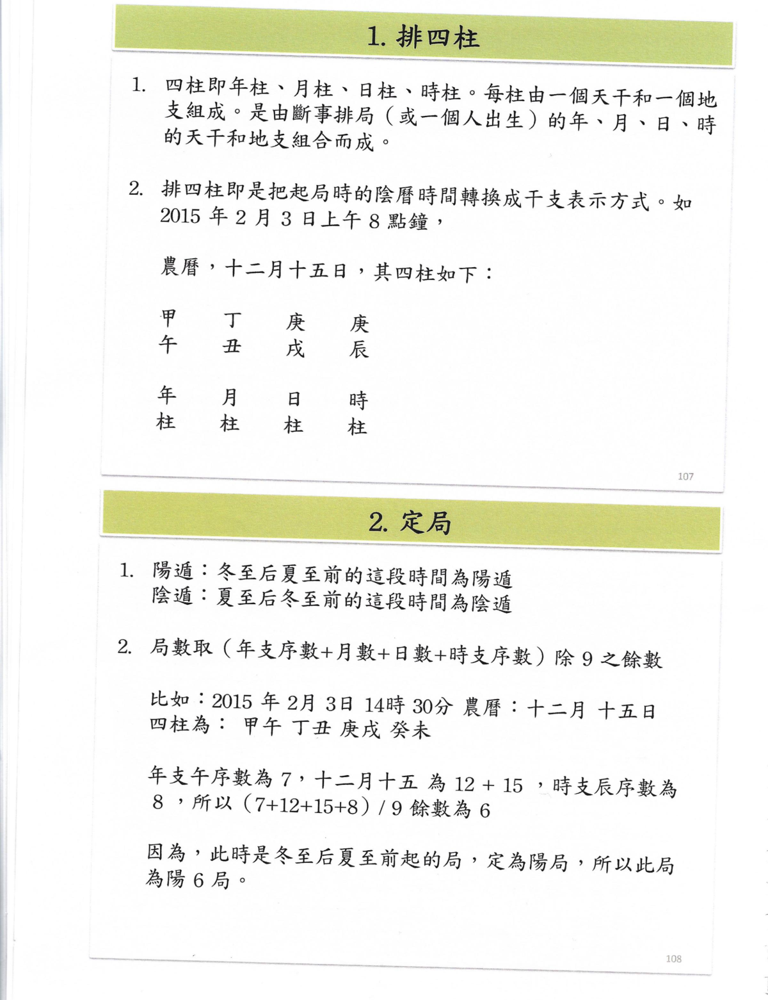

> **🖼 圖像解讀**　｜　檢視狀態：✅ 已檢視
> - **類型**：文字頁（投影片 107–108）
> - **內容**：排盤第 1 步「排四柱」：四柱為年月日時各一干一支，以 2015年2月3日上午8點（農曆十二月十五日）為例得甲午、丁丑、庚戌、庚辰；第 2 步「定局」：冬至後夏至前為陽遁、夏至後冬至前為陰遁，局數取（年支序數＋月數＋日數＋時支序數）除以 9 的餘數，例：2015年2月3日14時30分，(7+12+15+8)/9 餘 6，陽遁故為陽 6 局。
> - **原文出處（逐字）**：1. 排四柱；2. 定局
> - **可檢索關鍵字**：排四柱, 年柱月柱日柱時柱, 定局, 陽遁陰遁, 冬至夏至, 局數公式, 除九取餘, 陽六局

**📝 逐字謄寫（第 55 頁）**

### 1. 排四柱（投影片 107）

1. 四柱即年柱、月柱、日柱、時柱。每柱由一個天干和一個地支組成。是由斷事排局（或一個人出生）的年、月、日、時的天干和地支組合而成。
2. 排四柱即是把起局時的陰曆時間轉換成干支表示方式。如 2015 年 2 月 3 日上午 8 點鐘，

   農曆，十二月十五日，其四柱如下：

| 年柱 | 月柱 | 日柱 | 時柱 |
|---|---|---|---|
| 甲午 | 丁丑 | 庚戌 | 庚辰 |

### 2. 定局（投影片 108）

1. 陽遁：冬至后夏至前的這段時間為陽遁
   陰遁：夏至后冬至前的這段時間為陰遁
2. 局數取（年支序數+月數+日數+時支序數）除 9 之餘數

   比如：2015 年 2月 3日 14時 30分 農曆：十二月 十五日
   四柱為：甲午 丁丑 庚戌 癸未

   年支午序數為 7，十二月十五 為 12 + 15 ，時支辰序數為 8 ，所以（7+12+15+8）/ 9 餘數為 6

   因為，此時是冬至后夏至前起的局，定為陽局，所以此局為陽 6 局。

（註：原文「時支辰序數為 8」，但此例時柱為癸未，未的序數為 8；原文如此照錄。）

## 圖 56 — 第 56 頁（1200x1561）｜🖼 圖片（開圖判斷：圖表細看／裝飾照簡述）

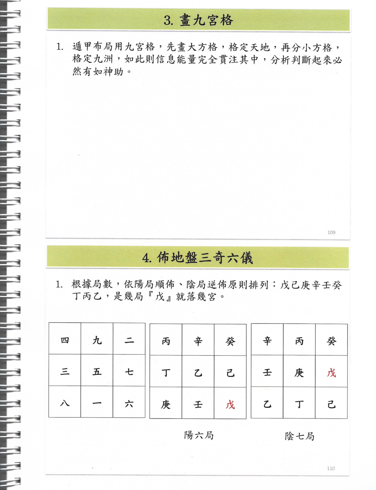

> **🖼 圖像解讀**　｜　檢視狀態：✅ 已檢視
> - **類型**：文字頁＋九宮格圖（投影片 109–110）
> - **內容**：第 3 步「畫九宮格」：先畫大方格定天地，再分小方格定九洲；第 4 步「佈地盤三奇六儀」：依陽局順佈、陰局逆佈，順序為戊己庚辛壬癸丁丙乙，幾局戊就落幾宮；附洛書數九宮與陽六局（戊落乾六）、陰七局（戊落兌七）的地盤排列範例。
> - **原文出處（逐字）**：3. 畫九宮格；4. 佈地盤三奇六儀
> - **可檢索關鍵字**：畫九宮格, 佈地盤, 三奇六儀順序, 陽順陰逆, 戊落局數宮, 陽六局地盤, 陰七局地盤

**📝 逐字謄寫（第 56 頁）**

### 3. 畫九宮格（投影片 109）

1. 遁甲布局用九宮格，先畫大方格，格定天地，再分小方格，格定九洲，如此則信息能量完全貫注其中，分析判斷起來必然有如神助。

### 4. 佈地盤三奇六儀（投影片 110）

1. 根據局數，依陽局順佈、陰局逆佈原則排列：戊己庚辛壬癸丁丙乙，是幾局『戊』就落幾宮。

九宮數：

| 四 | 九 | 二 |
|---|---|---|
| 三 | 五 | 七 |
| 八 | 一 | 六 |

陽六局（戊落六宮，紅字）：

| 丙 | 辛 | 癸 |
|---|---|---|
| 丁 | 乙 | 己 |
| 庚 | 壬 | **戊** |

陰七局（戊落七宮，紅字）：

| 辛 | 丙 | 癸 |
|---|---|---|
| 壬 | 庚 | **戊** |
| 乙 | 丁 | 己 |

## 圖 57 — 第 57 頁（1200x1561）｜🖼 圖片（開圖判斷：圖表細看／裝飾照簡述）

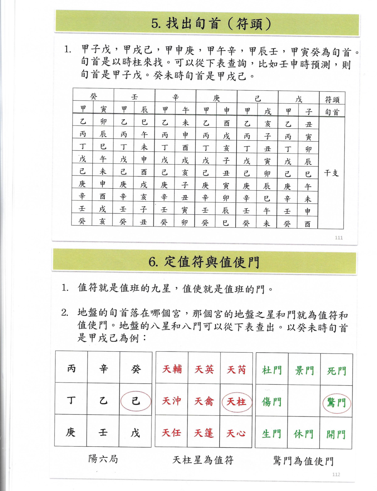

> **🖼 圖像解讀**　｜　檢視狀態：✅ 已檢視
> - **類型**：文字頁＋干支表＋九宮圖（投影片 111–112）
> - **內容**：第 5 步「找出旬首（符頭）」：六旬首為甲子戊、甲戌己、甲申庚、甲午辛、甲辰壬、甲寅癸，以時柱查表（例：壬申時旬首甲子戊、癸未時旬首甲戌己），附六十甲子旬首表；第 6 步「定值符與值使門」：值符為值班九星、值使為值班之門，地盤旬首落哪宮，該宮原有之星與門即為值符、值使；以陽六局、癸未時旬首甲戌己為例，己在兌七宮，故天柱星為值符、驚門為值使門。
> - **原文出處（逐字）**：5. 找出旬首（符頭）；6. 定值符與值使門
> - **可檢索關鍵字**：找旬首, 符頭, 六旬首, 時柱查旬首, 定值符, 值使門, 天柱星值符, 驚門值使

**📝 逐字謄寫（第 57 頁）**

### 5. 找出旬首（符頭）（投影片 111）

1. 甲子戊，甲戌己，甲申庚，甲午辛，甲辰壬，甲寅癸為旬首。旬首是以時柱來找。可以從下表查詢，比如壬申時預測，則旬首是甲子戊。癸未時旬首是甲戌己。

| 符頭 | 癸 | 壬 | 辛 | 庚 | 己 | 戊 |
|---|---|---|---|---|---|---|
| 旬首 | 甲寅 | 甲辰 | 甲午 | 甲申 | 甲戌 | 甲子 |
| 干支 | 乙卯 | 乙巳 | 乙未 | 乙酉 | 乙亥 | 乙丑 |
| | 丙辰 | 丙午 | 丙申 | 丙戌 | 丙子 | 丙寅 |
| | 丁巳 | 丁未 | 丁酉 | 丁亥 | 丁丑 | 丁卯 |
| | 戊午 | 戊申 | 戊戌 | 戊子 | 戊寅 | 戊辰 |
| | 己未 | 己酉 | 己亥 | 己丑 | 己卯 | 己巳 |
| | 庚申 | 庚戌 | 庚子 | 庚寅 | 庚辰 | 庚午 |
| | 辛酉 | 辛亥 | 辛丑 | 辛卯 | 辛巳 | 辛未 |
| | 壬戌 | 壬子 | 壬寅 | 壬辰 | 壬午 | 壬申 |
| | 癸亥 | 癸丑 | 癸卯 | 癸巳 | 癸未 | 癸酉 |

### 6. 定值符與值使門（投影片 112）

1. 值符就是值班的九星，值使就是值班的門。
2. 地盤的旬首落在哪個宮，那個宮的地盤之星和門就為值符和值使門。地盤的八星和八門可以從下表查出。以癸未時旬首是甲戌己為例：

陽六局地盤（「己」圈起）：

| 丙 | 辛 | 癸 |
|---|---|---|
| 丁 | 乙 | ⭕己 |
| 庚 | 壬 | 戊 |

九星原宮（天柱圈起）→ **天柱星為值符**：

| 天輔 | 天英 | 天芮 |
|---|---|---|
| 天沖 | 天禽 | ⭕天柱 |
| 天任 | 天蓬 | 天心 |

八門原宮（驚門圈起）→ **驚門為值使門**：

| 杜門 | 景門 | 死門 |
|---|---|---|
| 傷門 | （中） | ⭕驚門 |
| 生門 | 休門 | 開門 |

## 圖 58 — 第 58 頁（1200x1561）｜🖼 圖片（開圖判斷：圖表細看／裝飾照簡述）

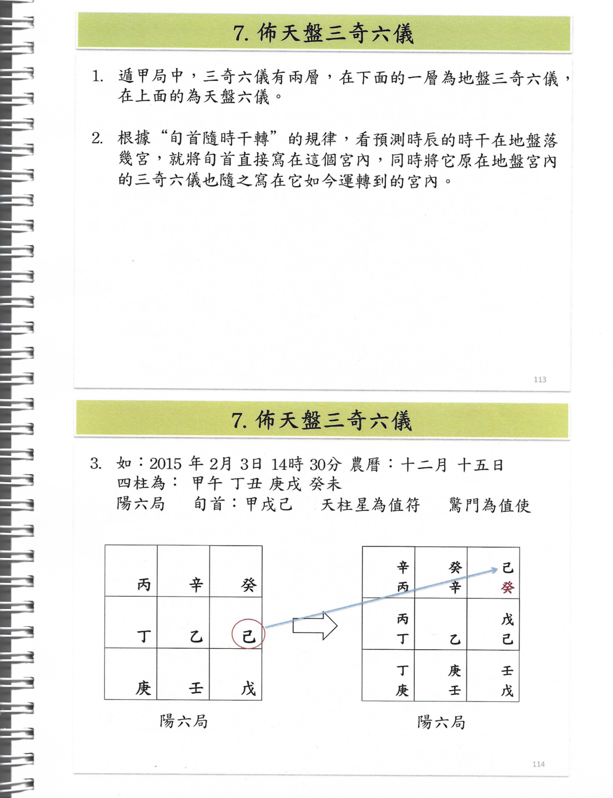

> **🖼 圖像解讀**　｜　檢視狀態：✅ 已檢視
> - **類型**：文字頁＋九宮圖（投影片 113–114）
> - **內容**：第 7 步「佈天盤三奇六儀」：三奇六儀分地盤（下層）與天盤（上層）兩層；依「旬首隨時干轉」，看時干在地盤落哪宮，就把旬首寫入該宮，其餘三奇六儀隨之運轉。例：2015年2月3日14時30分，陽六局、旬首甲戌己、天柱值符、驚門值使，時干癸在坤二宮，故旬首己移至坤宮，並示範轉動後的天地盤。
> - **原文出處（逐字）**：7. 佈天盤三奇六儀
> - **可檢索關鍵字**：佈天盤, 天盤三奇六儀, 旬首隨時干轉, 時干落宮, 陽六局範例, 甲戌己, 天地盤

**📝 逐字謄寫（第 58 頁）**

### 7. 佈天盤三奇六儀（投影片 113）

1. 遁甲局中，三奇六儀有兩層，在下面的一層為地盤三奇六儀，在上面的為天盤六儀。
2. 根據“旬首隨時干轉”的規律，看預測時辰的時干在地盤落幾宮，就將旬首直接寫在這個宮內，同時將它原在地盤宮內的三奇六儀也隨之寫在它如今運轉到的宮內。

### 7. 佈天盤三奇六儀（投影片 114）

3. 如：2015 年 2月 3日 14時 30分 農曆：十二月 十五日
   四柱為：甲午 丁丑 庚戌 癸未
   陽六局　旬首：甲戌己　天柱星為值符　驚門為值使

左圖：陽六局地盤（兌宮「己」圈起，箭頭指向坤宮）

| 丙 | 辛 | 癸 |
|---|---|---|
| 丁 | 乙 | ⭕己 |
| 庚 | 壬 | 戊 |

右圖：陽六局（每宮上為天盤、下為地盤；坤宮天盤「己」、地盤「癸」紅字）

| 辛／丙 | 癸／辛 | 己／**癸** |
|---|---|---|
| 丙／丁 | 乙 | 戊／己 |
| 丁／庚 | 庚／壬 | 壬／戊 |

## 圖 59 — 第 59 頁（1200x1561）｜🖼 圖片（開圖判斷：圖表細看／裝飾照簡述）

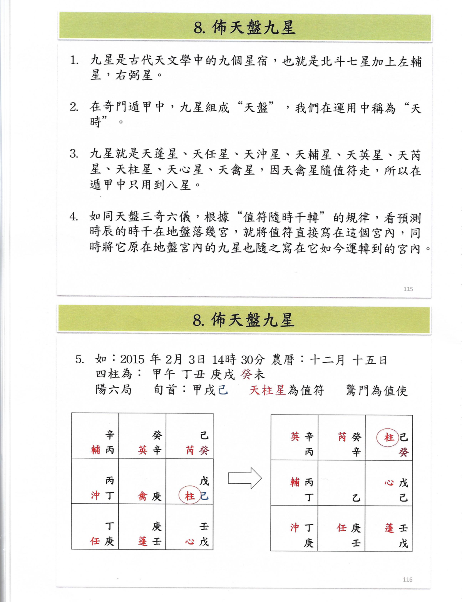

> **🖼 圖像解讀**　｜　檢視狀態：✅ 已檢視
> - **類型**：文字頁＋九宮圖（投影片 115–116）
> - **內容**：第 8 步「佈天盤九星」：九星為北斗七星加左輔右弼，組成天盤（天時）；天禽星隨值符走，故遁甲中只用八星；依「值符隨時干轉」，把值符寫入時干所落之宮，其餘九星隨之轉動。續用 2015年2月3日14時30分陽六局例：值符天柱原在兌宮，隨時干癸轉到坤宮，其餘各星依序順時針移動（英巽、芮離、柱坤、心兌、蓬乾、任坎、沖艮、輔震）。
> - **原文出處（逐字）**：8. 佈天盤九星
> - **可檢索關鍵字**：佈天盤九星, 北斗七星, 左輔右弼, 天禽寄宮, 值符隨時干轉, 天柱值符, 九星轉盤

**📝 逐字謄寫（第 59 頁）**

### 8. 佈天盤九星（投影片 115）

1. 九星是古代天文學中的九個星宿，也就是北斗七星加上左輔星，右弼星。
2. 在奇門遁甲中，九星組成“天盤”，我們在運用中稱為“天時”。
3. 九星就是天蓬星、天任星、天沖星、天輔星、天英星、天芮星、天柱星、天心星、天禽星，因天禽星隨值符走，所以在遁甲中只用到八星。
4. 如同天盤三奇六儀，根據“值符隨時干轉”的規律，看預測時辰的時干在地盤落幾宮，就將值符直接寫在這個宮內，同時將它原在地盤宮內的九星也隨之寫在它如今運轉到的宮內。

### 8. 佈天盤九星（投影片 116）

5. 如：2015 年 2月 3日 14時 30分 農曆：十二月 十五日
   四柱為：甲午 丁丑 庚戌 癸未（「癸」紅字）
   陽六局　旬首：甲戌己（「己」藍字）　天柱星為值符　驚門為值使

左圖：九星原宮＋天地盤干（兌宮「柱」圈起；每格：天盤干／星 地盤干）

| 辛／輔 丙 | 癸／英 辛 | 己／芮 癸 |
|---|---|---|
| 丙／沖 丁 | 禽 庚 | 戊／⭕柱 己 |
| 丁／任 庚 | 庚／蓬 壬 | 壬／心 戊 |

（註：左圖中宮原印「禽 庚」，與前頁中宮地盤干「乙」不同，原文如此照錄。）

右圖：轉動後（坤宮「柱」圈起）

| 英 辛／丙 | 芮 癸／辛 | ⭕柱 己／癸 |
|---|---|---|
| 輔 丙／丁 | 乙 | 心 戊／己 |
| 沖 丁／庚 | 任 庚／壬 | 蓬 壬／戊 |

## 圖 60 — 第 60 頁（1200x1561）｜🖼 圖片（開圖判斷：圖表細看／裝飾照簡述）

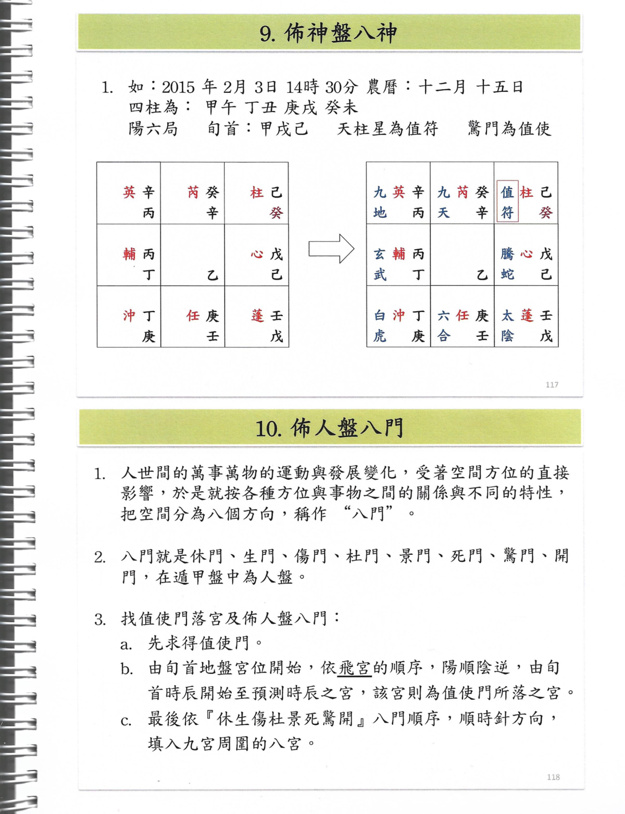

> **🖼 圖像解讀**　｜　檢視狀態：✅ 已檢視
> - **類型**：九宮圖＋文字頁（投影片 117–118）
> - **內容**：第 9 步「佈神盤八神」：續用陽六局例，值符（八神）隨天柱落坤宮，其餘八神依序排列：坤值符、兌螣蛇、乾太陰、坎六合、艮白虎、震玄武、巽九地、離九天；第 10 步「佈人盤八門」：八門為把空間分為八個方向的人盤，排法為先求值使門，再由旬首地盤宮位依飛宮順序（陽順陰逆）從旬首時辰數到預測時辰得值使落宮，最後依休生傷杜景死驚開順時針填入周圍八宮。
> - **原文出處（逐字）**：9. 佈神盤八神；10. 佈人盤八門
> - **可檢索關鍵字**：佈神盤八神, 值符落宮, 八神順序, 佈人盤八門, 值使落宮, 飛宮, 陽順陰逆, 休生傷杜景死驚開

**📝 逐字謄寫（第 60 頁）**

### 9. 佈神盤八神（投影片 117）

1. 如：2015 年 2月 3日 14時 30分 農曆：十二月 十五日
   四柱為：甲午 丁丑 庚戌 癸未
   陽六局　旬首：甲戌己　天柱星為值符　驚門為值使

左圖（佈八神前）：

| 英 辛／丙 | 芮 癸／辛 | 柱 己／癸 |
|---|---|---|
| 輔 丙／丁 | 乙 | 心 戊／己 |
| 沖 丁／庚 | 任 庚／壬 | 蓬 壬／戊 |

右圖（佈八神後；坤宮「值符」以框標示）：

| 九地 英 辛／丙 | 九天 芮 癸／辛 | 【值符】 柱 己／癸 |
|---|---|---|
| 玄武 輔 丙／丁 | 乙 | 騰蛇 心 戊／己 |
| 白虎 沖 丁／庚 | 六合 任 庚／壬 | 太陰 蓬 壬／戊 |

### 10. 佈人盤八門（投影片 118）

1. 人世間的萬事萬物的運動與發展變化，受著空間方位的直接影響，於是就按各種方位與事物之間的關係與不同的特性，把空間分為八個方向，稱作 “八門”。
2. 八門就是休門、生門、傷門、杜門、景門、死門、驚門、開門，在遁甲盤中為人盤。
3. 找值使門落宮及佈人盤八門：
   a. 先求得值使門。
   b. 由旬首地盤宮位開始，依飛宮的順序，陽順陰逆，由旬首時辰開始至預測時辰之宮，該宮則為值使門所落之宮。
   c. 最後依『休生傷杜景死驚開』八門順序，順時針方向，填入九宮周圍的八宮。

## 圖 61 — 第 61 頁（1200x1561）｜🖼 圖片（開圖判斷：圖表細看／裝飾照簡述）

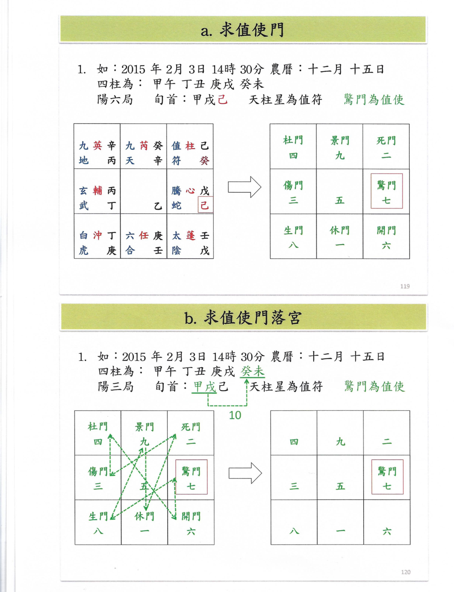

> **🖼 圖像解讀**　｜　檢視狀態：✅ 已檢視
> - **類型**：九宮圖（投影片 119–120）
> - **內容**：「a. 求值使門」：續用 2015年2月3日14時30分例，旬首甲戌己的「己」在兌七宮，對照八門原宮圖得驚門為值使；「b. 求值使門落宮」：從旬首甲戌數到時柱癸未共 10 個時辰，由兌七宮依洛書飛宮順序（七→八→九→一→二→三→四→五→六→七）數 10 步，仍落兌七宮，故驚門落七宮。投影片 120 盤頭印「陽三局」，與前後頁「陽六局」不同，照原文記錄。
> - **原文出處（逐字）**：a. 求值使門；b. 求值使門落宮
> - **可檢索關鍵字**：求值使門, 值使落宮, 驚門, 飛宮順序, 旬首數到時辰, 十個時辰, 兌七宮

**📝 逐字謄寫（第 61 頁）**

### a. 求值使門（投影片 119）

1. 如：2015 年 2月 3日 14時 30分 農曆：十二月 十五日
   四柱為：甲午 丁丑 庚戌 癸未
   陽六局　旬首：甲戌己（「己」紅字）　天柱星為值符　驚門為值使

左圖（兌宮地盤「己」以框標示）：

| 九地 英 辛／丙 | 九天 芮 癸／辛 | 值符 柱 己／癸 |
|---|---|---|
| 玄武 輔 丙／丁 | 乙 | 騰蛇 心 戊／［框］己 |
| 白虎 沖 丁／庚 | 六合 任 庚／壬 | 太陰 蓬 壬／戊 |

右圖（八門原宮與宮數；驚門七以框標示）：

| 杜門 四 | 景門 九 | 死門 二 |
|---|---|---|
| 傷門 三 | 五 | ［框］驚門 七 |
| 生門 八 | 休門 一 | 開門 六 |

### b. 求值使門落宮（投影片 120）

1. 如：2015 年 2月 3日 14時 30分 農曆：十二月 十五日
   四柱為：甲午 丁丑 庚戌 癸未
   陽三局　旬首：甲戌己　天柱星為值符　驚門為值使
   （圖示：「甲戌」到「癸未」之間標「10」）

（註：此頁盤頭印「陽三局」，與本例其他頁「陽六局」不同，原文如此。）

左圖：八門原宮九宮格，綠色虛線箭頭依宮數順序飛宮（由七出發，經八、九、一、二、三、四、五、六回到七）。
右圖：只標宮數，兌七宮標「驚門 七」（框示），即值使門落宮。

## 圖 62 — 第 62 頁（1200x1561）｜🖼 圖片（開圖判斷：圖表細看／裝飾照簡述）

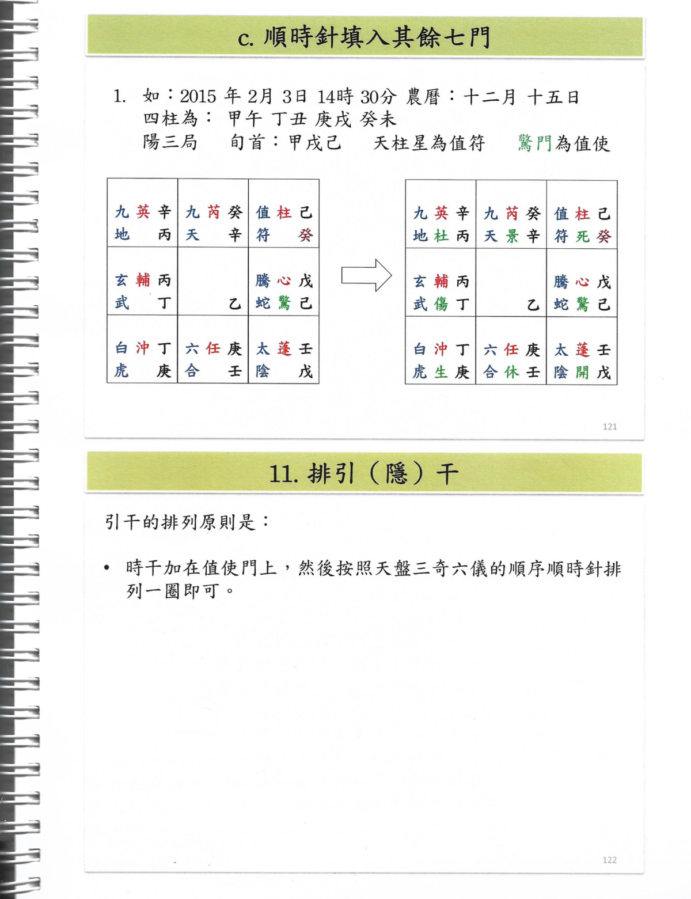

> **🖼 圖像解讀**　｜　檢視狀態：✅ 已檢視
> - **類型**：九宮圖＋文字頁（投影片 121–122）
> - **內容**：「c. 順時針填入其餘七門」：驚門落兌七後，依休生傷杜景死驚開順時針填入：兌驚、乾開、坎休、艮生、震傷、巽杜、離景、坤死，得完整盤；第 11 步「排引（隱）干」：時干加在值使門上，再按天盤三奇六儀的順序順時針排列一圈。
> - **原文出處（逐字）**：c. 順時針填入其餘七門；11. 排引（隱）干
> - **可檢索關鍵字**：順時針填八門, 驚門值使, 八門落宮, 完整排盤, 引干, 隱干, 時干加值使

**📝 逐字謄寫（第 62 頁）**

### c. 順時針填入其餘七門（投影片 121）

1. 如：2015 年 2月 3日 14時 30分 農曆：十二月 十五日
   四柱為：甲午 丁丑 庚戌 癸未
   陽三局　旬首：甲戌己　天柱星為值符　驚門為值使

左圖（僅兌宮有驚門）→ 右圖（八門填滿）：

| 九地 英 辛／杜 丙 | 九天 芮 癸／景 辛 | 值符 柱 己／死 癸 |
|---|---|---|
| 玄武 輔 丙／傷 丁 | 乙 | 騰蛇 心 戊／驚 己 |
| 白虎 沖 丁／生 庚 | 六合 任 庚／休 壬 | 太陰 蓬 壬／開 戊 |

（註：此頁盤頭同樣印「陽三局」，原文如此。）

### 11. 排引（隱）干（投影片 122）

引干的排列原則是：

- 時干加在值使門上，然後按照天盤三奇六儀的順序順時針排列一圈即可。

## 圖 63 — 第 63 頁（1200x1561）｜🖼 圖片（開圖判斷：圖表細看／裝飾照簡述）

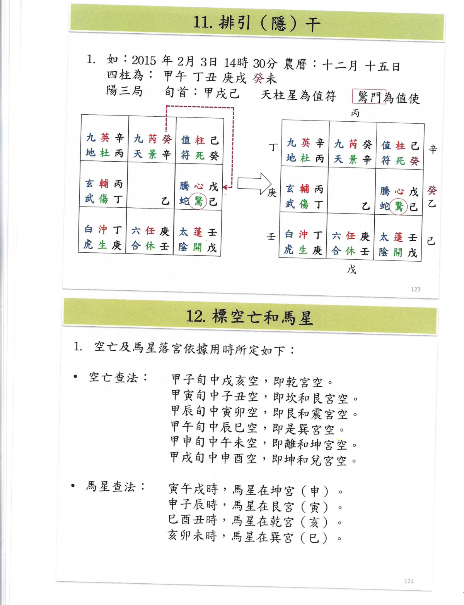

> **🖼 圖像解讀**　｜　檢視狀態：✅ 已檢視
> - **類型**：九宮圖＋文字頁（投影片 123–124）
> - **內容**：「排引（隱）干」示範：時干癸加在值使驚門（兌宮）上，再依天盤三奇六儀順序順時針排一圈，得各宮引干（兌癸、乾己、坎戊、艮壬、震庚、巽丁、離丙、坤辛）；第 12 步「標空亡和馬星」：空亡依用時旬首（甲子旬戌亥空乾宮、甲寅旬子丑空坎艮、甲辰旬寅卯空艮震、甲午旬辰巳空巽、甲申旬午未空離坤、甲戌旬申酉空坤兌），馬星依時支三合局（寅午戌在坤申、申子辰在艮寅、巳酉丑在乾亥、亥卯未在巽巳）。
> - **原文出處（逐字）**：11. 排引（隱）干；12. 標空亡和馬星
> - **可檢索關鍵字**：排引干, 隱干, 空亡查法, 旬空, 馬星查法, 驛馬, 甲戌旬申酉空, 亥卯未馬在巳

**📝 逐字謄寫（第 63 頁）**

### 11. 排引（隱）干（投影片 123）

1. 如：2015 年 2月 3日 14時 30分 農曆：十二月 十五日
   四柱為：甲午 丁丑 庚戌 癸未（「癸」紅字）
   陽三局　旬首：甲戌己　天柱星為值符　［驚門］為值使

左圖：完整盤（兌宮驚門圈起；紅色虛線由離宮天盤「癸」指向兌宮，表示時干癸加於值使門上）

| 九地 英 辛／杜 丙 | 九天 芮 癸／景 辛 | 值符 柱 己／死 癸 |
|---|---|---|
| 玄武 輔 丙／傷 丁 | 乙 | 騰蛇 心 戊／⭕驚 己 |
| 白虎 沖 丁／生 庚 | 六合 任 庚／休 壬 | 太陰 蓬 壬／開 戊 |

右圖：盤外標示引干
- 上（離）：丙
- 左（巽／震／艮）：丁／庚／壬
- 右（坤／兌／乾）：辛／**癸**（紅字）乙／己
- 下（坎）：戊

（註：右側兌宮外印「癸 乙」兩字，癸為紅字引干。）

### 12. 標空亡和馬星（投影片 124）

1. 空亡及馬星落宮依據用時所定如下：

- 空亡查法：
  - 甲子旬中戌亥空，即乾宮空。
  - 甲寅旬中子丑空，即坎和艮宮空。
  - 甲辰旬中寅卯空，即艮和震宮空。
  - 甲午旬中辰巳空，即是巽宮空。
  - 甲申旬中午未空，即離和坤宮空。
  - 甲戌旬中申酉空，即坤和兌宮空。
- 馬星查法：
  - 寅午戌時，馬星在坤宮（申）。
  - 申子辰時，馬星在艮宮（寅）。
  - 巳酉丑時，馬星在乾宮（亥）。
  - 亥卯未時，馬星在巽宮（巳）。

## 圖 64 — 第 64 頁（1200x1561）｜🖼 圖片（開圖判斷：圖表細看／裝飾照簡述）

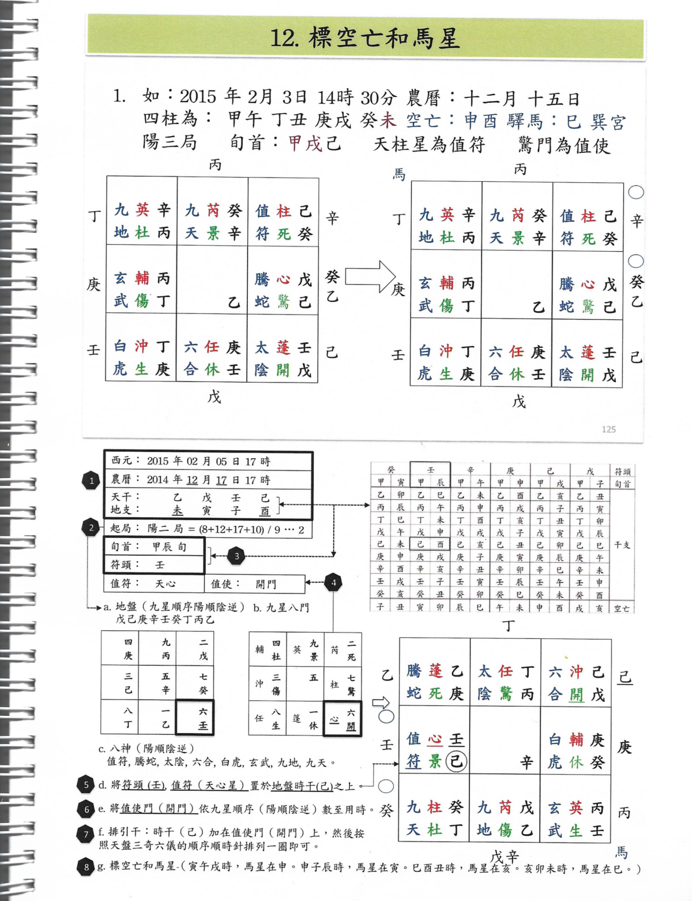

> **🖼 圖像解讀**　｜　檢視狀態：✅ 已檢視
> - **類型**：九宮圖＋排盤流程總圖（投影片 125 及下半頁工作表）
> - **內容**：上半為「標空亡和馬星」續例：2015年2月3日14時30分癸未時，空亡申酉、驛馬巳（巽宮），在坤、兌宮外畫空亡圈、巽宮外標「馬」。下半為一張完整排盤流程工作表：以西元2015年02月05日17時（農曆2014年12月17日17時，四柱乙未、戊寅、壬子、己酉）為例，依 8 個步驟：①排四柱 ②起局陽二局＝(8+12+17+10)/9餘2 ③查旬首甲辰旬、符頭壬 ④值符天心、值使開門 ⑤符頭壬與值符天心置於地盤時干己之上 ⑥值使開門依九星順序數至用時 ⑦時干己加在值使門上排引干 ⑧標空亡與馬星，並得最終完整盤。
> - **原文出處（逐字）**：12. 標空亡和馬星；工作表「西元：2015年02月05日17時／農曆：2014年12月17日17時／起局：陽二局＝(8+12+17+10)/9…2／旬首：甲辰旬／符頭：壬／值符：天心／值使：開門」
> - **可檢索關鍵字**：標空亡, 馬星, 排盤流程總表, 陽二局, 甲辰旬, 值符天心, 值使開門, 完整排盤範例

**📝 逐字謄寫（第 64 頁）**

### 12. 標空亡和馬星（投影片 125）

1. 如：2015 年 2月 3日 14時 30分 農曆：十二月 十五日
   四柱為：甲午 丁丑 庚戌 癸未　空亡：申酉　驛馬：巳 巽宮
   陽三局　旬首：甲戌己　天柱星為值符　驚門為值使

左圖：同上一頁完整盤＋引干（上丙；左丁、庚、壬；右辛、癸乙、己；下戊）。
右圖：同盤，另於巽宮外左上角標「馬」；坤宮（辛）與兌宮（癸乙）外側各畫一個空亡圓圈。

### 排盤流程工作表（下半頁）

① 西元：2015 年 02 月 05 日 17 時
　 農曆：2014 年 12 月 17 日 17 時

| | 年 | 月 | 日 | 時 |
|---|---|---|---|---|
| 天干 | 乙 | 戊 | 壬 | 己 |
| 地支 | 未 | 寅 | 子 | 酉 |

② 起局：陽二局 = (8+12+17+10) / 9 … 2
③ 旬首：甲辰旬　符頭：壬（由右側六十甲子表查得：己酉屬甲辰旬，表中「甲辰」「己酉」以框標示）
④ 值符：天心　值使：開門

a. 地盤（九星順序陽順陰逆）戊己庚辛壬癸丁丙乙：

| 四 庚 | 九 丙 | 二 戊 |
|---|---|---|
| 三 己 | 五 辛 | 七 癸 |
| 八 丁 | 一 乙 | **六 壬** |

b. 九星八門（原宮）：

| 輔 四 杜 | 英 九 景 | 芮 二 死 |
|---|---|---|
| 沖 三 傷 | 五 | 柱 七 驚 |
| 任 八 生 | 蓬 一 休 | **心 六 開** |

c. 八神（陽順陰逆）：值符, 騰蛇, 太陰, 六合, 白虎, 玄武, 九地, 九天。
⑤ d. 將符頭(壬), 值符（天心星）置於地盤時干(己)之上
⑥ e. 將值使門（開門）依九星順序（陽順陰逆）數至用時。
⑦ f. 排引干：時干（己）加在值使門（開門）上，然後按照天盤三奇六儀的順序順時針排列一圈即可。
⑧ g. 標空亡和馬星-（寅午戌時，馬星在申。申子辰時，馬星在寅。巳酉丑時，馬星在亥。亥卯未時，馬星在巳。）

右側六十甲子旬首表（同第 57 頁），最下方加一列「空亡」：

| 符頭 | 癸 | 壬 | 辛 | 庚 | 己 | 戊 |
|---|---|---|---|---|---|---|
| 旬首 | 甲寅 | 甲辰 | 甲午 | 甲申 | 甲戌 | 甲子 |
| 空亡 | 子丑 | 寅卯 | 辰巳 | 午未 | 申酉 | 戌亥 |

最終完整盤（每格：八神 星 天盤干／門 地盤干）：

| 騰蛇 蓬 乙／死 庚 | 太陰 任 丁／驚 丙 | 六合 沖 己／開 戊 |
|---|---|---|
| 值符 心 壬／景 ⭕己 | 辛 | 白虎 輔 庚／休 癸 |
| 九天 柱 癸／杜 丁 | 九地 芮 戊／傷 乙 | 玄武 英 丙／生 壬 |

盤外引干：上（離）丁；左（巽／震／艮）乙／壬／癸；右（坤／兌／乾）<u>己</u>／庚／丙；下（坎）戊辛。
左側震宮上下各有一個空亡圓圈（甲辰旬寅卯空）；右下乾宮外標「馬」（酉時馬星在亥）。

## 圖 65 — 第 65 頁（1200x1561）｜🖼 圖片（開圖判斷：圖表細看／裝飾照簡述）

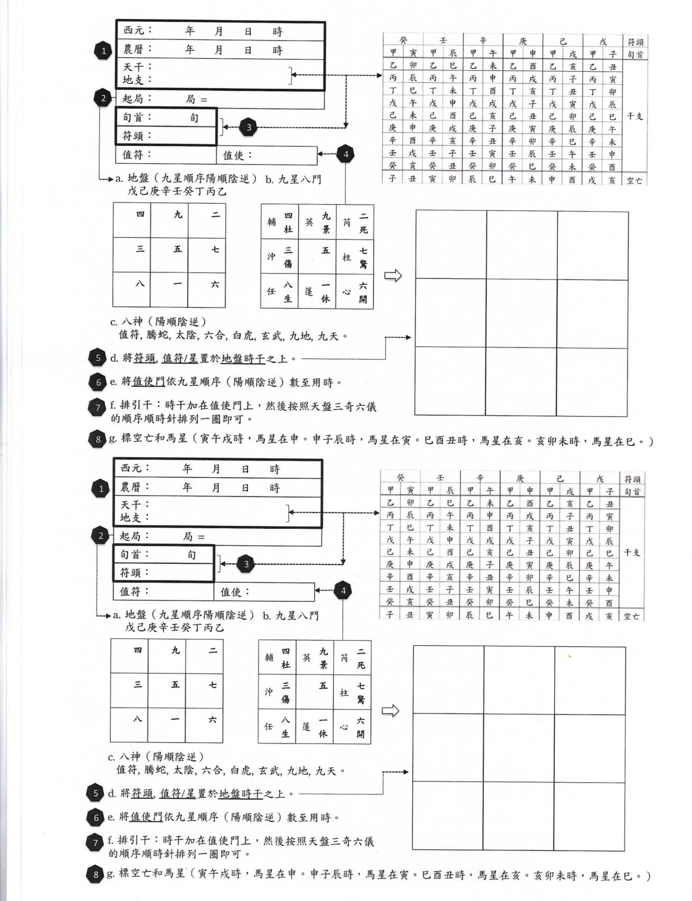

> **🖼 圖像解讀**　｜　檢視狀態：✅ 已檢視
> - **類型**：空白排盤練習工作表（兩份）
> - **內容**：兩份相同的空白排盤練習表，格式同第 64 頁流程工作表：①西元／農曆年月日時與四柱干支欄 ②起局 ③旬首、符頭 ④值符、值使；附空白地盤洛書數九宮、九星八門原宮九宮、八神順序、步驟 d–g 說明、六十甲子旬首空亡表及空白九宮盤。表格均未填寫。
> - **原文出處（逐字）**：（空白練習表，無標題）
> - **可檢索關鍵字**：排盤練習表, 空白工作表, 起局, 旬首符頭, 值符值使, 空亡馬星

**📝 逐字謄寫（第 65 頁）**

### 空白排盤練習工作表（上下各一份，內容相同）

① 西元：＿年＿月＿日＿時
　 農曆：＿年＿月＿日＿時
　 天干：＿＿＿＿／地支：＿＿＿＿
② 起局：＿局 ＝
③ 旬首：＿旬　符頭：＿
④ 值符：＿　值使：＿

a. 地盤（九星順序陽順陰逆）戊己庚辛壬癸丁丙乙（空白九宮，只標宮數：四 九 二／三 五 七／八 一 六）
b. 九星八門（輔四杜、英九景、芮二死／沖三傷、五、柱七驚／任八生、蓬一休、心六開）
c. 八神（陽順陰逆）值符, 騰蛇, 太陰, 六合, 白虎, 玄武, 九地, 九天。
⑤ d. 將符頭, 值符/星置於地盤時干之上。
⑥ e. 將值使門依九星順序（陽順陰逆）數至用時。
⑦ f. 排引干：時干加在值使門上，然後按照天盤三奇六儀的順序順時針排列一圈即可。
⑧ g. 標空亡和馬星（寅午戌時，馬星在申。申子辰時，馬星在寅。巳酉丑時，馬星在亥。亥卯未時，馬星在巳。）

右上：六十甲子旬首表＋空亡列（同第 64 頁）；右下：空白九宮盤（未填寫）。

## 圖 66 — 第 66 頁（1240x1617）｜🖼 圖片（開圖判斷：圖表細看／裝飾照簡述）

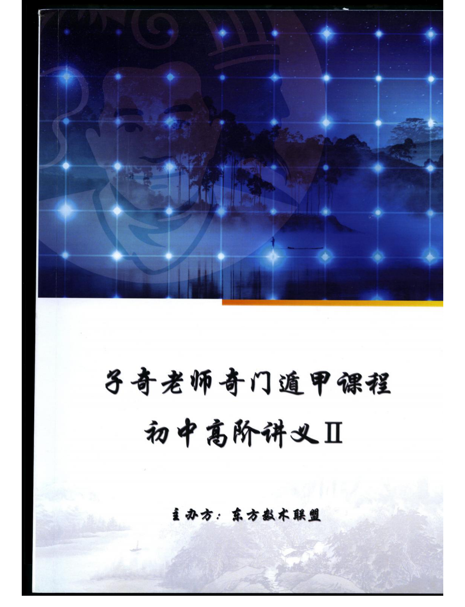

> **🖼 圖像解讀**　｜　檢視狀態：✅ 已檢視
> - **類型**：封面（講義第 II 冊）
> - **內容**：第二冊封面：「子奇老师奇门遁甲课程 初中高阶讲义Ⅱ」，主办方：东方数术联盟；上半部為古人側臉剪影疊合星空網格與山水夜景。
> - **原文出處（逐字）**：子奇老师奇门遁甲课程 初中高阶讲义Ⅱ／主办方：东方数术联盟
> - **可檢索關鍵字**：講義第二冊, 初中高階講義II, 東方數術聯盟, 子奇老師, 封面

**📝 逐字謄寫（第 66 頁）**

# 子奇老师奇门遁甲课程 初中高阶讲义Ⅱ

主办方：东方数术联盟

（封面圖：古人側臉剪影與星空網格、湖面夜景）

## 圖 67 — 第 67 頁（1240x1617）｜🖼 圖片（開圖判斷：圖表細看／裝飾照簡述）

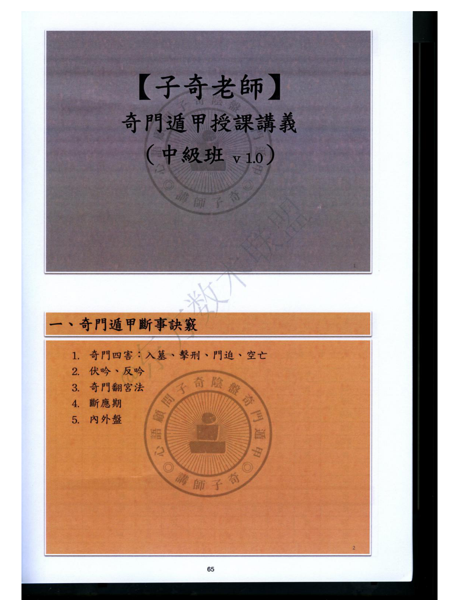

> **🖼 圖像解讀**　｜　檢視狀態：✅ 已檢視
> - **類型**：文字頁／目錄（中級班投影片 1–2）
> - **內容**：中級班講義標題頁「【子奇老師】奇門遁甲授課講義（中級班 v1.0）」，及第一章「奇門遁甲斷事訣竅」目錄：奇門四害（入墓、擊刑、門迫、空亡）、伏吟反吟、奇門翻宮法、斷應期、內外盤；頁面有「子奇陰盤奇門遁甲 講師子奇」圓形印章與「东方数术联盟」浮水印，頁碼 65。
> - **原文出處（逐字）**：【子奇老師】奇門遁甲授課講義（中級班 v1.0）；一、奇門遁甲斷事訣竅
> - **可檢索關鍵字**：中級班, 斷事訣竅, 奇門四害, 入墓擊刑門迫空亡, 伏吟反吟, 翻宮法, 斷應期, 內外盤

**📝 逐字謄寫（第 67 頁）**

### 【子奇老師】奇門遁甲授課講義（中級班 v1.0）（投影片 1）

（背景有圓形印章：「心語顧問 子奇陰盤奇門遁甲 講師子奇」〔印文依可見部分辨識〕，及斜向浮水印「东方数术联盟」）

### 一、奇門遁甲斷事訣竅（投影片 2）

1. 奇門四害：入墓、擊刑、門迫、空亡
2. 伏吟、反吟
3. 奇門翻宮法
4. 斷應期
5. 內外盤

（頁碼：65）

## 圖 68 — 第 68 頁（1240x1617）｜🖼 圖片（開圖判斷：圖表細看／裝飾照簡述）

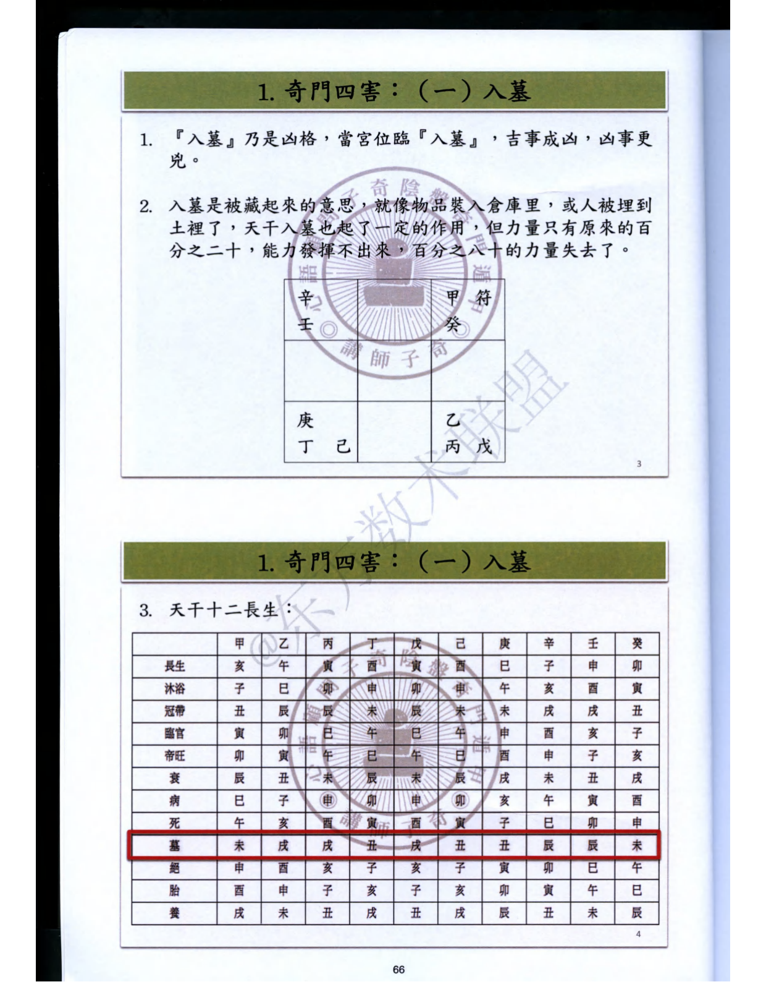

> **🖼 圖像解讀**　｜　檢視狀態：✅ 已檢視
> - **類型**：文字＋九宮圖＋十二長生表（中級班投影片 3–4）
> - **內容**：奇門四害之一「入墓」：入墓為凶格，吉事成凶、凶事更凶；入墓如物品入倉庫、人埋入土，天干力量只剩原來的百分之二十。附四隅宮入墓干示意圖（巽辰：辛壬；坤未：甲癸；艮丑：庚丁己；乾戌：乙丙戊），並以天干十二長生表紅框標出「墓」列（甲未、乙戌、丙戌、丁丑、戊戌、己丑、庚丑、辛辰、壬辰、癸未）。
> - **原文出處（逐字）**：1. 奇門四害：（一）入墓；3. 天干十二長生
> - **可檢索關鍵字**：奇門四害, 入墓, 凶格, 力量剩百分之二十, 天干入墓, 四庫, 辰戌丑未, 十二長生墓

**📝 逐字謄寫（第 68 頁）**

### 1. 奇門四害：（一）入墓（投影片 3）

1. 『入墓』乃是凶格，當宮位臨『入墓』，吉事成凶，凶事更兇。
2. 入墓是被藏起來的意思，就像物品裝入倉庫里，或人被埋到土裡了，天干入墓也起了一定的作用，但力量只有原來的百分之二十，能力發揮不出來，百分之八十的力量失去了。

四隅宮入墓天干示意圖（只填四角宮）：

| 巽：辛／壬 | （離） | 坤：甲 符／癸 |
|---|---|---|
| （震） | （中） | （兌） |
| **艮：庚／丁 己** | （坎） | **乾：乙／丙 戊** |

### 1. 奇門四害：（一）入墓（投影片 4）

3. 天干十二長生：（表同初級班第 42 頁，「墓」列以紅框標示）

| | 甲 | 乙 | 丙 | 丁 | 戊 | 己 | 庚 | 辛 | 壬 | 癸 |
|---|---|---|---|---|---|---|---|---|---|---|
| 長生 | 亥 | 午 | 寅 | 酉 | 寅 | 酉 | 巳 | 子 | 申 | 卯 |
| 沐浴 | 子 | 巳 | 卯 | 申 | 卯 | 申 | 午 | 亥 | 酉 | 寅 |
| 冠帶 | 丑 | 辰 | 辰 | 未 | 辰 | 未 | 未 | 戌 | 戌 | 丑 |
| 臨官 | 寅 | 卯 | 巳 | 午 | 巳 | 午 | 申 | 酉 | 亥 | 子 |
| 帝旺 | 卯 | 寅 | 午 | 巳 | 午 | 巳 | 酉 | 申 | 子 | 亥 |
| 衰 | 辰 | 丑 | 未 | 辰 | 未 | 辰 | 戌 | 未 | 丑 | 戌 |
| 病 | 巳 | 子 | 申 | 卯 | 申 | 卯 | 亥 | 午 | 寅 | 酉 |
| 死 | 午 | 亥 | 酉 | 寅 | 酉 | 寅 | 子 | 巳 | 卯 | 申 |
| **墓** | **未** | **戌** | **戌** | **丑** | **戌** | **丑** | **丑** | **辰** | **辰** | **未** |
| 絕 | 申 | 酉 | 亥 | 子 | 亥 | 子 | 寅 | 卯 | 巳 | 午 |
| 胎 | 酉 | 申 | 子 | 亥 | 子 | 亥 | 卯 | 寅 | 午 | 巳 |
| 養 | 戌 | 未 | 丑 | 戌 | 丑 | 戌 | 辰 | 丑 | 未 | 辰 |

（頁碼：66）

## 圖 69 — 第 69 頁（1240x1617）｜🖼 圖片（開圖判斷：圖表細看／裝飾照簡述）

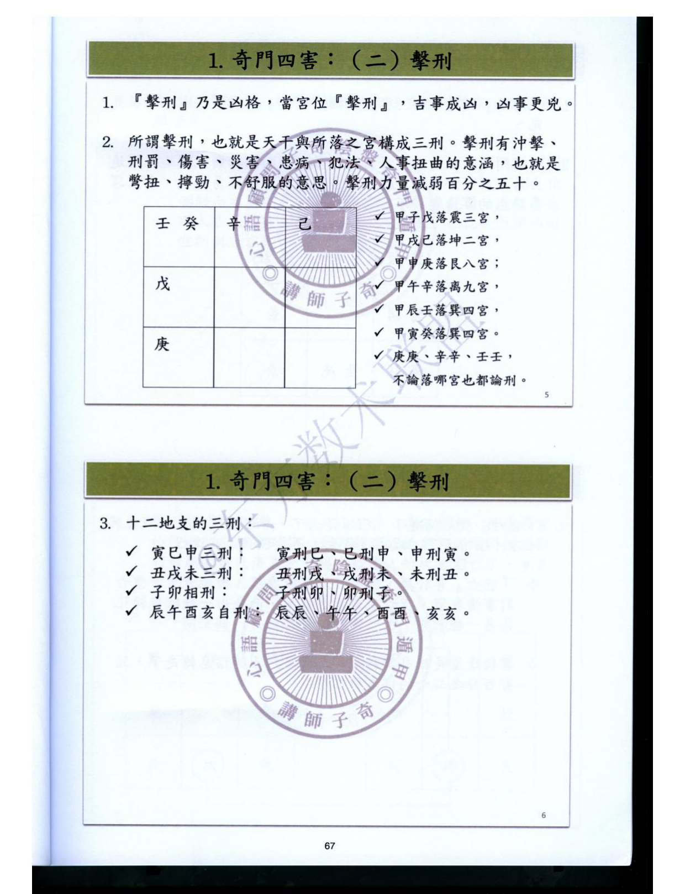

> **🖼 圖像解讀**　｜　檢視狀態：✅ 已檢視
> - **類型**：文字＋九宮圖（中級班投影片 5–6）
> - **內容**：奇門四害之二「擊刑」：擊刑為凶格，指天干與所落宮構成三刑，有沖擊刑罰、傷害災害、患病犯法、人事扭曲之意，力量減弱百分之五十；六儀擊刑位置：甲子戊落震三、甲戌己落坤二、甲申庚落艮八、甲午辛落離九、甲辰壬落巽四、甲寅癸落巽四，另庚庚、辛辛、壬壬不論落哪宮都論刑；附十二地支三刑回顧。
> - **原文出處（逐字）**：1. 奇門四害：（二）擊刑；3. 十二地支的三刑
> - **可檢索關鍵字**：擊刑, 六儀擊刑, 三刑, 力量減半, 戊落震三, 己落坤二, 庚落艮八, 伏吟自刑

**📝 逐字謄寫（第 69 頁）**

### 1. 奇門四害：（二）擊刑（投影片 5）

1. 『擊刑』乃是凶格，當宮位『擊刑』，吉事成凶，凶事更兇。
2. 所謂擊刑，也就是天干與所落之宮構成三刑。擊刑有沖擊、刑罰、傷害、災害、患病、犯法、人事扭曲的意涵，也就是彆扭、擰勁、不舒服的意思。擊刑力量減弱百分之五十。

六儀擊刑示意圖：

| 巽：壬 癸 | 離：辛 | 坤：己 |
|---|---|---|
| **震：戊** | （中） | （兌） |
| **艮：庚** | （坎） | （乾） |

- ✓ 甲子戊落震三宮，
- ✓ 甲戌己落坤二宮，
- ✓ 甲申庚落艮八宮；
- ✓ 甲午辛落離九宮，
- ✓ 甲辰壬落巽四宮，
- ✓ 甲寅癸落巽四宮。
- ✓ 庚庚、辛辛、壬壬，不論落哪宮也都論刑。

### 1. 奇門四害：（二）擊刑（投影片 6）

3. 十二地支的三刑：
- ✓ 寅巳申三刑：寅刑巳、巳刑申、申刑寅。
- ✓ 丑戌未三刑：丑刑戌、戌刑未、未刑丑。
- ✓ 子卯相刑：子刑卯、卯刑子。
- ✓ 辰午酉亥自刑：辰辰、午午、酉酉、亥亥。

（頁碼：67）

## 圖 70 — 第 70 頁（1240x1617）｜🖼 圖片（開圖判斷：圖表細看／裝飾照簡述）

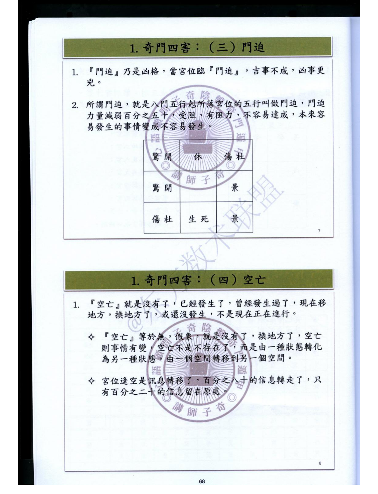

> **🖼 圖像解讀**　｜　檢視狀態：✅ 已檢視
> - **類型**：文字＋九宮圖（中級班投影片 7–8）
> - **內容**：奇門四害之三「門迫」：八門五行剋所落宮位五行即為門迫，凶格，吉事不成凶事更兇，力量減弱百分之五十，容易發生的事變成不容易發生；附各宮門迫之門示意圖。之四「空亡」：空亡是沒有了、已發生過、移地換地方或尚未發生，不是正在進行；空亡等於無、假象，事情有變，是由一種狀態轉化到另一種狀態；宮位逢空，百分之八十的信息轉走，只有百分之二十留在原處。
> - **原文出處（逐字）**：1. 奇門四害：（三）門迫；1. 奇門四害：（四）空亡
> - **可檢索關鍵字**：門迫, 門剋宮, 力量減半, 空亡, 事情有變, 信息轉移, 百分之二十, 奇門四害

**📝 逐字謄寫（第 70 頁）**

### 1. 奇門四害：（三）門迫（投影片 7）

1. 『門迫』乃是凶格，當宮位臨『門迫』，吉事不成，凶事更兇。
2. 所謂門迫，就是八門五行剋所落宮位的五行叫做門迫，門迫力量減弱百分之五十，受阻、有阻力、不容易達成，本來容易發生的事情變成不容易發生。

各宮門迫之門：

| 巽（木）：驚 開 | 離（火）：休 | 坤（土）：傷 杜 |
|---|---|---|
| **震（木）：驚 開** | （中） | **兌（金）：景** |
| **艮（土）：傷 杜** | **坎（水）：生 死** | **乾（金）：景** |

### 1. 奇門四害：（四）空亡（投影片 8）

1. 『空亡』就是沒有了，已經發生了，曾經發生過了，現在移地方，換地方了，或還沒發生，不是現在正在進行。
   - ✧ 『空亡』等於無，假象，就是沒有了，換地方了，空亡則事情有變，空亡不是不存在了，而是由一種狀態轉化為另一種狀態，由一個空間轉移到另一個空間。
   - ✧ 宮位逢空是訊息轉移了，百分之八十的信息轉走了，只有百分之二十的信息留在原處。

（頁碼：68）

## 圖 71 — 第 71 頁（1240x1617）｜🖼 圖片（開圖判斷：圖表細看／裝飾照簡述）

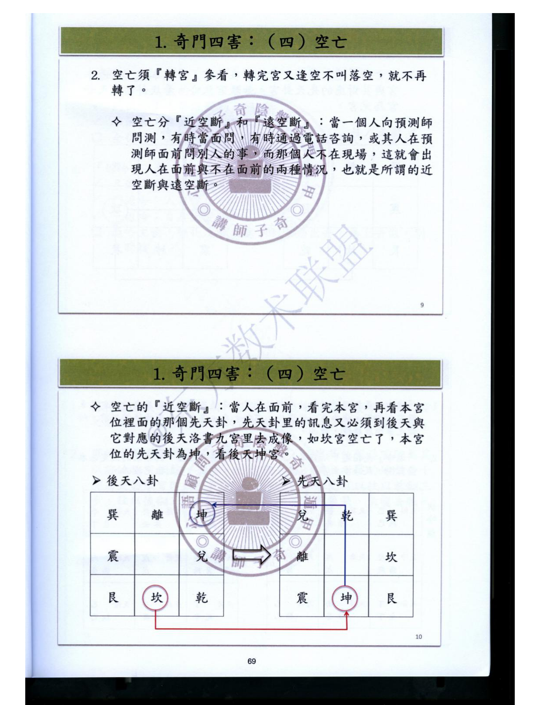

> **🖼 圖像解讀**　｜　檢視狀態：✅ 已檢視
> - **類型**：文字＋先後天八卦九宮圖（中級班投影片 9–10）
> - **內容**：空亡須「轉宮」參看，轉完宮又逢空不叫落空、不再轉；空亡分「近空斷」與「遠空斷」（當事人在面前或不在面前）。近空斷：看完本宮，再看本宮位裡的先天卦，並到該先天卦對應的後天洛書宮成像，例：坎宮空亡，坎宮位置的先天卦為坤，故看後天坤宮。
> - **原文出處（逐字）**：1. 奇門四害：（四）空亡（投影片 9、10）
> - **可檢索關鍵字**：空亡轉宮, 近空斷, 遠空斷, 先天八卦, 後天八卦, 坎宮空亡, 看坤宮

**📝 逐字謄寫（第 71 頁）**

### 1. 奇門四害：（四）空亡（投影片 9）

2. 空亡須『轉宮』參看，轉完宮又逢空不叫落空，就不再轉了。
   - ✧ 空亡分『近空斷』和『遠空斷』：當一個人向預測師問測，有時當面問，有時通過電話咨詢，或其人在預測師面前問別人的事，而那個人不在現場，這就會出現人在面前與不在面前的兩種情況，也就是所謂的近空斷與遠空斷。

### 1. 奇門四害：（四）空亡（投影片 10）

- ✧ 空亡的『近空斷』：當人在面前，看完本宮，再看本宮位裡面的那個先天卦，先天卦里的訊息又必須到後天與它對應的後天洛書九宮里去成像，如坎宮空亡了，本宮位的先天卦為坤，看後天坤宮。

➢ 後天八卦：

| 巽 | 離 | ⭕坤 |
|---|---|---|
| 震 | | 兌 |
| 艮 | ⭕坎 | 乾 |

➢ 先天八卦（同一九宮位置）：

| 兌 | 乾 | 巽 |
|---|---|---|
| 離 | | 坎 |
| 震 | ⭕坤 | 艮 |

（紅箭頭：後天坎宮 → 先天圖同位置為「坤」；藍箭頭：先天坤 → 後天坤宮）

## 圖 72 — 第 72 頁（1240x1617）｜🖼 圖片（開圖判斷：圖表細看／裝飾照簡述）

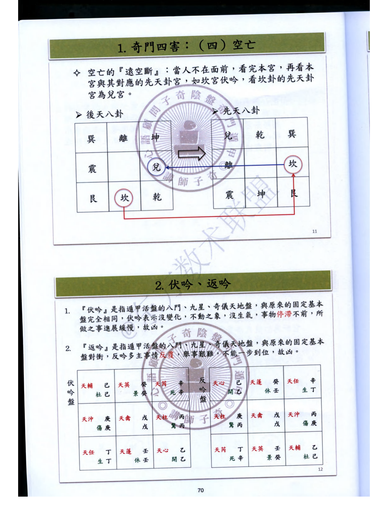

> **🖼 圖像解讀**　｜　檢視狀態：✅ 已檢視
> - **類型**：文字＋九宮圖（中級班投影片 11–12）
> - **內容**：空亡的「遠空斷」：人不在面前時，看完本宮，再看本宮卦在先天八卦中所在的位置對應的後天宮，例：坎宮（原文作「坎宮伏吟」）看坎卦的先天卦宮為兌宮。第二節「伏吟、返吟」：伏吟是活盤八門、九星、奇儀天地盤與固定基本盤完全相同，表示沒變化、停滯不前、進展緩慢，故凶；返（反）吟是活盤與基本盤對沖，多主事情反覆、舉事艱難、不能一步到位，故凶；附伏吟盤與反吟盤範例。
> - **原文出處（逐字）**：1. 奇門四害：（四）空亡；2. 伏吟、返吟
> - **可檢索關鍵字**：遠空斷, 先天卦宮, 伏吟, 返吟, 反吟, 停滯不前, 事情反覆, 伏吟盤

**📝 逐字謄寫（第 72 頁）**

### 1. 奇門四害：（四）空亡（投影片 11）

- ✧ 空亡的『遠空斷』：當人不在面前，看完本宮，再看本宮與其對應的先天卦宮，如坎宮伏吟，看坎卦的先天卦宮為兌宮。

（註：原文此處寫「坎宮伏吟」，依上下文應指坎宮空亡，照錄。）

➢ 後天八卦（⭕兌、⭕坎）：

| 巽 | 離 | 坤 |
|---|---|---|
| 震 | | ⭕兌 |
| 艮 | ⭕坎 | 乾 |

➢ 先天八卦（⭕坎在右中）：

| 兌 | 乾 | 巽 |
|---|---|---|
| 離 | | ⭕坎 |
| 震 | 坤 | 艮 |

（紅箭頭：後天坎 → 先天坎所在位置〔右中〕；藍箭頭：該位置 → 後天兌宮）

### 2. 伏吟、返吟（投影片 12）

1. 『伏吟』是指遁甲活盤的八門、九星、奇儀天地盤，與原來的固定基本盤完全相同，伏吟表示沒變化，不動之象，沒生氣，事物**停滯**不前，所做之事進展緩慢，故凶。
2. 『返吟』是指遁甲活盤的八門、九星、奇儀天地盤，與原來的固定基本盤對衝，反吟多主事情**反覆**，舉事艱難，不能一步到位，故凶。

伏吟盤（每格：星 天盤干／門 地盤干）：

| 天輔 己／杜 己 | 天英 癸／景 癸 | 天芮 辛／死 辛 |
|---|---|---|
| 天沖 庚／傷 庚 | 天禽 戊／戊 | 天柱 丙／驚 丙 |
| 天任 丁／生 丁 | 天蓬 壬／休 壬 | 天心 乙／開 乙 |

反吟盤：

| 天心 己／開 乙 | 天蓬 癸／休 壬 | 天任 辛／生 丁 |
|---|---|---|
| 天柱 庚／驚 丙 | 天禽 戊／戊 | 天沖 丙／傷 庚 |
| 天芮 丁／死 辛 | 天英 壬／景 癸 | 天輔 乙／杜 己 |

（頁碼：70）

## 圖 73 — 第 73 頁（1240x1617）｜🖼 圖片（開圖判斷：圖表細看／裝飾照簡述）

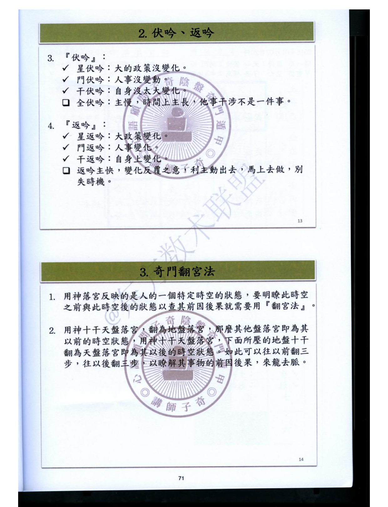

> **🖼 圖像解讀**　｜　檢視狀態：✅ 已檢視
> - **類型**：文字頁（中級班投影片 13–14）
> - **內容**：伏吟分星伏吟（大政策沒變化）、門伏吟（人事沒變動）、干伏吟（自身沒大變化），全伏吟主慢、時間長、他事干涉；返吟分星返吟（大政策變化）、門返吟（人事變化）、干返吟（自身變化），返吟主快、變化反覆，利主動出去、馬上做、別失時機。第三節「奇門翻宮法」：用神落宮反映特定時空狀態，要查前因後果就用翻宮法：用神天盤落宮翻為地盤落宮即以前的時空狀態，其下所壓的地盤干翻為天盤落宮即以後的狀態，可往前、往後各翻三步。
> - **原文出處（逐字）**：2. 伏吟、返吟；3. 奇門翻宮法
> - **可檢索關鍵字**：星伏吟, 門伏吟, 干伏吟, 全伏吟主慢, 返吟主快, 奇門翻宮法, 前因後果, 往前往後翻三步

**📝 逐字謄寫（第 73 頁）**

### 2. 伏吟、返吟（投影片 13）

3. 『伏吟』：
   - ✓ 星伏吟：大的政策沒變化。
   - ✓ 門伏吟：人事沒變動。
   - ✓ 干伏吟：自身沒太大變化。
   - ☐ 全伏吟：主慢，時間上主長，他事干涉不是一件事。
4. 『返吟』：
   - ✓ 星返吟：大政策變化。
   - ✓ 門返吟：人事變化。
   - ✓ 干返吟：自身上變化。
   - ☐ 返吟主快，變化反覆之意，利主動出去，馬上去做，別失時機。

### 3. 奇門翻宮法（投影片 14）

1. 用神落宮反映的是人的一個特定時空的狀態，要明瞭此時空之前與此時空後的狀態以查其前因後果就需要用『翻宮法』。
2. 用神十干天盤落宮，翻為地盤落宮，那麼其他盤落宮即為其以前的時空狀態，用神十干天盤落宮，下面所壓的地盤十干翻為天盤落宮即為其以後的時空狀態。如此可以往以前翻三步，往以後翻三步，以瞭解其事物的前因後果，來龍去脈。

（頁碼：71）

## 圖 74 — 第 74 頁（1240x1617）｜🖼 圖片（開圖判斷：圖表細看／裝飾照簡述）

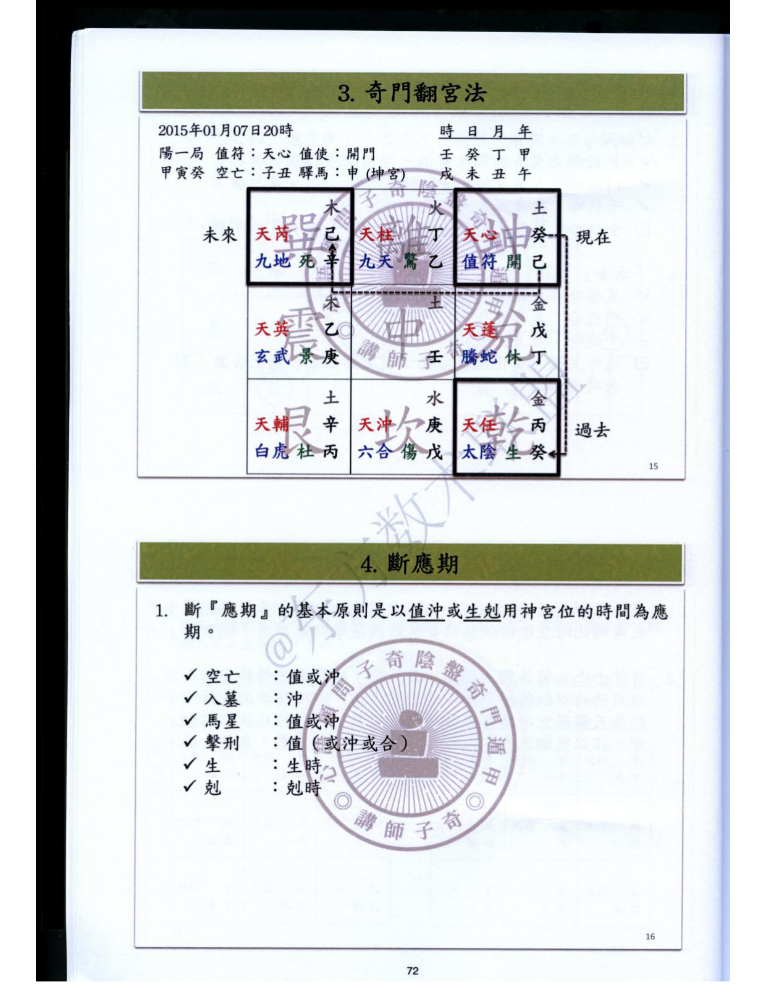

> **🖼 圖像解讀**　｜　檢視狀態：✅ 已檢視
> - **類型**：奇門盤範例＋文字頁（中級班投影片 15–16）
> - **內容**：翻宮法範例：2015年01月07日20時，陽一局，值符天心、值使開門，甲寅癸，空亡子丑，驛馬申（坤宮），四柱甲午年丁丑月癸未日壬戌時；以日干癸為用神，天盤癸在坤宮標「現在」，地盤癸在乾宮標「過去」，坤宮地盤己翻到天盤己所在的巽宮標「未來」。第四節「斷應期」：以值、沖或生剋用神宮位的時間為應期——空亡：值或沖；入墓：沖；馬星：值或沖；擊刑：值（或沖或合）；生：生時；剋：剋時。
> - **原文出處（逐字）**：3. 奇門翻宮法；盤頭「2015年01月07日20時 陽一局 值符：天心 值使：開門 甲寅癸 空亡：子丑 驛馬：申(坤宮)」；4. 斷應期
> - **可檢索關鍵字**：翻宮法範例, 陽一局, 現在過去未來, 用神癸, 斷應期, 值沖, 空亡應期, 入墓逢沖

**📝 逐字謄寫（第 74 頁）**

### 3. 奇門翻宮法（投影片 15）

2015年01月07日20時
陽一局　值符：天心　值使：開門
甲寅癸　空亡：子丑　驛馬：申(坤宮)

| 時 | 日 | 月 | 年 |
|---|---|---|---|
| 壬戌 | 癸未 | 丁丑 | 甲午 |

| 巽（木）【未來】 | 離（火） | 坤（土）【現在】 |
|---|---|---|
| 天芮 己 九地 死 辛 | 天柱 丁 九天 驚 乙 | 天心 癸 值符 開 己 |
| **震（木）** | **中（土）** | **兌（金）** |
| 天英 乙 玄武 景 庚 | 壬 | 天蓬 戊 騰蛇 休 丁 |
| **艮（土）** | **坎（水）** | **乾（金）【過去】** |
| 天輔 辛 白虎 杜 丙 | 天沖 庚 六合 傷 戊 | 天任 丙 太陰 生 癸 |

（巽、坤、乾三宮以粗框標示；虛線箭頭：坤宮地盤「己」→ 巽宮天盤「己」＝未來；乾宮地盤「癸」→ 坤宮天盤「癸」＝由過去到現在。）

### 4. 斷應期（投影片 16）

1. 斷『應期』的基本原則是以值沖或生剋用神宮位的時間為應期。
   - ✓ 空亡：值或沖
   - ✓ 入墓：沖
   - ✓ 馬星：值或沖
   - ✓ 擊刑：值（或沖或合）
   - ✓ 生：生時
   - ✓ 剋：剋時

（頁碼：72）

## 圖 75 — 第 75 頁（1240x1617）｜🖼 圖片（開圖判斷：圖表細看／裝飾照簡述）

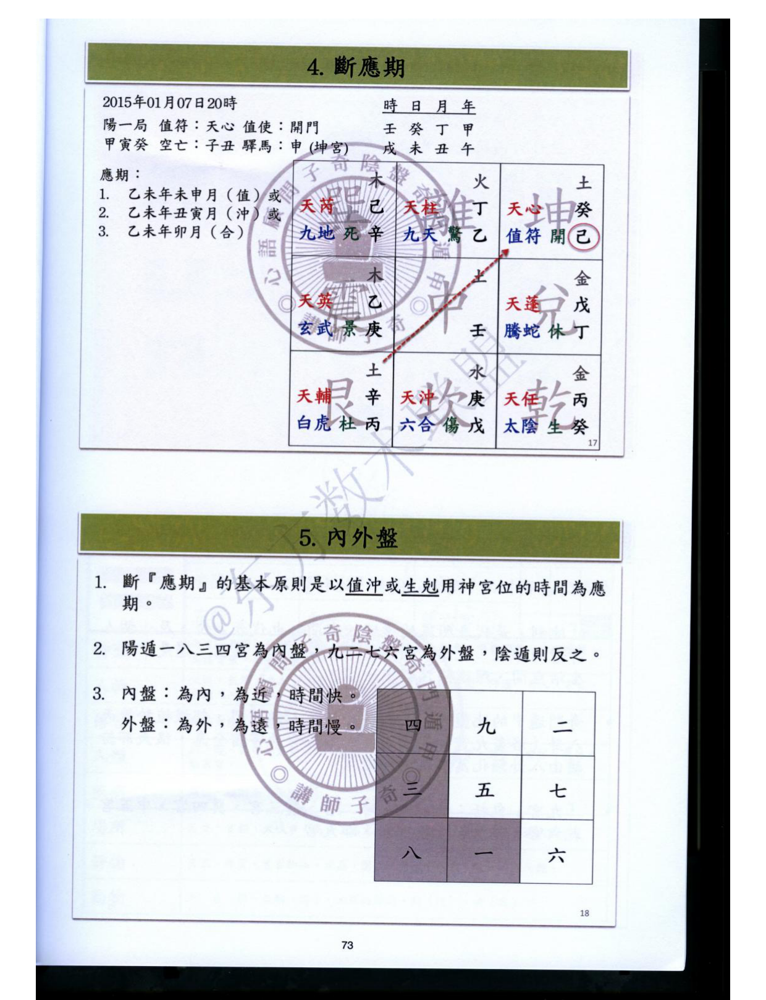

> **🖼 圖像解讀**　｜　檢視狀態：✅ 已檢視
> - **類型**：奇門盤範例＋文字與九宮圖（中級班投影片 17–18）
> - **內容**：斷應期範例：沿用 2015年01月07日20時陽一局盤，用神落坤宮（地盤己圈起），應期為 1. 乙未年未申月（值）、2. 乙未年丑寅月（沖）、3. 乙未年卯月（合）。第五節「內外盤」：陽遁一八三四宮為內盤、九二七六宮為外盤，陰遁相反；內盤為內、為近、時間快，外盤為外、為遠、時間慢（本頁第 1 點重複斷應期原則）。
> - **原文出處（逐字）**：4. 斷應期（範例盤同第 74 頁）；5. 內外盤
> - **可檢索關鍵字**：斷應期範例, 值沖合, 乙未年, 內外盤, 陽遁內盤, 一八三四宮, 九二七六宮, 時間快慢

**📝 逐字謄寫（第 75 頁）**

### 4. 斷應期（投影片 17）

2015年01月07日20時
陽一局　值符：天心　值使：開門
甲寅癸　空亡：子丑　驛馬：申(坤宮)
四柱：時 壬戌｜日 癸未｜月 丁丑｜年 甲午

應期：
1. 乙未年未申月（值）或
2. 乙未年丑寅月（沖）或
3. 乙未年卯月（合）

（九宮盤同第 74 頁翻宮法範例；坤宮地盤「己」以紅圈標示，紅色虛線箭頭由艮宮方向指向坤宮。）

### 5. 內外盤（投影片 18）

1. 斷『應期』的基本原則是以值沖或生剋用神宮位的時間為應期。
2. 陽遁一八三四宮為內盤，九二七六宮為外盤，陰遁則反之。
3. 內盤：為內，為近，時間快。
   外盤：為外，為遠，時間慢。

九宮數（陽遁內盤四、三、八、一以深色標示）：

| **四** | 九 | 二 |
|---|---|---|
| **三** | 五 | 七 |
| **八** | **一** | 六 |

（頁碼：73）

## 圖 76 — 第 76 頁（1240x1617）｜🖼 圖片（開圖判斷：圖表細看／裝飾照簡述）

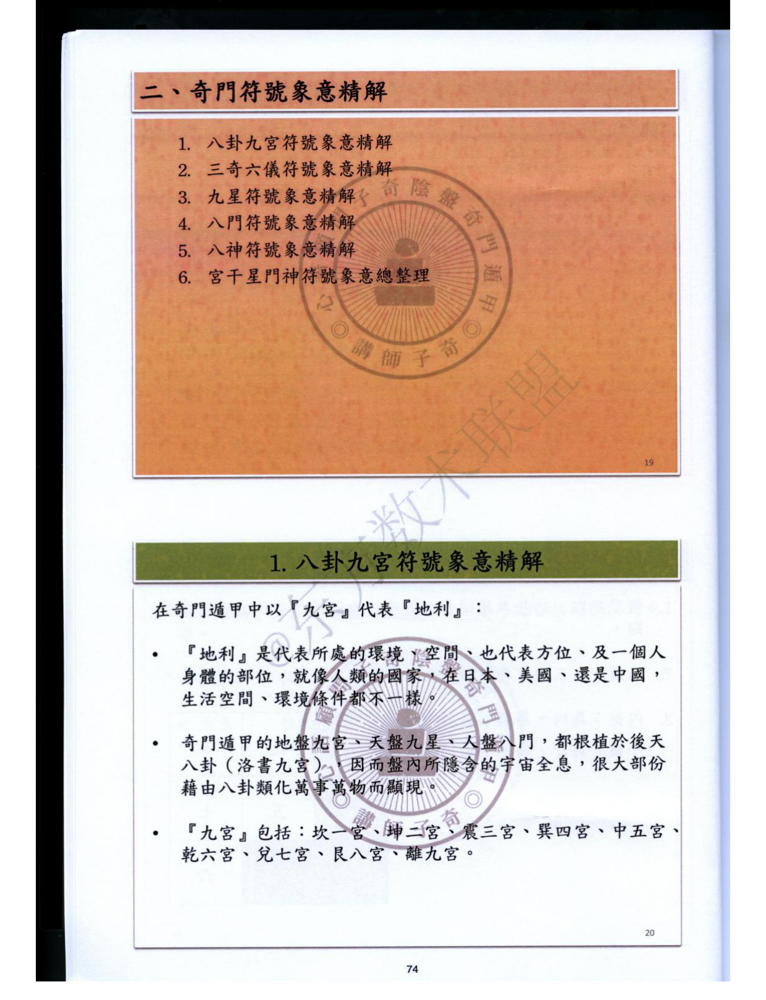

> **🖼 圖像解讀**　｜　檢視狀態：✅ 已檢視
> - **類型**：目錄＋文字頁（中級班投影片 19–20）
> - **內容**：第二章「奇門符號象意精解」目錄：八卦九宮、三奇六儀、九星、八門、八神符號象意精解，及宮干星門神符號象意總整理；投影片 20「八卦九宮符號象意精解」：九宮代表「地利」，即所處環境、空間、方位及人身部位；地盤九宮、天盤九星、人盤八門皆根植於後天八卦（洛書九宮），九宮為坎一、坤二、震三、巽四、中五、乾六、兌七、艮八、離九。
> - **原文出處（逐字）**：二、奇門符號象意精解；1. 八卦九宮符號象意精解
> - **可檢索關鍵字**：符號象意精解, 八卦九宮, 地利, 身體部位, 後天八卦, 洛書九宮, 宮干星門神總整理

**📝 逐字謄寫（第 76 頁）**

### 二、奇門符號象意精解（投影片 19）

1. 八卦九宮符號象意精解
2. 三奇六儀符號象意精解
3. 九星符號象意精解
4. 八門符號象意精解
5. 八神符號象意精解
6. 宮干星門神符號象意總整理

### 1. 八卦九宮符號象意精解（投影片 20）

在奇門遁甲中以『九宮』代表『地利』：

- 『地利』是代表所處的環境、空間、也代表方位、及一個人身體的部位，就像人類的國家，在日本、美國、還是中國，生活空間、環境條件都不一樣。
- 奇門遁甲的地盤九宮、天盤九星、人盤八門，都根植於後天八卦（洛書九宮），因而盤內所隱含的宇宙全息，很大部份藉由八卦類化萬事萬物而顯現。
- 『九宮』包括：坎一宮、坤二宮、震三宮、巽四宮、中五宮、乾六宮、兌七宮、艮八宮、離九宮。

（頁碼：74）

## 圖 77 — 第 77 頁（1240x1617）｜🖼 圖片（開圖判斷：圖表細看／裝飾照簡述）

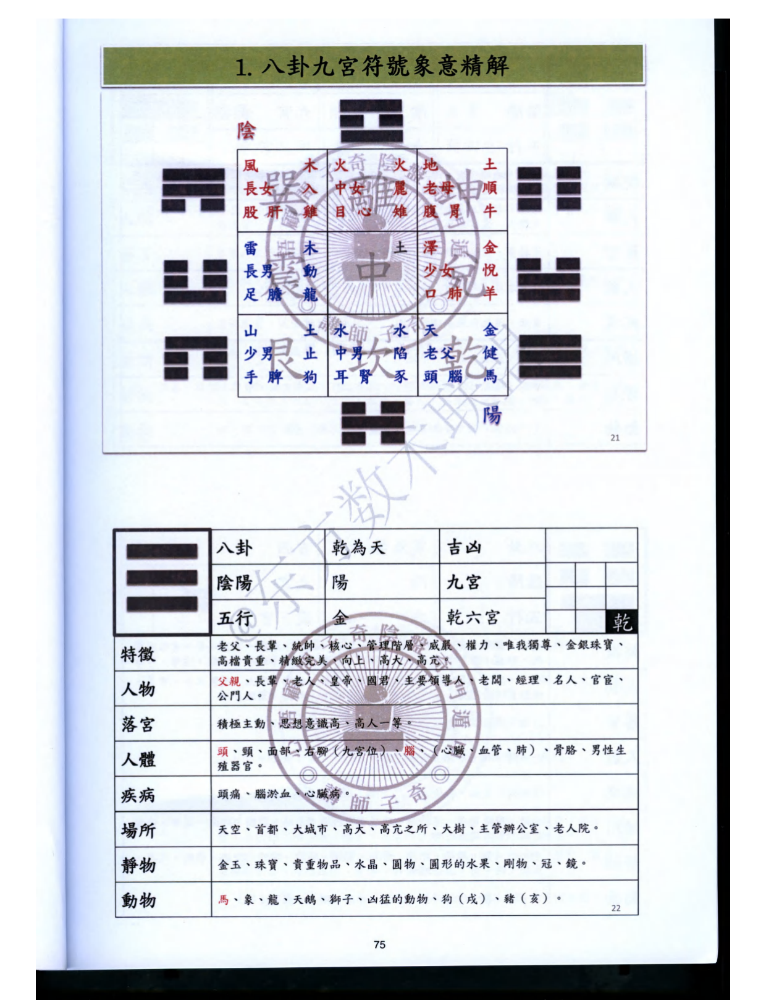

> **🖼 圖像解讀**　｜　檢視狀態：✅ 已檢視
> - **類型**：八卦九宮類象圖＋乾卦類象表（中級班投影片 21–22）
> - **內容**：投影片 21 以後天九宮配卦象，每宮列卦象（風雷山水等）、家人（長女中女老母…）、身體（股肝、目心、腹胃…）、五行、卦德（入麗順動悅止陷健）、動物（雞雉牛龍羊狗豕馬），左上標陰、右下標陽；投影片 22 為乾卦（乾為天、陽、金、乾六宮）詳細類象：特徵、人物（父親、長輩、老闆…）、落宮（積極主動、高人一等）、人體（頭、頸、面部、右腳、腦、骨骼…）、疾病、場所、靜物、動物。
> - **原文出處（逐字）**：1. 八卦九宮符號象意精解；乾卦類象表「八卦 乾為天／陰陽 陽／五行 金／九宮 乾六宮」
> - **可檢索關鍵字**：八卦九宮象意, 後天八卦家人, 八卦身體部位, 八卦動物, 乾卦, 乾六宮, 老父, 頭腦骨骼

**📝 逐字謄寫（第 77 頁）**

### 1. 八卦九宮符號象意精解（投影片 21）

（九宮外圍配各宮卦象符號；左上標「陰」、右下標「陽」）

| 巽 | 離 | 坤 |
|---|---|---|
| 風　木 長女　入 股 肝　雞 | 火　火 中女　麗 目 心　雉 | 地　土 老母　順 腹 胃　牛 |
| **震** | **中** | **兌** |
| 雷　木 長男　動 足 膽　龍 | 土 | 澤　金 少女　悅 口 肺　羊 |
| **艮** | **坎** | **乾** |
| 山　土 少男　止 手 脾　狗 | 水　水 中男　陷 耳 腎　豕 | 天　金 老父　健 頭 腦　馬 |

### 乾卦類象表（投影片 22）

| 項目 | 內容 |
|---|---|
| 八卦 | 乾為天 |
| 陰陽 | 陽 |
| 五行 | 金 |
| 九宮 | 乾六宮 |
| 吉凶 | （空白） |
| 特徵 | 老父、長輩、統帥、核心、管理階層、威嚴、權力、唯我獨尊、金銀珠寶、高檔貴重、精緻完美、向上、高大、高亢。 |
| 人物 | 父親、長輩、老人、皇帝、國君、主要領導人、老闆、經理、名人、官宦、公門人。 |
| 落宮 | 積極主動、思想意識高、高人一等。 |
| 人體 | 頭、頸、面部、右腳（九宮位）、腦、（心臟、血管、肺）、骨骼、男性生殖器官。 |
| 疾病 | 頭痛、腦淤血、心臟病。 |
| 場所 | 天空、首都、大城市、高大、高亢之所、大樹、主管辦公室、老人院。 |
| 靜物 | 金玉、珠寶、貴重物品、水晶、圓物、圓形的水果、剛物、冠、鏡。 |
| 動物 | 馬、象、龍、天鵝、獅子、凶猛的動物、狗（戌）、豬（亥）。 |

（頁碼：75）

## 圖 78 — 第 78 頁（1240x1617）｜🖼 圖片（開圖判斷：圖表細看／裝飾照簡述）

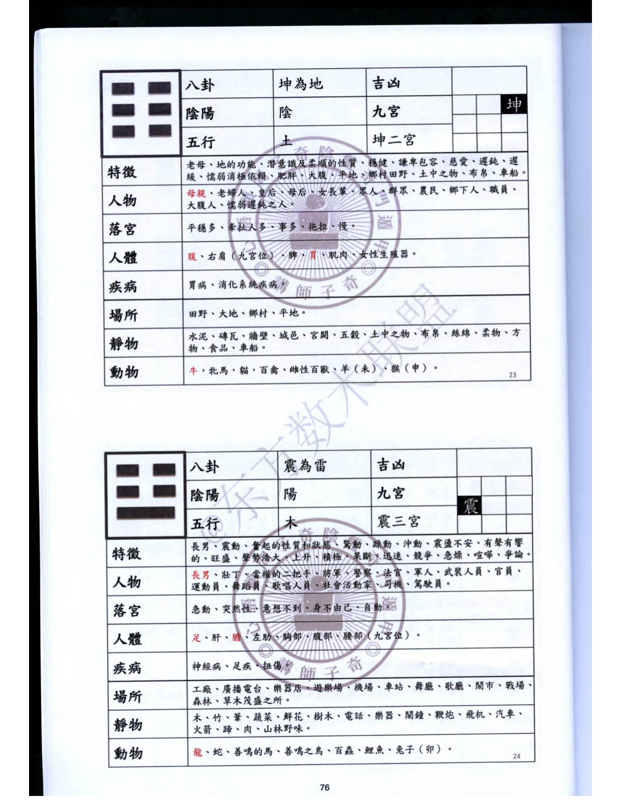

> **🖼 圖像解讀**　｜　檢視狀態：✅ 已檢視
> - **類型**：八卦類象表（中級班投影片 23–24）
> - **內容**：坤卦（坤為地、陰、土、坤二宮）與震卦（震為雷、陽、木、震三宮）詳細類象：坤主老母、柔順包容、遲緩懦弱，落宮平穩、牽扯人多事多、拖拉慢，人體腹、脾胃、肌肉，疾病胃病消化系統；震主長男、震動奮起、急躁爭論，落宮急動突然、身不由己，人體足、肝膽、胸腹，疾病神經病、足疾扭傷。
> - **原文出處（逐字）**：坤卦類象表「坤為地／陰／土／坤二宮」；震卦類象表「震為雷／陽／木／震三宮」
> - **可檢索關鍵字**：坤卦, 坤二宮, 老母, 脾胃, 震卦, 震三宮, 長男, 肝膽足

**📝 逐字謄寫（第 78 頁）**

### 坤卦類象表（投影片 23）

| 項目 | 內容 |
|---|---|
| 八卦／陰陽／五行／九宮 | 坤為地／陰／土／坤二宮 |
| 特徵 | 老母、地的功能、潛意識及柔順的性質、穩健、謙卑包容、慈愛、遲鈍、遲緩、懦弱消極依賴、肥胖、大腹、平地、鄉村田野、土中之物、布帛、車船。 |
| 人物 | 母親、老婦人、皇后、母后、女長輩、眾人、群眾、農民、鄉下人、職員、大腹人、懦弱遲鈍之人。 |
| 落宮 | 平穩多、牽扯人多、事多、拖拉、慢。 |
| 人體 | 腹、右肩（九宮位）、脾、胃、肌肉、女性生殖器。 |
| 疾病 | 胃病、消化系統疾病。 |
| 場所 | 田野、大地、鄉村、平地。 |
| 靜物 | 水泥、磚瓦、牆壁、城邑、宮闕、五穀、土中之物、布帛、絲綿、柔物、方物、食品、車船。 |
| 動物 | 牛，牝馬，貓，百禽，雌性百獸，羊（未）、猴（申）。 |

### 震卦類象表（投影片 24）

| 項目 | 內容 |
|---|---|
| 八卦／陰陽／五行／九宮 | 震為雷／陽／木／震三宮 |
| 特徵 | 長男、震動、奮起的性質和狀態、驚動、躁動、沖動、震盪不安、有聲有響的、旺盛、聲勢浩大、上升、積極、果斷、迅速、競爭、急躁、喧嘩、爭論。 |
| 人物 | 長男、壯丁、當權的二把手、將軍、警察、法官、軍人、武裝人員、官員、運動員、舞蹈員、歌唱人員、社會活動家、司機、駕駛員。 |
| 落宮 | 急動、突然性、意想不到、身不由己、自動。 |
| 人體 | 足、肝、膽、左肋、胸部、腹部、腰部（九宮位）。 |
| 疾病 | 神經病、足疾、扭傷。 |
| 場所 | 工廠、廣播電台、樂器店、遊樂場、機場、車站、舞廳、歌廳、鬧市、戰場、森林、草木茂盛之所。 |
| 靜物 | 木、竹、葦、蔬菜、鮮花、樹木、電話、樂器、鬧鐘、鞭炮、飛机、汽車、火箭、蹄、肉、山林野味。 |
| 動物 | 龍、蛇、善鳴的馬、善鳴之鳥、百蟲、鯉魚、兔子（卯）。 |

（頁碼：76）

## 圖 79 — 第 79 頁（1240x1617）｜🖼 圖片（開圖判斷：圖表細看／裝飾照簡述）

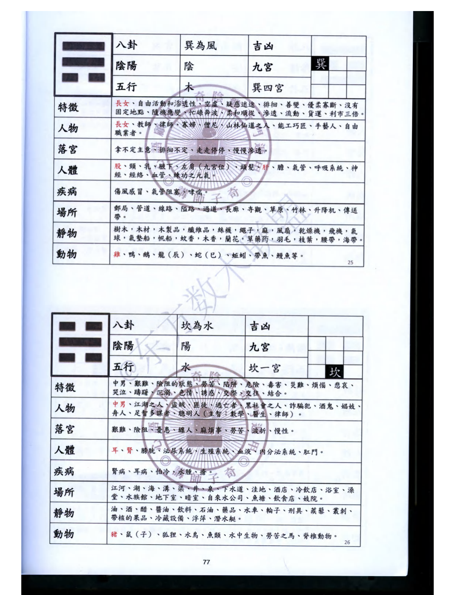

> **🖼 圖像解讀**　｜　檢視狀態：✅ 已檢視
> - **類型**：八卦類象表（中級班投影片 25–26）
> - **內容**：巽卦（巽為風、陰、木、巽四宮）與坎卦（坎為水、陽、水、坎一宮）詳細類象：巽主長女、自由活動與滲透、猶疑徘徊、流動貨運，落宮拿不定主意、走走停停，人體股、頸、左肩、肝膽、氣管呼吸系統；坎主中男、艱難險阻、勞苦陷阱、憂愁色情，落宮艱難險阻、纏人麻煩事、波折，人體耳、腎、膀胱泌尿生殖系統、血液。
> - **原文出處（逐字）**：巽卦類象表「巽為風／陰／木／巽四宮」；坎卦類象表「坎為水／陽／水／坎一宮」
> - **可檢索關鍵字**：巽卦, 巽四宮, 長女, 氣管呼吸, 坎卦, 坎一宮, 中男, 腎耳泌尿

**📝 逐字謄寫（第 79 頁）**

### 巽卦類象表（投影片 25）

| 項目 | 內容 |
|---|---|
| 八卦／陰陽／五行／九宮 | 巽為風／陰／木／巽四宮 |
| 特徵 | 長女、自由活動和滲透性、空虛、疑惑迷途、徘徊、善變、優柔寡斷、沒有固定地點、隨機應變、忙碌奔波、柔和順從、滲透、流動、貨運、利市三倍。 |
| 人物 | 長女、教師、律師、寡婦、僧尼、山林仙道之人、能工巧匠、手藝人、自由職業者。 |
| 落宮 | 拿不定主意、徘徊不定、走走停停、慢慢滲透。 |
| 人體 | 股、頸、乳、腋下、左肩（九宮位）、頭髮、肝、膽、氣管、呼吸系統、神經、經絡、血管、練功之元氣。 |
| 疾病 | 傷風感冒、氣管阻塞、哮喘。 |
| 場所 | 郵局、管道、線路、隘路、過道、長廊、寺觀、草原、竹林、升降机、傳送帶。 |
| 靜物 | 樹木，木材，木製品，纖維品，絲襪，繩子，麻，風扇，乾燥機，飛機，氣球，氣墊船，帆船，蚊香，木香，蘭花，草藥药，羽毛，枝葉，腰帶，海帶。 |
| 動物 | 雞、鴨、鵝、龍（辰）、蛇（巳）、蚯蚓、帶魚、鰻魚等。 |

### 坎卦類象表（投影片 26）

| 項目 | 內容 |
|---|---|
| 八卦／陰陽／五行／九宮 | 坎為水／陽／水／坎一宮 |
| 特徵 | 中男、艱難、險阻的狀態，勞苦、陷阱、危險、毒害、災難、煩惱、悲哀、哭泣、躊躇、沉溺、色情、誘惑、交際、交往、結合。 |
| 人物 | 中男、江湖之人、盜賊、匪徒、逃亡者、黑社會之人、詐騙犯、酒鬼、娼妓、舟人、足智多謀者、聰明人（主智：數學、醫生、律師）。 |
| 落宮 | 艱難、險阻、憂患、纏人、麻煩事、勞苦、波折、慢性。 |
| 人體 | 耳、腎、膀胱、泌尿系統、生殖系統、血液、內分泌系統、肛門。 |
| 疾病 | 腎病、耳病、怕冷、水腫、痔。 |
| 場所 | 江河、湖、海、溝、渠、井、泉、下水道、洼地、酒店、冷飲店、浴室、澡堂、水族館、地下室、暗室、自來水公司、魚塘、飲食店、妓院。 |
| 靜物 | 油、酒、醋、醬油、飲料、石油、藥品、水車、輪子、刑具、蒺藜、叢刺、帶核的果品、冷藏設備、浮萍、潛水艇。 |
| 動物 | 豬、鼠（子）、狐狸、水鳥、魚類、水中生物、勞苦之馬、脊椎動物。 |

（頁碼：77）

## 圖 80 — 第 80 頁（1240x1617）｜🖼 圖片（開圖判斷：圖表細看／裝飾照簡述）

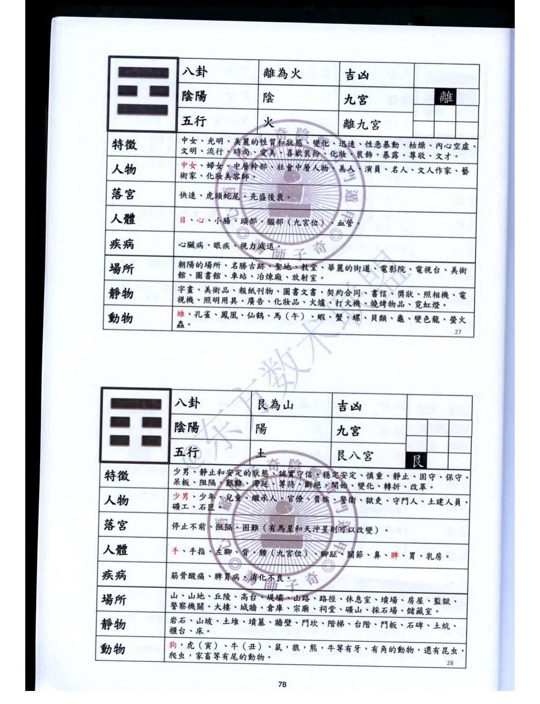

> **🖼 圖像解讀**　｜　檢視狀態：✅ 已檢視
> - **類型**：八卦類象表（中級班投影片 27–28）
> - **內容**：離卦（離為火、陰、火、離九宮）與艮卦（艮為山、陽、土、艮八宮）詳細類象：離主中女、光明美麗、文明時尚、愛美裝扮，落宮快速、虎頭蛇尾、先盛後衰，人體目、心、小腸、頭腦、血管；艮主少男、靜止安定、誠實守信、保守阻隔，落宮停止不前、阻隔困難（有馬星和天沖星則可改變），人體手、手指、左腳、背、腰、脾胃、鼻。
> - **原文出處（逐字）**：離卦類象表「離為火／陰／火／離九宮」；艮卦類象表「艮為山／陽／土／艮八宮」
> - **可檢索關鍵字**：離卦, 離九宮, 中女, 目心血管, 艮卦, 艮八宮, 少男, 手背脾胃

**📝 逐字謄寫（第 80 頁）**

### 離卦類象表（投影片 27）

| 項目 | 內容 |
|---|---|
| 八卦／陰陽／五行／九宮 | 離為火／陰／火／離九宮 |
| 特徵 | 中女、光明、美麗的性質和狀態、變化、迅速、性急暴動、枯燥、內心空虛、文明、流行、時尚、愛美、喜歡裝扮、化妝、裝飾、暴露、尊敬、文才。 |
| 人物 | 中女、婦女、中層幹部、社會中層人物、美人、演員、名人、文人作家、藝術家、化妝美容師。 |
| 落宮 | 快速、虎頭蛇尾、先盛後衰。 |
| 人體 | 目、心、小腸、頭部、腦部（九宮位）、血管。 |
| 疾病 | 心臟病、眼疾、視力減退。 |
| 場所 | 朝陽的場所、名勝古跡、聖地、教堂、華麗的街道、電影院、電視台、美術館、圖書館、車站、冶煉廠、放射室。 |
| 靜物 | 字畫、美術品、報紙刊物、圖書文書、契約合同、書信、獎狀、照相機、電視機、照明用具、廣告、化妝品、火爐、打火機、燒烤物品、霓虹燈。 |
| 動物 | 雉、孔雀、鳳凰、仙鶴、馬（午）、蝦、蟹、螺、貝類、龜、變色龍、螢火蟲。 |

### 艮卦類象表（投影片 28）

| 項目 | 內容 |
|---|---|
| 八卦／陰陽／五行／九宮 | 艮為山／陽／土／艮八宮 |
| 特徵 | 少男、靜止和安定的狀態、誠實守信、穩定安定、慎重、靜止、固守、保守、呆板、阻隔、艱難、滯延、等待、斷絕、開始、變化、轉折、改革。 |
| 人物 | 少男、少年、兒童、繼承人、官僚、貴族、警衛、獄吏、守門人、土建人員、礦工、石匠。 |
| 落宮 | 停止不前、阻隔、困難（有馬星和天沖星則可以改變）。 |
| 人體 | 手、手指、左腳、背、腰（九宮位）、腳趾、關節、鼻、脾、胃、乳房。 |
| 疾病 | 筋骨酸痛、脾胃病、消化不良。 |
| 場所 | 山、山地、丘陵、高台、堤壩、山路、路徑、休息室、墳場、房屋、監獄、警察機關、大樓、城牆、倉庫、宗廟、祠堂、礦山、採石場、儲藏室。 |
| 靜物 | 岩石、山坡、土堆、墳墓、牆壁、門坎、階梯、台階、門板、石碑、土炕、櫃台、床。 |
| 動物 | 狗，虎（寅）、牛（丑）、鼠，狼，熊，牛等有牙，有角的動物，還有昆虫，爬虫，家畜等有尾的動物。 |

（頁碼：78）

## 圖 81 — 第 81 頁（1240x1617）｜🖼 圖片（開圖判斷：圖表細看／裝飾照簡述）

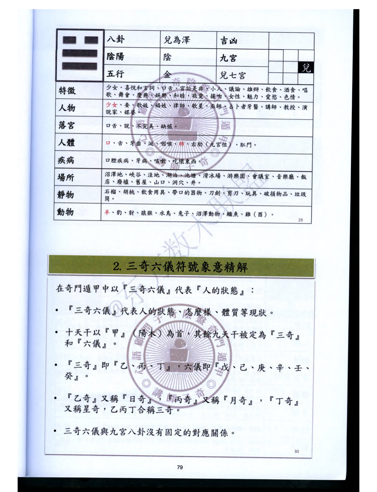

> **🖼 圖像解讀**　｜　檢視狀態：✅ 已檢視
> - **類型**：八卦類象表＋文字頁（中級班投影片 29–30）
> - **內容**：兌卦（兌為澤、陰、金、兌七宮）詳細類象：少女、喜悅言詞、口舌官訟、飲食娛樂、愛慾色情，落宮口舌、說、不完美、缺憾，人體口、舌、牙齒、咽喉、肺、右肋；接著第二節「三奇六儀符號象意精解」開場：以三奇六儀代表「人的狀態」（怎麼樣、體質等現狀），甲隱、乙丙丁為日月星三奇、戊己庚辛壬癸為六儀，與九宮八卦無固定對應。
> - **原文出處（逐字）**：兌卦類象表「兌為澤／陰／金／兌七宮」；2. 三奇六儀符號象意精解
> - **可檢索關鍵字**：兌卦, 兌七宮, 少女, 口舌官訟, 口肺咽喉, 三奇六儀精解, 人的狀態, 日月星三奇

**📝 逐字謄寫（第 81 頁）**

### 兌卦類象表（投影片 29）

| 項目 | 內容 |
|---|---|
| 八卦／陰陽／五行／九宮 | 兌為澤／陰／金／兌七宮 |
| 特徵 | 少女、喜悅和言詞、口舌、官訟是非、小人、議論、雄辯、飲食、酒食、唱歌、舞會、慶典、娛樂、和睦、敬愛、接吻、女性、魅力、愛慾、色情。 |
| 人物 | 少女、妾、歌妓、娼妓、律師、歌星、巫師、占卜者牙醫、講師、教授、演說家、媒婆。 |
| 落宮 | 口舌、說、不完美、缺憾。 |
| 人體 | 口、舌、牙齒、涎、咽喉、肺、右肋（九宮位）、肛門。 |
| 疾病 | 口腔疾病、牙病、咳嗽、吃壞東西。 |
| 場所 | 沼澤地、峽谷、洼地、湖泊、池塘、滑冰場、遊樂園、會議室、音樂廳、飯店、廢墟、舊屋、山口、洞穴、井。 |
| 靜物 | 石榴、胡桃、飲食用具、帶口的器物、刀劍、剪刀、玩具、破損物品、垃圾筒。 |
| 動物 | 羊、豹、豺、猿猴、水鳥、兔子、沼澤動物、鱷魚、雞（酉）。 |

### 2. 三奇六儀符號象意精解（投影片 30）

在奇門遁甲中以『三奇六儀』代表『人的狀態』：

- 『三奇六儀』代表人的狀態、怎麼樣、體質等現狀。
- 十天干以『甲』（陽木）為首，其餘九天干被定為『三奇』和『六儀』。
- 『三奇』即『乙、丙、丁』，六儀即『戊、己、庚、辛、壬、癸』。
- 『乙奇』又稱『日奇』，『丙奇』又稱『月奇』，『丁奇』又稱星奇，乙丙丁合稱三奇。
- 三奇六儀與九宮八卦沒有固定的對應關係。

（頁碼：79）

## 圖 82 — 第 82 頁（1240x1617）｜🖼 圖片（開圖判斷：圖表細看／裝飾照簡述）

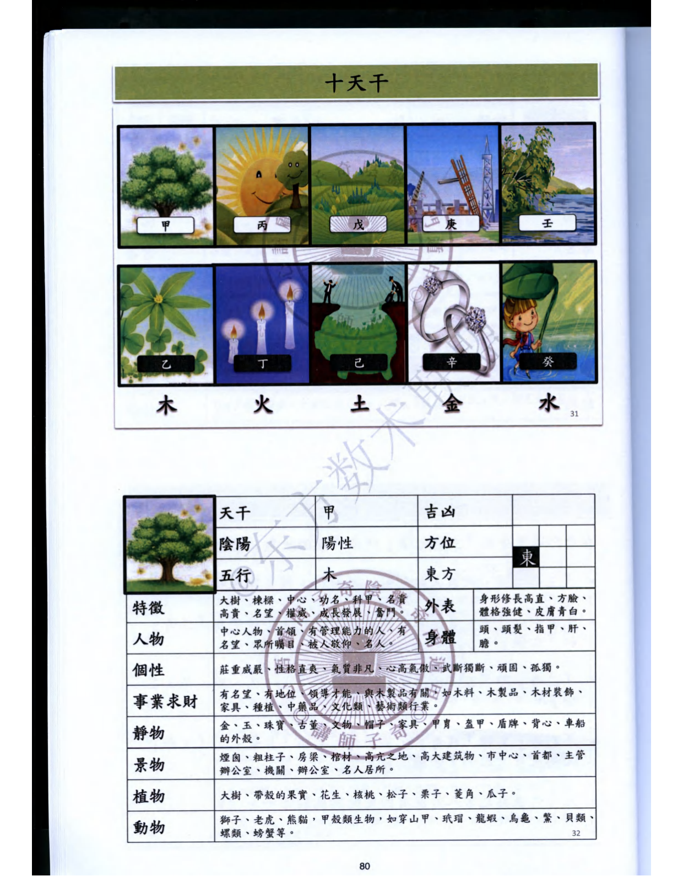

> **🖼 圖像解讀**　｜　檢視狀態：✅ 已檢視
> - **類型**：十天干圖卡＋天干類象表（中級班投影片 31–32）
> - **內容**：投影片 31 十天干意象圖卡（同初級班第 34 頁：甲大樹、丙太陽、戊山野、庚鋼鐵建物、壬江河／乙花草、丁燭火、己田園、辛珠寶、癸雨露，依木火土金水分欄）；投影片 32 天干「甲」類象表（陽性、木、東方）：特徵大樹棟樑、中心功名名望權威，外表身形修長高直，人物首領名人，身體頭髮指甲肝膽，個性莊重威嚴、心高氣傲、武斷頑固孤獨，事業與木製品家具種植中藥文化藝術相關。
> - **原文出處（逐字）**：十天干；天干類象表「天干 甲／陰陽 陽性／五行 木／方位 東方」
> - **可檢索關鍵字**：十天干圖卡, 甲木, 棟樑, 首領名人, 肝膽頭髮, 莊重威嚴, 木製品家具, 天干類象

**📝 逐字謄寫（第 82 頁）**

### 十天干（投影片 31）

| 五行 | 木 | 火 | 土 | 金 | 水 |
|---|---|---|---|---|---|
| 陽干 | 甲：大樹 | 丙：笑臉太陽 | 戊：山丘大地 | 庚：鐵塔閘門 | 壬：江河湖水 |
| 陰干 | 乙：花草 | 丁：燭火 | 己：田園耕地 | 辛：鑽石戒指 | 癸：雨中撐葉的孩子 |

### 天干「甲」類象表（投影片 32）

（左上配大樹圖；右上小九宮標「東」）

| 項目 | 內容 |
|---|---|
| 天干／陰陽／五行／方位 | 甲／陽性／木／東方 |
| 吉凶 | （空白） |
| 特徵 | 大樹、棟樑、中心、功名、科甲、名貴高貴、名望、權威、成長發展、奮鬥。 |
| 外表 | 身形修長高直、方臉、體格強健、皮膚青白。 |
| 人物 | 中心人物、首領、有管理能力的人、有名望、眾所矚目、被人敬仰、名人。 |
| 身體 | 頭、頭髮、指甲、肝、膽。 |
| 個性 | 莊重威嚴、性格直爽、氣質非凡、心高氣傲、武斷獨斷、頑固、孤獨。 |
| 事業求財 | 有名望、有地位、領導才能、與木製品有關：如木料、木製品、木材裝飾、家具、種植、中藥品、文化類、藝術類行業。 |
| 靜物 | 金、玉、珠寶、古董、文物、帽子、家具、甲胄、盔甲、盾牌、背心、車船的外殼。 |
| 景物 | 煙囪、粗柱子、房梁、棺材、高亢之地、高大建築物、市中心、首都、主管辦公室、機關、辦公室、名人居所。 |
| 植物 | 大樹、帶殼的果實、花生、核桃、松子、栗子、菱角、瓜子。 |
| 動物 | 獅子、老虎、熊貓，甲殼類生物，如穿山甲、玳瑁、龍蝦、烏龜、鱉、貝類、螺類、螃蟹等。 |

（頁碼：80）

## 圖 83 — 第 83 頁（1240x1617）｜🖼 圖片（開圖判斷：圖表細看／裝飾照簡述）

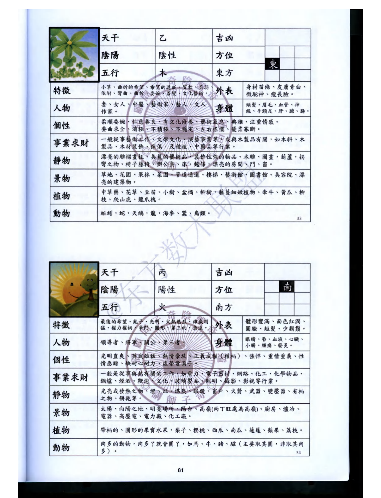

> **🖼 圖像解讀**　｜　檢視狀態：✅ 已檢視
> - **類型**：天干類象表（中級班投影片 33–34）
> - **內容**：天干「乙」（陰性、木、東方）：小草、曲折的希望、柔弱依附、委婉善變、文化藝術，人物妻女、中醫、藝術家文人，個性柔順委婉、仁慈、優柔寡斷，身體頭髮眉毛血管神經肝膽；天干「丙」（陽性、火、南方）：最後的希望、亂子、光明火熱、權力權柄、爭鬥、第三的、急速，人物領導者將軍第三者，個性光明直爽、英武熱情、性急躁、愛面子，身體眼睛唇血液心臟小腸。
> - **原文出處（逐字）**：天干類象表「乙／陰性／木／東方」；「丙／陽性／火／南方」
> - **可檢索關鍵字**：天干乙, 乙木, 柔弱依附, 文化藝術, 天干丙, 丙火, 權柄亂子, 第三者

**📝 逐字謄寫（第 83 頁）**

### 天干「乙」類象表（投影片 33）

（配花草圖；小九宮標「東」）

| 項目 | 內容 |
|---|---|
| 天干／陰陽／五行／方位 | 乙／陰性／木／東方 |
| 特徵 | 小草、曲折的希望、希望的達成、質軟、柔弱、依附、彎曲、曲折、委婉、善變、文化藝術。 |
| 外表 | 身材苗條、皮膚青白、微駝神、瘦長臉。 |
| 人物 | 妻、女人、中醫、藝術家、藝人、文人、作家。 |
| 身體 | 頭髮、眉毛、血管、神經、手頸足、肝、膽、腸。 |
| 個性 | 柔順委婉、仁慈善良、有文化修養、藝術氣息、典雅、注重情感。委曲求全、消極、不積極、不穩定、左右搖擺、優柔寡斷。 |
| 事業求財 | 一般從事藝術工作、文學文化、演藝事業等，或與木製品有關，如木料、木製品、木材裝飾、傢俱，及種植、中藥品等行業。 |
| 靜物 | 漂亮的雕樑畫柱、美麗的藝術品、裝飾性強的物品、木雕、圖畫，葫蘆，拐彎之物、椅子藤椅、辦公桌、床、麵條，漂亮的房間、門、窗。 |
| 景物 | 草地、花園、果林、菜園、管道通道、樓梯、藝術館、圖書館、美容院、漂亮的建築物。 |
| 植物 | 中草藥、花草、豆苗、小樹、盆摘、柳樹，藤蔓細嫩植物、牽牛、黃瓜、柳枝、爬山虎、龍爪槐。 |
| 動物 | 蚯蚓，蛇，天鵝，龍，海參、蠶、鳥類。 |

### 天干「丙」類象表（投影片 34）

（配笑臉太陽圖；小九宮標「南」）

| 項目 | 內容 |
|---|---|
| 天干／陰陽／五行／方位 | 丙／陽性／火／南方 |
| 特徵 | 最後的希望、亂子、光明、火熱熱烈、雄威剛猛、權力權柄、爭鬥、圓形、第三的、急速。 |
| 外表 | 體形豐滿、面色紅潤、圓臉、短髮、少鬍鬚。 |
| 人物 | 領導者、將軍、關公、第三者。 |
| 身體 | 眼睛、唇、血液、心臟、小腸、腫痛、發炎。 |
| 個性 | 光明直爽、英武雄猛、熱情豪放、正義威權（權柄）、強悍、重情重義、性情急躁、缺耐心耐力、虛榮愛面子。 |
| 事業求財 | 一般是從事與熱有關的工作，如電力、電子器材、網路、化工、化學物品、鍋爐、煙酒、鞭炮、文化、玻璃製品、照明、攝影、影視等行業。 |
| 靜物 | 光亮或發熱之物、燈、灶、煤炭、眼鏡、窗戶、火箭、武器、變壓器、有柄之物、餅乾等。 |
| 景物 | 太陽、向陽之地、明亮場所、陽台、高嶺(丙丁旺處為高嶺)、廚房、爐冶、電器、高壓電、電力廠、化工廠。 |
| 植物 | 帶柄的、圓形的果實水果，梨子、櫻桃、西瓜、南瓜、蓮蓬、蘋果、荔枝。 |
| 動物 | 肉多的動物，肉多了就會圓了，如馬、牛、豬、驢（主要取其圓，非取其肉多）。 |

（頁碼：81）

## 圖 84 — 第 84 頁（1240x1617）｜🖼 圖片（開圖判斷：圖表細看／裝飾照簡述）

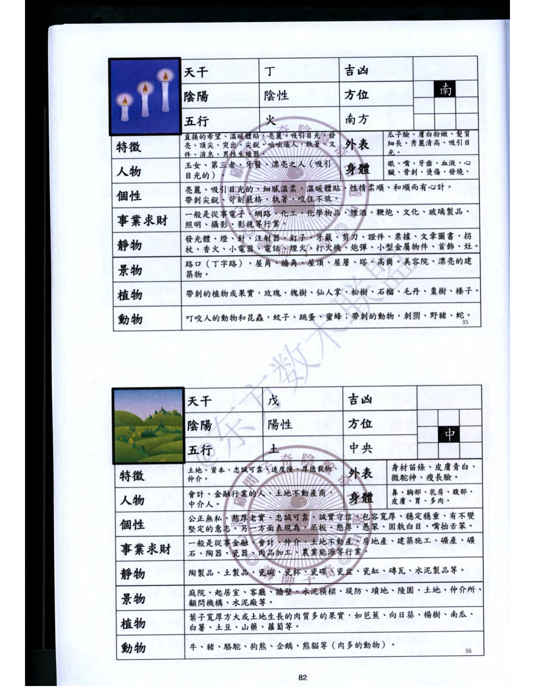

> **🖼 圖像解讀**　｜　檢視狀態：✅ 已檢視
> - **類型**：天干類象表（中級班投影片 35–36）
> - **內容**：天干「丁」（陰性、火、南方）：直接的希望、溫暖體貼、亮麗吸引目光、尖銳咄咄逼人、執著、文件消息，人物玉女第三者牙醫漂亮之人，個性溫柔細膩但帶刺尖銳、執著；天干「戊」（陽性、土、中央）完整類象：土地、資本、忠誠可靠、仲介，人物會計金融業土地不動產商，個性公正無私憨厚老實，事業金融會計仲介房地產建築礦產陶瓷等（可補足初級班第 6 頁被遮蔽的戊類象表）。
> - **原文出處（逐字）**：天干類象表「丁／陰性／火／南方」；「戊／陽性／土／中央」
> - **可檢索關鍵字**：天干丁, 丁火, 溫暖體貼, 尖銳執著, 天干戊, 戊土, 資本仲介, 房地產

**📝 逐字謄寫（第 84 頁）**

### 天干「丁」類象表（投影片 35）

（配燭火圖；小九宮標「南」）

| 項目 | 內容 |
|---|---|
| 天干／陰陽／五行／方位 | 丁／陰性／火／南方 |
| 特徵 | 直接的希望、溫暖體貼、亮麗、吸引目光、發亮、頂尖、突出、尖銳、咄咄逼人、執著、文件、消息、男性生殖器。 |
| 外表 | 瓜子臉、膚白粉嫩、髮質細長、秀麗清高、吸引目光。 |
| 人物 | 玉女、第三者、牙醫、漂亮之人（吸引目光的）。 |
| 身體 | 眼、嘴、牙齒、血液、心臟、骨刺、燙傷、發燒。 |
| 個性 | 亮麗、吸引目光的、細膩溫柔、溫暖體貼、性情柔順、和順而有心計。帶刺尖銳、苛刻嚴格、執著、咬住不放。 |
| 事業求財 | 一般是從事電子、網路、化工、化學物品、煙酒、鞭炮、文化、玻璃製品、照明、攝影、影視等行業。 |
| 靜物 | 發光體、燈、針、注射器、釘子、牙籤、剪刀、證件、票據、文章圖書、拐杖、香火、小電器、電話、煙火、打火機、炮彈、小型金屬物件、首飾、灶。 |
| 景物 | 路口（丁字路）、屋角、牆角、屋頂、屋簷、塔、高崗、美容院、漂亮的建築物。 |
| 植物 | 帶刺的植物或果實，玫瑰、槐樹、仙人掌、松樹、石榴、毛丹、棗樹、榛子。 |
| 動物 | 叮咬人的動物和昆蟲，蚊子、跳蚤、蜜蜂；帶刺的動物，刺猬、野豬、蛇。 |

### 天干「戊」類象表（投影片 36）

（配山丘圖；小九宮標「中」）

| 項目 | 內容 |
|---|---|
| 天干／陰陽／五行／方位 | 戊／陽性／土／中央 |
| 特徵 | 土地、資本、忠誠可靠、速度慢、厚德載物、仲介。 |
| 外表 | 身材苗條、皮膚青白、微駝神、瘦長臉。 |
| 人物 | 會計、金融行業的人、土地不動產商、中介人。 |
| 身體 | 鼻、胸部、乳房、腹部、皮膚、胃、多肉。 |
| 個性 | 公正無私、憨厚老實、忠誠可靠、誠實守信、包容寬厚、穩定穩重、有不變堅定的意志。另一方面表現為，呆板、憨厚、愚笨、固執白目、嘴拙舌笨。 |
| 事業求財 | 一般是從事金融、會計、仲介、土地不動產、房地產、建築施工、礦產、礦石、陶器、瓷器、肉品加工、農業能源等行業。 |
| 靜物 | 陶製品、土製品、瓷碗、瓷杯、瓷碟、瓷盆、瓷缸、磚瓦、水泥製品等。 |
| 景物 | 庭院、起居室、客廳、牆壁、水泥橫樑、堤防、墳地、陵園、土地、仲介所、顧問機構、水泥廠等。 |
| 植物 | 葉子寬厚方大或土地生長的肉質多的果實，如芭蕉、向日葵、楊樹、南瓜、白薯、土豆、山藥、蘿蔔等。 |
| 動物 | 牛、豬、駱駝、狗熊、企鵝、熊貓等（肉多的動物）。 |

（註：戊的「外表」欄原文與乙相同，照錄。頁碼：82）

## 圖 85 — 第 85 頁（1240x1617）｜🖼 圖片（開圖判斷：圖表細看／裝飾照簡述）

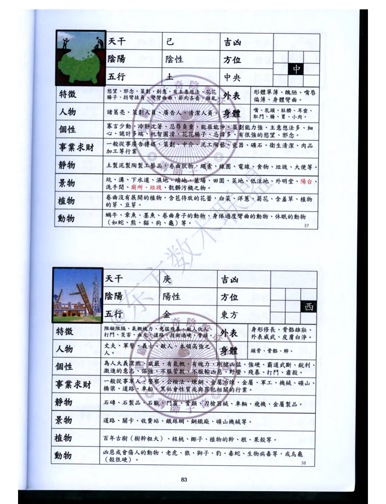

> **🖼 圖像解讀**　｜　檢視狀態：✅ 已檢視
> - **類型**：天干類象表（中級班投影片 37–38）
> - **內容**：天干「己」（陰性、土、中央）：慾望邪念、策劃創意、主意想法、花花腸子、拐彎抹角、節約吝嗇、雜亂，人物諸葛亮、策劃人員、廣告人、清潔人員，景物坑溝下水道、墳地、廁所垃圾骯髒之物；天干「庚」（陽性、金，原表方位印「東方」但小九宮標「西」）：阻礙阻隔、氣概魄力、兇猛殘暴、敵人仇人、打鬥災害血光、道路、技術過硬，人物丈夫軍警義士敵人，事業軍人警察公檢法煉鋼金屬機械礦山橋樑道路。
> - **原文出處（逐字）**：天干類象表「己／陰性／土／中央」；「庚／陽性／金／東方（小九宮標西）」
> - **可檢索關鍵字**：天干己, 己土, 慾望策劃, 花花腸子, 天干庚, 庚金, 阻隔敵人, 打鬥血光

**📝 逐字謄寫（第 85 頁）**

### 天干「己」類象表（投影片 37）

（配田園圖；小九宮標「中」）

| 項目 | 內容 |
|---|---|
| 天干／陰陽／五行／方位 | 己／陰性／土／中央 |
| 特徵 | 慾望、邪念、策劃、創意、有主意想法、花花腸子、拐彎抹角、彎彎曲曲、節約吝嗇、雜亂。 |
| 外表 | 形體單薄、醜陋、嘴唇偏薄、身體彎曲。 |
| 人物 | 諸葛亮、策劃人員、廣告人、清潔人員。 |
| 身體 | 嘴、乳頭、肚臍、耳垂、肛門、腸、胃、小肉。 |
| 個性 | 寡言少動、冷靜沈著、忍辱負重、能屈能伸。策劃能力強、主意想法多、細心、詭計多端、机智圓滑、花花腸子、忌諱多、有很強的慾望、邪念。 |
| 事業求財 | 一般從事廣告傳媒、策劃、中介、泥工陶藝、瓷器、礦石、衛生清潔、肉品加工等行業 |
| 靜物 | 土製泥製陶製工藝品，卷曲狀物，繩索、線團、電線、食物、垃圾、大便等。 |
| 景物 | 坑、溝、下水道、濕地、墳地、墓場、田園、菜地、低洼地、外明堂、陽台、洗手間、廁所、垃圾、骯髒污穢之物。 |
| 植物 | 卷曲沒有展開的植物，含苞待放的花蕾，白菜、洋蔥、菊花、含羞草、植物的芽、豆芽。 |
| 動物 | 蝸牛、章魚、墨魚、卷曲身子的動物、身体過度彎曲的動物、休眠的動物（如蛇、熊、貓、狗、龜）等。 |

### 天干「庚」類象表（投影片 38）

（配鐵塔閘門圖；小九宮標「西」）

| 項目 | 內容 |
|---|---|
| 天干／陰陽／五行／方位 | 庚／陽性／金／東方（原文如此；小九宮標「西」） |
| 特徵 | 阻礙阻隔、氣概魄力、兇猛殘暴、敵人仇人、打鬥、災害、血光、道路、技術過硬、骨頭。 |
| 外表 | 身形修長、骨骼雄壯、外表威武、皮膚白淨。 |
| 人物 | 丈夫、軍警、義士、敵人、本領高強之人。 |
| 身體 | 頭骨、骨骼、肺。 |
| 個性 | 為人大義凜然、威嚴、有氣概、有魄力、剛健凶猛、強硬、霸道武斷、銳利、激進的意志、倔強、不服管教、不服輸凶惡、野蠻、殘暴、打鬥、肅殺。 |
| 事業求財 | 一般從事軍人、警察、公檢法、煉鋼、金屬冶煉、金屬、軍工、機械、礦山、橋梁、道路、車船、黑社會性質或與罪犯相關的行業。 |
| 靜物 | 石碑、石製品、石獸、門窗、骨頭、刀槍器械、車輛、飛機、金屬製品。 |
| 景物 | 道路、關卡、收費站、鐵絲網、鋼鐵廠、礦山機械等。 |
| 植物 | 百年古樹（樹幹粗大）、核桃、椰子、植物的幹、根、果殼等。 |
| 動物 | 凶惡或會傷人的動物，老虎、狼、獅子、豹、毒蛇、生物病毒等，或烏龜（殼很硬）。 |

（頁碼：83）

## 圖 86 — 第 86 頁（1240x1617）｜🖼 圖片（開圖判斷：圖表細看／裝飾照簡述）

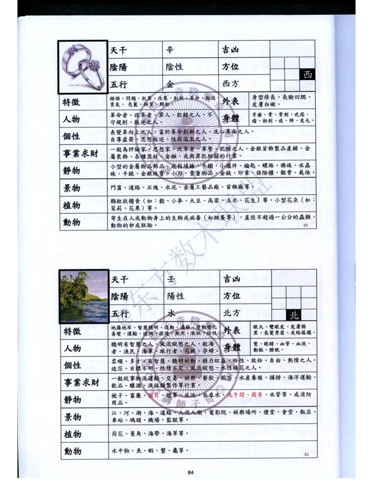

> **🖼 圖像解讀**　｜　檢視狀態：✅ 已檢視
> - **類型**：天干類象表（中級班投影片 39–40）
> - **內容**：天干「辛」（陰性、金、西方）：錯誤、問題、犯罪、改革創新革命、叛逆、貴氣亮麗、顆粒，人物革命者改革者罪人犯錯之人，事業評論家思想家金銀首飾金融；天干「壬」（陽性、水、北方）：天羅地網、智慧聰明、流動遷移、變動變化、運輸、迷惘困境、任性，人物聰明有智慧之人、風流縱慾之人、航海者漁民旅行者司機孕婦，事業物流運輸交易娛樂餐飲水產。
> - **原文出處（逐字）**：天干類象表「辛／陰性／金／西方」；「壬／陽性／水／北方」
> - **可檢索關鍵字**：天干辛, 辛金, 錯誤犯罪, 改革叛逆, 天干壬, 壬水, 流動變動, 天羅地網

**📝 逐字謄寫（第 86 頁）**

### 天干「辛」類象表（投影片 39）

（配鑽石戒指圖；小九宮標「西」）

| 項目 | 內容 |
|---|---|
| 天干／陰陽／五行／方位 | 辛／陰性／金／西方 |
| 特徵 | 錯誤、問題、犯罪、改革、創新、革命、叛逆、貴氣、亮麗、物質、顆粒。 |
| 外表 | 身型修長、長臉凹腮、皮膚白嫩。 |
| 人物 | 革命者、改革者、罪人、犯錯之人、不守規則、叛逆之人。 |
| 身體 | 牙齒、骨、骨刺、疙瘩、瘤、粉刺、痘、肺、皮毛。 |
| 個性 | 表變革向上之人、富於革命創新之人、洗心革面之人。自尊虛榮、思想叛逆、性格偏激之人。 |
| 事業求財 | 一般為評論家、思想家、改革者、軍警、犯錯之人、金銀首飾製品產銷、金屬裝飾、各種器材、金融、或與罪犯相關的行業。 |
| 靜物 | 小型的金屬物品飾品，戒指項鍊、手鐲、小擺件、鑰匙、螺絲、佛珠、水晶珠、手錶、金銀珠寶、小刀、貴重物品、金錢、印章、保險櫃、骸骨、屍体。 |
| 景物 | 門窗、道路、石塊、水泥、金屬工藝品廠、首飾廠等。 |
| 植物 | 顆粒狀糧食（如：穀、小麥、大豆、高粱、玉米、花生）等，小型花朵（如：茉莉、花果）等。 |
| 動物 | 寄生在人或動物身上的生物或病毒（如跳蚤等），直徑不超過一公分的蟲類，動物的卵或胚胎。 |

### 天干「壬」類象表（投影片 40）

（配江河圖；小九宮標「北」）

| 項目 | 內容 |
|---|---|
| 天干／陰陽／五行／方位 | 壬／陽性／水／北方 |
| 特徵 | 地羅地牢、智慧聰明、流動、遷移、變動變化、善變、運輸、迷惘、困境、熱烈、放任、任性。 |
| 外表 | 眼大、雙眼皮、皮膚稍黑、長髮秀眉、走路搖擺。 |
| 人物 | 聰明有智慧之人、風流縱慾之人、航海者、漁民、海軍、旅行者、司機、孕婦。 |
| 身體 | 髮、眼睛、血管、血液、動脈、膀胱。 |
| 個性 | 柔順、多才、有智慧、聰明好動、精力旺盛、任性、放任、自由、熱情之人。迷茫、目標不明、性情不定、風流縱慾、水性楊花之人。 |
| 事業求財 | 一般從事物流運輸、交易、娛樂、餐飲、飯店、水產養殖、捕撈、海洋運輸、飲品、釀酒、液体類製作等行業。 |
| 靜物 | 被子、窗簾、圖片、燈罩、水池、自來水、洗手間、廚房、水管等、或消防用品。 |
| 景物 | 江、河、湖、海、道路、人流人潮、電影院、娛樂場所、禮堂、會堂、飯店、車站、碼頭、機場、監獄等。 |
| 植物 | 荷花、菱角、海帶、海草等。 |
| 動物 | 水中物、魚、蝦、蟹、龜等。 |

（註：壬「特徵」首詞放大確認原文為「地羅地牢」；初級班十天干意涵表則作「困（天羅）」。頁碼：84）

## 圖 87 — 第 87 頁（1240x1617）｜🖼 圖片（開圖判斷：圖表細看／裝飾照簡述）

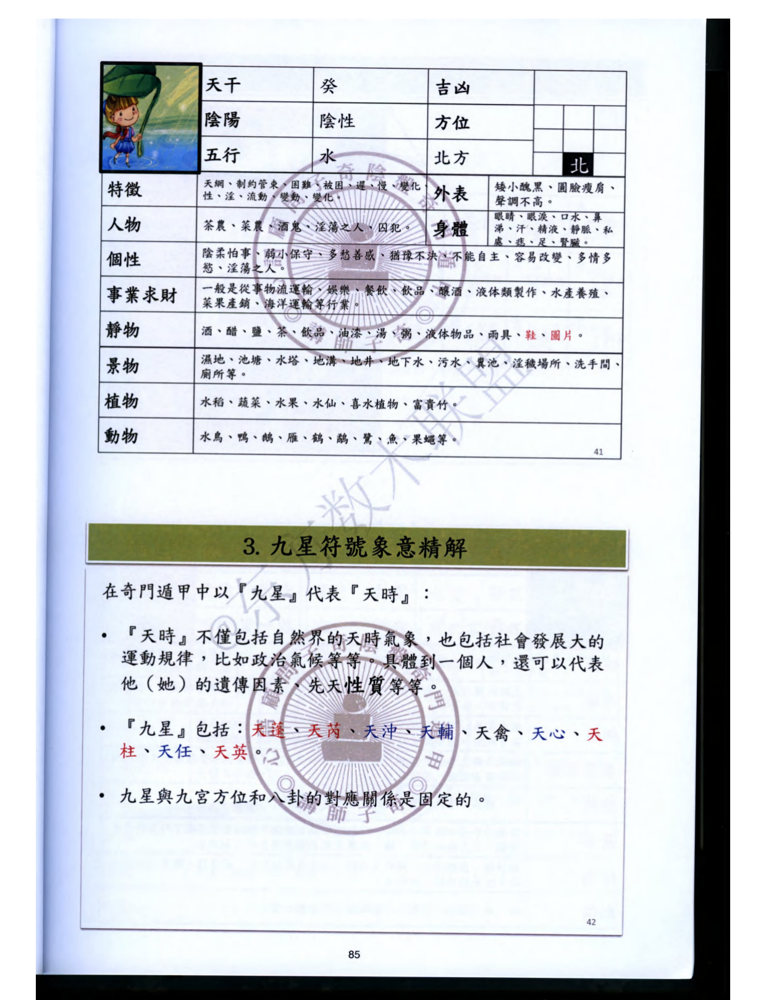

> **🖼 圖像解讀**　｜　檢視狀態：✅ 已檢視
> - **類型**：天干類象表＋文字頁（中級班投影片 41–42）
> - **內容**：天干「癸」（陰性、水、北方）：天網、制約管束、困難被困、遲慢、變化、性、淫、流動，人物茶農菜農酒鬼淫蕩之人囚犯，個性陰柔怕事、弱小保守、多愁善感、猶豫不決，景物濕地池塘地溝地下水污水洗手間廁所；接著第三節「九星符號象意精解」開場：九星代表「天時」（自然與社會大運動規律、個人遺傳與先天性質），九星為天蓬、天芮、天沖、天輔、天禽、天心、天柱、天任、天英，與九宮八卦對應固定。
> - **原文出處（逐字）**：天干類象表「癸／陰性／水／北方」；3. 九星符號象意精解
> - **可檢索關鍵字**：天干癸, 癸水, 天網制約, 被困遲慢, 多愁善感, 九星精解, 天時, 先天性質

**📝 逐字謄寫（第 87 頁）**

### 天干「癸」類象表（投影片 41）

（配雨中孩子圖；小九宮標「北」）

| 項目 | 內容 |
|---|---|
| 天干／陰陽／五行／方位 | 癸／陰性／水／北方 |
| 特徵 | 天網、制約管束、困難、被困、遲、慢、變化、性、淫、流動、變動、變化。 |
| 外表 | 矮小醜黑、圓臉瘦肩、聲調不高。 |
| 人物 | 茶農、菜農、酒鬼、淫蕩之人、囚犯。 |
| 身體 | 眼睛、眼淚、口水、鼻涕、汗、精液、靜脈、私處、痣、足、腎臟。 |
| 個性 | 陰柔怕事、弱小保守、多愁善感、猶豫不決、不能自主、容易改變、多情多慾、淫蕩之人。 |
| 事業求財 | 一般是從事物流運輸、娛樂、餐飲、飲品、釀酒、液体類製作、水產養殖、菜果產銷、海洋運輸等行業。 |
| 靜物 | 酒、醋、鹽、茶、飲品、油漆、湯、粥、液体物品、雨具、鞋、圖片。 |
| 景物 | 濕地、池塘、水塔、地溝、地井、地下水、污水、糞池、淫穢場所、洗手間、廁所等。 |
| 植物 | 水稻、蔬菜、水果、水仙、喜水植物、富貴竹。 |
| 動物 | 水鳥、鴨、鵝、雁、鶴、鷗、鷺、魚、果蠅等。 |

### 3. 九星符號象意精解（投影片 42）

在奇門遁甲中以『九星』代表『天時』：

- 『天時』不僅包括自然界的天時氣象，也包括社會發展大的運動規律，比如政治氣候等等。具體到一個人，還可以代表他（她）的遺傳因素、先天**性質**等等。
- 『九星』包括：天蓬、天芮、天沖、天輔、天禽、天心、天柱、天任、天英。
- 九星與九宮方位和八卦的對應關係是固定的。

（頁碼：85）

## 圖 88 — 第 88 頁（1240x1617）｜🖼 圖片（開圖判斷：圖表細看／裝飾照簡述）

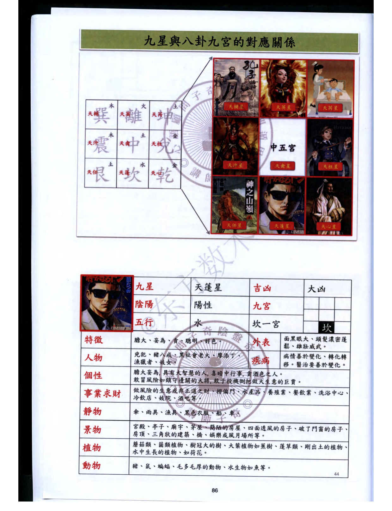

> **🖼 圖像解讀**　｜　檢視狀態：✅ 已檢視
> - **類型**：九宮圖＋人物圖卡＋九星類象表（中級班投影片 43–44）
> - **內容**：投影片 43「九星與八卦九宮的對應關係」：九星原宮九宮圖（輔巽、英離、芮坤、沖震、禽中、柱兌、任艮、蓬坎、心乾）與九星人物圖卡；投影片 44 為天蓬星完整類象表（陽性、水、坎一宮、大凶）：特徵膽大妄為貪聰明好色，外表面黑眼大頭髮濃密，人物兇犯黑社會老大漁獵者，疾病病情善變、醫治要善於變化，事業風險或非正道之財、水產餐飲洗浴，並補足初級班第 7 頁被遮住的欄位。
> - **原文出處（逐字）**：九星與八卦九宮的對應關係；九星類象表「天蓬星／陽性／水／坎一宮／大凶」
> - **可檢索關鍵字**：九星原宮, 九星人物圖卡, 天蓬星, 坎一宮, 大凶, 膽大妄為, 黑社會, 非正道之財

**📝 逐字謄寫（第 88 頁）**

### 九星與八卦九宮的對應關係（投影片 43）

| 巽（木）：天輔 | 離（火）：天英 | 坤（土）：天芮 |
|---|---|---|
| **震（木）：天沖** | **中（土）：天禽** | **兌（金）：天柱** |
| **艮（土）：天任** | **坎（水）：天蓬** | **乾（金）：天心** |

右側九星人物圖卡（同初級班第 36 頁）：天輔星（孔子封面）、天英星（火焰女郎）、天芮星（護士與病童）／天沖星（武士）、中五宮天禽星、天柱星（女軍官）／天任星（登山者封面）、天蓬星（墨鏡男）、天心星（羽扇軍師）。

### 天蓬星類象表（投影片 44）

| 項目 | 內容 |
|---|---|
| 九星／陰陽／五行／九宮 | 天蓬星／陽性／水／坎一宮 |
| 吉凶 | 大凶 |
| 特徵 | 膽大、妄為、貪、聰明、好色。 |
| 外表 | 面黑眼大、頭髮濃密蓬鬆、雄壯威武。 |
| 人物 | 兇犯、豬八戒、黑社會老大、廖添丁、漁獵者、妓女。 |
| 疾病 | 病情善於變化、轉化轉移。醫治要善於變化。 |
| 個性 | 膽大妄為,具有大智慧的人,喜暗中行事,貪酒色之人。敢冒風險如鎮守邊關的大將,敢於投機倒把做大生意的巨賈。 |
| 事業求財 | 做風險的生意或非正道之財，撈偏門、水產品、養殖業、餐飲業、洗浴中心、冷飲店、妓院、酒吧等。 |
| 靜物 | 傘、雨具、漁具、黑色衣服、船、車。 |
| 景物 | 宮殿、亭子、廟宇、茅屋、簡陋的房屋、四面透風的房子、破了門窗的房子、房頂、三角狀的建築、橋、娛樂或風月場所等。 |
| 植物 | 蘑菇類、菌類植物、樹冠大的樹、大葉植物如蕉樹、蓬草類、剛出土的植物、水中生長的植物、如荷花。 |
| 動物 | 豬、鼠、蝙蝠、毛多毛厚的動物、水生物如魚等。 |

（頁碼：86）

## 圖 89 — 第 89 頁（1240x1617）｜🖼 圖片（開圖判斷：圖表細看／裝飾照簡述）

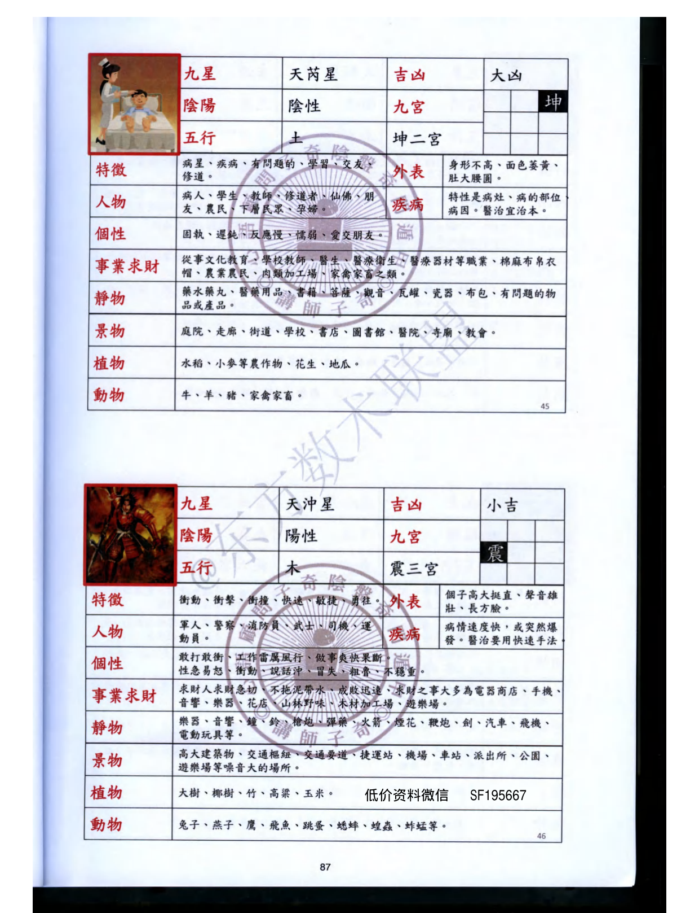

> **🖼 圖像解讀**　｜　檢視狀態：✅ 已檢視
> - **類型**：九星類象表（中級班投影片 45–46）
> - **內容**：天芮星（陰性、土、坤二宮、大凶）：病星、疾病、有問題、學習交友、修道，人物病人學生教師修道者農民孕婦，疾病特性是病灶、病的部位病因、醫治宜治本，事業文化教育醫療衛生；天沖星（陽性、木、震三宮、小吉）：衝動衝擊、快速敏捷、勇往，人物軍警消防司機運動員，疾病病情速度快或突然爆發、醫治要用快速手法，事業電器樂器花店遊樂場。
> - **原文出處（逐字）**：九星類象表「天芮星／陰性／土／坤二宮／大凶」；「天沖星／陽性／木／震三宮／小吉」
> - **可檢索關鍵字**：天芮星, 病星, 醫治治本, 教育醫療, 天沖星, 衝動快速, 突然爆發, 小吉

**📝 逐字謄寫（第 89 頁）**

### 天芮星類象表（投影片 45）

| 項目 | 內容 |
|---|---|
| 九星／陰陽／五行／九宮 | 天芮星／陰性／土／坤二宮 |
| 吉凶 | 大凶 |
| 特徵 | 病星、疾病、有問題的、學習、交友、修道。 |
| 外表 | 身形不高、面色萎黃、肚大腰圓。 |
| 人物 | 病人、學生、教師、修道者、仙佛、朋友、農民、下層民眾、孕婦。 |
| 疾病 | 特性是病灶、病的部位、病因。醫治宜治本。 |
| 個性 | 固執、遲鈍、反應慢、懦弱、愛交朋友。 |
| 事業求財 | 從事文化教育、學校教師、醫生、醫療衛生、醫療器材等職業、棉麻布帛衣帽、農業農民、肉類加工場、家禽家畜之類。 |
| 靜物 | 藥水藥丸、醫藥用品、書籍、菩薩、觀音、瓦罐、瓷器、布包、有問題的物品或產品。 |
| 景物 | 庭院、走廊、街道、學校、書店、圖書館、醫院、寺廟、教會。 |
| 植物 | 水稻、小麥等農作物、花生、地瓜。 |
| 動物 | 牛、羊、豬、家禽家畜。 |

### 天沖星類象表（投影片 46）

| 項目 | 內容 |
|---|---|
| 九星／陰陽／五行／九宮 | 天沖星／陽性／木／震三宮 |
| 吉凶 | 小吉 |
| 特徵 | 衝動、衝擊、衝撞、快速、敏捷、勇往。 |
| 外表 | 個子高大挺直、聲音雄壯、長方臉。 |
| 人物 | 軍人、警察、消防員、武士、司機、運動員。 |
| 疾病 | 病情速度快，或突然爆發。醫治要用快速手法。 |
| 個性 | 敢打敢衝、工作雷厲風行、做事爽快果斷。性急易怒、衝動、說話沖、冒失、粗魯、不穩重。 |
| 事業求財 | 求財人求財急切、不拖泥帶水、成敗迅速、求財之事大多為電器商店、手機、音響、樂器、花店、山林野味、木材加工場、遊樂場。 |
| 靜物 | 樂器、音響、鐘、鈴、槍炮、彈藥、火箭、煙花、鞭炮、劍、汽車、飛機、電動玩具等。 |
| 景物 | 高大建築物、交通樞紐、交通要道、捷運站、機場、車站、派出所、公園、遊樂場等噪音大的場所。 |
| 植物 | 大樹、椰樹、竹、高粱、玉米。〔此欄旁有轉售浮水印，略〕 |
| 動物 | 兔子、燕子、鷹、飛魚、跳蚤、蟋蟀、蝗蟲、蚱蜢等。 |

（頁碼：87）

## 圖 90 — 第 90 頁（1240x1617）｜🖼 圖片（開圖判斷：圖表細看／裝飾照簡述）

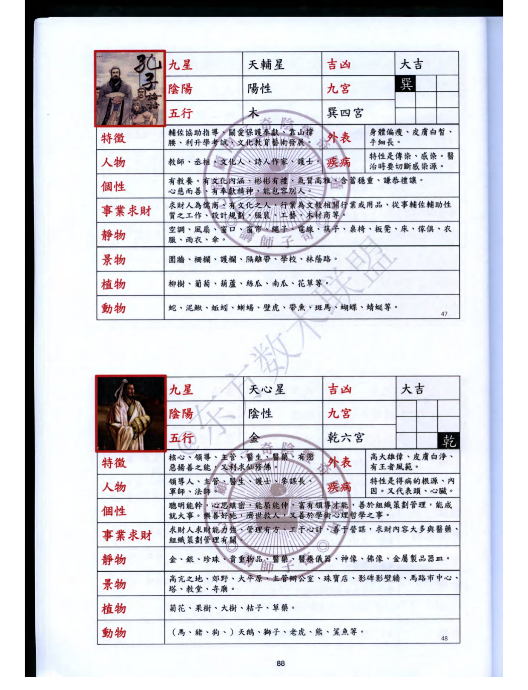

> **🖼 圖像解讀**　｜　檢視狀態：✅ 已檢視
> - **類型**：九星類象表（中級班投影片 47–48）
> - **內容**：天輔星（陽性、木、巽四宮、大吉）：輔佐協助指導、關愛保護奉獻、靠山撐腰、利升學考試、文化教育藝術發展，疾病特性是傳染感染、醫治要切斷感染源，事業儒商文教行業輔佐性工作；天心星（陰性、金、乾六宮、大吉）：核心、領導主管、醫生醫藥、慈悲揚善、利求仙修佛，疾病特性是得病的根源內因、又代表頭與心臟，事業管理有方、醫藥組織策劃。
> - **原文出處（逐字）**：九星類象表「天輔星／陽性／木／巽四宮／大吉」；「天心星／陰性／金／乾六宮／大吉」
> - **可檢索關鍵字**：天輔星, 輔佐指導, 升學考試, 傳染感染, 天心星, 核心領導, 醫生醫藥, 病之根源

**📝 逐字謄寫（第 90 頁）**

### 天輔星類象表（投影片 47）

| 項目 | 內容 |
|---|---|
| 九星／陰陽／五行／九宮 | 天輔星／陽性／木／巽四宮 |
| 吉凶 | 大吉 |
| 特徵 | 輔佐協助指導、關愛保護奉獻、靠山撐腰、利升學考試、文化教育藝術發展。 |
| 外表 | 身體偏瘦、皮膚白皙、手細長。 |
| 人物 | 教師、丞相、文化人、詩人作家、護士。 |
| 疾病 | 特性是傳染、感染。醫治時要切斷感染源。 |
| 個性 | 有教養、有文化內涵、彬彬有禮、氣質高雅、含蓄穩重、謙恭禮讓。心慈而善、有奉獻精神，能包容別人。 |
| 事業求財 | 求財人為儒商、有文化之人、行業為文教相關行業或用品、從事輔佐性質之工作、設計規劃、服裝、工藝、木材商等。 |
| 靜物 | 空調、風扇、窗口、窗簾、繩子、電線、筷子、桌椅、板凳、床、傢俱、衣服、雨衣、傘。 |
| 景物 | 圍牆、柵欄、護欄、隔離帶、學校、林蔭路。 |
| 植物 | 柳樹、葡萄、葫蘆、絲瓜、南瓜、花草等。 |
| 動物 | 蛇、泥鰍、蚯蚓、蜥蜴、壁虎、帶魚、斑馬、蝴蝶、蜻蜓等。 |

### 天心星類象表（投影片 48）

| 項目 | 內容 |
|---|---|
| 九星／陰陽／五行／九宮 | 天心星／陰性／金／乾六宮 |
| 吉凶 | 大吉 |
| 特徵 | 核心、領導、主管、醫生、醫藥、有懲惡揚善之能，又利求仙修佛。 |
| 外表 | 高大雄偉、皮膚白淨、有王者風範。 |
| 人物 | 領導人、主管、醫生、護士、參謀長、軍師、法師。 |
| 疾病 | 特性是得病的根源、內因。又代表頭、心臟。 |
| 個性 | 聰明能幹，心思縝密，能屈能伸，富有領導才能，善於組織策劃管理，能成就大事。樂善好施，濟世救人，又善於學術心理哲學之事。 |
| 事業求財 | 求財人求財能力強、管理有方、工于心計、善于營謀，求財內容大多與醫藥、組織策劃管理有關。 |
| 靜物 | 金、銀、珍珠、貴重物品、醫藥、醫療儀器、神像、佛像、金屬製品器皿。 |
| 景物 | 高亢之地、郊野、大平原、主管辦公室、珠寶店、影碑影壁牆、馬路市中心、塔、教堂、寺廟。 |
| 植物 | 菊花、果樹、大樹、桔子、草藥。 |
| 動物 | （馬、豬、狗、）天鵝、獅子、老虎、熊、鯊魚等。 |

（頁碼：88）

## 圖 91 — 第 91 頁（1240x1617）｜🖼 圖片（開圖判斷：圖表細看／裝飾照簡述）

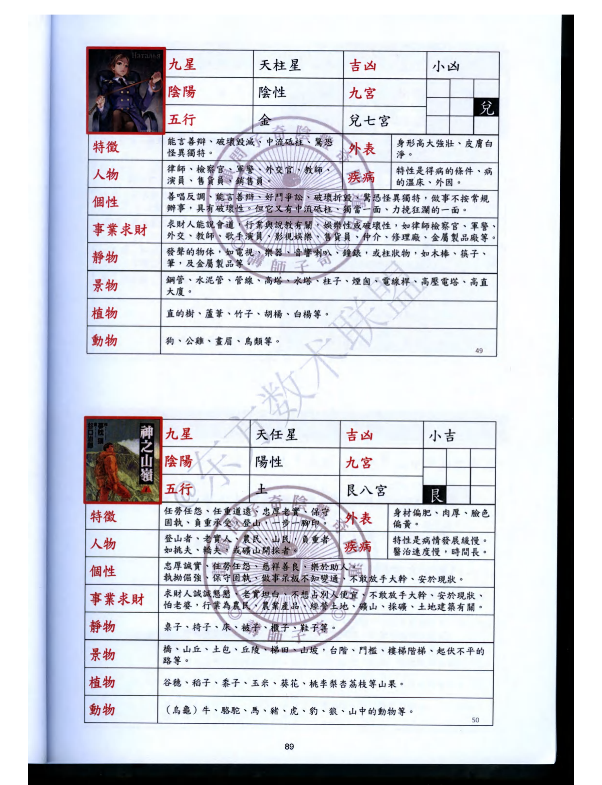

> **🖼 圖像解讀**　｜　檢視狀態：✅ 已檢視
> - **類型**：九星類象表（中級班投影片 49–50）
> - **內容**：天柱星（陰性、金、兌七宮、小凶）：能言善辯、破壞毀滅、中流砥柱、驚恐怪異獨特，疾病特性是得病的條件、病的溫床、外因，事業律師檢察官軍警外交教師歌手演員銷售仲介修理廠；天任星（陽性、土、艮八宮、小吉）：任勞任怨、任重道遠、忠厚老實保守固執、負重承受、登山一步一腳印，疾病特性是病情發展緩慢、醫治速度慢時間長，事業農民農業產品土地礦山採礦建築。
> - **原文出處（逐字）**：九星類象表「天柱星／陰性／金／兌七宮／小凶」；「天任星／陽性／土／艮八宮／小吉」
> - **可檢索關鍵字**：天柱星, 能言善辯, 破壞, 病之外因, 天任星, 任勞任怨, 病情緩慢, 土地礦山

**📝 逐字謄寫（第 91 頁）**

### 天柱星類象表（投影片 49）

| 項目 | 內容 |
|---|---|
| 九星／陰陽／五行／九宮 | 天柱星／陰性／金／兌七宮 |
| 吉凶 | 小凶 |
| 特徵 | 能言善辯、破壞毀滅、中流砥柱、驚恐怪異獨特。 |
| 外表 | 身形高大強壯、皮膚白淨。 |
| 人物 | 律師、檢察官、軍警、外交官、教師、演員、售貨員、銷售員。 |
| 疾病 | 特性是得病的條件、病的溫床、外因。 |
| 個性 | 善唱反調、能言善辯、好鬥爭訟、破壞折毀、驚恐怪異獨特，做事不按常規辦事，具有破壞性。但它又有中流砥柱、獨當一面、力挽狂瀾的一面。 |
| 事業求財 | 求財人能說會道，行業與說教有關，娛樂性或破壞性，如律師檢察官、軍警、外交、教師、歌手演員、影視娛樂、售貨員、仲介、修理廠、金屬製品廠等。 |
| 靜物 | 發聲的物体，如電視、樂器、音響喇叭、鐘錶，或柱狀物，如木棒、筷子、筆，及金屬製品等。 |
| 景物 | 鋼管、水泥管、管線、高塔、水塔、柱子、煙囪、電線桿、高壓電塔、高直大廈。 |
| 植物 | 直的樹、蘆葦、竹子、胡楊、白楊等。 |
| 動物 | 狗、公雞、畫眉、鳥類等。 |

### 天任星類象表（投影片 50）

| 項目 | 內容 |
|---|---|
| 九星／陰陽／五行／九宮 | 天任星／陽性／土／艮八宮 |
| 吉凶 | 小吉 |
| 特徵 | 任勞任怨、任重道遠、忠厚老實、保守固執、負重承受、登山、一步一腳印。 |
| 外表 | 身材偏肥、肉厚、臉色偏黃。 |
| 人物 | 登山者、老實人、農民、山民、負重者如挑夫、轎夫、或礦山開採者。 |
| 疾病 | 特性是病情發展緩慢。醫治速度慢，時間長。 |
| 個性 | 忠厚誠實、任勞任怨、慈祥善良、樂於助人。執拗倔強、保守固執、做事呆板不知變通、不敢放手大幹、安於現狀。 |
| 事業求財 | 求財人誠誠懇懇、老實坦白、不想占別人便宜、不敢放手大幹、安於現狀、怕老婆，行業為農民、農業產品、經營土地、礦山、採礦、土地建築有關。 |
| 靜物 | 桌子、椅子、床、被子、櫃子、鞋子等。 |
| 景物 | 橋、山丘、土包、丘陵、梯田、山坡，台階、門檻、樓梯階梯、起伏不平的路等。 |
| 植物 | 谷穗、稻子、麥子、玉米、葵花、桃李梨杏荔枝等山果。 |
| 動物 | （烏龜）牛、駱駝、馬、豬、虎、豹、狼、山中的動物等。 |

（頁碼：89）

## 圖 92 — 第 92 頁（1240x1617）｜🖼 圖片（開圖判斷：圖表細看／裝飾照簡述）

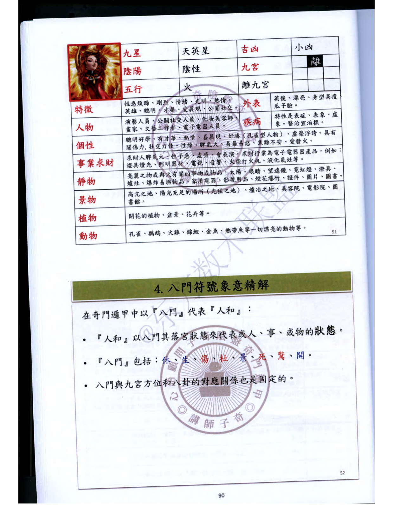

> **🖼 圖像解讀**　｜　檢視狀態：✅ 已檢視
> - **類型**：九星類象表＋文字頁（中級班投影片 51–52）
> - **內容**：天英星（陰性、火、離九宮、小凶）：性急煩躁、剛烈、情緒、光明熱情、英雄聰明、才華愛展現、公關社交，疾病特性是表症、表象、虛象、醫治宜治標，事業電子電器照明影視；接著第四節「八門符號象意精解」開場：八門代表「人和」，以落宮狀態代表人、事、物的狀態，八門為休生傷杜景死驚開，與九宮八卦對應固定。
> - **原文出處（逐字）**：九星類象表「天英星／陰性／火／離九宮／小凶」；4. 八門符號象意精解
> - **可檢索關鍵字**：天英星, 性急熱情, 才華展現, 表症虛象, 治標, 八門精解, 人和, 人事物狀態

**📝 逐字謄寫（第 92 頁）**

### 天英星類象表（投影片 51）

| 項目 | 內容 |
|---|---|
| 九星／陰陽／五行／九宮 | 天英星／陰性／火／離九宮 |
| 吉凶 | 小凶 |
| 特徵 | 性急煩躁、剛烈、情緒、光明、熱情、英雄、聰明、才華、愛展現、公關社交。 |
| 外表 | 英俊、漂亮、身型高瘦、瓜子臉。 |
| 人物 | 演藝人員、公關社交人員、化妝美容師、畫家、文藝工作者、電子電器人員。 |
| 疾病 | 特性是表症、表象、虛象。醫治宜治標。 |
| 個性 | 聰明好學、有才華、熱情、喜展現、好勝（孔雀型人物）、虛榮浮誇。具有關係力，社交力佳。性燥、脾氣大、易暴易怒、焦躁不安、愛發火。 |
| 事業求財 | 求財人脾氣大、性子急、虛榮、會表演，求財行業為電子電器器產品，例如：燈具燈光、照明器材、電視、音響、火柴打火机、液化氣灶等。 |
| 靜物 | 亮麗之物或與火有關的事物或物品，太陽、眼睛、望遠鏡、霓虹燈、燈具、爐灶、爆炸易燃物品，家用電器、影視用品、煙花爆竹、證件、圖片、圖書。 |
| 景物 | 高亢之地、陽光充足的場所（光猛之地）、爐冶之地、美容院、電影院、圖書館。 |
| 植物 | 開花的植物、盆景、花卉等。 |
| 動物 | 孔雀、鸚鵡、火雞、錦鯉、金魚、熱帶魚等一切漂亮的動物等。 |

### 4. 八門符號象意精解（投影片 52）

在奇門遁甲中以『八門』代表『人和』：

- 『人和』以八門其落宮狀態來代表或人、事、或物的**狀態**。
- 『八門』包括：休、生、傷、杜、景、死、驚、開。
- 八門與九宮方位和八卦的對應關係也是固定的。

（頁碼：90）

## 圖 93 — 第 93 頁（1240x1617）｜🖼 圖片（開圖判斷：圖表細看／裝飾照簡述）

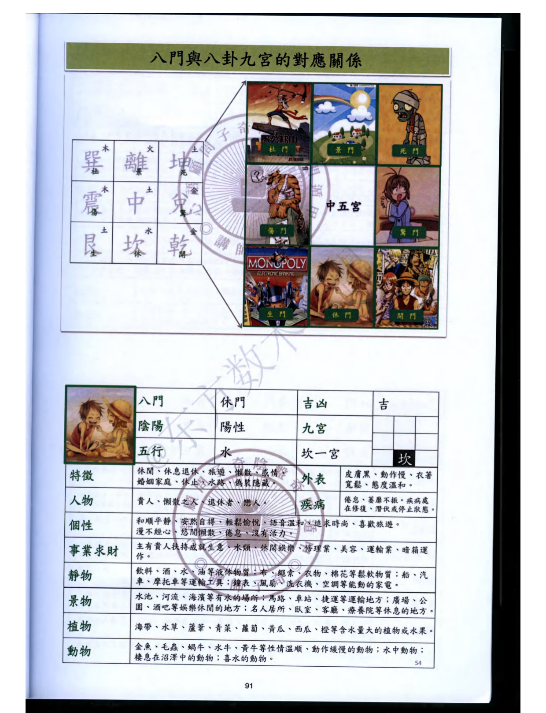

> **🖼 圖像解讀**　｜　檢視狀態：✅ 已檢視
> - **類型**：九宮圖＋八門類象表（中級班投影片 53–54）
> - **內容**：投影片 53「八門與八卦九宮的對應關係」（杜巽、景離、死坤、傷震、驚兌、生艮、休坎、開乾）與八門圖卡；投影片 54 休門類象表（陽性、水、坎一宮、吉）：休閒退休、旅遊、懶散、感情婚姻家庭、水路、偽裝隱藏，人物貴人懶散之人退休者戀人，疾病倦怠萎靡不振、疾病處於修復潛伏或停止狀態，事業有貴人扶持、水類休閒娛樂修理美容運輸。
> - **原文出處（逐字）**：八門與八卦九宮的對應關係；八門類象表「休門／陽性／水／坎一宮／吉」
> - **可檢索關鍵字**：八門原宮, 休門, 坎一宮, 休閒退休, 婚姻家庭, 貴人扶持, 疾病潛伏, 水類行業

**📝 逐字謄寫（第 93 頁）**

### 八門與八卦九宮的對應關係（投影片 53）

| 巽（木）：杜 | 離（火）：景 | 坤（土）：死 |
|---|---|---|
| **震（木）：傷** | **中（土）** | **兌（金）：驚** |
| **艮（土）：生** | **坎（水）：休** | **乾（金）：開** |

右側八門圖卡（同初級班第 42 頁）：杜門（愚公移山）、景門（彩虹小鎮）、死門（卡通殭屍）／傷門（受傷老虎）、中五宮、驚門（受驚女孩）／生門（大富翁遊戲）、休門（兩人親密相處）、開門（海賊冒險群像）。

### 休門類象表（投影片 54）

| 項目 | 內容 |
|---|---|
| 八門／陰陽／五行／九宮 | 休門／陽性／水／坎一宮 |
| 吉凶 | 吉 |
| 特徵 | 休閒、休息退休、旅遊、懶散、感情、婚姻家庭、休止、水路、偽裝隱藏。 |
| 外表 | 皮膚黑、動作慢、衣著寬鬆、態度溫和。 |
| 人物 | 貴人、懶散之人、退休者、戀人。 |
| 疾病 | 倦怠、萎靡不振。疾病處在修復、潛伏或停止狀態。 |
| 個性 | 和順平靜、安然自得、輕鬆愉悅、語音溫和、追求時尚、喜歡旅遊。漫不經心、悠閒懶散、倦怠、沒有活力。 |
| 事業求財 | 主有貴人扶持成就生意、水類、休閒娛樂、修理業、美容、運輸業、暗箱運作。 |
| 靜物 | 飲料、酒、水、油等液体物質；布、繩索、衣物、棉花等鬆軟物質；船、汽車、摩托車等運輸工具；鐘表、風扇、洗衣機、空調等能動的家電。 |
| 景物 | 水池、河流、海濱等有水的場所；馬路、車站、捷運等運輸地方；廣場、公園、酒吧等娛樂休閒的地方；名人居所、臥室、客廳、療養院等休息的地方。 |
| 植物 | 海帶、水草、蘆葦、青菜、蘿蔔、黃瓜、西瓜、橙等含水量大的植物或水果。 |
| 動物 | 金魚、毛蟲、蝸牛、水牛、黃牛等性情溫順、動作緩慢的動物；水中動物；棲息在沼澤中的動物；喜水的動物。 |

（頁碼：91）

## 圖 94 — 第 94 頁（1240x1617）｜🖼 圖片（開圖判斷：圖表細看／裝飾照簡述）

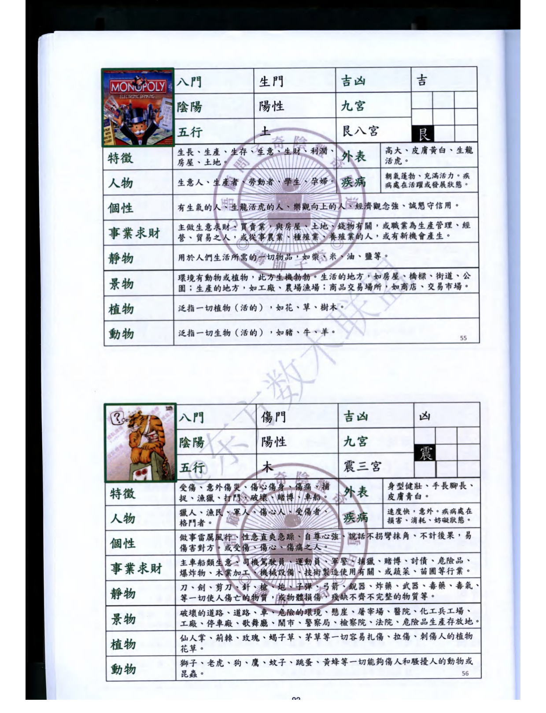

> **🖼 圖像解讀**　｜　檢視狀態：✅ 已檢視
> - **類型**：八門類象表（中級班投影片 55–56）
> - **內容**：生門（陽性、土、艮八宮、吉）：生長生產生存、生意生財利潤、房屋土地，人物生意人生產者勞動者學生孕婦，疾病朝氣蓬勃、疾病處在活躍或發展狀態，事業做生意求財、房屋土地、生產管理、農業種植養殖、新機會；傷門（陽性、木、震三宮、凶）：受傷、意外傷災、傷心傷身、捕捉漁獵、打鬥破壞、賭博、車船，疾病速度快意外、處在損害消耗妨礙狀態，事業車船司機運動員軍警捕獵賭博討債危險品。
> - **原文出處（逐字）**：八門類象表「生門／陽性／土／艮八宮／吉」；「傷門／陽性／木／震三宮／凶」
> - **可檢索關鍵字**：生門, 生意生財, 房屋土地, 疾病發展, 傷門, 意外傷災, 賭博討債, 車船

**📝 逐字謄寫（第 94 頁）**

### 生門類象表（投影片 55）

| 項目 | 內容 |
|---|---|
| 八門／陰陽／五行／九宮 | 生門／陽性／土／艮八宮 |
| 吉凶 | 吉 |
| 特徵 | 生長、生產、生存、生意、生財、利潤、房屋、土地。 |
| 外表 | 高大、皮膚黃白、生龍活虎。 |
| 人物 | 生意人、生產者、勞動者、學生、孕婦。 |
| 疾病 | 朝氣蓬勃、充滿活力。疾病處在活躍或發展狀態。 |
| 個性 | 有生氣的人、生龍活虎的人、樂觀向上的人、經濟觀念強、誠懇守信用。 |
| 事業求財 | 主做生意求財、買賣業，與房屋、土地、錢物有關，或職業為生產管理、經營、貿易之人，或從事農業、種植業、養殖業的人，或有新機會產生。 |
| 靜物 | 用於人們生活所需的一切物品，如柴、米、油、鹽等。 |
| 景物 | 環境有動物或植物，此方生機勃勃。生活的地方，如房屋、橋樑、街道、公園；生產的地方，如工廠、農場漁場；商品交易場所，如商店、交易市場。 |
| 植物 | 泛指一切植物（活的），如花、草、樹木。 |
| 動物 | 泛指一切生物（活的），如豬、牛、羊。 |

### 傷門類象表（投影片 56）

| 項目 | 內容 |
|---|---|
| 八門／陰陽／五行／九宮 | 傷門／陽性／木／震三宮 |
| 吉凶 | 凶 |
| 特徵 | 受傷、意外傷災、傷心傷身、傷痛、捕捉、漁獵、打鬥、破壞、賭博、車船。 |
| 外表 | 身型健壯、手長腳長、皮膚青白。 |
| 人物 | 獵人、漁民、軍人、傷心人、受傷者、格鬥者。 |
| 疾病 | 速度快，意外。疾病處在損害、消耗、妨礙狀態。 |
| 個性 | 做事雷厲風行、性急直爽急躁、自尊心強、說話不拐彎抹角、不計後果，易傷害對方。或受傷、傷心、傷痛之人。 |
| 事業求財 | 主車船類生意、司機駕駛員、運動員、軍警、捕獵、賭博、討債、危險品、爆炸物、木業加工、機械設備、技術製造使用有關、或蔬菜、苗圃等行業。 |
| 靜物 | 刀、劍、剪刀、針、槍、炮、子彈、弓箭、鋭器、炸藥、武器、毒藥、毒氣、等一切使人傷亡的物質，或物體損傷、殘缺不齊不完整的物質等。 |
| 景物 | 破壞的道路、道路、車、危險的環境、懸崖、屠宰場、醫院、化工兵工場、工廠、停車廠、歌舞廳、鬧市、警察局、檢察院、法院、危險品生產存放地。 |
| 植物 | 仙人掌、荊棘、玫瑰、蠍子草、茅草等一切容易扎傷、拉傷、刺傷人的植物花草。 |
| 動物 | 獅子、老虎、狗、鷹、蚊子、跳蚤、黃蜂等一切能夠傷人和騷擾人的動物或昆蟲。 |

## 圖 95 — 第 95 頁（1240x1617）｜🖼 圖片（開圖判斷：圖表細看／裝飾照簡述）

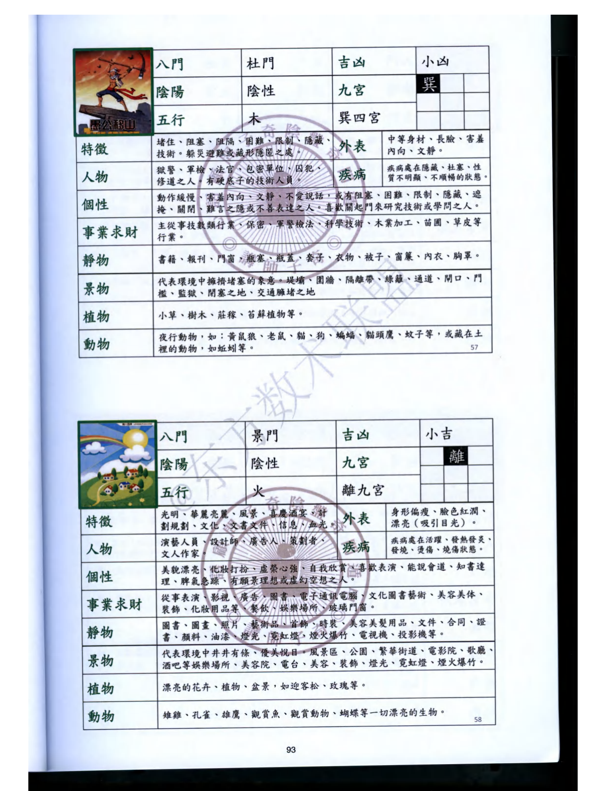

> **🖼 圖像解讀**　｜　檢視狀態：✅ 已檢視
> - **類型**：八門類象表（中級班投影片 57–58）
> - **內容**：杜門（陰性、木、巽四宮、小凶）：堵住阻塞阻隔、困難限制、隱藏、技術、躲災避難或藏形隱匿之處，人物獄警軍檢法官保密單位囚犯修道之人技術人員，疾病處在隱藏杜塞、性質不明顯不順暢狀態，事業技術保密軍警檢法科學技術；景門（陰性、火、離九宮、小吉）：光明華麗亮麗、風景、喜慶酒宴、計劃規劃、文化文書、信息、血光，人物演藝人員設計師廣告人策劃者文人作家，疾病處在活躍、發熱發炎燙傷燒傷狀態，事業表演影視廣告圖書電子通訊文化藝術美容。
> - **原文出處（逐字）**：八門類象表「杜門／陰性／木／巽四宮／小凶」；「景門／陰性／火／離九宮／小吉」
> - **可檢索關鍵字**：杜門, 阻塞隱藏, 技術保密, 疾病隱藏, 景門, 文書信息, 喜慶酒宴, 發炎血光

**📝 逐字謄寫（第 95 頁）**

### 杜門類象表（投影片 57）

| 項目 | 內容 |
|---|---|
| 八門／陰陽／五行／九宮 | 杜門／陰性／木／巽四宮 |
| 吉凶 | 小凶 |
| 特徵 | 堵住、阻塞、阻隔、困難、限制、隱藏、技術。躲災避難或藏形隱匿之處。 |
| 外表 | 中等身材、長臉、害羞內向、文靜。 |
| 人物 | 獄警、軍檢、法官、包密單位、囚犯、修道之人。有硬底子的技術人員。 |
| 疾病 | 疾病處在隱藏、杜塞、性質不明顯、不順暢的狀態。 |
| 個性 | 動作緩慢、害羞內向、文靜、不愛說話，或有阻塞、困難、限制、隱藏、遮掩、關閉、難言之隱或不善表達之人。喜歡關起門來研究技術或學問之人。 |
| 事業求財 | 主從事技術類行業、保密、軍警檢法、科學技術、木業加工、苗圃、草皮等行業。 |
| 靜物 | 書籍、報刊、門窗、瓶塞、瓶蓋、套子、衣物、被子、窗簾、內衣、胸罩。 |
| 景物 | 代表環境中擁擠堵塞的象意。堤壩、圍牆、隔離帶、綠籬、通道、關口、門檻、監獄、閉塞之地、交通擁堵之地 |
| 植物 | 小草、樹木、莊稼、苔蘚植物等。 |
| 動物 | 夜行動物，如：黃鼠狼、老鼠、貓、狗、蝙蝠、貓頭鷹、蚊子等，或藏在土裡的動物，如蚯蚓等。 |

（註：「包密單位」原文如此，應為「保密單位」。）

### 景門類象表（投影片 58）

| 項目 | 內容 |
|---|---|
| 八門／陰陽／五行／九宮 | 景門／陰性／火／離九宮 |
| 吉凶 | 小吉 |
| 特徵 | 光明、華麗亮麗、風景、喜慶酒宴、計劃規劃、文化、文書文件、信息、血光。 |
| 外表 | 身形偏瘦、臉色紅潤、漂亮（吸引目光）。 |
| 人物 | 演藝人員、設計師、廣告人、策劃者、文人作家。 |
| 疾病 | 疾病處在活躍、發熱發炎、發燒、燙傷、燒傷狀態。 |
| 個性 | 美貌漂亮、化妝打扮、虛榮心強、自我欣賞、喜歡表演、能說會道、知書達理、脾氣急躁、有願景理想或虛幻空想之人。 |
| 事業求財 | 從事表演、影視、廣告、圖書、電子通訊電腦、文化圖書藝術、美容美体、裝飾、化妝用品等、餐飲、娛樂場所、玻璃門窗。 |
| 靜物 | 圖書、圖畫、照片、藝術品、首飾、時裝、美容美髮用品、文件、合同、證書、顏料、油漆、燈光、霓虹燈、煙火爆竹、電視機、投影機等。 |
| 景物 | 代表環境中井井有條、優美悅目。風景區、公園、繁華街道、電影院、歌廳、酒吧等娛樂場所、美容院、電台、美容、裝飾、燈光、霓虹燈、煙火爆竹。 |
| 植物 | 漂亮的花卉、植物、盆景，如迎客松、玫瑰等。 |
| 動物 | 雄雞、孔雀、雄鷹、觀賞魚、觀賞動物、蝴蝶等一切漂亮的生物。 |

（頁碼：93）

## 圖 96 — 第 96 頁（1240x1617）｜🖼 圖片（開圖判斷：圖表細看／裝飾照簡述）

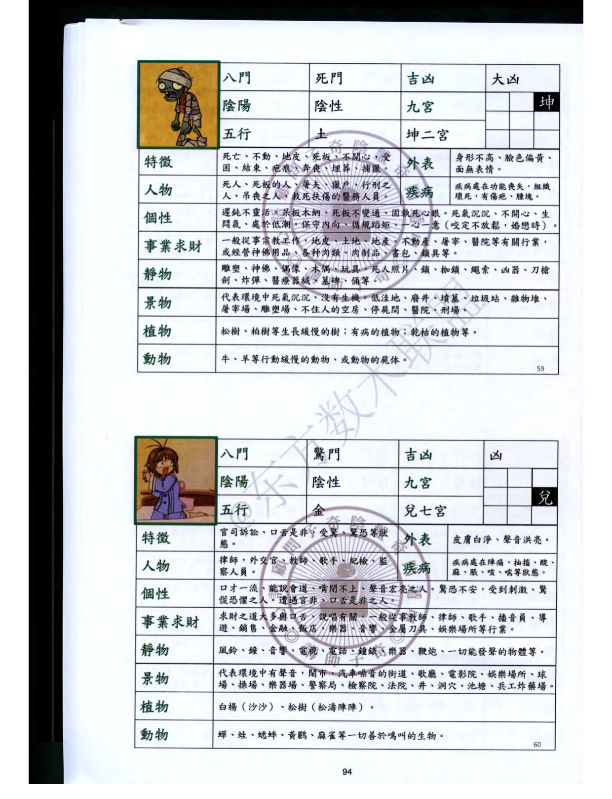

> **🖼 圖像解讀**　｜　檢視狀態：✅ 已檢視
> - **類型**：八門類象表（中級班投影片 59–60）
> - **內容**：死門（陰性、土、坤二宮、大凶）：死亡、不動、地皮、死板、不開心、受困、結束、疤痕、奔喪埋葬、捕獵，人物死人死板之人屠夫獵戶行刑者吊喪者醫務人員，疾病處在功能喪失、組織壞死、有傷疤腫塊，事業宗教地皮土地不動產屠宰醫院；驚門（陰性、金、兌七宮、凶）：官司訴訟、口舌是非、受驚驚恐，人物律師外交官教師歌手紀檢監察，疾病處在陣痛抽搐酸麻脹咳喘，事業口舌說唱相關（教師律師歌手播音員導遊銷售）。
> - **原文出處（逐字）**：八門類象表「死門／陰性／土／坤二宮／大凶」；「驚門／陰性／金／兌七宮／凶」
> - **可檢索關鍵字**：死門, 死亡不動, 組織壞死, 地皮陰宅, 驚門, 官司訴訟, 口舌是非, 陣痛抽搐

**📝 逐字謄寫（第 96 頁）**

### 死門類象表（投影片 59）

| 項目 | 內容 |
|---|---|
| 八門／陰陽／五行／九宮 | 死門／陰性／土／坤二宮 |
| 吉凶 | 大凶 |
| 特徵 | 死亡、不動、地皮、死板、不開心、受困、結束、疤痕、奔喪、埋葬、捕獵。 |
| 外表 | 身形不高、臉色偏黃、面無表情。 |
| 人物 | 死人、死板的人、屠夫、獵戶、行刑之人、吊喪之人、救死扶傷的醫務人員。 |
| 疾病 | 疾病處在功能喪失，組織壞死，有傷疤、腫塊。 |
| 個性 | 遲鈍不靈活、呆板木納、死板不變通、固執死心眼。死氣沉沉、不開心、生悶氣、處於低潮。保守內向、循規蹈矩、一心一意（咬定不放鬆，婚戀時）。 |
| 事業求財 | 一般從事宗教工作，地皮、土地、地產、不動產、屠宰、醫院等有關行業，或經營神佛用品、各种肉類、肉制品、書包、鎖具等。 |
| 靜物 | 雕塑、神佛、偶像、木偶、玩具、死人照片、鎖、枷鎖、繩索、凶器、刀槍劍、炸彈、醫療器械、墓碑、俑等。 |
| 景物 | 代表環境中死氣沉沉、沒有生機。低洼地、廢井、墳墓、垃圾站、雜物堆、屠宰場、雕塑場、不住人的空房、停屍間、醫院、刑場。 |
| 植物 | 松樹、柏樹等生長緩慢的樹；有病的植物；乾枯的植物等。 |
| 動物 | 牛、羊等行動緩慢的動物、或動物的屍体。 |

### 驚門類象表（投影片 60）

| 項目 | 內容 |
|---|---|
| 八門／陰陽／五行／九宮 | 驚門／陰性／金／兌七宮 |
| 吉凶 | 凶 |
| 特徵 | 官司訴訟、口舌是非、受驚、驚恐等狀態。 |
| 外表 | 皮膚白淨、聲音洪亮。 |
| 人物 | 律師，外交官、教師、歌手、紀檢、監察人員。 |
| 疾病 | 疾病處在陣痛、抽搐、酸、麻、脹、咳、喘等狀態。 |
| 個性 | 口才一流、能說會道、嘴閒不上、聲音宏亮之人。驚恐不安，受到刺激、驚慌恐懼之人。遭遇官非、口舌是非之人。 |
| 事業求財 | 求財之道大多與口舌、說唱有關，一般從事教師、律師、歌手、播音員、導遊、銷售、金融、飯店、樂器、音響、金屬刀具、娛樂場所等行業。 |
| 靜物 | 風鈴、鐘、音響、電視、電話、鐘錶、樂器、鞭炮、一切能發聲的物體等。 |
| 景物 | 代表環境中有聲音，鬧市、汽車噪音的街道、歌廳、電影院、娛樂場所、球場、操場、樂器場、警察局、檢察院、法院、井、洞穴、池塘、兵工炸藥場。 |
| 植物 | 白楊（沙沙）、松樹（松濤陣陣）。 |
| 動物 | 蟬、蛙、蟋蟀、黃鸝、麻雀等一切善於鳴叫的生物。 |

（頁碼：94）

## 圖 97 — 第 97 頁（1240x1617）｜🖼 圖片（開圖判斷：圖表細看／裝飾照簡述）

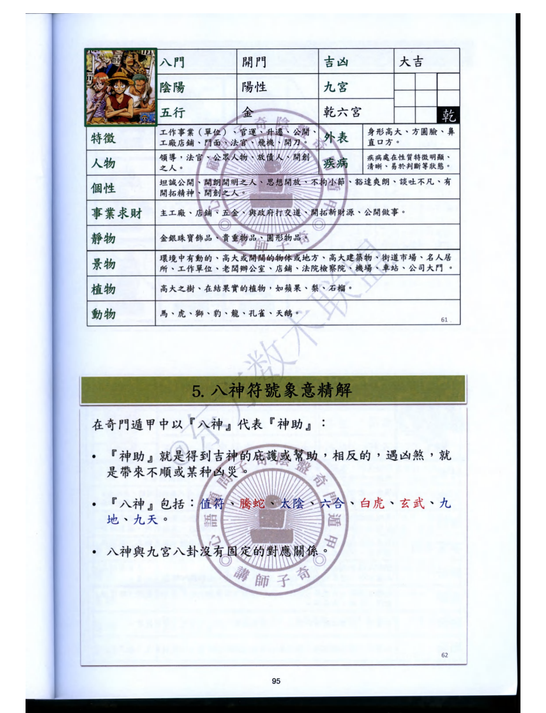

> **🖼 圖像解讀**　｜　檢視狀態：✅ 已檢視
> - **類型**：八門類象表＋文字頁（中級班投影片 61–62）
> - **內容**：開門（陽性、金、乾六宮、大吉）：工作事業（單位）、官運升遷、公開、工廠店鋪門面、法官、飛機、開刀，人物領導法官公眾人物放債人開創之人，疾病處在性質明顯、清晰易於判斷狀態，事業工廠店鋪五金、與政府打交道、開拓新財源、公開做事；接著第五節「八神符號象意精解」開場：八神代表「神助」，得吉神庇護或遇凶煞帶來不順凶災，八神為值符螣蛇太陰六合白虎玄武九地九天，與九宮八卦無固定對應。
> - **原文出處（逐字）**：八門類象表「開門／陽性／金／乾六宮／大吉」；5. 八神符號象意精解
> - **可檢索關鍵字**：開門, 工作事業, 官運升遷, 開刀, 疾病明顯, 八神精解, 神助, 吉神凶煞

**📝 逐字謄寫（第 97 頁）**

### 開門類象表（投影片 61）

| 項目 | 內容 |
|---|---|
| 八門／陰陽／五行／九宮 | 開門／陽性／金／乾六宮 |
| 吉凶 | 大吉 |
| 特徵 | 工作事業（單位）、官運、升遷、公開、工廠店鋪、門面、法官、飛機、開刀。 |
| 外表 | 身形高大、方圓臉、鼻直口方。 |
| 人物 | 領導，法官、公眾人物、放債人、開創之人。 |
| 疾病 | 疾病處在性質特徵明顯、清晰、易於判斷等狀態。 |
| 個性 | 坦誠公開、開朗開明之人、思想開放、不拘小節、豁達爽朗、談吐不凡、有開拓精神、開創之人。 |
| 事業求財 | 主工廠、店鋪、五金、與政府打交道、開拓新財源、公開做事。 |
| 靜物 | 金銀珠寶飾品、貴重物品、圓形物品。 |
| 景物 | 環境中有動的、高大或開闊的物体或地方、高大建築物、街道市場、名人居所、工作單位、老闆辦公室、店鋪、法院檢察院、機場、車站、公司大門。 |
| 植物 | 高大之樹、在結果實的植物，如蘋果、梨、石榴。 |
| 動物 | 馬、虎、獅、豹、龍、孔雀、天鵝。 |

### 5. 八神符號象意精解（投影片 62）

在奇門遁甲中以『八神』代表『神助』：

- 『神助』就是得到吉神的庇護或幫助，相反的，遇凶煞，就是帶來不順或某种凶災。
- 『八神』包括：值符、騰蛇、太陰、六合、白虎、玄武、九地、九天。
- 八神與九宮八卦沒有固定的對應關係。

（頁碼：95）

## 圖 98 — 第 98 頁（1240x1617）｜🖼 圖片（開圖判斷：圖表細看／裝飾照簡述）

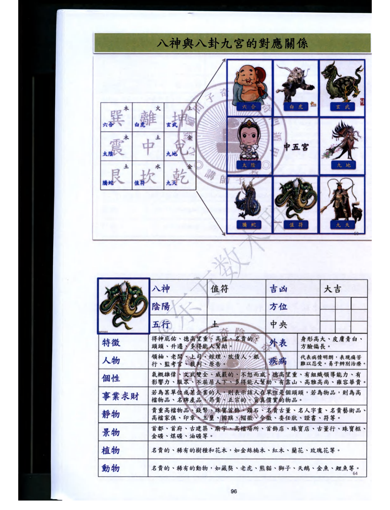

> **🖼 圖像解讀**　｜　檢視狀態：✅ 已檢視
> - **類型**：九宮圖＋圖卡＋八神類象表（中級班投影片 63–64）
> - **內容**：投影片 63「八神與八卦九宮的對應關係」示意圖（此圖八神位置：巽六合、離白虎、坤玄武、震太陰、兌九地、艮騰蛇、坎值符、乾九天）與八神圖卡；投影片 64 值符類象表（五行土、方位中央、大吉；初級班作甲木）：得神庇佑、德高望重、高檔名貴、頭頭升遷、多得能人幫助，人物領袖老闆上司放債人銀行監考官裁判原告，疾病代表病情明朗、表現痛苦難以忍受、易于辨別治療。
> - **原文出處（逐字）**：八神與八卦九宮的對應關係；八神類象表「值符／五行 土／方位 中央／吉凶 大吉」
> - **可檢索關鍵字**：八神位置, 八神圖卡, 值符, 大吉, 德高望重, 高檔名貴, 靠山, 病情明朗

**📝 逐字謄寫（第 98 頁）**

### 八神與八卦九宮的對應關係（投影片 63）

| 巽（木）：六合 | 離（火）：白虎 | 坤（土）：玄武 |
|---|---|---|
| **震（木）：太陰** | **中（土）** | **兌（金）：九地** |
| **艮（土）：騰蛇** | **坎（水）：值符** | **乾（金）：九天** |

右側圖卡（同排列）：六合（彌勒）、白虎、玄武／太陰（觀音）、中五宮、九地／騰蛇、值符（青龍）、九天（天將）。

（註：初級班說明八神與九宮八卦無固定對應，此圖為一種示意排列，照錄。）

### 值符類象表（投影片 64）

| 項目 | 內容 |
|---|---|
| 八神 | 值符 |
| 陰陽／五行／方位 | （陰陽空白）／土／中央 |
| 吉凶 | 大吉 |
| 特徵 | 得神庇佑、德高望重、高檔、名貴的、頭頭、升遷、多得能人幫助。 |
| 外表 | 身形高大、皮膚青白、方臉偏長。 |
| 人物 | 領袖、老闆、上司、經理、放債人、銀行、監考官、裁判、原告。 |
| 疾病 | 代表病情明朗，表現痛苦難以忍受。易于辨別治療。 |
| 個性 | 氣概雄偉、文武雙全、威嚴的、不怒而威、德高望重、有組織領導能力、有影響力、服眾、不屈居人下、多得能人幫助、有靠山、高雅高尚、雍容華貴。 |
| 事業求財 | 若為某單位或某企業的人，則表示該人在單位是個頭頭，若為物品，則為高檔物品、名牌產品、昂貴、正宗的、貨真價實的物品。 |
| 靜物 | 貴重高檔物品、錢幣、珠寶首飾、鑽石、名貴古董、名人字畫、名貴藝術品、高檔家俱、印章、玉璽、國旗、帽徽、令徽、委任狀、證書、符等。 |
| 景物 | 首都、首府、古建築、廟宇、高檔場所、首飾店、珠寶店、古董行、珠寶櫃、金礦、煤礦、油礦等。 |
| 植物 | 名貴的、稀有的樹種和花木，如金絲楠木、紅木、蘭花、玫瑰花等。 |
| 動物 | 名貴的、稀有的動物，如藏獒、老虎、熊貓、獅子、天鵝、金魚、鯉魚等。 |

（註：初級班第 50 頁值符五行作「甲木」，此處作「土」，照錄。頁碼：96）

## 圖 99 — 第 99 頁（1240x1617）｜🖼 圖片（開圖判斷：圖表細看／裝飾照簡述）

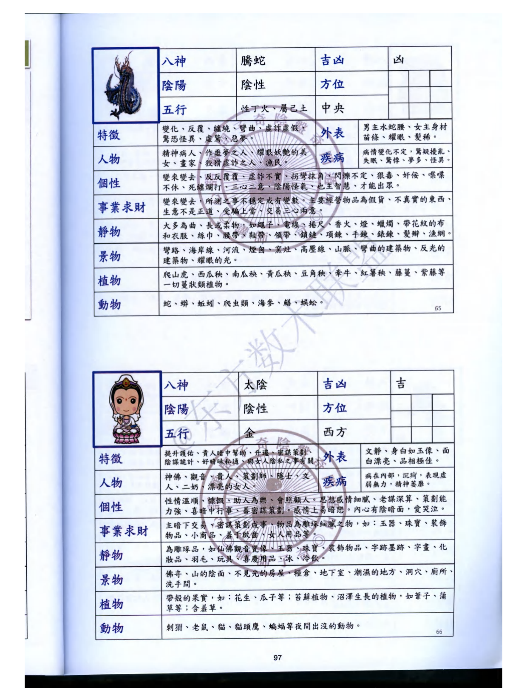

> **🖼 圖像解讀**　｜　檢視狀態：✅ 已檢視
> - **類型**：八神類象表（中級班投影片 65–66）
> - **內容**：騰蛇（陰性、五行「性丁火、屬己土」、方位中央、凶）：變化反覆、纏繞彎曲、虛詐虛假、驚恐怪異、虛驚惡夢，人物精神病人作噩夢之人耀眼妖艷的美女畫家狡猾虛詐之人漁民，疾病病情變化不定、驚疑擾亂失眠驚悸夢多怪異，事業所測不穩定有變數、假貨、受騙上當；太陰（陰性、金、西方、吉）：提升護佑、貴人暗中幫助、升遷、密謀策劃、陰謀詭計、暗昧私通、女人陰私，疾病病在內部沉痾、虛弱無力精神萎靡，事業暗下交易、密謀策劃、雕琢細膩之物。
> - **原文出處（逐字）**：八神類象表「騰蛇／陰性／性丁火、屬己土／中央／凶」；「太陰／陰性／金／西方／吉」
> - **可檢索關鍵字**：騰蛇, 虛詐反覆, 驚悸夢多, 假貨受騙, 太陰, 貴人暗助, 密謀策劃, 病在內部

**📝 逐字謄寫（第 99 頁）**

### 騰蛇類象表（投影片 65）

| 項目 | 內容 |
|---|---|
| 八神／陰陽 | 騰蛇／陰性 |
| 五行／方位 | 性丁火、屬己土／中央 |
| 吉凶 | 凶 |
| 特徵 | 變化、反覆、纏繞、彎曲、虛詐虛假、驚恐怪異、虛驚、惡夢。 |
| 外表 | 男主水蛇腰、女主身材苗條、耀眼、髮稀。 |
| 人物 | 精神病人、作噩夢之人、耀眼妖艷的美女、畫家、狡猾虛詐之人、漁民。 |
| 疾病 | 病情變化不定，驚疑擾亂、失眠、驚悸、夢多、怪異。 |
| 個性 | 變來變去、反反覆覆、虛詐不實、拐彎抹角、閃爍不定、狠毒、奸佞、喋喋不休、死纏爛打、三心二意、陰陽怪氣、也主智慧、才能出眾。 |
| 事業求財 | 變來變去，所測之事不穩定或有變數。主要經營物品為假貨、不真實的東西、生意不是正道、受騙上當、交易三心兩意。 |
| 靜物 | 大多為曲、長或柔物，如繩子、電線、捲尺、香火、燈、蠟燭、帶花紋的布和衣服、絲巾、腰帶、鞋帶、領帶、鎖鏈、項鍊、手鍊、錶鍊、髮辮、漁網。 |
| 景物 | 彎路、海岸線、河流、煙囪、窯灶、高壓線、山脈、彎曲的建築物、反光的建築物、耀眼的光。 |
| 植物 | 爬山虎、西瓜秧、南瓜秧、黃瓜秧、豆角秧、牽牛、紅薯秧、藤蔓、紫藤等一切蔓狀類植物。 |
| 動物 | 蛇、蟒、蚯蚓、爬虫類、海參、鱔、蜈蚣。 |

### 太陰類象表（投影片 66）

| 項目 | 內容 |
|---|---|
| 八神／陰陽 | 太陰／陰性 |
| 五行／方位 | 金／西方 |
| 吉凶 | 吉 |
| 特徵 | 提升護佑、貴人暗中幫助、升遷、密謀策劃、陰謀詭計、好暗昧私通、與女人陰私之事有關。 |
| 外表 | 文靜、身白如玉像、面白漂亮、品相極佳。 |
| 人物 | 神佛、觀音、貴人、策劃師、隱士、文人、二奶、漂亮的女人。 |
| 疾病 | 病在內部，沉痾，表現虛弱無力，精神萎靡。 |
| 個性 | 性情溫順、慷慨、助人為樂、會照顧人。思想感情細膩、老謀深算、策劃能力強、喜暗中行事、善密謀策劃。感情上易暗戀。內心有陰暗面，愛哭泣。 |
| 事業求財 | 主暗下交易、密謀策劃成事、物品為雕琢細膩之物，如：玉器、珠寶、裝飾物品、小商品、羞于啟齒、女人用品等。 |
| 靜物 | 為雕琢品，如仙佛觀音瓷像、玉器、珠寶、裝飾物品、字跡墨跡、字畫、化妝品、羽毛、玩具、喜慶用品、冰、冷飲。 |
| 景物 | 佛寺、山的陰面、不見光的房屋、糧倉、地下室、潮濕的地方、洞穴、廁所、洗手間。 |
| 植物 | 帶殼的果實，如：花生、瓜子等；苔蘚植物、沼澤生長的植物，如葦子、蒲草等；含羞草。 |
| 動物 | 刺猬、老鼠、貓、貓頭鷹、蝙蝠等夜間出沒的動物。 |

（頁碼：97）

## 圖 100 — 第 100 頁（1240x1617）｜🖼 圖片（開圖判斷：圖表細看／裝飾照簡述）

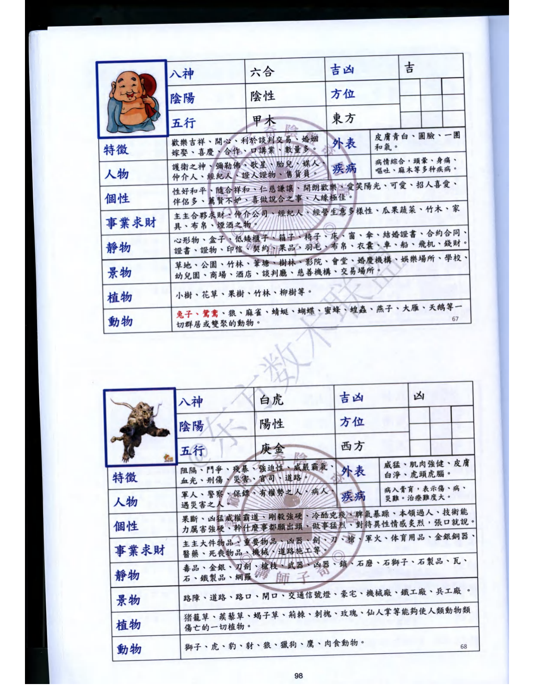

> **🖼 圖像解讀**　｜　檢視狀態：✅ 已檢視
> - **類型**：八神類象表（中級班投影片 67–68）
> - **內容**：六合（陰性、甲木、東方、吉）：歡樂吉祥、開心、利於談判交易、婚姻嫁娶、喜慶合作、口講業、數量多，人物護衛之神彌勒佛歌星胎兒媒人仲介經紀人證人售貨員，疾病病情綜合、頭暈身痛嘔吐麻木等多种疾病，事業合夥求財、仲介經紀、多樣性經營；白虎（陽性、庚金、西方、凶）：阻隔、鬥爭、殘暴、強迫性、威嚴霸氣、血光刑傷、災害官司、道路，人物軍警保鏢有權勢者病人遇災害之人，疾病病入膏肓、表示傷病災難、治療難度大，事業大件重要物品凶器軍火醫藥死喪物品機械道路施工。
> - **原文出處（逐字）**：八神類象表「六合／陰性／甲木／東方／吉」；「白虎／陽性／庚金／西方／凶」
> - **可檢索關鍵字**：六合, 談判交易, 婚姻嫁娶, 合夥仲介, 白虎, 血光刑傷, 病入膏肓, 道路施工

**📝 逐字謄寫（第 100 頁）**

### 六合類象表（投影片 67）

| 項目 | 內容 |
|---|---|
| 八神／陰陽 | 六合／陰性 |
| 五行／方位 | 甲木／東方 |
| 吉凶 | 吉 |
| 特徵 | 歡樂吉祥、開心、利於談判交易、婚姻嫁娶、喜慶、合作、口講業、數量多。 |
| 外表 | 皮膚青白、圓臉、一團和氣。 |
| 人物 | 護衛之神、彌勒佛、歌星、胎兒、媒人、仲介人、經紀人、證人證物、售貨員。 |
| 疾病 | 病情綜合，頭暈、身痛、嘔吐、麻木等多种疾病。 |
| 個性 | 性好和平、隨合祥和、仁慈謙讓、開朗歡樂、愛笑陽光、可愛、招人喜愛、伴侶多、薦賢不妒、喜做說合之事、人緣極佳。 |
| 事業求財 | 主主合夥求財、仲介公司、經紀人、經營生意多樣性、瓜果蔬菜、竹木、家具、布帛、煙酒之物。 |
| 靜物 | 心形物、盒子、低矮櫃子、箱子、椅子、床、窗、傘、結婚證書、合約合同、證書、證物、印信、契約、果品、羽毛、布帛、衣囊、車、船、飛机、錢財。 |
| 景物 | 草地、公園、竹林、葦塘、樹林、影院、會堂、婚慶機構、娛樂場所、學校、幼兒園、商場、酒店、談判廳、慈善機構、交易場所。 |
| 植物 | 小樹、花草、果樹、竹林、柳樹等。 |
| 動物 | 兔子、鴛鴦、狼、麻雀、蜻蜓、蝴蝶、蜜蜂、蝗蟲、燕子、大雁、天鵝等一切群居或雙聚的動物。 |

### 白虎類象表（投影片 68）

| 項目 | 內容 |
|---|---|
| 八神／陰陽 | 白虎／陽性 |
| 五行／方位 | 庚金／西方 |
| 吉凶 | 凶 |
| 特徵 | 阻隔、鬥爭、殘暴、強迫性、威嚴霸氣、血光、刑傷、災害、官司、道路。 |
| 外表 | 威猛、肌肉強健、皮膚白淨、虎頭虎腦。 |
| 人物 | 軍人、警察、保鏢、有權勢之人、病人、遇災害之人。 |
| 疾病 | 病入膏肓，表示傷、病、災難。治療難度大。 |
| 個性 | 果斷、凶猛威權霸道、剛毅強硬、冷酷兇殘、脾氣暴躁、本領過人、技術能力厲害強硬、幹什麼事都願出頭、做事猛烈、對待異性情感炙烈，張口就說。 |
| 事業求財 | 主主大件物品、重要物品、凶器、劍、刀、槍、軍火、体育用品、金銀銅器、醫藥、死喪物品、機械、道路施工等。 |
| 靜物 | 毒品、金銀、刀劍、槍枝、武器、凶器、鎖、石磨、石獅子、石製品、瓦、石、鐵製品、網羅。 |
| 景物 | 路障、道路、路口、關口、交通信號燈、豪宅、機械廠、鐵工廠、兵工廠。 |
| 植物 | 豬籠草、蒺藜草、蠍子草、荊棘、刺槐、玫瑰、仙人掌等能夠使人類動物類傷亡的一切植物。 |
| 動物 | 獅子、虎、豹、豺、狼、獵狗、鷹、肉食動物。 |

（「主主」原文如此。頁碼：98）

## 圖 101 — 第 101 頁（1240x1617）｜🖼 圖片（開圖判斷：圖表細看／裝飾照簡述）

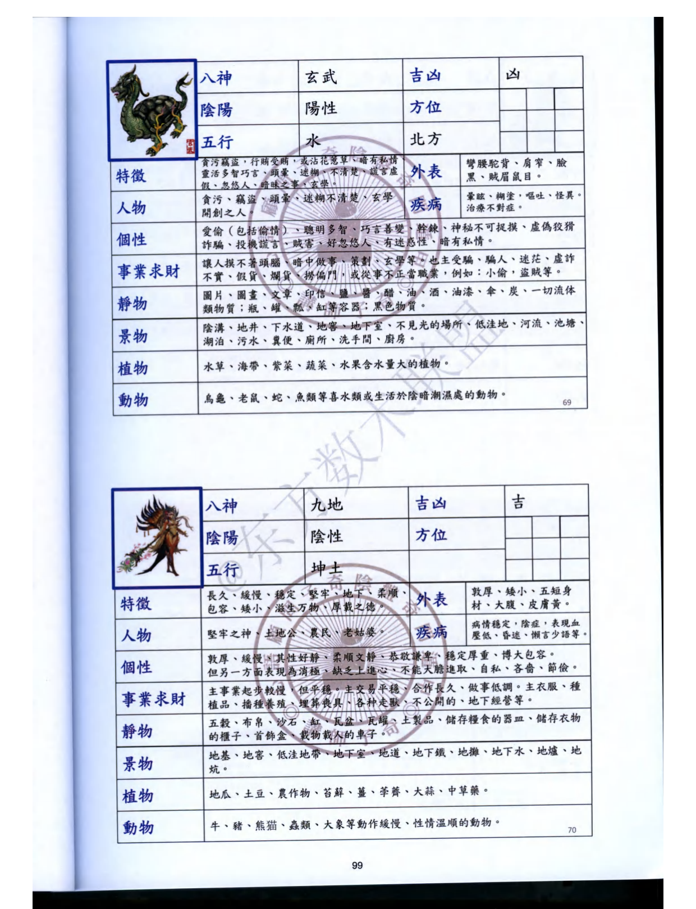

> **🖼 圖像解讀**　｜　檢視狀態：✅ 已檢視
> - **類型**：八神類象表（中級班投影片 69–70）
> - **內容**：玄武（陽性、水、北方、凶）：貪污竊盜、行賄受賄、沾花惹草、暗有私情、頭暈迷糊、謊言虛假、忽悠人、暗昧之事、玄學，疾病暈眩糊塗嘔吐怪異、治療不對症，事業讓人摸不著頭腦、暗中做事、策劃玄學、受騙騙人、假貨偏門；九地（陰性、坤土、吉）：長久緩慢、穩定堅牢、地下、柔順包容、矮小、滋生萬物厚載之德，人物堅牢之神土地公農民老姑婆，疾病病情穩定、陰症、血壓低昏迷懶言少語，事業起步較慢但平穩、合作長久、做事低調、地下經營。
> - **原文出處（逐字）**：八神類象表「玄武／陽性／水／北方／凶」；「九地／陰性／坤土／吉」
> - **可檢索關鍵字**：玄武, 貪污竊盜, 暗有私情, 治療不對症, 九地, 緩慢穩定, 陰症, 合作長久

**📝 逐字謄寫（第 101 頁）**

### 玄武類象表（投影片 69）

| 項目 | 內容 |
|---|---|
| 八神／陰陽 | 玄武／陽性 |
| 五行／方位 | 水／北方 |
| 吉凶 | 凶 |
| 特徵 | 貪污竊盜，行賄受賄，或沾花惹草、暗有私情、靈活多智巧言、頭暈、迷糊、不清楚、謊言虛假、忽悠人、暗昧之事，玄學。 |
| 外表 | 彎腰駝背、肩窄、臉黑、賊眉鼠目。 |
| 人物 | 貪污、竊盜、頭暈、迷糊不清楚、玄學開創之人。 |
| 疾病 | 暈眩，糊塗，嘔吐，怪異。治療不對症。 |
| 個性 | 愛偷（包括偷情）、聰明多智、巧言善變、幹練、神秘不可捉摸、虛偽狡猾詐騙、投機謊言、賊害、好忽悠人、有迷惑性、暗有私情。 |
| 事業求財 | 讓人摸不著頭腦、暗中做事、策劃、玄學等。也主受騙、騙人、迷茫、虛詐不實、假貨、爛貨、撈偏門，或從事不正當職業，例如：小偷，盜賊等。 |
| 靜物 | 圖片、圖畫、文章、印信、鹽、醬、醋、油、酒、油漆、傘、炭、一切流体類物質；瓶、罐、瓢、缸等容器；黑色物質。 |
| 景物 | 陰溝、地井、下水道、地窖、地下室、不見光的場所、低洼地、河流、池塘、湖泊、污水、糞便、廁所、洗手間、廚房。 |
| 植物 | 水草、海帶、紫菜、蔬菜、水果含水量大的植物。 |
| 動物 | 烏龜、老鼠、蛇、魚類等喜水類或生活於陰暗潮濕處的動物。 |

### 九地類象表（投影片 70）

| 項目 | 內容 |
|---|---|
| 八神／陰陽 | 九地／陰性 |
| 五行／方位 | 坤土／（空白） |
| 吉凶 | 吉 |
| 特徵 | 長久、緩慢、穩定、堅牢、地下、柔順、包容、矮小、滋生万物、厚載之德。 |
| 外表 | 敦厚、矮小、五短身材、大腹、皮膚黃。 |
| 人物 | 堅牢之神、土地公、農民、老姑婆。 |
| 疾病 | 病情穩定，陰症，表現血壓低、昏迷、懶言少語等。 |
| 個性 | 敦厚、緩慢、其性好靜、柔順文靜、恭敬謙卑、穩定厚重、博大包容。但另一方面表現為消極、缺乏上進心、不能大膽進取、自私、吝嗇、節儉。 |
| 事業求財 | 主事業起步較慢，但平穩。主交易平穩、合作長久、做事低調。主衣服、種植品、播種養殖、埋葬喪具、各种走獸、不公開的、地下經營等。 |
| 靜物 | 五穀、布帛、沙石、缸、瓦盆、瓦罐、土製品、儲存糧食的器皿、儲存衣物的櫃子、首飾盒、載物載人的車子。 |
| 景物 | 地基、地窖、低洼地帶、地下室、地道、地下鐵、地攤、地下水、地爐、地炕。 |
| 植物 | 地瓜、土豆、農作物、苔蘚、薑、荸薺、大蒜、中草藥。 |
| 動物 | 牛、豬、熊猫、蟲類、大象等動作緩慢、性情溫順的動物。 |

（頁碼：99）

## 圖 102 — 第 102 頁（1240x1617）｜🖼 圖片（開圖判斷：圖表細看／裝飾照簡述）

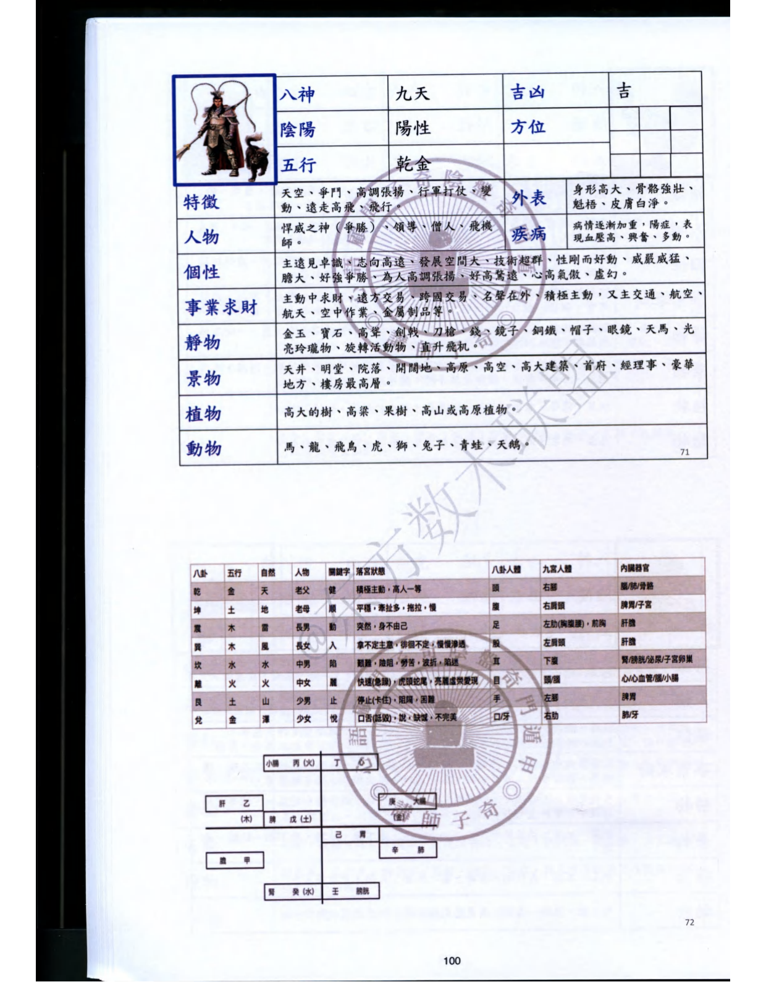

> **🖼 圖像解讀**　｜　檢視狀態：✅ 已檢視
> - **類型**：八神類象表＋八卦人體總表＋天干臟腑圖（中級班投影片 71–72）
> - **內容**：九天（陽性、乾金、吉）：天空、爭鬥、高調張揚、行軍打仗、變動、遠走高飛、飛行，人物悍威之神（爭勝）、領導、僧人、飛機師，疾病病情逐漸加重、陽症、表現血壓高興奮多動，事業動中求財、遠方跨國交易、名聲在外、交通航空航天；投影片 72 為八卦總表（五行、自然、人物、關鍵字、落宮狀態、八卦人體、九宮人體、內臟器官），並附十天干對應臟腑示意圖（甲膽、乙肝、丙小腸、丁心、戊脾、己胃、庚大腸、辛肺、壬膀胱、癸腎）。
> - **原文出處（逐字）**：八神類象表「九天／陽性／乾金／吉」；八卦總表（投影片 72）
> - **可檢索關鍵字**：九天, 高調張揚, 遠走高飛, 陽症血壓高, 八卦總表, 九宮人體, 內臟器官, 天干臟腑

**📝 逐字謄寫（第 102 頁）**

### 九天類象表（投影片 71）

| 項目 | 內容 |
|---|---|
| 八神／陰陽 | 九天／陽性 |
| 五行／方位 | 乾金／（空白） |
| 吉凶 | 吉 |
| 特徵 | 天空、爭鬥、高調張揚、行軍打仗、變動、遠走高飛、飛行。 |
| 外表 | 身形高大、骨骼強壯、魁梧、皮膚白淨。 |
| 人物 | 悍威之神（爭勝）、領導、僧人、飛機師。 |
| 疾病 | 病情逐漸加重，陽症，表現血壓高、興奮、多動。 |
| 個性 | 主遠見卓識、志向高遠、發展空間大、技術超群、性剛而好動、威嚴威猛、膽大、好強爭勝、為人高調張揚、好高騖遠、心高氣傲、虛幻。 |
| 事業求財 | 主動中求財，遠方交易，跨國交易，名聲在外，積極主動，又主交通、航空、航天、空中作業、金屬制品等。 |
| 靜物 | 金玉、寶石、高聳、劍戟、刀槍、錢、鏡子、銅鐵、帽子、眼鏡、天馬、光亮玲瓏物、旋轉活動物、直升飛机。 |
| 景物 | 天井、明堂、院落、開闊地、高原、高空、高大建築、首府、經理事、豪華地方、樓房最高層。 |
| 植物 | 高大的樹、高粱、果樹、高山或高原植物。 |
| 動物 | 馬、龍、飛鳥、虎、獅、兔子、青蛙、天鵝。 |

### 八卦總表（投影片 72）

| 八卦 | 五行 | 自然 | 人物 | 關鍵字 | 落宮狀態 | 八卦人體 | 九宮人體 | 內臟器官 |
|---|---|---|---|---|---|---|---|---|
| 乾 | 金 | 天 | 老父 | 健 | 積極主動，高人一等 | 頭 | 右腳 | 腦/肺/骨骼 |
| 坤 | 土 | 地 | 老母 | 順 | 平穩，牽扯多，拖拉，慢 | 腹 | 右肩頭 | 脾胃/子宮 |
| 震 | 木 | 雷 | 長男 | 動 | 突然，身不由己 | 足 | 左肋(胸腹腰)，前胸 | 肝膽 |
| 巽 | 木 | 風 | 長女 | 入 | 拿不定主意，徘徊不定，慢慢滲透 | 股 | 左肩頭 | 肝膽 |
| 坎 | 水 | 水 | 中男 | 陷 | 艱難，險阻，勞苦，波折，陷迷 | 耳 | 下腹 | 腎/膀胱/泌尿/子宮卵巢 |
| 離 | 火 | 火 | 中女 | 麗 | 快速(急躁)，虎頭蛇尾，亮麗虛榮愛現 | 目 | 頭/腦 | 心/心血管/腦/小腸 |
| 艮 | 土 | 山 | 少男 | 止 | 停止(卡住)，阻隔，困難 | 手 | 左腳 | 脾胃 |
| 兌 | 金 | 澤 | 少女 | 悅 | 口舌(話毀)，說，缺憾，不完美 | 口/牙 | 右肋 | 肺/牙 |

十天干臟腑示意圖（依圖中框線照錄）：
- 上：小腸 丙（火）｜丁 心
- 左：肝 乙（木）；脾 戊（土）；膽 甲
- 右：庚 大腸（金）；己 胃；辛 肺
- 下：腎 癸（水）｜壬 膀胱

（註：圖中「脾 戊」「己 胃」原文如此。頁碼：100）

## 圖 103 — 第 103 頁（1240x1617）｜🖼 圖片（開圖判斷：圖表細看／裝飾照簡述）

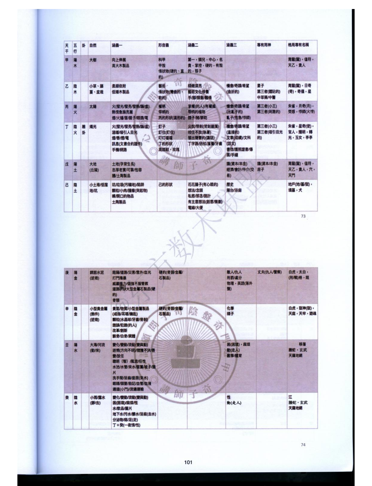

> **🖼 圖像解讀**　｜　檢視狀態：✅ 已檢視
> - **類型**：十天干象意總表（中級班投影片 73–74）
> - **內容**：十天干總整理表，欄位為天干、五行、卦、自然、涵義一、形音義、涵義二、涵義三、專有用神、格局專有名稱。例：甲為大樹、頭兒中心名貴掌控，格局名青龍值符天乙貴人；乙為小草藤蔓、柔順依附藝術，專有用神妻子、第三者、中醫，格局名日奇；丙為太陽、權柄亂子，用神第三者（小王），格局名朱雀月奇、熒惑悖師；丁為燭光、離卦、尖銳咬住不放、文書訊息，用神第三者（小三），格局名星奇玉女；戊為大地、錢（資本本金），格局名天門；己為坑垃圾、花花腸子想法念頭私慾，格局名地戶墳墓；庚為鋼筋水泥、阻隔道路災害打鬥，用神丈夫（仇人／警察），格局名白虎太白；辛為小型貴金屬、錯誤犯錯改革，格局名獄神天庭天牢；壬為大海河流、變化流動迷惘，格局名騰蛇玄武天羅地網；癸為小雨露水、困境麻煩性，格局名騰蛇玄武天羅地網。
> - **原文出處（逐字）**：十天干總表（投影片 73–74，無標題）
> - **可檢索關鍵字**：十天干總表, 形音義, 專有用神, 格局專有名稱, 青龍值符, 朱雀熒惑, 白虎太白, 天羅地網

**📝 逐字謄寫（第 103 頁）**

### 十天干象意總表（投影片 73：甲～己）

| 天干 | 五行 | 卦 | 自然 | 涵義一 | 形音義 | 涵義二 | 涵義三 | 專有用神 | 格局專有名稱 |
|---|---|---|---|---|---|---|---|---|---|
| 甲 | 陽木 | | 大樹 | 向上伸展；高大木製品 | 科甲；甲殼；條狀物(硬的、直的) | 第一，頭兒，中心，名貴，掌控，硬的，有殼的，筷子 | | | 青龍(龍)，值符，天乙，貴人 |
| 乙 | 陰木 | | 小草、藤蔓、盆栽 | 柔順依附；低矮木製品 | 藝術；條狀物(彎曲的、軟的) | 精緻漂亮；藝術文化修養；手/腳/頭髮/體條 | 機會/奇蹟/希望(曲折的) | 妻子；第三者(體貼的)；中草藥/中醫 | 青龍(龍)，日奇(奇)，奇儀，星 |
| 丙 | 陽火 | | 太陽 | 火(發光/發亮/發熱/誇/虛)；熱情急躁亮麗；燈/火爐/窗/鏡子/眼鏡/電 | 權柄；帶柄的；丙的形狀(圓形的) | 掌權(的人)/有權威；帶柄的植物；餅子/豬/餅乾 | 機會/奇蹟/希望(出亂子的)；亂子(性急/悖師) | 第三者(小王)；第三者(刺激的) | 朱雀，月奇(月)，熒惑，悖師(火悖) |
| 丁 | 陰火 | 離卦 | 燭光 | 火(發光/發亮/發熱/誇/虛)；溫暖/吸引人目光；燈/香/煙/電；訊息(文書合約證件)；手機/網路 | 釘子；釘住(盯住)；叮叮噹噹；丁的形狀；高跟鞋、玫瑰 | 尖銳/帶刺(苛刻嚴厲)；咬住不放(執著)；發出聲響的(講話)；丁字路/拐杖/屋簷/牙齒 | 機會/奇蹟/希望(直接的)；文章(成績)/文科(語文)；書信/護照證書/傳票/手續 | 第三者(小三)；第三者(吸引目光的) | 朱雀，星奇(使)，官人，耀明，轉光，玉女，亭亭 |
| 戊 | 陽土 | | 大地(丘陵) | 土地(孕育生長)；忠厚老實/可靠/包容；牆/土陶製品 | | | 錢(資本/本金)；經濟/會計/仲介(交易) | 錢(資本/本金)；房子 | 青龍(龍)，值符，天乙，貴人，穴，天門 |
| 己 | 陰土 | | 小土堆/低窪地/坑 | 坑/垃圾(污穢地)/陷阱；顆粒/小肉/腫瘤(突起物)；嘴/開口的物品；土陶製品 | 己的形狀 | 花花腸子(有心眼的)；想法/念頭；私慾/邪念/詭計；有主意想法(創意/策劃)；電線/大便 | 歷史；陽台/浴廁 | | 地戶(地/墓/獄)，墳墓，犬 |

### 十天干象意總表（投影片 74：庚～癸）

| 天干 | 五行 | 卦 | 自然 | 涵義一 | 形音義 | 涵義二 | 涵義三 | 專有用神 | 格局專有名稱 |
|---|---|---|---|---|---|---|---|---|---|
| 庚 | 陽金 | | 鋼筋水泥(逆商) | 阻隔/道路/災害/意外/血光；打鬥殘暴；威嚴魄力/倔強不服管教；道路〔此處有疊字，圖中未能辨識〕/大型金屬石製品(硬的)；骨頭 | 硬的(骨頭/金屬/石製品) | | 敵人/仇人；刑罰/處分；物理，英語(落外盤) | 丈夫(仇人/警察) | 白虎，太白，(刑/戰)格，阻 |
| 辛 | 陰金 | | 小型貴金屬(飾件)(逆商) | 貴氣/物質/小型金屬製品(戒指/耳環/鑰匙)；顆粒(水晶球/牙齒/骨刺)；錯誤/犯錯(的人)；改革/創新；骸骨/白骨/屍體 | 硬的(骨頭/金屬/石製品) | | 化學；精子 | | 白虎，獄神(獄)，天庭，天牢，遊魂 |
| 壬 | 陽水 | | 大海/河流(動/來) | 變化/變動/流動(變與動)；迷惘(方向不明)/猶豫不決/善變/放任；聰明(智)/風流/任性；水池/水管/來水/窗簾/被子/圖片；洗手間/浴廁/廚房(來水)；眼睛/頭髮/胎記/血管/血液；通道(小門)/流通運輸 | | | 困(困境)，麻煩；動(走人)；數學/體育 | | 移蕩；騰蛇，玄武；天羅地網 |
| 癸 | 陰水 | | 小雨/露水(靜/去) | 變化/變動/流動(變與動)；困(困境)/麻煩/性；水/飲品/圖片；地下水/污水/髒水/浴廁(去水)；分泌物/痣/足(走)；丁+癸(一夜情/性) | | | 性；動(走人) | | 江；騰蛇，玄武；天羅地網 |

（頁碼：101）

## 圖 104 — 第 104 頁（1240x1617）｜🖼 圖片（開圖判斷：圖表細看／裝飾照簡述）

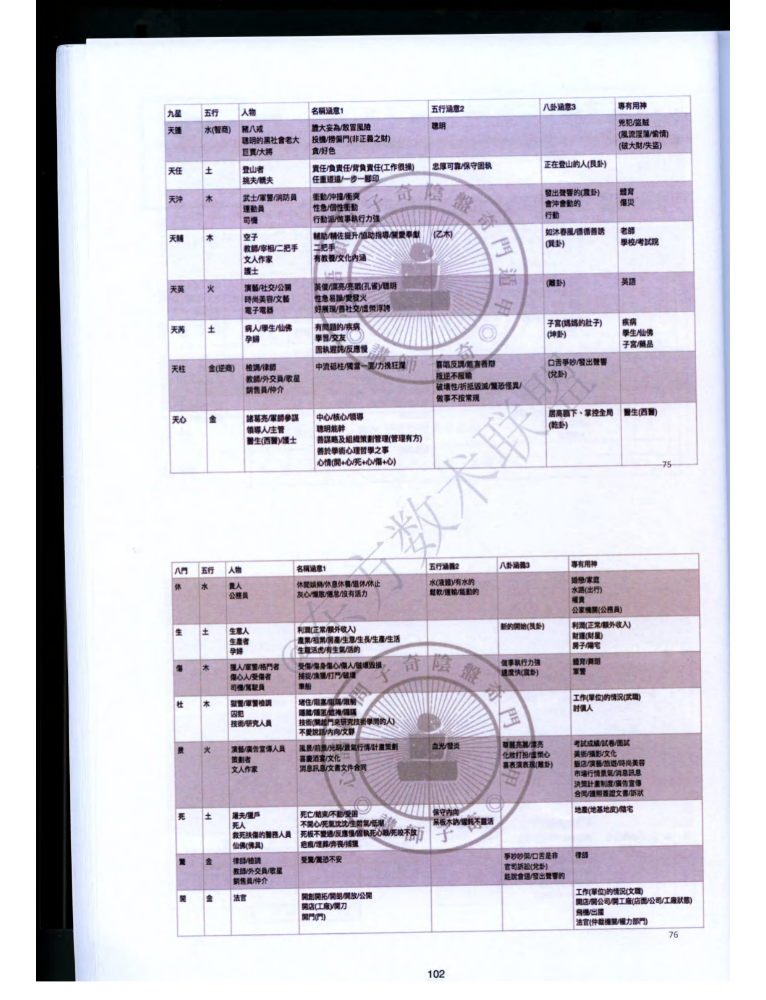

> **🖼 圖像解讀**　｜　檢視狀態：✅ 已檢視
> - **類型**：九星、八門象意總表（中級班投影片 75–76）
> - **內容**：投影片 75 九星總表（欄位：九星、五行、人物、名稱涵意1、五行涵意2、八卦涵意3、專有用神），例：天蓬水（智商）主膽大妄為、投機撈偏門、貪好色，專有用神兇犯盜賊、風流偷情、破大財失盜；天輔專有用神老師、學校考試院；天英專有用神英語；天芮專有用神疾病、學生仙佛、子宮藥品；天心專有用神醫生（西醫）。投影片 76 八門總表（同欄位），例：休門專有用神婚戀家庭、水路出行、權貴、公家機關；生門為利潤財運、房子陽宅；杜門為工作單位情況（武職）、討債人；景門為考試成績、市場行情、合同訴狀；死門為地產陰宅；驚門為律師；開門為工作單位情況（文職）、開店、飛機出國、法官。
> - **原文出處（逐字）**：九星總表（投影片 75）；八門總表（投影片 76）
> - **可檢索關鍵字**：九星總表, 八門總表, 專有用神, 天蓬破財失盜, 天輔考試, 天心西醫, 生門財運, 開門文職

**📝 逐字謄寫（第 104 頁）**

### 九星象意總表（投影片 75）

| 九星 | 五行 | 人物 | 名稱涵意1 | 五行涵意2 | 八卦涵意3 | 專有用神 |
|---|---|---|---|---|---|---|
| 天蓬 | 水(智商) | 豬八戒；聰明的黑社會老大；巨賈/大將 | 膽大妄為/敢冒風險；投機/撈偏門(非正義之財)；貪/好色 | 聰明 | | 兇犯/盜賊；(風流淫蕩/偷情)；(破大財/失盜) |
| 天任 | 土 | 登山者；挑夫/轎夫 | 責任/負責任/背負責任(工作很操)；任重道遠/一步一腳印 | 忠厚可靠/保守固執 | 正在登山的人(艮卦) | |
| 天沖 | 木 | 武士/軍警/消防員；運動員；司機 | 衝動/沖撞/衝突；性急/個性衝動；行動派/做事執行力強 | | 發出聲響的(震卦)；會沖會動的；行動 | 體育；傷災 |
| 天輔 | 木 | 孔子；教師/宰相/二把手；文人作家；護士 | 輔助/輔佐提升/協助指導/關愛奉獻；二把手；有教養/文化內涵 | (乙木) | 如沐春風/循循善誘(巽卦) | 老師；學校/考試院 |
| 天英 | 火 | 演藝/社交/公關；時尚美容/文藝；電子電器 | 英俊/漂亮/亮眼(孔雀)/聰明；性急易躁/愛發火；好展現/善社交/虛榮浮誇 | | (離卦) | 英語 |
| 天芮 | 土 | 病人/學生/仙佛；孕婦 | 有問題的/疾病；學習/交友；固執遲鈍/反應慢 | | 子宮(媽媽的肚子)(坤卦) | 疾病；學生/仙佛；子宮/藥品 |
| 天柱 | 金(逆商) | 檢調/律師；教師/外交員/歌星；銷售員/仲介 | 中流砥柱/獨當一面/力挽狂瀾 | 喜唱反調/能言善辯；叛逆不服輸；破壞性/折抵毀滅/驚恐怪異/做事不按常規 | 口舌爭吵/發出聲響(兌卦) | |
| 天心 | 金 | 諸葛亮/軍師參謀；領導人/主管；醫生(西醫)/護士 | 中心/核心/領導；聰明能幹；善謀略及組織策劃管理(管理有方)；善於學術心理哲學之事；心情(開+心/死+心/傷+心) | | 居高臨下、掌控全局(乾卦) | 醫生(西醫) |

（註：天輔「人物」首詞印作「空子」，依上下文應為「孔子」。）

### 八門象意總表（投影片 76）

| 八門 | 五行 | 人物 | 名稱涵意1 | 五行涵意2 | 八卦涵意3 | 專有用神 |
|---|---|---|---|---|---|---|
| 休 | 水 | 貴人；公務員 | 休閒娛樂/休息休養/退休/休止；灰心/懶散/倦怠/沒有活力 | 水(液體)/有水的；鬆軟/運輸/能動的 | | 婚戀/家庭；水路(出行)；權貴；公家機關(公務員) |
| 生 | 土 | 生意人；生產者；孕婦 | 利潤(正常/額外收入)；產業/祖業/房產/生息/生長/生產/生活；生龍活虎/有生氣/活的 | | 新的開始(艮卦) | 利潤(正常/額外收入)；財運(財星)；房子/陽宅 |
| 傷 | 木 | 獵人/軍警/格鬥者；傷心人/受傷者；司機/駕駛員 | 受傷/傷身傷心/傷人/破壞毀損；捕捉/漁獵/打鬥/破壞；車船 | | 做事執行力強；速度快(震卦) | 體育/舞蹈；軍警 |
| 杜 | 木 | 獄警/軍警檢調；囚犯；技術/研究人員 | 堵住/阻塞/阻隔/限制；隱藏/隱匿/遮掩/隱瞞；技術(關起門來研究技術學問的人)；不愛說話/內向/文靜 | | | 工作(單位)的情況(武職)；討債人 |
| 景 | 火 | 演藝/廣告宣傳人員；策劃者；文人作家 | 風景/前景/光明/景氣行情/計畫策劃；喜慶酒宴/文化；消息訊息/文書文件合同 | 血光/發炎 | 華麗亮麗/漂亮；化妝打扮/虛榮心；喜表演表現(離卦) | 考試成績/試卷/面試；美術/攝影/文化；飯店/演藝/旅遊/時尚美容；市場行情景氣/消息訊息；決策計畫制度/廣告宣傳；合同/護照簽證文書/訴狀 |
| 死 | 土 | 屠夫/獵戶；死人；救死扶傷的醫務人員；仙佛(佛具) | 死亡/結束/不動/受困；不開心/死氣沈沈/生悶氣/低潮；死板不變通/反應慢/固執死心眼/死咬不放；疤痕/埋葬/奔喪/捕獵 | 保守內向；呆板木訥/遲鈍不靈活 | | 地產(地基地皮)/陰宅 |
| 驚 | 金 | 律師/檢調；教師/外交員/歌星；銷售員/仲介 | 受驚/驚恐不安 | | 爭吵吵架/口舌是非；官司訴訟(兌卦)；能說會道/發出聲響的 | 律師 |
| 開 | 金 | 法官 | 開創開拓/開朗/開放/公開；開店(工廠)/開刀；開門(門) | | | 工作(單位)的情況(文職)；開店/開公司/開工廠(店面/公司/工廠狀態)；飛機/出國；法官(仲裁機關/權力部門) |

（頁碼：102）

## 圖 105 — 第 105 頁（1240x1617）｜🖼 圖片（開圖判斷：圖表細看／裝飾照簡述）

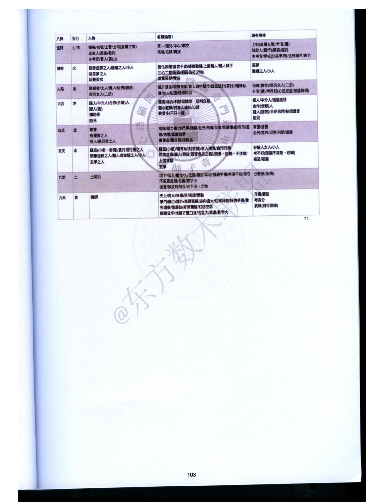

> **🖼 圖像解讀**　｜　檢視狀態：✅ 已檢視
> - **類型**：八神象意總表（中級班投影片 77，頁面下半空白）
> - **內容**：八神總表（欄位：八神、五行、人物、名稱涵意1、專有用神）：值符（土/木）領袖老闆上司、高檔名牌真貨，用神上司升官、放款人原告裁判、主考官學校金榜題名政治；騰蛇（火）虛詐反覆、假貨惡夢，用神惡夢、難纏之人小人；太陰（金）策劃者貴人仙佛、密謀暗助，用神仙佛、升官考得好；六合（木）媒人中介合作人、婚姻交易，用神婚姻感情、合約結婚證書、胎兒；白虎（金）軍警、阻隔血光災害官司道路，用神軍警、血光意外刑罰道路；玄武（水）竊盜貪污頭暈迷糊玄學，用神騙人小人、考不好、被盜被騙；九地（土）土地公、地下緩慢低調數字小，用神分數低（落榜）；九天（金）機師、天上高大快速高調數字大，用神升遷驛動、考高分、航線。
> - **原文出處（逐字）**：八神總表（投影片 77）
> - **可檢索關鍵字**：八神總表, 專有用神, 值符金榜題名, 騰蛇小人, 六合婚姻合約, 玄武被盜被騙, 九地落榜, 九天考高分

**📝 逐字謄寫（第 105 頁）**

### 八神象意總表（投影片 77）

| 八神 | 五行 | 人物 | 名稱涵意1 | 專有用神 |
|---|---|---|---|---|
| 值符 | 土/木 | 領袖/老板/主管/上司(直屬主管)；放款人/原告/裁判；主考官/貴人(靠山) | 第一/頭兒/中心/掌控；高檔/名牌/真貨 | 上司(直屬主管)/升官(遷)；放款人(銀行)/原告/裁判；主考官/學校(知名學府)/金榜題名/政治 |
| 騰蛇 | 火 | 狡猾虛詐之人/難纏之人/小人；做惡夢之人；妖艷美女 | 變化反覆/虛詐不實/纏繞難纏/上當騙人/纏人棘手；三心二意/假貨(假冒偽劣之物)；虛驚惡夢/彎曲 | 惡夢；難纏之人/小人 |
| 太陰 | 金 | 策劃者/文人/貴人/仙佛(觀音)；漂亮女人(二奶) | 提升護佑/密謀策劃/貴人暗中幫忙/陰謀詭計(算計)/曖昧私通/女人私通/精緻物品 | 仙佛(觀音)/漂亮女人(二奶)；升官(遷)/考得好(心思細膩/頭腦聰明) |
| 六合 | 木 | 媒人/中介人/合作(合夥)人；證人(物)；彌勒佛；胎兒 | 護衛/媒合/利婚姻嫁娶，談判交易；開心歡樂/討喜人緣佳/口講；數量多(不只一樣) | 媒人/中介人/婚姻感情；合作(合夥)人；證人(證物)/合約合同/結婚證書；胎兒 |
| 白虎 | 金 | 軍警；有權勢之人；病人/遇災害之人 | 阻隔/阻力壓力/鬥爭/殘暴/血光/刑傷/災害/危險事故/官司/道路/遇警/威嚴強勢；重要品/殘次品/損耗品 | 軍警/遇警；血光/意外/災害/刑罰/道路 |
| 玄武 | 水 | 竊盜(小偷，偷情)/貪污或行賄之人；頭暈迷糊之人/騙人或被騙之人/小人；玄學之人 | 竊盜(小偷)/暗有私情(偷情)/有人搞鬼/貪污行賄；謊言虛假/騙人/假貨(假冒偽劣之物)/頭暈、迷糊、不清楚/上當被騙；玄學 | 好騙人之人/小人；考不好(頭腦不清楚，迷糊)；被盜/被騙 |
| 九地 | 土 | 土地公 | 地下/低下/緩慢/久/低調/穩定/本地/發展平穩/停滯不前/保守；不敢冒風險/低處/數字小；老舊/存放時間長/地下出土之物 | 分數低(落榜) |
| 九天 | 金 | 機師 | 天上/高大/快速/近/高調/變動；爭鬥/飛行/國外/高調張揚/志向遠大/性剛好動/好強爭勝/聲名遠揚/發展快/好高騖遠/幻想空想；暢銷貨/外地遠方進口貨/名氣大/高處/數字大 | 升遷/驛動；考高分；航線(飛行路線) |

（本頁下半空白。頁碼：103）

## 圖 106 — 第 106 頁（1240x1617）｜🖼 圖片（開圖判斷：圖表細看／裝飾照簡述）

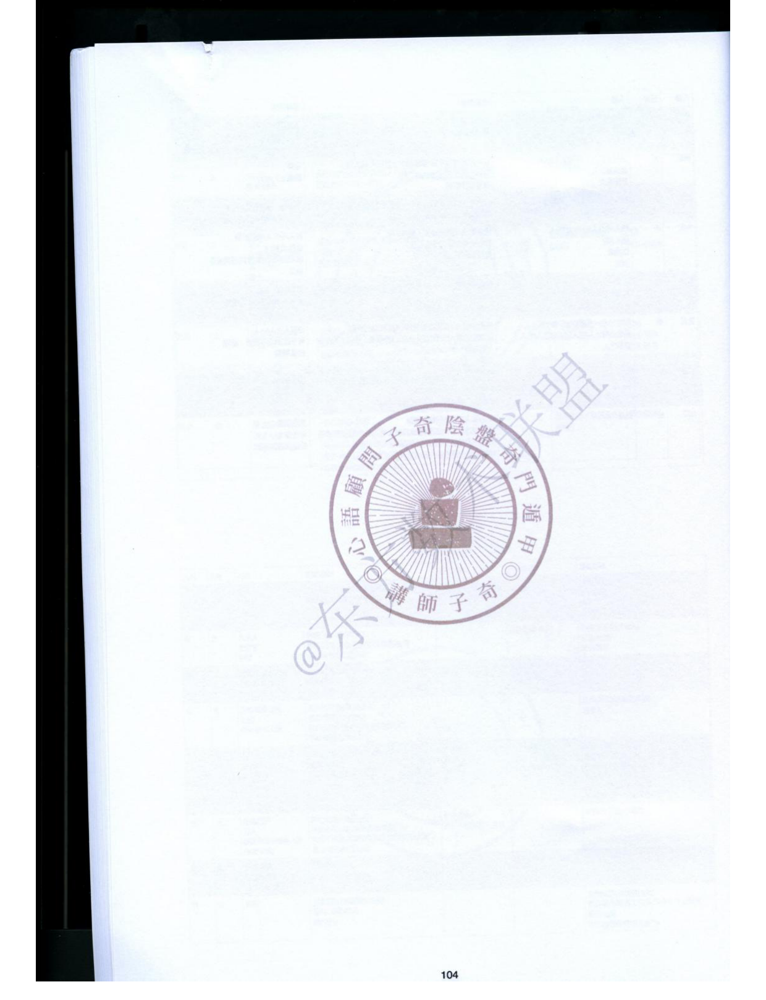

> **🖼 圖像解讀**　｜　檢視狀態：✅ 已檢視
> - **類型**：空白頁（僅印章與浮水印）
> - **內容**：空白頁，只有「心語顧問 子奇陰盤奇門遁甲 講師子奇」圓形印章與「@东方数术联盟」浮水印，背面前頁表格淡淡透印，無正文內容。頁碼 104。
> - **原文出處（逐字）**：（空白頁）
> - **可檢索關鍵字**：空白頁, 印章, 浮水印

**📝 逐字謄寫（第 106 頁）**

（空白頁：只有圓形印章「心語顧問 子奇陰盤奇門遁甲 講師子奇」與斜向浮水印「@东方数术联盟」；紙背透印的表格不可辨識，非本頁內容。頁碼：104）

## 圖 107 — 第 107 頁（1240x1617）｜🖼 圖片（開圖判斷：圖表細看／裝飾照簡述）

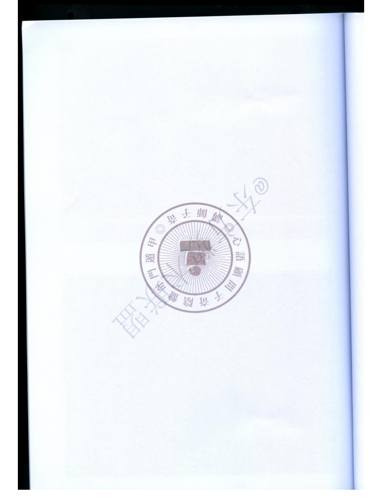

> **🖼 圖像解讀**　｜　檢視狀態：✅ 已檢視
> - **類型**：空白頁（僅倒置印章與浮水印）
> - **內容**：空白頁，只有上下顛倒的「心語顧問 子奇陰盤奇門遁甲 講師子奇」圓形印章與「@东方数术联盟」浮水印，無正文內容、無頁碼。
> - **原文出處（逐字）**：（空白頁）
> - **可檢索關鍵字**：空白頁, 印章, 浮水印

**📝 逐字謄寫（第 107 頁）**

（空白頁：只有倒置的圓形印章與「@东方数术联盟」浮水印，無正文。）

## 圖 108 — 第 108 頁（1240x1617）｜🖼 圖片（開圖判斷：圖表細看／裝飾照簡述）

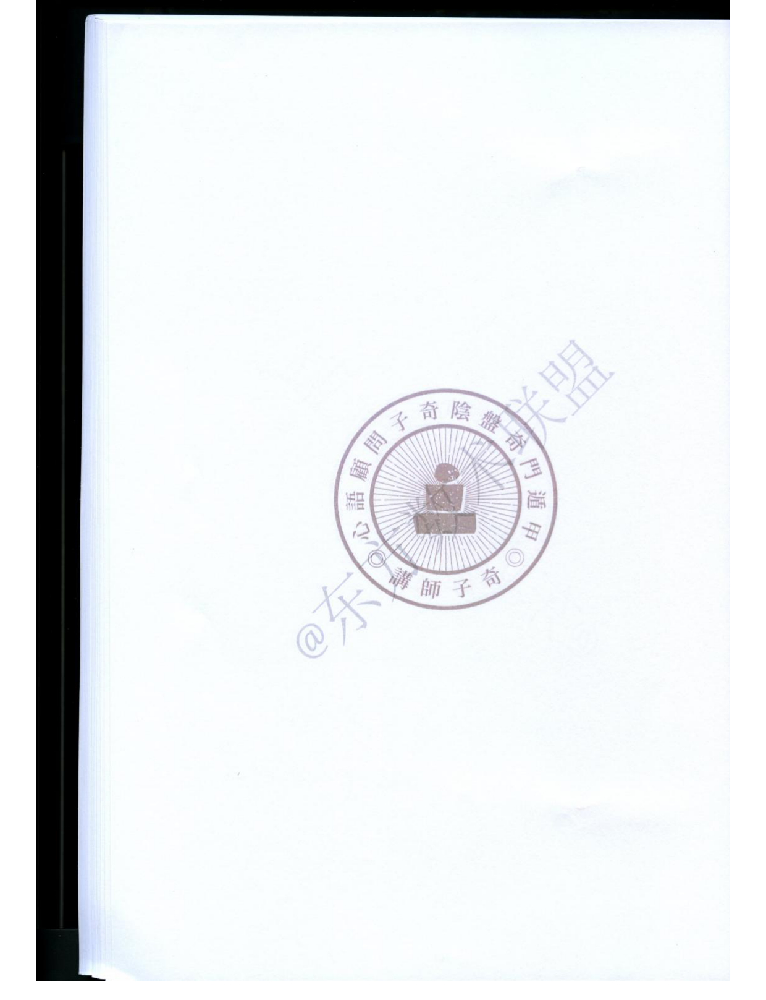

> **🖼 圖像解讀**　｜　檢視狀態：✅ 已檢視
> - **類型**：空白頁（僅印章與浮水印）
> - **內容**：空白頁，只有「心語顧問 子奇陰盤奇門遁甲 講師子奇」圓形印章與「@东方数术联盟」浮水印，無正文內容、無頁碼。
> - **原文出處（逐字）**：（空白頁）
> - **可檢索關鍵字**：空白頁, 印章, 浮水印

**📝 逐字謄寫（第 108 頁）**

（空白頁：只有圓形印章與「@东方数术联盟」浮水印，無正文。）

## 圖 109 — 第 109 頁（1240x1617）｜🖼 圖片（開圖判斷：圖表細看／裝飾照簡述）

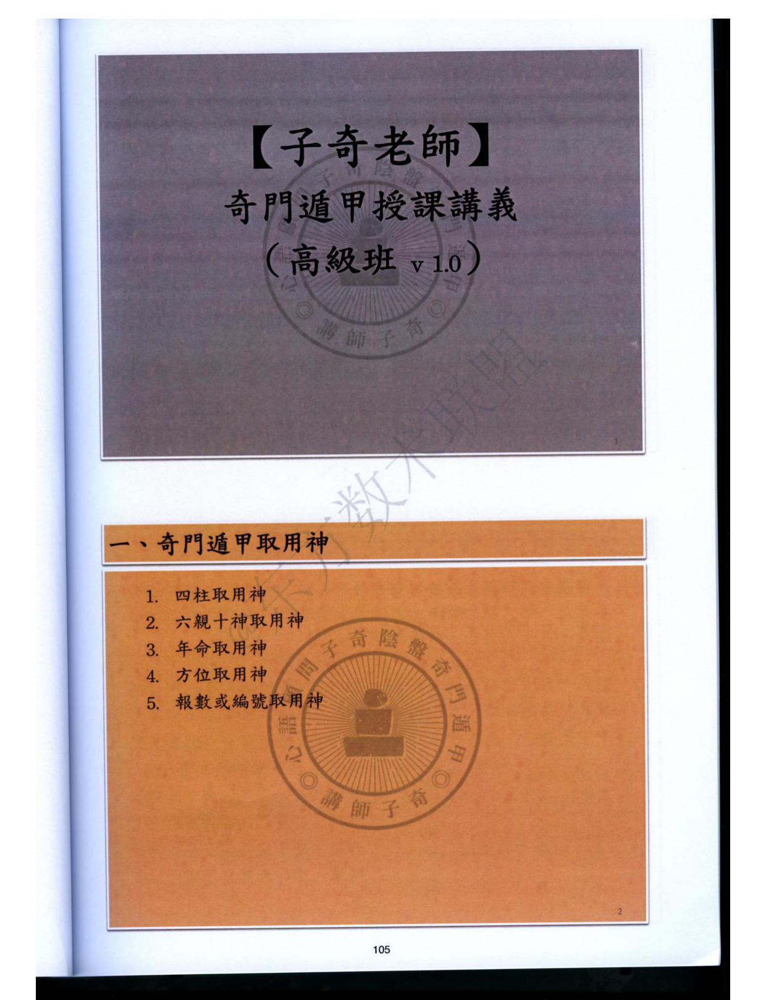

> **🖼 圖像解讀**　｜　檢視狀態：✅ 已檢視
> - **類型**：文字頁／目錄（高級班投影片 1–2）
> - **內容**：高級班講義標題頁「【子奇老師】奇門遁甲授課講義（高級班 v1.0）」及第一章「奇門遁甲取用神」目錄：四柱取用神、六親十神取用神、年命取用神、方位取用神、報數或編號取用神；頁面有講師子奇圓印與東方數術聯盟浮水印，頁碼 105。
> - **原文出處（逐字）**：【子奇老師】奇門遁甲授課講義（高級班 v1.0）；一、奇門遁甲取用神
> - **可檢索關鍵字**：高級班, 取用神, 四柱取用神, 六親十神, 年命取用神, 方位取用神, 報數編號取用神

**📝 逐字謄寫（第 109 頁）**

### 【子奇老師】奇門遁甲授課講義（高級班 v1.0）（投影片 1）

### 一、奇門遁甲取用神（投影片 2）

1. 四柱取用神
2. 六親十神取用神
3. 年命取用神
4. 方位取用神
5. 報數或編號取用神

（頁碼：105）

## 圖 110 — 第 110 頁（1240x1617）｜🖼 圖片（開圖判斷：圖表細看／裝飾照簡述）

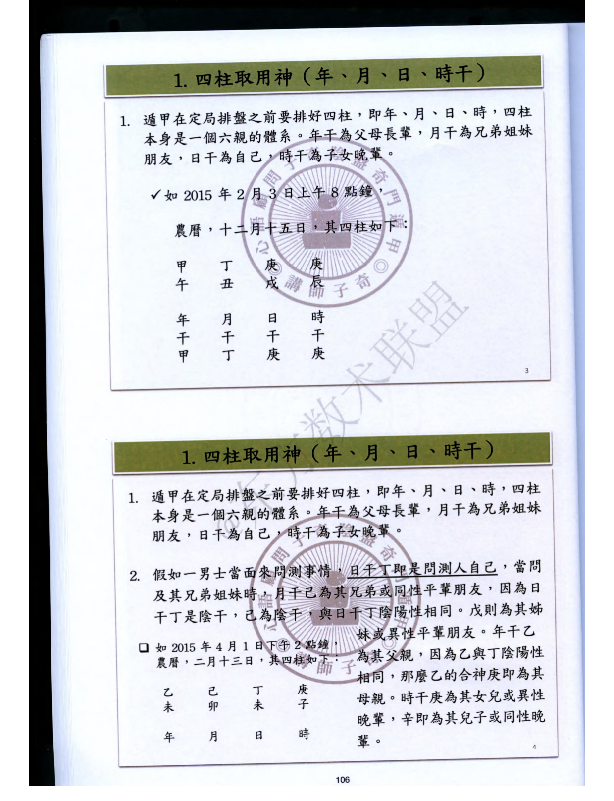

> **🖼 圖像解讀**　｜　檢視狀態：✅ 已檢視
> - **類型**：文字頁（高級班投影片 3–4）
> - **內容**：「四柱取用神（年、月、日、時干）」：四柱本身是六親體系——年干為父母長輩、月干為兄弟姊妹朋友、日干為自己、時干為子女晚輩；例 2015年2月3日上午8點四柱年干甲、月干丁、日干庚、時干庚。再以男士問兄弟姊妹為例（2015年4月1日下午2點，四柱乙未、己卯、丁未、庚子）：日干丁為問測人，月干己（同陰陽）為兄弟或同性平輩，戊為姊妹或異性平輩；年干乙為父親，乙的合神庚為母親；時干庚為女兒或異性晚輩，辛為兒子或同性晚輩。
> - **原文出處（逐字）**：1. 四柱取用神（年、月、日、時干）
> - **可檢索關鍵字**：四柱取用神, 年干父母, 月干兄弟, 日干自己, 時干子女, 陰陽同性異性, 合神為母, 六親體系

**📝 逐字謄寫（第 110 頁）**

### 1. 四柱取用神（年、月、日、時干）（投影片 3）

1. 遁甲在定局排盤之前要排好四柱，即年、月、日、時，四柱本身是一個六親的體系。年干為父母長輩，月干為兄弟姐妹朋友，日干為自己，時干為子女晚輩。

   ✓ 如 2015 年 2 月 3 日上午 8 點鐘，農曆，十二月十五日，其四柱如下：

| 年 | 月 | 日 | 時 |
|---|---|---|---|
| 甲午 | 丁丑 | 庚戌 | 庚辰 |
| 年干：甲 | 月干：丁 | 日干：庚 | 時干：庚 |

### 1. 四柱取用神（年、月、日、時干）（投影片 4）

1. 遁甲在定局排盤之前要排好四柱，即年、月、日、時，四柱本身是一個六親的體系。年干為父母長輩，月干為兄弟姐妹朋友，日干為自己，時干為子女晚輩。
2. 假如一男士當面來問測事情，日干丁即是問測人自己，當問及其兄弟姐妹時，月干己為其兄弟或同性平輩朋友，因為日干丁是陰干，己為陰干，與日干丁陰陽性相同。戊則為其姊妹或異性平輩朋友。年干乙為其父親，因為乙與丁陰陽性相同，那麼乙的合神庚即為其母親。時干庚為其女兒或異性晚輩，辛即為其兒子或同性晚輩。

   ☐ 如 2015 年 4 月 1 日下午 2 點鐘，農曆，二月十三日，其四柱如下：

| 年 | 月 | 日 | 時 |
|---|---|---|---|
| 乙未 | 己卯 | 丁未 | 庚子 |

（註：原文「下午 2 點鐘」而時柱為庚子，照錄。頁碼：106）

## 圖 111 — 第 111 頁（1240x1617）｜🖼 圖片（開圖判斷：圖表細看／裝飾照簡述）

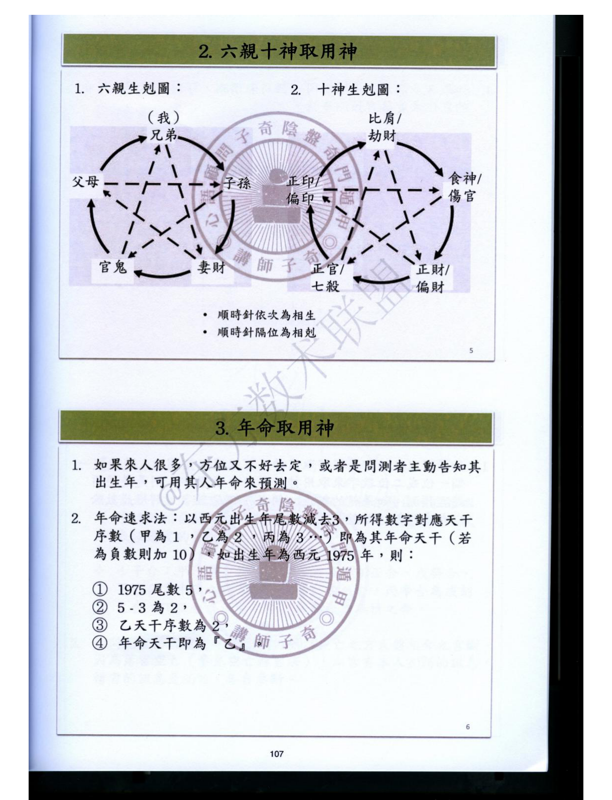

> **🖼 圖像解讀**　｜　檢視狀態：✅ 已檢視
> - **類型**：生剋圖＋文字頁（高級班投影片 5–6）
> - **內容**：「六親十神取用神」：六親生剋圖（我／兄弟→子孫→妻財→官鬼→父母→兄弟）與十神生剋圖（比肩劫財→食神傷官→正財偏財→正官七殺→正印偏印→比肩劫財），順時針依次為相生、隔位為相剋；「年命取用神」：人多方位難定或問測者告知出生年時，用年命預測；年命速求法：西元出生年尾數減 3 對應天干序數（負數加 10），例 1975 年：5－3＝2，乙為第 2，年命天干為乙。
> - **原文出處（逐字）**：2. 六親十神取用神；3. 年命取用神
> - **可檢索關鍵字**：六親生剋圖, 十神生剋圖, 比肩劫財, 食神傷官, 正官七殺, 年命取用神, 年命速求法, 尾數減三

**📝 逐字謄寫（第 111 頁）**

### 2. 六親十神取用神（投影片 5）

1. 六親生剋圖：
   （我）兄弟 → 子孫 → 妻財 → 官鬼 → 父母 → 兄弟（外圈實線箭頭相生；內部五角星虛線相剋）
2. 十神生剋圖：
   比肩/劫財 → 食神/傷官 → 正財/偏財 → 正官/七殺 → 正印/偏印 → 比肩/劫財

- 順時針依次為相生
- 順時針隔位為相剋

### 3. 年命取用神（投影片 6）

1. 如果來人很多，方位又不好去定，或者是問測者主動告知其出生年，可用其人年命來預測。
2. 年命速求法：以西元出生年尾數減去3，所得數字對應天干序數（甲為 1，乙為 2，丙為 3…）即為其年命天干（若為負數則加 10），如出生年為西元 1975 年，則：
   - ① 1975 尾數 5，
   - ② 5 - 3 為 2，
   - ③ 乙天干序數為 2，
   - ④ 年命天干即為『乙』。

（頁碼：107）

## 圖 112 — 第 112 頁（1240x1617）｜🖼 圖片（開圖判斷：圖表細看／裝飾照簡述）

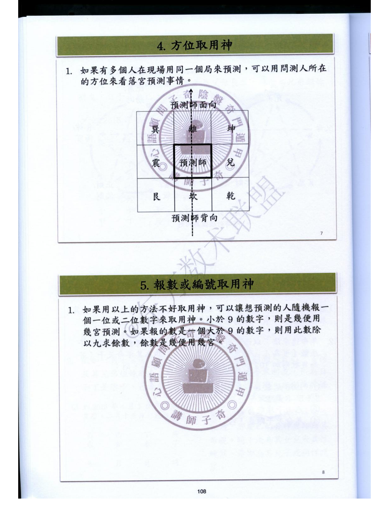

> **🖼 圖像解讀**　｜　檢視狀態：✅ 已檢視
> - **類型**：九宮方位圖＋文字頁（高級班投影片 7–8）
> - **內容**：「方位取用神」：多人在現場用同一局預測時，以問測人所在方位看落宮；圖示預測師坐中宮，面向為離、背向為坎，左震右兌，四隅巽坤艮乾。「報數或編號取用神」：以上方法不好取用神時，讓問測人隨機報一位或二位數字，小於 9 即用幾宮，大於 9 則除以九取餘數，餘數是幾便用幾宮。
> - **原文出處（逐字）**：4. 方位取用神；5. 報數或編號取用神
> - **可檢索關鍵字**：方位取用神, 預測師面向, 問測人方位, 報數取用神, 編號取用神, 除九取餘, 隨機數字

**📝 逐字謄寫（第 112 頁）**

### 4. 方位取用神（投影片 7）

1. 如果有多個人在現場用同一個局來預測，可以用問測人所在的方位來看落宮預測事情。

（上方標「預測師面向」，下方標「預測師背向」，中宮以粗框標「預測師」）

| 巽 | 離 | 坤 |
|---|---|---|
| 震 | **預測師** | 兌 |
| 艮 | 坎 | 乾 |

### 5. 報數或編號取用神（投影片 8）

1. 如果用以上的方法不好取用神，可以讓想預測的人隨機報一個一位或二位數字來取用神。小於 9 的數字，則是幾便用幾宮預測。如果報的數是一個大於 9 的數字，則用此數除以九求餘數，餘數是幾便用幾宮。

（頁碼：108）

## 圖 113 — 第 113 頁（1240x1617）｜🖼 圖片（開圖判斷：圖表細看／裝飾照簡述）

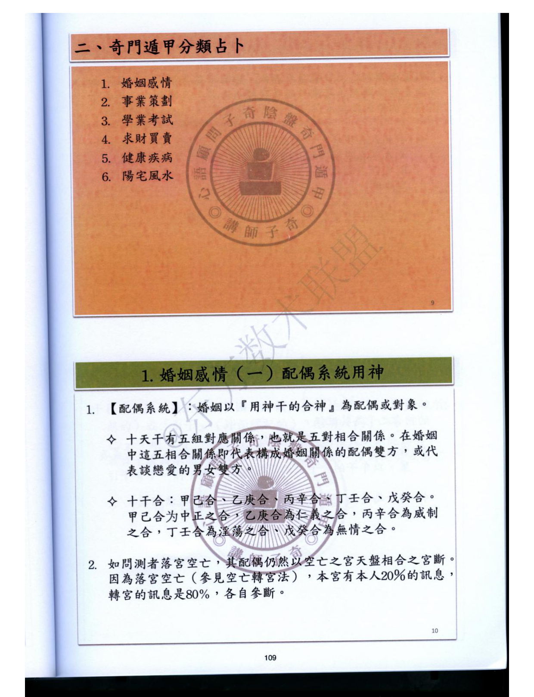

> **🖼 圖像解讀**　｜　檢視狀態：✅ 已檢視
> - **類型**：目錄＋文字頁（高級班投影片 9–10）
> - **內容**：第二章「奇門遁甲分類占卜」目錄：婚姻感情、事業策劃、學業考試、求財買賣、健康疾病、陽宅風水。「婚姻感情（一）配偶系統用神」：婚姻以用神干的合神為配偶或對象；十干五合（甲己、乙庚、丙辛、丁壬、戊癸）代表婚姻或戀愛雙方，甲己為中正之合、乙庚為仁義之合、丙辛為威制之合、丁壬為淫蕩之合、戊癸為無情之合；問測者落宮空亡時，配偶仍以空亡宮天盤相合之宮斷，本宮 20%、轉宮 80% 訊息各自參斷。
> - **原文出處（逐字）**：二、奇門遁甲分類占卜；1. 婚姻感情（一）配偶系統用神
> - **可檢索關鍵字**：分類占卜, 婚姻感情, 配偶系統, 合神為配偶, 十干五合, 中正之合, 淫蕩之合, 無情之合

**📝 逐字謄寫（第 113 頁）**

### 二、奇門遁甲分類占卜（投影片 9）

1. 婚姻感情
2. 事業策劃
3. 學業考試
4. 求財買賣
5. 健康疾病
6. 陽宅風水

### 1. 婚姻感情（一）配偶系統用神（投影片 10）

1. 【配偶系統】：婚姻以『用神干的合神』為配偶或對象。
   - ✧ 十天干有五組對應關係，也就是五對相合關係。在婚姻中這五相合關係即代表構成婚姻關係的配偶雙方，或代表談戀愛的男女雙方。
   - ✧ 十干合：甲己合、乙庚合、丙辛合、丁壬合、戊癸合。甲己合为中正之合，乙庚合為仁義之合，丙辛合為威制之合，丁壬合為淫蕩之合，戊癸合為無情之合。
2. 如問測者落宮空亡，其配偶仍然以空亡之宮天盤相合之宮斷。因為落宮空亡（參見空亡轉宮法），本宮有本人20%的訊息，轉宮的訊息是80%，各自參斷。

（頁碼：109）

## 圖 114 — 第 114 頁（1240x1617）｜🖼 圖片（開圖判斷：圖表細看／裝飾照簡述）

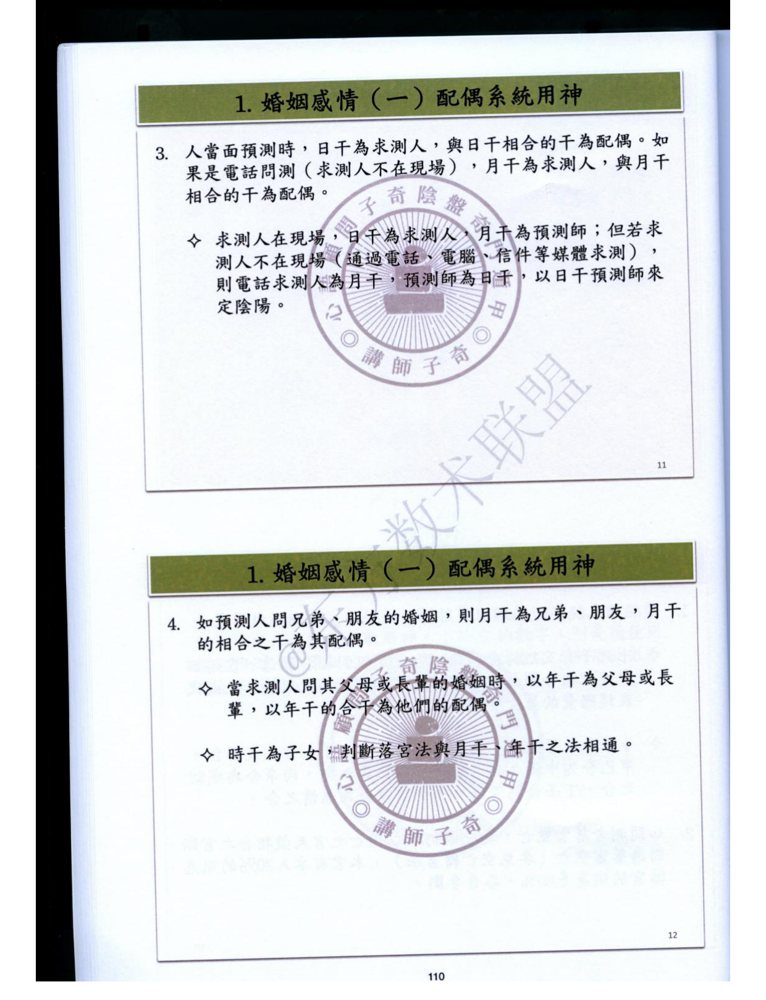

> **🖼 圖像解讀**　｜　檢視狀態：✅ 已檢視
> - **類型**：文字頁（高級班投影片 11–12）
> - **內容**：配偶系統用神續：當面預測時日干為求測人、與日干相合之干為配偶；電話問測（求測人不在現場）則月干為求測人、與月干相合之干為配偶，預測師為日干並以日干定陰陽。問兄弟朋友的婚姻，以月干為兄弟朋友、月干合干為其配偶；問父母長輩婚姻以年干及其合干；時干為子女，判斷法相通。
> - **原文出處（逐字）**：1. 婚姻感情（一）配偶系統用神（投影片 11–12）
> - **可檢索關鍵字**：日干求測人, 電話問測, 月干求測人, 預測師日干, 兄弟朋友婚姻, 父母婚姻年干, 子女時干, 合干配偶

**📝 逐字謄寫（第 114 頁）**

### 1. 婚姻感情（一）配偶系統用神（投影片 11）

3. 人當面預測時，日干為求測人，與日干相合的干為配偶。如果是電話問測（求測人不在現場），月干為求測人，與月干相合的干為配偶。
   - ✧ 求測人在現場，日干為求測人，月干為預測師；但若求測人不在現場（通過電話、電腦、信件等媒體求測），則電話求測人為月干，預測師為日干，以日干預測師來定陰陽。

### 1. 婚姻感情（一）配偶系統用神（投影片 12）

4. 如預測人問兄弟、朋友的婚姻，則月干為兄弟、朋友，月干的相合之干為其配偶。
   - ✧ 當求測人問其父母或長輩的婚姻時，以年干為父母或長輩，以年干的合干為他們的配偶。
   - ✧ 時干為子女，判斷落宮法與月干、年干之法相通。

（頁碼：110）

## 圖 115 — 第 115 頁（1240x1617）｜🖼 圖片（開圖判斷：圖表細看／裝飾照簡述）

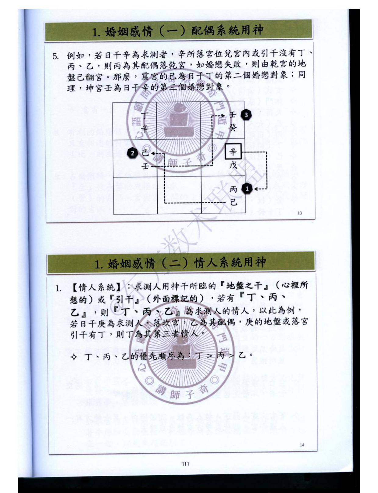

> **🖼 圖像解讀**　｜　檢視狀態：✅ 已檢視
> - **類型**：文字＋九宮示意圖（高級班投影片 13–14）
> - **內容**：配偶系統例：日干辛為求測者落兌宮，宮內或引干無丁丙乙，則丙為其配偶（落乾宮）；婚戀失敗則由乾宮地盤己翻宮，震宮己為第二個婚戀對象，同理坤宮壬為第三個（翻宮順序以 1、2、3 標示）。「婚姻感情（二）情人系統用神」：求測人用神干所臨的地盤之干（心裡所想的）或引干（外面標記的）若有丁丙乙，即為其情人；例日干庚落坎宮、乙為配偶，若庚的地盤或落宮引干有丁，則丁為第三者情人；丁、丙、乙優先順序為丁＞丙＞乙。
> - **原文出處（逐字）**：1. 婚姻感情（一）配偶系統用神（投影片 13）；1. 婚姻感情（二）情人系統用神（投影片 14）
> - **可檢索關鍵字**：婚戀翻宮, 第二個婚戀對象, 情人系統, 地盤之干心裡所想, 引干外面標記, 丁丙乙情人, 第三者, 優先順序

**📝 逐字謄寫（第 115 頁）**

### 1. 婚姻感情（一）配偶系統用神（投影片 13）

5. 例如，若日干辛為求測者，辛所落宮位兌宮內或引干沒有丁、丙、乙，則丙為其配偶落乾宮，如婚戀失敗，則由乾宮的地盤己翻宮。那麼，震宮的己為日干丁的第二個婚戀對象；同理，坤宮壬為日干辛的第三個婚戀對象。

（註：原文「日干丁的第二個婚戀對象」，依上下文應為「日干辛」，照錄。）

示意九宮（每宮：天盤／地盤；只標相關宮）：

| 巽：丁／辛 | （離） | 坤：壬 ③／癸 |
|---|---|---|
| 震：己 ②／壬 | （中） | 兌：［辛］／戊 |
| （艮） | （坎） | 乾：丙 ①／己 |

（虛線箭頭：兌宮辛 → 乾宮丙①；乾宮地盤己 → 震宮天盤己②；震宮地盤壬 → 坤宮天盤壬③）

### 1. 婚姻感情（二）情人系統用神（投影片 14）

1. 【情人系統】：求測人用神干所臨的『**地盤之干**』（心裡所想的）或『**引干**』（外面標記的），若有『**丁、丙、乙**』，則『**丁、丙、乙**』為求測人的情人，以此為例，若日干庚為求測人，落坎宮，乙為其配偶，庚的地盤或落宮引干有丁，則丁為其第三者情人。
   - ✧ 丁、丙、乙的優先順序為：丁 ＞ 丙 ＞ 乙。

（頁碼：111）

## 圖 116 — 第 116 頁（1240x1617）｜🖼 圖片（開圖判斷：圖表細看／裝飾照簡述）

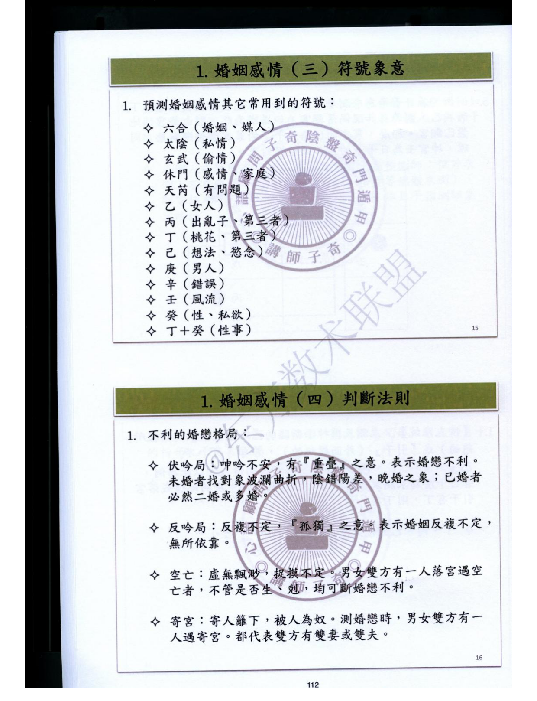

> **🖼 圖像解讀**　｜　檢視狀態：✅ 已檢視
> - **類型**：文字頁（高級班投影片 15–16）
> - **內容**：「婚姻感情（三）符號象意」：常用符號——六合（婚姻、媒人）、太陰（私情）、玄武（偷情）、休門（感情家庭）、天芮（有問題）、乙（女人）、丙（出亂子、第三者）、丁（桃花、第三者）、己（想法、慾念）、庚（男人）、辛（錯誤）、壬（風流）、癸（性、私欲）、丁＋癸（性事）。「（四）判斷法則」不利婚戀格局：伏吟（重疊，未婚者曲折晚婚、已婚者二婚或多婚）、反吟（反覆不定、孤獨無依）、空亡（虛無飄渺，一方落空亡即斷婚戀不利）、寄宮（寄人籬下，一方遇寄宮代表有雙妻或雙夫）。
> - **原文出處（逐字）**：1. 婚姻感情（三）符號象意；1. 婚姻感情（四）判斷法則
> - **可檢索關鍵字**：婚姻符號象意, 六合媒人, 太陰私情, 玄武偷情, 丁桃花, 伏吟二婚, 反吟孤獨, 寄宮雙妻雙夫

**📝 逐字謄寫（第 116 頁）**

### 1. 婚姻感情（三）符號象意（投影片 15）

1. 預測婚姻感情其它常用到的符號：
   - ✧ 六合（婚姻、媒人）
   - ✧ 太陰（私情）
   - ✧ 玄武（偷情）
   - ✧ 休門（感情、家庭）
   - ✧ 天芮（有問題）
   - ✧ 乙（女人）
   - ✧ 丙（出亂子、第三者）
   - ✧ 丁（桃花、第三者）
   - ✧ 己（想法、慾念）
   - ✧ 庚（男人）
   - ✧ 辛（錯誤）
   - ✧ 壬（風流）
   - ✧ 癸（性、私欲）
   - ✧ 丁＋癸（性事）

### 1. 婚姻感情（四）判斷法則（投影片 16）

1. 不利的婚戀格局：
   - ✧ 伏吟局：呻吟不安，有『重疊』之意。表示婚戀不利。未婚者找對象波瀾曲折，陰錯陽差，晚婚之象；已婚者必然二婚或多婚。
   - ✧ 反吟局：反複不定，『孤獨』之意。表示婚姻反複不定，無所依靠。
   - ✧ 空亡：虛無飄渺，捉摸不定。男女雙方有一人落宮遇空亡者，不管是否生、剋，均可斷婚戀不利。
   - ✧ 寄宮：寄人籬下，被人為奴。測婚戀時，男女雙方有一人遇寄宮。都代表雙方有雙妻或雙夫。

（頁碼：112）

## 圖 117 — 第 117 頁（1240x1617）｜🖼 圖片（開圖判斷：圖表細看／裝飾照簡述）

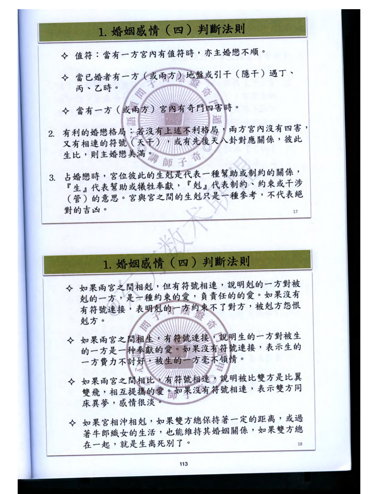

> **🖼 圖像解讀**　｜　檢視狀態：✅ 已檢視
> - **類型**：文字頁（高級班投影片 17–18）
> - **內容**：婚戀判斷法則續：一方宮內有值符亦主婚戀不順；已婚者一方或雙方地盤或引干遇丁丙乙；一方或雙方宮內有奇門四害。有利婚戀格局：無上述不利格局、無四害，又有相連符號（天干）或先後天八卦對應，彼此生比則婚戀美滿。宮位生剋代表幫助或制約：生為幫助犧牲奉獻、剋為制約約束干涉，只作參考；相剋而有符號相連為約束負責的愛，無則被剋方怨恨；相生有符號連接為奉獻的愛，無則費力不討好；相比有符號相連為比翼雙飛，無則同床異夢；相沖相剋若保持距離如牛郎織女尚能維持，總在一起則生離死別。
> - **原文出處（逐字）**：1. 婚姻感情（四）判斷法則（投影片 17–18）
> - **可檢索關鍵字**：婚戀判斷法則, 值符婚戀不順, 有利婚戀格局, 符號相連, 宮位生剋, 約束的愛, 奉獻的愛, 同床異夢

**📝 逐字謄寫（第 117 頁）**

### 1. 婚姻感情（四）判斷法則（投影片 17）

- ✧ 值符：當有一方宮內有值符時，亦主婚戀不順。
- ✧ 當已婚者有一方（或兩方）地盤或引干（隱干）遇丁、丙、乙時。
- ✧ 當有一方（或兩方）宮內有奇門四害時。

2. 有利的婚戀格局：若沒有上述不利格局，兩方宮內沒有四害，又有相連的符號（天干），或有先後天八卦對應關係，彼此生比，則主婚戀美滿。
3. 占婚戀時，宮位彼此的生剋是代表一種幫助或制約的關係，『生』代表幫助或犧牲奉獻，『剋』代表制約、約束或干涉（管）的意思。宮與宮之間的生剋只是一種參考，不代表絕對的吉凶。

### 1. 婚姻感情（四）判斷法則（投影片 18）

- ✧ 如果兩宮之間相剋，但有符號相連，說明剋的一方對被剋的一方，是一種約束的愛，負責任的的愛。如果沒有有符號連接，表明剋的一方約束不了對方，被剋方怨恨剋方。
- ✧ 如果兩宮之間相生，有符號連接，說明生的一方對被生的一方是一种奉獻的愛。如果沒有符號連接，表示生的一方費力不討好，被生的一方毫不領情。
- ✧ 如果兩宮之間相比，有符號相連，說明被比雙方是比翼雙飛，相互提攜的愛。如果沒有符號相連，表示雙方同床異夢，感情很淡。
- ✧ 如果宮相沖相剋，如果雙方總保持著一定的距離，或過著牛郎織女的生活，也能維持其婚姻關係，如果雙方總在一起，就是生离死別了。

（頁碼：113）

## 圖 118 — 第 118 頁（1240x1617）｜🖼 圖片（開圖判斷：圖表細看／裝飾照簡述）

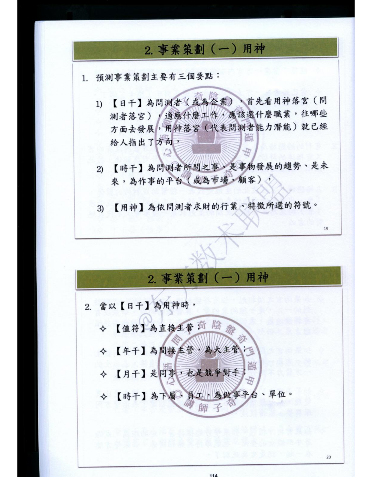

> **🖼 圖像解讀**　｜　檢視狀態：✅ 已檢視
> - **類型**：文字頁（高級班投影片 19–20）
> - **內容**：「事業策劃（一）用神」：預測事業策劃三要點——日干為問測者（或企業），看其落宮可知適應什麼工作、往哪方面發展（代表能力潛能）；時干為所問之事、事物發展趨勢、未來、作事平台（或市場顧客）；用神為依求財行業特徵所選符號。以日干為用神時：值符為直接主管、年干為間接主管（大主管）、月干為同事也是競爭對手、時干為下屬員工與做事平台單位。
> - **原文出處（逐字）**：2. 事業策劃（一）用神（投影片 19–20）
> - **可檢索關鍵字**：事業策劃, 日干問測者, 時干所問之事, 作事平台, 值符直接主管, 年干大主管, 月干同事競爭, 時干下屬

**📝 逐字謄寫（第 118 頁）**

### 2. 事業策劃（一）用神（投影片 19）

1. 預測事業策劃主要有三個要點：
   1) 【日干】為問測者（或為企業），首先看用神落宮（問測者落宮），適應什麼工作，應該選什麼職業，往哪些方面去發展，用神落宮（代表問測者能力潛能）就已經給人指出了方向，
   2) 【時干】為問測者所問之事、是事物發展的趨勢、是未來，為作事的平台（或為市場、顧客），
   3) 【用神】為依問測者求財的行業、特徵所選的符號。

### 2. 事業策劃（一）用神（投影片 20）

2. 當以【日干】為用神時，
   - ✧ 【值符】為直接主管，
   - ✧ 【年干】為間接主管，為大主管；
   - ✧ 【月干】是同事，也是競爭對手；
   - ✧ 【時干】為下屬、員工，為做事平台、單位。

（頁碼：114）

## 圖 119 — 第 119 頁（1240x1617）｜🖼 圖片（開圖判斷：圖表細看／裝飾照簡述）

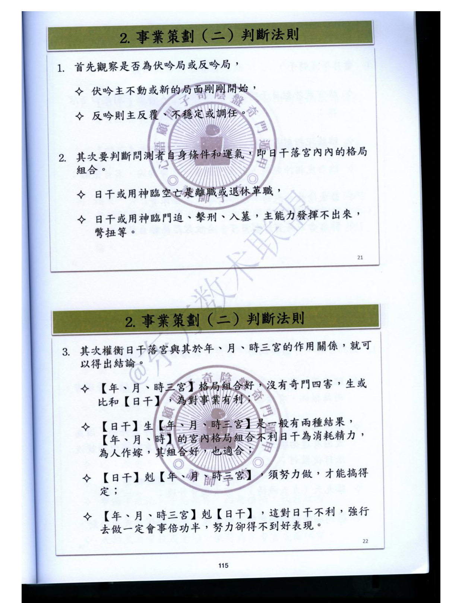

> **🖼 圖像解讀**　｜　檢視狀態：✅ 已檢視
> - **類型**：文字頁（高級班投影片 21–22）
> - **內容**：「事業策劃（二）判斷法則」：先看是否伏吟（主不動或新局面剛開始）或反吟（主反覆、不穩定或調任）；再看日干落宮格局判斷問測者自身條件與運氣——日干或用神臨空亡是離職或退休革職，臨門迫、擊刑、入墓主能力發揮不出、彆扭；再權衡日干與年月時三宮的作用：三宮格局好無四害且生比日干對事業有利，日干生三宮為消耗精力、為人作嫁（格局好也適合），日干剋三宮須努力才搞得定，三宮剋日干則事倍功半。
> - **原文出處（逐字）**：2. 事業策劃（二）判斷法則（投影片 21–22）
> - **可檢索關鍵字**：事業判斷法則, 伏吟不動, 反吟調任, 空亡離職, 入墓能力難發揮, 為人作嫁, 事倍功半, 年月時三宮

**📝 逐字謄寫（第 119 頁）**

### 2. 事業策劃（二）判斷法則（投影片 21）

1. 首先觀察是否為伏吟局或反吟局，
   - ✧ 伏吟主不動或新的局面剛剛開始，
   - ✧ 反吟則主反覆、不穩定或調任。
2. 其次要判斷問測者自身條件和運氣，即日干落宮內內的格局組合。
   - ✧ 日干或用神臨空亡是離職或退休革職，
   - ✧ 日干或用神臨門迫、擊刑、入墓，主能力發揮不出來，彆扭等。

### 2. 事業策劃（二）判斷法則（投影片 22）

3. 其次權衡日干落宮與其於年、月、時三宮的作用關係，就可以得出結論。
   - ✧ 【年、月、時三宮】格局組合好，沒有奇門四害，生或比和【日干】，為對事業有利；
   - ✧ 【日干】生【年、月、時三宮】是一般有兩種結果，【年、月、時】的宮內格局組合不利日干為消耗精力，為人作嫁，其組合好，也適合；
   - ✧ 【日干】剋【年、月、時三宮】，須努力做，才能搞得定；
   - ✧ 【年、月、時三宮】剋【日干】，這對日干不利，強行去做一定會事倍功半，努力卻得不到好表現。

（頁碼：115）

## 圖 120 — 第 120 頁（1240x1617）｜🖼 圖片（開圖判斷：圖表細看／裝飾照簡述）

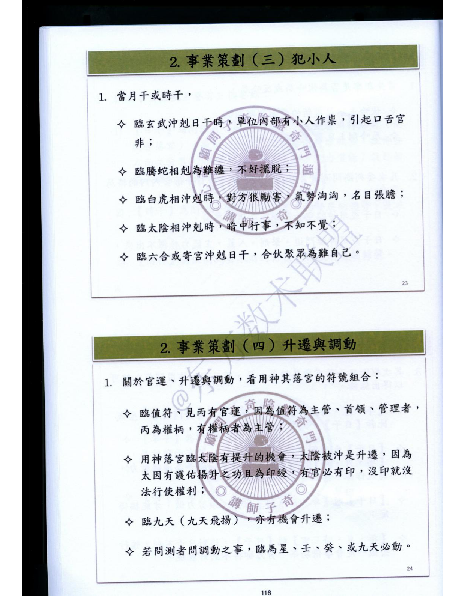

> **🖼 圖像解讀**　｜　檢視狀態：✅ 已檢視
> - **類型**：文字頁（高級班投影片 23–24）
> - **內容**：「事業策劃（三）犯小人」：月干或時干臨玄武沖剋日干，單位內部有小人作祟引起口舌官非；臨騰蛇相剋為難纏不好擺脫；臨白虎相沖剋，對方厲害氣勢洶洶；臨太陰相沖剋，暗中行事不知不覺；臨六合或寄宮沖剋日干，合伙聚眾為難自己。「（四）升遷與調動」：用神臨值符、見丙有官運；落宮臨太陰有提升機會，太陰被沖是升遷（太陰為印綬，有官必有印）；臨九天亦有機會升遷；問調動臨馬星、壬、癸或九天必動。
> - **原文出處（逐字）**：2. 事業策劃（三）犯小人；2. 事業策劃（四）升遷與調動
> - **可檢索關鍵字**：犯小人, 玄武口舌官非, 騰蛇難纏, 白虎氣勢洶洶, 升遷調動, 值符丙官運, 太陰印綬, 馬星必動

**📝 逐字謄寫（第 120 頁）**

### 2. 事業策劃（三）犯小人（投影片 23）

1. 當月干或時干，
   - ✧ 臨玄武沖剋日干時，單位內部有小人作祟，引起口舌官非；
   - ✧ 臨騰蛇相剋為難纏，不好擺脫；
   - ✧ 臨白虎相沖剋時，對方很厲害，氣勢洶洶，名目張膽；
   - ✧ 臨太陰相沖剋時，暗中行事，不知不覺；
   - ✧ 臨六合或寄宮沖剋日干，合伙聚眾為難自己。

### 2. 事業策劃（四）升遷與調動（投影片 24）

1. 關於官運、升遷與調動，看用神其落宮的符號組合：
   - ✧ 臨值符、見丙有官運，因為值符為主管、首領、管理者，丙為權柄，有權柄者為主管；
   - ✧ 用神落宮臨太陰有提升的機會，太陰被沖是升遷，因為太因有護佑揚升之功且為印綬，有官必有印，沒印就沒法行使權利；
   - ✧ 臨九天（九天飛揚），亦有機會升遷；
   - ✧ 若問測者問調動之事，臨馬星、壬、癸、或九天必動。

（頁碼：116）

## 圖 121 — 第 121 頁（1240x1617）｜🖼 圖片（開圖判斷：圖表細看／裝飾照簡述）

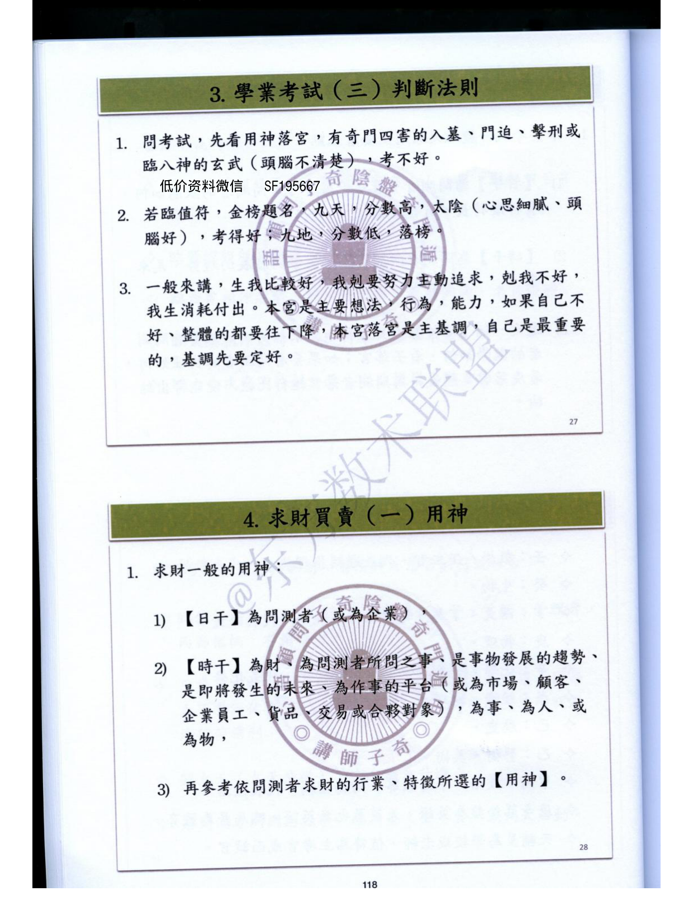

> **🖼 圖像解讀**　｜　檢視狀態：✅ 已檢視
> - **類型**：文字頁（高級班投影片 27–28）
> - **內容**：「學業考試（三）判斷法則」：問考試先看用神落宮，有入墓、門迫、擊刑或臨玄武（頭腦不清楚）考不好；臨值符金榜題名、九天分數高、太陰（心思細膩頭腦好）考得好、九地分數低落榜；一般生我較好、我剋要努力追求、剋我不好、我生消耗付出，本宮是主要想法行為能力，本宮落宮是主基調。「求財買賣（一）用神」：日干為問測者（或企業）；時干為財、所問之事、事物發展趨勢、即將發生的未來、作事平台（市場、顧客、員工、貨品、交易或合夥對象）；再參考依求財行業特徵所選的用神。（注意：掃描檔缺原講義第 117 頁，即學業考試（一）（二）投影片 25–26。）
> - **原文出處（逐字）**：3. 學業考試（三）判斷法則；4. 求財買賣（一）用神
> - **可檢索關鍵字**：學業考試, 考試判斷法則, 值符金榜題名, 九地落榜, 玄武考不好, 求財買賣, 時干為財, 本宮主基調

**📝 逐字謄寫（第 121 頁）**

（註：本頁原講義頁碼 118；前一掃描頁為第 116 頁，原講義第 117 頁〔高級班投影片 25–26，學業考試（一）（二）〕未包含在此 PDF 中。）

### 3. 學業考試（三）判斷法則（投影片 27）

1. 問考試，先看用神落宮，有奇門四害的入墓、門迫、擊刑或臨八神的玄武（頭腦不清楚），考不好。〔此處夾有轉售浮水印，略〕
2. 若臨值符，金榜題名，九天，分數高，太陰（心思細膩、頭腦好），考得好，九地，分數低，落榜。
3. 一般來講，生我比較好，我剋要努力主動追求，剋我不好，我生消耗付出。本宮是主要想法，行為，能力，如果自己不好、整體的都要往下降，本宮落宮是主基調，自己是最重要的，基調先要定好。

### 4. 求財買賣（一）用神（投影片 28）

1. 求財一般的用神：
   1) 【日干】為問測者（或為企業），
   2) 【時干】為財、為問測者所問之事、是事物發展的趨勢、是即將發生的未來、為作事的平台（或為市場、顧客、企業員工、貨品、交易或合夥對象），為事、為人、或為物，
   3) 再參考依問測者求財的行業、特徵所選的【用神】。

（頁碼：118）

## 圖 122 — 第 122 頁（1240x1617）｜🖼 圖片（開圖判斷：圖表細看／裝飾照簡述）

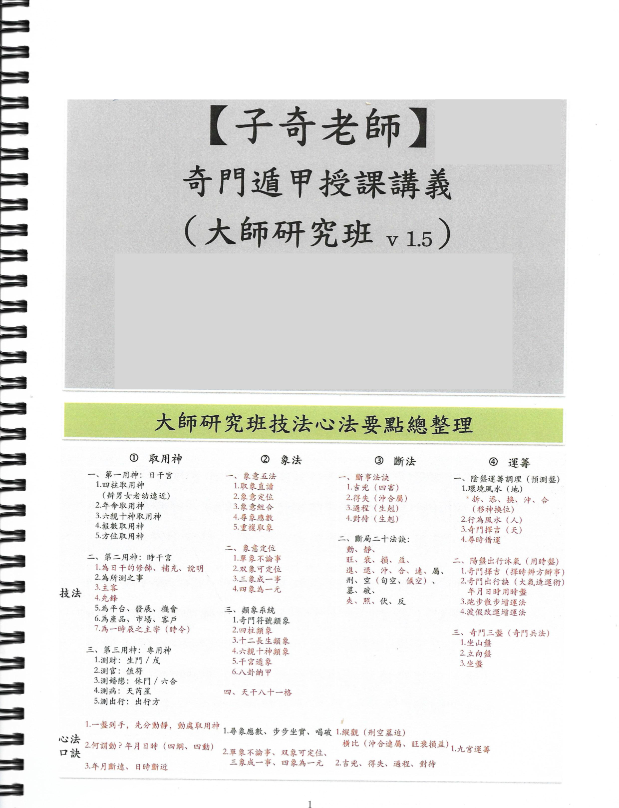

> **🖼 圖像解讀**　｜　檢視狀態：✅ 已檢視
> - **類型**：標題頁＋心法總整理表（大師研究班）
> - **內容**：「【子奇老師】奇門遁甲授課講義（大師研究班 v1.5）」標題頁（高級班內容在此中斷，未見健康疾病、陽宅風水等後續投影片），下接「大師研究班技法心法要點總整理」四欄總表：①取用神（第一用神日干宮、第二用神時干宮、第三用神專用神）②象法（象意五法、象意定位、類象系統、天干八十一格）③斷法（斷事法訣吉凶得失過程對待、斷局二十法訣）④運籌（陰盤運籌調理、陽盤出行沐氣、奇門三盤），另附各欄心法口訣。本頁頁碼 1，裝訂方式與前冊不同（有線圈）。
> - **原文出處（逐字）**：【子奇老師】奇門遁甲授課講義（大師研究班 v1.5）；大師研究班技法心法要點總整理
> - **可檢索關鍵字**：大師研究班, 心法總整理, 取用神, 象法, 斷法, 運籌, 斷局二十法訣, 移神換位

**📝 逐字謄寫（第 122 頁）**

### 【子奇老師】奇門遁甲授課講義（大師研究班 v1.5）

（標題下方有一灰色塗蓋區塊）

### 大師研究班技法心法要點總整理

**技法**

| ① 取用神 | ② 象法 | ③ 斷法 | ④ 運籌 |
|---|---|---|---|
| 一、第一用神：日干宮 1.四柱取用神（辨男女老幼遠近） 2.年命取用神 3.六親十神取用神 4.報數取用神 5.方位取用神  二、第二用神：時干宮 1.為日干的修飾、補充、說明 2.為所測之事 3.主客 4.先鋒 5.為平台、發展、機會 6.為產品、市場、客戶 7.為一時辰之主宰（時令）  三、第三用神：專用神 1.測財：生門／戊 2.測官：值符 3.測婚戀：休門／六合 4.測病：天芮星 5.測出行：出行方 | 一、象意五法 1.取象直讀 2.象意定位 3.象意組合 4.尋象應數 5.重複取象  二、象意定位 1.單象不論事 2.双象可定位 3.三象成一事 4.四象為一元  三、類象系統 1.奇門符號類象 2.四柱類象 3.十二長生類象 4.六親十神類象 5.干宮通象 6.八卦納甲  四、天干八十一格 | 一、斷事法訣 1.吉凶（四害） 2.得失（沖合屬） 3.過程（生剋） 4.對待（生剋）  二、斷局二十法訣： 動、靜、 旺、衰、損、益、 進、退、沖、合、連、屬、 刑、空（旬空、儀空）、 墓、破、 夾、照、伏、反 | 一、陰盤運籌調理（預測盤） 1.環境風水（地） ＊拆、添、換、沖、合（移神換位） 2.行為風水（人） 3.奇門擇吉（天） 4.尋時借運  二、陽盤出行沐氣（用時盤） 1.奇門擇吉（擇時辦方辦事） 2.奇門出行訣（大氣造運術）年月日時用時盤 3.跑步散步增運法 4.渡假改運增運法  三、奇門三盤（奇門兵法） 1.坐山盤 2.立向盤 3.坐盤 |

**心法口訣**

| ① 取用神 | ② 象法 | ③ 斷法 | ④ 運籌 |
|---|---|---|---|
| 1.一盤到手，先分動靜，動處取用神 2.何謂動？年月日時（四綱、四動） 3.年月斷遠、日時斷近 | 1.尋象應數、步步坐實、喝破 2.單象不論事、双象可定位、三象成一事、四象為一元 | 1.縱觀（刑空墓迫）橫比（沖合連屬、旺衰損益） 2.吉凶、得失、過程、對待 | 1.九宮運籌 |

（頁碼：1）

## 圖 123 — 第 123 頁（1240x1617）｜🖼 圖片（開圖判斷：圖表細看／裝飾照簡述）

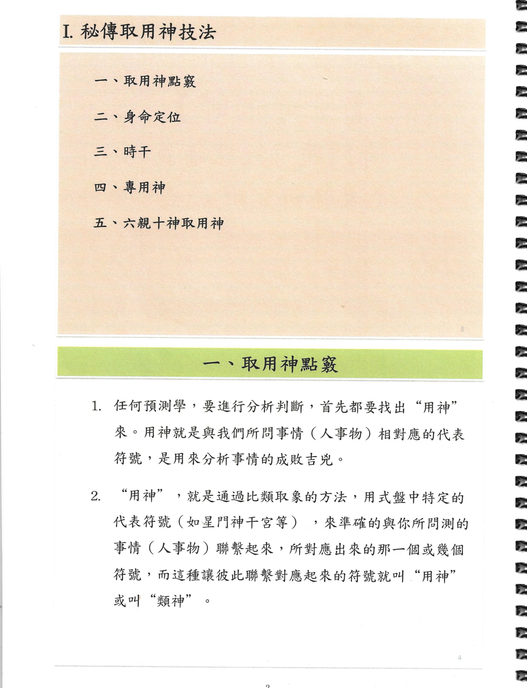

> **🖼 圖像解讀**　｜　檢視狀態：✅ 已檢視
> - **類型**：目錄＋文字頁（大師研究班投影片 3–4）
> - **內容**：大師研究班第 I 部「秘傳取用神技法」目錄：取用神點竅、身命定位、時干、專用神、六親十神取用神。「一、取用神點竅」：任何預測學都要先找出用神——與所問事情（人事物）對應的代表符號，用以分析成敗吉凶；用神是透過比類取象，用式盤中特定符號（星門神干宮等）與所問之事聯繫對應，又叫「類神」。
> - **原文出處（逐字）**：I. 秘傳取用神技法；一、取用神點竅
> - **可檢索關鍵字**：秘傳取用神, 取用神點竅, 身命定位, 專用神, 用神定義, 類神, 比類取象

**📝 逐字謄寫（第 123 頁）**

### I. 秘傳取用神技法（投影片 3）

一、取用神點竅
二、身命定位
三、時干
四、專用神
五、六親十神取用神

### 一、取用神點竅（投影片 4）

1. 任何預測學，要進行分析判斷，首先都要找出“用神”來。用神就是與我們所問事情（人事物）相對應的代表符號，是用來分析事情的成敗吉兇。
2. “用神”，就是通過比類取象的方法，用式盤中特定的代表符號（如星門神干宮等），來準確的與你所問測的事情（人事物）聯繫起來，所對應出來的那一個或幾個符號，而這種讓彼此聯繫對應起來的符號就叫“用神”或叫“類神”。

（頁碼：3）

## 圖 124 — 第 124 頁（1240x1617）｜🖼 圖片（開圖判斷：圖表細看／裝飾照簡述）

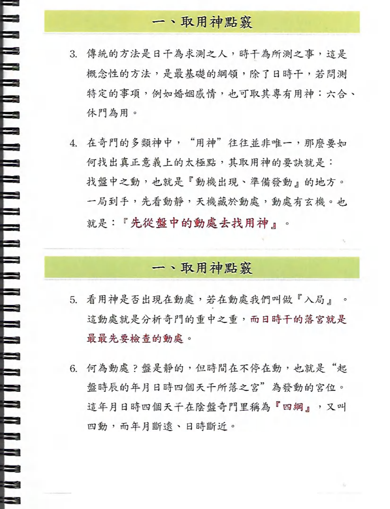

> **🖼 圖像解讀**　｜　檢視狀態：✅ 已檢視
> - **類型**：文字頁（大師研究班投影片 5–6）
> - **內容**：取用神點竅續：傳統以日干為求測人、時干為所測之事，是最基礎綱領；問特定事項可取專有用神（如婚姻取六合、休門）。用神往往不唯一，要找真正的太極點，要訣是「找盤中之動」——動機出現準備發動之處，一局到手先看動靜，先從盤中動處找用神；用神在動處叫「入局」，日時干落宮是最先要檢查的動處。何為動處？起盤時辰的年月日時四個天干所落之宮為發動宮位，陰盤奇門稱為「四綱」或四動，年月斷遠、日時斷近。
> - **原文出處（逐字）**：一、取用神點竅（投影片 5–6）
> - **可檢索關鍵字**：取用神點竅, 太極點, 盤中之動, 動處取用神, 入局, 四綱, 四動, 年月斷遠日時斷近

**📝 逐字謄寫（第 124 頁）**

### 一、取用神點竅（投影片 5）

3. 傳統的方法是日干為求測之人，時干為所測之事，這是概念性的方法，是最基礎的綱領，除了日時干，若問測特定的事項，例如婚姻感情，也可取其專有用神：六合、休門為用。
4. 在奇門的多類神中，“用神”往往並非唯一，那麼要如何找出真正意義上的太極點，其取用神的要訣就是：找盤中之動，也就是『動機出現、準備發動』的地方。一局到手，先看動靜，天機藏於動處，動處有玄機。也就是：『**先從盤中的動處去找用神**』。

### 一、取用神點竅（投影片 6）

5. 看用神是否出現在動處，若在動處我們叫做『入局』。這動處就是分析奇門的重中之重，**而日時干的落宮就是最最先要檢查的動處**。
6. 何為動處？盤是靜的，但時間在不停在動，也就是“起盤時辰的年月日時四個天干所落之宮”為發動的宮位。這年月日時四個天干在陰盤奇門里稱為『**四綱**』，又叫四動，而年月斷遠、日時斷近。

## 圖 125 — 第 125 頁（1240x1617）｜🖼 圖片（開圖判斷：圖表細看／裝飾照簡述）

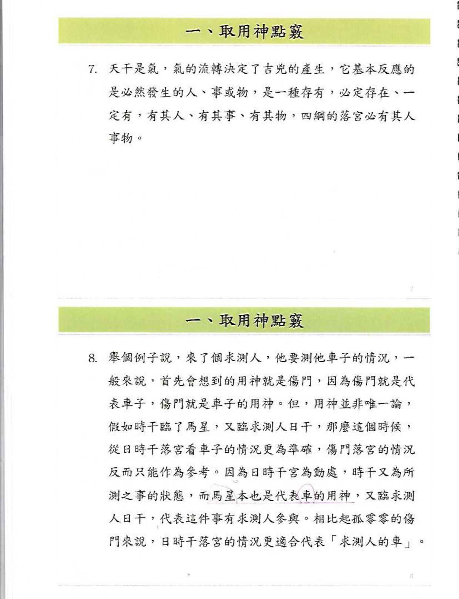

> **🖼 圖像解讀**　｜　檢視狀態：✅ 已檢視
> - **類型**：文字頁（大師研究班投影片 7–8）
> - **內容**：取用神點竅續：天干是氣，氣的流轉決定吉凶，反應必然發生的人事物，四綱落宮必有其人事物。例：測車子一般取傷門，但若時干臨馬星又臨求測人日干，則從日時干落宮看車更準，因日時干宮為動處、時干為所測之事的狀態、馬星本也代表車，又臨日干代表求測人參與，比孤零零的傷門更適合代表「求測人的車」。
> - **原文出處（逐字）**：一、取用神點竅（投影片 7–8）
> - **可檢索關鍵字**：天干是氣, 四綱落宮, 用神非唯一, 測車傷門, 馬星代表車, 日時干動處, 取用神實例

**📝 逐字謄寫（第 125 頁）**

### 一、取用神點竅（投影片 7）

7. 天干是氣，氣的流轉決定了吉兇的產生，它基本反應的是必然發生的人、事或物，是一種存有，必定存在、一定有，有其人、有其事、有其物，四綱的落宮必有其人事物。

### 一、取用神點竅（投影片 8）

8. 舉個例子說，來了個求測人，他要測他車子的情況，一般來說，首先會想到的用神就是傷門，因為傷門就是代表車子，傷門就是車子的用神。但，用神並非唯一論，假如時干臨了馬星，又臨求測人日干，那麼這個時候，從日時干落宮看車子的情況更為準確，傷門落宮的情況反而只能作為參考。因為日時干宮為動處，時干又為所測之事的狀態，而馬星本也是代表車的用神，又臨求測人日干，代表這件事有求測人參與。相比起孤零零的傷門來說，日時干落宮的情況更適合代表「求測人的車」。

## 圖 126 — 第 126 頁（1240x1617）｜🖼 圖片（開圖判斷：圖表細看／裝飾照簡述）

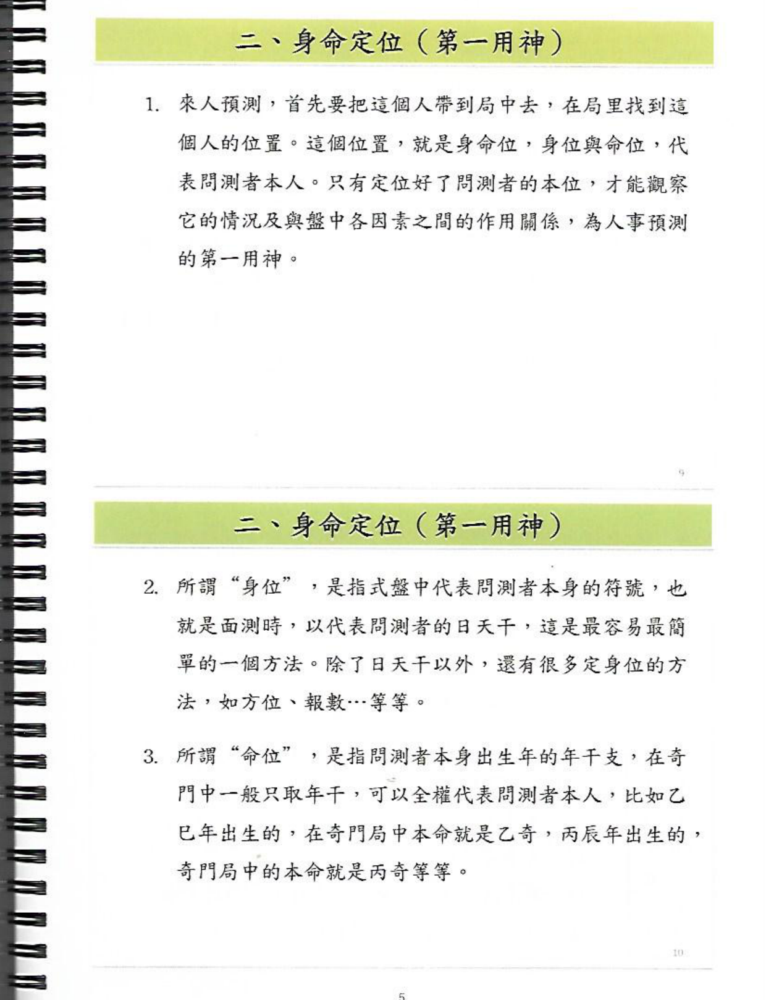

> **🖼 圖像解讀**　｜　檢視狀態：✅ 已檢視
> - **類型**：文字頁（大師研究班投影片 9–10）
> - **內容**：「二、身命定位（第一用神）」：來人預測先把此人帶到局中找到其位置即身命位（身位與命位），代表問測者本人，為人事預測第一用神；「身位」是代表問測者本身的符號，面測時以日天干最簡單，另有方位、報數等法；「命位」是問測者出生年的年干（一般只取年干），可全權代表本人，如乙巳年生本命為乙奇、丙辰年生本命為丙奇。
> - **原文出處（逐字）**：二、身命定位（第一用神）
> - **可檢索關鍵字**：身命定位, 第一用神, 身位, 命位, 日天干, 出生年干, 本命乙奇, 問測者本位

**📝 逐字謄寫（第 126 頁）**

### 二、身命定位（第一用神）（投影片 9）

1. 來人預測，首先要把這個人帶到局中去，在局里找到這個人的位置。這個位置，就是身命位，身位與命位，代表問測者本人。只有定位好了問測者的本位，才能觀察它的情況及與盤中各因素之間的作用關係，為人事預測的第一用神。

### 二、身命定位（第一用神）（投影片 10）

2. 所謂“身位”，是指式盤中代表問測者本身的符號，也就是面測時，以代表問測者的日天干，這是最容易最簡單的一個方法。除了日天干以外，還有很多定身位的方法，如方位、報數…等等。
3. 所謂“命位”，是指問測者本身出生年的年干支，在奇門中一般只取年干，可以全權代表問測者本人，比如乙巳年出生的，在奇門局中本命就是乙奇，丙辰年出生的，奇門局中的本命就是丙奇等等。

（頁碼：5）

## 圖 127 — 第 127 頁（1240x1617）｜🖼 圖片（開圖判斷：圖表細看／裝飾照簡述）

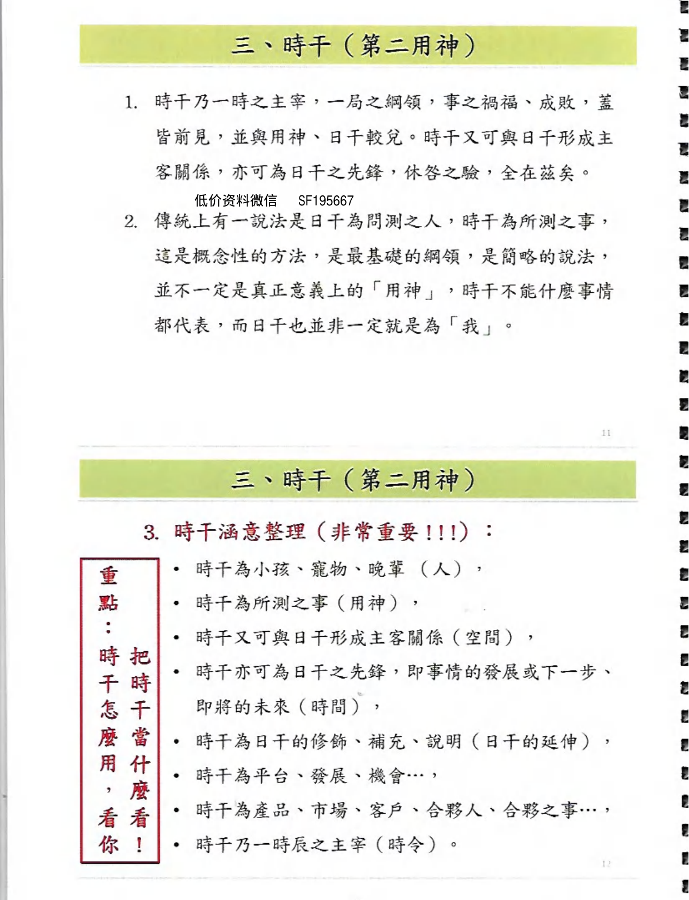

> **🖼 圖像解讀**　｜　檢視狀態：✅ 已檢視
> - **類型**：文字頁（大師研究班投影片 11–12）
> - **內容**：「三、時干（第二用神）」：時干乃一時之主宰、一局之綱領，事之禍福成敗皆前見，並與用神、日干較兇；可與日干形成主客關係、亦可為日干之先鋒。傳統「日干為問測之人、時干為所測之事」只是基礎綱領，時干不能代表一切、日干也非一定為我。時干涵意整理（非常重要）：小孩寵物晚輩（人）、所測之事（用神）、與日干主客（空間）、日干之先鋒即事情發展或下一步未來（時間）、日干的修飾補充說明、平台發展機會、產品市場客戶合夥人、一時辰之主宰（時令）；重點：時干怎麼用、把時干當什麼看，看你！
> - **原文出處（逐字）**：三、時干（第二用神）
> - **可檢索關鍵字**：時干, 第二用神, 一時之主宰, 主客關係, 日干先鋒, 時干涵意整理, 平台機會, 時令

**📝 逐字謄寫（第 127 頁）**

### 三、時干（第二用神）（投影片 11）

1. 時干乃一時之主宰，一局之綱領，事之禍福、成敗，蓋皆前見，並與用神、日干較兇。時干又可與日干形成主客關係，亦可為日干之先鋒，休咎之驗，全在茲矣。〔此處夾有轉售浮水印，略〕
2. 傳統上有一說法是日干為問測之人，時干為所測之事，這是概念性的方法，是最基礎的綱領，是簡略的說法，並不一定是真正意義上的「用神」，時干不能什麼事情都代表，而日干也並非一定就是為「我」。

### 三、時干（第二用神）（投影片 12）

3. **時干涵意整理（非常重要!!!）**：
   - 時干為小孩、寵物、晚輩（人），
   - 時干為所測之事（用神），
   - 時干又可與日干形成主客關係（空間），
   - 時干亦可為日干之先鋒，即事情的發展或下一步、即將的未來（時間），
   - 時干為日干的修飾、補充、說明（日干的延伸），
   - 時干為平台、發展、機會…，
   - 時干為產品、市場、客戶、合夥人、合夥之事…，
   - 時干乃一時辰之主宰（時令）。

（左側紅框：重點：時干怎麼用，把時干當什麼看，看你！）

## 圖 128 — 第 128 頁（1240x1617）｜🖼 圖片（開圖判斷：圖表細看／裝飾照簡述）

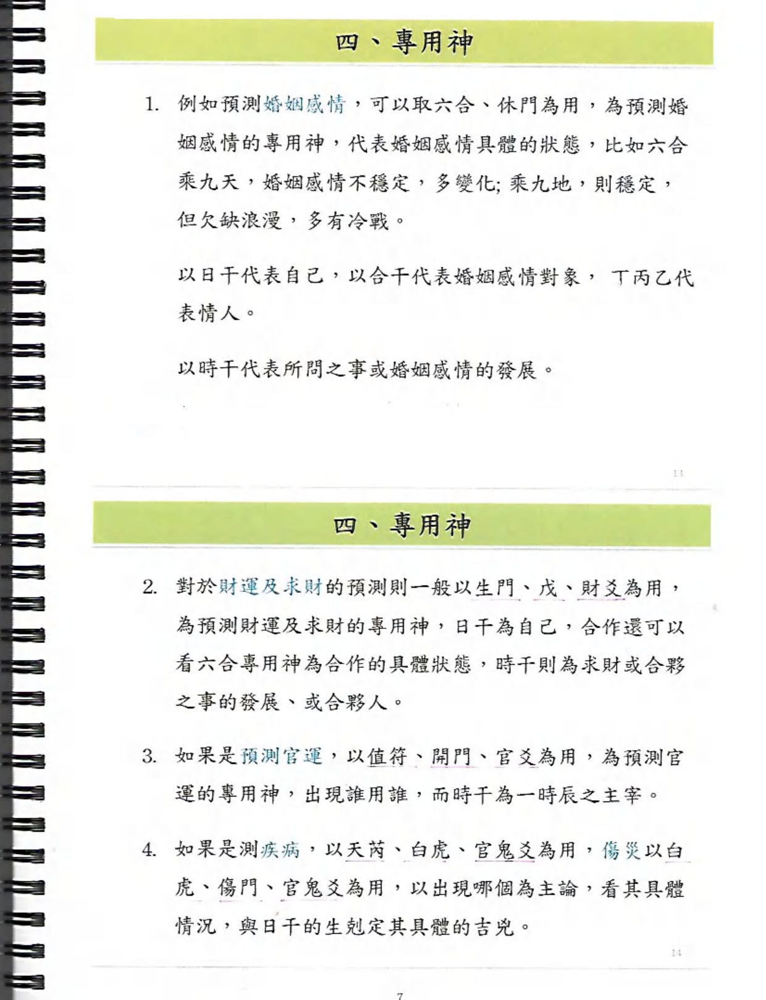

> **🖼 圖像解讀**　｜　檢視狀態：✅ 已檢視
> - **類型**：文字頁（大師研究班投影片 13–14）
> - **內容**：「四、專用神」：婚姻感情取六合、休門為專用神，六合乘九天感情不穩多變、乘九地穩定但欠浪漫多冷戰；日干代表自己、合干代表對象、丁丙乙代表情人、時干代表所問之事或感情發展。財運求財以生門、戊、財爻為用，合作可看六合，時干為求財或合夥之事發展或合夥人。官運以值符、開門、官爻為用，出現誰用誰，時干為一時辰之主宰。疾病以天芮、白虎、官鬼爻為用，傷災以白虎、傷門、官鬼爻為用，以出現者為主論，看與日干生剋定吉凶。
> - **原文出處（逐字）**：四、專用神
> - **可檢索關鍵字**：專用神, 婚姻六合休門, 六合乘九天, 財運生門戊, 官運值符開門, 疾病天芮白虎, 傷災傷門, 官鬼爻

**📝 逐字謄寫（第 128 頁）**

### 四、專用神（投影片 13）

1. 例如預測婚姻感情，可以取六合、休門為用，為預測婚姻感情的專用神，代表婚姻感情具體的狀態，比如六合乘九天，婚姻感情不穩定，多變化；乘九地，則穩定，但欠缺浪漫，多有冷戰。

   以日干代表自己，以合干代表婚姻感情對象，丁丙乙代表情人。

   以時干代表所問之事或婚姻感情的發展。

### 四、專用神（投影片 14）

2. 對於財運及求財的預測則一般以生門、戊、財爻為用，為預測財運及求財的專用神，日干為自己，合作還可以看六合專用神為合作的具體狀態，時干則為求財或合夥之事的發展、或合夥人。
3. 如果是預測官運，以值符、開門、官爻為用，為預測官運的專用神，出現誰用誰，而時干為一時辰之主宰。
4. 如果是測疾病，以天芮、白虎、官鬼爻為用，傷災以白虎、傷門、官鬼爻為用，以出現哪個為主論，看其具體情況，與日干的生剋定其具體的吉兇。

（頁碼：7）

## 圖 129 — 第 129 頁（1240x1617）｜🖼 圖片（開圖判斷：圖表細看／裝飾照簡述）

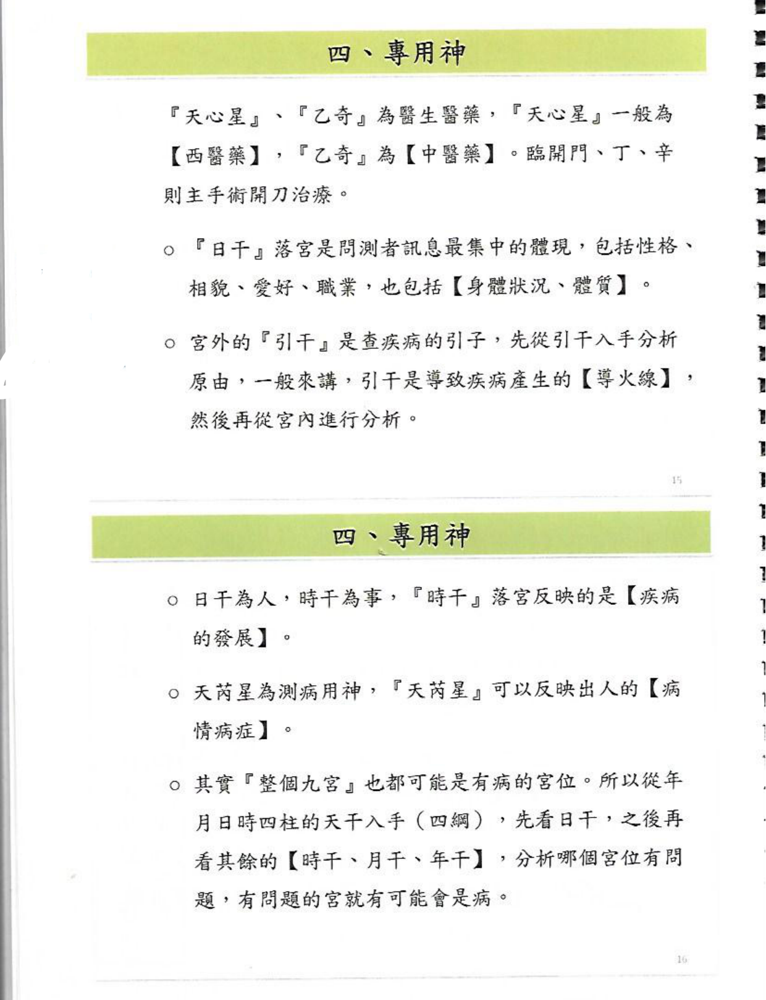

> **🖼 圖像解讀**　｜　檢視狀態：✅ 已檢視
> - **類型**：文字頁（大師研究班投影片 15–16）
> - **內容**：專用神（測病）續：天心星、乙奇為醫生醫藥，天心一般為西醫藥、乙奇為中醫藥，臨開門、丁、辛則主手術開刀治療；日干落宮是問測者訊息最集中處，含性格相貌愛好職業及身體狀況體質；宮外引干是查疾病的引子、導致疾病的導火線，先從引干分析原由再看宮內；日干為人、時干為事，時干落宮反映疾病的發展；天芮星為測病用神反映病情病症；整個九宮都可能是有病宮位，從四綱入手先看日干再看時月年干，有問題的宮就可能是病。
> - **原文出處（逐字）**：四、專用神（投影片 15–16）
> - **可檢索關鍵字**：測病用神, 天心西醫, 乙奇中醫, 開門手術, 引干導火線, 時干疾病發展, 天芮病情, 四綱查病

**📝 逐字謄寫（第 129 頁）**

### 四、專用神（投影片 15）

『天心星』、『乙奇』為醫生醫藥，『天心星』一般為【西醫藥】，『乙奇』為【中醫藥】。臨開門、丁、辛則主手術開刀治療。

- ○ 『日干』落宮是問測者訊息最集中的體現，包括性格、相貌、愛好、職業，也包括【身體狀況、體質】。
- ○ 宮外的『引干』是查疾病的引子，先從引干入手分析原由，一般來講，引干是導致疾病產生的【導火線】，然後再從宮內進行分析。

### 四、專用神（投影片 16）

- ○ 日干為人，時干為事，『時干』落宮反映的是【疾病的發展】。
- ○ 天芮星為測病用神，『天芮星』可以反映出人的【病情病症】。
- ○ 其實『整個九宮』也都可能是有病的宮位。所以從年月日時四柱的天干入手（四綱），先看日干，之後再看其餘的【時干、月干、年干】，分析哪個宮位有問題，有問題的宮就有可能會是病。

## 圖 130 — 第 130 頁（1240x1617）｜🖼 圖片（開圖判斷：圖表細看／裝飾照簡述）

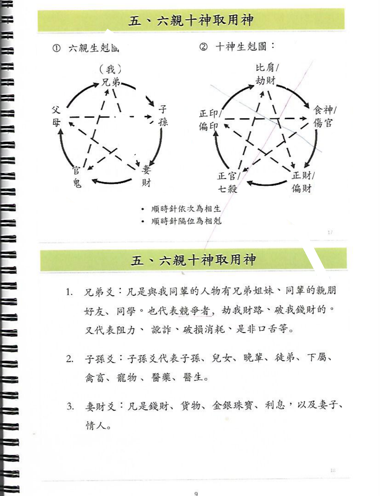

> **🖼 圖像解讀**　｜　檢視狀態：✅ 已檢視
> - **類型**：生剋圖＋文字頁（大師研究班投影片 17–18）
> - **內容**：「五、六親十神取用神」：六親生剋圖與十神生剋圖（同高級班第 111 頁，順時針依次相生、隔位相剋）；六親爻義：兄弟爻為同輩兄弟姐妹親朋同學，也代表競爭者、劫財破財、阻力訛詐、破損消耗、是非口舌；子孫爻為子孫兒女晚輩徒弟下屬、禽畜寵物、醫藥醫生；妻財爻為錢財貨物金銀珠寶利息，以及妻子情人。
> - **原文出處（逐字）**：五、六親十神取用神（投影片 17–18）
> - **可檢索關鍵字**：六親十神, 六親生剋, 兄弟爻競爭劫財, 子孫爻晚輩醫藥, 妻財爻錢財妻子, 十神生剋圖

**📝 逐字謄寫（第 130 頁）**

### 五、六親十神取用神（投影片 17）

① 六親生剋圖：（我）兄弟 → 子孫 → 妻財 → 官鬼 → 父母 → 兄弟
② 十神生剋圖：比肩/劫財 → 食神/傷官 → 正財/偏財 → 正官/七殺 → 正印/偏印 → 比肩/劫財

- 順時針依次為相生
- 順時針隔位為相剋

（頁面有兩道筆畫劃過十神圖，非印刷內容）

### 五、六親十神取用神（投影片 18）

1. 兄弟爻：凡是與我同輩的人物有兄弟姐妹、同輩的親朋好友、同學。也代表競爭者，劫我財路、破我錢財的。又代表阻力、訛詐、破損消耗、是非口舌等。
2. 子孫爻：子孫爻代表子孫、兒女、晚輩、徒弟、下屬、禽畜、寵物、醫藥、醫生。
3. 妻財爻：凡是錢財、貨物、金銀珠寶、利息，以及妻子、情人。

（頁碼：9）

## 圖 131 — 第 131 頁（1240x1617）｜🖼 圖片（開圖判斷：圖表細看／裝飾照簡述）

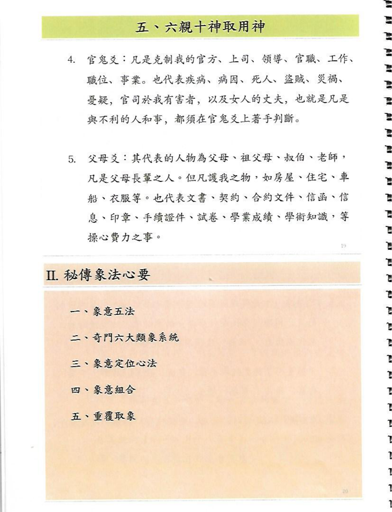

> **🖼 圖像解讀**　｜　檢視狀態：✅ 已檢視
> - **類型**：文字頁／目錄（大師研究班投影片 19–20）
> - **內容**：六親爻義續：官鬼爻為剋制我的官方上司領導官職工作職位事業，也代表疾病病因死人盜賊災禍憂疑、官司於我有害者及女人的丈夫，凡不利的人和事都從官鬼爻判斷；父母爻為父母祖父母叔伯老師等長輩，護我之物如房屋住宅車船衣服，也代表文書契約合約信函信息印章手續證件試卷學業成績學術知識等操心費力之事。第 II 部「秘傳象法心要」目錄：象意五法、奇門六大類象系統、象意定位心法、象意組合、重覆取象。
> - **原文出處（逐字）**：五、六親十神取用神（投影片 19）；II. 秘傳象法心要（投影片 20）
> - **可檢索關鍵字**：官鬼爻, 工作事業, 疾病官司, 女人的丈夫, 父母爻, 文書證件, 秘傳象法心要, 象意定位

**📝 逐字謄寫（第 131 頁）**

### 五、六親十神取用神（投影片 19）

4. 官鬼爻：凡是克制我的官方、上司、領導、官職、工作、職位、事業。也代表疾病、病因、死人、盜賊、災禍、憂疑，官司於我有害者，以及女人的丈夫，也就是凡是與不利的人和事，都須在官鬼爻上著手判斷。
5. 父母爻：其代表的人物為父母、祖父母、叔伯、老師，凡是父母長輩之人。但凡護我之物，如房屋、住宅、車船、衣服等。也代表文書、契約、合約文件、信函、信息、印章、手續證件、試卷、學業成績、學術知識，等操心費力之事。

### II. 秘傳象法心要（投影片 20）

一、象意五法
二、奇門六大類象系統
三、象意定位心法
四、象意組合
五、重覆取象

## 圖 132 — 第 132 頁（1240x1617）｜🖼 圖片（開圖判斷：圖表細看／裝飾照簡述）

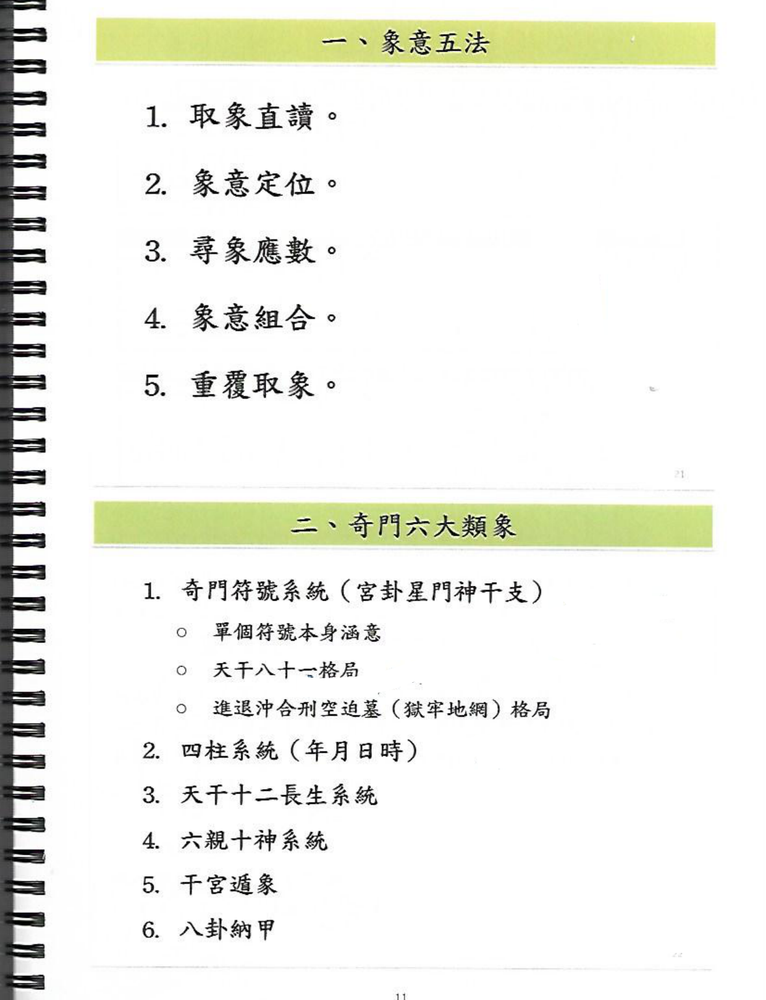

> **🖼 圖像解讀**　｜　檢視狀態：✅ 已檢視
> - **類型**：文字頁（大師研究班投影片 21–22）
> - **內容**：「一、象意五法」：取象直讀、象意定位、尋象應數、象意組合、重覆取象。「二、奇門六大類象」：奇門符號系統（宮卦星門神干支：單個符號涵意、天干八十一格局、進退沖合刑空迫墓〔獄牢地網〕格局）、四柱系統（年月日時）、天干十二長生系統、六親十神系統、干宮通象、八卦納甲。
> - **原文出處（逐字）**：一、象意五法；二、奇門六大類象
> - **可檢索關鍵字**：象意五法, 取象直讀, 尋象應數, 重覆取象, 六大類象, 天干八十一格局, 干宮通象, 八卦納甲

**📝 逐字謄寫（第 132 頁）**

### 一、象意五法（投影片 21）

1. 取象直讀。
2. 象意定位。
3. 尋象應數。
4. 象意組合。
5. 重覆取象。

### 二、奇門六大類象（投影片 22）

1. 奇門符號系統（宮卦星門神干支）
   - ○ 單個符號本身涵意
   - ○ 天干八十一格局
   - ○ 進退沖合刑空迫墓（獄牢地網）格局
2. 四柱系統（年月日時）
3. 天干十二長生系統
4. 六親十神系統
5. 干宮通象
6. 八卦納甲

（頁碼：11）

## 圖 133 — 第 133 頁（1240x1617）｜🖼 圖片（開圖判斷：圖表細看／裝飾照簡述）

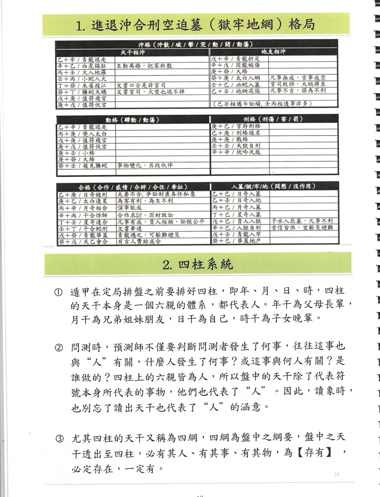

> **🖼 圖像解讀**　｜　檢視狀態：✅ 已檢視
> - **類型**：格局表＋文字頁（大師研究班投影片 23–24）
> - **內容**：「進退沖合刑空迫墓（獄牢地網）格局」分類表：沖格（天干相沖、地支相沖）、動格（驛動動蕩）、刑格（刑傷害罰）、合格（合作感情合絆合住牽扯）、入墓獄牢地（悶憋沒作用），列天盤＋地盤干組合的格局名與斷語，如辛＋乙白虎猖狂主動離婚把家拆散、丁＋癸朱雀投江文書口舌是非官司、癸＋庚太白入網凡事無成、乙＋庚日奇被刑夫妻不合、丁＋壬星奇逢合凡事有成貴人相助、戊＋癸青龍華蓋可躲難避災、戊＋己貴人入獄、辛＋己入獄自刑。「2. 四柱系統」：四柱天干都代表人（年干父母、月干兄弟朋友、日干自己、時干子女），讀象時別忘天干也代表「人」；四柱天干又稱四綱，盤中天干透出至四柱必有其人事物，為「存有」。
> - **原文出處（逐字）**：1. 進退沖合刑空迫墓（獄牢地網）格局；2. 四柱系統
> - **可檢索關鍵字**：天干格局, 沖格, 動格, 刑格, 合格, 入墓獄牢, 白虎猖狂, 青龍華蓋

**📝 逐字謄寫（第 133 頁）**

### 1. 進退沖合刑空迫墓（獄牢地網）格局（投影片 23）

**沖格（沖散／破／擊／突／動／開／動蕩）**

| 天干相沖 | 斷語 | 地支相沖 | 斷語 |
|---|---|---|---|
| 乙＋辛／青龍逃走 | | 戊＋辛／青龍折足 | |
| 辛＋乙／白虎猖狂 | 主動離婚，把家拆散 | 辛＋戊／困龍被傷 | |
| 丙＋壬／火入地羅 | | 庚＋癸／大格 | |
| 壬＋丙／小蛇入火 | | 癸＋庚／太白入網 | 凡事無成，吉事成空 |
| 丁＋癸／朱雀投江 | 文書口舌是非官司 | 壬＋己／凶蛇入墓 | 官司敗訴，大禍將至 |
| 癸＋丁／騰蛇夭矯 | 文書官司，火焚也逃不掉 | 己＋壬／地網高張 | 凡事不吉，謀為不利 |
| 戊＋庚／值符飛宮 | | | |
| 庚＋戊／值符伏宮 | | （己壬相遇斗訟場，壬丙相逢事非多） | |

**動格（驛動／動蕩）**

| 格局 | 斷語 |
|---|---|
| 乙＋辛／青龍逃走 | |
| 丙＋庚／熒入太白 | |
| 戊＋庚／值符飛宮 | |
| 庚＋戊／值符伏宮 | |
| 庚＋壬／小格 | |
| 庚＋癸／大格 | |
| 癸＋壬／複見騰蛇 | 事物變化，另找伙伴 |

**刑格（刑傷／害／罰）**

| 格局 | 斷語 |
|---|---|
| 庚＋己／官府刑格 | |
| 己＋庚／刑格返名 | |
| 庚＋庚／戰格 | |
| 壬＋壬／天獄自刑 | |
| 辛＋辛／伏吟天庭 | |

**合格（合作／感情／合絆／合住／牽扯）**

| 格局 | 斷語 |
|---|---|
| 乙＋庚／日奇被刑 | 夫妻不合，爭訟財產各怀私意 |
| 庚＋乙／太白逢星 | 為客有利，為主不利 |
| 丙＋辛／月奇相合 | 謀事能成 |
| 辛＋丙／干合悖師 | 合作求財，因財致訟 |
| 丁＋壬／星奇逢合 | 凡事有成，貴人相助，訟獄公平 |
| 壬＋丁／干合蛇刑 | 文書牽連 |
| 戊＋癸／青龍華蓋 | 青龍遇之，可躲難避災 |
| 癸＋戊／天乙會合 | 有吉人贊助成合 |

**入墓／獄／牢／地（悶憋／沒作用）**

| 格局 | 斷語 |
|---|---|
| 乙＋己／日奇入墓 | |
| 乙＋壬／日奇入地 | |
| 丙＋己／月奇入墓 | |
| 丁＋己／星奇入墓 | |
| 戊＋己／貴人入獄 | 子水入辰墓，凡事不利 |
| 辛＋己／入獄自刑 | 音信皆阻，宜躲災避難 |
| 戊＋壬／青龍入牢 | |
| 癸＋己／華蓋地戶 | |

### 2. 四柱系統（投影片 24）

① 遁甲在定局排盤之前要排好四柱，即年、月、日、時，四柱的天干本身是一個六親的體系，都代表人。年干為父母長輩，月干為兄弟姐妹朋友，日干為自己，時干為子女晚輩。

② 問測時，預測師不僅要判斷問測者發生了何事，往往這事也與“人”有關，什麼人發生了何事？或這事與何人有關？是誰做的？四柱上的六親皆為人，所以盤中的天干除了代表符號本身所代表的事物，他們也代表了“人”。因此，讀象時，也別忘了讀出天干也代表了“人”的涵意。

③ 尤其四柱的天干又稱為四綱，四綱為盤中之綱要，盤中之天干透出至四柱，必有其人、有其事、有其物，為【存有】，必定存在，一定有。

## 圖 134 — 第 134 頁（1240x1617）｜🖼 圖片（開圖判斷：圖表細看／裝飾照簡述）

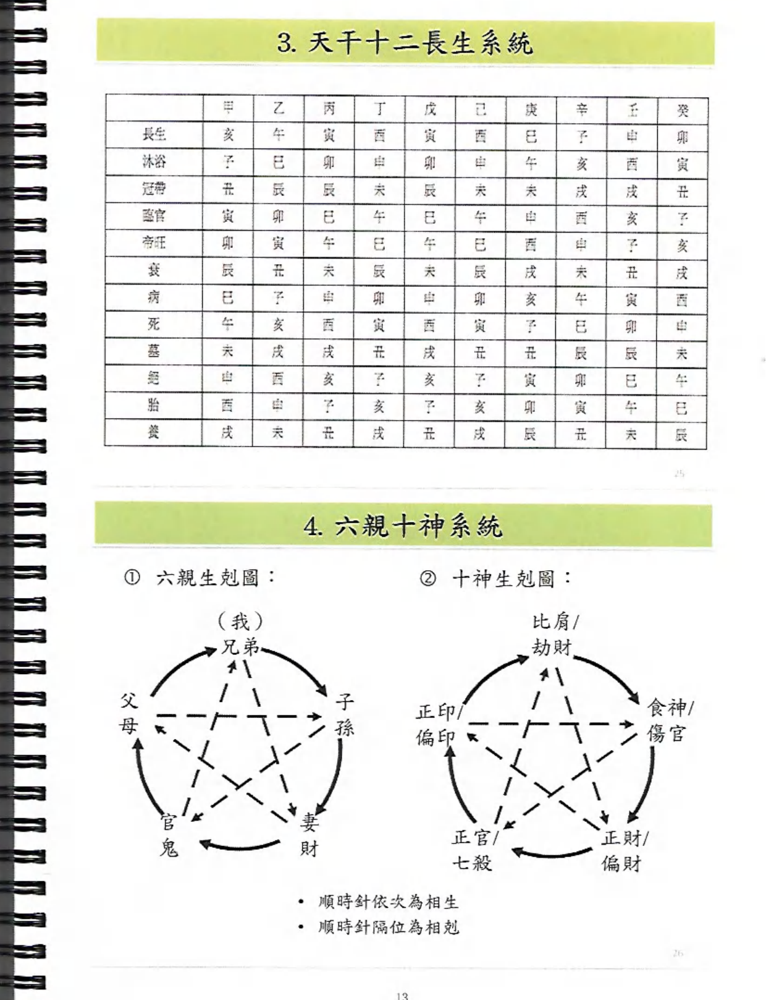

> **🖼 圖像解讀**　｜　檢視狀態：✅ 已檢視
> - **類型**：十二長生表＋生剋圖（大師研究班投影片 25–26）
> - **內容**：「3. 天干十二長生系統」：天干十二長生總表（內容同初級班第 22 頁：甲長生亥、乙長生午……癸養辰）；「4. 六親十神系統」：六親生剋圖與十神生剋圖（同第 111 頁），順時針依次為相生、隔位為相剋。
> - **原文出處（逐字）**：3. 天干十二長生系統；4. 六親十神系統
> - **可檢索關鍵字**：天干十二長生, 長生帝旺墓絕, 六親十神系統, 六親生剋圖, 十神生剋圖

**📝 逐字謄寫（第 134 頁）**

### 3. 天干十二長生系統（投影片 25）

| | 甲 | 乙 | 丙 | 丁 | 戊 | 己 | 庚 | 辛 | 壬 | 癸 |
|---|---|---|---|---|---|---|---|---|---|---|
| 長生 | 亥 | 午 | 寅 | 酉 | 寅 | 酉 | 巳 | 子 | 申 | 卯 |
| 沐浴 | 子 | 巳 | 卯 | 申 | 卯 | 申 | 午 | 亥 | 酉 | 寅 |
| 冠帶 | 丑 | 辰 | 辰 | 未 | 辰 | 未 | 未 | 戌 | 戌 | 丑 |
| 臨官 | 寅 | 卯 | 巳 | 午 | 巳 | 午 | 申 | 酉 | 亥 | 子 |
| 帝旺 | 卯 | 寅 | 午 | 巳 | 午 | 巳 | 酉 | 申 | 子 | 亥 |
| 衰 | 辰 | 丑 | 未 | 辰 | 未 | 辰 | 戌 | 未 | 丑 | 戌 |
| 病 | 巳 | 子 | 申 | 卯 | 申 | 卯 | 亥 | 午 | 寅 | 酉 |
| 死 | 午 | 亥 | 酉 | 寅 | 酉 | 寅 | 子 | 巳 | 卯 | 申 |
| 墓 | 未 | 戌 | 戌 | 丑 | 戌 | 丑 | 丑 | 辰 | 辰 | 未 |
| 絕 | 申 | 酉 | 亥 | 子 | 亥 | 子 | 寅 | 卯 | 巳 | 午 |
| 胎 | 酉 | 申 | 子 | 亥 | 子 | 亥 | 卯 | 寅 | 午 | 巳 |
| 養 | 戌 | 未 | 丑 | 戌 | 丑 | 戌 | 辰 | 丑 | 未 | 辰 |

### 4. 六親十神系統（投影片 26）

① 六親生剋圖：（我）兄弟 → 子孫 → 妻財 → 官鬼 → 父母 → 兄弟
② 十神生剋圖：比肩/劫財 → 食神/傷官 → 正財/偏財 → 正官/七殺 → 正印/偏印 → 比肩/劫財

- 順時針依次為相生
- 順時針隔位為相剋

（頁碼：13）

## 圖 135 — 第 135 頁（1240x1617）｜🖼 圖片（開圖判斷：圖表細看／裝飾照簡述）

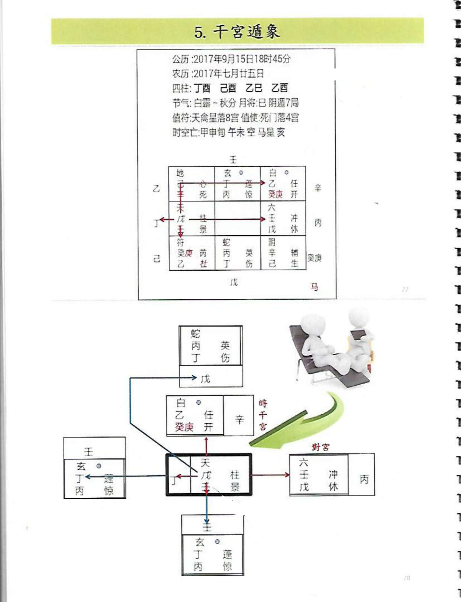

> **🖼 圖像解讀**　｜　檢視狀態：✅ 已檢視
> - **類型**：奇門盤＋干宮通象示意圖（大師研究班投影片 27–28）
> - **內容**：「5. 干宮通象」範例盤：公曆2017年9月15日18時45分（農曆七月廿五日），四柱丁酉、己酉、乙巳、乙酉，白露～秋分、月將巳、陰遁7局，值符天禽星落8宮、值使死門落4宮，甲申旬午未空、馬星亥；以紅箭頭示範由震宮的天盤戊、地盤壬、引干丁分別連到盤中相同天干所在之宮（干宮相通）。投影片 28 將震宮（天 戊 柱／壬 景，引干丁）放大為中心，連出時干宮（坤：白 乙 任／癸庚 开）、對宮（兌：六 壬 冲／戊 休）、及天干相通的離宮與坎宮，配一張諮詢情境插圖。
> - **原文出處（逐字）**：5. 干宮通象；盤頭「公历:2017年9月15日18时45分 农历:2017年七月廿五日 四柱:丁酉 己酉 乙巳 乙酉 节气:白露~秋分 月将:巳 阴遁7局 值符:天禽星落8宫 值使:死门落4宫 时空亡:甲申旬 午未空 马星 亥」
> - **可檢索關鍵字**：干宮通象, 陰遁七局, 天干相通, 時干宮, 對宮, 引干連宮, 2017範例盤, 震宮

**📝 逐字謄寫（第 135 頁）**

### 5. 干宮通象（投影片 27）

公历:2017年9月15日18时45分
农历:2017年七月廿五日
四柱: 丁酉　己酉　乙巳　乙酉
节气: 白露～秋分　月将:巳　阴遁7局
值符:天禽星落8宫　值使:死门落4宫
时空亡:甲申旬 午未空　马星 亥

（App 排盤，簡體照錄；每格：八神／天盤干 星／地盤干 門）

| 巽 | 離 | 坤 |
|---|---|---|
| 地 己 心 辛 死 | 玄 ◦ 丁 蓬 丙 惊 | 白 ◦ 乙 任 癸庚 开 |
| **震** | **中** | **兌** |
| 天 戊 柱 壬 景 | | 六 壬 冲 戊 休 |
| **艮** | **坎** | **乾** |
| 符 癸庚 芮 乙 杜 | 蛇 丙 英 丁 伤 | 阴 辛 辅 己 生 |

盤外引干：上（離）壬；左（巽／震／艮）乙／丁／己；右（坤／兌／乾）辛／丙／癸庚；下（坎）戊；乾宮外標「马」。離、坤兩宮以小圓點標示空亡（午未空）。

紅色箭頭（示範干宮通象）：巽宮地盤「己」→ 坤宮；震宮向下 → 艮宮；震宮天盤「戊」→ 兌宮；震宮 → 盤外引干「丁」。〔箭頭起訖依圖示描述〕

### 干宮通象示意（投影片 28）

中心（粗框）：震宮「天／戊 柱／壬 景」，引干「丁」。
- 上方：坤宮「白 ◦／乙 任／癸庚 开」，引干辛，標「時干宮」。
- 右方：兌宮「六／壬 冲／戊 休」，引干丙，標「對宮」。
- 左方：離宮「玄 ◦／丁 蓬／丙 惊」，引干壬（由中心引干丁連出）。
- 下方：離宮同上（由中心地盤壬連到引干壬）。
- 最上方：坎宮「蛇／丙 英／丁 伤」，引干戊（由中心天盤戊連出）。
- 右上插圖：一人躺椅、一人手持平板諮詢的 3D 人偶，綠色箭頭指向時干宮。

## 圖 136 — 第 136 頁（1240x1617）｜🖼 圖片（開圖判斷：圖表細看／裝飾照簡述）

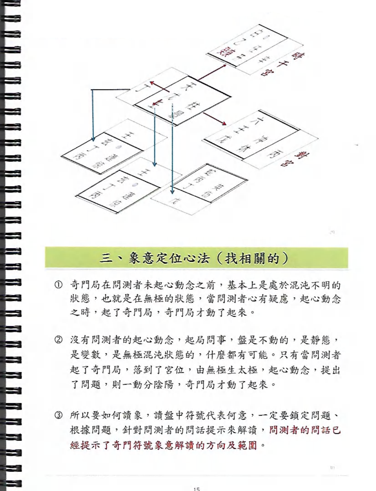

> **🖼 圖像解讀**　｜　檢視狀態：✅ 已檢視
> - **類型**：立體示意圖＋文字頁（大師研究班投影片 29–30）
> - **內容**：投影片 29 將前頁干宮通象圖以立體斜角方式重繪（中心震宮、時干宮、對宮及天干相通之宮以箭頭相連，圖中文字為斜向印刷）。投影片 30「三、象意定位心法（找相關的）」：問測者未起心動念前，奇門局處於混沌無極狀態；問測者心有疑慮、起心動念起局，落到宮位，由無極生太極、一動分陰陽，奇門局才動起來；因此讀象一定要鎖定問題，根據問測者的問話提示來解讀——問話已提示了符號象意解讀的方向及範圍。
> - **原文出處（逐字）**：干宮通象立體圖（投影片 29）；三、象意定位心法（找相關的）（投影片 30）
> - **可檢索關鍵字**：干宮通象立體圖, 象意定位心法, 找相關的, 起心動念, 無極生太極, 一動分陰陽, 鎖定問題, 問話提示

**📝 逐字謄寫（第 136 頁）**

### 干宮通象立體示意（投影片 29）

（將第 135 頁投影片 28 的平面示意改為立體斜角排列：中心為震宮「天 戊 柱／壬 景」，右上連「時干宮」、右下連「對宮」（六 壬 冲／戊 休，丙），下方連兩個離宮「壬／玄 ◦ 丁 蓬／丙 惊」與坎宮「蛇 丙 英／丁 伤」（引干戊）。圖中文字為斜向印刷，依前頁平面圖對照辨識。）

### 三、象意定位心法（找相關的）（投影片 30）

① 奇門局在問測者未起心動念之前，基本上是處於混沌不明的狀態，也就是在無極的狀態，當問測者心有疑慮，起心動念之時，起了奇門局，奇門局才動了起來。

② 沒有問測者的起心動念，起局問事，盤是不動的，是靜態，是變數，是無極混沌狀態的，什麼都有可能。只有當問測者起了奇門局，落到了宮位，由無極生太極，起心動念，提出了問題，則一動分陰陽，奇門局才動了起來。

③ 所以要如何讀象，讀盤中符號代表何意，一定要鎖定問題、根據問題，針對問測者的問話提示來解讀，**問測者的問話已經提示了奇門符號象意解讀的方向及範圍**。

（頁碼：15）

## 圖 137 — 第 137 頁（1240x1617）｜🖼 圖片（開圖判斷：圖表細看／裝飾照簡述）

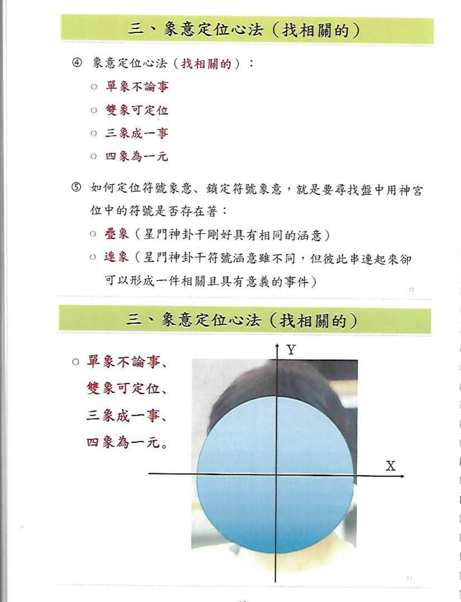

> **🖼 圖像解讀**　｜　檢視狀態：✅ 已檢視
> - **類型**：文字頁＋座標示意圖（大師研究班投影片 31–32）
> - **內容**：象意定位心法（找相關的）續：單象不論事、雙象可定位、三象成一事、四象為一元；定位鎖定符號象意，就是找用神宮中的符號是否存在「疊象」（星門神卦干剛好具相同涵意）或「連象」（涵意不同但串連起來形成一件相關且有意義的事件）。投影片 32 以一張臉部照片疊上藍色圓與 X、Y 座標軸，比喻單象不論事、雙象可定位、三象成一事、四象為一元。
> - **原文出處（逐字）**：三、象意定位心法（找相關的）（投影片 31–32）
> - **可檢索關鍵字**：單象不論事, 雙象可定位, 三象成一事, 四象為一元, 疊象, 連象, 象意定位, 座標比喻

**📝 逐字謄寫（第 137 頁）**

### 三、象意定位心法（找相關的）（投影片 31）

④ 象意定位心法（**找相關的**）：
   - ○ 單象不論事
   - ○ 雙象可定位
   - ○ 三象成一事
   - ○ 四象為一元

⑤ 如何定位符號象意、鎖定符號象意，就是要尋找盤中用神宮位中的符號是否存在著：
   - ○ **疊象**（星門神卦干剛好具有相同的涵意）
   - ○ **連象**（星門神卦干符號涵意雖不同，但彼此串連起來卻可以形成一件相關且具有意義的事件）

### 三、象意定位心法（找相關的）（投影片 32）

- ○ 單象不論事、雙象可定位、三象成一事、四象為一元。

（右圖：一張人物頭部照片，臉部被藍色圓形遮蓋，疊上 X 軸與 Y 軸座標線，比喻以兩條軸線〔雙象〕即可定出一點位置。）

## 圖 138 — 第 138 頁（1240x1617）｜🖼 圖片（開圖判斷：圖表細看／裝飾照簡述）

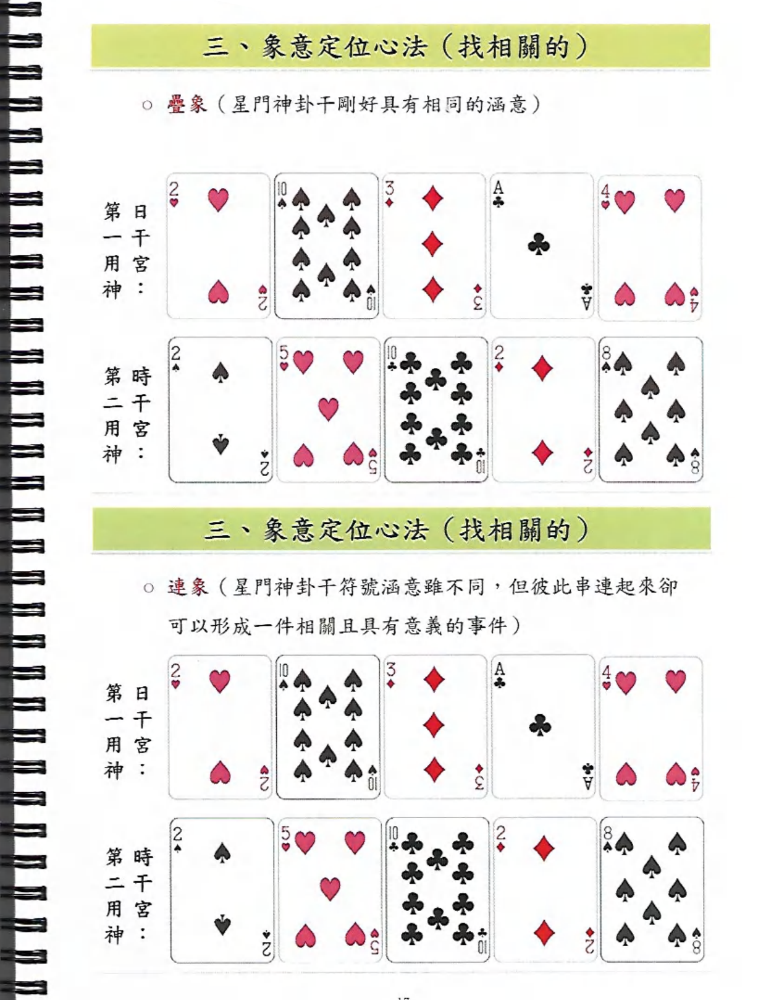

> **🖼 圖像解讀**　｜　檢視狀態：✅ 已檢視
> - **類型**：撲克牌比喻圖（大師研究班投影片 33–34）
> - **內容**：以撲克牌比喻「疊象」與「連象」：兩張投影片都排列兩列各五張牌——第一用神（日干宮）：紅心2、黑桃10、方塊3、梅花A、紅心4；第二用神（時干宮）：黑桃2、紅心5、梅花10、方塊2、黑桃8。疊象指星門神卦干剛好具相同涵意（如兩宮都有相同點數或花色），連象指符號涵意雖不同但串連起來形成相關且有意義的事件（如數字可連成順子）。
> - **原文出處（逐字）**：三、象意定位心法（找相關的）—疊象、連象（投影片 33–34）
> - **可檢索關鍵字**：疊象, 連象, 撲克牌比喻, 第一用神日干宮, 第二用神時干宮, 相同涵意, 串連成事件

**📝 逐字謄寫（第 138 頁）**

### 三、象意定位心法（找相關的）（投影片 33）

- ○ **疊象**（星門神卦干剛好具有相同的涵意）

| | 1 | 2 | 3 | 4 | 5 |
|---|---|---|---|---|---|
| 第一用神：日干宮 | 紅心 2 | 黑桃 10 | 方塊 3 | 梅花 A | 紅心 4 |
| 第二用神：時干宮 | 黑桃 2 | 紅心 5 | 梅花 10 | 方塊 2 | 黑桃 8 |

### 三、象意定位心法（找相關的）（投影片 34）

- ○ **連象**（星門神卦干符號涵意雖不同，但彼此串連起來卻可以形成一件相關且具有意義的事件）

（同上兩列撲克牌，排列相同。）

（註：投影片未附文字解說；依圖意，疊象如兩宮同有「2」「10」等相同點數，連象如 A、2、3、4、5 可串成順子。此為對圖示的說明，非原文。）

## 圖 139 — 第 139 頁（1240x1617）｜🖼 圖片（開圖判斷：圖表細看／裝飾照簡述）

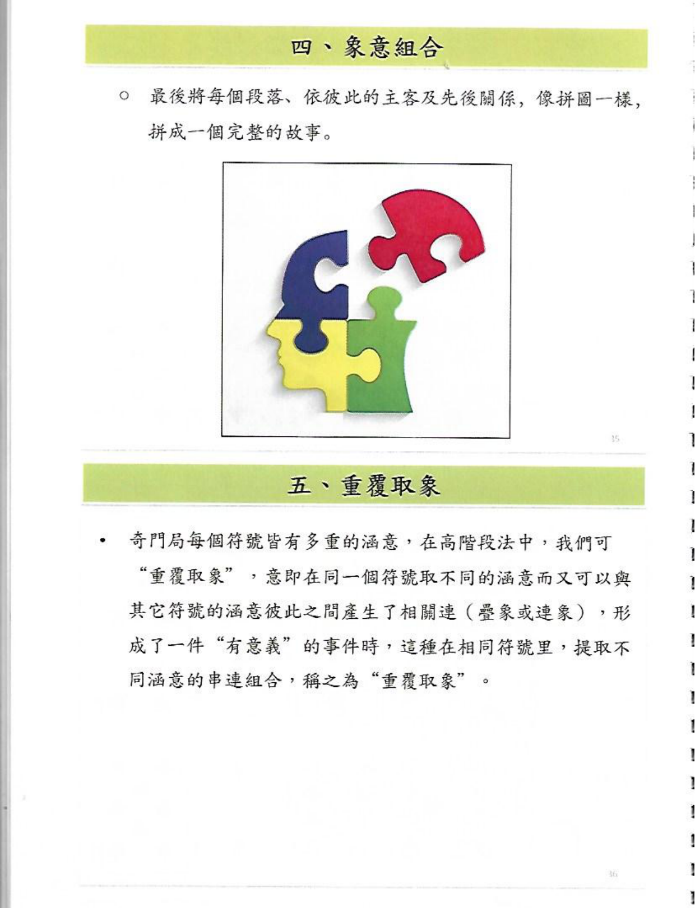

> **🖼 圖像解讀**　｜　檢視狀態：✅ 已檢視
> - **類型**：拼圖插圖＋文字頁（大師研究班投影片 35–36）
> - **內容**：「四、象意組合」：最後將每個段落依彼此的主客及先後關係，像拼圖一樣拼成一個完整的故事（配人頭形拼圖插圖）。「五、重覆取象」：奇門每個符號皆有多重涵意，高階段可在同一符號取不同涵意，與其它符號的涵意產生相關連（疊象或連象）形成有意義的事件，這種在相同符號裡提取不同涵意的串連組合稱為「重覆取象」。
> - **原文出處（逐字）**：四、象意組合；五、重覆取象
> - **可檢索關鍵字**：象意組合, 拼圖, 主客先後, 完整故事, 重覆取象, 多重涵意, 疊象連象, 高階讀象

**📝 逐字謄寫（第 139 頁）**

### 四、象意組合（投影片 35）

- ○ 最後將每個段落、依彼此的主客及先後關係，像拼圖一樣，拼成一個完整的故事。

（插圖：四塊彩色拼圖組成人頭側影，其中一塊紅色拼圖尚未拼上）

### 五、重覆取象（投影片 36）

- 奇門局每個符號皆有多重的涵意，在高階段法中，我們可“重覆取象”，意即在同一個符號取不同的涵意而又可以與其它符號的涵意彼此之間產生了相關連（疊象或連象），形成了一件“有意義”的事件時，這種在相同符號里，提取不同涵意的串連組合，稱之為“重覆取象”。

## 圖 140 — 第 140 頁（1240x1617）｜🖼 圖片（開圖判斷：圖表細看／裝飾照簡述）

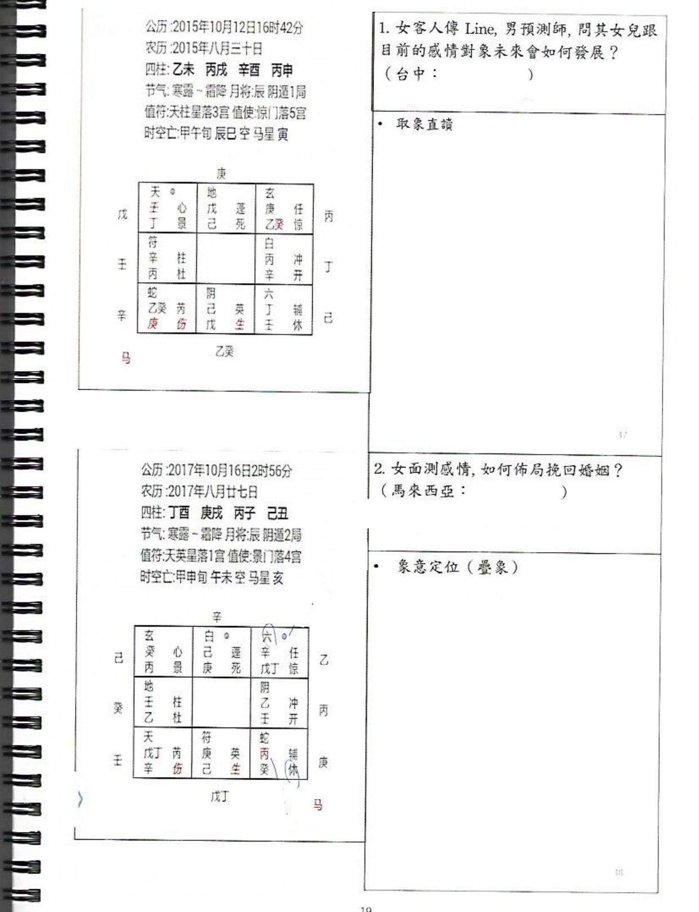

> **🖼 圖像解讀**　｜　檢視狀態：✅ 已檢視
> - **類型**：案例奇門盤＋練習欄（大師研究班投影片 37–38）
> - **內容**：兩則感情案例練習頁（右側為空白筆記欄）。案例 1「女客人傳 Line，男預測師，問其女兒跟目前的感情對象未來會如何發展？（台中）」，練習方法：取象直讀；盤：公曆2015年10月12日16時42分，四柱乙未、丙戌、辛酉、丙申，陰遁1局，值符天柱星落3宮、值使驚門落5宮，甲午旬辰巳空、馬星寅。案例 2「女面測感情，如何佈局挽回婚姻？（馬來西亞）」，練習方法：象意定位（疊象）；盤：公曆2017年10月16日2時56分，四柱丁酉、庚戌、丙子、己丑，陰遁2局，值符天英星落1宮、值使景門落4宮，甲申旬午未空、馬星亥；盤上有藍筆手寫圈記（坤宮六合、乾宮丙與休門）。
> - **原文出處（逐字）**：1. 女客人傳 Line…問其女兒跟目前的感情對象未來會如何發展？；2. 女面測感情，如何佈局挽回婚姻？
> - **可檢索關鍵字**：感情案例, 取象直讀練習, 疊象練習, 陰遁一局, 陰遁二局, 挽回婚姻, 電話問測, 案例盤

**📝 逐字謄寫（第 140 頁）**

### 案例 1（投影片 37）

**1. 女客人傳 Line, 男預測師, 問其女兒跟目前的感情對象未來會如何發展？（台中：　　）**

- 取象直讀（右側為空白練習欄）

公历:2015年10月12日16时42分
农历:2015年八月三十日
四柱: 乙未　丙戌　辛酉　丙申
节气: 寒露～霜降　月将:辰　阴遁1局
值符:天柱星落3宫　值使:惊门落5宫
时空亡:甲午旬 辰巳空　马星 寅

（每格：八神／天盤干 星／地盤干 門）

| 巽 | 離 | 坤 |
|---|---|---|
| 天 ◦ 壬 心 丁 景 | 地 戊 蓬 己 死 | 玄 庚 任 乙癸 惊 |
| **震** | **中** | **兌** |
| 符 辛 柱 丙 杜 | | 白 丙 冲 辛 开 |
| **艮** | **坎** | **乾** |
| 蛇 乙癸 芮 庚 伤 | 阴 己 英 戊 生 | 六 丁 辅 王 休 |

盤外引干：上（離）庚；左（巽／震／艮）戊／壬／辛；右（坤／兌／乾）丙／丁／己；下（坎）乙癸；艮宮外標「马」。巽宮有空亡圓點。
（註：乾宮地盤原印「王」，應為「壬」。）

### 案例 2（投影片 38）

**2. 女面測感情, 如何佈局挽回婚姻？（馬來西亞：　　）**

- 象意定位（疊象）（右側為空白練習欄）

公历:2017年10月16日2时56分
农历:2017年八月廿七日
四柱: 丁酉　庚戌　丙子　己丑
节气: 寒露～霜降　月将:辰　阴遁2局
值符:天英星落1宫　值使:景门落4宫
时空亡:甲申旬 午未空　马星 亥

| 巽 | 離 | 坤 |
|---|---|---|
| 玄 癸 心 丙 景 | 白 ◦ 己 蓬 庚 死 | 六 ◦ 辛 任 戊丁 惊 |
| **震** | **中** | **兌** |
| 地 壬 柱 乙 杜 | | 阴 乙 冲 壬 开 |
| **艮** | **坎** | **乾** |
| 天 戊丁 芮 辛 伤 | 符 庚 英 己 生 | 蛇 丙 辅 癸 休 |

盤外引干：上（離）辛；左（巽／震／艮）己／癸／壬；右（坤／兌／乾）乙／丙／庚；下（坎）戊丁；乾宮外標「马」。離、坤兩宮有空亡圓點。
（盤上藍筆手寫：圈起坤宮「六」、乾宮「休」，並在乾宮「丙」旁畫線，為前手使用者筆記。）

（頁碼：19）

## 圖 141 — 第 141 頁（1240x1617）｜🖼 圖片（開圖判斷：圖表細看／裝飾照簡述）

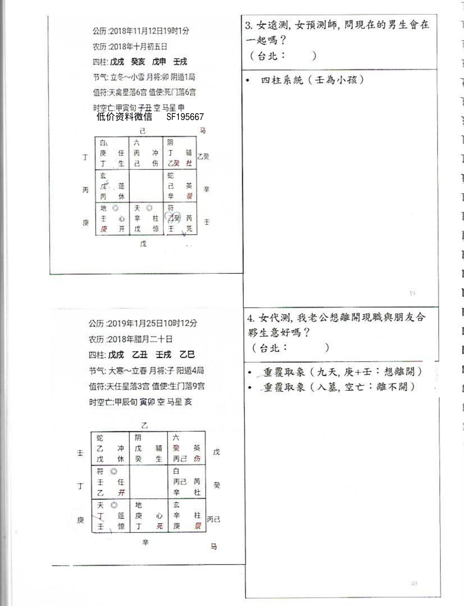

> **🖼 圖像解讀**　｜　檢視狀態：✅ 已檢視
> - **類型**：案例奇門盤＋練習欄（大師研究班投影片 39–40）
> - **內容**：案例 3「女遠測，女預測師，問現在的男生會在一起嗎？（台北）」，練習方法：四柱系統（壬為小孩）；盤：公曆2018年11月12日19時1分，四柱戊戌、癸亥、戊申、壬戌，陰遁1局，值符天禽星落6宮、值使死門落6宮，甲寅旬子丑空、馬星申。案例 4「女代測，我老公想離開現職與朋友合夥生意好嗎？（台北）」，練習方法：重覆取象（九天、庚＋壬：想離開；入墓、空亡：離不開）；盤：公曆2019年1月25日10時12分，四柱戊戌、乙丑、壬戌、乙巳，陽遁4局，值符天任星落3宮、值使生門落9宮，甲辰旬寅卯空、馬星亥。
> - **原文出處（逐字）**：3. 女遠測…問現在的男生會在一起嗎？；4. 女代測，我老公想離開現職與朋友合夥生意好嗎？
> - **可檢索關鍵字**：感情案例, 事業案例, 四柱系統, 壬為小孩, 重覆取象, 想離開離不開, 九天入墓空亡, 合夥生意

**📝 逐字謄寫（第 141 頁）**

### 案例 3（投影片 39）

**3. 女遠測, 女預測師, 問現在的男生會在一起嗎？（台北：　　）**

- 四柱系統（壬為小孩）

公历:2018年11月12日19时1分
农历:2018年十月初五日
四柱: 戊戌　癸亥　戊申　壬戌
节气: 立冬～小雪　月将:卯　阴遁1局
值符:天禽星落6宫　值使:死门落6宫
时空亡:甲寅旬 子丑空　马星 申
〔此處夾有轉售浮水印，略〕

| 巽 | 離 | 坤 |
|---|---|---|
| 白 庚 任 丁 生 | 六 丙 冲 己 伤 | 阴 丁 辅 乙癸 杜 |
| **震** | **中** | **兌** |
| 玄 戊 蓬 丙 休 | | 蛇 己 英 辛 景 |
| **艮** | **坎** | **乾** |
| 地 ◎ 壬 心 庚 开 | 天 ◎ 辛 柱 戊 惊 | 符 乙癸 芮 壬 死 |

盤外引干：上（離）己；左（巽／震／艮）丁／丙／庚；右（坤／兌／乾）乙癸／辛／壬；下（坎）戊；坤宮外標「马」。艮、坎兩宮有空亡圈（子丑空）。（乾宮「乙癸」有手寫圈記。）

### 案例 4（投影片 40）

**4. 女代測, 我老公想離開現職與朋友合夥生意好嗎？（台北：　　）**

- 重覆取象（九天, 庚+壬：想離開）
- 重覆取象（入墓, 空亡：離不開）

公历:2019年1月25日10时12分
农历:2018年腊月二十日
四柱: 戊戌　乙丑　壬戌　乙巳
节气: 大寒～立春　月将:子　阳遁4局
值符:天任星落3宫　值使:生门落9宫
时空亡:甲辰旬 寅卯空　马星 亥

| 巽 | 離 | 坤 |
|---|---|---|
| 蛇 乙 冲 戊 休 | 阴 戊 辅 癸 生 | 六 癸 英 丙己 伤 |
| **震** | **中** | **兌** |
| 符 ◎ 壬 任 乙 开 | | 白 丙己 芮 辛 杜 |
| **艮** | **坎** | **乾** |
| 天 ◎ 丁 蓬 壬 惊 | 地 庚 心 丁 死 | 玄 辛 柱 庚 景 |

盤外引干：上（離）乙；左（巽／震／艮）壬／丁／庚；右（坤／兌／乾）戊／癸／丙己；下（坎）辛；乾宮外標「马」。震、艮兩宮有空亡圈（寅卯空）。

## 圖 142 — 第 142 頁（1240x1617）｜🖼 圖片（開圖判斷：圖表細看／裝飾照簡述）

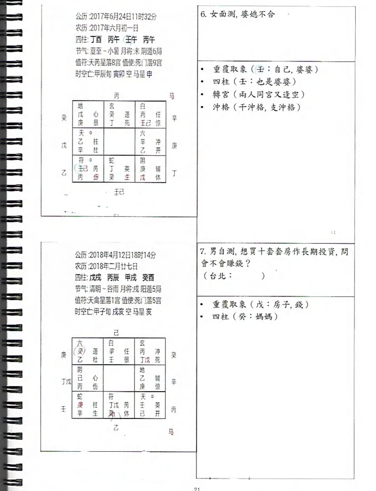

> **🖼 圖像解讀**　｜　檢視狀態：✅ 已檢視
> - **類型**：案例奇門盤＋練習欄（大師研究班投影片 41–42）
> - **內容**：案例 6「女面測，婆媳不合」，練習方法：重覆取象（壬：自己、婆婆）、四柱（壬也是婆婆）、轉宮（兩人同宮又逢空）、沖格（干沖格、支沖格）；盤：公曆2017年6月24日11時32分，四柱丁酉、丙午、壬午、丙午，陰遁6局，值符天芮星落8宮、值使死門落9宮，甲辰旬寅卯空、馬星申。案例 7「男自測，想買十套套房作長期投資，問會不會賺錢？（台北）」，練習方法：重覆取象（戊：房子、錢）、四柱（癸：媽媽）；盤：公曆2018年4月12日18時14分，四柱戊戌、丙辰、甲戌、癸酉，陽遁5局，值符天禽星落1宮、值使死門落5宮，甲子旬戌亥空、馬星亥。（案例編號由 4 跳至 6，原講義未見案例 5。）
> - **原文出處（逐字）**：6. 女面測，婆媳不合；7. 男自測，想買十套套房作長期投資，問會不會賺錢？
> - **可檢索關鍵字**：婆媳不合, 重覆取象, 轉宮逢空, 干沖支沖, 房產投資, 戊為房子錢, 癸為媽媽, 案例盤

**📝 逐字謄寫（第 142 頁）**

（註：案例編號由第 141 頁的 4 直接跳到 6，原講義未見案例 5。）

### 案例 6（投影片 41）

**6. 女面測, 婆媳不合**

- 重覆取象（壬：自己, 婆婆）
- 四柱（壬：也是婆婆）
- 轉宮（兩人同宮又逢空）
- 沖格（干沖格, 支沖格）

公历:2017年6月24日11时32分
农历:2017年六月初一日
四柱: 丁酉　丙午　壬午（日干「壬」有手寫圈記）　丙午
节气: 夏至～小暑　月将:未　阴遁6局
值符:天芮星落8宫　值使:死门落9宫
时空亡:甲辰旬 寅卯空　马星 申

| 巽 | 離 | 坤 |
|---|---|---|
| 地 戊 心 庚 景 | 玄 癸 蓬 丁 死 | 白 丙 任 壬己 惊 |
| **震** | **中** | **兌** |
| 天 ◦ 乙 柱 辛 杜 | | 六 辛 冲 乙 开 |
| **艮** | **坎** | **乾** |
| 符 ◦ 壬己 芮 丙 伤 | 蛇 丁 英 癸 生 | 阴 庚 辅 戊 休 |

盤外引干：上（離）丙；左（巽／震／艮）癸／戊／乙；右（坤／兌／乾）辛／庚／丁；下（坎）壬己；坤宮外標「马」。震、艮兩宮有空亡點。（艮宮「壬己」有手寫圈記。）

### 案例 7（投影片 42）

**7. 男自測, 想買十套套房作長期投資, 問會不會賺錢？（台北：　　）**

- 重覆取象（戊：房子, 錢）
- 四柱（癸：媽媽）

公历:2018年4月12日18时14分
农历:2018年二月廿七日
四柱: 戊戌　丙辰　甲戌　癸酉
节气: 清明～谷雨　月将:戌　阳遁5局
值符:天禽星落1宫　值使:死门落5宫
时空亡:甲子旬 戌亥空　马星 亥

| 巽 | 離 | 坤 |
|---|---|---|
| 六 ⭕癸 蓬 乙 杜 | 白 辛 任 壬 景 | 玄 丙 冲 丁戊 死 |
| **震** | **中** | **兌** |
| 阴 己 心 丙 伤 | | 地 乙 辅 庚 惊 |
| **艮** | **坎** | **乾** |
| 蛇 庚 柱 辛 生 | 符 丁戊 芮 癸 休 | 天 ◦ 壬 英 己 开 |

盤外引干：上（離）己；左（巽／震／艮）庚／丁戊／壬；右（坤／兌／乾）癸／辛／丙；下（坎）乙；乾宮外標「马」。乾宮有空亡點。（巽宮「癸」紅圈、坎宮地盤「癸」有手寫標記。）

（頁碼：21）

## 圖 143 — 第 143 頁（1240x1617）｜🖼 圖片（開圖判斷：圖表細看／裝飾照簡述）

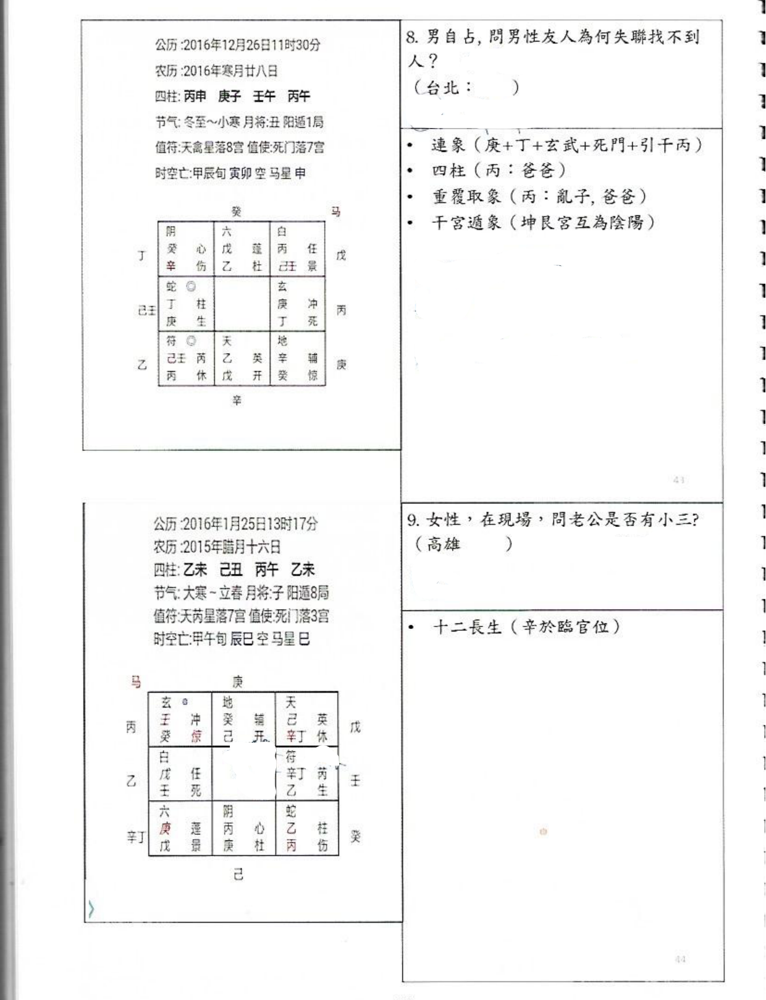

> **🖼 圖像解讀**　｜　檢視狀態：✅ 已檢視
> - **類型**：案例奇門盤＋練習欄（大師研究班投影片 43–44）
> - **內容**：案例 8「男自占，問男性友人為何失聯找不到人？（台北）」，練習方法：連象（庚＋丁＋玄武＋死門＋引干丙）、四柱（丙：爸爸）、重覆取象（丙：亂子、爸爸）、干宮通象（坤艮宮互為陰陽）；盤：公曆2016年12月26日11時30分，四柱丙申、庚子、壬午、丙午，陽遁1局，值符天禽星落8宮、值使死門落7宮，甲辰旬寅卯空、馬星申。案例 9「女性，在現場，問老公是否有小三？（高雄）」，練習方法：十二長生（辛於臨官位）；盤：公曆2016年1月25日13時17分，四柱乙未、己丑、丙午、乙未，陽遁8局，值符天芮星落7宮、值使死門落3宮，甲午旬辰巳空、馬星巳（盤面中宮與坤兌之間有塗白遮蓋）。
> - **原文出處（逐字）**：8. 男自占，問男性友人為何失聯找不到人？；9. 女性，在現場，問老公是否有小三？
> - **可檢索關鍵字**：失聯尋人, 連象, 干宮通象, 丙為爸爸, 小三外遇, 十二長生, 辛臨官, 案例盤

**📝 逐字謄寫（第 143 頁）**

### 案例 8（投影片 43）

**8. 男自占, 問男性友人為何失聯找不到人？（台北：　　）**

- 連象（庚+丁+玄武+死門+引干丙）
- 四柱（丙：爸爸）
- 重覆取象（丙：亂子, 爸爸）
- 干宮通象（坤艮宮互為陰陽）

公历:2016年12月26日11时30分
农历:2016年寒月廿八日
四柱: 丙申　庚子　壬午　丙午
节气: 冬至～小寒　月将:丑　阳遁1局
值符:天禽星落8宫　值使:死门落7宫
时空亡:甲辰旬 寅卯空　马星 申

| 巽 | 離 | 坤 |
|---|---|---|
| 阴 癸 心 辛 伤 | 六 戊 蓬 乙 杜 | 白 丙 任 己壬 景 |
| **震** | **中** | **兌** |
| 蛇 ◎ 丁 柱 庚 生 | | 玄 庚 冲 丁 死 |
| **艮** | **坎** | **乾** |
| 符 ◎ 己壬 芮 丙 休 | 天 乙 英 戊 开 | 地 辛 辅 癸 惊 |

盤外引干：上（離）癸；左（巽／震／艮）丁／己壬／乙；右（坤／兌／乾）戊／丙／庚；下（坎）辛；坤宮外標「马」。震、艮兩宮有空亡圈。

### 案例 9（投影片 44）

**9. 女性，在現場，問老公是否有小三?（高雄　　）**

- 十二長生（辛於臨官位）

公历:2016年1月25日13时17分
农历:2015年腊月十六日
四柱: 乙未　己丑　丙午　乙未
节气: 大寒～立春　月将:子　阳遁8局
值符:天芮星落7宫　值使:死门落3宫
时空亡:甲午旬 辰巳空　马星 巳

| 巽 | 離 | 坤 |
|---|---|---|
| 玄 ◦ 壬 冲 癸 惊 | 地 癸 辅 己 开 | 天 己 英 辛丁 休 |
| **震** | **中** | **兌** |
| 白 戊 任 壬 死 | 〔塗白遮蓋〕 | 符 辛丁 芮 乙 生 |
| **艮** | **坎** | **乾** |
| 六 庚 蓬 戊 景 | 阴 丙 心 庚 杜 | 蛇 乙 柱 丙 伤 |

盤外引干：上（離）庚；左（巽／震／艮）丙／乙／辛丁；右（坤／兌／乾）戊／壬／癸；下（坎）己；巽宮外左上標「马」。巽宮有空亡點。（中宮與坤、兌宮之間有白色修正液塗蓋，被遮部分圖中未能辨識。）

## 圖 144 — 第 144 頁（1240x1617）｜🖼 圖片（開圖判斷：圖表細看／裝飾照簡述）

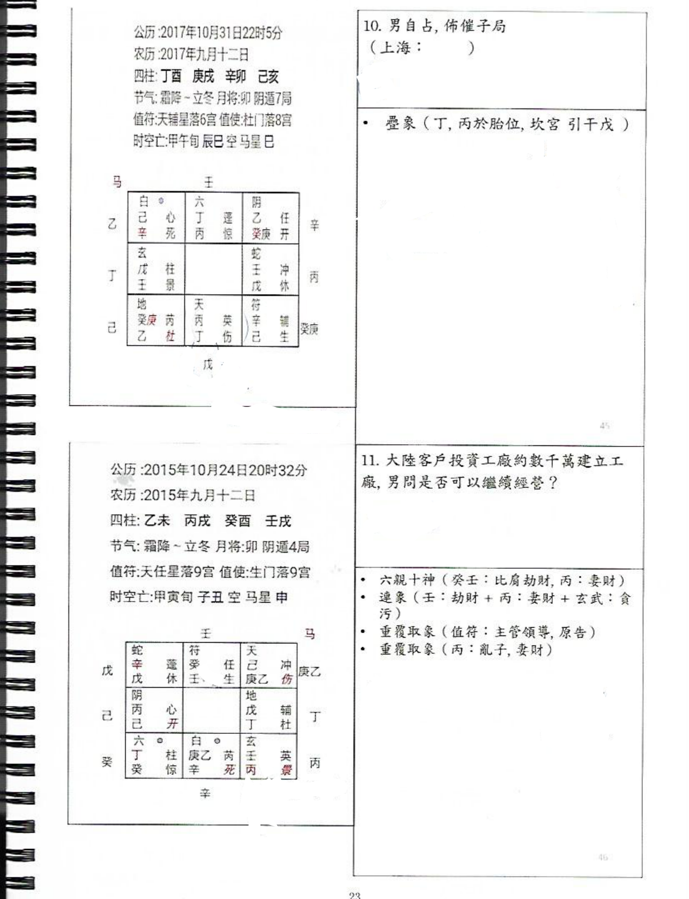

> **🖼 圖像解讀**　｜　檢視狀態：✅ 已檢視
> - **類型**：案例奇門盤＋練習欄（大師研究班投影片 45–46）
> - **內容**：案例 10「男自占，佈催子局（上海）」，練習方法：疊象（丁、丙於胎位，坎宮引干戊）；盤：公曆2017年10月31日22時5分，四柱丁酉、庚戌、辛卯、己亥，陰遁7局，值符天輔星落6宮、值使杜門落8宮，甲午旬辰巳空、馬星巳。案例 11「大陸客戶投資工廠約數千萬建立工廠，男問是否可以繼續經營？」，練習方法：六親十神（癸壬：比肩劫財，丙：妻財）、連象（壬劫財＋丙妻財＋玄武貪污）、重覆取象（值符：主管領導、原告；丙：亂子、妻財）；盤：公曆2015年10月24日20時32分，四柱乙未、丙戌、癸酉、壬戌，陰遁4局，值符天任星落9宮、值使生門落9宮，甲寅旬子丑空、馬星申。
> - **原文出處（逐字）**：10. 男自占，佈催子局；11. 大陸客戶投資工廠…男問是否可以繼續經營？
> - **可檢索關鍵字**：催子局, 胎位, 疊象, 工廠經營, 六親十神, 比肩劫財, 玄武貪污, 案例盤

**📝 逐字謄寫（第 144 頁）**

### 案例 10（投影片 45）

**10. 男自占, 佈催子局（上海：　　）**

- 疊象（丁, 丙於胎位, 坎宮 引干戊）

公历:2017年10月31日22时5分
农历:2017年九月十二日
四柱: 丁酉　庚戌　辛卯　己亥
节气: 霜降～立冬　月将:卯　阴遁7局
值符:天辅星落6宫　值使:杜门落8宫
时空亡:甲午旬 辰巳空　马星 巳

| 巽 | 離 | 坤 |
|---|---|---|
| 白 ◦ 己 心 辛 死 | 六 丁 蓬 丙 惊 | 阴 乙 任 癸庚 开 |
| **震** | **中** | **兌** |
| 玄 戊 柱 壬 景 | | 蛇 壬 冲 戊 休 |
| **艮** | **坎** | **乾** |
| 地 癸庚 芮 乙 杜 | 天 丙 英 丁 伤 | 符 辛 辅 己 生 |

盤外引干：上（離）壬；左（巽／震／艮）乙／丁／己；右（坤／兌／乾）辛／丙／癸庚；下（坎）戊；巽宮外左上標「马」。巽宮有空亡點。（坎宮周圍有手寫弧線。）

### 案例 11（投影片 46）

**11. 大陸客戶投資工廠約數千萬建立工廠, 男問是否可以繼續經營？**

- 六親十神（癸壬：比肩劫財, 丙：妻財）
- 連象（壬：劫財 + 丙：妻財 + 玄武：貪污）
- 重覆取象（值符：主管領導, 原告）
- 重覆取象（丙：亂子, 妻財）

公历:2015年10月24日20时32分
农历:2015年九月十二日
四柱: 乙未　丙戌　癸酉　壬戌
节气: 霜降～立冬　月将:卯　阴遁4局
值符:天任星落9宫　值使:生门落9宫
时空亡:甲寅旬 子丑空　马星 申

| 巽 | 離 | 坤 |
|---|---|---|
| 蛇 辛 蓬 戊 休 | 符 癸 任 壬 生 | 天 己 冲 庚乙 伤 |
| **震** | **中** | **兌** |
| 阴 丙 心 己 开 | | 地 戊 辅 丁 杜 |
| **艮** | **坎** | **乾** |
| 六 ◦ 丁 柱 癸 惊 | 白 ◦ 庚乙 芮 辛 死 | 玄 壬 英 丙 景 |

盤外引干：上（離）壬；左（巽／震／艮）戊／己／癸；右（坤／兌／乾）庚乙／丁／丙；下（坎）辛；坤宮外標「马」。艮、坎兩宮有空亡點。

（頁碼：23）

## 圖 145 — 第 145 頁（1240x1617）｜🖼 圖片（開圖判斷：圖表細看／裝飾照簡述）

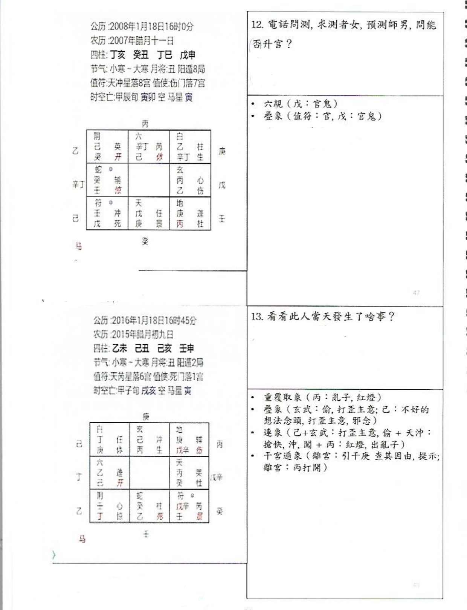

> **🖼 圖像解讀**　｜　檢視狀態：✅ 已檢視
> - **類型**：案例奇門盤＋練習欄（大師研究班投影片 47–48）
> - **內容**：案例 12「電話問測，求測者女，預測師男，問能否升官？」，練習方法：六親（戊：官鬼）、疊象（值符：官，戊：官鬼）；盤：公曆2008年1月18日16時0分，四柱丁亥、癸丑、丁巳、戊申，陽遁8局，值符天沖星落8宮、值使傷門落7宮，甲辰旬寅卯空、馬星寅。案例 13「看看此人當天發生了啥事？」，練習方法：重覆取象（丙：亂子、紅燈）、疊象（玄武：偷、打歪主意；己：不好的想法念頭、邪念）、連象（己＋玄武：打歪主意、偷＋天沖：搶快、沖、闖＋丙：紅燈、出亂子）、干宮通象（離宮：引干庚查其因由提示；離宮：丙打開）；盤：公曆2016年1月18日16時45分，四柱乙未、己丑、己亥、壬申，陽遁2局，值符天芮星落6宮、值使死門落1宮，甲子旬戌亥空、馬星寅。
> - **原文出處（逐字）**：12. 電話問測…問能否升官？；13. 看看此人當天發生了啥事？
> - **可檢索關鍵字**：升官, 戊為官鬼, 值符為官, 闖紅燈, 連象, 玄武打歪主意, 天沖搶快, 干宮通象

**📝 逐字謄寫（第 145 頁）**

### 案例 12（投影片 47）

**12. 電話問測, 求測者女, 預測師男, 問能否升官？**

- 六親（戊：官鬼）
- 疊象（值符：官, 戊：官鬼）

公历:2008年1月18日16时0分
农历:2007年腊月十一日
四柱: 丁亥　癸丑　丁巳　戊申
节气: 小寒～大寒　月将:丑　阳遁8局
值符:天冲星落8宫　值使:伤门落7宫
时空亡:甲辰旬 寅卯空　马星 寅

| 巽 | 離 | 坤 |
|---|---|---|
| 阴 己 英 癸 开 | 六 辛丁 芮 己 休 | 白 乙 柱 辛丁 生 |
| **震** | **中** | **兌** |
| 蛇 ◦ 癸 辅 壬 惊 | | 玄 丙 心 乙 伤 |
| **艮** | **坎** | **乾** |
| 符 ◦ 壬 冲 戊 死 | 天 戊 任 庚 景 | 地 庚 蓬 丙 杜 |

盤外引干：上（離）丙；左（巽／震／艮）乙／辛丁／己；右（坤／兌／乾）庚／戊／壬；下（坎）癸；艮宮外標「马」。震、艮兩宮有空亡點。

### 案例 13（投影片 48）

**13. 看看此人當天發生了啥事？**

- 重覆取象（丙：亂子, 紅燈）
- 疊象（玄武：偷, 打歪主意; 己：不好的想法念頭, 打歪主意, 邪念）
- 連象（己+玄武：打歪主意, 偷 + 天沖：搶快, 沖, 闖 + 丙：紅燈, 出亂子）
- 干宮通象（離宮：引干庚 查其因由, 提示; 離宮：丙打開）

公历:2016年1月18日16时45分
农历:2015年腊月初九日
四柱: 乙未　己丑　己亥　壬申
节气: 小寒～大寒　月将:丑　阳遁2局
值符:天芮星落6宫　值使:死门落1宫
时空亡:甲子旬 戌亥空　马星 寅

| 巽 | 離 | 坤 |
|---|---|---|
| 白 丁 任 庚 休 | 玄 己 冲 丙 生 | 地 庚 辅 戊辛 伤 |
| **震** | **中** | **兌** |
| 六 乙 蓬 己 开 | | 天 丙 英 癸 杜 |
| **艮** | **坎** | **乾** |
| 阴 壬 心 丁 惊 | 蛇 癸 柱 乙 死 | 符 ◦ 戊辛 芮 壬 景 |

盤外引干：上（離）庚；左（巽／震／艮）己／丁／乙；右（坤／兌／乾）丙／戊辛／癸；下（坎）壬；艮宮外標「马」。乾宮有空亡點。（此盤掃描較淡，艮宮天盤「壬」依字形辨識。）

## 圖 146 — 第 146 頁（1240x1617）｜🖼 圖片（開圖判斷：圖表細看／裝飾照簡述）

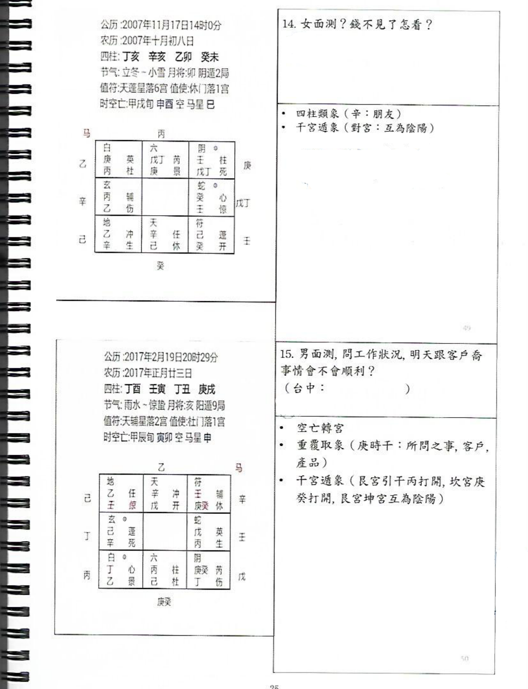

> **🖼 圖像解讀**　｜　檢視狀態：✅ 已檢視
> - **類型**：案例奇門盤＋練習欄（大師研究班投影片 49–50）
> - **內容**：案例 14「女面測？錢不見了怎看？」，練習方法：四柱類象（辛：朋友）、干宮通象（對宮：互為陰陽）；盤：公曆2007年11月17日14時0分，四柱丁亥、辛亥、乙卯、癸未，陰遁2局，值符天蓬星落6宮、值使休門落1宮，甲戌旬申酉空、馬星巳。案例 15「男面測，問工作狀況，明天跟客戶喬事情會不會順利？（台中）」，練習方法：空亡轉宮、重覆取象（庚時干：所問之事、客戶、產品）、干宮通象（艮宮引干丙打開，坎宮庚癸打開，艮宮坤宮互為陰陽）；盤：公曆2017年2月19日20時29分，四柱丁酉、壬寅、丁丑、庚戌，陽遁9局，值符天輔星落2宮、值使杜門落1宮，甲辰旬寅卯空、馬星申。
> - **原文出處（逐字）**：14. 女面測？錢不見了怎看？；15. 男面測，問工作狀況，明天跟客戶喬事情會不會順利？
> - **可檢索關鍵字**：錢不見, 辛為朋友, 對宮陰陽, 客戶談判, 空亡轉宮, 庚時干客戶, 干宮通象, 案例盤

**📝 逐字謄寫（第 146 頁）**

### 案例 14（投影片 49）

**14. 女面測？錢不見了怎看？**

- 四柱類象（辛：朋友）
- 干宮通象（對宮：互為陰陽）

公历:2007年11月17日14时0分
农历:2007年十月初八日
四柱: 丁亥　辛亥　乙卯　癸未
节气: 立冬～小雪　月将:卯　阴遁2局
值符:天蓬星落6宫　值使:休门落1宫
时空亡:甲戌旬 申酉空　马星 巳

| 巽 | 離 | 坤 |
|---|---|---|
| 白 庚 英 丙 杜 | 六 戊丁 芮 庚 景 | 阴 ◦ 壬 柱 戊丁 死 |
| **震** | **中** | **兌** |
| 玄 丙 辅 乙 伤 | | 蛇 ◦ 癸 心 壬 惊 |
| **艮** | **坎** | **乾** |
| 地 乙 冲 辛 生 | 天 辛 任 己 休 | 符 己 蓬 癸 开 |

盤外引干：上（離）丙；左（巽／震／艮）乙／辛／己；右（坤／兌／乾）庚／戊丁／壬；下（坎）癸；巽宮外左上標「马」。坤、兌兩宮有空亡點。

### 案例 15（投影片 50）

**15. 男面測, 問工作狀況, 明天跟客戶喬事情會不會順利？（台中：　　）**

- 空亡轉宮
- 重覆取象（庚時干：所問之事, 客戶, 產品）
- 干宮通象（艮宮引干丙打開, 坎宮庚癸打開, 艮宮坤宮互為陰陽）

公历:2017年2月19日20时29分
农历:2017年正月廿三日
四柱: 丁酉　壬寅　丁丑　庚戌
节气: 雨水～惊蛰　月将:亥　阳遁9局
值符:天辅星落2宫　值使:杜门落1宫
时空亡:甲辰旬 寅卯空　马星 申

| 巽 | 離 | 坤 |
|---|---|---|
| 地 乙 任 壬 惊 | 天 辛 冲 戊 开 | 符 壬 辅 庚癸 休 |
| **震** | **中** | **兌** |
| 玄 ◦ 己 蓬 辛 死 | | 蛇 戊 英 丙 生 |
| **艮** | **坎** | **乾** |
| 白 ◦ 丁 心 乙 景 | 六 丙 柱 己 杜 | 阴 庚癸 芮 丁 伤 |

盤外引干：上（離）乙；左（巽／震／艮）己／丁／丙；右（坤／兌／乾）辛／壬／戊；下（坎）庚癸；坤宮外標「马」。震、艮兩宮有空亡點。

（頁碼：25）

## 圖 147 — 第 147 頁（1240x1617）｜🖼 圖片（開圖判斷：圖表細看／裝飾照簡述）

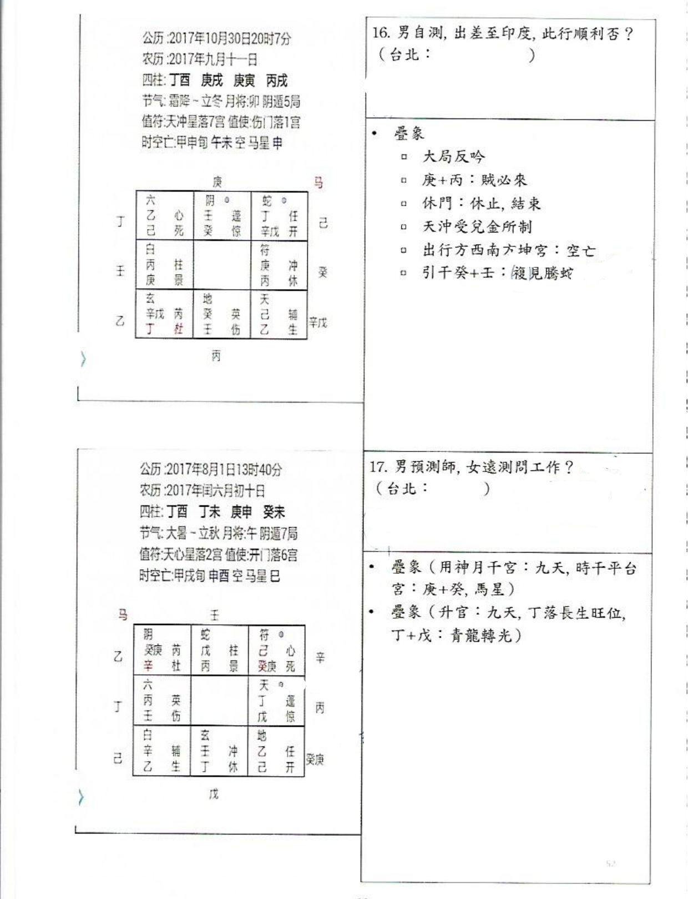

> **🖼 圖像解讀**　｜　檢視狀態：✅ 已檢視
> - **類型**：案例奇門盤＋練習欄（大師研究班投影片 51–52）
> - **內容**：案例 16「男自測，出差至印度，此行順利否？（台北）」，練習方法：疊象——大局反吟、庚＋丙賊必來、休門休止結束、天沖受兌金所制、出行方西南方坤宮空亡、引干癸＋壬複見騰蛇；盤：公曆2017年10月30日20時7分，四柱丁酉、庚戌、庚寅、丙戌，陰遁5局，值符天沖星落7宮、值使傷門落1宮，甲申旬午未空、馬星申。案例 17「男預測師，女遠測問工作？（台北）」，練習方法：疊象（用神月干宮：九天，時干平台宮：庚＋癸、馬星）、疊象（升官：九天，丁落長生旺位，丁＋戊：青龍轉光）；盤：公曆2017年8月1日13時40分，四柱丁酉、丁未、庚申、癸未，陰遁7局，值符天心星落2宮、值使開門落6宮，甲戌旬申酉空、馬星巳。
> - **原文出處（逐字）**：16. 男自測，出差至印度，此行順利否？；17. 男預測師，女遠測問工作？
> - **可檢索關鍵字**：出差出行, 大局反吟, 庚加丙賊必來, 出行方空亡, 複見騰蛇, 工作升官, 青龍轉光, 月干用神

**📝 逐字謄寫（第 147 頁）**

### 案例 16（投影片 51）

**16. 男自測, 出差至印度, 此行順利否？（台北：　　）**

- 疊象
  - ☐ 大局反吟
  - ☐ 庚+丙：賊必來
  - ☐ 休門：休止, 結束
  - ☐ 天沖受兌金所制
  - ☐ 出行方西南方坤宮：空亡
  - ☐ 引干癸+壬：複見騰蛇

公历:2017年10月30日20时7分
农历:2017年九月十一日
四柱: 丁酉　庚戌　庚寅　丙戌
节气: 霜降～立冬　月将:卯　阴遁5局
值符:天冲星落7宫　值使:伤门落1宫
时空亡:甲申旬 午未空　马星 申

| 巽 | 離 | 坤 |
|---|---|---|
| 六 乙 心 己 死 | 阴 ◦ 壬 蓬 癸 惊 | 蛇 ◦ 丁 任 辛戊 开 |
| **震** | **中** | **兌** |
| 白 丙 柱 庚 景 | | 符 庚 冲 丙 休 |
| **艮** | **坎** | **乾** |
| 玄 辛戊 芮 丁 杜 | 地 癸 英 壬 伤 | 天 己 辅 乙 生 |

盤外引干：上（離）庚；左（巽／震／艮）丁／壬／乙；右（坤／兌／乾）己／癸／辛戊；下（坎）丙；坤宮外標「马」。離、坤兩宮有空亡點。

### 案例 17（投影片 52）

**17. 男預測師, 女遠測問工作？（台北：　　）**

- 疊象（用神月干宮：九天, 時干平台宮：庚+癸, 馬星）
- 疊象（升官：九天, 丁落長生旺位, 丁+戊：青龍轉光）

公历:2017年8月1日13时40分
农历:2017年闰六月初十日
四柱: 丁酉　丁未　庚申　癸未
节气: 大暑～立秋　月将:午　阴遁7局
值符:天心星落2宫　值使:开门落6宫
时空亡:甲戌旬 申酉空　马星 巳

| 巽 | 離 | 坤 |
|---|---|---|
| 阴 癸庚 芮 辛 杜 | 蛇 戊 柱 丙 景 | 符 ◦ 己 心 癸庚 死 |
| **震** | **中** | **兌** |
| 六 丙 英 壬 伤 | | 天 ◦ 丁 蓬 戊 惊 |
| **艮** | **坎** | **乾** |
| 白 辛 辅 乙 生 | 玄 壬 冲 丁 休 | 地 乙 任 己 开 |

盤外引干：上（離）壬；左（巽／震／艮）乙／丁／己；右（坤／兌／乾）辛／丙／癸庚；下（坎）戊；巽宮外左上標「马」。坤、兌兩宮有空亡點。

## 圖 148 — 第 148 頁（1240x1617）｜🖼 圖片（開圖判斷：圖表細看／裝飾照簡述）

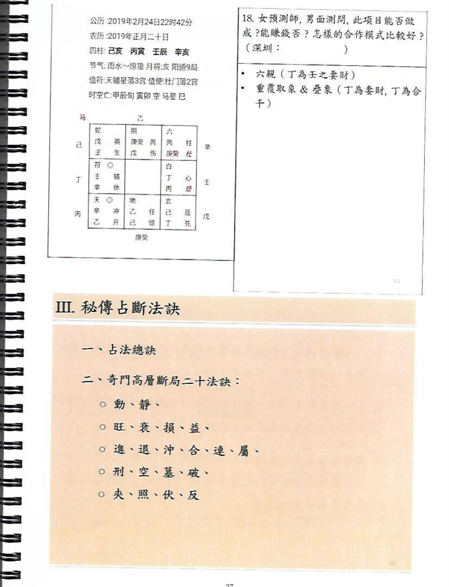

> **🖼 圖像解讀**　｜　檢視狀態：✅ 已檢視
> - **類型**：案例奇門盤＋目錄頁（大師研究班投影片 53–54）
> - **內容**：案例 18「女預測師，男面測問，此項目能否做成？能賺錢否？怎樣的合作模式比較好？（深圳）」，練習方法：六親（丁為壬之妻財）、重覆取象＆疊象（丁為妻財、丁為合干）；盤：公曆2019年2月24日22時42分，四柱己亥、丙寅、壬辰、辛亥，陽遁9局，值符天輔星落3宮、值使杜門落2宮，甲辰旬寅卯空、馬星巳。第 III 部「秘傳占斷法訣」目錄：占法總訣、奇門高層斷局二十法訣（動、靜；旺、衰、損、益；進、退、沖、合、連、屬；刑、空、墓、破；夾、照、伏、反）。
> - **原文出處（逐字）**：18. 女預測師，男面測問，此項目能否做成？…；III. 秘傳占斷法訣
> - **可檢索關鍵字**：項目合作, 丁為妻財, 合干, 秘傳占斷法訣, 占法總訣, 斷局二十法訣, 動靜旺衰, 夾照伏反

**📝 逐字謄寫（第 148 頁）**

### 案例 18（投影片 53）

**18. 女預測師, 男面測問, 此項目能否做成？能賺錢否？怎樣的合作模式比較好？（深圳：　　）**

- 六親（丁為壬之妻財）
- 重覆取象 & 疊象（丁為妻財, 丁為合干）

公历:2019年2月24日22时42分
农历:2019年正月二十日
四柱: 己亥　丙寅　壬辰　辛亥
节气: 雨水～惊蛰　月将:亥　阳遁9局
值符:天辅星落3宫　值使:杜门落2宫
时空亡:甲辰旬 寅卯空　马星 巳

| 巽 | 離 | 坤 |
|---|---|---|
| 蛇 戊 英 壬 生 | 阴 庚癸 芮 戊 伤 | 六 丙 柱 庚癸 杜 |
| **震** | **中** | **兌** |
| 符 ◎ 壬 辅 辛 休 | | 白 丁 心 丙 景 |
| **艮** | **坎** | **乾** |
| 天 ◎ 辛 冲 乙 开 | 地 乙 任 己 惊 | 玄 己 蓬 丁 死 |

盤外引干：上（離）乙；左（巽／震／艮）己／丁／丙；右（坤／兌／乾）辛／壬／戊；下（坎）庚癸；巽宮外左上標「马」。震、艮兩宮有空亡圈。

### III. 秘傳占斷法訣（投影片 54）

一、占法總訣

二、奇門高層斷局二十法訣：
- ○ 動、靜、
- ○ 旺、衰、損、益、
- ○ 進、退、沖、合、連、屬、
- ○ 刑、空、墓、破、
- ○ 夾、照、伏、反

（頁碼：27）

## 圖 149 — 第 149 頁（1240x1617）｜🖼 圖片（開圖判斷：圖表細看／裝飾照簡述）

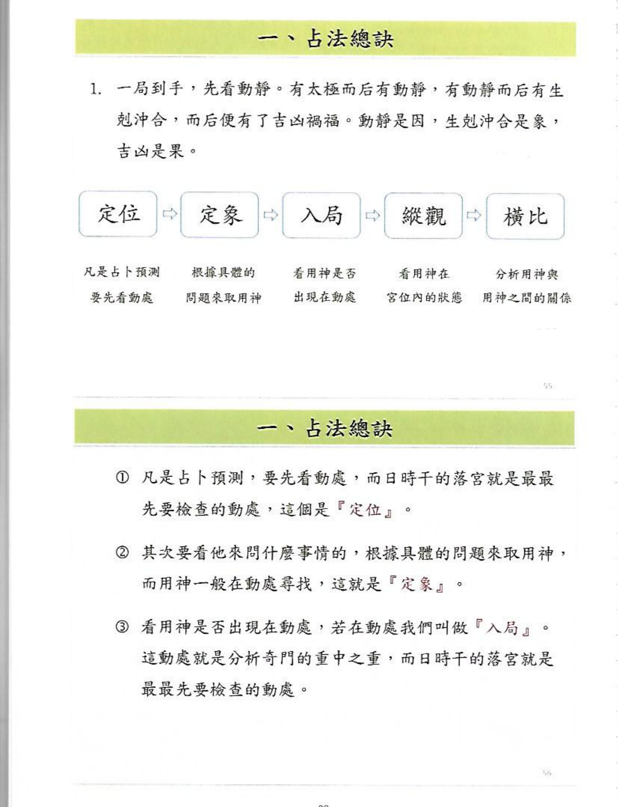

> **🖼 圖像解讀**　｜　檢視狀態：✅ 已檢視
> - **類型**：流程圖＋文字頁（大師研究班投影片 55–56）
> - **內容**：「一、占法總訣」：一局到手先看動靜——有太極而後有動靜，有動靜而後有生剋沖合，而後有吉凶禍福；動靜是因、生剋沖合是象、吉凶是果。占斷五步驟流程：定位（凡是占卜預測要先看動處）→ 定象（根據具體問題取用神）→ 入局（看用神是否出現在動處）→ 縱觀（看用神在宮位內的狀態）→ 橫比（分析用神與用神之間的關係）；並說明定位以日時干落宮為最先檢查的動處、定象於動處尋找用神、用神在動處叫入局。
> - **原文出處（逐字）**：一、占法總訣（投影片 55–56）
> - **可檢索關鍵字**：占法總訣, 先看動靜, 動靜是因, 生剋沖合是象, 吉凶是果, 定位定象入局, 縱觀橫比, 占斷五步驟

**📝 逐字謄寫（第 149 頁）**

### 一、占法總訣（投影片 55）

1. 一局到手，先看動靜。有太極而后有動靜，有動靜而后有生剋沖合，而后便有了吉凶禍福。動靜是因，生剋沖合是象，吉凶是果。

**定位 ⇨ 定象 ⇨ 入局 ⇨ 縱觀 ⇨ 橫比**

| 定位 | 定象 | 入局 | 縱觀 | 橫比 |
|---|---|---|---|---|
| 凡是占卜預測要先看動處 | 根據具體的問題來取用神 | 看用神是否出現在動處 | 看用神在宮位內的狀態 | 分析用神與用神之間的關係 |

### 一、占法總訣（投影片 56）

① 凡是占卜預測，要先看動處，而日時干的落宮就是最最先要檢查的動處，這個是『定位』。

② 其次要看他來問什麼事情的，根據具體的問題來取用神，而用神一般在動處尋找，這就是『定象』。

③ 看用神是否出現在動處，若在動處我們叫做『入局』。這動處就是分析奇門的重中之重，而日時干的落宮就是最最先要檢查的動處。

## 圖 150 — 第 150 頁（1240x1617）｜🖼 圖片（開圖判斷：圖表細看／裝飾照簡述）

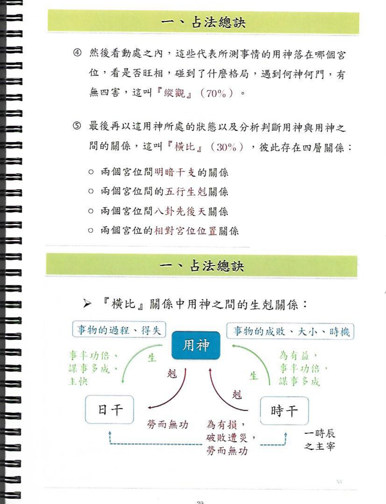

> **🖼 圖像解讀**　｜　檢視狀態：✅ 已檢視
> - **類型**：文字頁＋生剋關係圖（大師研究班投影片 57–58）
> - **內容**：占法總訣續：縱觀（70%）——看代表所測之事的用神落在哪宮、是否旺相、碰到什麼格局、遇何神何門、有無四害；橫比（30%）——分析用神所處狀態及用神與用神之間的關係，含四層：兩宮間明暗干支關係、五行生剋關係、八卦先後天關係、相對宮位位置關係。橫比中用神之間的生剋圖：日干與用神看事物的過程與得失（用神生日干：事半功倍、謀事多成、主快；用神剋日干：勞而無功），時干與用神看事物的成敗、大小、時機（時干生用神：為有益、事半功倍、謀事多成；時干剋用神：為有損、破敗遭災、勞而無功），時干為一時辰之主宰。
> - **原文出處（逐字）**：一、占法總訣（投影片 57–58）
> - **可檢索關鍵字**：縱觀七成, 橫比三成, 旺相格局, 四層關係, 明暗干支, 先後天八卦, 用神生剋, 過程得失成敗時機

**📝 逐字謄寫（第 150 頁）**

### 一、占法總訣（投影片 57）

④ 然後看動處之內，這些代表所測事情的用神落在哪個宮位，看是否旺相，碰到了什麼格局，遇到何神何門，有無四害，這叫『縱觀』（70%）。

⑤ 最後再以這用神所處的狀態以及分析判斷用神與用神之間的關係，這叫『橫比』（30%），彼此存在四層關係：
   - ○ 兩個宮位間明暗干支的關係
   - ○ 兩個宮位間的五行生剋關係
   - ○ 兩個宮位間八卦先後天關係
   - ○ 兩個宮位的相對宮位位置關係

### 一、占法總訣（投影片 58）

➢ 『橫比』關係中用神之間的生剋關係：

（三角關係圖：上方「用神」，左下「日干」，右下「時干」）

- 用神 ↔ 日干（事物的過程、得失）：
  - 用神「生」日干：事半功倍、謀事多成、主快
  - 用神「剋」日干：勞而無功
- 時干 ↔ 用神（事物的成敗、大小、時機）：
  - 時干「生」用神：為有益，事半功倍，謀事多成
  - 時干「剋」用神：為有損，破敗遭災，勞而無功
- 日干與時干之間以虛線相連；時干旁註：一時辰之主宰

（註：箭頭方向依圖示描述。）

## 圖 151 — 第 151 頁（1240x1617）｜🖼 圖片（開圖判斷：圖表細看／裝飾照簡述）

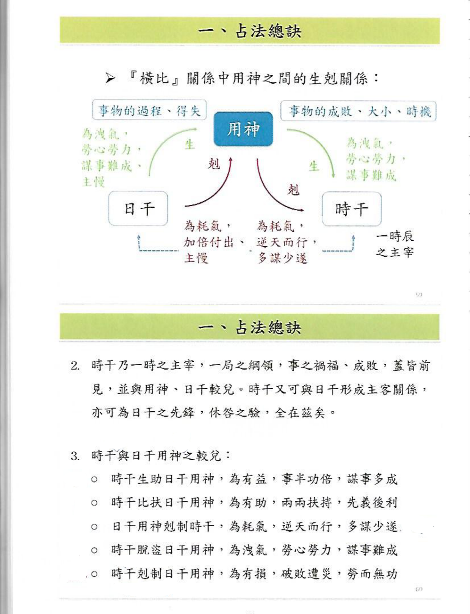

> **🖼 圖像解讀**　｜　檢視狀態：✅ 已檢視
> - **類型**：生剋關係圖＋文字頁（大師研究班投影片 59–60）
> - **內容**：橫比生剋圖（反向）：日干生用神為洩氣、勞心勞力、謀事難成、主慢；日干剋用神為耗氣、加倍付出、主慢；用神生時干為洩氣、勞心勞力、謀事難成；用神剋時干為耗氣、逆天而行、多謀少遂。占法總訣續：時干乃一時之主宰、一局綱領，可與日干成主客、為日干先鋒。時干與日干用神之較兇：時干生助日干用神為有益、事半功倍；比扶為有助、兩兩扶持、先義後利；日干用神剋制時干為耗氣、逆天而行、多謀少遂；時干脫盜日干用神為洩氣、勞心勞力、謀事難成；時干剋制日干用神為有損、破敗遭災、勞而無功。
> - **原文出處（逐字）**：一、占法總訣（投影片 59–60）
> - **可檢索關鍵字**：橫比生剋, 洩氣, 耗氣, 逆天而行, 時干生助, 比扶有助, 時干脫盜, 破敗遭災

**📝 逐字謄寫（第 151 頁）**

### 一、占法總訣（投影片 59）

➢ 『橫比』關係中用神之間的生剋關係：

（三角關係圖：上方「用神」，左下「日干」，右下「時干」）

- 日干 ↔ 用神（事物的過程、得失）：
  - 日干「生」用神：為洩氣，勞心勞力，謀事難成，主慢
  - 日干「剋」用神：為耗氣，加倍付出、主慢
- 用神 ↔ 時干（事物的成敗、大小、時機）：
  - 用神「生」時干：為洩氣，勞心勞力，謀事難成
  - 用神「剋」時干：為耗氣，逆天而行，多謀少遂
- 時干旁註：一時辰之主宰

### 一、占法總訣（投影片 60）

2. 時干乃一時之主宰，一局之綱領，事之禍福、成敗，蓋皆前見，並與用神、日干較兇。時干又可與日干形成主客關係，亦可為日干之先鋒，休咎之驗，全在茲矣。

3. 時干與日干用神之較兇：
   - ○ 時干生助日干用神，為有益，事半功倍，謀事多成
   - ○ 時干比扶日干用神，為有助，兩兩扶持，先義後利
   - ○ 日干用神剋制時干，為耗氣，逆天而行，多謀少遂
   - ○ 時干脫盜日干用神，為洩氣，勞心勞力，謀事難成
   - ○ 時干剋制日干用神，為有損，破敗遭災，勞而無功

## 圖 152 — 第 152 頁（1240x1617）｜🖼 圖片（開圖判斷：圖表細看／裝飾照簡述）

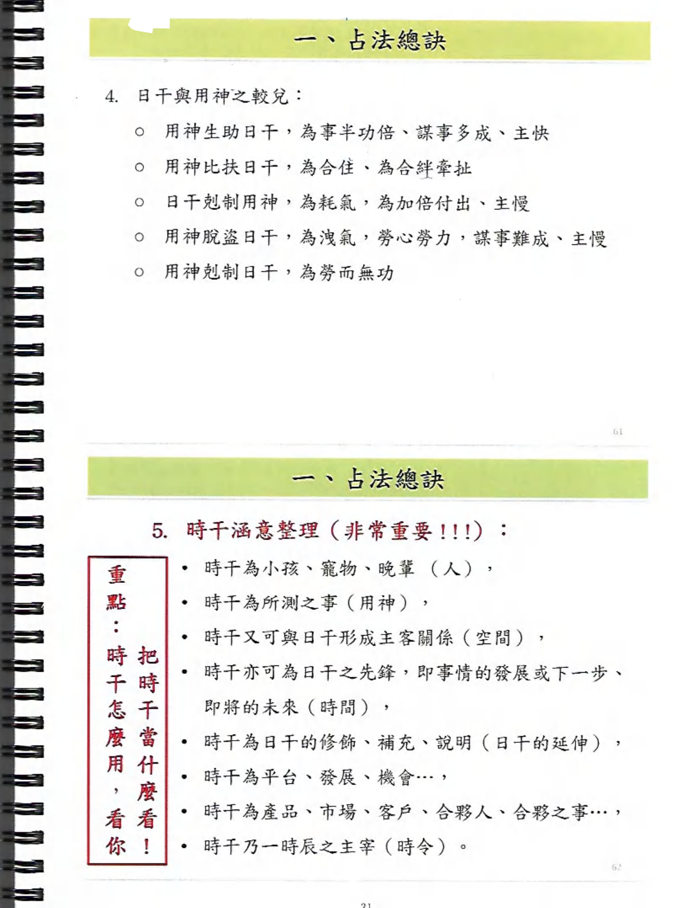

> **🖼 圖像解讀**　｜　檢視狀態：✅ 已檢視
> - **類型**：文字頁（大師研究班投影片 61–62）
> - **內容**：日干與用神之較兇：用神生助日干為事半功倍、謀事多成、主快；用神比扶日干為合住、合絆牽扯；日干剋制用神為耗氣、加倍付出、主慢；用神脫盜日干為洩氣、勞心勞力、謀事難成、主慢；用神剋制日干為勞而無功。投影片 62 重列「時干涵意整理（非常重要!!!）」（同第 127 頁），並以紅框強調：時干怎麼用，把時干當什麼看，看你！
> - **原文出處（逐字）**：一、占法總訣（投影片 61–62）
> - **可檢索關鍵字**：日干用神較兇, 用神生助主快, 比扶合絆, 耗氣主慢, 洩氣主慢, 勞而無功, 時干涵意整理

**📝 逐字謄寫（第 152 頁）**

### 一、占法總訣（投影片 61）

4. 日干與用神之較兇：
   - ○ 用神生助日干，為事半功倍、謀事多成、主快
   - ○ 用神比扶日干，為合住、為合絆牽扯
   - ○ 日干剋制用神，為耗氣，為加倍付出、主慢
   - ○ 用神脫盜日干，為洩氣，勞心勞力，謀事難成、主慢
   - ○ 用神剋制日干，為勞而無功

### 一、占法總訣（投影片 62）

5. **時干涵意整理（非常重要!!!）**：
   - 時干為小孩、寵物、晚輩（人），
   - 時干為所測之事（用神），
   - 時干又可與日干形成主客關係（空間），
   - 時干亦可為日干之先鋒，即事情的發展或下一步、即將的未來（時間），
   - 時干為日干的修飾、補充、說明（日干的延伸），
   - 時干為平台、發展、機會…，
   - 時干為產品、市場、客戶、合夥人、合夥之事…，
   - 時干乃一時辰之主宰（時令）。

（左側紅框：重點：時干怎麼用，把時干當什麼看，看你！）

（頁碼：31）

## 圖 153 — 第 153 頁（1240x1617）｜🖼 圖片（開圖判斷：圖表細看／裝飾照簡述）

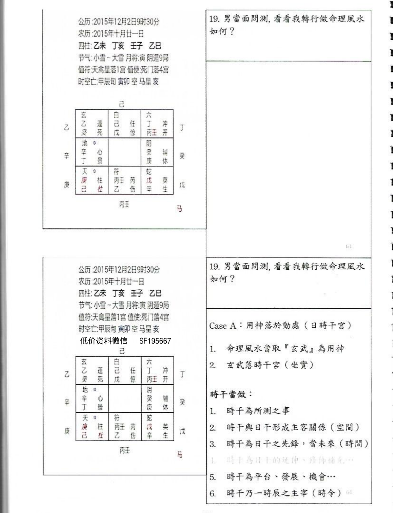

> **🖼 圖像解讀**　｜　檢視狀態：✅ 已檢視
> - **類型**：案例奇門盤＋解析（大師研究班投影片 63–64）
> - **內容**：案例 19「男當面問測，看看我轉行做命理風水如何？」同一盤列兩次：公曆2015年12月2日9時30分，四柱乙未、丁亥、壬子、乙巳，陰遁9局，值符天禽星落1宮、值使死門落4宮，甲辰旬寅卯空、馬星亥。投影片 64 解析 Case A：用神落於動處（日時干宮）——命理風水當取「玄武」為用神，玄武落時干宮（坐實）；時干可當做：所測之事、與日干形成主客關係（空間）、日干之先鋒當未來（時間）、日干的延伸修飾補充（此項以淡灰字呈現）、平台發展機會、一時辰之主宰（時令）。
> - **原文出處（逐字）**：19. 男當面問測，看看我轉行做命理風水如何？（投影片 63–64）
> - **可檢索關鍵字**：轉行命理風水, 玄武為用神, 用神落動處, 時干宮坐實, 時干當做, 主客關係, 先鋒未來, 陰遁九局

**📝 逐字謄寫（第 153 頁）**

### 案例 19（投影片 63）

**19. 男當面問測, 看看我轉行做命理風水如何？**

（右側練習欄空白）

公历:2015年12月2日9时30分
农历:2015年十月廿一日
四柱: 乙未　丁亥　壬子　乙巳
节气: 小雪～大雪　月将:寅　阴遁9局
值符:天禽星落1宫　值使:死门落4宫
时空亡:甲辰旬 寅卯空　马星 亥

| 巽 | 離 | 坤 |
|---|---|---|
| 玄 乙 蓬 癸 死 | 白 己 任 戊 惊 | 六 丁 冲 丙壬 开 |
| **震** | **中** | **兌** |
| 地 ◦ 辛 心 丁 景 | | 阴 癸 辅 庚 休 |
| **艮** | **坎** | **乾** |
| 天 ◦ 庚 柱 己 杜 | 符 丙壬 芮 乙 伤 | 蛇 戊 英 辛 生 |

盤外引干：上（離）己；左（巽／震／艮）乙／辛／庚；右（坤／兌／乾）丁／癸／戊；下（坎）丙壬；乾宮外標「马」。震、艮兩宮有空亡點。

### 案例 19 解析（投影片 64）

（同一盤再列一次；此處夾有轉售浮水印，略）

**19. 男當面問測, 看看我轉行做命理風水如何？**

**Case A：用神落於動處（日時干宮）**

1. 命理風水當取『玄武』為用神
2. 玄武落時干宮（坐實）

**時干當做：**

1. 時干為所測之事
2. 時干與日干形成主客關係（空間）
3. 時干為日干之先鋒，當未來（時間）
4. 時干為日干的延伸、修飾補充…（此項以淡灰字呈現）
5. 時干為平台、發展、機會…
6. 時干乃一時辰之主宰（時令）

## 圖 154 — 第 154 頁（1240x1617）｜🖼 圖片（開圖判斷：圖表細看／裝飾照簡述）

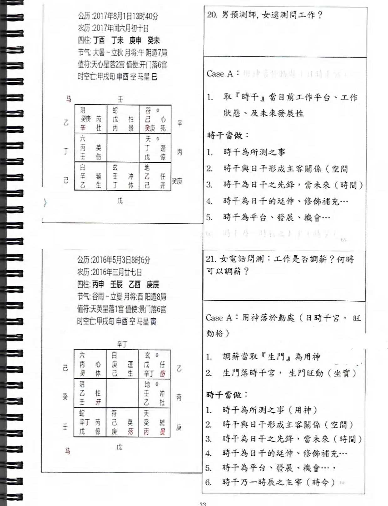

> **🖼 圖像解讀**　｜　檢視狀態：✅ 已檢視
> - **類型**：案例奇門盤＋解析（大師研究班投影片 65–66）
> - **內容**：案例 20「男預測師，女遠測問工作？」（盤同案例 17：2017年8月1日13時40分陰遁7局），解析 Case A（副標題淡灰不清）：取時干當目前工作平台、工作狀態及未來發展性；時干當做所測之事、主客關係（空間）、日干先鋒當未來（時間）、日干延伸修飾補充、平台發展機會（第 6 項淡灰）。案例 21「女電話問測：工作是否調薪？何時可以調薪？」：盤為公曆2016年5月3日8時6分，四柱丙申、壬辰、乙酉、庚辰，陽遁8局，值符天英星落1宮、值使景門落6宮，甲戌旬申酉空、馬星寅；Case A：用神落於動處（日時干宮，旺動格）——調薪取「生門」為用神，生門落時干宮且旺動（坐實）；時干當做六項同前。
> - **原文出處（逐字）**：20. 男預測師，女遠測問工作？；21. 女電話問測：工作是否調薪？何時可以調薪？
> - **可檢索關鍵字**：問工作, 時干為工作平台, 未來發展性, 調薪, 生門為用神, 旺動格, 時干坐實, 電話問測

**📝 逐字謄寫（第 154 頁）**

### 案例 20（投影片 65）

**20. 男預測師, 女遠測問工作？**

（盤同第 147 頁案例 17：公历:2017年8月1日13时40分，四柱丁酉 丁未 庚申 癸未，阴遁7局，值符天心星落2宫，值使开门落6宫，甲戌旬 申酉空，马星巳；九宮內容與案例 17 相同。）

**Case A：**〔副標題為淡灰字，圖中未能辨識〕

1. 取『時干』當目前工作平台、工作狀態、及未來發展性

**時干當做：**

1. 時干為所測之事
2. 時干與日干形成主客關係（空間）
3. 時干為日干之先鋒，當未來（時間）
4. 時干為日干的延伸、修飾補充…
5. 時干為平台、發展、機會…
6. （淡灰字：時干乃一時辰之主宰〔時令〕）

### 案例 21（投影片 66）

**21. 女電話問測：工作是否調薪？何時可以調薪？**

公历:2016年5月3日8时6分
农历:2016年三月廿七日
四柱: 丙申　壬辰　乙酉　庚辰
节气: 谷雨～立夏　月将:酉　阳遁8局
值符:天英星落1宫　值使:景门落6宫
时空亡:甲戌旬 申酉空　马星 寅

| 巽 | 離 | 坤 |
|---|---|---|
| 六 丙 心 癸 休 | 白 庚 蓬 己 生 | 玄 ◦ 戊 任 辛丁 伤 |
| **震** | **中** | **兌** |
| 阴 乙 柱 壬 开 | | 地 ◦ 壬 冲 乙 杜 |
| **艮** | **坎** | **乾** |
| 蛇 辛丁 芮 戊 惊 | 符 己 英 庚 死 | 天 癸 辅 丙 景 |

盤外引干：上（離）辛丁；左（巽／震／艮）己／癸／壬；右（坤／兌／乾）乙／丙／庚；下（坎）戊；艮宮外左下標「马」。坤、兌兩宮有空亡點。

**Case A：用神落於動處（日時干宮，旺動格）**

1. 調薪當取『生門』為用神
2. 生門落時干宮，生門旺動（坐實）

**時干當做：**

1. 時干為所測之事（用神）
2. 時干與日干形成主客關係（空間）
3. 時干為日干之先鋒，當未來（時間）
4. 時干為日干的延伸、修飾補充…
5. 時干為平台、發展、機會…，
6. 時干乃一時辰之主宰（時令）

（頁碼：33）

## 圖 155 — 第 155 頁（1240x1617）｜🖼 圖片（開圖判斷：圖表細看／裝飾照簡述）

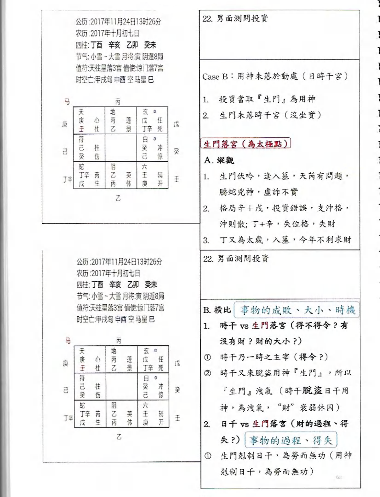

> **🖼 圖像解讀**　｜　檢視狀態：✅ 已檢視
> - **類型**：案例奇門盤＋縱觀橫比解析（大師研究班投影片 67–68）
> - **內容**：案例 22「男面測問投資」：盤為公曆2017年11月24日13時26分，四柱丁酉、辛亥、乙卯、癸未，陰遁8局，值符天柱星落3宮、值使驚門落7宮，甲戌旬申酉空、馬星巳（同盤列兩次）。Case B：用神未落於動處（日時干宮）——投資取生門為用神，生門未落時干宮（沒坐實），以生門落宮為太極點。A 縱觀：生門伏吟、逢入墓、天芮有問題、騰蛇凶神虛詐不實；格局辛＋戊投資錯誤、支沖格沖則散，丁＋辛失位格失財；丁又為太歲入墓，今年不利求財。B 橫比：時干 vs 生門落宮（事物成敗大小時機）——時干為一時之主宰，又脫盜用神生門使生門洩氣（財衰弱休囚）；日干 vs 生門落宮（財的過程得失）——生門剋制日干為勞而無功。
> - **原文出處（逐字）**：22. 男面測問投資（投影片 67–68）
> - **可檢索關鍵字**：投資案例, 生門為用神, 用神未落動處, 太極點, 生門伏吟入墓, 辛加戊投資錯誤, 時干脫盜, 勞而無功

**📝 逐字謄寫（第 155 頁）**

### 案例 22（投影片 67）

**22. 男面測問投資**

公历:2017年11月24日13时26分
农历:2017年十月初七日
四柱: 丁酉　辛亥　乙卯　癸未
节气: 小雪～大雪　月将:寅　阴遁8局
值符:天柱星落3宫　值使:惊门落7宫
时空亡:甲戌旬 申酉空　马星 巳

| 巽 | 離 | 坤 |
|---|---|---|
| 天 庚 心 壬 杜 | 地 丙 蓬 乙 景 | 玄 ◦ 戊 任 丁辛 死 |
| **震** | **中** | **兌** |
| 符 己 柱 癸 伤 | | 白 ◦ 癸 冲 己 惊 |
| **艮** | **坎** | **乾** |
| 蛇 丁辛 芮 戊 生 | 阴 乙 英 丙 休 | 六 壬 辅 庚 开 |

盤外引干：上（離）丙；左（巽／震／艮）庚／己／丁辛；右（坤／兌／乾）戊／癸／壬；下（坎）乙；巽宮外左上標「马」。坤、兌兩宮有空亡點。

**Case B：用神未落於動處（日時干宮）**

1. 投資當取『生門』為用神
2. 生門未落時干宮（沒坐實）

【生門落宮（為太極點）】

**A. 縱觀**

1. 生門伏吟，逢入墓，天芮有問題，騰蛇兇神，虛詐不實
2. 格局辛+戊，投資錯誤，支沖格，沖則散; 丁+辛，失位格，失財
3. 丁又為太歲，入墓，今年不利求財

### 案例 22（續）（投影片 68）

（同一盤再列一次）

**B. 橫比**［事物的成敗、大小、時機］

1. 時干 vs 生門落宮（得不得令？有沒有財？財的大小？）
   - ① 時干乃一時之主宰（得令？）
   - ② 時干又來脫盜用神『生門』，所以『生門』洩氣（時干**脫盜**日干用神，為洩氣，“財”衰弱休囚）
2. 日干 vs 生門落宮（財的過程、得失？）［事物的過程、得失］
   - ① 生門剋制日干，為勞而無功（用神剋制日干，為勞而無功）

## 圖 156 — 第 156 頁（1240x1617）｜🖼 圖片（開圖判斷：圖表細看／裝飾照簡述）

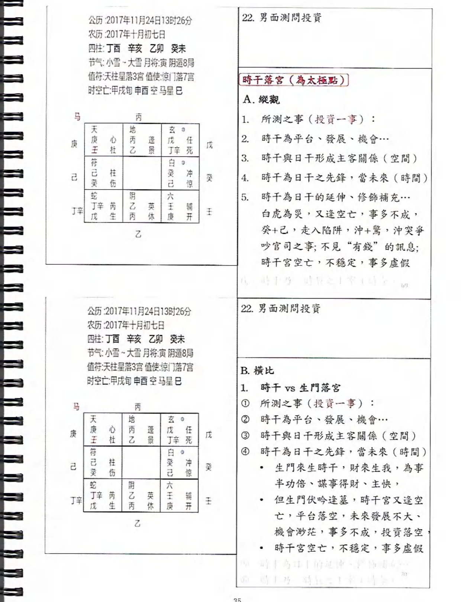

> **🖼 圖像解讀**　｜　檢視狀態：✅ 已檢視
> - **類型**：案例奇門盤＋縱觀橫比解析（大師研究班投影片 69–70）
> - **內容**：案例 22「男面測問投資」續（盤同第 155 頁，列兩次）。以時干落宮為太極點：A 縱觀——所測之事（投資一事）、時干為平台發展機會、與日干主客、日干先鋒當未來、日干延伸修飾補充；白虎為災又逢空亡事多不成，癸＋己走入陷阱，沖＋驚沖突爭吵官司之事，不見「有錢」的訊息，時干宮空亡不穩定、事多虛假。B 橫比（時干 vs 生門落宮）：生門來生時干、財來生我，為事半功倍、謀事得財、主快；但生門伏吟逢墓、時干宮又逢空亡，平台落空、未來發展不大、機會渺茫、事多不成、投資落空；時干宮空亡不穩定、事多虛假。
> - **原文出處（逐字）**：22. 男面測問投資（投影片 69–70）
> - **可檢索關鍵字**：投資案例, 時干落宮太極點, 白虎逢空, 癸加己陷阱, 沖驚官司, 平台落空, 投資落空, 事多虛假

**📝 逐字謄寫（第 156 頁）**

### 案例 22（續）（投影片 69）

（盤同第 155 頁：2017年11月24日13時26分，阴遁8局）

【時干落宮（為太極點）】

**A. 縱觀**

1. 所測之事（投資一事）：
2. 時干為平台、發展、機會…
3. 時干與日干形成主客關係（空間）
4. 時干為日干之先鋒，當未來（時間）
5. 時干為日干的延伸、修飾補充…
   白虎為災，又逢空亡，事多不成，癸+己，走入陷阱，沖+驚，沖突爭吵官司之事；不見“有錢”的訊息；時干宮空亡，不穩定，事多虛假
6. （淡灰字：時干乃一時辰之主宰〔時令〕）

### 案例 22（續）（投影片 70）

（同一盤再列一次）

**B. 橫比**

1. 時干 vs 生門落宮
   - ① 所測之事（投資一事）：
   - ② 時干為平台、發展、機會…
   - ③ 時干與日干形成主客關係（空間）
   - ④ 時干為日干之先鋒，當未來（時間）
     - 生門來生時干，財來生我，為事半功倍、謀事得財、主快，
     - 但生門伏吟逢墓，時干宮又逢空亡，平台落空，未來發展不大、機會渺茫，事多不成，投資落空，
     - 時干宮空亡，不穩定，事多虛假
   - ⑤ （淡灰字：時干為日干的延伸、修飾補充…）
   - ⑥ （淡灰字：時干乃一時辰之主宰〔時令〕）

（頁碼：35）

## 圖 157 — 第 157 頁（1240x1617）｜🖼 圖片（開圖判斷：圖表細看／裝飾照簡述）

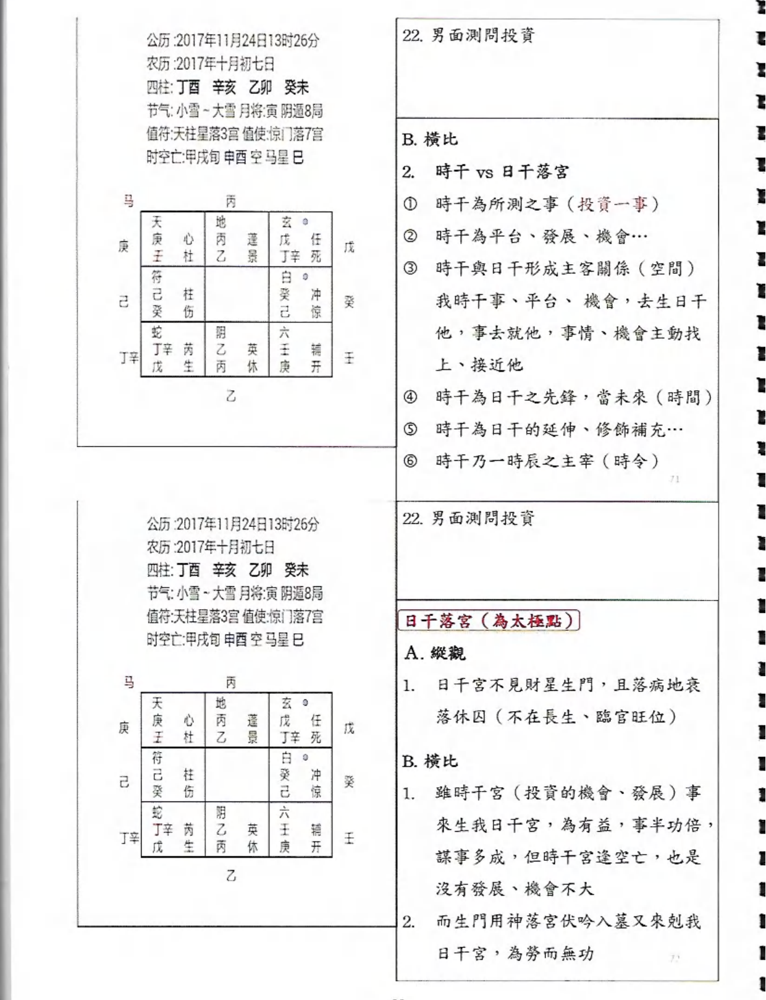

> **🖼 圖像解讀**　｜　檢視狀態：✅ 已檢視
> - **類型**：案例奇門盤＋橫比解析（大師研究班投影片 71–72）
> - **內容**：案例 22「男面測問投資」續（盤同第 155 頁，列兩次）。B 橫比（時干 vs 日干落宮）：時干為所測之事（投資一事）、平台發展機會；時干與日干主客關係——時干事、平台、機會去生日干，事去就他，事情機會主動找上、接近他；另列時干為先鋒未來、延伸修飾補充、一時辰之主宰。以日干落宮為太極點：A 縱觀——日干宮不見財星生門，且落病地衰落休囚（不在長生、臨官旺位）；B 橫比——時干宮（投資的機會發展）來生日干宮為有益、事半功倍，但時干宮逢空亡也是沒有發展、機會不大；生門用神落宮伏吟入墓又來剋日干宮，為勞而無功。
> - **原文出處（逐字）**：22. 男面測問投資（投影片 71–72）
> - **可檢索關鍵字**：投資案例, 時干生日干, 機會主動找上, 日干落宮太極點, 不見財星, 病地休囚, 時干空亡, 勞而無功

**📝 逐字謄寫（第 157 頁）**

### 案例 22（續）（投影片 71）

（盤同第 155 頁：2017年11月24日13時26分，阴遁8局）

**B. 橫比**

2. 時干 vs 日干落宮
   - ① 時干為所測之事（投資一事）
   - ② 時干為平台、發展、機會…
   - ③ 時干與日干形成主客關係（空間）
     我時干事、平台、機會，去生日干他，事去就他，事情、機會主動找上、接近他
   - ④ 時干為日干之先鋒，當未來（時間）
   - ⑤ 時干為日干的延伸、修飾補充…
   - ⑥ 時干乃一時辰之主宰（時令）

### 案例 22（續）（投影片 72）

（同一盤再列一次）

【日干落宮（為太極點）】

**A. 縱觀**

1. 日干宮不見財星生門，且落病地衰落休囚（不在長生、臨官旺位）

**B. 橫比**

1. 雖時干宮（投資的機會、發展）事來生我日干宮，為有益，事半功倍，謀事多成，但時干宮逢空亡，也是沒有發展、機會不大
2. 而生門用神落宮伏吟入墓又來剋我日干宮，為勞而無功

## 圖 158 — 第 158 頁（1240x1617）｜🖼 圖片（開圖判斷：圖表細看／裝飾照簡述）

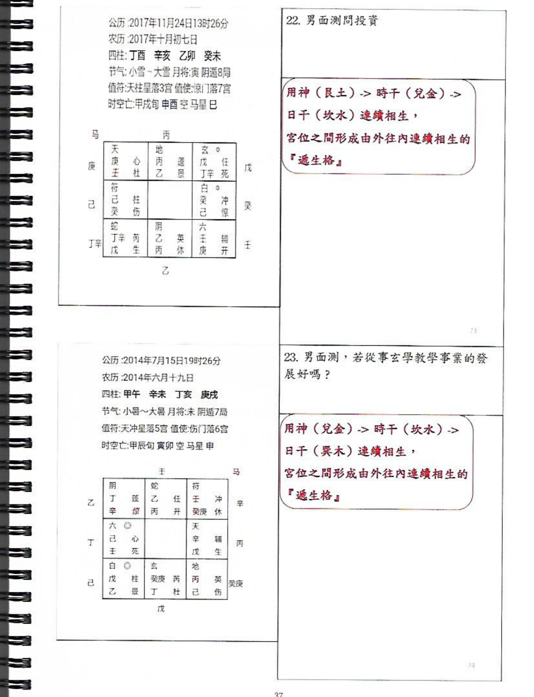

> **🖼 圖像解讀**　｜　檢視狀態：✅ 已檢視
> - **類型**：案例奇門盤＋格局解析（大師研究班投影片 73–74）
> - **內容**：案例 22「男面測問投資」總結（盤同第 155 頁）：用神（艮土）→ 時干（兌金）→ 日干（坎水）連續相生，宮位之間形成由外往內連續相生的「遞生格」。案例 23「男面測，若從事玄學教學事業的發展好嗎？」：盤為公曆2014年7月15日19時26分，四柱甲午、辛未、丁亥、庚戌，陰遁7局，值符天沖星落5宮、值使傷門落6宮，甲辰旬寅卯空、馬星申；用神（兌金）→ 時干（坎水）→ 日干（巽木）連續相生，同樣形成由外往內連續相生的「遞生格」。
> - **原文出處（逐字）**：22. 男面測問投資（投影片 73）；23. 男面測，若從事玄學教學事業的發展好嗎？（投影片 74）
> - **可檢索關鍵字**：遞生格, 連續相生, 由外往內, 用神時干日干, 投資案例, 玄學教學事業, 陰遁七局, 宮位五行

**📝 逐字謄寫（第 158 頁）**

### 案例 22（總結）（投影片 73）

（盤同第 155 頁：2017年11月24日13時26分，阴遁8局）

> 用神（艮土）-> 時干（兌金）-> 日干（坎水）連續相生，
> 宮位之間形成由外往內連續相生的『**遞生格**』

### 案例 23（投影片 74）

**23. 男面測，若從事玄學教學事業的發展好嗎？**

公历:2014年7月15日19时26分
农历:2014年六月十九日
四柱: 甲午　辛未　丁亥　庚戌
节气: 小暑～大暑　月将:未　阴遁7局
值符:天冲星落5宫　值使:伤门落6宫
时空亡:甲辰旬 寅卯空　马星 申

| 巽 | 離 | 坤 |
|---|---|---|
| 阴 丁 蓬 辛 惊 | 蛇 乙 任 丙 开 | 符 壬 冲 癸庚 休 |
| **震** | **中** | **兌** |
| 六 ◎ 己 心 壬 死 | | 天 辛 辅 戊 生 |
| **艮** | **坎** | **乾** |
| 白 ◎ 戊 柱 乙 景 | 玄 癸庚 芮 丁 杜 | 地 丙 英 己 伤 |

盤外引干：上（離）壬；左（巽／震／艮）乙／丁／己；右（坤／兌／乾）辛／丙／癸庚；下（坎）戊；坤宮外標「马」。震、艮兩宮有空亡圈。

> 用神（兌金）-> 時干（坎水）-> 日干（巽木）連續相生，
> 宮位之間形成由外往內連續相生的『**遞生格**』

（頁碼：37）

## 圖 159 — 第 159 頁（1240x1617）｜🖼 圖片（開圖判斷：圖表細看／裝飾照簡述）

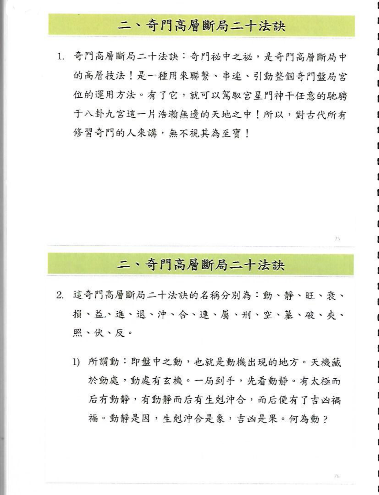

> **🖼 圖像解讀**　｜　檢視狀態：✅ 已檢視
> - **類型**：文字頁（大師研究班投影片 75–76）
> - **內容**：「二、奇門高層斷局二十法訣」：此為奇門祕中之祕、高層斷局技法，用來聯繫、串連、引動整個奇門盤局宮位，駕馭宮星門神干馳騁於八卦九宮，古代修習奇門者視為至寶。二十法訣名稱：動、靜、旺、衰、損、益、進、退、沖、合、連、屬、刑、空、墓、破、夾、照、伏、反。1) 動：即盤中之動、動機出現之處，天機藏於動處；一局到手先看動靜，有太極而後有動靜，有動靜而後有生剋沖合，而後有吉凶禍福；動靜是因、生剋沖合是象、吉凶是果。
> - **原文出處（逐字）**：二、奇門高層斷局二十法訣（投影片 75–76）
> - **可檢索關鍵字**：斷局二十法訣, 祕中之祕, 動靜旺衰, 損益進退, 沖合連屬, 刑空墓破, 夾照伏反, 盤中之動

**📝 逐字謄寫（第 159 頁）**

### 二、奇門高層斷局二十法訣（投影片 75）

1. 奇門高層斷局二十法訣：奇門祕中之祕，是奇門高層斷局中的高層技法！是一種用來聯繫、串連、引動整個奇門盤局宮位的運用方法。有了它，就可以駕馭宮星門神干任意的馳騁于八卦九宮這一片浩瀚無邊的天地之中！所以，對古代所有修習奇門的人來講，無不視其為至寶！

### 二、奇門高層斷局二十法訣（投影片 76）

2. 這奇門高層斷局二十法訣的名稱分別為：動、靜、旺、衰、損、益、進、退、沖、合、連、屬、刑、空、墓、破、夾、照、伏、反。
   1) 所謂動：即盤中之動，也就是動機出現的地方。天機藏於動處，動處有玄機。一局到手，先看動靜。有太極而后有動靜，有動靜而后有生剋沖合，而后便有了吉凶禍福。動靜是因，生剋沖合是象，吉凶是果。何為動？

## 圖 160 — 第 160 頁（1240x1617）｜🖼 圖片（開圖判斷：圖表細看／裝飾照簡述）

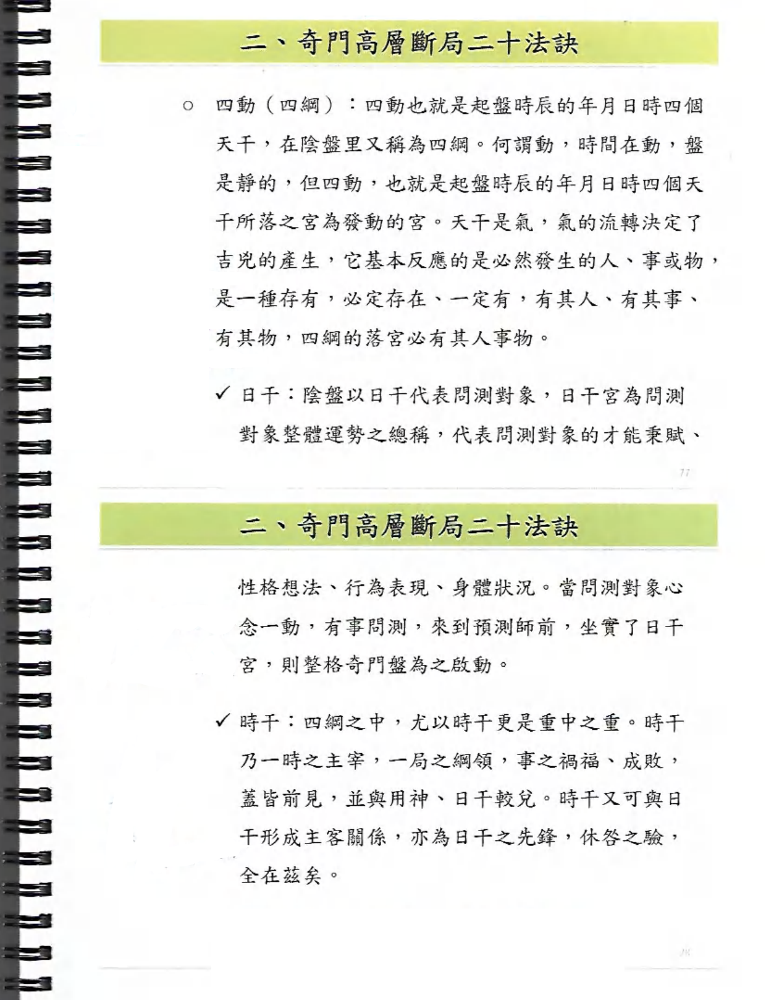

> **🖼 圖像解讀**　｜　檢視狀態：✅ 已檢視
> - **類型**：文字頁（大師研究班投影片 77–78）
> - **內容**：斷局二十法訣「動」續——四動（四綱）：起盤時辰的年月日時四天干，陰盤稱四綱；時間在動而盤是靜的，四干所落之宮為發動宮；天干是氣，四綱落宮必有其人事物。日干：陰盤以日干代表問測對象，日干宮為其整體運勢總稱，代表才能稟賦、性格想法、行為表現、身體狀況，問測者心念一動來到預測師前、坐實日干宮，整個奇門盤為之啟動。時干：四綱之中尤以時干為重中之重，乃一時之主宰、一局綱領，事之禍福成敗皆前見，與用神日干較兇，可與日干成主客、為日干先鋒。
> - **原文出處（逐字）**：二、奇門高層斷局二十法訣（投影片 77–78）
> - **可檢索關鍵字**：四動, 四綱, 發動宮, 日干問測對象, 整體運勢, 心念一動, 坐實日干宮, 時干重中之重

**📝 逐字謄寫（第 160 頁）**

### 二、奇門高層斷局二十法訣（投影片 77）

- ○ 四動（四綱）：四動也就是起盤時辰的年月日時四個天干，在陰盤里又稱為四綱。何謂動，時間在動，盤是靜的，但四動，也就是起盤時辰的年月日時四個天干所落之宮為發動的宮。天干是氣，氣的流轉決定了吉兇的產生，它基本反應的是必然發生的人、事或物，是一種存有，必定存在、一定有，有其人、有其事、有其物，四綱的落宮必有其人事物。
  - ✓ 日干：陰盤以日干代表問測對象，日干宮為問測對象整體運勢之總稱，代表問測對象的才能秉賦、

### 二、奇門高層斷局二十法訣（投影片 78）

  （續）性格想法、行為表現、身體狀況。當問測對象心念一動，有事問測，來到預測師前，坐實了日干宮，則整格奇門盤為之啟動。
  - ✓ 時干：四綱之中，尤以時干更是重中之重。時干乃一時之主宰，一局之綱領，事之禍福、成敗，蓋皆前見，並與用神、日干較兇。時干又可與日干形成主客關係，亦為日干之先鋒，休咎之驗，全在茲矣。

## 圖 161 — 第 161 頁（1240x1617）｜🖼 圖片（開圖判斷：圖表細看／裝飾照簡述）

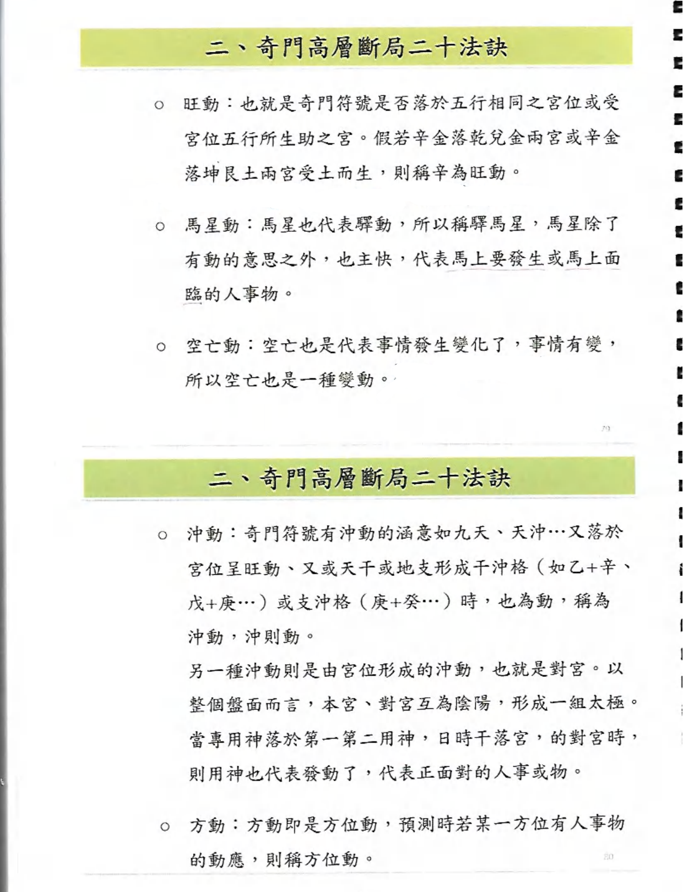

> **🖼 圖像解讀**　｜　檢視狀態：✅ 已檢視
> - **類型**：文字頁（大師研究班投影片 79–80）
> - **內容**：斷局二十法訣「動」的各類：旺動（符號落於五行相同之宮或受宮位所生助，如辛金落乾兌金宮或落坤艮土宮受生，稱辛為旺動）；馬星動（驛馬主動、主快，代表馬上要發生或面臨的人事物）；空亡動（空亡代表事情發生變化，也是一種變動）；沖動（符號有沖動涵意如九天、天沖又落旺宮，或天干地支形成干沖格如乙＋辛、戊＋庚，支沖格如庚＋癸，沖則動；另一種為宮位形成的沖動即對宮，本宮對宮互為陰陽成一組太極，專用神落於日時干落宮的對宮時也代表發動，代表正面對的人事物）；方動（方位動，某方位有人事物動應）。
> - **原文出處（逐字）**：二、奇門高層斷局二十法訣（投影片 79–80）
> - **可檢索關鍵字**：旺動, 馬星動, 空亡動, 沖動, 干沖格支沖格, 對宮太極, 方動, 方位動應

**📝 逐字謄寫（第 161 頁）**

### 二、奇門高層斷局二十法訣（投影片 79）

- ○ 旺動：也就是奇門符號是否落於五行相同之宮位或受宮位五行所生助之宮。假若辛金落乾兌金兩宮或辛金落坤艮土兩宮受土而生，則稱辛為旺動。
- ○ 馬星動：馬星也代表驛動，所以稱驛馬星，馬星除了有動的意思之外，也主快，代表馬上要發生或馬上面臨的人事物。
- ○ 空亡動：空亡也是代表事情發生變化了，事情有變，所以空亡也是一種變動。

### 二、奇門高層斷局二十法訣（投影片 80）

- ○ 沖動：奇門符號有沖動的涵意如九天、天沖…又落於宮位呈旺動、又或天干或地支形成干沖格（如乙+辛、戊+庚…）或支沖格（庚+癸…）時，也為動，稱為沖動，沖則動。
  另一種沖動則是由宮位形成的沖動，也就是對宮。以整個盤面而言，本宮、對宮互為陰陽，形成一組太極。當專用神落於第一第二用神，日時干落宮，的對宮時，則用神也代表發動了，代表正面對的人事或物。
- ○ 方動：方動即是方位動，預測時若某一方位有人事物的動應，則稱方位動。

## 圖 162 — 第 162 頁（1240x1617）｜🖼 圖片（開圖判斷：圖表細看／裝飾照簡述）

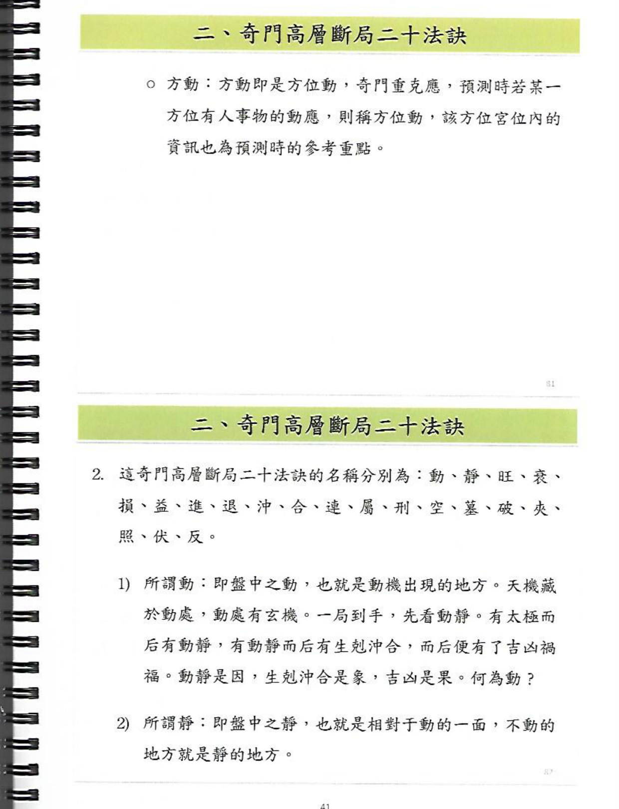

> **🖼 圖像解讀**　｜　檢視狀態：✅ 已檢視
> - **類型**：文字頁（大師研究班投影片 81–82）
> - **內容**：方動續：奇門重克應，預測時某方位有人事物動應稱方位動，該方位宮內資訊也為預測參考重點。再列二十法訣名稱，並說明 1) 動：盤中之動、動機出現之處（同前）；2) 靜：盤中之靜，相對於動的一面，不動的地方就是靜的地方。
> - **原文出處（逐字）**：二、奇門高層斷局二十法訣（投影片 81–82）
> - **可檢索關鍵字**：方位動, 奇門重克應, 動應, 二十法訣, 盤中之動, 盤中之靜, 靜的地方

**📝 逐字謄寫（第 162 頁）**

### 二、奇門高層斷局二十法訣（投影片 81）

- ○ 方動：方動即是方位動，奇門重克應，預測時若某一方位有人事物的動應，則稱方位動，該方位宮位內的資訊也為預測時的參考重點。

### 二、奇門高層斷局二十法訣（投影片 82）

2. 這奇門高層斷局二十法訣的名稱分別為：動、靜、旺、衰、損、益、進、退、沖、合、連、屬、刑、空、墓、破、夾、照、伏、反。
   1) 所謂動：即盤中之動，也就是動機出現的地方。天機藏於動處，動處有玄機。一局到手，先看動靜。有太極而后有動靜，有動靜而后有生剋沖合，而后便有了吉凶禍福。動靜是因，生剋沖合是象，吉凶是果。何為動？
   2) 所謂靜：即盤中之靜，也就是相對于動的一面，不動的地方就是靜的地方。

（頁碼：41）

## 圖 163 — 第 163 頁（1240x1617）｜🖼 圖片（開圖判斷：圖表細看／裝飾照簡述）

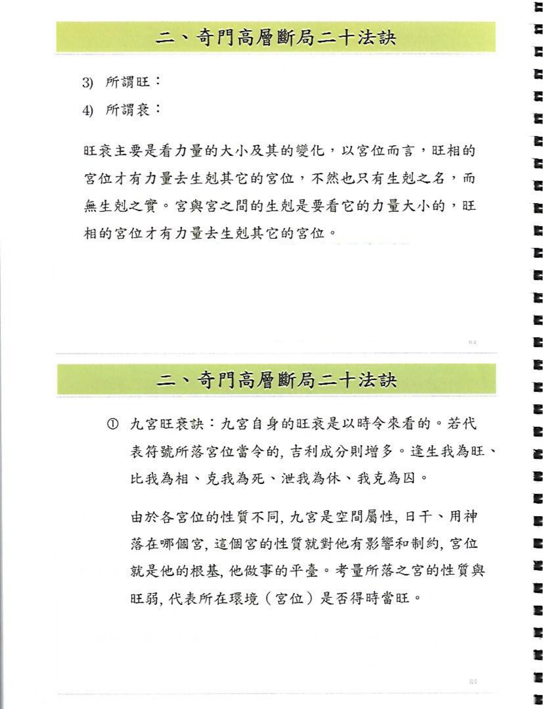

> **🖼 圖像解讀**　｜　檢視狀態：✅ 已檢視
> - **類型**：文字頁（大師研究班投影片 83–84）
> - **內容**：斷局二十法訣「旺、衰」：旺衰主要看力量大小及其變化，旺相的宮位才有力量去生剋其它宮位，否則只有生剋之名而無生剋之實。① 九宮旺衰訣：九宮自身旺衰以時令來看，代表符號所落宮位當令則吉利成分增多；逢生我為旺、比我為相、剋我為死、洩我為休、我剋為囚。九宮是空間屬性，日干用神落在哪宮，該宮性質對其有影響和制約，宮位是其根基與做事平台；考量所落之宮的性質與旺弱，代表所在環境是否得時當旺。
> - **原文出處（逐字）**：二、奇門高層斷局二十法訣（投影片 83–84）
> - **可檢索關鍵字**：旺衰, 力量大小, 生剋之名無生剋之實, 九宮旺衰訣, 旺相休囚死, 時令, 宮位為平台, 得時當旺

**📝 逐字謄寫（第 163 頁）**

### 二、奇門高層斷局二十法訣（投影片 83）

3) 所謂旺：
4) 所謂衰：

旺衰主要是看力量的大小及其的變化，以宮位而言，旺相的宮位才有力量去生剋其它的宮位，不然也只有生剋之名，而無生剋之實。宮與宮之間的生剋是要看它的力量大小的，旺相的宮位才有力量去生剋其它的宮位。

### 二、奇門高層斷局二十法訣（投影片 84）

① 九宮旺衰訣：九宮自身的旺衰是以時令來看的。若代表符號所落宮位當令的，吉利成分則增多。逢生我為旺、比我為相、克我為死、泄我為休、我克為囚。

由於各宮位的性質不同，九宮是空間屬性，日干、用神落在哪個宮，這個宮的性質就對他有影響和制約，宮位就是他的根基，他做事的平臺。考量所落之宮的性質與旺弱，代表所在環境（宮位）是否得時當旺。

## 圖 164 — 第 164 頁（1240x1617）｜🖼 圖片（開圖判斷：圖表細看／裝飾照簡述）

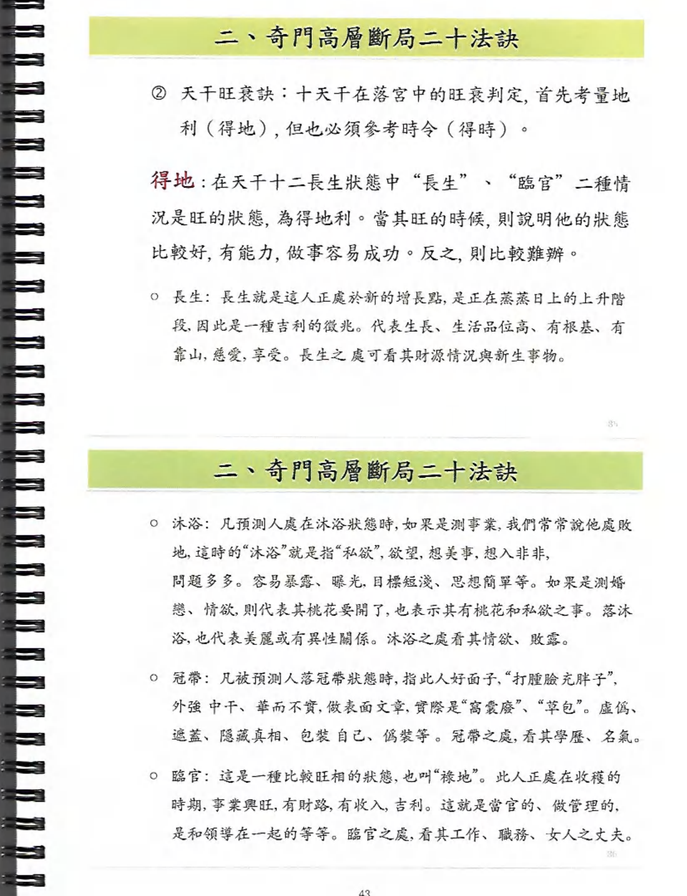

> **🖼 圖像解讀**　｜　檢視狀態：✅ 已檢視
> - **類型**：文字頁（大師研究班投影片 85–86）
> - **內容**：② 天干旺衰訣：十天干落宮旺衰首先考量地利（得地），也須參考時令（得時）。得地：天干十二長生中「長生」「臨官」為旺的狀態，得地利則狀態好、有能力、做事易成。十二長生象意：長生——正處新增長點、蒸蒸日上，代表生長、品位高、有根基有靠山、慈愛享受，看財源與新生事物；沐浴——測事業為處敗地、私欲、想入非非、問題多多、易暴露曝光、目標短淺，測婚戀代表桃花要開、有異性關係，看情欲敗露；冠帶——好面子、外強中乾、華而不實、做表面文章、虛偽遮蓋包裝偽裝，看學歷名氣；臨官——較旺相的祿地，正處收穫期、事業興旺有財路收入，當官做管理、與領導在一起，看工作職務、女人之丈夫。
> - **原文出處（逐字）**：二、奇門高層斷局二十法訣（投影片 85–86）
> - **可檢索關鍵字**：天干旺衰訣, 得地得時, 長生臨官, 長生新增長點, 沐浴桃花私欲, 冠帶外強中乾, 臨官祿地, 十二長生象意

**📝 逐字謄寫（第 164 頁）**

### 二、奇門高層斷局二十法訣（投影片 85）

② 天干旺衰訣：十天干在落宮中的旺衰判定, 首先考量地利（得地）, 但也必須參考時令（得時）。

**得地**：在天干十二長生狀態中“長生”、“臨官”二種情況是旺的狀態, 為得地利。當其旺的時候, 則說明他的狀態比較好, 有能力, 做事容易成功。反之, 則比較難辦。

- ○ 長生：長生就是這人正處於新的增長點, 是正在蒸蒸日上的上升階段, 因此是一種吉利的徵兆。代表生長、生活品位高、有根基、有靠山, 慈愛, 享受。長生之處可看其財源情況與新生事物。

### 二、奇門高層斷局二十法訣（投影片 86）

- ○ 沐浴：凡預測人處在沐浴狀態時, 如果是測事業, 我們常常說他處敗地, 這時的“沐浴”就是指“私欲”, 欲望, 想美事, 想入非非, 問題多多。容易暴露、曝光, 目標短淺、思想簡單等。如果是測婚戀、情欲, 則代表其桃花要開了, 也表示其有桃花和私欲之事。落沐浴, 也代表美麗或有異性關係。沐浴之處看其情欲、敗露。
- ○ 冠帶：凡被預測人落冠帶狀態時, 指此人好面子, “打腫臉充胖子”, 外強中干、華而不實, 做表面文章, 實際是“窩囊廢”、“草包”。虛偽、遮蓋、隱藏真相、包裝自己、偽裝等。冠帶之處, 看其學歷、名氣。
- ○ 臨官：這是一種比較旺相的狀態, 也叫“祿地”。此人正處在收穫的時期, 事業興旺, 有財路, 有收入, 吉利。這就是當官的、做管理的, 是和領導在一起的等等。臨官之處, 看其工作、職務、女人之丈夫。

（頁碼：43）

## 圖 165 — 第 165 頁（1240x1617）｜🖼 圖片（開圖判斷：圖表細看／裝飾照簡述）

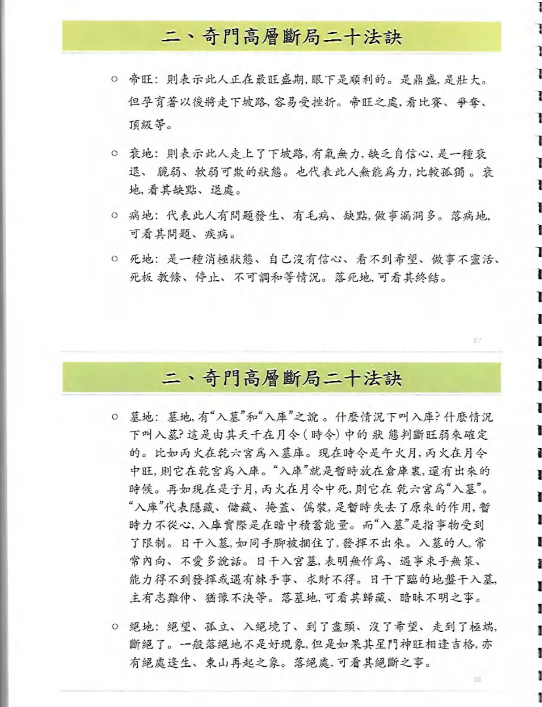

> **🖼 圖像解讀**　｜　檢視狀態：✅ 已檢視
> - **類型**：文字頁（大師研究班投影片 87–88）
> - **內容**：十二長生象意續：帝旺——正在最旺盛期、眼下順利、鼎盛壯大，但之後將走下坡易受挫折，看比賽爭奪頂級；衰地——走下坡、有氣無力、缺自信、衰退脆弱、無能為力較孤獨，看缺點退處；病地——有問題發生、有毛病缺點、做事漏洞多，看問題疾病；死地——消極、沒信心、看不到希望、不靈活死板教條、停止不可調和，看終結；墓地——分「入庫」與「入墓」，依天干在月令的旺弱而定（如丙火在乾六宮：午月旺則入庫、子月死則入墓），入庫為隱藏儲藏、暫失作用、暗中積蓄能量，入墓為受到限制、如手腳被捆發揮不出，日干入墓常內向不愛說話、無作為、束手無策、求財不得，日干下臨地盤干入墓主有志難伸、猶豫不決，看歸藏、暗昧不明之事；絕地——絕望孤立、到盡頭、斷絕，但星門神旺相逢吉格亦有絕處逢生、東山再起，看絕斷之事。
> - **原文出處（逐字）**：二、奇門高層斷局二十法訣（投影片 87–88）
> - **可檢索關鍵字**：帝旺, 衰地, 病地, 死地, 墓地, 入庫入墓, 絕地, 絕處逢生

**📝 逐字謄寫（第 165 頁）**

### 二、奇門高層斷局二十法訣（投影片 87）

- ○ 帝旺：則表示此人正在最旺盛期, 眼下是順利的。是鼎盛, 是壯大。但孕育著以後將走下坡路, 容易受挫折。帝旺之處, 看比賽、爭奪、頂級等。
- ○ 衰地：則表示此人走上了下坡路, 有氣無力, 缺乏自信心, 是一種衰退、脆弱、軟弱可欺的狀態。也代表此人無能爲力, 比較孤獨。衰地, 看其缺點、退處。
- ○ 病地：代表此人有問題發生、有毛病、缺點, 做事漏洞多。落病地, 可看其問題、疾病。
- ○ 死地：是一種消極狀態、自己沒有信心、看不到希望、做事不靈活、死板教條、停止、不可調和等情況。落死地, 可看其終結。

### 二、奇門高層斷局二十法訣（投影片 88）

- ○ 墓地：墓地, 有“入墓”和“入庫”之說。什麼情況下叫入庫? 什麼情況下叫入墓? 這是由其天干在月令（時令）中的狀態判斷旺弱來確定的。比如丙火在乾六宮爲入墓庫。現在時令是午火月, 丙火在月令中旺, 則它在乾宮爲入庫。“入庫”就是暫時放在倉庫裏, 還有出來的時候。再如現在是子月, 丙火在月令中死, 則它在乾六宮爲“入墓”。“入庫”代表隱藏、儲藏、掩蓋、偽裝, 是暫時失去了原來的作用, 暫時力不從心, 入庫實際是在暗中積蓄能量。而“入墓”是指事物受到了限制。日干入墓, 如同手腳被捆住了, 發揮不出來。入墓的人, 常常內向、不愛多說話。日干入宮墓, 表明無作爲、遇事束手無策、能力得不到發揮或遇有棘手事、求財不得。日干下臨的地盤干入墓, 主有志難伸、猶豫不決等。落墓地, 可看其歸藏、暗昧不明之事。
- ○ 絕地：絕望、孤立、入絕境了、到了盡頭、沒了希望、走到了極端, 斷絕了。一般落絕地不是好現象, 但是如果其星門神旺相逢吉格, 亦有絕處逢生、東山再起之象。落絕處, 可看其絕斷之事。

## 圖 166 — 第 166 頁（1240x1617）｜🖼 圖片（開圖判斷：圖表細看／裝飾照簡述）

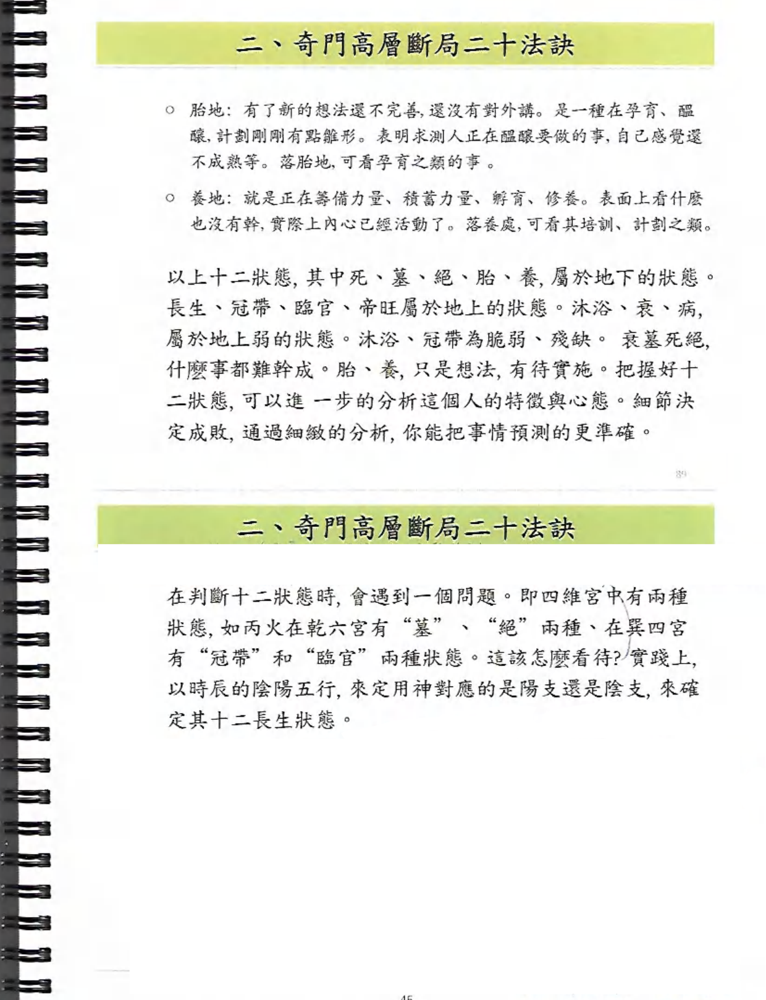

> **🖼 圖像解讀**　｜　檢視狀態：✅ 已檢視
> - **類型**：文字頁（大師研究班投影片 89–90）
> - **內容**：十二長生象意續：胎地——有新想法還不完善、未對外講，正在孕育醞釀、計劃剛有雛形，看孕育之類；養地——正在籌備積蓄力量、孵育修養，表面沒幹實際內心已活動，看培訓計劃。總結：死墓絕胎養屬地下狀態，長生冠帶臨官帝旺屬地上狀態，沐浴衰病屬地上弱的狀態；沐浴冠帶為脆弱殘缺，衰墓死絕什麼事都難幹成，胎養只是想法有待實施；把握十二狀態可進一步分析人的特徵與心態。四維宮中有兩種狀態（如丙火在乾六宮有墓、絕兩種，在巽四宮有冠帶、臨官兩種）時，實踐上以時辰的陰陽五行定用神對應陽支或陰支來確定其十二長生狀態。
> - **原文出處（逐字）**：二、奇門高層斷局二十法訣（投影片 89–90）
> - **可檢索關鍵字**：胎地, 養地, 地下狀態, 地上狀態, 衰墓死絕難成, 胎養有待實施, 四維宮兩種狀態, 陽支陰支

**📝 逐字謄寫（第 166 頁）**

### 二、奇門高層斷局二十法訣（投影片 89）

- ○ 胎地：有了新的想法還不完善, 還沒有對外講。是一種在孕育、醞釀, 計劃剛剛有點雛形。表明求測人正在醞釀要做的事, 自己感覺還不成熟等。落胎地, 可看孕育之類的事。
- ○ 養地：就是正在籌備力量、積蓄力量、孵育、修養。表面上看什麼也沒有幹, 實際上內心已經活動了。落養處, 可看其培訓、計劃之類。

以上十二狀態, 其中死、墓、絕、胎、養, 屬於地下的狀態。長生、冠帶、臨官、帝旺屬於地上的狀態。沐浴、衰、病, 屬於地上弱的狀態。沐浴、冠帶為脆弱、殘缺。 衰墓死絕, 什麼事都難幹成。胎、養, 只是想法, 有待實施。把握好十二狀態, 可以進一步的分析這個人的特徵與心態。細節決定成敗, 通過細緻的分析, 你能把事情預測的更準確。

### 二、奇門高層斷局二十法訣（投影片 90）

在判斷十二狀態時, 會遇到一個問題。即四維宮中有兩種狀態, 如丙火在乾六宮有“墓”、“絕”兩種、在巽四宮有“冠帶”和“臨官”兩種狀態。這該怎麼看待? 實踐上, 以時辰的陰陽五行, 來定用神對應的是陽支還是陰支, 來確定其十二長生狀態。

（頁碼：45）

## 圖 167 — 第 167 頁（1240x1617）｜🖼 圖片（開圖判斷：圖表細看／裝飾照簡述）

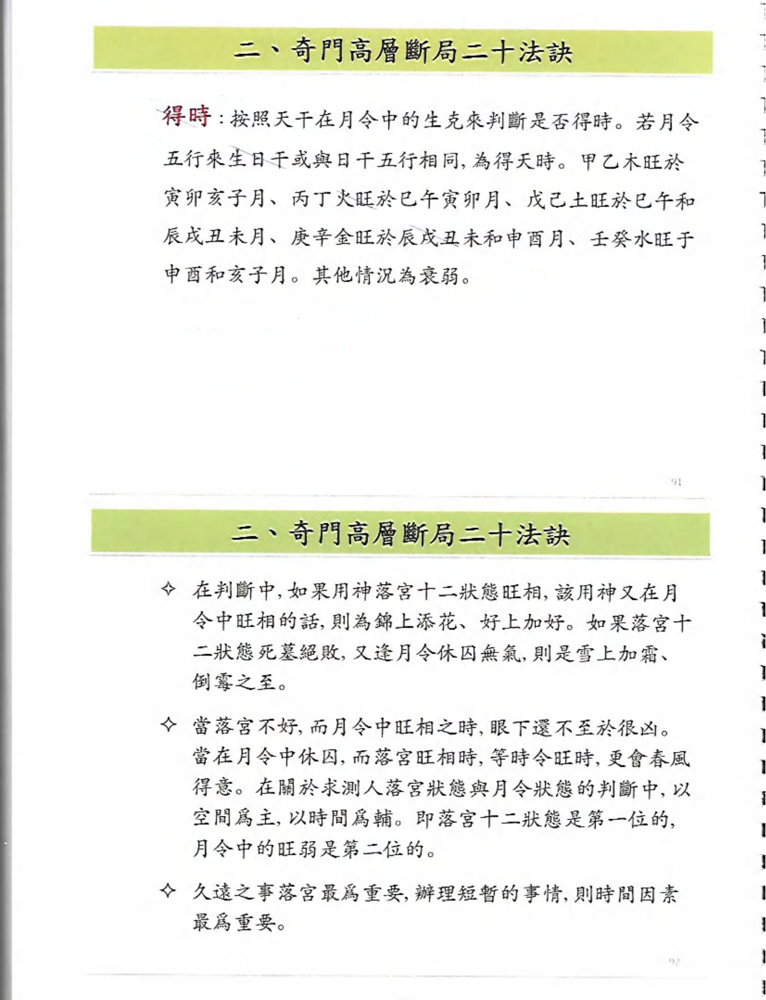

> **🖼 圖像解讀**　｜　檢視狀態：✅ 已檢視
> - **類型**：文字頁（大師研究班投影片 91–92）
> - **內容**：天干旺衰「得時」：按天干在月令中的生剋判斷，月令五行生日干或與日干五行相同為得天時——甲乙木旺於寅卯亥子月、丙丁火旺於巳午寅卯月、戊己土旺於巳午和辰戌丑未月、庚辛金旺於辰戌丑未和申酉月、壬癸水旺於申酉和亥子月，其他為衰弱。用神落宮十二狀態旺相又在月令旺相為錦上添花，落宮死墓絕敗又逢月令休囚為雪上加霜；落宮不好而月令旺，眼下不至很凶；月令休囚而落宮旺，等時令旺時更春風得意；判斷以空間（落宮十二狀態）為主、時間（月令）為輔；久遠之事落宮最重要，短暫之事時間因素最重要。
> - **原文出處（逐字）**：二、奇門高層斷局二十法訣（投影片 91–92）
> - **可檢索關鍵字**：得時, 月令旺衰, 天干旺月, 錦上添花, 雪上加霜, 空間為主時間為輔, 久遠看落宮, 短暫看時間

**📝 逐字謄寫（第 167 頁）**

### 二、奇門高層斷局二十法訣（投影片 91）

**得時**：按照天干在月令中的生克來判斷是否得時。若月令五行來生日干或與日干五行相同, 為得天時。甲乙木旺於寅卯亥子月、丙丁火旺於巳午寅卯月、戊己土旺於巳午和辰戌丑未月、庚辛金旺於辰戌丑未和申酉月、壬癸水旺于申酉和亥子月。其他情況為衰弱。

### 二、奇門高層斷局二十法訣（投影片 92）

- ✧ 在判斷中, 如果用神落宮十二狀態旺相, 該用神又在月令中旺相的話, 則為錦上添花、好上加好。如果落宮十二狀態死墓絕敗, 又逢月令休囚無氣, 則是雪上加霜、倒霉之至。
- ✧ 當落宮不好, 而月令中旺相之時, 眼下還不至於很凶。當在月令中休囚, 而落宮旺相時, 等時令旺時, 更會春風得意。在關於求測人落宮狀態與月令狀態的判斷中, 以空間爲主, 以時間爲輔。即落宮十二狀態是第一位的, 月令中的旺弱是第二位的。
- ✧ 久遠之事落宮最爲重要, 辦理短暫的事情, 則時間因素最爲重要。

## 圖 168 — 第 168 頁（1240x1617）｜🖼 圖片（開圖判斷：圖表細看／裝飾照簡述）

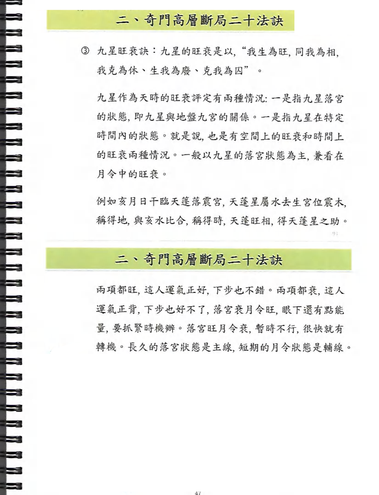

> **🖼 圖像解讀**　｜　檢視狀態：✅ 已檢視
> - **類型**：文字頁（大師研究班投影片 93–94）
> - **內容**：③ 九星旺衰訣：九星以「我生為旺、同我為相、我剋為休、生我為廢、剋我為囚」論；九星作為天時的旺衰有兩種——九星落宮狀態（與地盤九宮的關係，空間旺衰）與九星在特定時間內的狀態（時間旺衰），一般以落宮狀態為主、兼看月令。例：亥月日干臨天蓬落震宮，天蓬屬水生震木稱得地，與亥水比合稱得時，天蓬旺相得天蓬星之助。兩項都旺運氣正好、下步也不錯；兩項都衰運氣正背；落宮衰月令旺，眼下還有點能量要抓緊時機；落宮旺月令衰，暫時不行很快有轉機；長久的落宮狀態是主線、短期的月令狀態是輔線。
> - **原文出處（逐字）**：二、奇門高層斷局二十法訣（投影片 93–94）
> - **可檢索關鍵字**：九星旺衰訣, 我生為旺, 生我為廢, 空間旺衰, 時間旺衰, 天蓬落震, 落宮主線, 月令輔線

**📝 逐字謄寫（第 168 頁）**

### 二、奇門高層斷局二十法訣（投影片 93）

③ 九星旺衰訣：九星的旺衰是以, “我生為旺, 同我為相, 我克為休、生我為廢、克我為囚”。

九星作為天時的旺衰評定有兩種情況: 一是指九星落宮的狀態, 即九星與地盤九宮的關係。一是指九星在特定時間內的狀態。就是說, 也是有空間上的旺衰和時間上的旺衰兩種情況。一般以九星的落宮狀態為主, 兼看在月令中的旺衰。

例如亥月日干臨天蓬落震宮, 天蓬星屬水去生宮位震木, 稱得地, 與亥水比合, 稱得時, 天蓬旺相, 得天蓬星之助。

### 二、奇門高層斷局二十法訣（投影片 94）

兩項都旺, 這人運氣正好, 下步也不錯。兩項都衰, 這人運氣正背, 下步也好不了, 落宮衰月令旺, 眼下還有點能量, 要抓緊時機辦。落宮旺月令衰, 暫時不行, 很快就有轉機。長久的落宮狀態是主線, 短期的月令狀態是輔線。

（頁碼：47）

## 圖 169 — 第 169 頁（1240x1617）｜🖼 圖片（開圖判斷：圖表細看／裝飾照簡述）

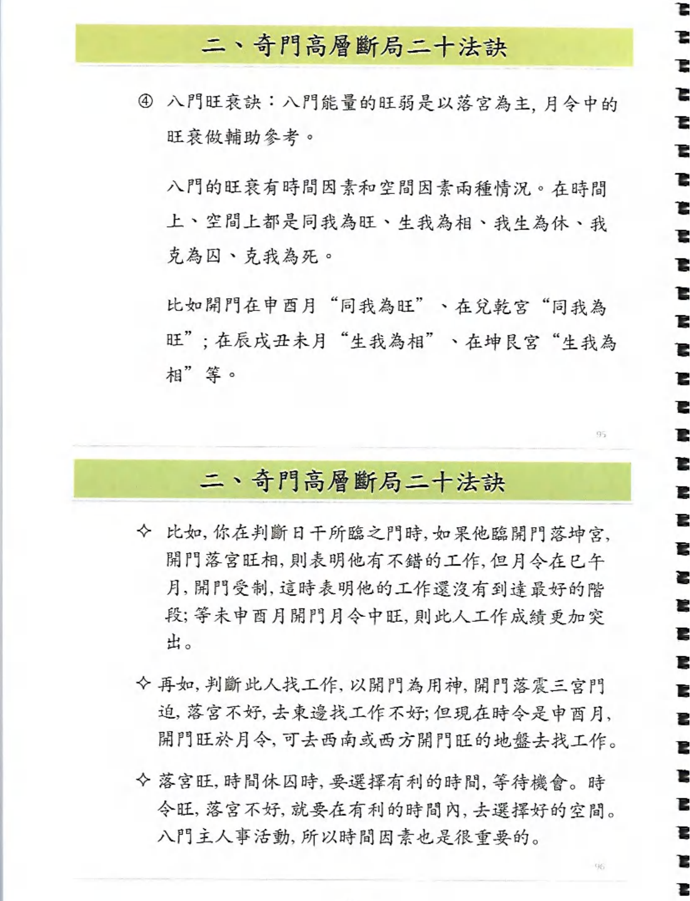

> **🖼 圖像解讀**　｜　檢視狀態：✅ 已檢視
> - **類型**：文字頁（大師研究班投影片 95–96）
> - **內容**：④ 八門旺衰訣：八門能量旺弱以落宮為主、月令為輔；時間與空間上都是同我為旺、生我為相、我生為休、我剋為囚、剋我為死（如開門在申酉月、兌乾宮同我為旺，在辰戌丑未月、坤艮宮生我為相）。例：日干臨開門落坤宮，開門落宮旺相表示有不錯的工作，但巳午月開門受制表示工作尚未到最好階段，等未申酉月開門旺則工作成績更突出；找工作以開門為用神，開門落震三宮門迫、去東邊找不好，但申酉月開門旺於月令，可去西南或西方開門旺的地盤找。落宮旺時間休囚要等待有利時機；時令旺落宮不好就在有利時間內去選好空間；八門主人事活動，時間因素也很重要。
> - **原文出處（逐字）**：二、奇門高層斷局二十法訣（投影片 95–96）
> - **可檢索關鍵字**：八門旺衰訣, 同我為旺, 生我為相, 開門落坤, 找工作開門, 門迫方位, 等待時機, 選擇空間

**📝 逐字謄寫（第 169 頁）**

### 二、奇門高層斷局二十法訣（投影片 95）

④ 八門旺衰訣：八門能量的旺弱是以落宮為主, 月令中的旺衰做輔助參考。

八門的旺衰有時間因素和空間因素兩種情況。在時間上、空間上都是同我為旺、生我為相、我生為休、我克為囚、克我為死。

比如開門在申酉月“同我為旺”、在兌乾宮“同我為旺”; 在辰戌丑未月“生我為相”、在坤艮宮“生我為相”等。

### 二、奇門高層斷局二十法訣（投影片 96）

- ✧ 比如, 你在判斷日干所臨之門時, 如果他臨開門落坤宮, 開門落宮旺相, 則表明他有不錯的工作, 但月令在巳午月, 開門受制, 這時表明他的工作還沒有到達最好的階段; 等未申酉月開門月令中旺, 則此人工作成績更加突出。
- ✧ 再如, 判斷此人找工作, 以開門為用神, 開門落震三宮門迫, 落宮不好, 去東邊找工作不好; 但現在時令是申酉月, 開門旺於月令, 可去西南或西方開門旺的地盤去找工作。
- ✧ 落宮旺, 時間休囚時, 要選擇有利的時間, 等待機會。時令旺, 落宮不好, 就要在有利的時間內, 去選擇好的空間。八門主人事活動, 所以時間因素也是很重要的。

## 圖 170 — 第 170 頁（1240x1617）｜🖼 圖片（開圖判斷：圖表細看／裝飾照簡述）

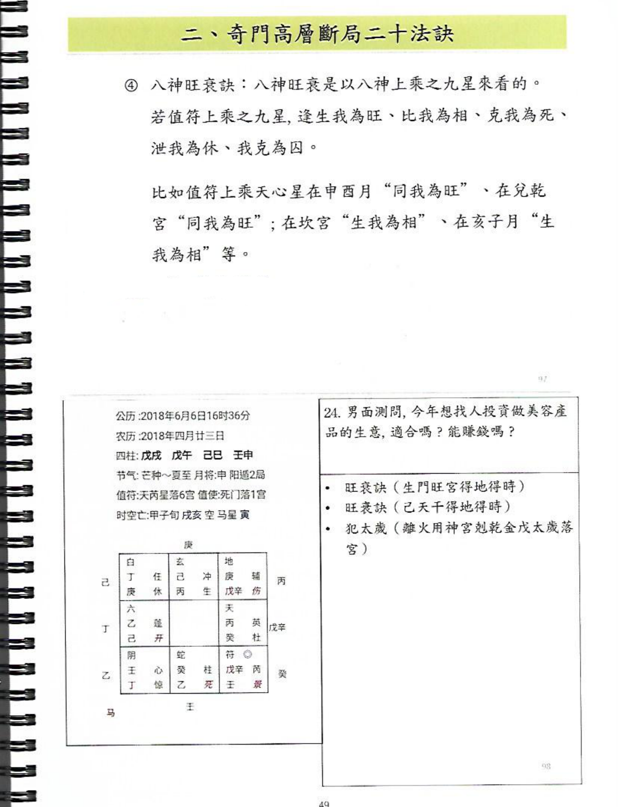

> **🖼 圖像解讀**　｜　檢視狀態：✅ 已檢視
> - **類型**：文字頁＋案例奇門盤（大師研究班投影片 97–98）
> - **內容**：④（原文編號重複）八神旺衰訣：八神旺衰以其上乘之九星來看，逢生我為旺、比我為相、剋我為死、洩我為休、我剋為囚（如值符上乘天心星在申酉月、兌乾宮同我為旺，在坎宮、亥子月生我為相）。案例 24「男面測問，今年想找人投資做美容產品的生意，適合嗎？能賺錢嗎？」，練習方法：旺衰訣（生門旺宮得地得時）、旺衰訣（己天干得地得時）、犯太歲（離火用神宮剋乾金戊太歲落宮）；盤：公曆2018年6月6日16時36分，四柱戊戌、戊午、己巳、壬申，陽遁2局，值符天芮星落6宮、值使死門落1宮，甲子旬戌亥空、馬星寅。
> - **原文出處（逐字）**：二、奇門高層斷局二十法訣（投影片 97）；24. 男面測問，今年想找人投資做美容產品的生意…（投影片 98）
> - **可檢索關鍵字**：八神旺衰訣, 上乘九星, 值符天心, 美容產品投資, 生門得地得時, 己得地得時, 犯太歲, 陽遁二局

**📝 逐字謄寫（第 170 頁）**

### 二、奇門高層斷局二十法訣（投影片 97）

④ 八神旺衰訣：八神旺衰是以八神上乘之九星來看的。若值符上乘之九星, 逢生我為旺、比我為相、克我為死、泄我為休、我克為囚。

比如值符上乘天心星在申酉月“同我為旺”、在兌乾宮“同我為旺”; 在坎宮“生我為相”、在亥子月“生我為相”等。

（註：原文此處編號與前頁八門旺衰訣同為「④」，照錄。）

### 案例 24（投影片 98）

**24. 男面測問, 今年想找人投資做美容產品的生意, 適合嗎？能賺錢嗎？**

- 旺衰訣（生門旺宮得地得時）
- 旺衰訣（己天干得地得時）
- 犯太歲（離火用神宮剋乾金戊太歲落宮）

公历:2018年6月6日16时36分
农历:2018年四月廿三日
四柱: 戊戌　戊午　己巳　壬申
节气: 芒种～夏至　月将:申　阳遁2局
值符:天芮星落6宫　值使:死门落1宫
时空亡:甲子旬 戌亥空　马星 寅

| 巽 | 離 | 坤 |
|---|---|---|
| 白 丁 任 庚 休 | 玄 己 冲 丙 生 | 地 庚 辅 戊辛 伤 |
| **震** | **中** | **兌** |
| 六 乙 蓬 己 开 | | 天 丙 英 癸 杜 |
| **艮** | **坎** | **乾** |
| 阴 壬 心 丁 惊 | 蛇 癸 柱 乙 死 | 符 ◎ 戊辛 芮 壬 景 |

盤外引干：上（離）庚；左（巽／震／艮）己／丁／乙；右（坤／兌／乾）丙／戊辛／癸；下（坎）壬；艮宮外標「马」。乾宮有空亡圈。
（註：此盤九宮排列與第 145 頁案例 13 相同〔同為陽遁 2 局、甲子旬、時干壬〕。）

（頁碼：49）

## 圖 171 — 第 171 頁（1240x1617）｜🖼 圖片（開圖判斷：圖表細看／裝飾照簡述）

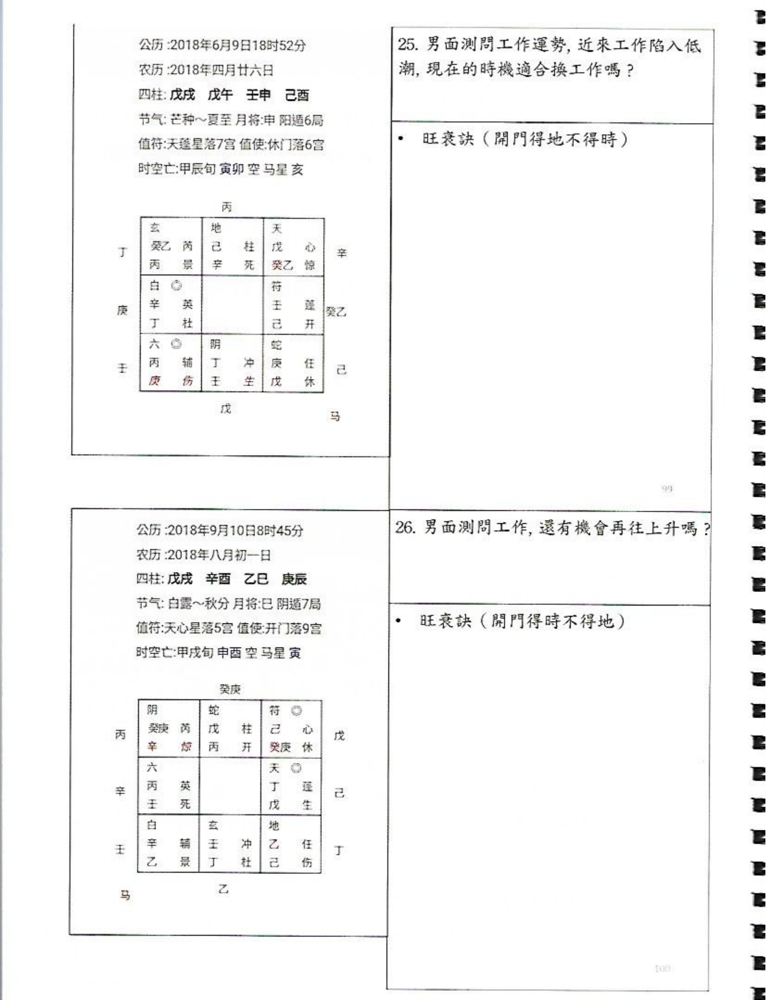

> **🖼 圖像解讀**　｜　檢視狀態：✅ 已檢視
> - **類型**：案例奇門盤＋練習欄（大師研究班投影片 99–100）
> - **內容**：案例 25「男面測問工作運勢，近來工作陷入低潮，現在的時機適合換工作嗎？」，練習方法：旺衰訣（開門得地不得時）；盤：公曆2018年6月9日18時52分，四柱戊戌、戊午、壬申、己酉，陽遁6局，值符天蓬星落7宮、值使休門落6宮，甲辰旬寅卯空、馬星亥。案例 26「男面測問工作，還有機會再往上升嗎？」，練習方法：旺衰訣（開門得時不得地）；盤：公曆2018年9月10日8時45分，四柱戊戌、辛酉、乙巳、庚辰，陰遁7局，值符天心星落5宮、值使開門落9宮，甲戌旬申酉空、馬星寅。
> - **原文出處（逐字）**：25. 男面測問工作運勢…現在的時機適合換工作嗎？；26. 男面測問工作，還有機會再往上升嗎？
> - **可檢索關鍵字**：換工作, 工作低潮, 開門得地不得時, 升遷機會, 開門得時不得地, 旺衰訣, 陽遁六局, 陰遁七局

**📝 逐字謄寫（第 171 頁）**

### 案例 25（投影片 99）

**25. 男面測問工作運勢, 近來工作陷入低潮, 現在的時機適合換工作嗎？**

- 旺衰訣（開門得地不得時）

公历:2018年6月9日18时52分
农历:2018年四月廿六日
四柱: 戊戌　戊午　壬申　己酉
节气: 芒种～夏至　月将:申　阳遁6局
值符:天蓬星落7宫　值使:休门落6宫
时空亡:甲辰旬 寅卯空　马星 亥

| 巽 | 離 | 坤 |
|---|---|---|
| 玄 癸乙 芮 丙 景 | 地 己 柱 辛 死 | 天 戊 心 癸乙 惊 |
| **震** | **中** | **兌** |
| 白 ◎ 辛 英 丁 杜 | | 符 壬 蓬 己 开 |
| **艮** | **坎** | **乾** |
| 六 ◎ 丙 辅 庚 伤 | 阴 丁 冲 壬 生 | 蛇 庚 任 戊 休 |

盤外引干：上（離）丙；左（巽／震／艮）丁／庚／壬；右（坤／兌／乾）辛／癸乙／己；下（坎）戊；乾宮外標「马」。震、艮兩宮有空亡圈。

### 案例 26（投影片 100）

**26. 男面測問工作, 還有機會再往上升嗎？**

- 旺衰訣（開門得時不得地）

公历:2018年9月10日8时45分
农历:2018年八月初一日
四柱: 戊戌　辛酉　乙巳　庚辰
节气: 白露～秋分　月将:巳　阴遁7局
值符:天心星落5宫　值使:开门落9宫
时空亡:甲戌旬 申酉空　马星 寅

| 巽 | 離 | 坤 |
|---|---|---|
| 阴 癸庚 芮 辛 惊 | 蛇 戊 柱 丙 开 | 符 ◎ 己 心 癸庚 休 |
| **震** | **中** | **兌** |
| 六 丙 英 壬 死 | | 天 ◎ 丁 蓬 戊 生 |
| **艮** | **坎** | **乾** |
| 白 辛 辅 乙 景 | 玄 壬 冲 丁 杜 | 地 乙 任 己 伤 |

盤外引干：上（離）癸庚；左（巽／震／艮）丙／辛／壬；右（坤／兌／乾）戊／己／丁；下（坎）乙；艮宮外標「马」。坤、兌兩宮有空亡圈。

## 圖 172 — 第 172 頁（1240x1617）｜🖼 圖片（開圖判斷：圖表細看／裝飾照簡述）

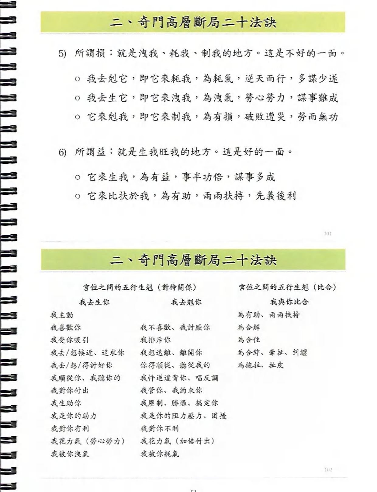

> **🖼 圖像解讀**　｜　檢視狀態：✅ 已檢視
> - **類型**：文字頁＋對照表（大師研究班投影片 101–102）
> - **內容**：斷局二十法訣「損、益」：損是洩我、耗我、制我之處，是不好的一面——我剋它即它來耗我為耗氣、逆天而行、多謀少遂；我生它即它來洩我為洩氣、勞心勞力、謀事難成；它剋我即它來制我為有損、破敗遭災、勞而無功。益是生我旺我之處，是好的一面——它生我為有益、事半功倍、謀事多成；它比扶我為有助、兩兩扶持、先義後利。投影片 102 為「宮位之間的五行生剋（對待關係）」對照表：我去生你（我主動、喜歡你、受你吸引、去接近追求討好你、順從聽你、對你付出、生助你、是你的助力、對你有利、花力氣勞心勞力、被你洩氣）、我去剋你（不喜歡討厭你、排斥你、想遠離你、你得順從我、忤逆違背唱反調、管你約束你、壓制勝過搞定你、是你的阻力壓力困擾、對你不利、花力氣加倍付出、被你耗氣）；比合（有助兩兩扶持、合解、合住、合絆牽扯糾纏、拖拉扯皮）。
> - **原文出處（逐字）**：二、奇門高層斷局二十法訣（投影片 101–102）
> - **可檢索關鍵字**：損益, 洩我耗我制我, 生我旺我, 對待關係, 我去生你, 我去剋你, 比合合絆, 人際關係生剋

**📝 逐字謄寫（第 172 頁）**

### 二、奇門高層斷局二十法訣（投影片 101）

5) 所謂損：就是洩我、耗我、制我的地方。這是不好的一面。
   - ○ 我去剋它，即它來耗我，為耗氣，逆天而行，多謀少遂
   - ○ 我去生它，即它來洩我，為洩氣，勞心勞力，謀事難成
   - ○ 它來剋我，即它來制我，為有損，破敗遭災，勞而無功

6) 所謂益：就是生我旺我的地方。這是好的一面。
   - ○ 它來生我，為有益，事半功倍，謀事多成
   - ○ 它來比扶於我，為有助，兩兩扶持，先義後利

### 二、奇門高層斷局二十法訣（投影片 102）

**宮位之間的五行生剋（對待關係）**

| 我去生你 | 我去剋你 |
|---|---|
| 我主動 | |
| 我喜歡你 | 我不喜歡、我討厭你 |
| 我受你吸引 | 我排斥你 |
| 我去/想接近、追求你 | 我想遠離、離開你 |
| 我去/想/得討好你 | 你得順從、聽從我的 |
| 我順從你、我聽你的 | 我忤逆違背你、唱反調 |
| 我對你付出 | 我管你、我約束你 |
| 我生助你 | 我壓制、勝過、搞定你 |
| 我是你的助力 | 我是你的阻力壓力、困擾 |
| 我對你有利 | 我對你不利 |
| 我花力氣（勞心勞力） | 我花力氣（加倍付出） |
| 我被你洩氣 | 我被你耗氣 |

**宮位之間的五行生剋（比合）**

| 我與你比合 |
|---|
| 為有助、兩兩扶持 |
| 為合解 |
| 為合住 |
| 為合絆、牽扯、糾纏 |
| 為拖拉、扯皮 |

（頁碼：51）

## 圖 173 — 第 173 頁（1240x1617）｜🖼 圖片（開圖判斷：圖表細看／裝飾照簡述）

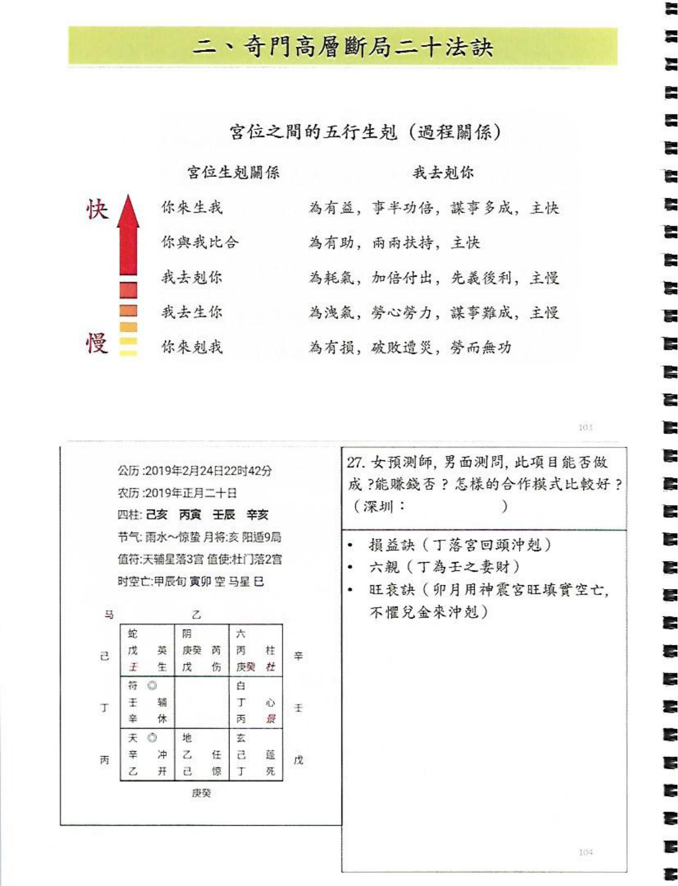

> **🖼 圖像解讀**　｜　檢視狀態：✅ 已檢視
> - **類型**：速度對照表＋案例奇門盤（大師研究班投影片 103–104）
> - **內容**：「宮位之間的五行生剋（過程關係）」依快慢排序：你來生我為有益、事半功倍、謀事多成、主快；你與我比合為有助、兩兩扶持、主快；我去剋你為耗氣、加倍付出、先義後利、主慢；我去生你為洩氣、勞心勞力、謀事難成、主慢；你來剋我為有損、破敗遭災、勞而無功（左側紅色箭頭由慢到快）。案例 27「女預測師，男面測問，此項目能否做成？能賺錢否？怎樣的合作模式比較好？（深圳）」（盤同案例 18：2019年2月24日22時42分陽遁9局），練習方法：損益訣（丁落宮回頭沖剋）、六親（丁為壬之妻財）、旺衰訣（卯月用神震宮旺填實空亡，不懼兌金來沖剋）。
> - **原文出處（逐字）**：二、奇門高層斷局二十法訣（投影片 103）；27. 女預測師，男面測問，此項目能否做成？…（投影片 104）
> - **可檢索關鍵字**：過程關係, 快慢排序, 你來生我主快, 比合主快, 我去剋你主慢, 損益訣, 回頭沖剋, 旺填實空亡

**📝 逐字謄寫（第 173 頁）**

### 二、奇門高層斷局二十法訣（投影片 103）

**宮位之間的五行生剋（過程關係）**

| 宮位生剋關係 | 我去剋你〔原表第二欄標題如此，內容為各關係之斷語〕 |
|---|---|
| 你來生我 | 為有益，事半功倍，謀事多成，主快 |
| 你與我比合 | 為有助，兩兩扶持，主快 |
| 我去剋你 | 為耗氣，加倍付出，先義後利，主慢 |
| 我去生你 | 為洩氣，勞心勞力，謀事難成，主慢 |
| 你來剋我 | 為有損，破敗遭災，勞而無功 |

（左側紅黃漸層箭頭：上「快」、下「慢」）

### 案例 27（投影片 104）

**27. 女預測師, 男面測問, 此項目能否做成？能賺錢否？怎樣的合作模式比較好？（深圳：　　）**

- 損益訣（丁落宮回頭沖剋）
- 六親（丁為壬之妻財）
- 旺衰訣（卯月用神震宮旺填實空亡，不懼兌金來沖剋）

（盤同第 148 頁案例 18：公历:2019年2月24日22时42分，四柱己亥 丙寅 壬辰 辛亥，阳遁9局，值符天辅星落3宫，值使杜门落2宫，甲辰旬 寅卯空，马星巳；九宮內容與案例 18 相同。）

## 圖 174 — 第 174 頁（1240x1617）｜🖼 圖片（開圖判斷：圖表細看／裝飾照簡述）

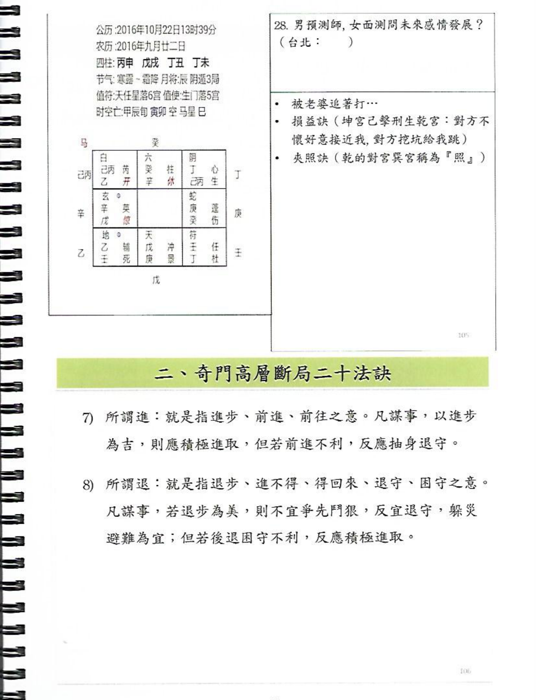

> **🖼 圖像解讀**　｜　檢視狀態：✅ 已檢視
> - **類型**：案例奇門盤＋文字頁（大師研究班投影片 105–106）
> - **內容**：案例 28「男預測師，女面測問未來感情發展？（台北）」，練習提示：被老婆追著打…、損益訣（坤宮己擊刑生乾宮：對方不懷好意接近我，對方挖坑給我跳）、夾照訣（乾的對宮巽宮稱為「照」）；盤：公曆2016年10月22日13時39分，四柱丙申、戊戌、丁丑、丁未，陰遁3局，值符天任星落6宮、值使生門落5宮，甲辰旬寅卯空、馬星巳。斷局二十法訣「進、退」：進指進步、前進、前往，謀事以進步為吉則應積極進取，但若前進不利反應抽身退守；退指退步、進不得、得回來、退守困守，謀事若退步為美則不宜爭先鬥狠、宜退守躲災避難，但若後退困守不利反應積極進取。
> - **原文出處（逐字）**：28. 男預測師，女面測問未來感情發展？（投影片 105）；二、奇門高層斷局二十法訣（投影片 106）
> - **可檢索關鍵字**：感情發展案例, 損益訣, 擊刑生, 挖坑, 夾照訣, 對宮為照, 進退, 進取與退守

**📝 逐字謄寫（第 174 頁）**

### 案例 28（投影片 105）

**28. 男預測師, 女面測問未來感情發展？（台北：　　）**

- 被老婆追著打…
- 損益訣（坤宮己擊刑生乾宮：對方不懷好意接近我, 對方挖坑給我跳）
- 夾照訣（乾的對宮巽宮稱為『照』）

公历:2016年10月22日13时39分
农历:2016年九月廿二日
四柱: 丙申　戊戌　丁丑　丁未
节气: 寒露～霜降　月将:辰　阴遁3局
值符:天任星落6宫　值使:生门落5宫
时空亡:甲辰旬 寅卯空　马星 巳

| 巽 | 離 | 坤 |
|---|---|---|
| 白 己丙 芮 乙 开 | 六 癸 柱 辛 休 | 阴 丁 心 己丙 生 |
| **震** | **中** | **兌** |
| 玄 ◦ 辛 英 戊 惊 | | 蛇 庚 蓬 癸 伤 |
| **艮** | **坎** | **乾** |
| 地 ◦ 乙 辅 壬 死 | 天 戊 冲 庚 景 | 符 壬 任 丁 杜 |

盤外引干：上（離）癸；左（巽／震／艮）己丙／辛／乙；右（坤／兌／乾）丁／庚／壬；下（坎）戊；巽宮外左上標「马」。震、艮兩宮有空亡點。

### 二、奇門高層斷局二十法訣（投影片 106）

7) 所謂進：就是指進步、前進、前往之意。凡謀事，以進步為吉，則應積極進取，但若前進不利，反應抽身退守。
8) 所謂退：就是指退步、進不得、得回來、退守、困守之意。凡謀事，若退步為美，則不宜爭先鬥狠，反宜退守，躲災避難為宜；但若後退困守不利，反應積極進取。

## 圖 175 — 第 175 頁（1240x1617）｜🖼 圖片（開圖判斷：圖表細看／裝飾照簡述）

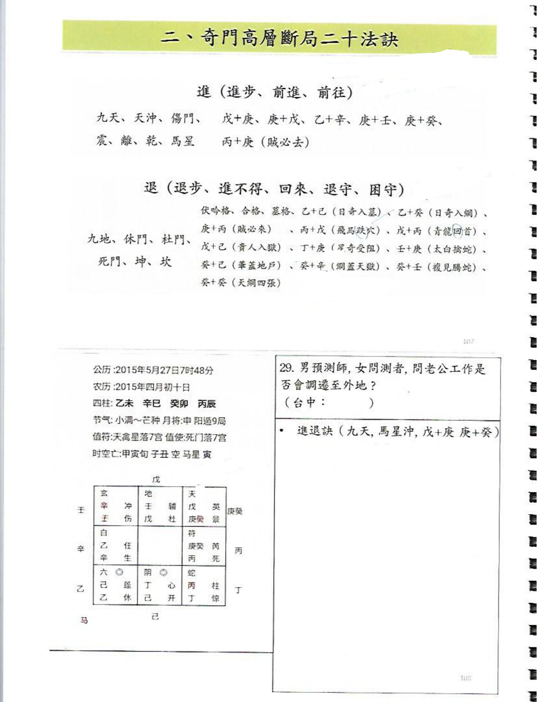

> **🖼 圖像解讀**　｜　檢視狀態：✅ 已檢視
> - **類型**：對照表＋案例奇門盤（大師研究班投影片 107–108）
> - **內容**：進退的符號歸類——進（進步、前進、前往）：九天、天沖、傷門、震、離、乾、馬星；戊＋庚、庚＋戊、乙＋辛、庚＋壬、庚＋癸、丙＋庚（賊必去）。退（退步、進不得、回來、退守、困守）：九地、休門、杜門、死門、坤、坎；伏吟格、合格、墓格、乙＋己（日奇入墓）、乙＋癸（日奇入網）、庚＋丙（賊必來）、丙＋戊（飛鳥跌穴）、戊＋丙（青龍回首）、戊＋己（貴人入獄）、丁＋庚（星奇受阻）、壬＋庚（太白擒蛇）、癸＋己（華蓋地戶）、癸＋辛（網蓋天獄）、癸＋壬（複見騰蛇）、癸＋癸（天網四張）。案例 29「男預測師，女問測者，問老公工作是否會調遷至外地？（台中）」，練習方法：進退訣（九天、馬星沖、戊＋庚、庚＋癸）；盤：公曆2015年5月27日7時48分，四柱乙未、辛巳、癸卯、丙辰，陽遁9局，值符天禽星落7宮、值使死門落7宮，甲寅旬子丑空、馬星寅。
> - **原文出處（逐字）**：二、奇門高層斷局二十法訣（投影片 107）；29. 男預測師，女問測者，問老公工作是否會調遷至外地？（投影片 108）
> - **可檢索關鍵字**：進退訣, 進的符號, 退的符號, 賊必去賊必來, 飛鳥跌穴, 青龍回首, 調遷外地, 馬星沖

**📝 逐字謄寫（第 175 頁）**

### 二、奇門高層斷局二十法訣（投影片 107）

**進（進步、前進、前往）**

| 星門神宮 | 格局 |
|---|---|
| 九天、天沖、傷門、震、離、乾、馬星 | 戊+庚、庚+戊、乙+辛、庚+壬、庚+癸、丙+庚（賊必去） |

**退（退步、進不得、回來、退守、困守）**

| 星門神宮 | 格局 |
|---|---|
| 九地、休門、杜門、死門、坤、坎 | 伏吟格、合格、墓格、乙+己（日奇入墓）、乙+癸（日奇入網）、庚+丙（賊必來）、丙+戊（飛鳥跌穴）、戊+丙（青龍回首）、戊+己（貴人入獄）、丁+庚（星奇受阻）、壬+庚（太白擒蛇）、癸+己（華蓋地戶）、癸+辛（網蓋天獄）、癸+壬（複見騰蛇）、癸+癸（天網四張） |

（「日奇入網」「青龍回首」旁有手寫圈記。）

### 案例 29（投影片 108）

**29. 男預測師, 女問測者, 問老公工作是否會調遷至外地？（台中：　　）**

- 進退訣（九天, 馬星沖, 戊+庚 庚+癸）

公历:2015年5月27日7时48分
农历:2015年四月初十日
四柱: 乙未　辛巳　癸卯　丙辰
节气: 小满～芒种　月将:申　阳遁9局
值符:天禽星落7宫　值使:死门落7宫
时空亡:甲寅旬 子丑空　马星 寅

| 巽 | 離 | 坤 |
|---|---|---|
| 玄 辛 冲 壬 伤 | 地 壬 辅 戊 杜 | 天 戊 英 庚癸 景 |
| **震** | **中** | **兌** |
| 白 乙 任 辛 生 | | 符 庚癸 芮 丙 死 |
| **艮** | **坎** | **乾** |
| 六 ◎ 己 蓬 乙 休 | 阴 ◎ 丁 心 己 开 | 蛇 丙 柱 丁 惊 |

盤外引干：上（離）戊；左（巽／震／艮）壬／辛／乙；右（坤／兌／乾）庚癸／丙／丁；下（坎）己；艮宮外左下標「马」。艮、坎兩宮有空亡圈。

## 圖 176 — 第 176 頁（1240x1617）｜🖼 圖片（開圖判斷：圖表細看／裝飾照簡述）

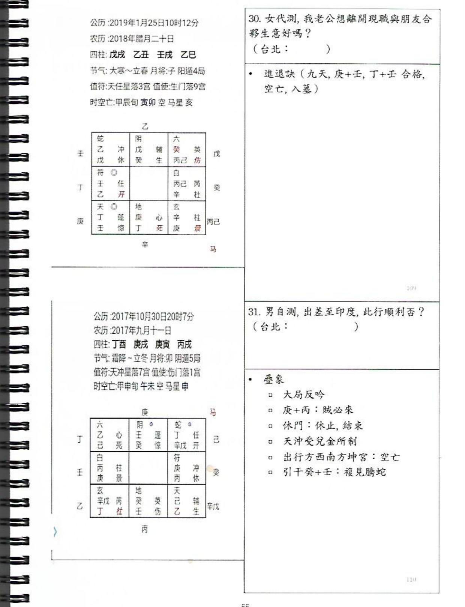

> **🖼 圖像解讀**　｜　檢視狀態：✅ 已檢視
> - **類型**：案例奇門盤＋練習欄（大師研究班投影片 109–110）
> - **內容**：兩則以進退訣複習的案例，盤與先前案例相同。案例 30「女代測，我老公想離開現職與朋友合夥生意好嗎？（台北）」（盤同案例 4：2019年1月25日10時12分陽遁4局），練習方法：進退訣（九天、庚＋壬、丁＋壬合格、空亡、入墓）。案例 31「男自測，出差至印度，此行順利否？（台北）」（盤同案例 16：2017年10月30日20時7分陰遁5局），練習方法：疊象——大局反吟、庚＋丙賊必來、休門休止結束、天沖受兌金所制、出行方西南方坤宮空亡、引干癸＋壬複見騰蛇。
> - **原文出處（逐字）**：30. 女代測，我老公想離開現職與朋友合夥生意好嗎？；31. 男自測，出差至印度，此行順利否？
> - **可檢索關鍵字**：進退訣, 離職合夥, 九天庚加壬, 丁加壬合格, 出差印度, 大局反吟, 賊必來, 複見騰蛇

**📝 逐字謄寫（第 176 頁）**

### 案例 30（投影片 109）

**30. 女代測, 我老公想離開現職與朋友合夥生意好嗎？（台北：　　）**

- 進退訣（九天, 庚+壬, 丁+壬 合格, 空亡, 入墓）

（盤同第 141 頁案例 4：公历:2019年1月25日10时12分，四柱戊戌 乙丑 壬戌 乙巳，阳遁4局，值符天任星落3宫，值使生门落9宫，甲辰旬 寅卯空，马星亥；九宮內容與案例 4 相同。）

### 案例 31（投影片 110）

**31. 男自測, 出差至印度, 此行順利否？（台北：　　）**

- 疊象
  - ☐ 大局反吟
  - ☐ 庚+丙：賊必來
  - ☐ 休門：休止, 結束
  - ☐ 天沖受兌金所制
  - ☐ 出行方西南方坤宮：空亡
  - ☐ 引干癸+壬：複見騰蛇

（盤同第 147 頁案例 16：公历:2017年10月30日20时7分，四柱丁酉 庚戌 庚寅 丙戌，阴遁5局，值符天冲星落7宫，值使伤门落1宫，甲申旬 午未空，马星申；九宮內容與案例 16 相同。）

（頁碼：55）

## 圖 177 — 第 177 頁（1240x1617）｜🖼 圖片（開圖判斷：圖表細看／裝飾照簡述）

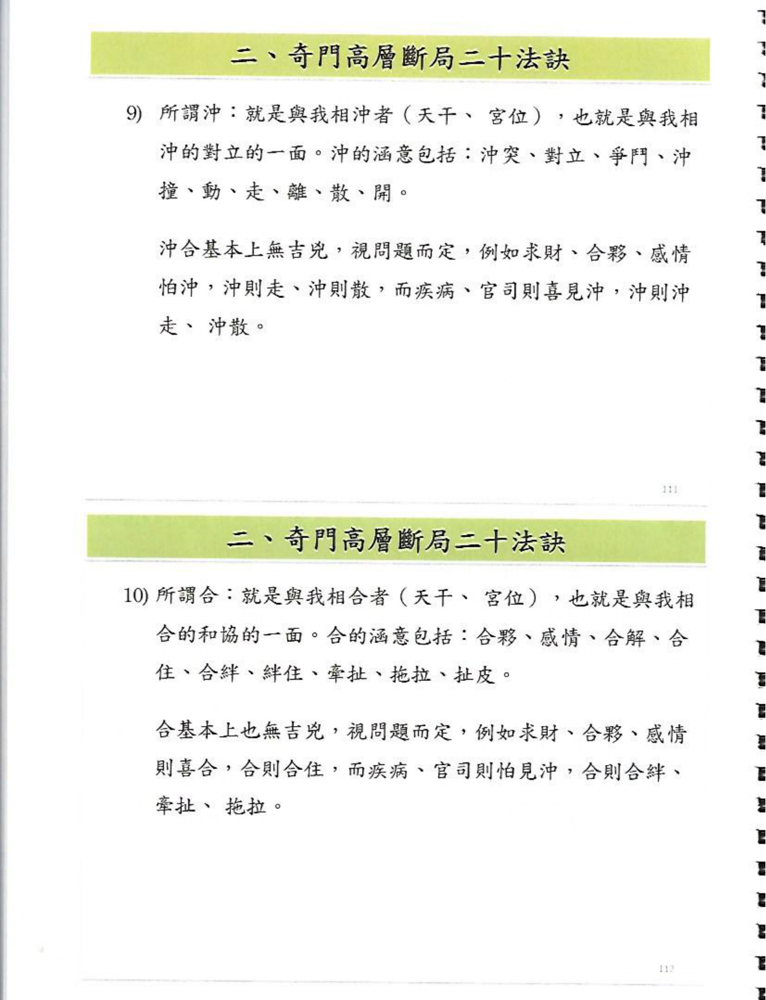

> **🖼 圖像解讀**　｜　檢視狀態：✅ 已檢視
> - **類型**：文字頁（大師研究班投影片 111–112）
> - **內容**：斷局二十法訣「沖、合」：沖是與我相沖者（天干、宮位），即與我對立的一面，涵意包括沖突、對立、爭鬥、沖撞、動、走、離、散、開；沖合本無吉凶，視問題而定——求財、合夥、感情怕沖（沖則走、沖則散），疾病、官司則喜見沖（沖則沖走、沖散）。合是與我相合者（天干、宮位），即與我和協的一面，涵意包括合夥、感情、合解、合住、合絆、絆住、牽扯、拖拉、扯皮；合也無吉凶——求財、合夥、感情喜合（合則合住），疾病、官司則怕見合（原文作「怕見沖」），合則合絆、牽扯、拖拉。
> - **原文出處（逐字）**：二、奇門高層斷局二十法訣（投影片 111–112）
> - **可檢索關鍵字**：沖合, 沖突對立, 沖則散, 疾病官司喜沖, 合夥感情喜合, 合絆牽扯, 沖合無吉凶, 視問題而定

**📝 逐字謄寫（第 177 頁）**

### 二、奇門高層斷局二十法訣（投影片 111）

9) 所謂沖：就是與我相沖者（天干、宮位），也就是與我相沖的對立的一面。沖的涵意包括：沖突、對立、爭鬥、沖撞、動、走、離、散、開。

沖合基本上無吉兇，視問題而定，例如求財、合夥、感情怕沖，沖則走、沖則散，而疾病、官司則喜見沖，沖則沖走、沖散。

### 二、奇門高層斷局二十法訣（投影片 112）

10) 所謂合：就是與我相合者（天干、宮位），也就是與我相合的和協的一面。合的涵意包括：合夥、感情、合解、合住、合絆、絆住、牽扯、拖拉、扯皮。

合基本上也無吉兇，視問題而定，例如求財、合夥、感情則喜合，合則合住，而疾病、官司則怕見沖，合則合絆、牽扯、拖拉。

（註：此段原文作「疾病、官司則怕見沖」，依上下文應為「怕見合」，照錄。）

## 圖 178 — 第 178 頁（1240x1617）｜🖼 圖片（開圖判斷：圖表細看／裝飾照簡述）

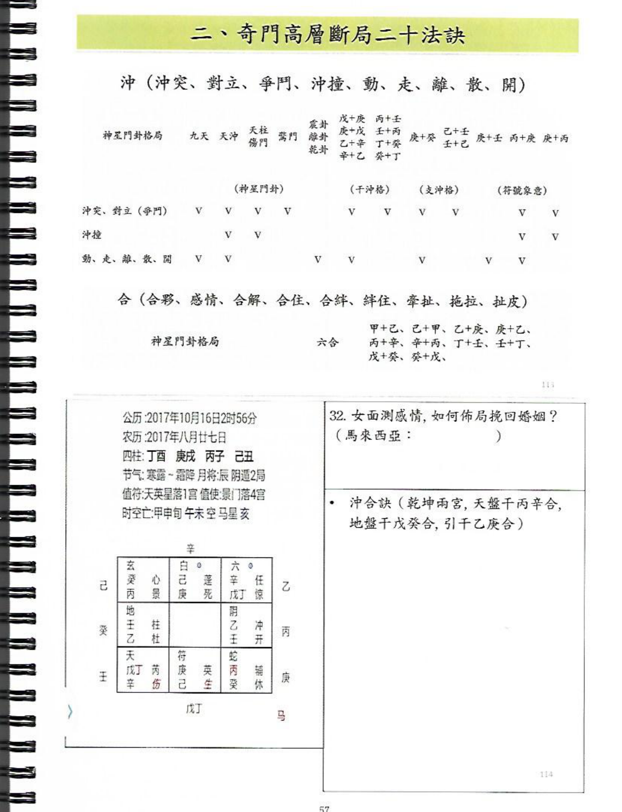

> **🖼 圖像解讀**　｜　檢視狀態：✅ 已檢視
> - **類型**：對照表＋案例（大師研究班投影片 113–114）
> - **內容**：沖合符號歸類表。沖（沖突、對立、爭鬥、沖撞、動、走、離、散、開）以勾選表列出：九天、天沖、天柱傷門、驚門（神星門卦）、震離乾卦、干沖格（戊＋庚、庚＋戊、乙＋辛、辛＋乙；丙＋壬、壬＋丙、丁＋癸、癸＋丁）、支沖格（庚＋癸、己＋壬、壬＋己）、符號象意（庚＋壬、丙＋庚、庚＋丙）各自屬「沖突對立（爭鬥）」「沖撞」「動走離散開」哪類。合（合夥、感情、合解、合住、合絆、絆住、牽扯、拖拉、扯皮）：六合，及甲＋己、己＋甲、乙＋庚、庚＋乙、丙＋辛、辛＋丙、丁＋壬、壬＋丁、戊＋癸、癸＋戊。案例 32「女面測感情，如何佈局挽回婚姻？（馬來西亞）」（盤同案例 2：2017年10月16日2時56分陰遁2局），練習方法：沖合訣（乾坤兩宮，天盤干丙辛合，地盤干戊癸合，引干乙庚合）。
> - **原文出處（逐字）**：二、奇門高層斷局二十法訣（投影片 113）；32. 女面測感情，如何佈局挽回婚姻？（投影片 114）
> - **可檢索關鍵字**：沖格歸類, 合格歸類, 干沖格, 支沖格, 六合, 十干五合, 挽回婚姻, 乾坤兩宮相合

**📝 逐字謄寫（第 178 頁）**

### 二、奇門高層斷局二十法訣（投影片 113）

**沖（沖突、對立、爭鬥、沖撞、動、走、離、散、開）**

| 神星門卦格局 | 九天 | 天沖 | 天柱／傷門 | 驚門 | 震卦／離卦／乾卦 | 戊+庚、庚+戊、乙+辛、辛+乙 | 丙+壬、壬+丙、丁+癸、癸+丁 | 庚+癸 | 己+壬、壬+己 | 庚+壬 | 丙+庚 | 庚+丙 |
|---|---|---|---|---|---|---|---|---|---|---|---|---|
| 分類 | （神星門卦） | | | | | （干沖格） | | （支沖格） | | （符號象意） | | |
| 沖突、對立（爭鬥） | V | V | V | V | | V | V | V | V | | V | V |
| 沖撞 | | V | V | | | | | | | | V | V |
| 動、走、離、散、開 | V | V | | | V | V | | V | | V | V | |

**合（合夥、感情、合解、合住、合絆、絆住、牽扯、拖拉、扯皮）**

| 神星門卦格局 | 六合 | 甲+己、己+甲、乙+庚、庚+乙、丙+辛、辛+丙、丁+壬、壬+丁、戊+癸、癸+戊、 |
|---|---|---|

（註：勾選位置依放大圖逐欄對照。）

### 案例 32（投影片 114）

**32. 女面測感情, 如何佈局挽回婚姻？（馬來西亞：　　）**

- 沖合訣（乾坤兩宮, 天盤干丙辛合, 地盤干戊癸合, 引干乙庚合）

（盤同第 140 頁案例 2：公历:2017年10月16日2时56分，四柱丁酉 庚戌 丙子 己丑，阴遁2局，值符天英星落1宫，值使景门落4宫，甲申旬 午未空，马星亥；九宮內容與案例 2 相同。）

（頁碼：57）

## 圖 179 — 第 179 頁（1240x1617）｜🖼 圖片（開圖判斷：圖表細看／裝飾照簡述）

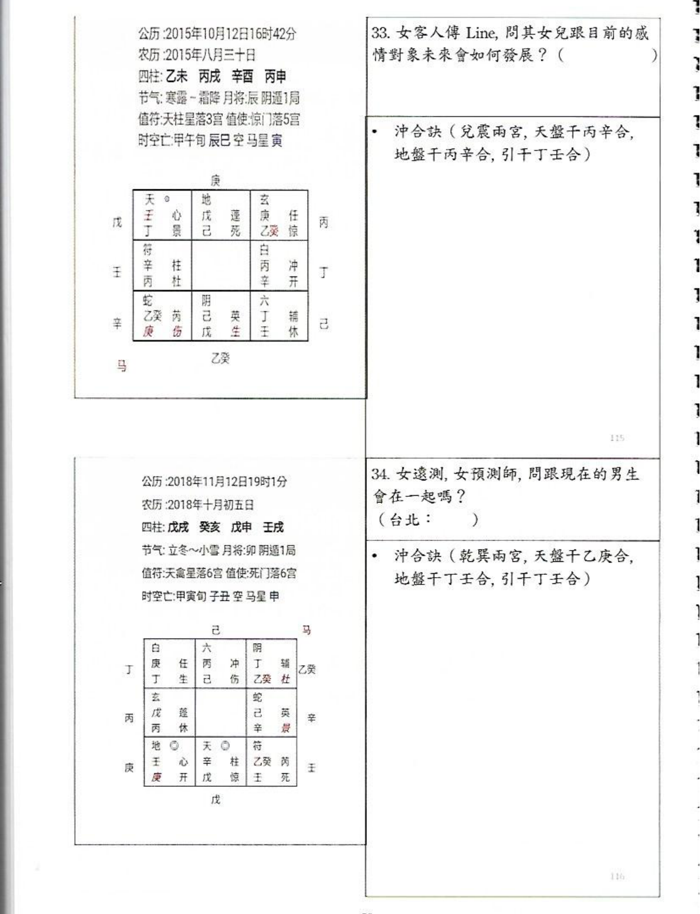

> **🖼 圖像解讀**　｜　檢視狀態：✅ 已檢視
> - **類型**：案例練習（大師研究班投影片 115–116）
> - **內容**：以沖合訣複習前面兩則感情案例（盤同前）。案例 33「女客人傳 Line，問其女兒跟目前的感情對象未來會如何發展？」（盤同案例 1：2015年10月12日16時42分陰遁1局），練習方法：沖合訣（兌震兩宮，天盤干丙辛合，地盤干丙辛合，引干丁壬合）。案例 34「女遠測，女預測師，問跟現在的男生會在一起嗎？（台北）」（盤同案例 3：2018年11月12日19時1分陰遁1局），練習方法：沖合訣（乾巽兩宮，天盤干乙庚合，地盤干丁壬合，引干丁壬合）。
> - **原文出處（逐字）**：33. 女客人傳 Line，問其女兒跟目前的感情對象未來會如何發展？；34. 女遠測，女預測師，問跟現在的男生會在一起嗎？
> - **可檢索關鍵字**：沖合訣, 感情案例, 兌震兩宮, 乾巽兩宮, 丙辛合, 乙庚合, 丁壬合, 引干相合

**📝 逐字謄寫（第 179 頁）**

### 案例 33（投影片 115）

**33. 女客人傳 Line, 問其女兒跟目前的感情對象未來會如何發展？（　　）**

- 沖合訣（兌震兩宮, 天盤干丙辛合, 地盤干丙辛合, 引干丁壬合）

（盤同第 140 頁案例 1：公历:2015年10月12日16时42分，四柱乙未 丙戌 辛酉 丙申，阴遁1局，值符天柱星落3宫，值使惊门落5宫，甲午旬 辰巳空，马星寅；九宮內容與案例 1 相同。）

### 案例 34（投影片 116）

**34. 女遠測, 女預測師, 問跟現在的男生會在一起嗎？（台北：　　）**

- 沖合訣（乾巽兩宮, 天盤干乙庚合, 地盤干丁壬合, 引干丁壬合）

（盤同第 141 頁案例 3：公历:2018年11月12日19时1分，四柱戊戌 癸亥 戊申 壬戌，阴遁1局，值符天禽星落6宫，值使死门落6宫，甲寅旬 子丑空，马星申；九宮內容與案例 3 相同。）

## 圖 180 — 第 180 頁（1240x1617）｜🖼 圖片（開圖判斷：圖表細看／裝飾照簡述）

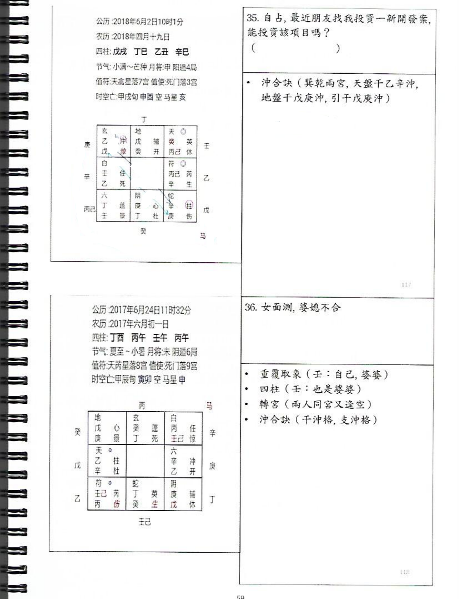

> **🖼 圖像解讀**　｜　檢視狀態：✅ 已檢視
> - **類型**：案例奇門盤＋練習欄（大師研究班投影片 117–118）
> - **內容**：案例 35「自占，最近朋友找我投資一新開發案，能投資該項目嗎？」，練習方法：沖合訣（巽乾兩宮，天盤干乙辛沖，地盤干戊庚沖，引干戊庚沖）；盤：公曆2018年6月2日10時1分，四柱戊戌、丁巳、乙丑、辛巳，陽遁4局，值符天禽星落7宮、值使死門落3宮，甲戌旬申酉空、馬星亥（盤上有藍筆手寫斜線連接巽、乾兩宮，並圈出天沖、天柱）。案例 36「女面測，婆媳不合」（盤同案例 6：2017年6月24日11時32分陰遁6局），練習方法：重覆取象（壬：自己、婆婆）、四柱（壬也是婆婆）、轉宮（兩人同宮又逢空）、沖合訣（干沖格、支沖格）。
> - **原文出處（逐字）**：35. 自占，最近朋友找我投資一新開發案，能投資該項目嗎？；36. 女面測，婆媳不合
> - **可檢索關鍵字**：投資開發案, 沖合訣, 巽乾兩宮, 乙辛沖, 戊庚沖, 婆媳不合, 干沖格支沖格, 陽遁四局

**📝 逐字謄寫（第 180 頁）**

### 案例 35（投影片 117）

**35. 自占, 最近朋友找我投資一新開發案, 能投資該項目嗎？（　　）**

- 沖合訣（巽乾兩宮, 天盤干乙辛沖, 地盤干戊庚沖, 引干戊庚沖）

公历:2018年6月2日10时1分
农历:2018年四月十九日
四柱: 戊戌　丁巳　乙丑　辛巳
节气: 小满～芒种　月将:申　阳遁4局
值符:天禽星落7宫　值使:死门落3宫
时空亡:甲戌旬 申酉空　马星 亥

| 巽 | 離 | 坤 |
|---|---|---|
| 玄 乙 冲 戊 惊 | 地 戊 辅 癸 开 | 天 ◎ 癸 英 丙己 休 |
| **震** | **中** | **兌** |
| 白 壬 任 乙 死 | | 符 ◎ 丙己 芮 辛 生 |
| **艮** | **坎** | **乾** |
| 六 丁 蓬 壬 景 | 阴 庚 心 丁 杜 | 蛇 辛 柱 庚 伤 |

盤外引干：上（離）丁；左（巽／震／艮）庚／辛／丙己；右（坤／兌／乾）壬／乙／戊；下（坎）癸；乾宮外標「马」。坤、兌兩宮有空亡圈。
（盤上藍筆手寫：由巽宮斜向乾宮的連線，圈起巽宮「冲」、乾宮「柱」。）

### 案例 36（投影片 118）

**36. 女面測, 婆媳不合**

- 重覆取象（壬：自己, 婆婆）
- 四柱（壬：也是婆婆）
- 轉宮（兩人同宮又逢空）
- 沖合訣（干沖格, 支沖格）

（盤同第 142 頁案例 6：公历:2017年6月24日11时32分，四柱丁酉 丙午 壬午 丙午，阴遁6局，值符天芮星落8宫，值使死门落9宫，甲辰旬 寅卯空，马星申；九宮內容與案例 6 相同。）

（頁碼：59）

## 圖 181 — 第 181 頁（1240x1617）｜🖼 圖片（開圖判斷：圖表細看／裝飾照簡述）

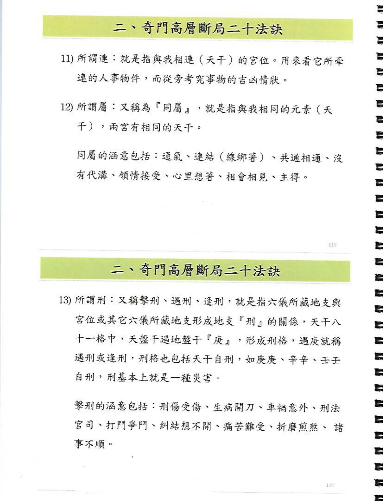

> **🖼 圖像解讀**　｜　檢視狀態：✅ 已檢視
> - **類型**：文字頁（大師研究班投影片 119–120）
> - **內容**：斷局二十法訣「連、屬、刑」：連是與我相連（天干）的宮位，用來看所牽連的人事物件、從旁考究吉凶情狀；屬又稱「同屬」，是與我相同的元素（天干），兩宮有相同天干，涵意包括通氣、連結（線綁著）、共通相通、沒有代溝、領情接受、心裡想著、相會相見、主得；刑又稱擊刑、遇刑、逢刑，指六儀所藏地支與宮位或其它六儀所藏地支形成地支「刑」的關係，天干八十一格中天盤干遇地盤干「庚」形成刑格（遇庚即遇刑），也包括天干自刑如庚庚、辛辛、壬壬，刑基本上是一種災害，涵意包括刑傷受傷、生病開刀、車禍意外、刑法官司、打鬥爭鬥、糾結想不開、痛苦難受、折磨煎熬、諸事不順。
> - **原文出處（逐字）**：二、奇門高層斷局二十法訣（投影片 119–120）
> - **可檢索關鍵字**：連, 屬, 同屬, 通氣連結, 心裡想著, 刑, 擊刑遇庚, 天干自刑

**📝 逐字謄寫（第 181 頁）**

### 二、奇門高層斷局二十法訣（投影片 119）

11) 所謂連：就是指與我相連（天干）的宮位。用來看它所牽連的人事物件，而從旁考究事物的吉凶情狀。

12) 所謂屬：又稱為『同屬』，就是指與我相同的元素（天干），兩宮有相同的天干。

同屬的涵意包括：通氣、連結（線綁著）、共通相通、沒有代溝、領情接受、心里想著、相會相見、主得。

### 二、奇門高層斷局二十法訣（投影片 120）

13) 所謂刑：又稱擊刑、遇刑、逢刑，就是指六儀所藏地支與宮位或其它六儀所藏地支形成地支『刑』的關係，天干八十一格中，天盤干遇地盤干『庚』，形成刑格，遇庚就稱遇刑或逢刑，刑格也包括天干自刑，如庚庚、辛辛、壬壬自刑，刑基本上就是一種災害。

擊刑的涵意包括：刑傷受傷、生病開刀、車禍意外、刑法官司、打鬥爭鬥、糾結想不開、痛苦難受、折磨煎熬、諸事不順。

## 圖 182 — 第 182 頁（1240x1617）｜🖼 圖片（開圖判斷：圖表細看／裝飾照簡述）

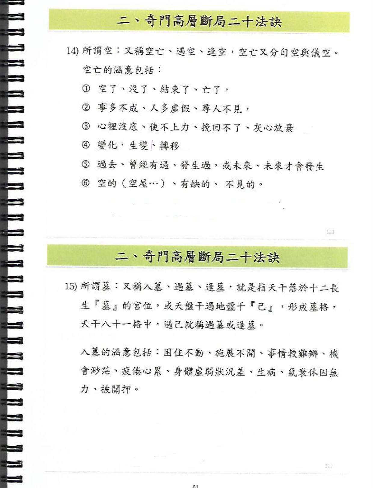

> **🖼 圖像解讀**　｜　檢視狀態：✅ 已檢視
> - **類型**：文字頁（大師研究班投影片 121–122）
> - **內容**：「空」：又稱空亡、遇空、逢空，分旬空與儀空；涵意包括：空了沒了結束了亡了；事多不成、人多虛假、尋人不見；心裡沒底、使不上力、挽回不了、灰心放棄；變化生變轉移；過去曾經有過發生過，或未來才會發生；空的（空屋）、有缺的、不見的。「墓」：又稱入墓、遇墓、逢墓，指天干落於十二長生「墓」的宮位，或天盤干遇地盤干「己」形成墓格（遇己即遇墓）；涵意包括困住不動、施展不開、事情較難辦、機會渺茫、疲倦心累、身體虛弱狀況差、生病、氣衰休囚無力、被關押。
> - **原文出處（逐字）**：二、奇門高層斷局二十法訣（投影片 121–122）
> - **可檢索關鍵字**：空亡, 旬空儀空, 事多不成, 挽回不了, 過去或未來, 入墓, 遇己逢墓, 困住不動

**📝 逐字謄寫（第 182 頁）**

### 二、奇門高層斷局二十法訣（投影片 121）

14) 所謂空：又稱空亡、遇空、逢空，空亡又分旬空與儀空。空亡的涵意包括：
   - ① 空了、沒了、結束了、亡了，
   - ② 事多不成、人多虛假、尋人不見，
   - ③ 心裡沒底、使不上力、挽回不了、灰心放棄
   - ④ 變化、生變、轉移
   - ⑤ 過去、曾經有過、發生過，或未來、未來才會發生
   - ⑥ 空的（空屋…）、有缺的、不見的。

### 二、奇門高層斷局二十法訣（投影片 122）

15) 所謂墓：又稱入墓、遇墓、逢墓，就是指天干落於十二長生『墓』的宮位，或天盤干遇地盤干『己』，形成墓格，天干八十一格中，遇己就稱遇墓或逢墓。

入墓的涵意包括：困住不動、施展不開、事情較難辦、機會渺茫、疲倦心累、身體虛弱狀況差、生病、氣衰休囚無力、被關押。

（頁碼：61）

## 圖 183 — 第 183 頁（1240x1617）｜🖼 圖片（開圖判斷：圖表細看／裝飾照簡述）

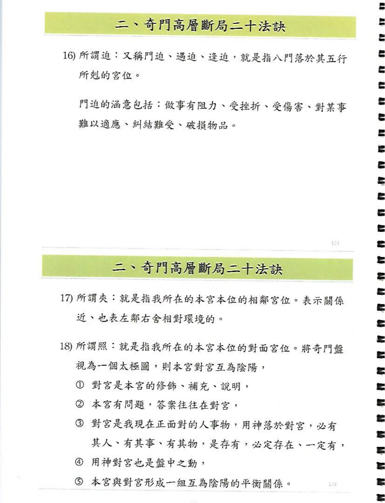

> **🖼 圖像解讀**　｜　檢視狀態：✅ 已檢視
> - **類型**：文字頁（大師研究班投影片 123–124）
> - **內容**：「迫」（原文列為第 16 項；前述二十法訣名稱此位為「破」）：又稱門迫、遇迫、逢迫，指八門落於其五行所剋的宮位，涵意包括做事有阻力、受挫折、受傷害、對某事難以適應、糾結難受、破損物品。「夾」：我所在本宮本位的相鄰宮位，表示關係近、左鄰右舍相對環境。「照」：本宮本位的對面宮位；將奇門盤視為太極圖，本宮對宮互為陰陽——對宮是本宮的修飾補充說明；本宮有問題答案往往在對宮；對宮是我現在正面對的人事物，用神落於對宮必有其人事物（存有）；用神對宮也是盤中之動；本宮與對宮形成互為陰陽的平衡關係。
> - **原文出處（逐字）**：二、奇門高層斷局二十法訣（投影片 123–124）
> - **可檢索關鍵字**：門迫, 做事有阻力, 夾, 左鄰右舍, 照, 對宮, 答案在對宮, 互為陰陽平衡

**📝 逐字謄寫（第 183 頁）**

### 二、奇門高層斷局二十法訣（投影片 123）

16) 所謂迫：又稱門迫、遇迫、逢迫，就是指八門落於其五行所剋的宮位。

門迫的涵意包括：做事有阻力、受挫折、受傷害、對某事難以適應、糾結難受、破損物品。

（註：前述二十法訣名稱中第 16 項為「破」，此處講解標題為「迫」，原文如此。）

### 二、奇門高層斷局二十法訣（投影片 124）

17) 所謂夾：就是指我所在的本宮本位的相鄰宮位。表示關係近、也表左鄰右舍相對環境的。

18) 所謂照：就是指我所在的本宮本位的對面宮位。將奇門盤視為一個太極圖，則本宮對宮互為陰陽，
   - ① 對宮是本宮的修飾、補充、說明，
   - ② 本宮有問題，答案往往在對宮，
   - ③ 對宮是我現在正面對的人事物，用神落於對宮，必有其人、有其事、有其物，是存有，必定存在、一定有，
   - ④ 用神對宮也是盤中之動，
   - ⑤ 本宮與對宮形成一組互為陰陽的平衡關係。

## 圖 184 — 第 184 頁（1240x1617）｜🖼 圖片（開圖判斷：圖表細看／裝飾照簡述）

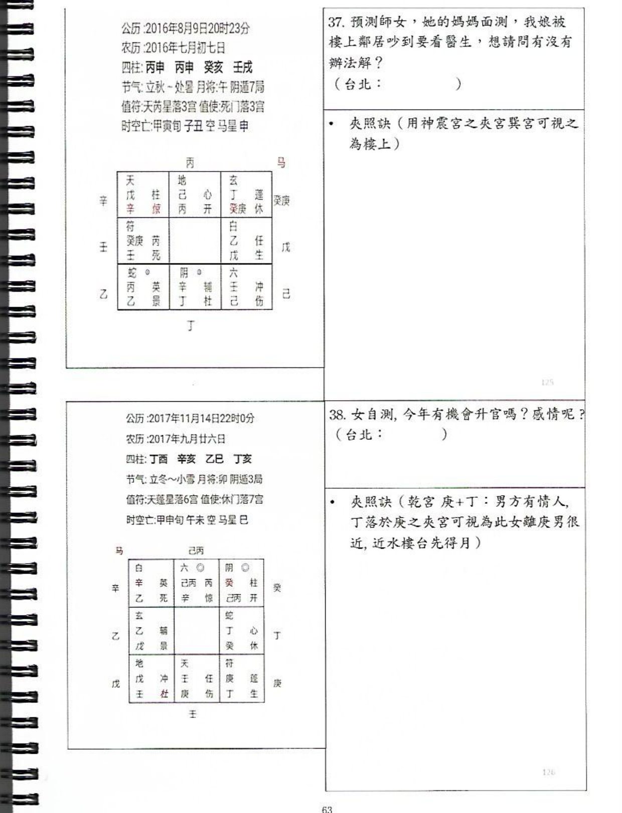

> **🖼 圖像解讀**　｜　檢視狀態：✅ 已檢視
> - **類型**：案例奇門盤＋練習欄（大師研究班投影片 125–126）
> - **內容**：案例 37「預測師女，她的媽媽面測，我娘被樓上鄰居吵到要看醫生，想請問有沒有辦法解？（台北）」，練習方法：夾照訣（用神震宮之夾宮巽宮可視之為樓上）；盤：公曆2016年8月9日20時23分，四柱丙申、丙申、癸亥、壬戌，陰遁7局，值符天芮星落3宮、值使死門落3宮，甲寅旬子丑空、馬星申。案例 38「女自測，今年有機會升官嗎？感情呢？（台北）」，練習方法：夾照訣（乾宮庚＋丁：男方有情人，丁落於庚之夾宮可視為此女離庚男很近，近水樓台先得月）；盤：公曆2017年11月14日22時0分，四柱丁酉、辛亥、乙巳、丁亥，陰遁3局，值符天蓬星落6宮、值使休門落7宮，甲申旬午未空、馬星巳。
> - **原文出處（逐字）**：37. 預測師女，她的媽媽面測，我娘被樓上鄰居吵到要看醫生…；38. 女自測，今年有機會升官嗎？感情呢？
> - **可檢索關鍵字**：夾照訣, 鄰居噪音, 夾宮為樓上, 升官感情, 庚加丁有情人, 近水樓台, 陰遁七局, 陰遁三局

**📝 逐字謄寫（第 184 頁）**

### 案例 37（投影片 125）

**37. 預測師女，她的媽媽面測，我娘被樓上鄰居吵到要看醫生，想請問有沒有辦法解？（台北：　　）**

- 夾照訣（用神震宮之夾宮巽宮可視之為樓上）

公历:2016年8月9日20时23分
农历:2016年七月初七日
四柱: 丙申　丙申　癸亥　壬戌
节气: 立秋～处暑　月将:午　阴遁7局
值符:天芮星落3宫　值使:死门落3宫
时空亡:甲寅旬 子丑空　马星 申

| 巽 | 離 | 坤 |
|---|---|---|
| 天 戊 柱 辛 惊 | 地 己 心 丙 开 | 玄 丁 蓬 癸庚 休 |
| **震** | **中** | **兌** |
| 符 癸庚 芮 壬 死 | | 白 乙 任 戊 生 |
| **艮** | **坎** | **乾** |
| 蛇 ◦ 丙 英 乙 景 | 阴 ◦ 辛 辅 丁 杜 | 六 壬 冲 己 伤 |

盤外引干：上（離）丙；左（巽／震／艮）辛／壬／乙；右（坤／兌／乾）癸庚／戊／己；下（坎）丁；坤宮外標「马」。艮、坎兩宮有空亡點。

### 案例 38（投影片 126）

**38. 女自測, 今年有機會升官嗎？感情呢？（台北：　　）**

- 夾照訣（乾宮 庚+丁：男方有情人, 丁落於庚之夾宮可視為此女離庚男很近, 近水樓台先得月）

公历:2017年11月14日22时0分
农历:2017年九月廿六日
四柱: 丁酉　辛亥　乙巳　丁亥
节气: 立冬～小雪　月将:卯　阴遁3局
值符:天蓬星落6宫　值使:休门落7宫
时空亡:甲申旬 午未空　马星 巳

| 巽 | 離 | 坤 |
|---|---|---|
| 白 辛 英 乙 死 | 六 ◎ 己丙 芮 辛 惊 | 阴 ◎ 癸 柱 己丙 开 |
| **震** | **中** | **兌** |
| 玄 乙 辅 戊 景 | | 蛇 丁 心 癸 休 |
| **艮** | **坎** | **乾** |
| 地 戊 冲 壬 杜 | 天 壬 任 庚 伤 | 符 庚 蓬 丁 生 |

盤外引干：上（離）己丙；左（巽／震／艮）辛／乙／戊；右（坤／兌／乾）癸／丁／庚；下（坎）壬；巽宮外左上標「马」。離、坤兩宮有空亡圈。

（頁碼：63）

## 圖 185 — 第 185 頁（1240x1617）｜🖼 圖片（開圖判斷：圖表細看／裝飾照簡述）

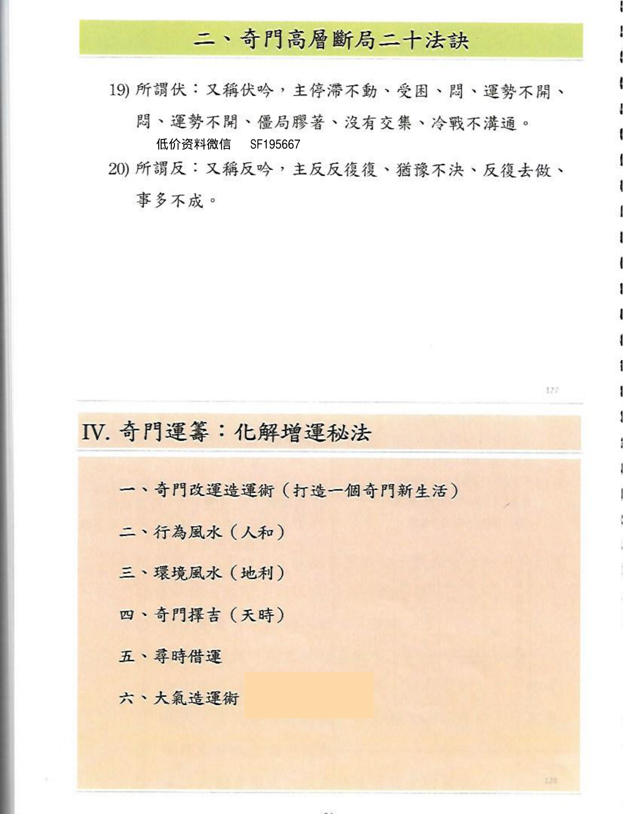

> **🖼 圖像解讀**　｜　檢視狀態：✅ 已檢視
> - **類型**：文字頁／目錄（大師研究班投影片 127–128）
> - **內容**：斷局二十法訣最後兩項：伏又稱伏吟，主停滯不動、受困、悶、運勢不開、僵局膠著、沒有交集、冷戰不溝通；反又稱反吟，主反反復復、猶豫不決、反復去做、事多不成。第 IV 部「奇門運籌：化解增運秘法」目錄：奇門改運造運術（打造一個奇門新生活）、行為風水（人和）、環境風水（地利）、奇門擇吉（天時）、尋時借運、大氣造運術（其後有一塊橘色塗蓋區）。
> - **原文出處（逐字）**：二、奇門高層斷局二十法訣（投影片 127）；IV. 奇門運籌：化解增運秘法（投影片 128）
> - **可檢索關鍵字**：伏吟停滯, 冷戰不溝通, 反吟反覆, 猶豫不決, 奇門運籌, 化解增運, 行為風水, 環境風水

**📝 逐字謄寫（第 185 頁）**

### 二、奇門高層斷局二十法訣（投影片 127）

19) 所謂伏：又稱伏吟，主停滯不動、受困、悶、運勢不開、悶、運勢不開、僵局膠著、沒有交集、冷戰不溝通。〔此處夾有轉售浮水印，略〕

20) 所謂反：又稱反吟，主反反復復、猶豫不決、反復去做、事多不成。

### IV. 奇門運籌：化解增運秘法（投影片 128）

一、奇門改運造運術（打造一個奇門新生活）
二、行為風水（人和）
三、環境風水（地利）
四、奇門擇吉（天時）
五、尋時借運
六、大氣造運術（其後有一塊橘色色塊塗蓋）

## 圖 186 — 第 186 頁（1240x1617）｜🖼 圖片（開圖判斷：圖表細看／裝飾照簡述）

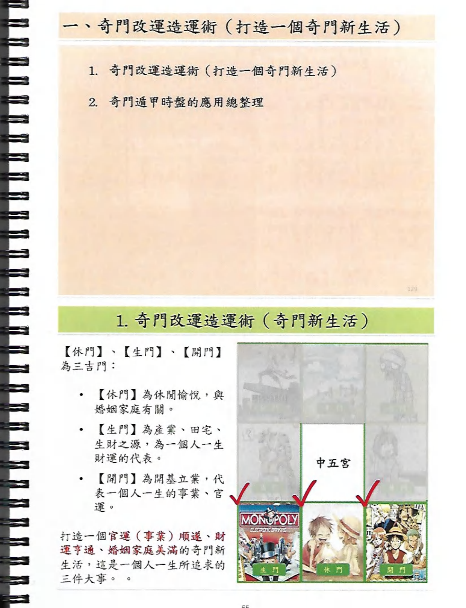

> **🖼 圖像解讀**　｜　檢視狀態：✅ 已檢視
> - **類型**：目錄＋圖文頁（大師研究班投影片 129–130）
> - **內容**：「一、奇門改運造運術（打造一個奇門新生活）」子目錄：奇門改運造運術（打造一個奇門新生活）、奇門遁甲時盤的應用總整理。投影片 130：休門、生門、開門為三吉門——休門休閒愉悅與婚姻家庭有關，生門為產業田宅生財之源代表一生財運，開門為開基立業代表一生事業官運；打造一個官運（事業）順遂、財運亨通、婚姻家庭美滿的奇門新生活，是人一生所追求的三件大事；右側八門圖卡中生門、休門、開門以紅勾標示。
> - **原文出處（逐字）**：一、奇門改運造運術（打造一個奇門新生活）；1. 奇門改運造運術（奇門新生活）
> - **可檢索關鍵字**：奇門改運造運術, 奇門新生活, 時盤應用, 三吉門, 休門婚姻, 生門財運, 開門事業, 人生三件大事

**📝 逐字謄寫（第 186 頁）**

### 一、奇門改運造運術（打造一個奇門新生活）（投影片 129）

1. 奇門改運造運術（打造一個奇門新生活）
2. 奇門遁甲時盤的應用總整理

### 1. 奇門改運造運術（奇門新生活）（投影片 130）

【休門】、【生門】、【開門】為三吉門：

- 【休門】為休閒愉悅，與婚姻家庭有關。
- 【生門】為產業、田宅、生財之源，為一個人一生財運的代表。
- 【開門】為開基立業，代表一個人一生的事業、官運。

打造一個**官運（事業）順遂**、**財運亨通**、**婚姻家庭美滿**的奇門新生活，這是一個人一生所追求的三件大事。

（右側八門圖卡中，生門、休門、開門以紅色勾號標示。頁碼：65）

## 圖 187 — 第 187 頁（1240x1617）｜🖼 圖片（開圖判斷：圖表細看／裝飾照簡述）

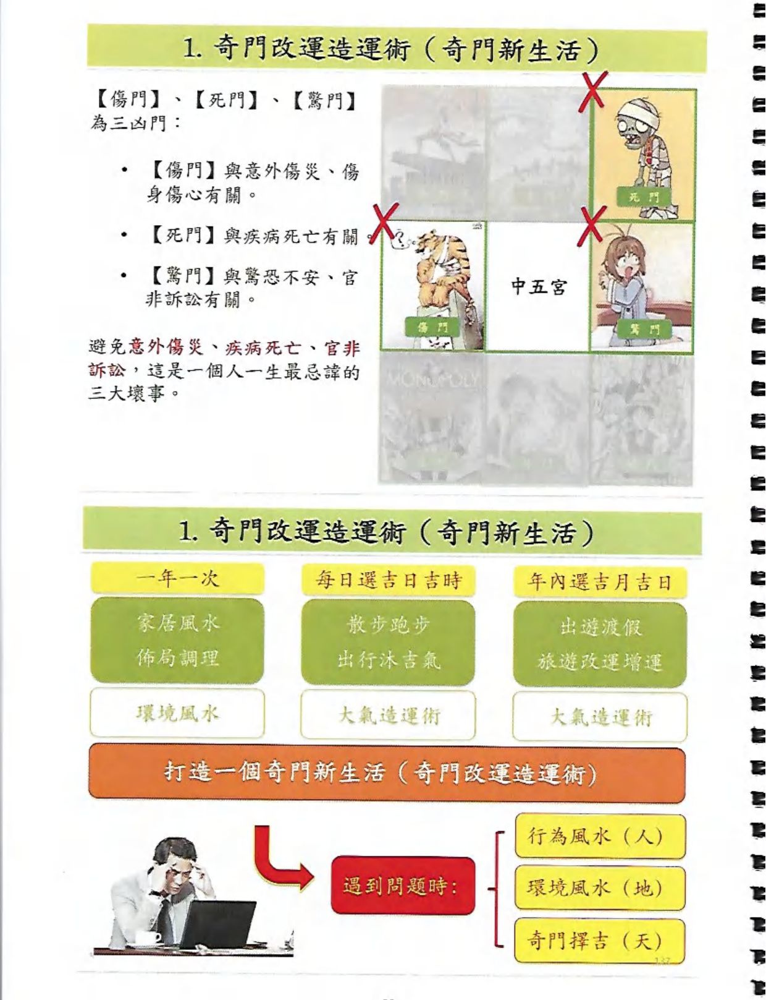

> **🖼 圖像解讀**　｜　檢視狀態：✅ 已檢視
> - **類型**：圖文頁＋流程圖（大師研究班投影片 131–132）
> - **內容**：三凶門：傷門（意外傷災、傷身傷心）、死門（疾病死亡）、驚門（驚恐不安、官非訴訟），避免意外傷災、疾病死亡、官非訴訟這一生最忌諱的三大壞事（八門圖卡中傷、死、驚門以紅叉標示）。「打造一個奇門新生活（奇門改運造運術）」架構圖：一年一次——家居風水佈局調理（環境風水）；每日選吉日吉時——散步跑步出行沐吉氣（大氣造運術）；年內選吉月吉日——出遊渡假旅遊改運增運（大氣造運術）；遇到問題時則從行為風水（人）、環境風水（地）、奇門擇吉（天）三方面處理。
> - **原文出處（逐字）**：1. 奇門改運造運術（奇門新生活）（投影片 131–132）
> - **可檢索關鍵字**：三凶門, 人生三大壞事, 奇門新生活, 家居風水佈局, 出行沐吉氣, 大氣造運術, 旅遊改運, 天地人化解

**📝 逐字謄寫（第 187 頁）**

### 1. 奇門改運造運術（奇門新生活）（投影片 131）

【傷門】、【死門】、【驚門】為三凶門：

- 【傷門】與意外傷災、傷身傷心有關。
- 【死門】與疾病死亡有關。
- 【驚門】與驚恐不安、官非訴訟有關。

避免**意外傷災、疾病死亡、官非訴訟**，這是一個人一生最忌諱的三大壞事。

（右側八門圖卡中，死門、傷門、驚門以紅色叉號標示。）

### 1. 奇門改運造運術（奇門新生活）（投影片 132）

| 一年一次 | 每日選吉日吉時 | 年內選吉月吉日 |
|---|---|---|
| 家居風水佈局調理 | 散步跑步、出行沐吉氣 | 出遊渡假、旅遊改運增運 |
| 環境風水 | 大氣造運術 | 大氣造運術 |

**打造一個奇門新生活（奇門改運造運術）**

（插圖：苦惱的上班族）→ **遇到問題時：**
- 行為風水（人）
- 環境風水（地）
- 奇門擇吉（天）

## 圖 188 — 第 188 頁（1240x1617）｜🖼 圖片（開圖判斷：圖表細看／裝飾照簡述）

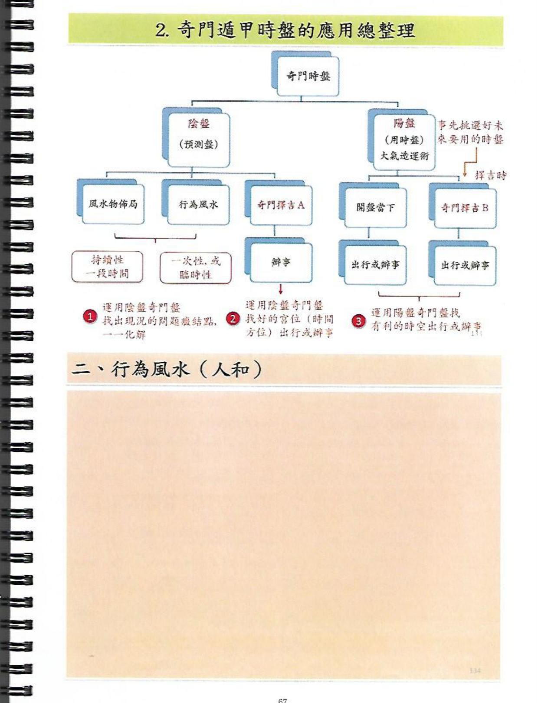

> **🖼 圖像解讀**　｜　檢視狀態：✅ 已檢視
> - **類型**：架構圖＋空白章節頁（大師研究班投影片 133–134）
> - **內容**：「2. 奇門遁甲時盤的應用總整理」架構圖：奇門時盤分陰盤（預測盤）與陽盤（用時盤、大氣造運術）。陰盤下分風水物佈局與行為風水（持續性一段時間／一次性或臨時性）、奇門擇吉 A（辦事）；陽盤下分開盤當下（出行或辦事）與奇門擇吉 B（事先挑選好未來要用的時盤、擇吉時，出行或辦事）。三種用法：① 運用陰盤找出現況的問題癥結點一一化解；② 運用陰盤找好的宮位（時間方位）出行或辦事；③ 運用陽盤找有利的時空出行或辦事。下半為「二、行為風水（人和）」章節標題頁，內容區空白。
> - **原文出處（逐字）**：2. 奇門遁甲時盤的應用總整理；二、行為風水（人和）
> - **可檢索關鍵字**：時盤應用, 陰盤預測盤, 陽盤用時盤, 風水物佈局, 行為風水, 奇門擇吉, 找癥結化解, 有利時空出行

**📝 逐字謄寫（第 188 頁）**

### 2. 奇門遁甲時盤的應用總整理（投影片 133）

**奇門時盤**
- **陰盤（預測盤）**
  - 風水物佈局 ─┐（持續性，一段時間）
  - 行為風水 ──┘（一次性，或臨時性）
  - 奇門擇吉 A → 辦事
- **陽盤（用時盤）大氣造運術**
  - 開盤當下 → 出行或辦事
  - 奇門擇吉 B（事先挑選好未來要用的時盤 → 擇吉時）→ 出行或辦事

① 運用陰盤奇門盤找出現況的問題癥結點，一一化解
② 運用陰盤奇門盤找好的宮位（時間方位）出行或辦事
③ 運用陽盤奇門盤找有利的時空出行或辦事

### 二、行為風水（人和）（投影片 134）

（章節標題頁，內容區為空白色塊。）

（頁碼：67）

## 圖 189 — 第 189 頁（1240x1617）｜🖼 圖片（開圖判斷：圖表細看／裝飾照簡述）

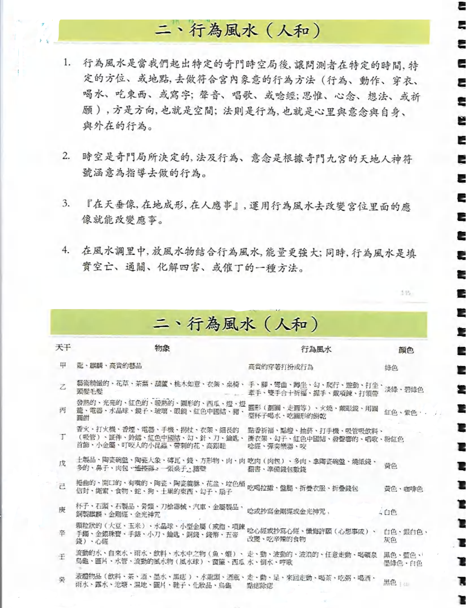

> **🖼 圖像解讀**　｜　檢視狀態：✅ 已檢視
> - **類型**：文字頁＋對照表（大師研究班投影片 135–136）
> - **內容**：「二、行為風水（人和）」：行為風水是起出特定奇門時空局後，讓問測者在特定時間、方位或地點，去做符合宮內象意的行為（行為動作、穿衣、喝水、吃東西、寫字；聲音唱歌唸經；思惟心念想法祈願）——方是空間、法是行為；時空由奇門局決定，法與意念依九宮天地人神符號涵意指導；「在天垂像、在地成形、在人應事」，以行為風水改變宮位應像就能改變應事；放風水物結合行為風水能量更強，行為風水也是填實空亡、通關、化解四害或催丁的方法。附十天干行為風水對照表（物象、行為風水、顏色），如甲高貴穿著打扮（綠色）、乙雙手合十祈福握手牽手（淡綠碧綠）、丙圓形火燒戴眼鏡（紅紫）、丁點香點燈唱歌唸經（粉紅）、戊吃肉拿陶瓷碗盤燒紙錢翻書數錢（黃）、己吃喝拉撒盤腿折疊（黃咖啡）、庚唸抄金剛經金光神咒（白）、辛唸抄心經懺悔許願吃辛辣（白銀白灰）、壬走動喝礦泉水倒水哼歌（黑藍墨綠白）、癸來回走動喝茶吃粥喝酒點痣除痣（黑）。
> - **原文出處（逐字）**：二、行為風水（人和）（投影片 135–136）
> - **可檢索關鍵字**：行為風水, 人和, 在人應事, 填實空亡, 通關化解四害, 催丁, 天干行為對照, 風水顏色

**📝 逐字謄寫（第 189 頁）**

### 二、行為風水（人和）（投影片 135）

1. 行為風水是當我們起出特定的奇門時空局後, 讓問測者在特定的時間, 特定的方位、或地點, 去做符合宮內象意的行為方法（行為、動作、穿衣、喝水、吃東西、或寫字; 聲音、唱歌、或唸經; 思惟、心念、想法、或祈願）, 方是方向, 也就是空間; 法則是行為, 也就是心里與意念與自身、與外在的行為。
2. 時空是奇門局所決定的, 法及行為、意念是根據奇門九宮的天地人神符號涵意為指導去做的行為。
3. 『在天垂像, 在地成形, 在人應事』, 運用行為風水去改變宮位里面的應像就能改變應事。
4. 在風水調里中, 放風水物結合行為風水, 能量更強大; 同時, 行為風水是填實空亡、通關、化解四害、或催丁的一種方法。

### 二、行為風水（人和）（投影片 136）

| 天干 | 物象 | 行為風水 | 顏色 |
|---|---|---|---|
| 甲 | 龍、麒麟、高貴的藝品 | 高貴的穿著打扮或行為 | 綠色 |
| 乙 | 藝術精緻的、花草、茶葉、葫蘆、桃木如意、衣架、桌椅、頭髮毛髮 | 手、腳、彎曲、蹲坐、勾、爬行、遊動、打坐、牽手、雙手合十祈福、握手、戴項鍊、打領帶 | 淡綠、碧綠色 |
| 丙 | 發熱的、光亮的、紅色的、暖熱的、圓形的、西瓜、燈、燈籠、電器、水晶球、鏡子、玻璃、眼鏡、紅色中國結、豬、圓餅 | 圓形（劃圓、走圓等）、火燒、戴眼鏡、用圓型杯子喝水、吃圓形的餅乾 | 紅色、紫色 |
| 丁 | 香火、打火機、香煙、電器、手機、拐杖、衣架、細長的（吸管）、証件、鈴鐺、紅色中國結、勾、針、刀、鑰匙、首飾、小金屬、叮咬人的小昆蟲、帶刺的花、高跟鞋 | 點香祈福、點燈、抽菸、打手機、吸管吸飲料、掛衣架、勾子、紅色中國結、發聲響的、唱歌、唸經、彈奏樂器、咬 | 粉紅色 |
| 戊 | 土製品、陶瓷碗盤、陶瓷人象、磚瓦、錢、方形物、肉、肉多的、鼻子、肉包、~~遙控器~~、一張桌子、牆壁（「遙控器」有手寫刪除線） | 吃肉（肉包）、多肉、拿陶瓷碗盤、燒紙錢、翻書、準備錢包數錢 | 黃色 |
| 己 | 捲曲的、開口的、有嘴的、陶瓷、陶瓷貔貅、花盆、垃圾桶、信封、繩索、食物、蛇、狗、土里的東西、勾子、扇子 | 吃喝拉撒、盤腿、折疊衣服、折疊錢包 | 黃色、咖啡色 |
| 庚 | 杯子、石頭、石製品、骨類、刀槍器械、汽車、金屬製品、銅製麒麟、金剛經、金光神咒 | 唸或抄寫金剛經或金光神咒、 | 白色 |
| 辛 | 顆粒狀的（大豆、玉米）、水晶球、小型金屬（戒指、項鍊手鐲、金銀珠寶、手錶、小刀、鑰匙、銅錢、錢幣、五帝錢）、心經 | 唸心經或抄寫心經、懺悔許願（心想事成）、改變、吃辛辣的食物 | 白色、銀白色、灰色 |
| 壬 | 流動的水、自來水、雨水、飲料、水水中之物（魚、蝦）、烏龜、圖片、水管、流動的風水物（風水球）、窗簾、西瓜 | 走、動、波動的、波浪的、任意走動、喝礦泉水、倒水、哼歌 | 黑色、藍色、墨綠色、白色 |
| 癸 | 液體物品（飲料、茶、酒、墨水、黑痣）、水龍頭、酒瓶、雨水、露水、池塘、濕地、圖片、鞋子、化妝品、烏龜 | 走、動、足、來回走動、喝茶、吃粥、喝酒、點痣除痣 | 黑色 |

（「垃圾桶」原文印作「垃色桶」，依上下文校讀。）

## 圖 190 — 第 190 頁（1240x1617）｜🖼 圖片（開圖判斷：圖表細看／裝飾照簡述）

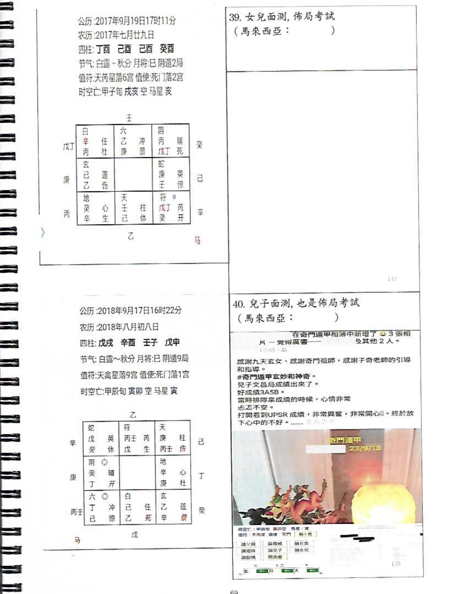

> **🖼 圖像解讀**　｜　檢視狀態：✅ 已檢視
> - **類型**：案例奇門盤＋社群貼文截圖（大師研究班投影片 137–138）
> - **內容**：佈局考試案例。案例 39「女兒面測，佈局考試（馬來西亞）」：盤為公曆2017年9月19日17時11分，四柱丁酉、己酉、己酉、癸酉，陰遁2局，值符天芮星落6宮、值使死門落2宮，甲子旬戌亥空、馬星亥（右欄空白）。案例 40「兒子面測，也是佈局考試（馬來西亞）」：盤為公曆2018年9月17日16時22分，四柱戊戌、辛酉、壬子、戊申，陰遁9局，值符天禽星落9宮、值使死門落1宮，甲辰旬寅卯空、馬星寅；右欄貼一則社群貼文截圖（家長感謝子奇老師指導，兒子「文昌局」後 UPSR 考試取得 3A5B），附一張擺放龍形擺件與鹽燈的佈局照片（標「奇門遁甲 23/9/18」）及排盤 App 局部截圖。
> - **原文出處（逐字）**：39. 女兒面測，佈局考試；40. 兒子面測，也是佈局考試
> - **可檢索關鍵字**：佈局考試, 文昌局, 考試佈局案例, UPSR成績, 陰遁二局, 陰遁九局, 風水佈局照片, 學員回饋

**📝 逐字謄寫（第 190 頁）**

### 案例 39（投影片 137）

**39. 女兒面測, 佈局考試（馬來西亞：　　）**

（右側練習欄空白）

公历:2017年9月19日17时11分
农历:2017年七月廿九日
四柱: 丁酉　己酉　己酉　癸酉
节气: 白露～秋分　月将:巳　阴遁2局
值符:天芮星落6宫　值使:死门落2宫
时空亡:甲子旬 戌亥空　马星 亥

| 巽 | 離 | 坤 |
|---|---|---|
| 白 辛 任 丙 杜 | 六 乙 冲 庚 景 | 阴 丙 辅 戊丁 死 |
| **震** | **中** | **兌** |
| 玄 己 蓬 乙 伤 | | 蛇 庚 英 壬 惊 |
| **艮** | **坎** | **乾** |
| 地 癸 心 辛 生 | 天 壬 柱 己 休 | 符 ◦ 戊丁 芮 癸 开 |

盤外引干：上（離）壬；左（巽／震／艮）戊丁／庚／丙；右（坤／兌／乾）癸／己／辛；下（坎）乙；乾宮外標「马」。乾宮有空亡點。

### 案例 40（投影片 138）

**40. 兒子面測, 也是佈局考試（馬來西亞：　　）**

公历:2018年9月17日16时22分
农历:2018年八月初八日
四柱: 戊戌　辛酉　壬子　戊申
节气: 白露～秋分　月将:巳　阴遁9局
值符:天禽星落9宫　值使:死门落1宫
时空亡:甲辰旬 寅卯空　马星 寅

| 巽 | 離 | 坤 |
|---|---|---|
| 蛇 戊 英 癸 休 | 符 丙壬 芮 戊 生 | 天 庚 柱 丙壬 伤 |
| **震** | **中** | **兌** |
| 阴 ◎ 癸 辅 丁 开 | | 地 辛 心 庚 杜 |
| **艮** | **坎** | **乾** |
| 六 ◎ 丁 冲 己 惊 | 白 己 任 乙 死 | 玄 乙 蓬 辛 景 |

盤外引干：上（離）乙；左（巽／震／艮）辛／庚／丙壬；右（坤／兌／乾）己／丁／癸；下（坎）戊；艮宮外左下標「马」。震、艮兩宮有空亡圈。

右欄社群貼文截圖（發文者姓名已模糊）：

> 在奇門遁甲相簿中新增了 3 張相片 — 覺得厲害 — 及其他 2 人。
> 感謝九天玄女、感謝奇門祖師，感謝子奇老師的引導和指導。
> #奇門遁甲玄妙和神奇。
> 兒子文昌局成績出來了。
> 好成績3A5B。
> 當時排隊拿成績的時候，心情非常忐忑不安。
> 打開看到UPSR成績，非常興奮，非常開心。終於放下心中的不好。……（查看更多）

（貼文附圖：擺放龍形擺件與鹽燈的佈局照片，標「奇門遁甲 23/9/18」；下方為排盤 App 截圖局部，部分資訊已塗黑。）

（頁碼：69）

## 圖 191 — 第 191 頁（1240x1617）｜🖼 圖片（開圖判斷：圖表細看／裝飾照簡述）

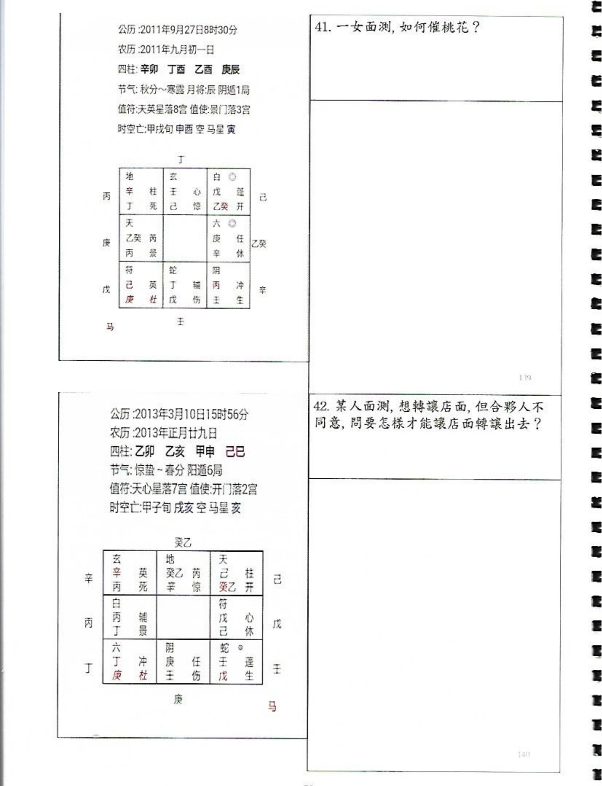

> **🖼 圖像解讀**　｜　檢視狀態：✅ 已檢視
> - **類型**：案例奇門盤＋練習欄（大師研究班投影片 139–140）
> - **內容**：佈局化解案例（右欄練習空白）。案例 41「一女面測，如何催桃花？」：盤為公曆2011年9月27日8時30分，四柱辛卯、丁酉、乙酉、庚辰，陰遁1局，值符天英星落8宮、值使景門落3宮，甲戌旬申酉空、馬星寅。案例 42「某人面測，想轉讓店面，但合夥人不同意，問要怎樣才能讓店面轉讓出去？」：盤為公曆2013年3月10日15時56分，四柱乙卯、乙亥、甲申、己巳，陽遁6局，值符天心星落7宮、值使開門落2宮，甲子旬戌亥空、馬星亥。
> - **原文出處（逐字）**：41. 一女面測，如何催桃花？；42. 某人面測，想轉讓店面，但合夥人不同意…
> - **可檢索關鍵字**：催桃花, 佈局案例, 店面轉讓, 合夥人不同意, 陰遁一局, 陽遁六局, 化解佈局, 練習盤

**📝 逐字謄寫（第 191 頁）**

### 案例 41（投影片 139）

**41. 一女面測, 如何催桃花？**

（右側練習欄空白）

公历:2011年9月27日8时30分
农历:2011年九月初一日
四柱: 辛卯　丁酉　乙酉　庚辰
节气: 秋分～寒露　月将:辰　阴遁1局
值符:天英星落8宫　值使:景门落3宫
时空亡:甲戌旬 申酉空　马星 寅

| 巽 | 離 | 坤 |
|---|---|---|
| 地 辛 柱 丁 死 | 玄 壬 心 己 惊 | 白 ◎ 戊 蓬 乙癸 开 |
| **震** | **中** | **兌** |
| 天 乙癸 芮 丙 景 | | 六 ◎ 庚 任 辛 休 |
| **艮** | **坎** | **乾** |
| 符 己 英 庚 杜 | 蛇 丁 辅 戊 伤 | 阴 丙 冲 壬 生 |

盤外引干：上（離）丁；左（巽／震／艮）丙／庚／戊；右（坤／兌／乾）己／乙癸／辛；下（坎）壬；艮宮外左下標「马」。坤、兌兩宮有空亡圈。

### 案例 42（投影片 140）

**42. 某人面測, 想轉讓店面, 但合夥人不同意, 問要怎樣才能讓店面轉讓出去？**

（右側練習欄空白）

公历:2013年3月10日15时56分
农历:2013年正月廿九日
四柱: 乙卯　乙亥　甲申　己巳
节气: 惊蛰～春分　阳遁6局
值符:天心星落7宫　值使:开门落2宫
时空亡:甲子旬 戌亥空　马星 亥

| 巽 | 離 | 坤 |
|---|---|---|
| 玄 辛 英 丙 死 | 地 癸乙 芮 辛 惊 | 天 己 柱 癸乙 开 |
| **震** | **中** | **兌** |
| 白 丙 辅 丁 景 | | 符 戊 心 己 休 |
| **艮** | **坎** | **乾** |
| 六 丁 冲 庚 杜 | 阴 庚 任 壬 伤 | 蛇 ◦ 壬 蓬 戊 生 |

盤外引干：上（離）癸乙；左（巽／震／艮）辛／丙／丁；右（坤／兌／乾）己／戊／壬；下（坎）庚；乾宮外標「马」。乾宮有空亡點。（此盤頭未印月將。）

## 圖 192 — 第 192 頁（1240x1617）｜🖼 圖片（開圖判斷：圖表細看／裝飾照簡述）

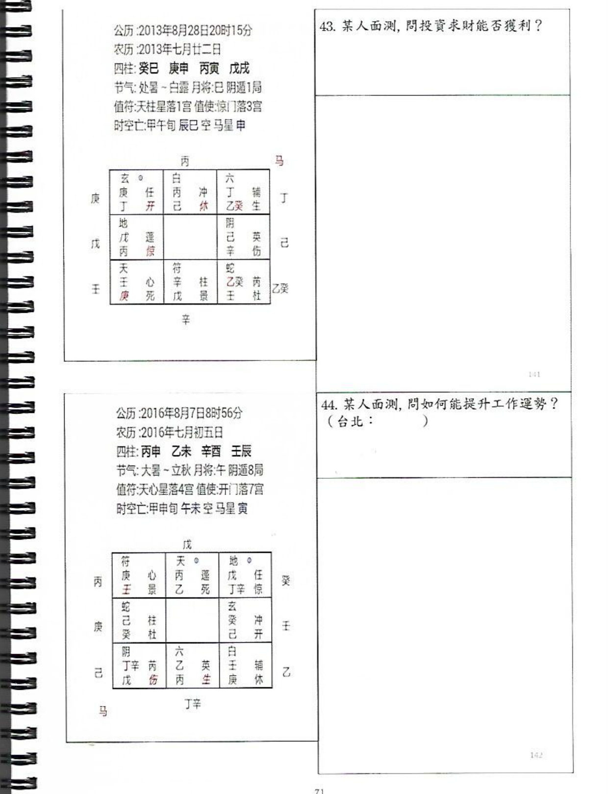

> **🖼 圖像解讀**　｜　檢視狀態：✅ 已檢視
> - **類型**：案例奇門盤＋練習欄（大師研究班投影片 141–142）
> - **內容**：佈局化解案例（右欄練習空白）。案例 43「某人面測，問投資求財能否獲利？」：盤為公曆2013年8月28日20時15分，四柱癸巳、庚申、丙寅、戊戌，陰遁1局，值符天柱星落1宮、值使驚門落3宮，甲午旬辰巳空、馬星申。案例 44「某人面測，問如何能提升工作運勢？（台北）」：盤為公曆2016年8月7日8時56分，四柱丙申、乙未、辛酉、壬辰，陰遁8局，值符天心星落4宮、值使開門落7宮，甲申旬午未空、馬星寅。
> - **原文出處（逐字）**：43. 某人面測，問投資求財能否獲利？；44. 某人面測，問如何能提升工作運勢？
> - **可檢索關鍵字**：投資求財, 提升工作運勢, 佈局案例, 陰遁一局, 陰遁八局, 練習盤, 開門落兌, 求財獲利

**📝 逐字謄寫（第 192 頁）**

### 案例 43（投影片 141）

**43. 某人面測, 問投資求財能否獲利？**

（右側練習欄空白）

公历:2013年8月28日20时15分
农历:2013年七月廿二日
四柱: 癸巳　庚申　丙寅　戊戌
节气: 处暑～白露　月将:巳　阴遁1局
值符:天柱星落1宫　值使:惊门落3宫
时空亡:甲午旬 辰巳空　马星 申

| 巽 | 離 | 坤 |
|---|---|---|
| 玄 ◦ 庚 任 丁 开 | 白 丙 冲 己 休 | 六 丁 辅 乙癸 生 |
| **震** | **中** | **兌** |
| 地 戊 蓬 丙 惊 | | 阴 己 英 辛 伤 |
| **艮** | **坎** | **乾** |
| 天 壬 心 庚 死 | 符 辛 柱 戊 景 | 蛇 乙癸 芮 壬 杜 |

盤外引干：上（離）丙；左（巽／震／艮）庚／戊／壬；右（坤／兌／乾）丁／己／乙癸；下（坎）辛；坤宮外標「马」。巽宮有空亡點。

### 案例 44（投影片 142）

**44. 某人面測, 問如何能提升工作運勢？（台北：　　）**

（右側練習欄空白）

公历:2016年8月7日8时56分
农历:2016年七月初五日
四柱: 丙申　乙未　辛酉　壬辰
节气: 大暑～立秋　月将:午　阴遁8局
值符:天心星落4宫　值使:开门落7宫
时空亡:甲申旬 午未空　马星 寅

| 巽 | 離 | 坤 |
|---|---|---|
| 符 庚 心 壬 景 | 天 ◦ 丙 蓬 乙 死 | 地 ◦ 戊 任 丁辛 惊 |
| **震** | **中** | **兌** |
| 蛇 己 柱 癸 杜 | | 玄 癸 冲 己 开 |
| **艮** | **坎** | **乾** |
| 阴 丁辛 芮 戊 伤 | 六 乙 英 丙 生 | 白 壬 辅 庚 休 |

盤外引干：上（離）戊；左（巽／震／艮）丙／庚／己；右（坤／兌／乾）癸／壬／乙；下（坎）丁辛；艮宮外左下標「马」。離、坤兩宮有空亡點。

（頁碼：71）

## 圖 193 — 第 193 頁（1240x1617）｜🖼 圖片（開圖判斷：圖表細看／裝飾照簡述）

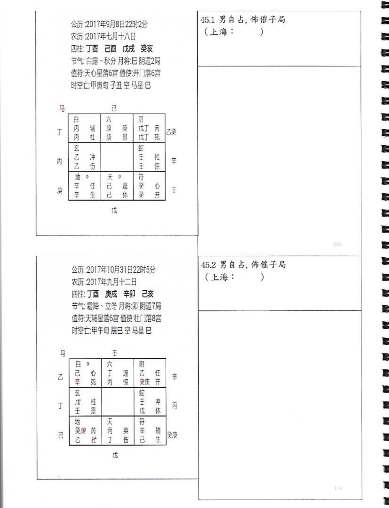

> **🖼 圖像解讀**　｜　檢視狀態：✅ 已檢視
> - **類型**：案例奇門盤＋練習欄（大師研究班投影片 143–144）
> - **內容**：「男自占，佈催子局（上海）」前後兩盤（右欄練習空白）。案例 45.1：盤為公曆2017年9月8日22時2分，四柱丁酉、己酉、戊戌、癸亥，陰遁2局，值符天心星落6宮、值使開門落6宮，甲寅旬子丑空、馬星巳（天地盤干各宮相同，為伏吟盤）。案例 45.2：盤同案例 10（2017年10月31日22時5分陰遁7局）。
> - **原文出處（逐字）**：45.1 男自占，佈催子局；45.2 男自占，佈催子局
> - **可檢索關鍵字**：催子局, 佈局求子, 伏吟盤, 陰遁二局, 陰遁七局, 前後兩次起盤, 練習盤

**📝 逐字謄寫（第 193 頁）**

### 案例 45.1（投影片 143）

**45.1 男自占, 佈催子局（上海：　　）**

（右側練習欄空白）

公历:2017年9月8日22时2分
农历:2017年七月十八日
四柱: 丁酉　己酉　戊戌　癸亥
节气: 白露～秋分　月将:巳　阴遁2局
值符:天心星落6宫　值使:开门落6宫
时空亡:甲寅旬 子丑空　马星 巳

| 巽 | 離 | 坤 |
|---|---|---|
| 白 丙 辅 丙 杜 | 六 庚 英 庚 景 | 阴 戊丁 芮 戊丁 死 |
| **震** | **中** | **兌** |
| 玄 乙 冲 乙 伤 | | 蛇 壬 柱 壬 惊 |
| **艮** | **坎** | **乾** |
| 地 ◦ 辛 任 辛 生 | 天 ◦ 己 蓬 己 休 | 符 癸 心 癸 开 |

盤外引干：上（離）己；左（巽／震／艮）丁／丙／庚；右（坤／兌／乾）乙癸／辛／壬；下（坎）戊；巽宮外左上標「马」。艮、坎兩宮有空亡點。（各宮天盤干與地盤干相同、星門皆在原宮，為伏吟局。）

### 案例 45.2（投影片 144）

**45.2 男自占, 佈催子局（上海：　　）**

（右側練習欄空白）

（盤同第 144 頁案例 10：公历:2017年10月31日22时5分，四柱丁酉 庚戌 辛卯 己亥，阴遁7局，值符天辅星落6宫，值使杜门落8宫，甲午旬 辰巳空，马星巳；九宮內容與案例 10 相同。）

## 圖 194 — 第 194 頁（1240x1617）｜🖼 圖片（開圖判斷：圖表細看／裝飾照簡述）

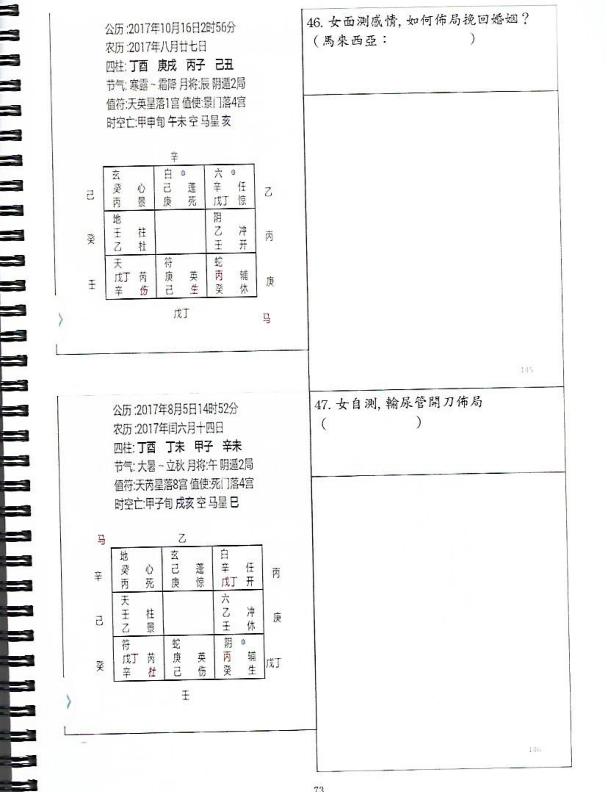

> **🖼 圖像解讀**　｜　檢視狀態：✅ 已檢視
> - **類型**：案例奇門盤＋練習欄（大師研究班投影片 145–146）
> - **內容**：佈局案例（右欄練習空白）。案例 46「女面測感情，如何佈局挽回婚姻？（馬來西亞）」：盤同案例 2（2017年10月16日2時56分陰遁2局）。案例 47「女自測，輸尿管開刀佈局」：盤為公曆2017年8月5日14時52分，四柱丁酉、丁未、甲子、辛未，陰遁2局，值符天芮星落8宮、值使死門落4宮，甲子旬戌亥空、馬星巳。
> - **原文出處（逐字）**：46. 女面測感情，如何佈局挽回婚姻？；47. 女自測，輸尿管開刀佈局
> - **可檢索關鍵字**：挽回婚姻佈局, 開刀佈局, 手術佈局, 健康佈局, 陰遁二局, 練習盤

**📝 逐字謄寫（第 194 頁）**

### 案例 46（投影片 145）

**46. 女面測感情, 如何佈局挽回婚姻？（馬來西亞：　　）**

（右側練習欄空白）

（盤同第 140 頁案例 2：公历:2017年10月16日2时56分，四柱丁酉 庚戌 丙子 己丑，阴遁2局，值符天英星落1宫，值使景门落4宫，甲申旬 午未空，马星亥；九宮內容與案例 2 相同。）

### 案例 47（投影片 146）

**47. 女自測, 輸尿管開刀佈局（　　）**

（右側練習欄空白）

公历:2017年8月5日14时52分
农历:2017年闰六月十四日
四柱: 丁酉　丁未　甲子　辛未
节气: 大暑～立秋　月将:午　阴遁2局
值符:天芮星落8宫　值使:死门落4宫
时空亡:甲子旬 戌亥空　马星 巳

| 巽 | 離 | 坤 |
|---|---|---|
| 地 癸 心 丙 死 | 玄 己 蓬 庚 惊 | 白 辛 任 戊丁 开 |
| **震** | **中** | **兌** |
| 天 壬 柱 乙 景 | | 六 乙 冲 壬 休 |
| **艮** | **坎** | **乾** |
| 符 戊丁 芮 辛 杜 | 蛇 庚 英 己 伤 | 阴 ◦ 丙 辅 癸 生 |

盤外引干：上（離）乙；左（巽／震／艮）辛／己／癸；右（坤／兌／乾）丙／庚／戊丁；下（坎）壬；巽宮外左上標「马」。乾宮有空亡點。

（頁碼：73）

## 圖 195 — 第 195 頁（1240x1617）｜🖼 圖片（開圖判斷：圖表細看／裝飾照簡述）

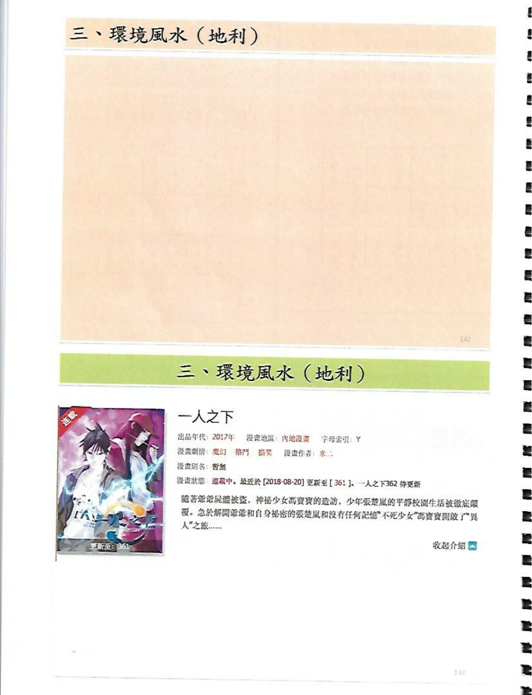

> **🖼 圖像解讀**　｜　檢視狀態：✅ 已檢視
> - **類型**：章節標題頁＋網頁截圖（大師研究班投影片 147–148）
> - **內容**：第三節「環境風水（地利）」章節標題頁（內容區空白）；接著以動漫作品《一人之下》作為引子：投影片 148 為該漫畫的網頁資料截圖（2017年、內地漫畫、魔幻格鬥搞笑、作者米二、連載中，並附一段劇情簡介——少年張楚嵐因爺爺遺體被盜與神秘少女馮寶寶出現，平靜生活被打亂，展開「異人」之旅）。
> - **原文出處（逐字）**：三、環境風水（地利）（投影片 147–148）
> - **可檢索關鍵字**：環境風水, 地利, 一人之下, 漫畫引子, 風后奇門, 異人, 章節標題

**📝 逐字謄寫（第 195 頁）**

### 三、環境風水（地利）（投影片 147）

（章節標題頁，內容區為空白色塊。）

### 三、環境風水（地利）（投影片 148）

（漫畫網頁資料截圖，封面圖標「連載」「更新至：361」）

- 作品名：一人之下
- 出品年代：2017年｜漫畫地區：內地漫畫｜字母索引：Y
- 漫畫劇情：魔幻、格鬥、搞笑｜漫畫作者：米二
- 漫畫別名：暫無
- 漫畫狀態：連載中。最近於 [2018-08-20] 更新至 [361]。一人之下362 待更新
- 劇情簡介（摘要）：少年張楚嵐因爺爺遺體被盜、神秘少女馮寶寶出現，平靜的校園生活被打亂，為解開爺爺與自身的秘密，和失去記憶的馮寶寶展開「異人」之旅。

（註：劇情簡介為網頁引文，此處以摘要方式記錄。）

## 圖 196 — 第 196 頁（1240x1617）｜🖼 圖片（開圖判斷：圖表細看／裝飾照簡述）

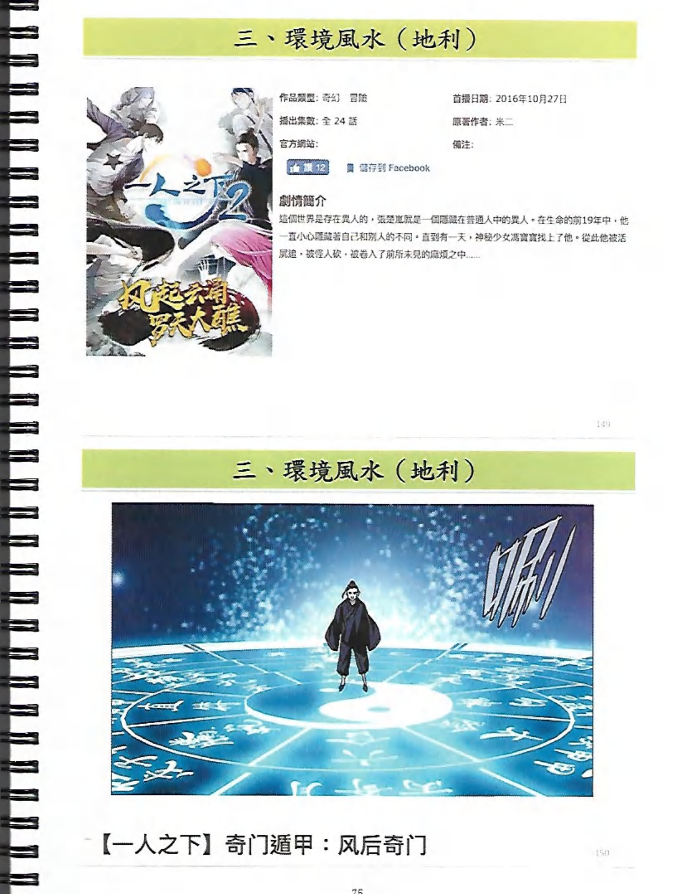

> **🖼 圖像解讀**　｜　檢視狀態：✅ 已檢視
> - **類型**：動畫資料截圖＋動畫畫面（大師研究班投影片 149–150）
> - **內容**：續以《一人之下》作引子：投影片 149 為動畫第二季資料截圖（作品類型奇幻冒險、首播日期2016年10月27日、播出集數全24話、原著作者米二，附劇情簡介——世界存在異人，張楚嵐一直隱藏自己的不同，直到神秘少女馮寶寶找上他而被捲入麻煩），封面文字「一人之下2 風起云涌 群妖大醮」；投影片 150 為動畫畫面：一名人物站在發光的太極與八卦方位陣盤中央，標題「【一人之下】奇门遁甲：风后奇门」。
> - **原文出處（逐字）**：三、環境風水（地利）（投影片 149–150）
> - **可檢索關鍵字**：一人之下, 風后奇門, 動畫引子, 奇門陣盤, 太極八卦, 環境風水, 異人

**📝 逐字謄寫（第 196 頁）**

### 三、環境風水（地利）（投影片 149）

（動畫資料截圖，封面文字「一人之下 2」「風起雲涌 群妖大醮」）

- 作品類型：奇幻　冒險｜首播日期：2016年10月27日
- 播出集數：全 24 話｜原著作者：米二
- 官方網站：（空白）｜備註：（空白）
- 劇情簡介（摘要）：這個世界存在「異人」，張楚嵐一直小心隱藏自己與別人的不同，直到神秘少女馮寶寶找上他，從此被捲入前所未見的麻煩之中。

（註：劇情簡介為網頁引文，此處以摘要方式記錄。）

### 三、環境風水（地利）（投影片 150）

（動畫畫面：一名身穿黑衣的人物站在發光的太極圖與八卦方位文字構成的圓形陣盤中央，右上有擬聲字）

**【一人之下】奇门遁甲：风后奇门**

（頁碼：75）

## 圖 197 — 第 197 頁（1240x1617）｜🖼 圖片（開圖判斷：圖表細看／裝飾照簡述）

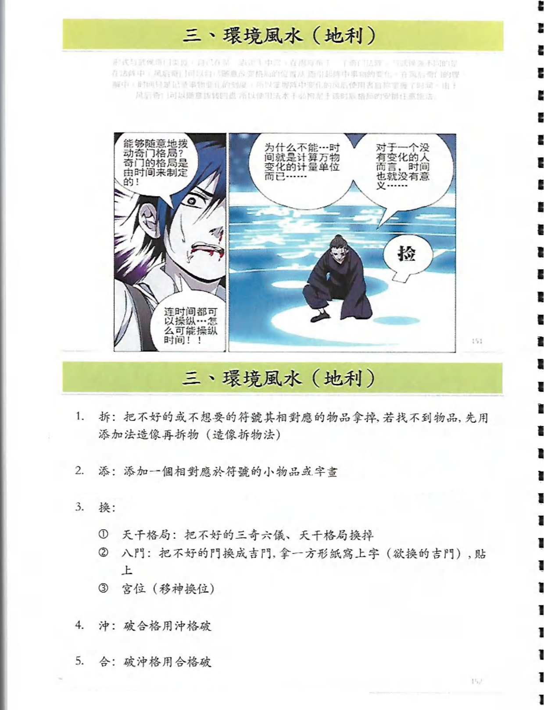

> **🖼 圖像解讀**　｜　檢視狀態：✅ 已檢視
> - **類型**：漫畫截圖＋文字頁（大師研究班投影片 151–152）
> - **內容**：投影片 151 為《一人之下》漫畫兩格截圖（上方有一段淡色小字說明風后奇門的設定，掃描過淡無法辨識），畫面中一方驚訝對手能隨意撥動奇門格局、甚至操縱時間，另一方以「時間只是計算萬物變化的單位」回應並俯身「撿」起地上之物，借此引出「移動符號即可改變格局」的觀念。投影片 152 為環境風水五法：拆（把不好或不想要的符號相對應物品拿掉，找不到物品則先用添加法造像再拆物〔造像拆物法〕）、添（添加一個相對應於符號的小物品或字畫）、換（①天干格局：把不好的三奇六儀、天干格局換掉；②八門：把不好的門換成吉門，拿一方形紙寫上欲換的吉門貼上；③宮位：移神換位）、沖（破合格用沖格破）、合（破沖格用合格破）。
> - **原文出處（逐字）**：三、環境風水（地利）（投影片 151–152）
> - **可檢索關鍵字**：環境風水五法, 拆添換沖合, 造像拆物法, 換門, 移神換位, 沖格破合格, 合格破沖格, 風后奇門

**📝 逐字謄寫（第 197 頁）**

### 三、環境風水（地利）（投影片 151）

（上方一段淡色說明小字，掃描過淡，圖中未能辨識。）

（《一人之下》漫畫兩格截圖，對白為簡體：左格人物驚訝對方竟能隨意撥動奇門格局、連時間都可操縱；右格另一人物回答大意為「時間只是計算萬物變化的計量單位，對沒有變化的人而言時間沒有意義」，並俯身撿起地上之物〔擬聲字「撿」〕。）

（註：漫畫對白以摘要方式記錄。）

### 三、環境風水（地利）（投影片 152）

1. 拆：把不好的或不想要的符號其相對應的物品拿掉, 若找不到物品, 先用添加法造像再拆物（造像拆物法）
2. 添：添加一個相對應於符號的小物品或字畫
3. 換：
   - ① 天干格局：把不好的三奇六儀、天干格局換掉
   - ② 八門：把不好的門換成吉門, 拿一方形紙寫上字（欲換的吉門）, 貼上
   - ③ 宮位（移神換位）
4. 沖：破合格用沖格破
5. 合：破沖格用合格破

## 圖 198 — 第 198 頁（1240x1617）｜🖼 圖片（開圖判斷：圖表細看／裝飾照簡述）

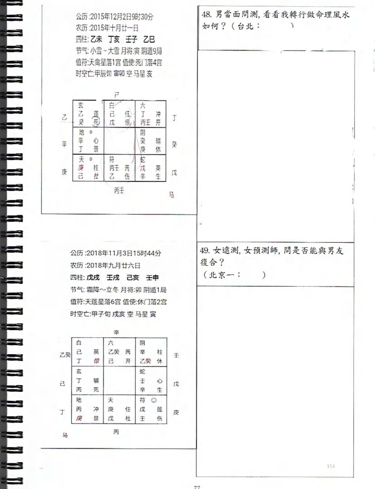

> **🖼 圖像解讀**　｜　檢視狀態：✅ 已檢視
> - **類型**：案例奇門盤＋練習欄（大師研究班投影片 153–154）
> - **內容**：環境風水佈局案例（右欄練習空白）。案例 48「男當面問測，看看我轉行做命理風水如何？（台北）」：盤同案例 19（2015年12月2日9時30分陰遁9局），盤上有紅筆手寫圈線（圈巽宮死門、離宮驚門等）。案例 49「女遠測，女預測師，問是否能與男友復合？（北京）」：盤為公曆2018年11月3日15時44分，四柱戊戌、壬戌、己亥、壬申，陰遁1局，值符天蓬星落6宮、值使休門落2宮，甲子旬戌亥空、馬星寅。
> - **原文出處（逐字）**：48. 男當面問測，看看我轉行做命理風水如何？；49. 女遠測，女預測師，問是否能與男友復合？
> - **可檢索關鍵字**：轉行命理風水, 復合, 感情佈局, 環境風水練習, 陰遁一局, 陰遁九局, 遠測

**📝 逐字謄寫（第 198 頁）**

### 案例 48（投影片 153）

**48. 男當面問測, 看看我轉行做命理風水如何？（台北：　　）**

（右側練習欄空白）

（盤同第 153 頁案例 19：公历:2015年12月2日9时30分，四柱乙未 丁亥 壬子 乙巳，阴遁9局，值符天禽星落1宫，值使死门落4宫，甲辰旬 寅卯空，马星亥；九宮內容與案例 19 相同。盤上有紅筆手寫圈線：圈巽宮「死」、離宮「惊」，並由離宮向下畫線經坎宮至乾宮。）

### 案例 49（投影片 154）

**49. 女遠測, 女預測師, 問是否能與男友復合？（北京一：　　）**

（右側練習欄空白）

公历:2018年11月3日15时44分
农历:2018年九月廿六日
四柱: 戊戌　壬戌　己亥　壬申
节气: 霜降～立冬　月将:卯　阴遁1局
值符:天蓬星落6宫　值使:休门落2宫
时空亡:甲子旬 戌亥空　马星 寅

| 巽 | 離 | 坤 |
|---|---|---|
| 白 己 英 丁 惊 | 六 乙癸 芮 己 开 | 阴 辛 柱 乙癸 休 |
| **震** | **中** | **兌** |
| 玄 丁 辅 丙 死 | | 蛇 壬 心 辛 生 |
| **艮** | **坎** | **乾** |
| 地 丙 冲 庚 景 | 天 庚 任 戊 杜 | 符 ◎ 戊 蓬 壬 伤 |

盤外引干：上（離）辛；左（巽／震／艮）乙癸／己／丁；右（坤／兌／乾）壬／戊／庚；下（坎）丙；艮宮外左下標「马」。乾宮有空亡圈。

（頁碼：77）

## 圖 199 — 第 199 頁（1240x1617）｜🖼 圖片（開圖判斷：圖表細看／裝飾照簡述）

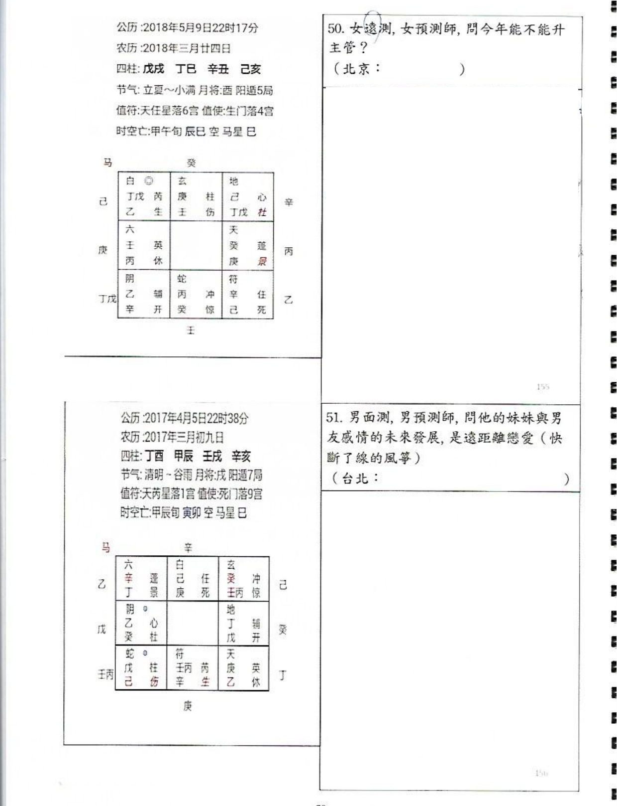

> **🖼 圖像解讀**　｜　檢視狀態：✅ 已檢視
> - **類型**：案例奇門盤＋練習欄（大師研究班投影片 155–156）
> - **內容**：環境風水佈局案例（右欄練習空白）。案例 50「女遠測，女預測師，問今年能不能升主管？（北京）」：盤為公曆2018年5月9日22時17分，四柱戊戌、丁巳、辛丑、己亥，陽遁5局，值符天任星落6宮、值使生門落4宮，甲午旬辰巳空、馬星巳。案例 51「男面測，男預測師，問他的妹妹與男友感情的未來發展，是遠距離戀愛（快斷了線的風箏）（台北）」：盤為公曆2017年4月5日22時38分，四柱丁酉、甲辰、壬戌、辛亥，陽遁7局，值符天芮星落1宮、值使死門落9宮，甲辰旬寅卯空、馬星巳。
> - **原文出處（逐字）**：50. 女遠測，女預測師，問今年能不能升主管？；51. 男面測…問他的妹妹與男友感情的未來發展…
> - **可檢索關鍵字**：升主管, 遠距離戀愛, 斷線風箏, 感情佈局, 陽遁五局, 陽遁七局, 環境風水練習

**📝 逐字謄寫（第 199 頁）**

### 案例 50（投影片 155）

**50. 女遠測, 女預測師, 問今年能不能升主管？（北京：　　）**

（右側練習欄空白）

公历:2018年5月9日22时17分
农历:2018年三月廿四日
四柱: 戊戌　丁巳　辛丑　己亥
节气: 立夏～小满　月将:酉　阳遁5局
值符:天任星落6宫　值使:生门落4宫
时空亡:甲午旬 辰巳空　马星 巳

| 巽 | 離 | 坤 |
|---|---|---|
| 白 ◎ 丁戊 芮 乙 生 | 玄 庚 柱 壬 伤 | 地 己 心 丁戊 杜 |
| **震** | **中** | **兌** |
| 六 壬 英 丙 休 | | 天 癸 蓬 庚 景 |
| **艮** | **坎** | **乾** |
| 阴 乙 辅 辛 开 | 蛇 丙 冲 癸 惊 | 符 辛 任 己 死 |

盤外引干：上（離）癸；左（巽／震／艮）己／庚／丁戊；右（坤／兌／乾）辛／丙／乙；下（坎）壬；巽宮外左上標「马」。巽宮有空亡圈。

### 案例 51（投影片 156）

**51. 男面測, 男預測師, 問他的妹妹與男友感情的未來發展, 是遠距離戀愛（快斷了線的風箏）（台北：　　）**

（右側練習欄空白）

公历:2017年4月5日22时38分
农历:2017年三月初九日
四柱: 丁酉　甲辰　壬戌　辛亥
节气: 清明～谷雨　月将:戌　阳遁7局
值符:天芮星落1宫　值使:死门落9宫
时空亡:甲辰旬 寅卯空　马星 巳

| 巽 | 離 | 坤 |
|---|---|---|
| 六 辛 蓬 丁 景 | 白 己 任 庚 死 | 玄 癸 冲 壬丙 惊 |
| **震** | **中** | **兌** |
| 阴 ◦ 乙 心 癸 杜 | | 地 丁 辅 戊 开 |
| **艮** | **坎** | **乾** |
| 蛇 ◦ 戊 柱 己 伤 | 符 壬丙 芮 辛 生 | 天 庚 英 乙 休 |

盤外引干：上（離）辛；左（巽／震／艮）乙／戊／壬丙；右（坤／兌／乾）己／癸／丁；下（坎）庚；巽宮外左上標「马」。震、艮兩宮有空亡點。

## 圖 200 — 第 200 頁（1240x1617）｜🖼 圖片（開圖判斷：圖表細看／裝飾照簡述）

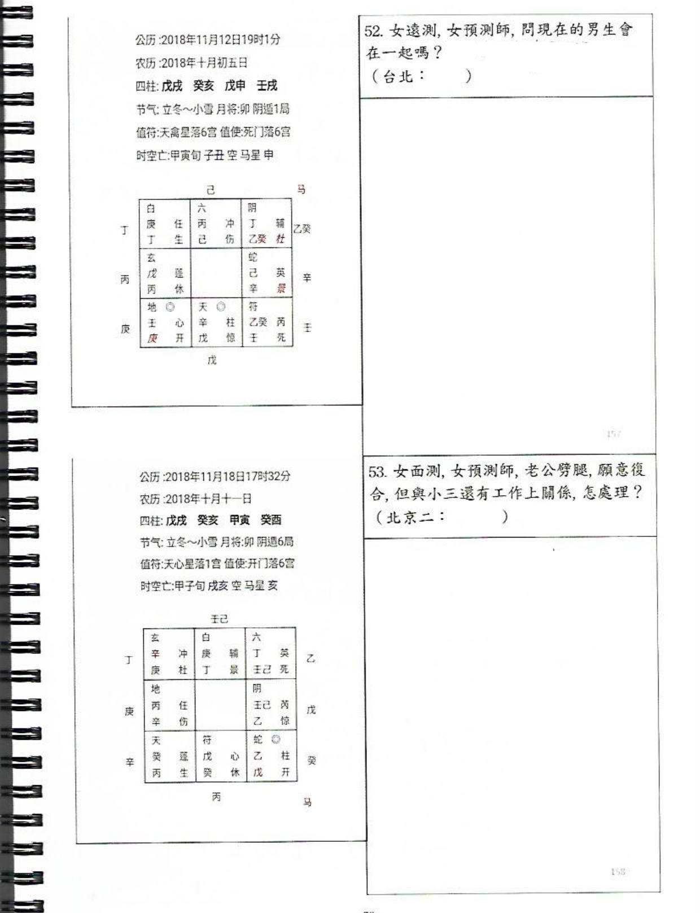

> **🖼 圖像解讀**　｜　檢視狀態：✅ 已檢視
> - **類型**：案例奇門盤＋練習欄（大師研究班投影片 157–158）
> - **內容**：環境風水佈局案例（右欄練習空白）。案例 52「女遠測，女預測師，問現在的男生會在一起嗎？（台北）」：盤同案例 3（2018年11月12日19時1分陰遁1局）。案例 53「女面測，女預測師，老公劈腿，願意復合，但與小三還有工作上關係，怎處理？（北京二）」：盤為公曆2018年11月18日17時32分，四柱戊戌、癸亥、甲寅、癸酉，陰遁6局，值符天心星落1宮、值使開門落6宮，甲子旬戌亥空、馬星亥。
> - **原文出處（逐字）**：52. 女遠測，女預測師，問現在的男生會在一起嗎？；53. 女面測，女預測師，老公劈腿，願意復合，但與小三還有工作上關係，怎處理？
> - **可檢索關鍵字**：劈腿復合, 小三, 感情佈局, 婚姻處理, 陰遁六局, 陰遁一局, 環境風水練習

**📝 逐字謄寫（第 200 頁）**

### 案例 52（投影片 157）

**52. 女遠測, 女預測師, 問現在的男生會在一起嗎？（台北：　　）**

（右側練習欄空白）

（盤同第 141 頁案例 3：公历:2018年11月12日19时1分，四柱戊戌 癸亥 戊申 壬戌，阴遁1局，值符天禽星落6宫，值使死门落6宫，甲寅旬 子丑空，马星申；九宮內容與案例 3 相同。）

### 案例 53（投影片 158）

**53. 女面測, 女預測師, 老公劈腿, 願意復合, 但與小三還有工作上關係, 怎處理？（北京二：　　）**

（右側練習欄空白）

公历:2018年11月18日17时32分
农历:2018年十月十一日
四柱: 戊戌　癸亥　甲寅　癸酉
节气: 立冬～小雪　月将:卯　阴遁6局
值符:天心星落1宫　值使:开门落6宫
时空亡:甲子旬 戌亥空　马星 亥

| 巽 | 離 | 坤 |
|---|---|---|
| 玄 辛 冲 庚 杜 | 白 庚 辅 丁 景 | 六 丁 英 壬己 死 |
| **震** | **中** | **兌** |
| 地 丙 任 辛 伤 | | 阴 壬己 芮 乙 惊 |
| **艮** | **坎** | **乾** |
| 天 癸 蓬 丙 生 | 符 戊 心 癸 休 | 蛇 ◎ 乙 柱 戊 开 |

盤外引干：上（離）壬己；左（巽／震／艮）丁／庚／辛；右（坤／兌／乾）乙／戊／癸；下（坎）丙；乾宮外標「马」。乾宮有空亡圈。

## 圖 201 — 第 201 頁（1240x1617）｜🖼 圖片（開圖判斷：圖表細看／裝飾照簡述）

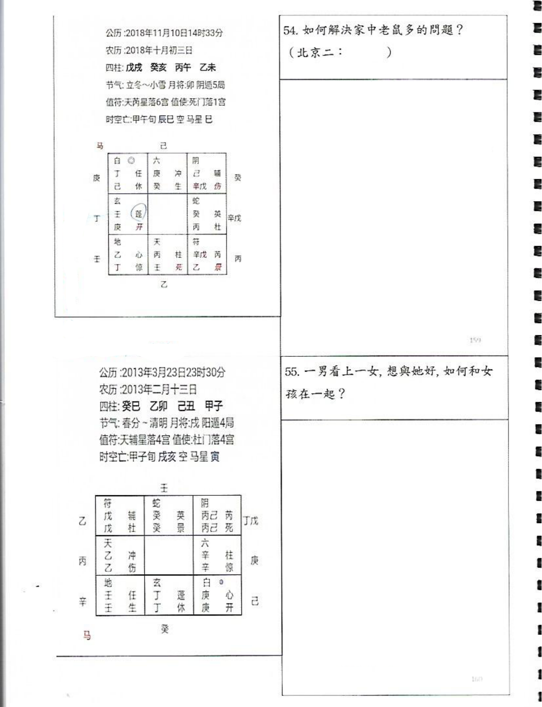

> **🖼 圖像解讀**　｜　檢視狀態：✅ 已檢視
> - **類型**：案例奇門盤＋練習欄（大師研究班投影片 159–160）
> - **內容**：環境風水佈局案例（右欄練習空白）。案例 54「如何解決家中老鼠多的問題？（北京二）」：盤為公曆2018年11月10日14時33分，四柱戊戌、癸亥、丙午、乙未，陰遁5局，值符天芮星落6宮、值使死門落1宮，甲午旬辰巳空、馬星巳（震宮天蓬有藍筆圈記）。案例 55「一男看上一女，想與她好，如何和女孩在一起？」：盤為公曆2013年3月23日23時30分，四柱癸巳、乙卯、己丑、甲子，陽遁4局，值符天輔星落4宮、值使杜門落4宮，甲子旬戌亥空、馬星寅（天地盤干各宮相同，為伏吟盤）。
> - **原文出處（逐字）**：54. 如何解決家中老鼠多的問題？；55. 一男看上一女，想與她好，如何和女孩在一起？
> - **可檢索關鍵字**：居家鼠患, 天蓬為鼠, 追求感情, 桃花佈局, 伏吟盤, 陰遁五局, 陽遁四局, 環境風水練習

**📝 逐字謄寫（第 201 頁）**

### 案例 54（投影片 159）

**54. 如何解決家中老鼠多的問題？（北京二：　　）**

（右側練習欄空白）

公历:2018年11月10日14时33分
农历:2018年十月初三日
四柱: 戊戌　癸亥　丙午　乙未
节气: 立冬～小雪　月将:卯　阴遁5局
值符:天芮星落6宫　值使:死门落1宫
时空亡:甲午旬 辰巳空　马星 巳

| 巽 | 離 | 坤 |
|---|---|---|
| 白 ◎ 丁 任 己 休 | 六 庚 冲 癸 生 | 阴 己 辅 辛戊 伤 |
| **震** | **中** | **兌** |
| 玄 壬 ⭕蓬 庚 开 | | 蛇 癸 英 丙 杜 |
| **艮** | **坎** | **乾** |
| 地 乙 心 丁 惊 | 天 丙 柱 壬 死 | 符 辛戊 芮 乙 景 |

盤外引干：上（離）己；左（巽／震／艮）庚／丁／壬；右（坤／兌／乾）癸／辛戊／丙；下（坎）乙；巽宮外左上標「马」。巽宮有空亡圈。（震宮「蓬」有藍筆手寫圈。）

### 案例 55（投影片 160）

**55. 一男看上一女, 想與她好, 如何和女孩在一起？**

（右側練習欄空白）

公历:2013年3月23日23时30分
农历:2013年二月十三日
四柱: 癸巳　乙卯　己丑　甲子
节气: 春分～清明　月将:戌　阳遁4局
值符:天辅星落4宫　值使:杜门落4宫
时空亡:甲子旬 戌亥空　马星 寅

| 巽 | 離 | 坤 |
|---|---|---|
| 符 戊 辅 戊 杜 | 蛇 癸 英 癸 景 | 阴 丙己 芮 丙己 死 |
| **震** | **中** | **兌** |
| 天 乙 冲 乙 伤 | | 六 辛 柱 辛 惊 |
| **艮** | **坎** | **乾** |
| 地 壬 任 壬 生 | 玄 丁 蓬 丁 休 | 白 ◦ 庚 心 庚 开 |

盤外引干：上（離）壬；左（巽／震／艮）乙／丙／辛；右（坤／兌／乾）丁戊／庚／己；下（坎）癸；艮宮外左下標「马」。乾宮有空亡點。（各宮天地盤干相同，為伏吟局。）

## 圖 202 — 第 202 頁（1240x1617）｜🖼 圖片（開圖判斷：圖表細看／裝飾照簡述）

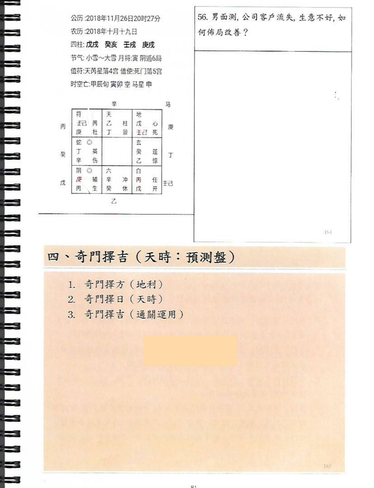

> **🖼 圖像解讀**　｜　檢視狀態：✅ 已檢視
> - **類型**：案例奇門盤＋目錄頁（大師研究班投影片 161–162）
> - **內容**：案例 56「男面測，公司客戶流失，生意不好，如何佈局改善？」（右欄練習空白）：盤為公曆2018年11月26日20時27分，四柱戊戌、癸亥、壬戌、庚戌，陰遁6局，值符天芮星落4宮、值使死門落5宮，甲辰旬寅卯空、馬星申。第四節「奇門擇吉（天時：預測盤）」目錄：奇門擇方（地利）、奇門擇日（天時）、奇門擇吉（通關運用），下方有一塊橘色塗蓋區。
> - **原文出處（逐字）**：56. 男面測，公司客戶流失，生意不好，如何佈局改善？；四、奇門擇吉（天時：預測盤）
> - **可檢索關鍵字**：客戶流失, 生意佈局, 陰遁六局, 奇門擇吉, 擇方地利, 擇日天時, 通關運用, 預測盤

**📝 逐字謄寫（第 202 頁）**

### 案例 56（投影片 161）

**56. 男面測, 公司客戶流失, 生意不好, 如何佈局改善？**

（右側練習欄空白）

公历:2018年11月26日20时27分
农历:2018年十月十九日
四柱: 戊戌　癸亥　壬戌　庚戌
节气: 小雪～大雪　月将:寅　阴遁6局
值符:天芮星落4宫　值使:死门落5宫
时空亡:甲辰旬 寅卯空　马星 申

| 巽 | 離 | 坤 |
|---|---|---|
| 符 壬己 芮 庚 杜 | 天 乙 柱 丁 景 | 地 戊 心 壬己 死 |
| **震** | **中** | **兌** |
| 蛇 ◎ 丁 英 辛 伤 | | 玄 癸 蓬 乙 惊 |
| **艮** | **坎** | **乾** |
| 阴 ◎ 庚 辅 丙 生 | 六 辛 冲 癸 休 | 白 丙 任 戊 开 |

盤外引干：上（離）辛；左（巽／震／艮）丙／癸／戊；右（坤／兌／乾）庚／丁／壬己；下（坎）乙；坤宮外標「马」。震、艮兩宮有空亡圈。

### 四、奇門擇吉（天時：預測盤）（投影片 162）

1. 奇門擇方（地利）
2. 奇門擇日（天時）
3. 奇門擇吉（通關運用）

（下方有一塊橘色色塊塗蓋。頁碼：81）

## 圖 203 — 第 203 頁（1240x1617）｜🖼 圖片（開圖判斷：圖表細看／裝飾照簡述）

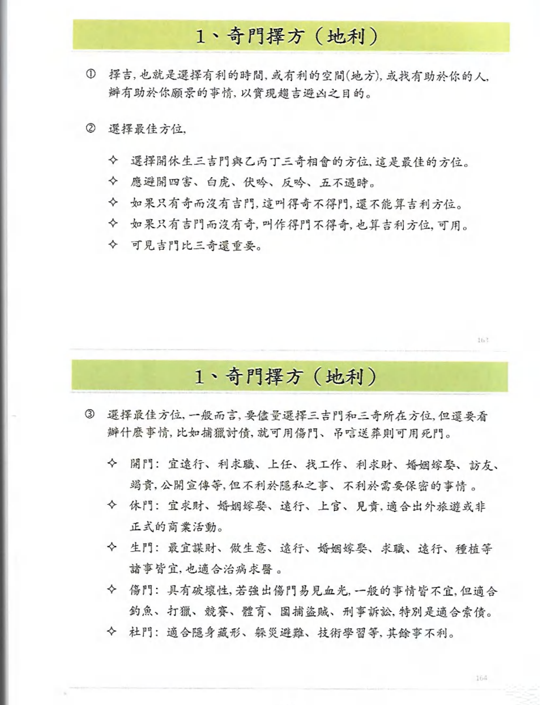

> **🖼 圖像解讀**　｜　檢視狀態：✅ 已檢視
> - **類型**：文字頁（大師研究班投影片 163–164）
> - **內容**：「1、奇門擇方（地利）」：擇吉即選擇有利的時間、空間（地方）或有助於你的人，辦有助於願景的事，以趨吉避凶。選最佳方位：開休生三吉門與乙丙丁三奇相會的方位最佳；應避開四害、白虎、伏吟、反吟、五不遇時；只有奇無吉門為得奇不得門，不算吉利方位；只有吉門無奇為得門不得奇，也算吉利可用；可見吉門比三奇重要。一般盡量選三吉門與三奇所在方位，但要看辦什麼事（如捕獵討債可用傷門、弔唁送葬可用死門）。各門宜忌：開門宜遠行、求職上任找工作、求財、婚姻嫁娶、訪友謁貴、公開宣傳，不利隱私保密之事；休門宜求財、婚嫁、遠行、上官見貴、出外旅遊或非正式商業活動；生門最宜謀財做生意、遠行、婚嫁、求職、種植，也適合治病求醫；傷門具破壞性、易見血光，一般事皆不宜，但適合釣魚打獵、競賽體育、圍捕盜賊、刑事訴訟，特別適合索債；杜門適合隱身藏形、躲災避難、技術學習，其餘不利。
> - **原文出處（逐字）**：1、奇門擇方（地利）（投影片 163–164）
> - **可檢索關鍵字**：奇門擇方, 地利, 三吉門三奇, 得奇不得門, 得門不得奇, 吉門比三奇重要, 五不遇時, 八門宜忌

**📝 逐字謄寫（第 203 頁）**

### 1、奇門擇方（地利）（投影片 163）

① 擇吉, 也就是選擇有利的時間, 或有利的空間(地方), 或找有助於你的人, 辦有助於你願景的事情, 以實現趨吉避凶之目的。

② 選擇最佳方位,
   - ✧ 選擇開休生三吉門與乙丙丁三奇相會的方位, 這是最佳的方位。
   - ✧ 應避開四害、白虎、伏吟、反吟、五不遇時。
   - ✧ 如果只有奇而沒有吉門, 這叫得奇不得門, 還不能算吉利方位。
   - ✧ 如果只有吉門而沒有奇, 叫作得門不得奇, 也算吉利方位, 可用。
   - ✧ 可見吉門比三奇還重要。

### 1、奇門擇方（地利）（投影片 164）

③ 選擇最佳方位, 一般而言, 要儘量選擇三吉門和三奇所在方位, 但還要看辦什麼事情, 比如捕獵討債, 就可用傷門、吊唁送葬則可用死門。
   - ✧ 開門：宜遠行、利求職、上任、找工作、利求財、婚姻嫁娶、訪友、謁貴, 公開宣傳等, 但不利於隱私之事、不利於需要保密的事情。
   - ✧ 休門：宜求財、婚姻嫁娶、遠行、上官、見貴, 適合出外旅遊或非正式的商業活動。
   - ✧ 生門：最宜謀財、做生意、遠行、婚姻嫁娶、求職、遠行、種植等諸事皆宜, 也適合治病求醫。
   - ✧ 傷門：具有破壞性, 若強出傷門易見血光, 一般的事情皆不宜, 但適合釣魚、打獵、競賽、體育、圍捕盜賊、刑事訴訟, 特別是適合索債。
   - ✧ 杜門：適合隱身藏形、躲災避難、技術學習等, 其餘事不利。

## 圖 204 — 第 204 頁（1240x1617）｜🖼 圖片（開圖判斷：圖表細看／裝飾照簡述）

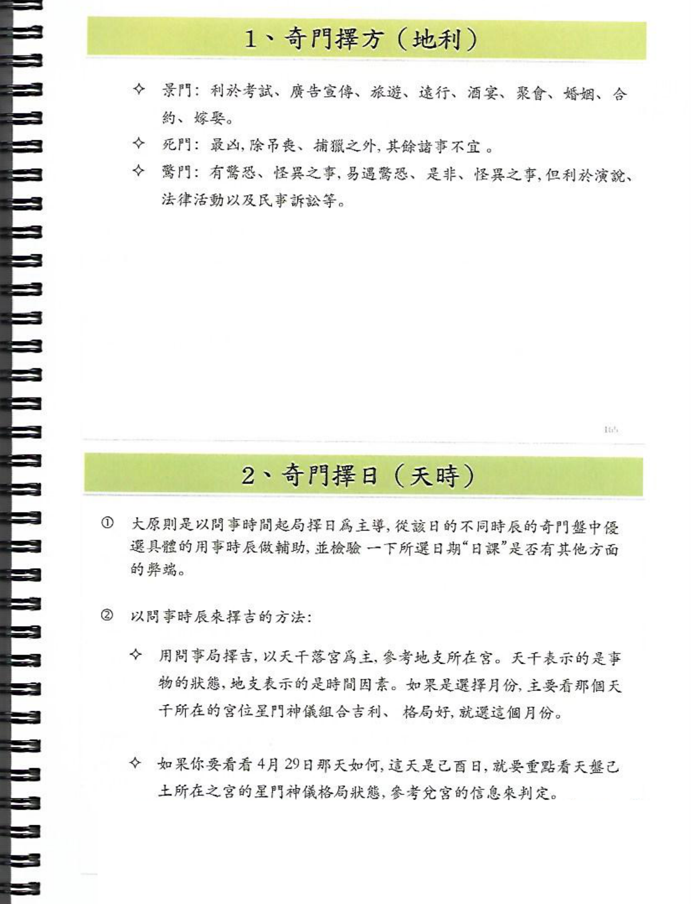

> **🖼 圖像解讀**　｜　檢視狀態：✅ 已檢視
> - **類型**：文字頁（大師研究班投影片 165–166）
> - **內容**：擇方各門宜忌續：景門利於考試、廣告宣傳、旅遊遠行、酒宴聚會、婚姻合約嫁娶；死門最凶，除弔喪、捕獵外諸事不宜；驚門有驚恐怪異之事、易遇是非，但利於演說、法律活動及民事訴訟。「2、奇門擇日（天時）」：大原則以問事時間起局擇日為主導，再從該日不同時辰的奇門盤優選具體用事時辰為輔，並檢驗所選「日課」有無其他弊端。以問事時辰擇吉：用問事局擇吉以天干落宮為主、參考地支所在宮——天干表示事物狀態、地支表示時間因素；選月份主要看該月天干所在宮星門神儀組合吉利、格局好即選；例如要看 4月29日己酉日，重點看天盤己土所在宮的星門神儀格局，參考兌宮（酉）信息判定。
> - **原文出處（逐字）**：1、奇門擇方（地利）（投影片 165）；2、奇門擇日（天時）（投影片 166）
> - **可檢索關鍵字**：景門考試, 死門最凶, 驚門訴訟演說, 奇門擇日, 日課, 問事局擇吉, 天干落宮為主, 地支參考

**📝 逐字謄寫（第 204 頁）**

### 1、奇門擇方（地利）（投影片 165）

- ✧ 景門：利於考試、廣告宣傳、旅遊、遠行、酒宴、聚會、婚姻、合約、嫁娶。
- ✧ 死門：最凶, 除吊喪、捕獵之外, 其餘諸事不宜。
- ✧ 驚門：有驚恐、怪異之事, 易遇驚恐、是非、怪異之事, 但利於演說、法律活動以及民事訴訟等。

### 2、奇門擇日（天時）（投影片 166）

① 大原則是以問事時間起局擇日爲主導, 從該日的不同時辰的奇門盤中優選具體的用事時辰做輔助, 並檢驗一下所選日期“日課”是否有其他方面的弊端。

② 以問事時辰來擇吉的方法:
   - ✧ 用問事局擇吉, 以天干落宮爲主, 參考地支所在宮。天干表示的是事物的狀態, 地支表示的是時間因素。如果是選擇月份, 主要看那個天干所在的宮位星門神儀組合吉利、格局好, 就選這個月份。
   - ✧ 如果你要看看 4月 29日那天如何, 這天是己酉日, 就要重點看天盤己土所在之宮的星門神儀格局狀態, 參考兌宮的信息來判定。

## 圖 205 — 第 205 頁（1240x1617）｜🖼 圖片（開圖判斷：圖表細看／裝飾照簡述）

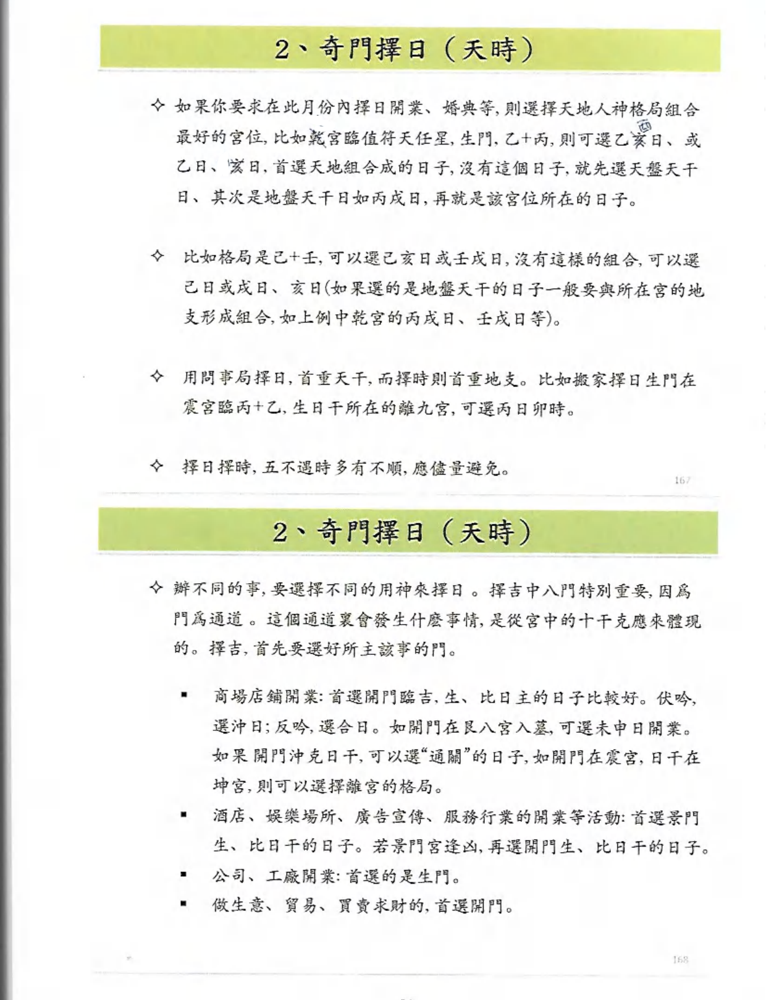

> **🖼 圖像解讀**　｜　檢視狀態：✅ 已檢視
> - **類型**：文字頁（大師研究班投影片 167–168）
> - **內容**：奇門擇日續：月份內擇日開業、婚典等，選天地人神格局組合最好的宮位，如乾宮臨值符天任星、生門、乙＋丙，可選乙亥日、或乙日、亥日——首選天地組合成的日子，其次天盤天干日，再次地盤天干日（如丙戌日），再就是該宮位所在的日子；如格局己＋壬可選己亥日或壬戌日，無此組合可選己日或戊日、亥日（選地盤天干日一般要與所在宮地支形成組合）；用問事局擇日首重天干、擇時首重地支（如搬家擇日生門在震宮臨丙＋乙，生日干所在的離九宮，可選丙日卯時）；五不遇時多有不順應盡量避免。辦不同事選不同用神擇日，擇吉中八門特別重要（門為通道）：商場店鋪開業首選開門臨吉、生比日主之日（伏吟選沖日、反吟選合日，如開門在艮八宮入墓可選未申日開業，開門沖剋日干可選通關之日）；酒店娛樂廣告服務業開業首選景門生比日干之日，景門宮逢凶再選開門；公司工廠開業首選生門；做生意貿易買賣求財首選開門。
> - **原文出處（逐字）**：2、奇門擇日（天時）（投影片 167–168）
> - **可檢索關鍵字**：奇門擇日, 開業擇日, 天地組合日, 擇日重天干擇時重地支, 五不遇時, 八門為通道, 開門開業, 生門工廠

**📝 逐字謄寫（第 205 頁）**

### 2、奇門擇日（天時）（投影片 167）

- ✧ 如果你要求在此月份內擇日開業、婚典等, 則選擇天地人神格局組合最好的宮位, 比如乾宮臨值符天任星, 生門, 乙+丙, 則可選乙亥日、或乙日、亥日, 首選天地組合成的日子, 沒有這個日子, 就先選天盤天干日、其次是地盤天干日如丙戌日, 再就是該宮位所在的日子。
  （「乾」「亥」等字旁有手寫修改痕跡，原印刷字依可辨識者錄入。）
- ✧ 比如格局是己+壬, 可以選己亥日或壬戌日, 沒有這樣的組合, 可以選己日或戌日、亥日(如果選的是地盤天干的日子一般要與所在宮的地支形成組合, 如上例中乾宮的丙戌日、壬戌日等)。
- ✧ 用問事局擇日, 首重天干, 而擇時則首重地支。比如搬家擇日生門在震宮臨丙+乙, 生日干所在的離九宮, 可選丙日卯時。
- ✧ 擇日擇時, 五不遇時多有不順, 應儘量避免。

### 2、奇門擇日（天時）（投影片 168）

- ✧ 辦不同的事, 要選擇不同的用神來擇日。擇吉中八門特別重要, 因爲門爲通道。這個通道裏會發生什麼事情, 是從宮中的十干克應來體現的。擇吉, 首先要選好所主該事的門。
  - ▪ 商場店鋪開業：首選開門臨吉、生、比日主的日子比較好。伏吟, 選沖日; 反吟, 選合日。如開門在艮八宮入墓, 可選未申日開業。如果開門沖克日干, 可以選“通關”的日子, 如開門在震宮, 日干在坤宮, 則可以選擇離宮的格局。
  - ▪ 酒店、娛樂場所、廣告宣傳、服務行業的開業等活動：首選景門生、比日干的日子。若景門宮逢凶, 再選開門生、比日干的日子。
  - ▪ 公司、工廠開業：首選的是生門。
  - ▪ 做生意、貿易、買賣求財的, 首選開門。

## 圖 206 — 第 206 頁（1240x1617）｜🖼 圖片（開圖判斷：圖表細看／裝飾照簡述）

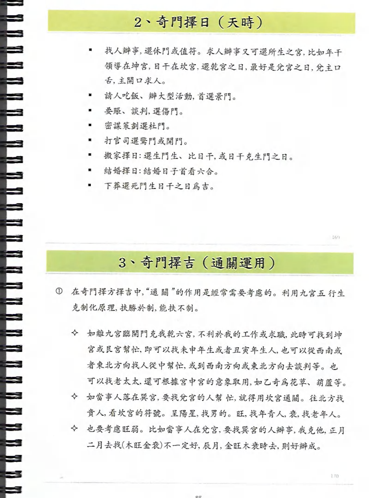

> **🖼 圖像解讀**　｜　檢視狀態：✅ 已檢視
> - **類型**：文字頁（大師研究班投影片 169–170，全檔最後一頁）
> - **內容**：擇日用門續：找人辦事選休門或值符，求人辦事可選所生之宮（如年干領導在坤宮、日干在坎宮，選乾宮之日，最好是兌宮之日，兌主口舌、主開口求人）；請人吃飯辦大型活動首選景門；要賬談判選傷門；密謀策劃選杜門；打官司選驚門或開門；搬家擇日選生門生比日干或日干剋生門之日；結婚擇日首看六合；下葬選死門生日干之日為吉。「3、奇門擇吉（通關運用）」：擇方擇吉常需考慮通關，利用九宮五行生剋制化「扶勝於制、能扶不制」——如離九宮臨開門剋我乾六宮不利工作求職，可找坤宮或艮宮（土）幫忙，即找未申年或丑寅年生人、往西南或東北方找人幫忙或去談判，也可找老太太，或依宮中意象取用（如乙奇為花草葫蘆）；當事人落巽宮要找兌宮的人幫忙須用坎宮通關，往北方找貴人並看坎宮符號（陽星找男、旺找年青人、衰找老年人）；也要考慮旺弱，如當事人在兌宮要找巽宮的人辦事（我剋他），正月二月（木旺金衰）不一定好，辰月金旺木衰時去則好辦成。
> - **原文出處（逐字）**：2、奇門擇日（天時）（投影片 169）；3、奇門擇吉（通關運用）（投影片 170）
> - **可檢索關鍵字**：擇日選門, 求人辦事, 要賬談判傷門, 結婚看六合, 奇門通關, 扶勝於制, 找貴人方位, 旺衰時機

**📝 逐字謄寫（第 206 頁）**

### 2、奇門擇日（天時）（投影片 169）

  - ▪ 找人辦事, 選休門或值符。求人辦事又可選所生之宮, 比如年干領導在坤宮, 日干在坎宮, 選乾宮之日, 最好是兌宮之日, 兌主口舌, 主開口求人。
  - ▪ 請人吃飯、辦大型活動, 首選景門。
  - ▪ 要賬、談判, 選傷門。
  - ▪ 密謀策劃選杜門。
  - ▪ 打官司選驚門或開門。
  - ▪ 搬家擇日：選生門生、比日干, 或日干克生門之日。
  - ▪ 結婚擇日：結婚日子首看六合。
  - ▪ 下葬選死門生日干之日爲吉。

### 3、奇門擇吉（通關運用）（投影片 170）

① 在奇門擇方擇吉中, “通關”的作用是經常需要考慮的。利用九宮五行生克制化原理, 扶勝於制, 能扶不制。
   - ✧ 如離九宮臨開門克我乾六宮, 不利於我的工作或求職, 此時可找到坤宮或艮宮幫忙, 即可以找未申年生或者丑寅年生人, 也可以從西南或者東北方向找人從中幫忙, 或到西南方向或東北方向去談判等。也可以找老太太, 還可根據宮中宮的意象取用, 如乙奇爲花草、葫蘆等。
   - ✧ 如當事人落在巽宮, 要找兌宮的人幫忙, 就得用坎宮通關。往北方找貴人, 看坎宮的符號。呈陽星, 找男的。旺, 找年青人, 衰, 找老年人。
   - ✧ 也要考慮旺弱。比如當事人在兌宮, 要找巽宮的人辦事, 我克他, 正月二月去找(木旺金衰)不一定好, 辰月, 金旺木衰時去, 則好辦成。

（頁碼：85。本頁為 PDF 最後一頁，講義內容至「通關運用」為止；目錄所列「尋時借運」「大氣造運術」未出現在此掃描檔中。）

